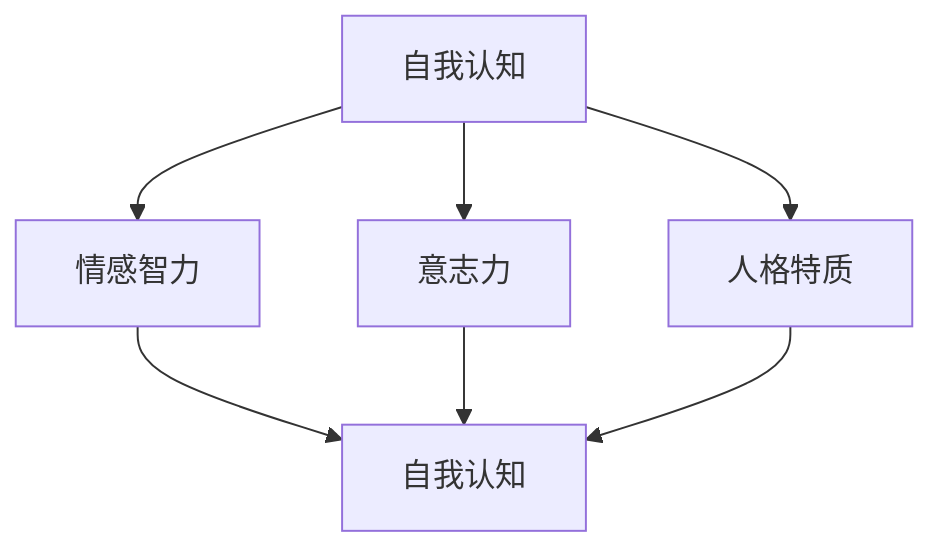
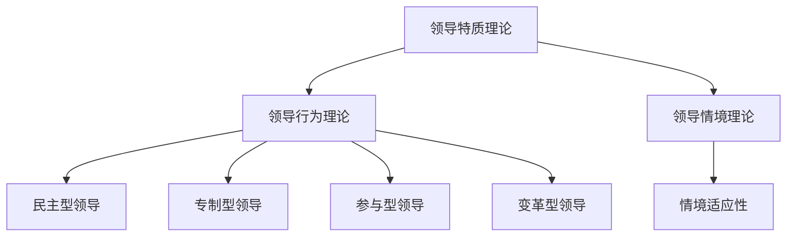

                 

## 文章标题

### 《自我认知提升：了解并发挥领导优势的方法》

---

### 关键词

* 自我认知
* 领导优势
* 领导力
* 情感智力
* 意志力
* 人格特质
* 领导情境理论

---

### 摘要

本文旨在探讨如何通过自我认知的提升来理解和发挥领导优势。我们将从领导力的本质出发，深入分析自我认知的核心要素，以及它们如何影响领导行为和团队管理。文章将涵盖领导优势的理论基础、评估方法、提升策略，并结合实际案例进行深入解析，为读者提供实用的自我提升工具和资源。通过本文的阅读，读者将能够更好地理解自我认知在领导力发展中的作用，掌握提升领导优势的有效方法，从而在职业发展中取得更大的成就。

---

## 第一部分：领导优势的认知基础

### 1.1 领导力的本质与自我认知的关系

领导力是一个多维度的概念，它不仅仅关乎个人的能力和行为，更涉及到领导者对自己和他人的认知。首先，我们需要了解领导力的本质。领导力并不是一种孤立的能力，而是一种系统的能力集合，包括情感智力、决策能力、沟通技巧、团队建设等多个方面。

自我认知是领导力发展的基石。自我认知是指个体对自己内心世界和外在行为的认识和了解。它包括对自己的情感状态、行为动机、价值观等方面的洞察。一个具有高度自我认知的领导者能够更好地理解自己的优势和不足，从而更加有效地发挥领导作用。

在领导力的发展过程中，自我认知起着至关重要的作用。首先，自我认知有助于领导者识别和培养自己的领导优势。通过深入了解自己的情感智力、意志力和人格特质，领导者可以识别出自己在哪些方面具有突出的领导能力。其次，自我认知帮助领导者识别并改善自己的弱点。了解自己的不足之处，领导者可以采取相应的措施进行改进，从而提升整体的领导效果。

此外，自我认知还直接影响领导者的决策和行为。一个具有高度自我认知的领导者能够更加准确地评估风险和机会，做出更加明智的决策。同时，自我认知也有助于领导者建立和维护良好的人际关系，提高团队凝聚力和合作效率。

总之，自我认知是领导力发展的关键。只有通过深入的自我认知，领导者才能更好地发挥自己的优势，改善不足，从而在领导岗位上取得更大的成功。

### 1.2 自我认知的核心要素

自我认知的核心要素包括情感智力、意志力和人格特质。这些要素不仅对领导力的发挥起着至关重要的作用，也是个体在职场和生活中取得成功的关键因素。

**情感智力（Emotional Intelligence）**，简称EQ，是指个体识别、理解和管理自己和他人的情绪的能力。情感智力包括自我认知、自我调节、社交意识和情绪管理等核心能力。一个高情商的领导者能够更好地处理冲突，建立信任，激励团队，并在压力下保持冷静。例如，在团队面临重大挑战时，领导者能够通过情感智力识别团队成员的情绪变化，及时采取有效的沟通和激励措施，从而提高团队的整体表现。

**意志力（Willpower）**，是指个体在追求目标时抵制诱惑、克服困难的能力。意志力对于领导者的决策和执行力至关重要。一个具有坚强意志力的领导者能够坚定地执行决策，即使在面对困难和挑战时也不会轻易放弃。例如，在项目开发过程中，领导者需要保持对项目目标的专注，同时应对各种突发情况和资源限制。具备坚强意志力的领导者能够有效管理时间和资源，确保项目顺利进行。

**人格特质（Personality Traits）**，是指个体在行为和思维上表现出的稳定特征。人格特质包括开放性、责任心、外向性、宜人性等。不同的领导特质对领导效果有着不同的影响。例如，开放性高的领导者倾向于接受新的想法和方法，能够带领团队不断创新；责任心强的领导者能够承担起责任，确保团队任务的完成；外向性的领导者擅长沟通和协调，能够建立良好的人际关系；宜人性的领导者更容易赢得他人的信任和尊重。

**关系架构 Mermaid 流程图**：

通过理解和培养这些核心要素，领导者可以提升自己的自我认知水平，从而更好地发挥领导优势，实现个人和团队的共同成长。

### 1.3 自我认知的提升途径

提升自我认知是一个持续的过程，需要通过多种途径进行实践和探索。以下是几种有效的自我认知提升方法：

**心理咨询**：心理咨询是一种通过专业心理师的帮助，深入了解自我、解决心理问题的方法。通过心理咨询，个体可以探讨自己的情感状态、行为动机和心理需求，从而更全面地认识自己。例如，在咨询过程中，个体可以通过心理师的引导，了解自己在情感智力方面的不足，并学习如何更好地管理自己的情绪。

**自我探索**：自我探索是一种通过自我反思和深度思考，主动了解自己的方法。个体可以通过日记、冥想、写作等方式进行自我探索。例如，通过写日记，个体可以记录自己的情感波动和思考过程，从而更好地理解自己的行为和情绪。

**反思与实践**：反思与实践是将自我认知转化为行动的过程。通过反思，个体可以评估自己的行为和决策，了解其背后的动机和效果。例如，在项目结束后，领导者可以反思项目中的成功和不足，总结经验教训，为未来的决策提供依据。同时，通过实践，个体可以将自我认知应用到实际工作中，不断调整和优化自己的行为模式。

**案例解析**：

假设一位领导者通过心理咨询发现自己在情感智力方面存在不足，特别是处理冲突的能力较弱。在咨询师的指导下，他开始学习情绪管理和冲突解决技巧。在实践过程中，他通过反思每次冲突的处理结果，不断调整自己的策略，逐渐提升了自己的冲突管理能力。同时，他也通过自我探索，发现了自己在决策时容易受情绪影响的问题，并开始练习情绪调节技巧，使自己在面对复杂决策时更加冷静和理性。

通过心理咨询、自我探索和反思实践，领导者可以逐步提升自我认知水平，从而更好地发挥领导优势，实现个人和团队的共同成长。

## 第二部分：领导优势的理论与实践

### 2.1 领导优势的理论模型

领导优势的理论模型主要包括领导特质理论、领导行为理论和领导情境理论。这些理论为理解领导优势提供了不同的视角和框架。

**领导特质理论（Trait Theory）**：领导特质理论认为，领导者具有一系列固有的特质和能力，这些特质和能力是领导成功的关键。该理论的核心观点是，领导者天生具备某些特质，如自信、责任感、领导能力和决策能力等。例如，特质理论研究表明，领导者通常具有高情感智力、坚强的意志力和积极的人格特质。这些特质使他们在面对挑战和压力时能够表现出色。

**领导行为理论（Behavioral Theory）**：领导行为理论关注领导者的具体行为模式，而不是领导者的个人特质。该理论认为，领导者的行为可以影响团队的表现和氛围。领导行为理论提出了不同的领导风格，如民主型领导、专制型领导、参与型领导和变革型领导等。每种领导风格都有其特定的行为特征和适用场景。例如，民主型领导鼓励团队成员参与决策，提高团队的凝聚力和创造力；而变革型领导通过激励和鼓舞团队成员，推动团队实现变革和创新。

**领导情境理论（Contingency Theory）**：领导情境理论认为，领导效果取决于领导者、团队和环境之间的相互作用。该理论强调，没有一种单一的领导风格适用于所有情况。领导者需要根据不同的情境和团队成员的特点，灵活调整自己的领导风格。例如，在团队面临紧迫的截止日期时，领导者可能需要采取更加严厉和专制的风格来确保任务的完成；而在团队需要创新和协作时，领导者则可能需要采取更加民主和参与型的风格，鼓励团队成员发挥各自的潜力。

**关系架构 Mermaid 流�程图**：

通过理解和运用这些领导优势的理论模型，领导者可以更好地识别自己的领导风格，并根据实际情况灵活调整，从而提升领导效果。

### 2.2 领导优势的评估方法

评估领导优势是提升领导力的关键步骤。以下是几种常见的领导优势评估方法：

**自我评估工具**：自我评估是一种领导者通过自我反思和自我评估来识别自己的领导优势和不足的方法。常见的自我评估工具包括360度评估、自我评估问卷和领导能力测评等。通过这些工具，领导者可以了解自己在情感智力、决策能力、团队管理和沟通技巧等方面的表现，从而制定改进计划。

**360度评估**：360度评估是一种综合评估方法，通过收集来自上级、同事、下属和客户等多方面的反馈，全面评估领导者的表现。这种方法有助于领导者了解自己在不同角色和情境下的优势和不足，从而进行有针对性的提升。

**领导能力测评**：领导能力测评是一种通过标准化测试和评估工具，评估领导者各项能力的量化方法。常见的领导能力测评包括情境测试、行为描述测试和性格测试等。这些测评可以帮助领导者识别自己的强项和弱项，为领导力发展提供科学依据。

**综合运用**：将自我评估、360度评估和领导能力测评相结合，可以更全面、准确地评估领导优势。例如，领导者可以通过自我评估了解自己的自我认知情况，通过360度评估了解他人的反馈，通过领导能力测评了解自己的量化表现。通过综合运用这些评估方法，领导者可以形成一套全面的自我认知体系，为领导力提升提供有力支持。

### 2.3 领导优势的发挥策略

要充分发挥领导优势，领导者需要掌握一系列有效的策略。以下是几种常见的发挥领导优势的方法：

**建立信任**：信任是领导力的基石。领导者需要通过言行一致、透明沟通和诚信来建立和维护信任。例如，领导者可以定期与团队成员进行沟通，分享项目进展和挑战，鼓励团队成员提出建议和反馈。

**激励团队**：激励是推动团队前进的动力。领导者可以通过认可和奖励优秀表现，激发团队成员的积极性和创造力。例如，在项目取得重大进展时，领导者可以组织庆祝活动，表彰团队成员的贡献。

**应对冲突**：冲突是团队中不可避免的现象。领导者需要具备处理冲突的能力，通过倾听、沟通和妥协，找到解决问题的方法。例如，在团队内部出现意见分歧时，领导者可以组织讨论会，让双方表达观点，找到共识。

**领导者的自我提升**：领导者需要不断学习和成长，通过参加培训、阅读书籍和反思实践，提升自己的领导能力和自我认知。例如，领导者可以定期参加领导力培训课程，学习最新的领导理论和管理技巧。

通过以上策略，领导者可以充分发挥自己的领导优势，提升团队的整体绩效，实现组织目标。

## 第三部分：领导力提升的项目实践

### 3.1 领导力培训项目设计

设计一个有效的领导力培训项目是提升领导者能力和团队绩效的关键。以下是设计领导力培训项目的几个关键步骤：

**项目目标设定**：首先，需要明确培训项目的目标。这些目标应包括提升领导者的自我认知、增强领导能力、提高团队凝聚力和工作效率等。例如，项目目标可以是“通过为期三个月的培训，使领导者提高情感智力，增强决策能力，并在团队中建立信任和协作氛围”。

**培训内容规划**：根据项目目标，设计具体的培训内容。内容应涵盖领导特质理论、领导行为理论、领导情境理论、情感智力、意志力、人格特质等多个方面。例如，培训内容可以包括领导力讲座、案例分析、角色扮演、团队建设活动等。

**培训效果评估**：为了确保培训的有效性，需要设计评估机制。效果评估可以通过问卷调查、360度评估、绩效评估等方式进行。评估结果可以帮助了解培训目标的实现情况，并为后续培训提供反馈和改进建议。

**案例解析**：

假设一家企业决定开展为期三个月的领导力培训项目，目标是提升领导者的情感智力和决策能力。培训内容设计如下：

- **第一周**：领导特质理论和领导行为理论的基础知识介绍。
- **第二周**：情感智力的评估和提升方法，包括自我认知、情绪管理和情绪智力测试。
- **第三周**：决策能力的培训，包括决策模型、风险评估和决策策略。
- **第四周**：团队建设和领导力实践，通过角色扮演和团队建设活动，提升领导者的实际应用能力。

在培训过程中，通过问卷调查和360度评估，收集领导者的自我评估和他人反馈。项目结束时，通过绩效评估，了解领导者在实际工作中的表现。评估结果显示，领导者们在情感智力和决策能力方面有了显著提升，团队凝聚力和工作效率也有所提高。

通过以上步骤，企业可以设计出有效的领导力培训项目，帮助领导者提升自我认知和领导能力，从而推动组织的整体发展。

### 3.2 领导力提升案例分析

#### 案例一：从新手到领导者的转变

李明是一名软件工程师，他在公司工作了五年后，因为表现出色被提拔为项目主管。然而，他很快就发现，作为领导者，他面临的是全新的挑战。

**挑战**：李明在担任项目主管后，发现自己在团队管理、沟通和决策方面存在不足。他难以平衡团队成员的需求和项目目标，导致项目进展缓慢，团队士气低落。

**解决方案**：李明决定通过领导力培训来提升自己的能力。他参加了公司组织的领导力培训项目，学习了领导特质理论、领导行为理论和情感智力等知识。通过自我反思和实际应用，他逐渐掌握了应对团队冲突和激励员工的方法。

**结果**：经过几个月的培训和实践，李明的领导能力有了显著提升。他能够更好地管理团队，提高了项目的进展速度和团队士气。最终，他的团队完成了多个重要项目，得到了公司高层的高度评价。

**结论**：通过案例一可以看出，新手领导者通过系统的培训和实践，可以提升自己的领导能力，从而在新的岗位上取得成功。

#### 案例二：领导优势在危机管理中的应用

张华是一家大型公司的营销总监，他在一次市场危机中展现了卓越的领导优势。

**背景**：由于市场变化和竞争对手的竞争策略，张华所在的公司遭遇了销售额大幅下降的危机。公司内部出现了恐慌和混乱，员工士气低落。

**解决方案**：张华首先通过冷静的分析，明确了问题的根源和影响范围。然后，他采取了一系列措施来稳定局势，包括与团队成员沟通、制定应对策略、调整营销策略等。

**结果**：在张华的领导下，公司迅速恢复了市场地位，销售额开始回升。团队成员也重新振作，士气高涨。

**结论**：案例二表明，领导优势在危机管理中起着至关重要的作用。通过冷静分析和有效沟通，领导者可以稳定局势，带领团队走出困境。

#### 案例三：跨文化领导的优势发挥

王强是一家跨国公司的亚洲区总裁，他在跨文化领导中展现了独特的优势。

**背景**：王强所在的公司在亚洲市场的业务扩展迅速，但不同国家和地区的文化差异给管理带来了巨大挑战。

**解决方案**：王强通过深入了解各国的文化特点，制定了差异化的管理策略。他尊重各国员工的文化背景，鼓励员工参与决策，建立了开放和包容的工作氛围。

**结果**：在王强的领导下，公司的亚洲业务取得了显著增长，员工满意度也大幅提升。

**结论**：跨文化领导的优势在于能够理解和尊重不同文化的差异，建立和谐的工作环境，从而推动业务发展。

通过以上案例，我们可以看到领导优势在不同情境下的应用和效果。领导者通过系统的培训和实际应用，可以不断提升自己的能力，在职业发展中取得更大的成就。

### 3.3 领导力提升工具与资源

提升领导力不仅需要理论学习和实践应用，还需要借助工具和资源。以下是一些常用的领导力提升工具和资源：

**领导力书籍推荐**：

1. 《领导力的五个层次》（The Five Levels of Leadership）- 雷蒙德·A·基斯
2. 《非暴力沟通》（Nonviolent Communication）- 马歇尔·卢森堡
3. 《领导者的语言》（The Language of Leaders）- 乔·吉拉德

**在线领导力课程资源**：

1. Coursera - 提供各种领导力和管理课程，如《管理心理学》、《领导力与决策》等。
2. edX - 提供由知名大学和机构开设的领导力课程，如《领导力与个人发展》、《创新与创业管理》等。

**领导力工具使用指南**：

1. **360度评估工具**：如Lumity、Review360等，帮助领导者获取全方位的反馈。
2. **情感智力评估工具**：如EQ-i 2.0、MEQPI等，帮助领导者了解自己在情感智力方面的表现。
3. **领导力发展计划工具**：如SAP SuccessFactors、Taleo等，帮助制定和跟踪个人和团队的发展计划。

通过利用这些工具和资源，领导者可以更有效地提升自己的领导力，实现个人和团队的目标。

## 第四部分：领导优势提升的挑战与未来趋势

### 4.1 领导优势提升的挑战

提升领导优势面临诸多挑战，这些挑战不仅影响领导者的个人发展，也影响到整个组织的绩效。以下是几个主要挑战：

**快速变化的工作环境**：现代社会变化迅速，新技术、新理念和新的工作模式不断涌现，领导者需要不断学习和适应。例如，人工智能和自动化技术的普及对传统管理模式提出了挑战，领导者需要具备技术敏感性，能够引领团队适应变革。

**多元化团队的管理**：现代组织越来越多元化，团队成员来自不同的文化背景、年龄段和专业领域。领导者需要理解和尊重这些差异，建立包容性的工作环境，发挥每个成员的潜力。例如，在跨文化团队中，领导者需要具备跨文化沟通能力，能够有效协调不同文化背景的团队成员。

**领导者心理健康**：领导压力和管理责任往往导致领导者面临心理健康的挑战。长期的压力可能导致焦虑、抑郁等心理问题，影响领导者的决策能力和工作效率。例如，一些领导者可能因为工作压力而出现失眠、焦虑等症状，从而影响团队的表现。

### 4.2 领导优势提升的未来趋势

随着社会的不断进步和技术的发展，领导优势的提升也将迎来新的趋势和机遇。以下是几个未来趋势：

**技术进步对领导力的影响**：人工智能、大数据、物联网等技术的发展，正在改变领导力的内涵和方式。领导者需要具备技术洞察力和创新思维，能够引领团队探索和应用新技术。例如，通过数据分析，领导者可以更准确地了解团队绩效和员工需求，从而制定更有效的管理策略。

**人工智能与领导力的结合**：人工智能在领导力领域的应用日益广泛，如智能助手、情感识别和自动化决策等。领导者可以利用人工智能工具提升工作效率，优化决策过程。例如，智能助手可以帮助领导者管理日程、处理邮件，从而释放更多时间用于战略思考和团队沟通。

**跨学科领导力的兴起**：未来领导力将更加注重跨学科的知识和技能。领导者需要具备多学科背景，能够整合不同领域的知识，解决复杂问题。例如，在创新项目中，领导者需要具备技术、商业和人文等多个领域的知识，从而推动项目的成功。

### 4.3 案例解析

**案例：技术创新领导者的挑战与机遇**

张伟是一名技术创新领导者，他所在的科技公司致力于开发人工智能解决方案。面对快速变化的工作环境，他面临以下挑战：

- **技术变革**：人工智能技术的快速进步，使得张伟需要不断学习新的技术趋势和解决方案。
- **团队管理**：团队成员来自不同专业背景，包括数据科学家、软件工程师和产品经理，张伟需要理解和尊重这些差异，建立高效的合作机制。
- **心理健康**：高强度的技术压力和工作要求，可能导致张伟面临心理健康挑战。

为了应对这些挑战，张伟采取了以下策略：

- **技术学习**：定期参加人工智能相关的培训和研讨会，保持技术敏感性。
- **团队建设**：通过跨部门协作和团队建设活动，增强团队凝聚力，提升合作效率。
- **心理健康管理**：采用时间管理和压力缓解技巧，保持身心健康。

通过以上策略，张伟不仅成功地推动了技术创新，还提升了团队的绩效和士气。这个案例表明，面对挑战，领导者需要具备持续学习和适应变化的能力，同时关注团队和个人的心理健康。

## 附录：领导优势提升资源与工具指南

### 5.1 领导力书籍推荐

1. **《领导力的五个层次》** - 雷蒙德·A·基斯
2. **《非暴力沟通》** - 马歇尔·卢森堡
3. **《领导者的语言》** - 乔·吉拉德
4. **《领导力：策略与实践》** - 彼得·德鲁克
5. **《变革型领导》** - 约翰·肯尼迪

### 5.2 在线领导力课程资源

1. **Coursera** - 提供由全球顶级大学和机构开设的领导力课程，如斯坦福大学《领导力与决策》。
2. **edX** - 提供哈佛大学、麻省理工学院等知名大学开设的领导力课程，如《领导力与个人发展》。
3. **LinkedIn Learning** - 提供实用的领导力培训和指导，涵盖沟通技巧、团队管理等多个方面。

### 5.3 领导力工具使用指南

1. **360度评估工具** - 如Lumity、Review360，帮助领导者获取全方位的反馈。
2. **情感智力评估工具** - 如EQ-i 2.0、MEQPI，帮助领导者了解自己在情感智力方面的表现。
3. **领导力发展计划工具** - 如SAP SuccessFactors、Taleo，帮助制定和跟踪个人和团队的发展计划。

通过利用这些书籍、课程和工具，领导者可以全面提升自己的领导能力，实现个人和组织的共同成长。

---

### 作者信息

作者：AI天才研究院/AI Genius Institute & 禅与计算机程序设计艺术 /Zen And The Art of Computer Programming

