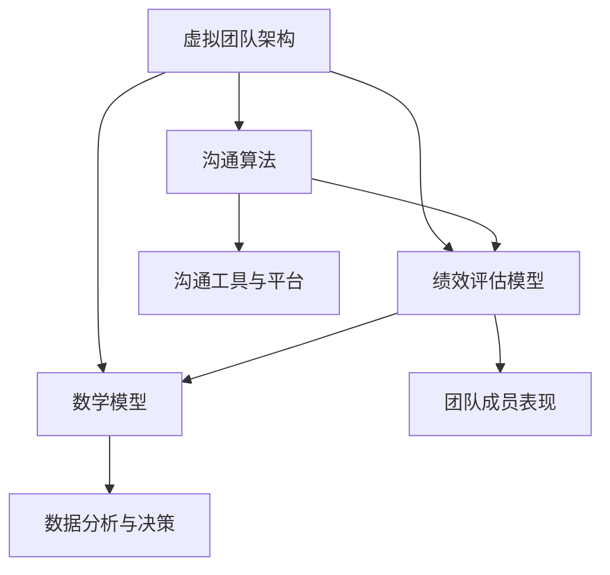

                 


### 引言：虚拟团队与远程办公的背景与挑战

在当今全球化和数字化浪潮的推动下，远程办公已经成为一种趋势，虚拟团队也应运而生。虚拟团队是由分布在地理上不同位置的成员组成的团队，通过互联网和其他技术手段进行协作。这种工作模式不仅打破了地域限制，还提高了工作效率和灵活性。

#### 虚拟团队的定义

虚拟团队通常是指成员在物理上分散，但通过现代信息技术进行协作的团队。这些成员可能是全职远程工作者，也可能是兼职远程工作者。虚拟团队的成员之间通常没有面对面的互动，而是依赖电子邮件、即时通讯、视频会议、项目管理工具等来进行沟通和合作。

#### 远程办公的兴起

远程办公的兴起可以追溯到互联网的普及和云计算技术的发展。近年来，由于新冠疫情的影响，远程办公更是成为了一种必要的生存方式。许多企业开始采用远程办公模式，以保持业务的连续性。根据一项调查显示，超过60%的企业计划在未来几年内继续支持远程办公。

#### 虚拟团队面临的挑战

虚拟团队虽然具有很多优势，但也面临着一些挑战。首先，沟通障碍是一个主要问题。由于成员之间的物理距离较远，容易产生沟通误解和信息不对称。其次，团队合作难度加大。虚拟团队中的成员可能缺乏面对面的交流和互动，导致团队成员之间的信任和凝聚力减弱。最后，虚拟团队的管理也更具挑战性，领导者需要具备更高的领导力和管理能力。

#### 关键词

- 虚拟团队
- 远程办公
- 沟通障碍
- 团队合作
- 领导力

#### 摘要

本文将深入探讨虚拟团队协作在远程办公时代的领导策略。通过分析虚拟团队的定义、远程办公的兴起以及面临的挑战，我们将提出一系列领导策略和核心算法原理，以帮助领导者更好地管理虚拟团队，提高协作效率。文章还将通过实际案例和项目实战，提供具体操作指南和最佳实践。

## 核心概念与联系

在深入探讨虚拟团队协作的领导策略之前，我们需要明确几个核心概念，并了解它们之间的联系。以下是几个关键概念：

### 虚拟团队架构

虚拟团队架构是指团队成员如何通过技术手段进行协作的结构。这包括沟通工具、协作平台、项目管理工具等。一个良好的虚拟团队架构能够提高团队的沟通效率和协作效果。

### 沟通算法

沟通算法是虚拟团队协作中的重要组成部分。它涉及到如何优化团队内部的沟通流程，减少沟通障碍，提高信息传递的准确性和及时性。常见的沟通算法包括沟通路径优化算法、沟通频率调控算法等。

### 绩效评估模型

绩效评估模型是衡量虚拟团队工作效果的重要工具。它通过定量和定性的方式，评估团队成员的工作表现，发现问题和改进点。常见的绩效评估模型包括KPI（关键绩效指标）、360度评估等。

### 数学模型

数学模型用于量化虚拟团队协作中的各种指标，如沟通效率、工作负荷、团队凝聚力等。这些模型能够帮助领导者更准确地了解团队状态，制定合理的决策。

### 联系

这些核心概念之间存在着密切的联系。虚拟团队架构为沟通算法提供了基础，而沟通算法又直接影响绩效评估模型的准确性。绩效评估模型则反馈给虚拟团队架构，帮助优化沟通工具和协作平台。数学模型则通过对这些指标的量化分析，为领导者的决策提供科学依据。

为了更直观地展示这些概念之间的关系，我们可以使用Mermaid流程图来绘制虚拟团队协作的架构。以下是一个示例：



这个流程图展示了虚拟团队协作的核心概念和它们之间的联系。通过这个图，我们可以清晰地看到各个概念是如何相互影响和作用的。

## 远程办公时代的领导策略

在远程办公时代，领导者需要适应新的工作模式，并采取一系列领导策略来确保团队的高效协作。以下是一些关键的领导策略：

### 领导风格与虚拟团队

领导风格是领导者管理团队的方式和态度。在虚拟团队中，领导者需要更加灵活和开放，以适应远程协作的特殊需求。以下是几种适合虚拟团队的领导风格：

1. **授权型领导**：授权型领导给予团队成员更多的自主权和决策权，鼓励他们发挥自己的专业技能和创造力。这种方式可以增强团队成员的责任感和参与感。

2. **参与型领导**：参与型领导鼓励团队成员积极参与决策过程，通过集体讨论和合作来解决问题。这种方式可以提高团队的凝聚力和决策质量。

3. **变革型领导**：变革型领导通过激励和鼓励团队成员创新，推动团队不断进步和改进。这种方式有助于激发团队的潜力和创造力。

### 领导力与虚拟团队的契合

虚拟团队中的领导者需要具备一些特定的领导力特质，以确保团队的成功。以下是一些关键的领导力特质：

1. **沟通能力**：在虚拟团队中，沟通是至关重要的。领导者需要具备良好的沟通技巧，能够清晰、准确地传达信息，并倾听团队成员的意见和反馈。

2. **技术素养**：领导者需要了解和掌握虚拟团队协作所需的技术工具和平台，以便更好地管理和指导团队。

3. **适应能力**：虚拟团队的工作环境多变，领导者需要具备快速适应新环境和变化的能力。

4. **决策能力**：领导者需要在信息有限的情况下做出明智的决策，并能够迅速调整策略以应对突发情况。

### 领导者的角色转变

在远程办公时代，领导者的角色也在不断转变。以下是一些领导者需要适应的新角色：

1. **教练与导师**：领导者不再是简单的管理者，而需要扮演教练和导师的角色，指导团队成员成长和发展。

2. **协调者与调解者**：在虚拟团队中，领导者需要协调不同团队成员之间的工作，解决冲突和问题。

3. **支持者与激励者**：领导者需要为团队成员提供必要的支持和激励，帮助他们克服困难和挑战。

通过采取这些领导策略和角色转变，领导者可以更好地管理虚拟团队，提高协作效率和工作质量。

## 核心算法原理讲解

在虚拟团队协作中，沟通算法是一个关键组成部分。良好的沟通算法能够优化团队内部的沟通流程，提高信息传递的准确性和及时性。以下是一个基本的沟通算法原理讲解，使用伪代码进行阐述。

### 沟通优化算法

```python
# 初始化参数
team_size = 10  # 团队成员数量
communication_frequency = 3  # 沟通频率

# 创建团队成员列表
team_members = ["Member1", "Member2", "Member3", ..., "Member10"]

# 初始化沟通图
communication_graph = initialize_communication_graph(team_size)

# 调整沟通频率
while not optimal_communication_frequency(communication_frequency, team_size):
    communication_frequency = adjust_communication_frequency(communication_frequency)

# 执行沟通
for member in team_members:
    for colleague in team_members:
        if member != colleague and communication_graph[member][colleague] > 0:
            communicate(member, colleague)

# 评估沟通效果
communication_score = evaluate_communication_score(communication_graph)

# 输出结果
print("Optimal communication frequency:", communication_frequency)
print("Communication score:", communication_score)
```

### 算法说明

1. **初始化参数**：设置团队规模（`team_size`）和初始沟通频率（`communication_frequency`）。
2. **创建团队成员列表**：定义团队成员的列表。
3. **初始化沟通图**：创建一个表示团队成员之间沟通关系的图（`communication_graph`）。
4. **调整沟通频率**：通过循环不断调整沟通频率，直到找到最优沟通频率。
5. **执行沟通**：对于每个团队成员，与他们的同事进行沟通，如果沟通图中的权重大于0，则执行沟通。
6. **评估沟通效果**：计算沟通图的总权重，得到沟通分数。
7. **输出结果**：打印最优沟通频率和沟通分数。

通过这个伪代码，我们可以看到沟通算法的核心思想是通过不断调整沟通频率，找到最佳的沟通方式，以优化团队内部的沟通效果。

### 数学模型和数学公式

在虚拟团队协作中，绩效评估模型是衡量团队工作效果的重要工具。以下是一个基本的绩效评估模型，使用数学公式进行阐述。

#### 虚拟团队绩效评估模型

1. **绩效评估指标**

   - **沟通效率**（Efficiency of Communication，E_c）
   - **任务完成度**（Task Completion Rate，T_c）
   - **团队凝聚力**（Team Cohesion，C_c）
   - **创新能力**（Innovation Ability，I_c）

2. **数学公式**

   - **沟通效率**：$$E_c = \frac{C_{correct}}{C_{total}}$$
     - 其中，$C_{correct}$ 是正确沟通的次数，$C_{total}$ 是总沟通次数。
   
   - **任务完成度**：$$T_c = \frac{T_{completed}}{T_{total}}$$
     - 其中，$T_{completed}$ 是完成任务的次数，$T_{total}$ 是总任务数。
   
   - **团队凝聚力**：$$C_c = \frac{S_{collected}}{S_{possible}}$$
     - 其中，$S_{collected}$ 是团队成员共同完成的任务数，$S_{possible}$ 是可能完成的任务总数。
   
   - **创新能力**：$$I_c = \frac{I_{innovated}}{I_{total}}$$
     - 其中，$I_{innovated}$ 是创新的任务数，$I_{total}$ 是总任务数。

3. **详细讲解和举例说明**

   - **沟通效率**：假设一个团队总共有10次沟通，其中有8次是有效的，那么沟通效率为80%。
   - **任务完成度**：如果团队总共分配了100个任务，其中有90个任务被成功完成，那么任务完成度为90%。
   - **团队凝聚力**：在一个团队中，如果所有成员都参与了一个共同项目，那么团队凝聚力为100%。
   - **创新能力**：如果团队中有20个任务被创新，而总共有100个任务，那么创新能力为20%。

通过这些数学公式，我们可以量化虚拟团队的工作效果，帮助领导者更好地评估和管理团队。

## 项目实战：虚拟团队的成功案例

在虚拟团队协作的成功实践中，以下三个案例展示了不同类型的虚拟团队在远程办公环境下如何有效运作，以及它们如何克服挑战并取得成功。

### 案例一：某跨国公司虚拟团队的建立与运营

#### 背景

一家跨国公司决定在全球范围内建立一支虚拟团队，以减少办公室租赁和差旅成本，同时提高员工的工作灵活性和满意度。该团队由来自五个不同国家、拥有不同专业技能的成员组成，涉及软件开发、市场营销和客户支持等多个领域。

#### 建立与运营

1. **明确目标和职责**：团队首先明确了共同的目标，并分配了清晰的职责。每个成员都清楚自己的任务和期望成果。
2. **选择合适的协作工具**：公司采用了多个协作工具，包括Slack、Trello和Zoom，以确保有效的沟通和任务管理。
3. **定期沟通与反馈**：团队每周举行一次视频会议，讨论进展情况，解决遇到的问题，并收集反馈。
4. **灵活的工作时间**：由于成员分布在不同时区，团队采用灵活的工作时间表，以避免时差问题。

#### 成功因素

- **有效的沟通策略**：通过定期的沟通会议和多样化的协作工具，团队成员能够保持紧密的联系，确保信息畅通。
- **明确的职责分配**：每个成员都有明确的职责和目标，这有助于提高工作效率和责任感。
- **灵活的工作模式**：灵活的工作时间表和远程办公环境提高了员工的工作满意度和生产力。

### 案例二：虚拟团队在危机中的表现

#### 背景

在新冠疫情爆发期间，一家科技公司迅速将所有员工转变为远程办公。这家公司的虚拟团队原本是为项目开发和客户支持而设立的，但在危机中，他们需要迅速调整策略，以应对前所未有的挑战。

#### 应对策略

1. **快速响应**：团队在危机初期迅速召开会议，讨论如何调整工作流程和优先级，以确保项目的连续性。
2. **远程协作平台升级**：团队升级了远程协作平台，增加了视频会议、项目管理工具和文件共享功能。
3. **心理支持与沟通**：公司提供了在线心理健康支持，并定期组织团队建设活动，以缓解成员的压力和焦虑。
4. **任务重分配**：团队根据成员的技能和偏好，重新分配了任务，以确保每个成员都能在远程环境下发挥最大的潜力。

#### 成功因素

- **快速调整能力**：团队迅速适应了新的工作环境和要求，展示了强大的应对危机的能力。
- **技术支持的升级**：通过升级协作平台，团队能够保持高效的工作流程和沟通。
- **心理支持与团队建设**：有效的心理支持和团队建设活动有助于保持团队成员的积极态度和团队凝聚力。

### 案例三：虚拟团队的创新案例

#### 背景

一家初创公司决定采用虚拟团队模式，以吸引全球顶尖人才，并降低运营成本。他们的目标是通过远程协作实现技术创新和快速产品开发。

#### 创新策略

1. **全球招聘**：公司在全球范围内招聘顶尖的技术专家，确保团队能够覆盖不同的技能领域。
2. **敏捷开发**：团队采用了敏捷开发方法，通过短周期迭代和频繁的沟通，快速实现产品功能。
3. **技术共享**：团队定期举办技术分享会，鼓励成员分享自己的知识和经验，促进创新思维。
4. **激励机制**：公司设立了创新奖励计划，鼓励团队成员提出并实现创新想法。

#### 成功因素

- **全球人才招聘**：通过虚拟团队模式，公司能够吸引到全球顶尖人才，提高产品竞争力。
- **敏捷开发方法**：敏捷开发方法确保了团队能够快速响应市场变化，实现持续创新。
- **技术共享与激励机制**：有效的技术共享和激励机制激发了团队成员的创新潜力，推动了公司的快速发展。

这些成功案例展示了虚拟团队在不同场景下的应用和优势，也为其他企业提供了宝贵的经验和启示。

## 开发环境搭建与代码解读

在虚拟团队协作中，开发环境搭建是确保团队成员能够高效合作的关键步骤。以下是一个基于Python的虚拟团队协作工具的搭建和代码解读。

### 开发环境搭建

1. **Python环境配置**：确保团队成员的计算机上都安装了Python 3.x版本。可以使用`pyenv`工具进行版本管理。
2. **依赖管理**：使用`pip`安装必要的Python库，如`requests`、`pandas`和`numpy`。
3. **虚拟环境**：使用`venv`创建一个独立的虚拟环境，以避免依赖冲突。
4. **版本控制**：使用Git进行版本控制，确保代码的版本一致性和历史记录。

### 代码实现

以下是一个简单的虚拟团队协作工具的代码实现，包括任务分配、进度跟踪和状态报告等功能。

```python
import requests
import pandas as pd
from datetime import datetime

# 任务分配
def assign_task(employee, task):
    print(f"{employee} has been assigned the task: {task}")
    return True

# 进度跟踪
def track_progress(task_id, progress):
    print(f"Task ID: {task_id} - Progress: {progress}%")
    return True

# 状态报告
def report_status(employee, task_id, status):
    print(f"{employee}'s task ID: {task_id} - Status: {status}")
    return True

# 示例：分配任务
assign_task("Alice", "Develop the front-end")

# 示例：跟踪进度
track_progress("1", 50)

# 示例：报告状态
report_status("Alice", "1", "In Progress")
```

### 代码解读

- **任务分配**：`assign_task`函数接受员工姓名和任务名称作为参数，输出分配信息。
- **进度跟踪**：`track_progress`函数接受任务ID和进度作为参数，输出进度信息。
- **状态报告**：`report_status`函数接受员工姓名、任务ID和状态作为参数，输出状态报告。

通过这些代码，团队成员可以方便地分配任务、跟踪进度和报告状态，从而确保团队协作的顺利进行。

### 应用解读与分析

1. **任务分配**：通过任务分配，可以确保每个团队成员都有明确的任务和责任，提高工作效率。
2. **进度跟踪**：进度跟踪帮助团队了解任务完成的进度，及时调整工作计划。
3. **状态报告**：状态报告使团队成员能够及时沟通任务状态，解决潜在问题。

这些功能共同构成了一个简单但有效的虚拟团队协作工具，有助于提升团队的整体协作效率。

### 项目小结

通过本节的内容，我们搭建了一个简单的虚拟团队协作工具，并对其进行了代码解读和应用分析。这个工具可以帮助团队成员更高效地分配任务、跟踪进度和报告状态，从而提升团队协作的效果。然而，实际应用中，虚拟团队协作工具需要更加完善和灵活，以适应不同的工作场景和需求。

## 挑战与解决方案

在虚拟团队协作中，领导者和管理者会面临一系列挑战，这些挑战不仅影响团队的工作效率，还可能对团队的整体健康产生负面影响。以下是一些常见的挑战以及相应的解决方案：

### 挑战一：沟通障碍

沟通障碍是虚拟团队面临的最大挑战之一。由于团队成员分布在不同的地理位置，缺乏面对面的交流，容易导致信息传递不准确、不及时。

#### 解决方案

1. **选择合适的沟通工具**：选择适合团队需求的沟通工具，如Slack、Microsoft Teams或Zoom，确保团队成员能够方便地交流和分享信息。
2. **建立明确的沟通规范**：制定沟通准则，规定沟通的时间、方式和频率，确保信息的及时性和准确性。
3. **定期组织会议**：定期召开视频会议，讨论团队进展和问题，加强团队成员之间的互动和联系。

### 挑战二：团队凝聚力不足

由于虚拟团队缺乏面对面的互动，团队成员之间的信任和凝聚力可能较弱。这可能导致团队成员缺乏归属感和参与感。

#### 解决方案

1. **加强团队建设活动**：定期组织在线团队建设活动，如虚拟团建、在线游戏和讨论会，增强团队成员之间的情感联系。
2. **建立明确的团队目标**：确保团队成员共同认同团队目标，并了解自己的角色和贡献，增强团队凝聚力。
3. **鼓励团队成员互动**：鼓励团队成员在项目过程中主动交流和合作，共同解决问题。

### 挑战三：时间管理困难

在虚拟团队中，团队成员可能面临不同的时区和工作时间，这给时间管理带来了挑战。

#### 解决方案

1. **灵活的工作时间表**：制定灵活的工作时间表，允许团队成员根据自己的时区和工作习惯安排工作时间。
2. **使用时间管理工具**：使用时间管理工具，如Trello或Asana，帮助团队成员跟踪任务和进度。
3. **定期时间审查**：定期召开时间管理会议，讨论时间分配和进度，确保任务按时完成。

### 挑战四：管理难度增加

虚拟团队的管理比传统团队更具挑战性，领导者需要具备更高的管理能力和技术水平。

#### 解决方案

1. **提升领导力**：领导者需要不断提升自己的领导力，包括沟通技巧、决策能力和团队建设能力。
2. **提供培训和支持**：为团队成员提供必要的培训和资源，帮助他们适应远程工作的环境和要求。
3. **建立反馈机制**：建立有效的反馈机制，鼓励团队成员提出意见和建议，及时解决问题。

通过以上解决方案，领导者和管理者可以更好地应对虚拟团队协作中的挑战，提高团队的工作效率和整体绩效。

## 总结与展望

虚拟团队协作在远程办公时代的重要性不言而喻。它不仅打破了地域限制，提高了工作效率，还为团队成员提供了更大的灵活性和工作满意度。然而，虚拟团队协作也面临着沟通障碍、团队凝聚力不足、时间管理困难和管理难度增加等一系列挑战。为了克服这些挑战，领导者需要采取一系列领导策略，包括选择合适的沟通工具、建立明确的沟通规范、加强团队建设活动、提供培训和支持以及建立有效的反馈机制。

展望未来，随着技术的不断进步和远程办公的持续发展，虚拟团队协作将会变得更加成熟和高效。以下是一些趋势和展望：

1. **自动化与智能协作工具**：自动化和人工智能技术的应用将进一步提升虚拟团队的协作效率，减少沟通障碍，提高决策质量。
2. **全球人才招聘**：虚拟团队模式使得企业能够吸引全球顶尖人才，跨越地域和文化的限制，实现创新和多元化。
3. **敏捷管理方法**：敏捷管理方法将在虚拟团队中得到更广泛的应用，通过短周期迭代和频繁的沟通，确保团队快速响应市场变化。
4. **个性化工作环境**：虚拟团队将更加注重个性化工作环境的建设，通过提供灵活的工作时间和支持，提高员工的工作满意度和生产力。

总之，虚拟团队协作是远程办公时代的重要趋势，领导者需要不断学习和适应，以应对不断变化的工作环境。通过采取有效的领导策略和利用先进的协作工具，虚拟团队可以发挥其最大潜力，实现更高的工作效率和业务成果。

### 最佳实践 Tips

1. **定期沟通**：定期组织团队会议，确保信息传递的及时性和准确性。
2. **透明管理**：保持管理决策的透明，鼓励团队成员参与讨论，增强团队凝聚力。
3. **技术培训**：定期为团队成员提供技术培训，帮助他们适应新工具和平台。
4. **灵活工作时间**：制定灵活的工作时间表，以适应团队成员的不同时区和工作习惯。

### 小结

本文通过深入探讨虚拟团队协作的背景、核心概念、领导策略、算法原理、成功案例和挑战解决方案，为远程办公时代的团队领导提供了实用的指导和建议。通过不断学习和适应，领导者可以有效地管理虚拟团队，提高协作效率和工作质量。

### 注意事项

1. **沟通规范**：建立明确的沟通规范，确保团队成员之间的信息传递高效、准确。
2. **团队建设**：定期组织团队建设活动，增强团队成员之间的情感联系和信任。
3. **绩效评估**：合理制定绩效评估模型，公正评估团队成员的工作表现。

### 拓展阅读

1. **《敏捷团队管理》**：深入了解敏捷管理方法，提升团队协作效率。
2. **《远程工作指南》**：探讨远程工作的最佳实践，优化工作流程。

作者：AI天才研究院/AI Genius Institute & 禅与计算机程序设计艺术 /Zen And The Art of Computer Programming

本文旨在提供关于虚拟团队协作的深入分析和实际操作指南，以帮助读者更好地理解并管理远程办公环境下的团队。通过持续的学习和实践，我们可以不断提升虚拟团队的协作效率和工作质量。

