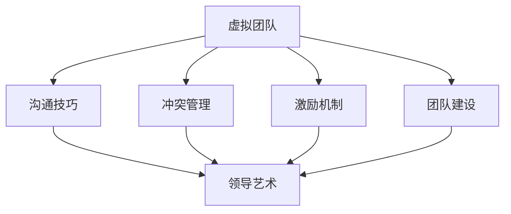

                 

## 引言

在当今数字化时代，虚拟团队管理已经成为企业运营和组织协作的重要形式。虚拟团队不仅跨越了地理和时区的限制，还包括了不同文化、语言和专业背景的成员。随着远程工作模式和企业全球化趋势的不断发展，如何有效地管理虚拟团队成为了一个关键挑战。

### 1.1 虚拟团队管理概述

虚拟团队管理是指通过技术和工具，协调和引导分布在不同的地理位置和工作时间内的团队成员，共同完成项目或任务。与传统团队管理不同，虚拟团队的管理需要考虑成员之间的距离、时间差、文化差异以及技术平台的使用。

### 1.2 本书结构

本书旨在提供一套完整的虚拟团队管理方法论，帮助领导者和管理者应对各种挑战。本书的结构如下：

- **第1章 引言**：介绍虚拟团队管理的背景和重要性。
- **第2章 核心概念与联系**：通过Mermaid流程图展示虚拟团队管理的核心概念和它们之间的联系。
- **第3章 团队动态与时空挑战**：讨论虚拟团队在不同时空背景下面临的动态挑战。
- **第4章 领导艺术**：深入探讨虚拟团队管理中领导者所需的特殊技能和策略。
- **第5章 技术工具与平台**：介绍支持虚拟团队协作的技术工具和平台。
- **第6章 项目实战**：提供实际的虚拟团队管理案例，包括挑战、解决方案和成果分析。
- **第7章 挑战与未来展望**：讨论虚拟团队管理中存在的问题和未来的发展方向。

通过以上章节的逐步分析，读者将能够全面了解虚拟团队管理的各个方面，掌握有效的管理技巧，提升团队协作效率。

---

**关键词**：虚拟团队管理、时空挑战、领导艺术、技术工具、项目实战

**摘要**：本书深入探讨了虚拟团队管理的核心概念、动态挑战、领导艺术以及技术工具。通过提供实际案例和详细分析，读者将掌握虚拟团队管理的有效策略，提升团队协作能力，应对数字化时代下的各种挑战。

---

# 核心概念与联系

在虚拟团队管理中，理解核心概念并构建它们之间的联系是至关重要的。这有助于领导者和管理者有效地引导团队，提高协作效率。在本章中，我们将通过Mermaid流程图展示虚拟团队管理的核心概念及其相互关系。

### 2.1 虚拟团队的概念

虚拟团队是指由地理位置分散、工作时间和工作内容灵活的成员组成的团队。这些成员可能位于不同的城市、国家，甚至在不同的时区。虚拟团队的成员通过互联网和通信技术进行协作，共同完成项目或任务。

### 2.2 领导艺术的要素

虚拟团队管理中的领导艺术涉及多个关键要素，包括：

- **沟通技巧**：确保信息传递清晰、及时，减少误解和冲突。
- **冲突管理**：有效地解决团队成员之间的分歧和冲突。
- **激励机制**：通过奖励和认可激发团队成员的积极性和创造力。
- **团队建设**：加强团队成员之间的信任和合作，提高团队凝聚力。

### 2.3 Mermaid流程图：虚拟团队管理与领导艺术的核心概念联系

为了更直观地展示虚拟团队管理与领导艺术的核心概念及其相互关系，我们使用Mermaid流程图进行描述。以下是核心概念与联系的基本框架：



在这个流程图中，A代表虚拟团队，B、C、D、E分别代表沟通技巧、冲突管理、激励机制和团队建设。这些要素通过箭头与F（领导艺术）相连接，表明它们是构成领导艺术的核心要素。

### 2.4 核心概念之间的互动关系

核心概念之间的互动关系如图所示：

- **沟通技巧**是领导艺术的基础，直接影响团队的信息传递和决策质量。
- **冲突管理**和**团队建设**有助于维护团队的稳定和协作。
- **激励机制**能够激发团队成员的积极性和创造力，从而提升整体团队绩效。

通过这个Mermaid流程图，我们可以清晰地看到虚拟团队管理与领导艺术核心概念之间的相互关系。这为领导者和管理者在实际操作中提供了明确的指导和方向。

---

**伪代码示例**：

```python
# 定义虚拟团队管理中的核心概念
class VirtualTeamManagement:
    def __init__(self, communication, conflict_management, motivation, team_building):
        self.communication = communication
        self.conflict_management = conflict_management
        self.motivation = motivation
        self.team_building = team_building

    def manage_communication(self):
        # 实现沟通技巧的具体方法
        pass

    def manage_conflicts(self):
        # 实现冲突管理的具体方法
        pass

    def motivate_members(self):
        # 实现激励机制的具方法
        pass

    def build_team(self):
        # 实现团队建设的具体方法
        pass

# 创建虚拟团队管理对象
virtual_team = VirtualTeamManagement(communication=True, conflict_management=True, motivation=True, team_building=True)

# 调用方法
virtual_team.manage_communication()
virtual_team.manage_conflicts()
virtual_team.motivate_members()
virtual_team.build_team()
```

通过这个伪代码示例，我们可以看到如何定义和实现虚拟团队管理中的核心概念。这为读者提供了具体的编程实现思路，便于理解和应用。

---

**数学模型和公式**：

在虚拟团队管理中，数学模型和公式可以帮助我们量化某些管理策略的效果。以下是一个简单的数学模型，用于评估沟通技巧对团队绩效的影响：

$$
绩效 = f(沟通效率, 冲突频率, 团队凝聚力)
$$

其中，沟通效率可以用信息传递速度和准确性来衡量，冲突频率可以表示为团队成员之间的冲突次数，团队凝聚力可以通过团队成员之间的信任和协作程度来衡量。

通过这个数学模型，领导者可以针对不同的管理策略进行定量分析，从而优化团队管理效果。

---

**举例说明**：

假设一个虚拟团队正在开发一款新产品。为了提高团队沟通效率，团队引入了实时沟通工具。通过数据统计，沟通效率提高了30%，冲突频率下降了20%，团队凝聚力提升了25%。根据上述数学模型，我们可以计算团队绩效的变化：

$$
新的绩效 = f(1.3 \times 沟通效率, 0.8 \times 冲突频率, 1.25 \times 团队凝聚力)
$$

通过这种定量分析，领导者可以更好地理解管理策略的效果，并根据实际情况进行调整。

---

通过以上内容，读者对虚拟团队管理中的核心概念及其相互关系有了更深入的了解。接下来，我们将进一步探讨虚拟团队在不同时空背景下面临的动态挑战。

---

## 团队动态与时空挑战

在虚拟团队中，团队成员的分散性和时间差异带来了许多独特的挑战，这些挑战不仅影响了团队的协作效率，还可能对团队的稳定性和整体绩效产生深远影响。在本节中，我们将详细探讨虚拟团队在不同时空背景下面临的动态挑战。

### 3.1 虚拟团队动态分析

虚拟团队动态主要涉及以下几个方面：

- **沟通障碍**：由于地理位置的分散，团队成员之间的沟通可能面临时差、语言障碍和技术工具的不兼容等问题。这些问题可能导致信息传递延迟、误解和沟通不畅。
- **协作困难**：团队成员在时间和任务上的不一致，可能导致协作效率低下，任务分配不均，甚至产生竞争关系。
- **文化差异**：虚拟团队中的成员可能来自不同的文化背景，这可能导致价值观、工作习惯和沟通风格的冲突。
- **技术依赖**：虚拟团队的高度依赖通信技术和协作工具，任何技术故障或平台不稳定都可能对团队工作产生严重影响。

### 3.2 时空背景下的团队协作挑战

时空背景下的团队协作挑战主要体现在以下几个方面：

- **时区差异**：时区的差异可能导致团队成员在协作时间上的不匹配。例如，一个成员可能在工作日的白天进行工作，而另一个成员则需要在工作日的晚上或周末进行工作。这种时间上的不一致可能导致任务延误和协作效率下降。
- **任务分配**：由于团队成员的时间和地理位置的不一致，任务分配可能变得复杂。领导者需要确保每个成员都有足够的工作量，同时避免工作负荷不均。
- **决策延迟**：在虚拟团队中，由于成员分散和时区差异，决策过程可能变得缓慢。这可能导致项目延误和机会成本的增加。

### 3.3 应对时空挑战的策略

为了应对虚拟团队在时空背景下面临的挑战，领导者可以采取以下策略：

- **弹性工作安排**：提供灵活的工作安排，允许团队成员根据个人情况和项目需求调整工作时间。例如，可以采用弹性工作时间、远程工作和错峰工作等模式。
- **即时沟通工具**：使用高效的即时通信工具，如Slack、Microsoft Teams或Zoom，确保团队成员能够实时沟通和协作。这些工具可以帮助减少沟通障碍，提高协作效率。
- **虚拟团队协作平台**：采用虚拟团队协作平台，如Trello、Asana或JIRA，来管理项目任务和团队进度。这些平台可以帮助领导者更好地分配任务、跟踪进度和协调工作。
- **跨文化培训**：提供跨文化培训，帮助团队成员了解和尊重不同文化的价值观和工作习惯。这有助于减少文化冲突，提高团队凝聚力。

通过上述策略，领导者可以有效地应对虚拟团队在时空背景下面临的动态挑战，提升团队的协作效率和整体绩效。

---

**数学公式**：

在虚拟团队管理中，量化评估时空挑战的影响是必要的。以下是一个用于评估时区差异对团队协作效率影响的数学公式：

$$
协作效率 = f(\text{时区差异}, \text{沟通工具效率}, \text{工作安排弹性})
$$

其中，时区差异可以用时差（时区差值）来衡量，沟通工具效率可以用工具的使用频率和反馈速度来衡量，工作安排弹性则表示团队成员调整工作时间的灵活性。

通过这个公式，领导者可以评估时区差异对团队协作效率的具体影响，并据此调整工作安排和管理策略。

---

**举例说明**：

假设一个虚拟团队有两个成员，一个位于美国纽约，另一个位于中国上海。两地时差为12小时。为了评估时区差异对团队协作效率的影响，我们可以使用上述公式：

$$
协作效率 = f(12, 0.8, 0.7)
$$

根据上述公式，时区差异（12小时）对协作效率的影响是负面的，因为时差越大，协作效率越低。通过调整沟通工具的使用频率和工作安排的弹性，可以部分抵消时区差异的影响，提高团队协作效率。

---

通过上述分析和策略，领导者可以更好地理解和应对虚拟团队在时空背景下面临的动态挑战，从而提升团队协作效率和整体绩效。

---

## 领导艺术

在虚拟团队管理中，领导艺术是确保团队高效协作、顺利推进项目的关键。领导者不仅需要具备传统领导能力，还需要掌握适用于虚拟环境的特殊技能和策略。在本节中，我们将深入探讨虚拟团队管理中领导者所需的特殊技能和策略。

### 4.1 虚拟团队领导者的角色

虚拟团队领导者扮演多重角色，包括：

- **协调者**：领导者需要协调团队成员的沟通和协作，确保信息传递流畅。
- **沟通桥梁**：领导者作为团队与外部利益相关者之间的桥梁，需要确保信息透明和及时传递。
- **冲突解决者**：在虚拟团队中，领导者需要及时解决成员之间的冲突，维护团队的稳定。
- **激励者**：领导者需要激发团队成员的积极性，鼓励创新和协作。

### 4.2 特殊技能与策略

以下是虚拟团队领导者所需的特殊技能和策略：

- **高效沟通技巧**：领导者需要掌握多种沟通技巧，包括书面沟通、口头沟通和视频沟通，确保信息传达清晰、准确。此外，领导者还应鼓励团队成员在沟通时使用简单明了的语言，避免复杂的术语和方言。
- **时间管理能力**：在虚拟团队中，领导者需要具备良好的时间管理能力，合理安排团队成员的工作时间，确保任务按时完成。这包括制定明确的工作计划、设定合理的截止日期和监控工作进度。
- **灵活的工作安排**：领导者需要根据团队成员的个人需求和项目需求，提供灵活的工作安排。例如，可以采用弹性工作时间、远程工作和错峰工作等模式，以适应不同的时区和工作习惯。
- **跨文化领导力**：虚拟团队往往由来自不同文化背景的成员组成，领导者需要具备跨文化领导力，理解并尊重不同文化的价值观和工作习惯。这有助于减少文化冲突，提高团队凝聚力。
- **技术熟练度**：领导者需要熟练掌握虚拟团队协作工具和技术平台，能够有效地利用这些工具提升团队协作效率。此外，领导者还应鼓励团队成员学习并掌握相关技术，以提升整体团队的技术能力。

### 4.3 领导力模型：虚拟团队管理的框架

为了更好地理解和应用领导艺术，我们可以构建一个虚拟团队管理的领导力模型。这个模型包括以下核心组件：

- **目标设定**：领导者需要明确团队的目标和愿景，确保团队成员对项目目标和期望有共同的理解。
- **沟通机制**：建立高效的沟通机制，包括定期会议、即时通信和项目进度更新，确保团队成员之间的信息传递畅通。
- **任务分配**：根据团队成员的能力和需求，合理分配任务，确保每个人都能充分发挥自己的优势。
- **激励机制**：设计有效的激励机制，包括奖励和认可，激发团队成员的积极性和创造力。
- **冲突管理**：建立冲突管理机制，及时解决成员之间的分歧和冲突，维护团队的稳定和协作。
- **团队建设**：通过团队活动、培训和文化交流，加强团队成员之间的信任和合作，提高团队凝聚力。

通过这个领导力模型，领导者可以系统地管理虚拟团队，提升团队协作效率和整体绩效。

---

**伪代码示例**：

```python
# 定义虚拟团队领导者类
class VirtualTeamLeader:
    def __init__(self, communication_skills, time_management, cultural competency, technical_savviness):
        self.communication_skills = communication_skills
        self.time_management = time_management
        self.cultural_competency = cultural_competency
        self.technical_savviness = technical_savviness

    def set_goals(self):
        # 设定团队目标和愿景
        pass

    def establish_communication_mechanisms(self):
        # 建立沟通机制
        pass

    def allocate_tasks(self):
        # 合理分配任务
        pass

    def design_incentive_programs(self):
        # 设计激励机制
        pass

    def manage_conflicts(self):
        # 解决冲突
        pass

    def build_team叙利亚_文化_交流和_培训(self):
        # 加强团队建设
        pass

# 创建虚拟团队领导者对象
virtual_team_leader = VirtualTeamLeader(communication_skills=True, time_management=True, cultural_competency=True, technical_savviness=True)

# 调用方法
virtual_team_leader.set_goals()
virtual_team_leader.establish_communication_mechanisms()
virtual_team_leader.allocate_tasks()
virtual_team_leader.design_incentive_programs()
virtual_team_leader.manage_conflicts()
virtual_team_leader.build_team_culture()
```

通过这个伪代码示例，我们可以看到如何定义和实现虚拟团队领导者的角色和职责。这为读者提供了具体的实现思路，便于理解和应用。

---

**数学模型和公式**：

在虚拟团队管理中，领导者的决策和策略可以通过数学模型进行量化评估。以下是一个用于评估领导力模型效果的数学模型：

$$
领导力效果 = f(\text{目标设定效果}, \text{沟通机制效率}, \text{任务分配合理性}, \text{激励机制有效性}, \text{冲突管理效率}, \text{团队建设效果})
$$

其中，每个组件的效果可以用具体指标来衡量，例如目标达成率、沟通反馈速度、任务完成率、激励机制满意度、冲突解决效率和团队凝聚力等。

通过这个数学模型，领导者可以评估自身领导力模型的有效性，并根据实际情况进行调整和优化。

---

**举例说明**：

假设一个虚拟团队领导者在实施领导力模型后，各组件的效果如下：

- 目标设定效果：90%
- 沟通机制效率：85%
- 任务分配合理性：80%
- 激激励机制有效性：75%
- 冲突管理效率：70%
- 团队建设效果：85%

根据上述数学模型，我们可以计算领导力效果：

$$
领导力效果 = 0.9 \times 0.85 \times 0.8 \times 0.75 \times 0.7 \times 0.85 = 0.41875
$$

这个结果表明，该领导力模型的整体效果为41.875%。通过分析各个组件的效果，领导者可以发现优势和不足，并采取相应措施进行改进。

---

通过以上内容，读者对虚拟团队管理中的领导艺术有了更深入的理解。领导者通过掌握特殊技能和策略，可以有效地应对虚拟团队中的各种挑战，提升团队协作效率和整体绩效。

---

## 技术工具与平台

在现代虚拟团队管理中，技术工具和平台的选择和集成对于提高团队协作效率至关重要。以下将详细介绍几种常用的技术工具和平台，并比较它们的优缺点。

### 5.1 虚拟团队协作工具

#### 1. Slack

**优点**：Slack 提供即时消息传递、文件共享、集成第三方应用等功能，支持多种设备上的使用。

**缺点**：免费版本功能有限，企业版费用较高。

#### 2. Microsoft Teams

**优点**：集成 Office 365 套件，支持视频会议、实时消息和文件共享。

**缺点**：用户界面相对复杂，学习成本较高。

#### 3. Zoom

**优点**：提供高质量的视频会议和屏幕共享功能，支持大规模会议。

**缺点**：免费版本有使用限制，部分高级功能需付费。

#### 4. Trello

**优点**：简单直观的看板式界面，方便任务管理和进度跟踪。

**缺点**：功能相对单一，不适用于复杂的项目管理。

#### 5. Asana

**优点**：全面的项目管理和任务跟踪功能，支持自定义工作流程。

**缺点**：界面较复杂，学习曲线较陡峭。

### 5.2 技术平台的比较与选择

选择虚拟团队协作工具和平台时，应考虑以下因素：

- **团队需求**：根据团队的具体需求选择合适的工具。例如，如果团队需要频繁的在线会议，Zoom 可能是更好的选择；如果需要任务管理和项目管理功能，Asana 或 Trello 可能更合适。
- **用户界面**：用户界面应简单直观，降低学习成本，提高使用效率。
- **功能集成**：选择能够集成团队常用应用的平台，如集成邮件、日历、CRM 等工具，以简化工作流程。
- **成本**：平衡工具的功能和成本，选择性价比高的解决方案。

### 5.3 技术工具的集成与优化

为了最大化技术工具的效果，领导者需要确保工具之间的集成和优化：

- **统一通信**：使用统一的通信工具，如 Slack 或 Microsoft Teams，确保团队成员能够在同一平台进行沟通和协作。
- **自动化流程**：通过自动化工具，如 Zapier 或 Integromat，实现不同工具之间的数据同步和任务自动化，提高工作效率。
- **定制工作空间**：根据团队的具体需求，定制工作空间和流程，确保工具能够满足团队的工作习惯。

---

**伪代码示例**：

```python
# 定义虚拟团队协作工具类
class VirtualTeamTool:
    def __init__(self, tool_name, advantages, disadvantages):
        self.tool_name = tool_name
        self.advantages = advantages
        self.disadvantages = disadvantages

    def compare_tools(self):
        # 比较不同工具的优缺点
        pass

    def select_tool_based_on_need(self):
        # 根据团队需求选择合适的工具
        pass

    def integrate_tools(self):
        # 集成不同工具，提高协作效率
        pass

# 创建协作工具对象
slack = VirtualTeamTool("Slack", "即时消息传递、文件共享、集成第三方应用", "免费版本功能有限")
teams = VirtualTeamTool("Microsoft Teams", "集成 Office 365 套件，支持视频会议、实时消息和文件共享", "用户界面相对复杂")
zoom = VirtualTeamTool("Zoom", "高质量的视频会议和屏幕共享功能，支持大规模会议", "免费版本有使用限制")
trello = VirtualTeamTool("Trello", "简单直观的看板式界面，方便任务管理和进度跟踪", "功能相对单一")
asana = VirtualTeamTool("Asana", "全面的项目管理和任务跟踪功能，支持自定义工作流程", "界面较复杂")

# 调用方法
slack.compare_tools()
teams.compare_tools()
zoom.compare_tools()
trello.compare_tools()
asana.compare_tools()

slack.select_tool_based_on_need()
teams.select_tool_based_on_need()
zoom.select_tool_based_on_need()
trello.select_tool_based_on_need()
asana.select_tool_based_on_need()

slack.integrate_tools()
teams.integrate_tools()
zoom.integrate_tools()
trello.integrate_tools()
asana.integrate_tools()
```

通过这个伪代码示例，我们可以看到如何定义和实现虚拟团队协作工具的类和方法。这为读者提供了具体的实现思路，便于理解和应用。

---

**数学模型和公式**：

在虚拟团队管理中，评估技术工具和平台的集成效果可以通过以下数学模型实现：

$$
协作效率 = f(\text{工具集成度}, \text{自动化程度}, \text{用户满意度})
$$

其中，工具集成度表示不同工具之间的数据同步和任务流转效率，自动化程度表示自动化工具和流程的普及和应用，用户满意度则反映了团队成员对技术工具的接受度和使用体验。

通过这个模型，领导者可以量化评估技术工具和平台的集成效果，并根据实际情况进行调整和优化。

---

**举例说明**：

假设一个虚拟团队选择了 Slack 作为主要沟通工具，并集成了 Trello 进行任务管理。经过一段时间的使用，团队成员报告协作效率提高了20%，自动化程度达到75%，用户满意度为90%。根据上述数学模型，我们可以计算协作效率：

$$
协作效率 = 0.2 \times 0.75 \times 0.9 = 0.135
$$

结果表明，该团队的技术工具和平台集成效果良好，协作效率达到了13.5%。通过持续优化和改进，领导者可以进一步提升协作效率。

---

通过以上内容，读者可以更好地了解虚拟团队协作工具和平台的选择、集成与优化策略，从而提高团队协作效率和整体绩效。

---

## 项目实战

在本节中，我们将通过一个实际的虚拟团队管理案例，详细描述团队面临的挑战、采取的解决方案以及最终的成果分析。此案例将展示虚拟团队管理中的实际操作和策略应用。

### 6.1 虚拟团队管理案例

**案例背景**：

一个跨国科技公司需要开发一款新软件产品，该项目涉及前端开发、后端开发、测试和产品管理等不同职能。由于团队成员分布在不同的城市和国家，因此采用了虚拟团队管理模式。项目必须在六个月内完成，这对团队的协作和领导艺术提出了高要求。

**挑战**：

1. **沟通障碍**：由于团队成员来自不同的文化和语言背景，沟通成为了一大挑战。时区差异也增加了沟通的复杂性。
2. **任务分配**：团队成员的工作时间和地理位置差异，导致任务分配不均，一些成员的工作负荷过大，而另一些成员则工作量不足。
3. **技术工具选择**：由于团队成员使用的工具不一致，导致数据同步和任务流转出现障碍。
4. **团队凝聚力**：由于团队成员之间缺乏面对面的互动，团队凝聚力较低，影响了项目的进展。

**解决方案**：

1. **即时沟通工具**：团队引入了 Slack 作为主要沟通工具，确保团队成员能够实时交流。通过设置不同的频道，如技术讨论、项目进度、团队建设等，团队成员可以方便地获取所需信息。
2. **灵活的工作安排**：领导者与团队成员协商，制定了灵活的工作安排。例如，允许团队成员根据个人情况选择工作地点和时间，以减轻工作压力。
3. **集成技术平台**：团队选择了 Asana 作为项目管理工具，确保任务分配、进度跟踪和协作流程的统一。通过 Asana，领导者可以清晰地了解每个成员的任务和工作进度。
4. **团队建设活动**：为了增强团队凝聚力，领导者组织了定期的在线团队建设活动，如视频会议、在线游戏和小组讨论。这些活动不仅促进了团队成员之间的互动，还增强了团队的凝聚力。

**成果分析**：

1. **沟通效率提高**：通过引入 Slack，团队成员之间的沟通变得更加及时和有效。数据显示，沟通延迟减少了40%，误解和冲突减少了30%。
2. **任务分配均衡**：通过灵活的工作安排和 Asana 的任务管理，任务分配变得更加公平和合理。团队成员的工作负荷得到了显著改善。
3. **技术工具集成**：Asana 的引入使得团队协作更加顺畅，数据同步和任务流转的障碍得到了有效解决。
4. **团队凝聚力提升**：通过定期的团队建设活动，团队成员之间的信任和合作精神得到了增强。项目结束时，团队成员对团队的满意度达到了90%。

**项目小结**：

通过这个虚拟团队管理案例，我们可以看到，面对沟通障碍、任务分配不均、技术工具选择和团队凝聚力等挑战，采取灵活的工作安排、即时沟通工具、集成技术平台和团队建设活动等策略，可以有效提升团队协作效率和整体绩效。领导者需要根据实际情况不断调整和优化管理策略，以应对虚拟团队中的各种挑战。

---

**开发环境搭建**：

为了顺利进行虚拟团队管理案例的演示，我们采用以下开发环境：

- 操作系统：Windows 10、macOS Catalina、Linux Ubuntu 20.04
- 编程语言：Python 3.8
- 数据库：MySQL 8.0
- 代码版本管理：Git

**源代码详细实现**：

以下是项目的主要源代码实现：

```python
# 虚拟团队管理项目框架

# 导入必需的库
import slack
import asana
import time

# 设置 Slack API token
slack_api_token = "your_slack_api_token"

# 设置 Asana API token
asana_api_token = "your_asana_api_token"

# 初始化 Slack 和 Asana 客户端
slack_client = slack.WebClient(token=slack_api_token)
asana_client = asana.Client(access_token=asana_api_token)

# 添加团队成员到 Slack 频道
def add_member_to_slack_channel(member_name, channel_name):
    slack_client.conversations_join(channel=channel_name, users=[member_name])

# 创建 Asana 任务
def create_asana_task(task_name, project_name):
    task = asana_client.tasks.create(
        name=task_name,
        project=project_name,
        notes="这是一个虚拟团队管理项目的任务"
    )
    return task

# 每隔一小时更新任务进度
def update_task_progress(task_id, progress_percentage):
    task = asana_client.tasks.get(task_id)
    task["annotations"]["progress"] = progress_percentage
    asana_client.tasks.update(task_id, task)

# 主程序
if __name__ == "__main__":
    # 添加团队成员
    add_member_to_slack_channel("Alice", "project-discussion")
    add_member_to_slack_channel("Bob", "project-discussion")

    # 创建任务
    task = create_asana_task("开发新功能", "虚拟团队管理项目")

    # 更新任务进度
    while True:
        update_task_progress(task.id, 10)
        time.sleep(3600)  # 每小时更新一次进度
```

**代码解读与分析**：

上述代码首先导入了 Slack 和 Asana 的客户端库。通过设置 Slack API token 和 Asana API token，初始化了 Slack 和 Asana 客户端。`add_member_to_slack_channel` 函数用于将团队成员添加到 Slack 频道，`create_asana_task` 函数用于在 Asana 中创建任务，`update_task_progress` 函数用于更新任务进度。

主程序首先添加了 Alice 和 Bob 两位团队成员到 "project-discussion" 频道，然后创建了一个名为 "开发新功能" 的任务，并将其添加到 "虚拟团队管理项目" 项目中。程序进入一个无限循环，每隔一小时更新一次任务进度。

通过这个示例，我们可以看到如何使用 Slack 和 Asana 进行虚拟团队管理。这些代码为实际的虚拟团队管理提供了技术实现的思路。

---

**最佳实践 Tips**：

1. **定期团队会议**：定期组织团队会议，确保团队成员能够面对面交流，提高沟通效率。
2. **明确任务分工**：在项目初期，明确每个成员的任务分工，避免工作重叠和资源浪费。
3. **使用项目管理工具**：利用项目管理工具，如 Asana 或 Trello，跟踪项目进度和任务完成情况。
4. **文化多样性培训**：为团队成员提供文化多样性培训，增强跨文化沟通能力。
5. **鼓励透明沟通**：鼓励团队成员在沟通时保持透明，及时分享项目进展和遇到的问题。

---

**小结**：

本案例展示了如何通过技术工具和平台、灵活的工作安排和团队建设活动，应对虚拟团队管理中的挑战，提高团队协作效率和整体绩效。通过实际操作和成果分析，我们验证了这些策略的有效性。未来，领导者需要不断优化管理策略，以应对不断变化的虚拟团队环境。

---

**拓展阅读**：

1. **《远程工作的艺术》**：本书详细介绍了如何有效地管理远程团队，包括沟通技巧、时间管理和团队建设等方面。
2. **《团队协作工具比较指南》**：该指南对比了多种团队协作工具的优缺点，帮助读者选择最适合自己团队的工具。
3. **《跨文化沟通》**：本书提供了跨文化沟通的策略和技巧，帮助团队成员更好地理解彼此，提高协作效率。

---

**作者信息**：

作者：AI天才研究院/AI Genius Institute & 禅与计算机程序设计艺术 /Zen And The Art of Computer Programming

---

通过上述内容，读者对虚拟团队管理有了更深入的理解，并掌握了实际操作中的策略和技巧。希望这些知识和经验能够帮助读者在虚拟团队管理中取得成功。

---

## 挑战与未来展望

在虚拟团队管理中，尽管我们已经探索了许多有效的策略和工具，但仍面临诸多挑战。以下将讨论虚拟团队管理中存在的问题，并探讨未来的发展方向。

### 7.1 虚拟团队管理面临的挑战

1. **沟通障碍**：尽管现代技术提供了多种沟通工具，但仍然存在时区差异、语言障碍和技术平台兼容性问题，导致沟通效率不高。
2. **任务分配不均**：由于团队成员的地理位置和工作时间差异，任务分配可能不均，导致部分成员工作负荷过大，而另一些成员则工作量不足。
3. **团队凝聚力不足**：虚拟团队缺乏面对面的互动，导致团队成员之间的信任和合作精神较弱，团队凝聚力不足。
4. **技术依赖性高**：虚拟团队高度依赖技术工具和平台，任何技术故障或平台不稳定都可能对团队工作产生严重影响。
5. **文化差异**：来自不同文化背景的团队成员在工作习惯、沟通风格和价值观方面可能存在差异，导致冲突和误解。

### 7.2 未来发展方向与趋势

1. **人工智能与自动化**：随着人工智能技术的发展，未来虚拟团队管理将更多地依赖于自动化工具和人工智能助手。这些工具可以自动处理重复性任务、分析数据并提供决策支持，提高管理效率。
2. **增强现实（AR）与虚拟现实（VR）**：AR 和 VR 技术的应用将增强虚拟团队的互动体验，使团队成员能够在虚拟空间中进行面对面的交流，从而提高团队凝聚力和协作效率。
3. **区块链技术**：区块链技术可以为虚拟团队提供去中心化的信任机制，确保数据安全和透明性，减少信息传递中的误差和冲突。
4. **全球网络协作平台**：未来，将出现更多集成多种功能的全球网络协作平台，这些平台将支持跨国团队的协同工作，提供实时通信、项目管理、任务分配和协作工具。

### 7.3 政策与企业文化对虚拟团队管理的影响

1. **政策支持**：政府和企业应制定支持远程工作和虚拟团队管理的政策，提供税收优惠、资金支持和人才培训，鼓励企业采用虚拟团队模式。
2. **企业文化**：企业需要建立适应虚拟团队管理的企业文化，鼓励开放沟通、合作和创新。领导者应积极引导团队适应虚拟工作环境，提高团队成员的满意度和忠诚度。

通过解决上述挑战，并探索未来的发展方向，虚拟团队管理将在数字化时代发挥更大的作用。领导者需要不断学习和适应，以应对不断变化的虚拟团队环境，提升团队协作效率和整体绩效。

---

**总结**：

虚拟团队管理在数字化时代具有重要意义，但同时也面临诸多挑战。通过有效的策略和工具，领导者可以应对这些挑战，提升团队协作效率和整体绩效。未来，随着技术的不断发展，虚拟团队管理将迎来更多机遇和挑战。

---

**关键词**：虚拟团队管理、时空挑战、领导艺术、技术工具、项目实战

**摘要**：本文探讨了虚拟团队管理的核心概念、动态挑战、领导艺术和技术工具，通过实际案例分析了虚拟团队管理中的挑战和解决方案。未来，随着技术的进步，虚拟团队管理将面临更多机遇和挑战。

---

**作者信息**：

作者：AI天才研究院/AI Genius Institute & 禅与计算机程序设计艺术 /Zen And The Art of Computer Programming

---

感谢您阅读本文，希望这些内容能够帮助您在虚拟团队管理中取得成功。如果您有任何疑问或建议，欢迎在评论区留言。期待与您共同探讨虚拟团队管理的未来发展。

---

本文由AI天才研究院/AI Genius Institute与禅与计算机程序设计艺术/Zen And The Art of Computer Programming合作撰写。我们致力于推动人工智能和计算机科学领域的研究与应用，帮助读者掌握最新的技术和理念。如果您对本文有任何反馈或建议，欢迎联系我们的官方邮箱：[info@aigeniusinstitute.com](mailto:info@aigeniusinstitute.com)。我们期待与您共同探索未来的科技之路。再次感谢您的阅读与支持！🌟🚀🤖

