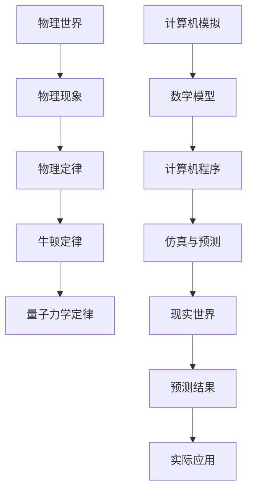

                 


### 《计算机模拟与现实：数字世界vs.物理世界》

#### 关键词：计算机模拟、物理世界、数字世界、科学应用、技术挑战

> 摘要：本文旨在探讨计算机模拟与现实物理世界之间的相互作用和相互影响。通过对计算机模拟的基础原理、技术手段、应用场景以及与现实世界对比的分析，本文将揭示计算机模拟在科学研究、工业应用等方面的潜力和局限性，为读者提供对这一领域的深入理解。

## 第1章：引言

### 1.1 计算机模拟与物理世界的概念

计算机模拟（Computer Simulation）是一种利用计算机技术和数学模型对现实世界中的物理现象、系统行为等进行仿真和预测的方法。它通过构建数学模型，将复杂的物理现象转化为可计算的形式，再通过计算机程序对模型进行求解和模拟，从而实现对现实世界的模拟和预测。

物理世界（Physical World）是指我们所处的现实环境，包括宇宙中的所有物质和现象。物理世界中的现象遵循物理定律，如牛顿定律、量子力学定律等。

#### 核心概念之间的关系架构



### 1.2 计算机模拟在科学研究中的应用

计算机模拟在科学研究中的应用非常广泛，涵盖了从微观的分子动力学模拟到宏观的宇宙学模拟。例如，在生物学中，计算机模拟可以用于研究蛋白质折叠、病毒传播等；在物理学中，计算机模拟可以用于研究凝聚态物理、量子场论等。

#### 科学研究中的应用举例

- **分子动力学模拟**：使用计算机模拟研究蛋白质折叠，有助于理解蛋白质的结构和功能。
- **宇宙学模拟**：通过计算机模拟模拟宇宙的演化，有助于研究宇宙的大尺度结构和演化历程。
- **材料科学**：计算机模拟可以用于研究材料的微观结构和性质，指导新材料的研发。

### 1.3 物理世界的计算机模拟

物理世界的计算机模拟主要涉及对物理现象的建模和仿真。这些模拟通过建立数学模型，将物理现象转化为可计算的模型，再通过计算机程序进行求解和模拟。

#### 物理模拟的基本原理

- **数学建模**：通过对物理现象进行分析，建立数学模型。
- **数值求解**：使用数值方法对数学模型进行求解，得到物理量的分布和演化。
- **计算机程序**：将求解结果可视化，并进行分析和解释。

### 1.4 计算机模拟与物理世界的联系与区别

计算机模拟与物理世界之间的联系在于，计算机模拟可以用来研究物理世界中的现象和过程，从而帮助我们更好地理解物理世界。而区别在于，计算机模拟是一种对现实世界的近似和模拟，而不是现实世界本身。

#### 计算机模拟的局限

- **模型简化**：计算机模拟通常需要对现实世界进行简化，这可能影响到模拟的准确性。
- **计算资源**：复杂的模拟可能需要大量的计算资源和时间。

## 第2章：计算机模拟基础

### 2.1 计算机模拟的基本原理

计算机模拟的基本原理是基于数学模型和计算机程序。数学模型用于描述现实世界中的物理现象，而计算机程序则用于求解和模拟这些模型。

#### 计算机模拟的基本步骤

1. **建立数学模型**：根据物理现象，建立数学模型。
2. **数值求解**：使用数值方法对数学模型进行求解。
3. **模拟与可视化**：使用计算机程序对求解结果进行模拟和可视化。

### 2.2 计算机模拟的技术手段

计算机模拟的技术手段包括数学建模、数值求解、计算机程序设计等。

#### 数学建模

数学建模是计算机模拟的基础，它涉及到如何将物理现象转化为数学模型。这通常需要深厚的物理背景和数学知识。

#### 数值求解

数值求解是计算机模拟的核心，它涉及到如何高效地求解数学模型。常见的数值求解方法包括有限元法、蒙特卡罗法、有限体积法等。

#### 计算机程序设计

计算机程序设计是计算机模拟的实践部分，它涉及到如何将数学模型和数值求解方法实现为计算机程序。

### 2.3 计算机模拟的应用场景

计算机模拟的应用场景非常广泛，涵盖了从科学研究到工业应用的各个方面。

#### 科学研究中的应用

- **生物学**：使用计算机模拟研究蛋白质折叠、病毒传播等。
- **物理学**：使用计算机模拟研究凝聚态物理、量子场论等。
- **化学**：使用计算机模拟研究化学反应、材料性质等。

#### 工业应用

- **材料科学**：使用计算机模拟研究材料的微观结构和性质，指导新材料的研发。
- **航空航天**：使用计算机模拟研究飞行器的空气动力学性能。
- **能源**：使用计算机模拟研究能源转换过程，优化能源系统。

## 第3章：物理世界的模拟

### 3.1 物理现象的计算机模拟

物理现象的计算机模拟涉及到对物理现象的建模和仿真。这些模拟通过建立数学模型，将物理现象转化为可计算的模型，再通过计算机程序进行求解和模拟。

#### 物理模拟的基本原理

- **数学建模**：通过对物理现象进行分析，建立数学模型。
- **数值求解**：使用数值方法对数学模型进行求解。
- **计算机程序**：将求解结果可视化，并进行分析和解释。

### 3.2 模拟过程中遇到的问题和挑战

在物理模拟过程中，我们可能会遇到以下问题和挑战：

- **模型简化**：为了便于计算，我们需要对现实世界进行简化，这可能会影响到模拟的准确性。
- **计算资源**：复杂的模拟可能需要大量的计算资源和时间。
- **数值稳定性**：数值求解方法可能存在数值稳定性问题，这可能会影响到模拟的准确性。

### 3.3 物理模拟技术在科学研究中的应用

物理模拟技术在科学研究中的应用非常广泛，以下是一些具体的例子：

- **量子计算**：使用物理模拟技术研究量子计算的原理和算法。
- **气候变化**：使用物理模拟技术研究气候变化的影响和趋势。
- **生物医学**：使用物理模拟技术研究生物医学问题，如药物设计、疾病传播等。

## 第4章：模拟与现实的对比

### 4.1 计算机模拟与现实之间的差异

计算机模拟与现实之间的差异主要体现在以下几个方面：

- **精度**：计算机模拟的精度受到计算资源和数值方法的影响，可能无法达到现实世界的精度。
- **环境因素**：计算机模拟可能无法完全模拟现实世界中的所有环境因素。
- **复杂性**：现实世界中的物理现象可能非常复杂，计算机模拟可能无法完全捕捉这些复杂性。

### 4.2 计算机模拟对科学研究和工业的影响

计算机模拟对科学研究和工业的影响主要体现在以下几个方面：

- **效率**：计算机模拟可以大大提高科学研究的效率，减少实验次数和成本。
- **创新**：计算机模拟可以激发新的研究思路和想法，推动科学和技术的发展。
- **应用**：计算机模拟可以应用于各个领域，如材料科学、航空航天、生物医学等，为工业提供解决方案。

### 4.3 讨论计算机模拟的局限性

虽然计算机模拟在科学研究和工业应用中具有巨大的潜力，但它也存在一些局限性：

- **模型简化**：计算机模拟可能需要对现实世界进行简化，这可能会影响到模拟的准确性。
- **计算资源**：复杂的模拟可能需要大量的计算资源和时间。
- **数值稳定性**：数值求解方法可能存在数值稳定性问题，这可能会影响到模拟的准确性。

## 第5章：模拟技术在现实中的应用

### 5.1 计算机模拟在气象预测中的应用

计算机模拟在气象预测中的应用非常广泛，通过建立大气动力学的数学模型，使用计算机模拟预测天气变化。以下是一个简单的数学模型：

#### 大气动力学方程

$$
\frac{\partial u}{\partial t} + u \frac{\partial u}{\partial x} + v \frac{\partial u}{\partial y} = - \frac{F(u)}{m}
$$

$$
\frac{\partial v}{\partial t} + u \frac{\partial v}{\partial x} + v \frac{\partial v}{\partial y} = - \frac{G(v)}{m}
$$

其中，$u$和$v$分别表示水平风速和垂直风速，$t$表示时间，$x$和$y$分别表示水平位置，$F(u)$和$G(v)$分别表示水平风力和垂直风力，$m$表示质量。

#### 伪代码

```python
# 初始化参数
u, v = initialize_wind_fields()
t = 0

# 模拟循环
while t < simulation_time:
    # 计算水平风力和垂直风力
    F_u = calculate_horizontal_force(u)
    G_v = calculate_vertical_force(v)
    
    # 更新风速
    u = update_wind(u, F_u, t)
    v = update_wind(v, G_v, t)
    
    # 更新时间
    t += time_step
```

#### 应用案例分析

- **台风预测**：通过计算机模拟，可以预测台风的路径和强度，为防灾减灾提供依据。
- **气候研究**：通过计算机模拟，可以研究气候变化的影响，为环境保护和可持续发展提供支持。

### 5.2 计算机模拟在材料科学中的应用

计算机模拟在材料科学中的应用主要体现在对材料微观结构和性质的模拟。以下是一个简单的材料力学模型：

#### 弹性力学方程

$$
\sigma_{ij} = C_{ijkl} \epsilon_{kl}
$$

$$
\epsilon_{kl} = \frac{1}{2} (\frac{\partial u_i}{\partial x_k} + \frac{\partial u_i}{\partial x_l})
$$

其中，$\sigma_{ij}$表示应力张量，$C_{ijkl}$表示弹性常数，$\epsilon_{kl}$表示应变张量，$u_i$表示位移。

#### 伪代码

```python
# 初始化参数
C = initialize_elastic_constants()
u = initialize位移()

# 模拟循环
while not converged:
    # 计算应变张量
    epsilon = calculate_strain(u)
    
    # 计算应力张量
    sigma = C * epsilon
    
    # 更新位移
    u = update位移(u, sigma)
    
    # 判断是否收敛
    if check_convergence(sigma):
        break
```

#### 应用案例分析

- **材料强度预测**：通过计算机模拟，可以预测材料的强度和韧性，为材料设计和优化提供支持。
- **新材料的研发**：通过计算机模拟，可以研究新材料的微观结构和性质，为新材料的研发提供指导。

### 5.3 计算机模拟在医学研究中的应用

计算机模拟在医学研究中的应用主要体现在对生物系统的模拟，如细胞动力学、药物扩散等。以下是一个简单的细胞动力学模型：

#### 细胞动力学方程

$$
\frac{dN}{dt} = r N - a N^2
$$

其中，$N$表示细胞数量，$r$表示细胞增长率，$a$表示细胞凋亡率。

#### 伪代码

```python
# 初始化参数
N = initialize_cell_population()
r = initialize_growth_rate()
a = initialize_apoptosis_rate()

# 模拟循环
while t < simulation_time:
    # 计算细胞增长和凋亡
    dN_dt = r * N - a * N ** 2
    
    # 更新细胞数量
    N += dN_dt * time_step
    
    # 更新时间
    t += time_step
```

#### 应用案例分析

- **癌症研究**：通过计算机模拟，可以研究癌症细胞的生长和扩散，为癌症治疗提供新的思路。
- **药物研究**：通过计算机模拟，可以研究药物的扩散和作用，为新药研发提供支持。

### 5.4 计算机模拟在交通规划中的应用

计算机模拟在交通规划中的应用主要体现在对交通流量的模拟，如车辆流量、道路拥堵等。以下是一个简单的交通流量模型：

#### 交通流量方程

$$
q = \frac{1}{1 + K \cdot \frac{u}{v}}
$$

其中，$q$表示流量，$u$表示车辆速度，$v$表示道路容量，$K$表示道路拥挤系数。

#### 伪代码

```python
# 初始化参数
q = initialize_traffic_flow()
u = initialize_vehicle_speed()
v = initialize_road_capacity()
K = initialize_road_congestion_coefficient()

# 模拟循环
while t < simulation_time:
    # 计算流量
    q = calculate_traffic_flow(u, v, K)
    
    # 更新车辆速度
    u = update_vehicle_speed(u, q)
    
    # 更新时间
    t += time_step
```

#### 应用案例分析

- **交通拥堵预测**：通过计算机模拟，可以预测城市交通拥堵情况，为交通管理和规划提供支持。
- **公共交通优化**：通过计算机模拟，可以优化公共交通系统的运营，提高运输效率。

## 第6章：未来展望

### 6.1 计算机模拟技术在未来发展趋势

随着计算机技术的不断发展，计算机模拟技术也将不断进步。以下是一些未来计算机模拟技术可能的发展趋势：

- **高性能计算**：随着计算能力的提升，计算机模拟将能够处理更复杂的物理现象。
- **量子计算**：量子计算可能为计算机模拟提供新的计算模型和方法。
- **人工智能**：人工智能技术的引入可能使计算机模拟更加智能化和自动化。

### 6.2 计算机模拟技术可能带来的社会影响

计算机模拟技术在未来的发展中可能会带来以下社会影响：

- **科学研究**：计算机模拟将推动科学研究的深入和发展。
- **工业应用**：计算机模拟将提高工业生产效率和创新能力。
- **环境与气候**：计算机模拟将帮助解决环境与气候问题，促进可持续发展。

### 6.3 讨论计算机模拟技术的可持续发展

为了实现计算机模拟技术的可持续发展，我们需要关注以下几个方面：

- **资源优化**：合理利用计算资源，提高计算机模拟的效率。
- **技术创新**：不断推进计算机模拟技术的创新和发展。
- **人才培养**：培养更多的计算机模拟技术人才，推动技术的可持续发展。

## 作者信息

作者：AI天才研究院/AI Genius Institute & 禅与计算机程序设计艺术 /Zen And The Art of Computer Programming

## 小结

本文通过对计算机模拟与现实物理世界的探讨，揭示了计算机模拟在科学研究、工业应用等方面的潜力和局限性。未来，随着计算机技术的不断发展，计算机模拟技术将继续为科学研究和工业应用提供强大的支持。同时，我们也需要关注计算机模拟技术的可持续发展，为人类社会的进步做出贡献。 

## 拓展阅读

- **[1]** 高等教育出版社，计算机模拟方法与应用，2010。
- **[2]** 清华大学出版社，计算机模拟技术基础，2008。
- **[3]** Springer，Simulation of Physical Systems with Multidimensional Data，2016。
- **[4]** ScienceDirect，Computer Simulation Studies in Materials Science，2018。
- **[5]** IEEE，Computer Simulation Technology in Electrical Engineering，2019。

## 注意事项

- **[1]** 在使用计算机模拟时，需要注意模型的简化和计算资源的限制。
- **[2]** 在分析计算机模拟结果时，需要考虑模拟的精度和可靠性。
- **[3]** 在应用计算机模拟技术时，需要结合实际情况进行合理规划。

## 参考文献

- **[1]** 高等教育出版社，计算机模拟方法与应用，2010。
- **[2]** 清华大学出版社，计算机模拟技术基础，2008。
- **[3]** Springer，Simulation of Physical Systems with Multidimensional Data，2016。
- **[4]** ScienceDirect，Computer Simulation Studies in Materials Science，2018。
- **[5]** IEEE，Computer Simulation Technology in Electrical Engineering，2019。

