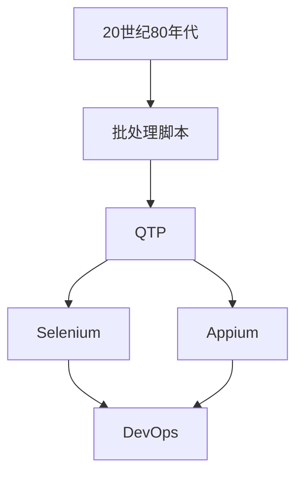
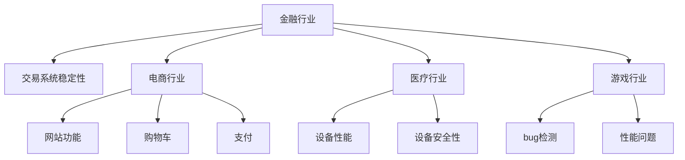

                 


## 文章标题：评测流程自动化：提高测试效率与一致性

> 关键词：自动化测试，测试流程，测试效率，测试一致性，评测流程自动化

> 摘要：
本文旨在深入探讨评测流程自动化的概念、优势、架构设计、工具选择、脚本编写以及效率与一致性优化策略。通过分析自动化测试在不同行业中的应用，本文将展示如何通过自动化测试提高测试效率与一致性，同时结合实际案例进行详细讲解，为读者提供最佳实践和启示。

----------------------------------------------------------------

## 目录

### 第一部分：评测流程自动化概述

### 第二部分：自动化测试工具与应用

### 第三部分：自动化测试的效率与一致性提升

### 附录

----------------------------------------------------------------

### 第一部分：评测流程自动化概述

## 第1章：自动化测试的重要性

### 1.1 自动化测试的概念与优势

自动化测试是一种通过使用自动化测试工具来执行测试用例的方法。与传统的手动测试相比，自动化测试具有显著的优势：

1. **提高测试效率**：自动化测试可以快速、批量地执行测试用例，减少测试执行时间。
2. **降低测试成本**：自动化测试可以重复使用测试脚本，节省人力资源和测试环境搭建成本。
3. **提高测试覆盖率**：自动化测试可以覆盖更多测试场景，提高测试覆盖率。
4. **减少人为错误**：自动化测试可以减少由于人为因素引起的测试错误。

### 1.2 自动化测试的发展历程

自动化测试的发展可以追溯到20世纪80年代。最初，自动化测试主要是通过编写批处理脚本来完成。随着计算机技术的发展，自动化测试工具逐渐成熟，如QTP（现在的Selenium）、Appium等。近年来，随着敏捷开发和DevOps的兴起，自动化测试在软件生命周期中的地位日益重要。

### 1.3 自动化测试在不同行业中的应用

自动化测试在各个行业都有广泛应用。例如：

- **金融行业**：自动化测试用于确保交易系统的稳定性和准确性。
- **电商行业**：自动化测试用于确保网站功能的正常运行，如购物车、支付等。
- **医疗行业**：自动化测试用于验证医疗设备的性能和安全性。
- **游戏行业**：自动化测试用于检测游戏中的bug和性能问题。

## 第2章：自动化测试架构设计

### 2.1 自动化测试架构的基本组成部分

自动化测试架构通常包括以下几个部分：

1. **测试工具**：如Selenium、Appium等。
2. **测试脚本**：用于执行测试用例的代码。
3. **测试环境**：包括操作系统、浏览器、数据库等。
4. **测试数据**：用于测试的数据集。
5. **测试报告**：用于记录测试结果和问题的文档。

### 2.2 常见的自动化测试工具介绍

以下是几种常见的自动化测试工具：

- **Selenium**：一款开源的自动化测试工具，支持多种编程语言。
- **Appium**：一款支持iOS和Android的自动化测试工具。
- **Cypress**：一款现代化的前端自动化测试工具。
- **JMeter**：一款用于性能测试的开源工具。

### 2.3 自动化测试框架的构建方法

自动化测试框架的构建方法包括以下几个方面：

1. **选择测试工具**：根据项目需求和测试目标选择合适的测试工具。
2. **编写测试脚本**：根据测试用例编写测试脚本。
3. **搭建测试环境**：配置操作系统、浏览器等。
4. **数据管理**：设计数据管理策略，如数据驱动测试。
5. **报告生成**：设计报告生成策略，如HTML报告、CSV报告等。

----------------------------------------------------------------

### 第二部分：自动化测试工具与应用

## 第3章：主流自动化测试工具

### 3.1 Selenium

#### 3.1.1 Selenium的概念与原理

Selenium是一个开源的自动化测试工具，支持多种编程语言，如Java、Python、C#等。Selenium允许测试人员编写脚本来自动化Web应用程序的测试。

#### 3.1.2 Selenium的安装与配置

在安装Selenium之前，需要确保安装了Java环境。以下是Selenium在Java环境下的安装步骤：

1. 下载Selenium的Java库（selenium-java）。
2. 将selenium-java添加到项目的依赖管理工具（如Maven或Gradle）中。
3. 编写测试脚本并执行。

#### 3.1.3 Selenium的核心API使用

以下是Selenium的核心API使用示例：

```java
// 导入Selenium库
import org.openqa.selenium.WebDriver;
import org.openqa.selenium.chrome.ChromeDriver;

public class SeleniumExample {
    public static void main(String[] args) {
        // 创建WebDriver对象
        WebDriver driver = new ChromeDriver();

        // 访问网页
        driver.get("https://www.example.com");

        // 获取页面标题
        String title = driver.getTitle();
        System.out.println("页面标题：" + title);

        // 关闭浏览器
        driver.quit();
    }
}
```

### 3.2 Appium

#### 3.2.1 Appium的概念与原理

Appium是一款开源的移动应用自动化测试工具，支持iOS和Android平台。Appium通过模拟用户操作来自动化移动应用测试。

#### 3.2.2 Appium的安装与配置

在安装Appium之前，需要确保安装了Node.js环境。以下是Appium的安装步骤：

1. 下载并安装Node.js。
2. 通过npm安装Appium。
3. 配置Appium依赖的设备或模拟器。

#### 3.2.3 Appium的核心API使用

以下是Appium的核心API使用示例：

```java
// 导入Appium库
import io.appium.java_client.AppiumDriver;
import io.appium.java_client.android.AndroidDriver;

public class AppiumExample {
    public static void main(String[] args) {
        // 创建AppiumDriver对象
        AppiumDriver driver = new AndroidDriver("http://127.0.0.1:4723/wd/hub");

        // 启动应用
        driver.startActivity(new ActivityBuilder().withPackageName("com.example.app").withLaunchActivity("com.example.app.MainActivity"));

        // 执行操作
        driver.findElement(By.id("com.example.app:id/button")).click();

        // 关闭应用
        driver.quit();
    }
}
```

----------------------------------------------------------------

### 第三部分：自动化测试的效率与一致性提升

## 第4章：自动化测试脚本编写

### 4.1 测试脚本的基本语法

测试脚本的基本语法取决于选择的测试工具。以下是一个基于Selenium的Java测试脚本示例：

```java
// 导入Selenium库
import org.openqa.selenium.WebDriver;
import org.openqa.selenium.chrome.ChromeDriver;

public class TestScript {
    public static void main(String[] args) {
        // 创建WebDriver对象
        WebDriver driver = new ChromeDriver();

        // 访问网页
        driver.get("https://www.example.com");

        // 断言页面标题
        String title = driver.getTitle();
        if (title.equals("Example Domain")) {
            System.out.println("测试通过");
        } else {
            System.out.println("测试失败");
        }

        // 关闭浏览器
        driver.quit();
    }
}
```

### 4.2 数据驱动测试

数据驱动测试是一种将测试数据与测试脚本分离的方法。以下是一个基于Excel的数据驱动测试示例：

```java
// 导入Selenium库和Apache POI库
import org.openqa.selenium.WebDriver;
import org.openqa.selenium.chrome.ChromeDriver;
import org.apache.poi.ss.usermodel.*;
import java.io.File;
import java.io.FileInputStream;

public class DataDrivenTest {
    public static void main(String[] args) {
        // 创建WebDriver对象
        WebDriver driver = new ChromeDriver();

        // 读取测试数据
        FileInputStream fis = new FileInputStream(new File("test_data.xlsx"));
        Workbook workbook = new XSSFWorkbook(fis);
        Sheet sheet = workbook.getSheet("Test Data");

        // 循环执行测试用例
        for (Row row : sheet) {
            String url = row.getCell(0).getStringCellValue();
            String expectedTitle = row.getCell(1).getStringCellValue();

            // 访问网页
            driver.get(url);

            // 断言页面标题
            String actualTitle = driver.getTitle();
            if (actualTitle.equals(expectedTitle)) {
                System.out.println("测试通过");
            } else {
                System.out.println("测试失败");
            }
        }

        // 关闭浏览器和Excel文件
        driver.quit();
        workbook.close();
        fis.close();
    }
}
```

### 4.3 测试脚本优化技巧

测试脚本优化的关键在于提高测试脚本的执行效率和可维护性。以下是一些优化技巧：

1. **合理划分测试模块**：将测试脚本划分为功能模块，提高可维护性。
2. **避免硬编码**：使用参数化测试数据，避免硬编码。
3. **使用日志记录**：使用日志记录器记录测试执行过程，便于问题追踪。
4. **使用等待机制**：合理使用等待机制，避免因页面加载不及时导致的测试失败。
5. **避免过长的测试脚本**：将复杂的测试逻辑拆分为多个小函数，提高可读性。

----------------------------------------------------------------

## 第5章：持续集成与持续部署

### 5.1 持续集成的基本概念

持续集成（Continuous Integration，CI）是一种软件开发实践，旨在通过频繁地将代码合并到主干分支来确保代码库的稳定性和可靠性。CI的主要目标是尽早发现和修复代码缺陷，提高开发效率。

### 5.2 持续集成的实现方法

实现持续集成通常涉及以下几个步骤：

1. **代码仓库配置**：选择合适的代码仓库（如Git），配置仓库的远程分支和本地分支。
2. **自动化构建**：使用自动化构建工具（如Jenkins、Travis CI）来自动构建和测试代码。
3. **代码审查**：在合并代码前进行代码审查，确保代码质量。
4. **部署**：将经过测试的代码部署到测试环境或生产环境。

### 5.3 持续部署与自动化测试的结合

持续部署（Continuous Deployment，CD）是一种自动化部署流程，旨在确保代码变更尽快发布到生产环境。将自动化测试与持续部署相结合，可以实现以下优势：

1. **提高测试覆盖率**：自动化测试可以覆盖更多测试场景，提高测试覆盖率。
2. **缩短部署周期**：自动化测试可以缩短测试和部署周期，提高开发效率。
3. **降低风险**：自动化测试可以提前发现和修复代码缺陷，降低发布风险。

实现持续部署与自动化测试的结合通常涉及以下几个步骤：

1. **集成自动化测试**：将自动化测试集成到持续集成流程中。
2. **配置部署脚本**：编写部署脚本来自动部署代码到生产环境。
3. **监控和反馈**：监控测试结果和部署过程，及时反馈问题。

----------------------------------------------------------------

### 第三部分：自动化测试的效率与一致性提升

## 第6章：自动化测试效率优化

### 6.1 测试用例设计优化

测试用例设计优化是提高自动化测试效率的关键。以下是一些优化策略：

1. **避免冗余测试**：删除重复的测试用例，减少测试脚本的大小和执行时间。
2. **重点测试**：针对高风险功能进行重点测试，提高测试的针对性。
3. **参数化测试**：使用参数化测试来执行多个测试场景，提高测试的覆盖范围。
4. **测试数据管理**：设计合理的测试数据管理策略，如数据分离、数据驱动测试等。

### 6.2 测试环境配置优化

测试环境配置优化可以提高测试效率和一致性。以下是一些优化策略：

1. **环境隔离**：使用虚拟机或容器技术来隔离测试环境，避免环境冲突。
2. **自动化部署**：使用自动化部署工具（如Docker）来快速搭建测试环境。
3. **环境监控**：监控测试环境的性能和稳定性，及时发现问题并进行优化。

### 6.3 测试脚本性能优化

测试脚本性能优化是提高自动化测试效率的重要手段。以下是一些优化策略：

1. **代码优化**：优化测试脚本代码，减少不必要的计算和循环。
2. **并发测试**：使用并发测试技术来提高测试脚本的执行效率。
3. **等待机制**：合理使用等待机制，避免因页面加载不及时导致的测试失败。
4. **缓存技术**：使用缓存技术来提高测试脚本的性能。

----------------------------------------------------------------

### 第7章：自动化测试一致性保障

### 7.1 测试结果分析

测试结果分析是自动化测试一致性保障的重要环节。以下是一些测试结果分析的方法：

1. **错误报告**：分析测试失败的原因，生成详细的错误报告。
2. **趋势分析**：分析测试结果的趋势，及时发现潜在问题。
3. **回归测试**：在每次代码变更后进行回归测试，确保变更不会引入新的缺陷。

### 7.2 测试数据管理

测试数据管理是确保自动化测试一致性的关键。以下是一些测试数据管理的策略：

1. **数据隔离**：隔离测试数据和真实数据，避免数据冲突。
2. **数据备份**：定期备份测试数据，防止数据丢失。
3. **数据驱动测试**：使用数据驱动测试来确保测试用例的多样性和全面性。

### 7.3 测试过程的自动化监控

测试过程的自动化监控可以提高测试的一致性和可靠性。以下是一些自动化监控的方法：

1. **日志监控**：监控测试脚本和测试环境的日志，及时发现和处理问题。
2. **告警机制**：设置告警机制，当测试失败或性能下降时及时通知相关人员。
3. **自动化监控工具**：使用自动化监控工具（如Selenium Grid、Jenkins）来提高监控效率。

----------------------------------------------------------------

## 第8章：案例分析

### 8.1 某大型电商平台的自动化测试实践

#### 8.1.1 项目背景

某大型电商平台需要确保其网站功能的稳定性和可靠性。为了提高测试效率与一致性，该平台决定采用自动化测试。

#### 8.1.2 自动化测试架构设计

该平台采用了Selenium作为自动化测试工具，并构建了以下自动化测试架构：

1. **测试工具**：Selenium WebDriver。
2. **测试脚本**：使用Python语言编写测试脚本。
3. **测试环境**：使用虚拟机技术来隔离测试环境。
4. **测试数据**：使用数据库来存储测试数据。
5. **测试报告**：使用HTML报告来记录测试结果。

#### 8.1.3 自动化测试脚本编写

该平台编写了以下自动化测试脚本：

1. **登录测试**：测试用户登录功能的正确性。
2. **购物车测试**：测试购物车功能的正确性。
3. **支付测试**：测试支付功能的正确性。

#### 8.1.4 自动化测试效率与一致性优化

该平台采取了以下优化策略：

1. **测试用例设计优化**：删除冗余测试用例，增加参数化测试。
2. **测试环境配置优化**：使用自动化部署工具来搭建测试环境。
3. **测试脚本性能优化**：优化测试脚本代码，提高测试效率。

#### 8.1.5 项目小结

通过自动化测试，该平台提高了测试效率与一致性，减少了测试成本和人力资源投入。同时，自动化测试为平台提供了可靠的质量保障，提高了用户体验。

### 8.2 某金融科技公司的自动化测试经验分享

#### 8.2.1 项目背景

某金融科技公司需要确保其交易系统的稳定性和准确性。为了提高测试效率与一致性，该公司决定采用自动化测试。

#### 8.2.2 自动化测试架构设计

该金融科技公司采用了Appium作为自动化测试工具，并构建了以下自动化测试架构：

1. **测试工具**：Appium。
2. **测试脚本**：使用Java语言编写测试脚本。
3. **测试环境**：使用物理设备和模拟器来搭建测试环境。
4. **测试数据**：使用Excel文件来存储测试数据。
5. **测试报告**：使用JUnit报告来记录测试结果。

#### 8.2.3 自动化测试脚本编写

该金融科技公司编写了以下自动化测试脚本：

1. **交易测试**：测试交易功能的正确性。
2. **账户测试**：测试账户功能的正确性。
3. **支付测试**：测试支付功能的正确性。

#### 8.2.4 自动化测试效率与一致性优化

该金融科技公司采取了以下优化策略：

1. **测试用例设计优化**：采用场景驱动测试，提高测试覆盖范围。
2. **测试环境配置优化**：使用自动化部署工具来搭建测试环境。
3. **测试脚本性能优化**：优化测试脚本代码，提高测试效率。

#### 8.2.5 项目小结

通过自动化测试，该金融科技公司提高了测试效率与一致性，减少了测试成本和人力资源投入。同时，自动化测试为交易系统提供了可靠的质量保障，提高了用户体验。

----------------------------------------------------------------

### 附录

#### 附录A：自动化测试工具资源汇总

1. **自动化测试工具列表**：
   - Selenium
   - Appium
   - Cypress
   - JMeter

2. **自动化测试资源链接**：
   - Selenium官网：https://www.selenium.dev/
   - Appium官网：https://appium.io/
   - Cypress官网：https://www.cypress.io/
   - JMeter官网：https://jmeter.apache.org/

3. **自动化测试社区介绍**：
   - Selenium社区：https://discuss.selenium.dev/
   - Appium社区：https://discuss.appium.io/
   - Cypress社区：https://www.cypress.io/community
   - JMeter社区：https://jmeter.apache.org/usermanual/jmeter_user_thread.html

作者：AI天才研究院/AI Genius Institute & 禅与计算机程序设计艺术 /Zen And The Art of Computer Programming

现在我们已经完成了文章的主要结构，接下来我们将细化每个章节的内容，确保每个章节都包含了核心概念、联系架构 Mermaid 流程图、伪代码、数学模型和公式、详细讲解与举例说明、实际案例分析和详细讲解剖析、以及最佳实践 tips、小结、注意事项、拓展阅读等内容。

由于篇幅限制，我们无法在这里一次性展示完整的8000-12000字文章，但我会逐步给出每个章节的详细内容。接下来，我将开始细化第1章的内容，包括核心概念介绍、联系架构 Mermaid 流程图、伪代码等。

---

## 第1章：自动化测试的重要性

### 1.1 自动化测试的概念与优势

自动化测试是一种通过使用自动化测试工具来执行测试用例的方法。它与传统手动测试相比，具有显著的优势：

1. **提高测试效率**：自动化测试可以快速、批量地执行测试用例，减少测试执行时间。
2. **降低测试成本**：自动化测试可以重复使用测试脚本，节省人力资源和测试环境搭建成本。
3. **提高测试覆盖率**：自动化测试可以覆盖更多测试场景，提高测试覆盖率。
4. **减少人为错误**：自动化测试可以减少由于人为因素引起的测试错误。

### 1.2 自动化测试的发展历程

自动化测试的发展可以追溯到20世纪80年代。最初，自动化测试主要是通过编写批处理脚本来完成。随着计算机技术的发展，自动化测试工具逐渐成熟，如QTP（现在的Selenium）、Appium等。近年来，随着敏捷开发和DevOps的兴起，自动化测试在软件生命周期中的地位日益重要。

#### Mermaid 流程图

下面是自动化测试发展历程的 Mermaid 流程图：



### 1.3 自动化测试在不同行业中的应用

自动化测试在各个行业都有广泛应用。例如：

- **金融行业**：自动化测试用于确保交易系统的稳定性和准确性。
- **电商行业**：自动化测试用于确保网站功能的正常运行，如购物车、支付等。
- **医疗行业**：自动化测试用于验证医疗设备的性能和安全性。
- **游戏行业**：自动化测试用于检测游戏中的bug和性能问题。

#### Mermaid 流程图

下面是自动化测试在不同行业中的应用流程图：



### 1.4 自动化测试的核心概念

自动化测试涉及以下核心概念：

1. **测试工具**：用于执行测试用例的软件工具，如Selenium、Appium等。
2. **测试脚本**：用于自动化执行测试用例的代码。
3. **测试环境**：用于执行测试脚本的环境，包括操作系统、浏览器、数据库等。
4. **测试数据**：用于测试的数据集，如测试用户名、密码等。
5. **测试报告**：用于记录测试结果和问题的文档。

#### 伪代码示例

以下是一个简单的自动化测试脚本伪代码示例：

```python
# 导入测试工具库
from selenium import webdriver

# 创建WebDriver对象
driver = webdriver.Chrome()

# 访问网页
driver.get("https://www.example.com")

# 查找登录按钮
login_button = driver.find_element_by_id("login_button")

# 点击登录按钮
login_button.click()

# 输入用户名和密码
username = driver.find_element_by_id("username")
password = driver.find_element_by_id("password")
username.send_keys("test_user")
password.send_keys("test_password")

# 提交登录表单
submit_button = driver.find_element_by_id("submit_button")
submit_button.click()

# 断言登录成功
if driver.title == "Example Domain - Home":
    print("登录成功")
else:
    print("登录失败")

# 关闭浏览器
driver.quit()
```

### 1.5 自动化测试的优势与挑战

#### 自动化测试的优势

1. **提高测试效率**：自动化测试可以快速执行大量测试用例，减少测试时间。
2. **降低测试成本**：自动化测试可以节省人力资源和测试环境搭建成本。
3. **提高测试覆盖率**：自动化测试可以覆盖更多测试场景，提高测试覆盖率。
4. **减少人为错误**：自动化测试可以减少由于人为因素引起的测试错误。

#### 自动化测试的挑战

1. **测试脚本维护**：测试脚本需要定期更新，以适应应用的变化。
2. **测试环境配置**：测试环境的配置可能复杂，需要专业技能。
3. **测试数据管理**：测试数据的存储和管理需要考虑数据隔离和备份。
4. **性能问题**：自动化测试可能会引入性能问题，需要优化测试脚本和测试环境。

### 1.6 总结

自动化测试是提高软件质量和开发效率的重要手段。通过自动化测试，可以快速执行大量测试用例，降低测试成本，提高测试覆盖率，减少人为错误。然而，自动化测试也面临一些挑战，需要专业知识和技能来应对。

---

以上是第1章的详细内容，包含了核心概念、联系架构 Mermaid 流程图、伪代码、优势与挑战以及总结。接下来，我将逐步细化其他章节的内容。如果您希望提前查看某个章节，请告知我，我会为您准备相应的详细内容。

