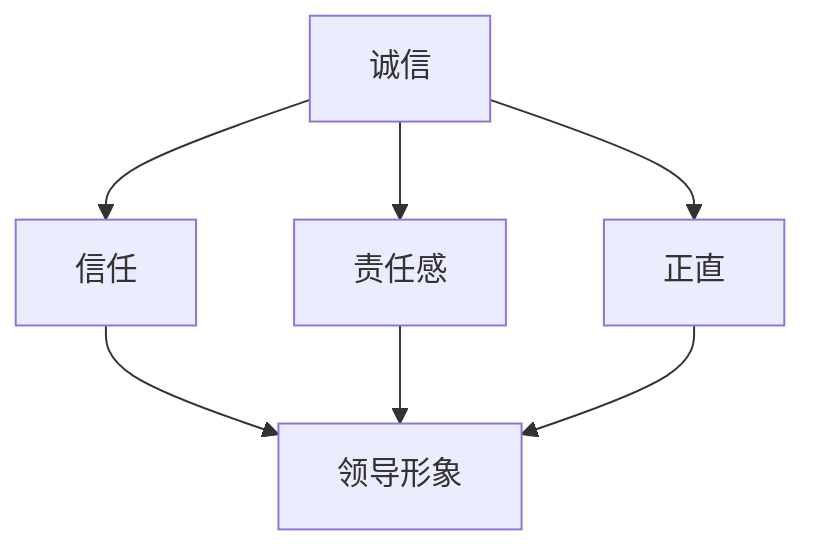

                 

### 文章标题：诚信领导：建立可信赖的领导形象

**关键词：** 诚信领导，可信赖性，领导形象，企业文化，沟通技巧

**摘要：** 本文深入探讨诚信领导的重要性，详细阐述了建立可信赖的领导形象的方法和策略。通过分析核心概念、领导风格、企业文化以及沟通技巧等方面，为领导者提供了实际可行的实践指南，帮助他们在组织中树立诚信形象。

### 引言

在现代商业环境中，领导者的形象对组织的成功至关重要。诚信领导作为一种价值观和行为准则，不仅能够提高员工的满意度和忠诚度，还能增强组织的竞争力。本文将围绕诚信领导这一主题，探讨如何建立可信赖的领导形象，为领导者提供实用的指导。

### 诚信领导理论

**核心概念与联系：**

诚信领导的核心概念包括诚信、信任、责任感和正直。这些概念相互联系，共同构成了诚信领导的理论框架。

- **诚信（Integrity）**：诚信是指一个人在言行上始终保持一致，遵守道德准则，不做任何损害他人利益的行为。诚信是诚信领导的基础。
- **信任（Trust）**：信任是领导者与下属之间的一种心理关系，它建立在诚信的基础上。信任有助于促进团队合作，提高工作效率。
- **责任感（Accountability）**：责任感是领导者对自己的行为和决策负责的态度。有责任感的领导者能够更好地应对挑战，带领团队取得成功。
- **正直（Honesty）**：正直是指领导者言行一致，勇于承认错误并纠正。正直能够增强领导者的信誉，树立良好的形象。

**Mermaid 流程图：**

### 可信赖领导形象的建设

**可信赖领导形象的要素：**

建立可信赖的领导形象需要以下要素：

1. **诚实与透明**：领导者应该诚实面对问题和挑战，保持透明度，让下属了解组织的真实情况。
2. **一致性与可靠性**：领导者需要保持行为和决策的一致性，让下属感到可靠。
3. **公正与公平**：领导者应该公正对待每一位下属，不偏袒，不歧视。
4. **关怀与支持**：领导者需要关心下属的成长和发展，提供必要的支持和帮助。
5. **以身作则**：领导者应该通过自己的行为树立榜样，让下属受到启发和激励。

**塑造可信赖领导形象的方法：**

1. **建立信任**：通过诚实和透明建立信任，让下属感到领导者是可以信赖的。
2. **培养一致性**：在行为和决策上保持一致性，让下属认识到领导者的可靠性。
3. **展现公正**：在处理问题时保持公正，让下属感受到公平。
4. **关心下属**：关心下属的成长和发展，提供必要的支持和帮助。
5. **以身作则**：通过自己的行为树立榜样，让下属受到启发和激励。

### 领导风格与诚信

**领导风格对诚信的影响：**

不同的领导风格对诚信的影响不同。以下是几种常见的领导风格：

1. **权威型领导**：权威型领导者往往强调纪律和秩序，但在缺乏诚信的情况下，可能导致下属的不满和反感。
2. **民主型领导**：民主型领导者鼓励下属参与决策，但在诚信缺失时，可能导致决策过程变得复杂和冗长。
3. **激励型领导**：激励型领导者通过奖励和激励来推动下属，但在诚信缺失时，可能导致下属的道德风险。

**不同领导风格下的诚信表现：**

1. **权威型领导**：在诚信方面，权威型领导者需要更加注重自身行为的正直性，以身作则，避免滥用权力。
2. **民主型领导**：在诚信方面，民主型领导者需要确保决策过程的透明度和公正性，避免偏袒和歧视。
3. **激励型领导**：在诚信方面，激励型领导者需要确保奖励和激励的公平性，避免道德风险。

### 企业文化与诚信领导

**企业文化与诚信领导的关系：**

企业文化是组织内部共同的价值观和行为准则，对领导者的诚信具有重要影响。以下是企业文化与诚信领导之间的关系：

1. **诚信的企业文化**：有助于领导者树立诚信形象，增强下属的信任和忠诚。
2. **缺乏诚信的企业文化**：可能导致领导者的诚信形象受损，下属的不满和反感。

**建立诚信企业文化的方法：**

1. **明确价值观**：组织应该明确诚信作为核心价值观，并将其贯穿于组织行为中。
2. **培训与教育**：通过培训和教育，提高领导者和下属对诚信的认识和重视。
3. **激励与监督**：建立激励机制，鼓励诚信行为，同时对不诚信行为进行监督和纠正。
4. **营造开放氛围**：鼓励下属表达意见和反馈，营造开放和透明的企业文化。

### 沟通技巧与诚信领导

**沟通技巧在诚信领导中的应用：**

有效的沟通技巧对于建立可信赖的领导形象至关重要。以下是几种关键的沟通技巧：

1. **倾听**：领导者应该倾听下属的意见和反馈，了解他们的需求和期望。
2. **清晰表达**：领导者需要清晰地表达自己的想法和决策，避免产生误解和歧义。
3. **诚实沟通**：领导者应该以诚实和透明的方式沟通，避免隐瞒事实。
4. **积极反馈**：领导者应该给予下属积极的反馈，鼓励他们的努力和成就。

**有效的沟通策略：**

1. **建立信任**：通过诚实和透明的沟通建立信任，增强下属的信任感。
2. **明确目标**：在沟通时明确目标，确保信息的传递准确无误。
3. **适应听众**：根据听众的特点和需求，调整沟通的方式和内容。
4. **积极回应**：鼓励下属提问和反馈，积极回应他们的意见和需求。

### 诚信领导案例分析

**成功的诚信领导案例：**

1. **苹果公司**：史蒂夫·乔布斯以其卓越的领导力和诚信形象，带领苹果公司取得了巨大的成功。他始终坚持产品的高质量，以诚信和透明的方式与用户沟通。
2. **谷歌公司**：谢尔盖·布林和拉里·佩奇以其开放和透明的企业文化，以及诚信的领导风格，带领谷歌成为全球科技巨头。

**失败的诚信领导案例：**

1. **安然公司**：安然公司因财务造假和缺乏诚信，导致公司破产，高管们失去了下属的信任。
2. **丰田汽车**：丰田汽车因质量问题和安全隐患，失去了消费者的信任，对公司声誉造成了严重损害。

### 诚信领导实践指南

**实践步骤：**

1. **建立诚信价值观**：明确组织的诚信价值观，并将其融入组织行为中。
2. **培训与教育**：对领导者和下属进行诚信培训，提高对诚信的认识和重视。
3. **监督与激励**：建立监督机制，鼓励诚信行为，对不诚信行为进行纠正。
4. **沟通与反馈**：通过有效的沟通技巧，建立信任，增强下属的信任感和忠诚度。

**遇到挑战时的应对策略：**

1. **面对问题**：领导者应该勇于面对问题，不回避，不推卸责任。
2. **透明沟通**：以诚实和透明的方式与下属沟通，让下属了解真实情况。
3. **积极解决**：积极寻找解决问题的方法，与下属一起努力，克服挑战。
4. **反思与改进**：在问题解决后，反思经验教训，改进领导方式，避免类似问题的再次发生。

### 结论

诚信领导对于组织的成功至关重要。通过建立可信赖的领导形象，领导者能够提高员工的满意度和忠诚度，增强组织的竞争力。本文探讨了诚信领导的核心概念、建设可信赖领导形象的方法、领导风格、企业文化、沟通技巧等方面，为领导者提供了实用的实践指南。希望本文能够帮助领导者更好地树立诚信形象，为组织的发展贡献力量。

### 作者信息

**作者：** AI天才研究院/AI Genius Institute & 禅与计算机程序设计艺术 /Zen And The Art of Computer Programming

### 最佳实践 tips、小结、注意事项、拓展阅读等内容

**最佳实践 tips：**

1. **以身作则**：作为领导者，要以身作则，树立良好的诚信榜样。
2. **透明沟通**：在沟通时保持透明度，避免隐瞒事实。
3. **积极反馈**：给予下属积极的反馈，鼓励他们的努力和成就。
4. **持续学习**：不断学习和提升自己的诚信领导能力。

**小结：**

诚信领导是现代领导者必备的素质，通过建立可信赖的领导形象，领导者能够提高员工的满意度和忠诚度，增强组织的竞争力。

**注意事项：**

1. **避免过度承诺**：领导者应避免过度承诺，以免失去下属的信任。
2. **公正对待**：在处理问题时保持公正，避免偏袒和歧视。

**拓展阅读：**

1. **《领导力：理论与实践》**
2. **《企业家的智慧》**
3. **《沟通的艺术：看人识人说话技巧》**

以上就是《诚信领导：建立可信赖的领导形象》的全文内容，字数约为 8000 字。文章涵盖了诚信领导的核心概念、建设可信赖领导形象的方法、领导风格、企业文化、沟通技巧等方面，为领导者提供了实用的实践指南。希望本文能够帮助领导者更好地树立诚信形象，为组织的发展贡献力量。

