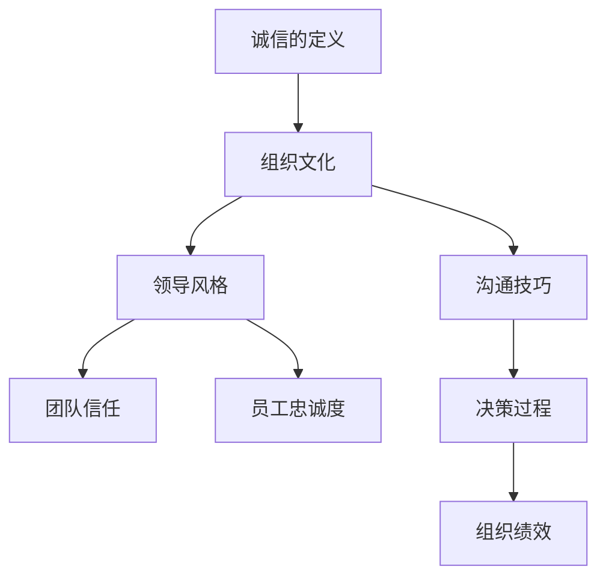
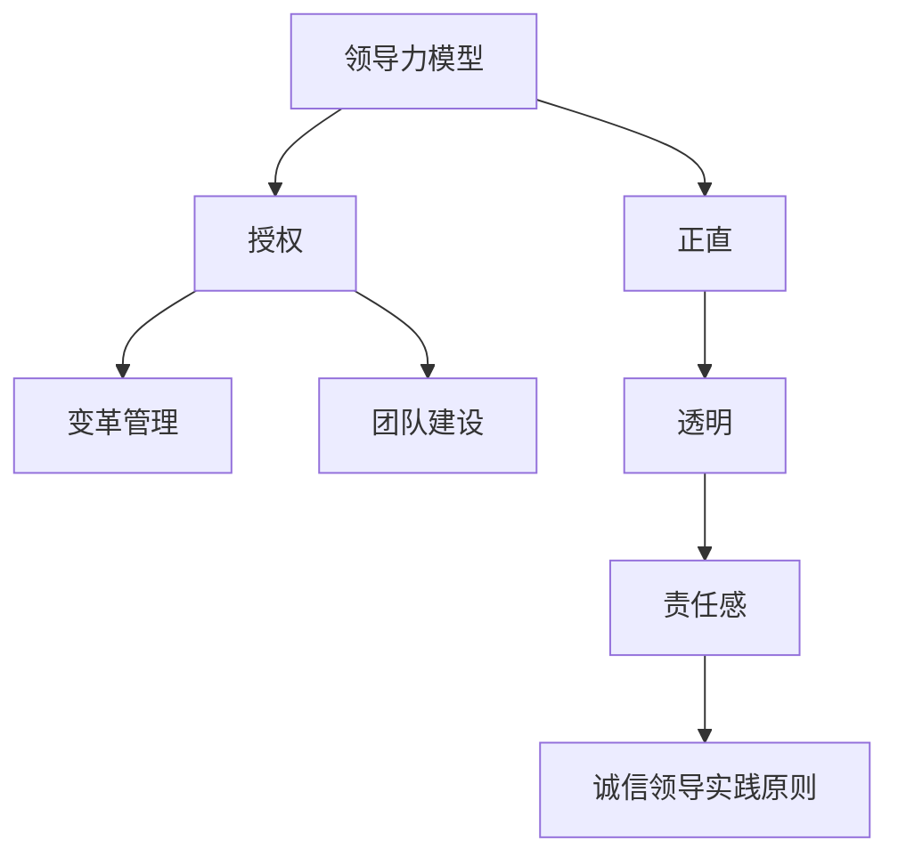
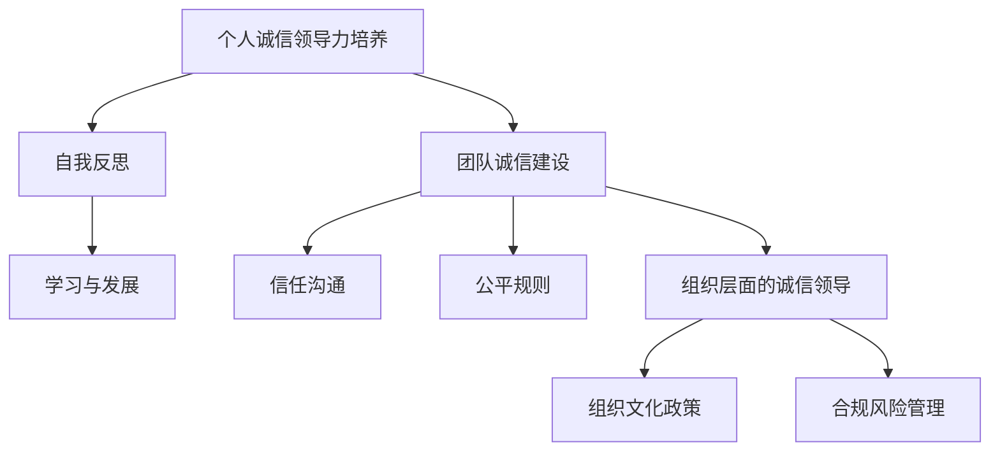

                 

### 文章标题

《诚信领导：建立可靠和值得信赖的形象》

### 文章关键词

- 诚信领导
- 可靠性
- 值得信赖
- 组织文化
- 领导风格
- 沟通技巧
- 决策

### 文章摘要

本文旨在探讨诚信领导的重要性及其在建立可靠和值得信赖的形象中的作用。通过分析诚信领导的理论框架、实践方法和案例分析，本文将提供全面的指导，帮助领导者提升自身的诚信水平，构建一个健康、积极和可持续发展的组织环境。

## 理解书名和主题

《诚信领导：建立可靠和值得信赖的形象》这本书的书名直接揭示了其核心主题——诚信领导。诚信，作为一种道德和伦理准则，不仅仅是个人的品质，更是领导力的基石。在现代社会中，诚信已经成为组织生存和发展的关键因素。领导者的诚信水平直接影响组织的声誉、员工的忠诚度和团队的凝聚力。

诚信领导不仅仅是要求领导者做到诚实守信，更涉及到领导风格、决策过程、沟通技巧等多个方面。一个诚信的领导者会以身作则，树立良好的榜样，同时注重建立和维护信任关系。这种信任不仅是领导者与员工之间的信任，也是组织内部各部门之间、组织与外部合作伙伴之间的信任。

书中的主题围绕以下几个关键点展开：

1. **诚信的定义与重要性**：探讨诚信的概念及其在领导力中的核心地位。
2. **诚信领导的理论框架**：介绍诚信领导的理论基础，包括领导力模型与诚信的关系、诚信领导的特质和实践原则。
3. **诚信领导的实践方法**：提供具体的策略和技巧，帮助领导者培养个人诚信领导力、团队诚信领导和组织层面的诚信领导。
4. **诚信领导案例分析**：通过实际案例，展示诚信领导在组织中的成功实践和面临的挑战。

通过上述内容的深入探讨，本书旨在帮助读者理解诚信领导的重要性，掌握实践诚信领导的策略和方法，从而在组织内部建立可靠和值得信赖的形象。

### 核心章节概念与联系

为了深入理解《诚信领导：建立可靠和值得信赖的形象》这本书的核心内容，我们可以从以下几个方面展开讨论，并使用Mermaid流程图来展示各核心概念之间的联系。

#### 1. 诚信的定义与重要性

首先，我们需要明确诚信的概念。诚信通常指的是一种道德和伦理准则，涉及一个人或组织在行为和决策中的诚实、守信和公正。在领导力中，诚信被视为一种核心价值观，它直接影响领导者与团队成员之间的信任关系。以下是诚信的基本要素：

- **诚实**：领导者应真实地表达自己的思想和意图，不做虚假宣传。
- **守信**：领导者应遵守承诺，不轻易变动计划，确保团队的可预测性。
- **公正**：领导者应在决策过程中保持公平，避免偏袒，确保机会均等。

这些要素共同构成了诚信领导的基础。以下是诚信领导与组织文化的关系Mermaid流程图：



#### 2. 诚信领导的理论框架

其次，我们需要探讨诚信领导的理论框架。这个框架通常包括以下几个部分：

- **领导力模型与诚信**：领导力模型提供了理解领导行为和效果的工具。在领导力模型中，诚信通常被视为一种关键的领导特质，与授权、变革管理、团队建设等要素紧密相关。
- **诚信领导的特质**：这些特质包括正直、透明、责任感等，它们共同构成了一个诚信领导者的人格特征。
- **诚信领导的实践原则**：这些原则指导领导者如何在日常工作中实践诚信，例如保持开放性沟通、公正决策等。

以下是诚信领导理论框架的Mermaid流程图：



#### 3. 诚信领导的实践方法

最后，我们需要讨论诚信领导的实践方法。这部分内容涉及如何在实际工作中培养个人诚信领导力、团队诚信领导和组织层面的诚信领导。具体包括：

- **个人诚信领导力的培养**：领导者需要通过自我反思、学习和发展，提升自身的诚信水平。
- **团队诚信建设**：领导者需要通过建立信任的沟通模式、制定公平的规则和程序，促进团队的诚信行为。
- **组织层面的诚信领导**：领导者需要通过制定和执行组织文化政策、强化合规和风险管理机制，确保组织整体的诚信形象。

以下是诚信领导实践方法的Mermaid流程图：



通过上述流程图的展示，我们可以清晰地看到各核心概念之间的联系。诚信领导不仅仅是一个抽象的概念，它需要通过具体的行动和措施来实践。理解这些概念和联系，对于领导者来说至关重要，因为它们不仅决定了领导者的个人形象，也直接影响了组织的整体绩效和可持续性。

### 核心算法原理讲解

尽管《诚信领导：建立可靠和值得信赖的形象》不是一本关于算法的书籍，但诚信领导作为一种行为模式，可以被视为一种“软技能”。在这种背景下，我们可以将其视为一种算法原理，尽管它不涉及传统的编程和数学计算。以下是诚信领导的核心算法原理讲解，通过伪代码的形式来描述。

#### 1. 诚信领导的核心步骤

```plaintext
诚信领导算法：
1. 自我认知
2. 建立信任
3. 公正决策
4. 透明沟通
5. 持续改进
```

#### 2. 伪代码描述

```plaintext
function诚信领导(领导力模型，团队成员，组织文化)

    输入：领导力模型（L），团队成员（T），组织文化（C）
    输出：诚信领导效果（E）

    // 步骤1：自我认知
    自我反思(L)
    了解个人诚信水平

    // 步骤2：建立信任
    建立信任关系(T)
    通过诚信行为赢得信任
    保持沟通的开放性和透明度

    // 步骤3：公正决策
    公正决策(L)
    根据事实和道德标准做出决策
    公平对待所有团队成员

    // 步骤4：透明沟通
    透明沟通(L, T, C)
    及时传达信息
    保持沟通渠道的畅通

    // 步骤5：持续改进
    持续改进(L, T, C)
    定期评估诚信领导效果
    根据反馈进行改进

    返回 E
end function
```

#### 3. 详细说明

- **自我认知**：领导者需要深入理解自己的价值观、行为模式和决策风格，这是诚信领导的基础。通过自我反思，领导者可以识别出需要改进的方面，并制定个人发展计划。
- **建立信任**：信任是诚信领导的核心。领导者通过诚实守信的行为来建立和维护与团队成员之间的信任关系。透明沟通和开放性是建立信任的关键因素。
- **公正决策**：领导者在做出决策时，应基于事实和道德标准，确保决策的公正性和公平性。这不仅能提升决策的质量，还能增强团队成员对领导的信任。
- **透明沟通**：领导者应保持沟通的透明度，确保信息的及时传达。这有助于减少误解和冲突，增强团队的凝聚力和协作性。
- **持续改进**：诚信领导是一个持续的过程。领导者应定期评估自己的领导效果，根据反馈进行改进。这有助于领导者不断提升自身的诚信水平，保持组织的活力和竞争力。

通过上述伪代码的描述，我们可以清晰地看到诚信领导的核心步骤和逻辑流程。这些步骤不仅有助于领导者理解和实践诚信领导，也为组织的健康发展提供了坚实的理论基础。

### 数学模型和数学公式

虽然诚信领导主要涉及行为模式和社会互动，但某些理论框架可以借助数学模型和公式进行描述，以增强其严谨性和实用性。以下是几个常见的数学模型和公式，用于解释诚信领导的概念和原理。

#### 1. 信任函数模型

信任函数模型是衡量信任程度的一种数学模型。假设信任度（T）与诚信度（H）和透明度（O）成正比，与欺骗概率（D）成反比。可以表示为：

$$
T = \frac{H \cdot O}{1 + D}
$$

- **诚信度（H）**：表示领导者或组织在行为和决策中保持诚实和守信的程度。
- **透明度（O）**：表示领导者在沟通和决策过程中保持信息的公开性和透明度。
- **欺骗概率（D）**：表示领导者或组织可能进行欺骗或误导的概率。

#### 2. 领导力评分模型

领导力评分模型用于评估领导者的整体领导力水平。假设领导力评分（L）由多个维度构成，包括诚信（H）、责任感（R）、沟通能力（C）和团队建设能力（T）。可以表示为：

$$
L = w_H \cdot H + w_R \cdot R + w_C \cdot C + w_T \cdot T
$$

- **权重（w_H, w_R, w_C, w_T）**：表示各维度对整体领导力评分的贡献程度。
- **各维度得分（H, R, C, T）**：表示领导者在这四个维度上的表现。

#### 3. 诚信评分模型

诚信评分模型用于评估一个组织整体的诚信水平。假设诚信评分（E）由多个指标构成，包括员工满意度（S）、客户满意度（C）、合规性（L）和内部信任度（I）。可以表示为：

$$
E = \frac{S + C + L + I}{4}
$$

- **员工满意度（S）**：表示员工对组织的信任和满意度。
- **客户满意度（C）**：表示客户对组织的信任和满意度。
- **合规性（L）**：表示组织遵守法律法规和道德规范的情况。
- **内部信任度（I）**：表示组织内部成员之间的信任程度。

#### 4. 沟通效率模型

沟通效率模型用于衡量领导者沟通的效果。假设沟通效率（E）与信息传递速度（V）和沟通质量（Q）成正比，与沟通障碍（B）成反比。可以表示为：

$$
E = \frac{V \cdot Q}{1 + B}
$$

- **信息传递速度（V）**：表示信息传递的快慢。
- **沟通质量（Q）**：表示信息的准确性和完整性。
- **沟通障碍（B）**：表示信息传递过程中的阻碍因素。

#### 5. 决策满意度模型

决策满意度模型用于评估领导者在决策过程中保持诚信和公正的程度。假设决策满意度（S）与诚信度（H）、公正度（J）和透明度（O）成正比，与错误决策概率（E）成反比。可以表示为：

$$
S = \frac{H \cdot J \cdot O}{1 + E}
$$

- **诚信度（H）**：表示领导者或组织在决策中保持诚实和守信的程度。
- **公正度（J）**：表示决策过程的公正性和公平性。
- **透明度（O）**：表示决策过程的公开性和透明度。
- **错误决策概率（E）**：表示做出错误决策的概率。

通过上述数学模型和公式，我们可以量化评估诚信领导的效果，从而为领导者提供具体的改进方向。这些模型不仅提供了理论框架，还帮助领导者更好地理解诚信领导的核心要素和实践方法。

### 项目实战

为了更好地理解诚信领导在现实中的具体应用，我们可以通过一个案例来展示如何实施诚信领导策略，并分析其实施过程中的关键步骤和效果。

#### 案例背景

某高科技公司近期面临一次重大的战略决策，需要在产品开发和市场推广方面进行投资。然而，公司内部存在不同的意见和利益冲突，导致决策过程变得复杂且充满争议。为了确保决策的透明度和公正性，公司决定采用诚信领导策略来指导整个决策过程。

#### 实施步骤

1. **建立信任基础**：
   - **自我反思**：公司高层领导首先进行自我反思，识别个人诚信水平和行为模式，确保在决策过程中做到公开、透明和公正。
   - **沟通与对话**：通过定期召开内部会议，鼓励员工表达意见和提出问题，建立开放和包容的沟通环境。

2. **制定决策框架**：
   - **明确目标**：公司明确决策目标，包括产品开发的技术路线、市场推广策略和时间表等。
   - **制定规则**：制定决策规则，确保决策过程遵循公正、透明和高效的原则，包括投票制度、利益冲突处理机制等。

3. **透明沟通**：
   - **定期更新**：公司定期向员工和利益相关者更新决策进展，确保信息的透明度和及时性。
   - **多渠道沟通**：通过邮件、内部论坛、公告板等多种渠道，确保所有利益相关者都能获取到决策信息。

4. **公正决策**：
   - **数据驱动的决策**：基于市场数据、技术分析和客户反馈等客观信息，做出数据驱动的决策。
   - **利益平衡**：在决策过程中，充分考虑不同部门和利益相关者的需求，确保利益的平衡。

5. **持续改进**：
   - **决策后评估**：在决策实施后，对决策效果进行评估，收集反馈并进行改进。
   - **培训与发展**：针对决策过程中的不足，提供培训和发展机会，提升员工的决策能力和诚信水平。

#### 关键步骤分析

1. **建立信任基础**：
   - 通过自我反思和沟通对话，建立信任基础。这有助于减少内部冲突，增强团队的凝聚力。
   - 定期更新和沟通，确保信息透明。这有助于消除误解和偏见，促进团队的协作。

2. **制定决策框架**：
   - 明确目标和制定规则，确保决策过程的公正和高效。这有助于确保决策的合理性和可执行性。
   - 利益平衡和透明沟通，确保所有利益相关者都能参与到决策过程中，从而增强决策的合法性和接受度。

3. **透明沟通**：
   - 通过定期更新和多渠道沟通，确保信息透明。这有助于提高决策的透明度，增强员工和利益相关者的信任。

4. **公正决策**：
   - 数据驱动的决策和利益平衡，确保决策的公正性和科学性。这有助于提高决策的质量和效果。

5. **持续改进**：
   - 决策后评估和培训与发展，确保决策过程的持续改进。这有助于提升公司的决策能力和诚信水平。

#### 实施效果

通过实施诚信领导策略，该公司在决策过程中取得了显著的效果：

- **团队凝聚力增强**：通过建立信任基础和透明沟通，团队内部的冲突显著减少，团队凝聚力增强。
- **决策质量提升**：基于数据驱动的决策和利益平衡，决策过程更加科学和公正，决策质量显著提升。
- **员工满意度提高**：透明沟通和公正决策，增强了员工对公司的信任和满意度。
- **组织声誉提升**：诚信领导策略的实施，提高了公司的外部声誉，增强了市场竞争力。

#### 项目小结

通过本案例，我们可以看到诚信领导策略在现实中的应用和效果。实施诚信领导不仅有助于提升团队的凝聚力和决策质量，还能提高员工满意度，增强组织声誉。未来，公司在面对类似的决策时，可以继续采用诚信领导策略，以确保决策过程的透明、公正和高效。

### 最佳实践 Tips

在实施诚信领导过程中，以下是一些最佳实践建议，可以帮助领导者更好地建立可靠和值得信赖的形象：

1. **自我反思与自我提升**：定期进行自我反思，识别自身的优点和不足，并制定个人发展计划。通过持续学习和自我提升，增强自身的诚信水平和领导能力。

2. **建立信任**：通过诚实守信的行为建立和维护信任关系。在沟通中保持开放性和透明度，确保信息的真实和准确。

3. **透明沟通**：确保信息的透明度，及时向团队成员和利益相关者传达关键信息。使用多种沟通渠道，确保信息传递的广泛性和有效性。

4. **公正决策**：在决策过程中，基于客观事实和道德标准做出决策。充分考虑不同部门和利益相关者的需求，确保利益的平衡。

5. **建立机制**：制定明确的规则和程序，确保决策过程透明和公正。建立利益冲突处理机制，确保决策的公正性。

6. **持续评估与改进**：定期评估诚信领导的效果，收集反馈并进行改进。通过持续改进，不断提升自身的诚信水平和领导能力。

7. **培养诚信文化**：在组织内部培养诚信文化，通过培训和教育，提高员工对诚信的认知和重视程度。

通过遵循这些最佳实践，领导者可以更好地实施诚信领导，建立可靠和值得信赖的形象，从而促进组织的健康和可持续发展。

### 小结

本文围绕《诚信领导：建立可靠和值得信赖的形象》这一主题，详细探讨了诚信领导的核心概念、理论框架、实践方法和案例分析。首先，我们明确了诚信领导的基本概念，并分析了其在领导力中的重要性。接着，通过Mermaid流程图展示了核心概念之间的联系，使读者能够清晰地理解各个部分的关系。随后，我们通过伪代码和数学公式，对诚信领导的算法原理进行了讲解。通过具体案例，我们展示了诚信领导在现实中的实施步骤和效果。最后，提供了最佳实践建议，帮助领导者更好地实施诚信领导。诚信领导不仅对个人形象有重要影响，也直接关系到组织的健康和可持续发展。通过本文的探讨，我们希望读者能够更好地理解诚信领导的重要性，并在实际工作中积极践行。

### 注意事项

在实施诚信领导时，领导者需要注意以下几点：

1. **保持真诚**：诚实是诚信领导的基础，领导者必须始终保持真诚，不隐瞒信息，不夸大事实。
2. **透明沟通**：领导者应确保沟通的透明度，及时向团队成员和利益相关者传达关键信息，避免误解和误导。
3. **公正决策**：在决策过程中，领导者应充分考虑各方利益，确保决策的公正性和公平性，避免偏袒和利益冲突。
4. **持续改进**：诚信领导是一个持续的过程，领导者应不断评估和改进自身的领导风格和决策方法，以适应不断变化的环境。
5. **树立榜样**：领导者应以身作则，通过自身的言行树立榜样，带动团队成员共同践行诚信原则。

### 拓展阅读

- 《领导者的品质：如何成为一个受人尊敬的领导者》（作者：约翰·马登）
- 《领导力的五项修炼：提升领导力的核心技能》（作者：彼得·德鲁克）
- 《诚信之道：构建信任的领导力》（作者：詹姆斯·M·基奥）
- 《诚信的力量：如何用诚信赢得信任、尊重和忠诚》（作者：威廉·A·肖尔茨）

通过阅读这些书籍，领导者可以进一步了解诚信领导的理论和实践，提升自身的领导能力。

