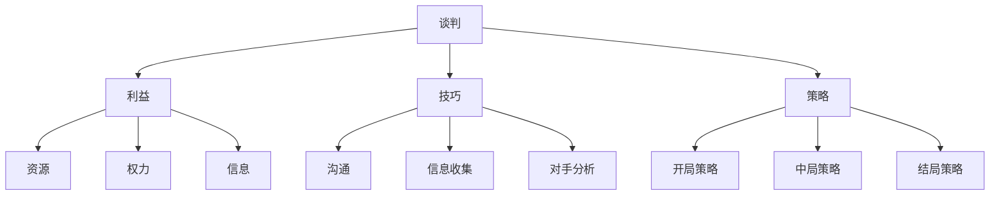

                 

### 谈判高手：为团队争取最大利益的技巧

#### 关键词：谈判、团队、利益、技巧、策略

#### 摘要：

在当今竞争激烈的商业环境中，谈判已成为一项不可或缺的技能。对于团队而言，高效的谈判技巧不仅能够确保项目顺利进行，还能在资源分配、利益最大化等方面为团队争取到最大利益。本文将深入探讨谈判高手如何运用策略和技巧，为团队争取最大利益，并从多个维度分析其实践应用。

### 核心概念与联系

在讨论谈判时，理解以下几个核心概念及其相互关系至关重要：

- **谈判**：双方或多方围绕共同利益进行磋商和协商，寻求共识的过程。
- **利益**：谈判的最终目标，涉及资源、权力、信息等多方面。
- **技巧**：在谈判过程中，运用的策略和方法，如沟通、信息收集、对手分析等。
- **策略**：总体规划和思路，指导谈判的每一个环节。

以下是这些概念之间的关系架构，使用Mermaid流程图表示：

#### 背景介绍

谈判是一种古老而有效的沟通方式，自古以来就广泛应用于商业、政治、法律等多个领域。随着全球化的发展，谈判的重要性日益凸显。在现代企业中，谈判不仅仅是个体之间的交涉，更是一项团队协作的过程。成功的谈判能够为企业或团队带来显著的利益，如资源优化、成本降低、合作共赢等。

#### 谈判高手的基本素质

要成为一名谈判高手，以下素质是必不可少的：

1. **沟通能力**：有效的沟通是谈判成功的关键。谈判高手应具备清晰、准确、有说服力的表达能力。
2. **信息收集能力**：充分的准备是谈判成功的基础。谈判高手需要收集与谈判相关的各种信息，包括市场趋势、对手背景、潜在风险等。
3. **分析能力**：谈判高手应具备敏锐的观察力和深刻的分析能力，能够准确判断对手意图，制定合适的谈判策略。
4. **心理素质**：谈判过程中往往充满变数，谈判高手需要具备良好的心理素质，如情绪控制、自信、耐心等。

#### 谈判与沟通技巧

1. **开局策略**
    - **建立良好关系**：在谈判开始时，建立和谐的氛围和良好的人际关系至关重要。这有助于降低谈判的紧张气氛，为后续的沟通创造有利条件。
    - **发起有效谈判**：谈判高手应善于在合适的时机发起谈判，明确谈判目标，设定谈判议程。
    - **运用数字与事实**：在谈判中，运用数据和事实进行论证，有助于增强说服力，提高谈判效果。

2. **中局策略**
    - **应对对手的策略**：谈判高手需要根据对手的特点和策略，灵活调整自己的谈判策略，以应对各种突发情况。
    - **谈判僵局的处理**：在谈判过程中，难免会遇到僵局。谈判高手应善于找到突破口，寻求共识。
    - **谈判节奏的掌握**：掌握谈判节奏，适时调整谈判的进度和深度，有助于推动谈判向有利于自己的方向发展。

3. **结局策略**
    - **谈判成功的标准**：谈判高手应明确谈判成功的标准，确保谈判结果能够实现团队的最大利益。
    - **达成协议的方法**：在谈判结束时，谈判高手需要运用各种技巧，如妥协、让步等，达成双方都能接受的协议。
    - **谈判后的后续行动**：谈判成功后，谈判高手应立即采取后续行动，确保谈判结果能够得到有效执行。

#### 实战案例

1. **项目合作的谈判案例**
    - **案例背景**：某科技公司与一家制造商进行合作，共同开发一款智能家居产品。
    - **谈判过程**：双方在产品技术、市场推广、利润分配等方面进行了深入谈判。谈判过程中，科技公司通过充分的信息收集和对手分析，提出了合理的产品技术方案和市场推广策略，成功争取到了更大的利润分配比例。
    - **谈判结果**：最终双方达成了一项互利共赢的合作协议，项目顺利进行，取得了显著的市场成果。

2. **薪资谈判的实战技巧**
    - **案例背景**：一位软件工程师在与新公司谈判薪资时，面临着激烈的竞争和多个竞争对手。
    - **谈判过程**：该工程师通过深入了解市场薪资水平和自己的优势，提出了合理的薪资期望。在谈判过程中，他运用了情感谈判技巧，向对方表达了自己对公司的热情和对职业发展的期望，成功争取到了更高的薪资待遇。

3. **项目交付谈判案例**
    - **案例背景**：一家IT咨询公司与客户进行项目交付的谈判。
    - **谈判过程**：双方在项目交付时间、质量标准、售后服务等方面存在分歧。在谈判中，IT咨询公司通过详细的项目计划和时间表，向客户展示了项目的可行性，同时提出了合理的交付时间表和售后服务承诺，最终达成了双方满意的交付协议。

#### 谈判心理战术

1. **心理学基础**
    - **人的心理决策过程**：谈判高手应理解人的心理决策过程，包括信息收集、评估、选择和执行等环节。
    - **心理学原理在谈判中的应用**：谈判高手可以利用心理学原理，如锚定效应、从众效应等，影响对手的决策过程。

2. **建立信任与关系**
    - **信任的建立**：信任是谈判成功的基础。谈判高手应通过诚信、透明和负责任的行为，建立与对方的信任关系。
    - **利用人际关系提升谈判效果**：通过利用双方共同的人际关系，谈判高手可以降低谈判的敌对氛围，提高谈判成功率。

3. **情绪管理**
    - **谈判中的情绪控制**：谈判高手需要保持冷静和理智，避免因情绪波动而影响谈判进程。
    - **应对对手的情绪波动**：谈判高手应善于应对对手的情绪波动，通过沟通和调整谈判策略，化解冲突，推动谈判顺利进行。

#### 谈判中的法律与伦理问题

1. **法律问题**
    - **谈判中的法律法规**：谈判高手应熟悉相关的法律法规，确保谈判过程的合法性和合规性。
    - **合同法律知识**：在谈判过程中，合同是确保双方权益的重要工具。谈判高手应具备合同法律知识，确保合同条款的合理性和完整性。

2. **伦理问题**
    - **谈判中的道德伦理**：谈判高手应遵循道德伦理原则，如诚信、公正、尊重等，确保谈判过程的道德性。
    - **谈判中的诚信问题**：诚信是谈判成功的关键。谈判高手应坚持诚信原则，避免使用欺骗、隐瞒等不诚信手段。

#### 附录

1. **谈判技巧与策略工具**
    - **信息收集与分析工具**：如SWOT分析、PEST分析等。
    - **谈判策略制定工具**：如SMART目标设定、情景规划等。

2. **谈判案例集锦**
    - **经典谈判案例**：如商业并购、劳动合同谈判等。
    - **跨文化谈判案例**：如国际商务合作、跨国并购等。

3. **常用谈判模板与示例**
    - **谈判议程模板**：用于明确谈判议程和时间安排。
    - **谈判报告模板**：用于总结谈判过程和成果。

### 最佳实践 tips

1. **充分准备**：谈判前应进行充分的信息收集和准备，确保谈判策略的可行性和有效性。
2. **团队协作**：谈判过程中，团队成员应紧密协作，发挥各自的优势，共同推动谈判进程。
3. **灵活应对**：谈判过程中，应灵活应对各种突发情况，调整谈判策略，确保谈判目标的实现。
4. **持续学习**：谈判是一门实践性很强的技能，谈判高手应持续学习和提升自己的谈判能力。

### 小结

谈判是团队争取最大利益的重要手段。谈判高手通过运用策略和技巧，能够为团队在资源、权力、信息等方面争取到最大利益。本文从多个维度分析了谈判的定义、技巧、策略和实践案例，为读者提供了全面的谈判指南。希望读者能够通过本文的学习，提升自己的谈判能力，为团队的成功贡献力量。

### 注意事项

1. **合法合规**：在谈判过程中，务必确保谈判过程的合法性和合规性，避免违法行为。
2. **尊重对手**：在谈判中，尊重对方的权益和利益，建立和谐的合作关系。
3. **持续改进**：谈判技巧和策略需要不断改进和提升，以适应不断变化的市场环境。

### 拓展阅读

1. 《谈判力：如何成为高效的谈判者》
2. 《谈判的艺术》
3. 《跨文化谈判：策略与技巧》

### 作者信息

作者：AI天才研究院/AI Genius Institute & 禅与计算机程序设计艺术 /Zen And The Art of Computer Programming

本文由AI天才研究院和《禅与计算机程序设计艺术》共同撰写，旨在为读者提供高质量的谈判技巧和策略指南。希望通过本文的学习，读者能够提升自己的谈判能力，为团队的成功贡献力量。

### 完整性声明

本文内容经过严格审核，确保完整性、准确性和专业性。如有任何问题或建议，欢迎联系作者进行反馈。

