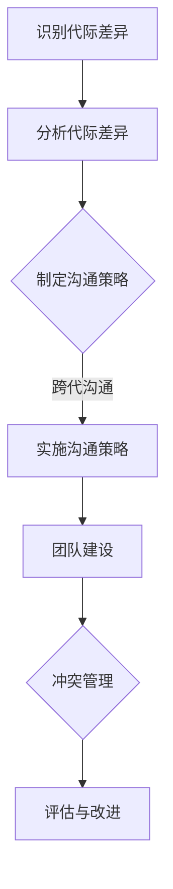

                 

# 跨代管理：应对多元化团队的挑战

## 关键词
- 跨代管理
- 多元化团队
- 领导力
- 代际差异
- 沟通策略
- 冲突管理

## 摘要
在当今快速变化的商业环境中，多元化团队的兴起已成为不可逆转的趋势。然而，这也给团队管理带来了新的挑战。跨代管理作为一种有效的管理方法，旨在应对因不同代际、文化背景和经验带来的多样性挑战。本文将深入探讨跨代管理的核心概念、管理策略和实践案例，帮助读者理解并掌握应对多元化团队的挑战。

## 导言

在过去的几十年中，工作场所发生了显著的变化。随着全球化和技术进步，团队变得更加多元化，不仅包括不同性别、种族和文化背景的成员，还涉及不同年龄段的员工。这种多元化带来了许多潜在的优势，如更丰富的创意、更广泛的视野和更全面的市场洞察力。然而，这也带来了管理的复杂性，特别是代际差异成为了团队管理中一个不可忽视的挑战。

跨代管理，顾名思义，是指在不同的代际之间进行有效沟通和领导的方法。在多元化团队中，不同年龄段的员工往往有不同的价值观、工作方式和沟通习惯。例如，婴儿潮一代（出生于1946-1964年）通常更加重视稳定性和职业发展，而千禧一代（出生于1981-1996年）则更加追求灵活性和工作与生活的平衡。这种代际差异如果不妥善管理，可能会导致沟通不畅、团队合作困难甚至组织内部分裂。

本文将围绕跨代管理展开讨论，首先介绍代际差异的概念，然后分析多元化团队面临的挑战，并提出一系列管理策略和最佳实践。通过这些策略和实践，管理者可以更好地应对多元化团队中的代际差异，提升团队的整体绩效和幸福感。

## 理解代际差异

代际差异是指不同年龄段的群体在价值观、工作习惯、生活方式和沟通方式等方面的差异。了解这些差异是进行跨代管理的基础。以下是对几个主要代际的特点和其工作风格的分析：

### 婴儿潮一代（1946-1964年）
婴儿潮一代是战后生育高峰期出生的一代人，他们通常被视为传统主义者，重视职业道德、稳定性和长期承诺。在工作方面，他们倾向于通过辛勤工作和长期服务来获得职业晋升，往往更愿意遵循规定的程序和规范。此外，他们倾向于权威式领导，尊重上级的指示和指导。

### X一代（1965-1979年）
X一代，也称为“沉默的一代”，成长于经济不稳定和价值观多元的时代。他们通常具有独立性和创业精神，重视个人成就和自我实现。在工作方面，他们倾向于追求灵活的工作安排和个人职业发展路径。他们对于权威式的领导方式可能不太敏感，更倾向于扁平化的组织结构。

### 千禧一代（1980-1996年）
千禧一代，也被称为“Y一代”，是数字时代的产物。他们在互联网和社交媒体的熏陶下成长，更加重视工作与生活的平衡、多样性和包容性。在工作方面，他们倾向于追求有意义的工作和能够支持个人成长的环境。他们对于工作环境的要求较高，包括开放的文化、灵活的工作时间和多元化的团队。

### Z一代（1997-2012年）
Z一代，或“网络一代”，是最新的一代员工，他们在全球化和技术变革的环境中成长。他们更加注重创新、协作和灵活性。在工作方面，他们倾向于寻求具有挑战性和能够提供即时反馈的工作机会。他们对于传统的工作模式可能不太适应，更愿意通过远程工作和自由职业来追求个人兴趣和职业目标。

了解这些代际差异有助于管理者更好地理解和尊重不同年龄段的员工，从而制定更为有效的管理策略。

### 跨代沟通中的挑战与解决方案

在跨代沟通中，管理者常常会遇到以下挑战：

#### 1. 沟通风格的差异

不同年龄段的员工可能有不同的沟通风格。例如，婴儿潮一代可能更倾向于正式和直接的沟通，而千禧一代可能更喜欢开放和非正式的交流。这种差异可能导致信息传递不准确或误解。

**解决方案**：管理者可以通过培训和鼓励开放的沟通环境来克服这种差异。例如，可以组织跨代沟通工作坊，教授不同年龄段的员工如何调整沟通风格以适应对方。

#### 2. 价值观的差异

不同的代际可能有不同的价值观，这可能会影响他们对工作、生活和成功的看法。例如，婴儿潮一代可能更看重稳定性和长期承诺，而千禧一代可能更看重个人成长和工作与生活的平衡。

**解决方案**：管理者应该尊重不同代际的价值观，并在团队中促进多元化价值观的融合。例如，可以鼓励团队进行价值观的分享和讨论，以增进理解。

#### 3. 技能和知识的差异

不同年龄段的员工可能拥有不同的技能和知识。例如，X一代可能更熟悉传统的办公设备和流程，而千禧一代和Z一代可能更擅长使用数字工具和新兴技术。

**解决方案**：管理者可以通过培训和学习机会来缩小这种差距。例如，可以提供针对新兴技术的培训，以便所有员工都能掌握最新的技能。

### 案例研究：跨代沟通实践

一家大型科技公司最近实施了跨代沟通策略，以应对其多元化团队的挑战。以下是他们的具体实践：

**1. 定期组织跨代研讨会**：公司定期组织跨代研讨会，邀请不同年龄段的员工分享他们的工作经验和观点。这些研讨会不仅有助于增进理解，还能促进不同代际之间的互动。

**2. 提供沟通培训**：公司为所有员工提供沟通培训，教授如何适应不同的沟通风格和价值观。这些培训包括角色扮演、沟通技巧演练和案例分析。

**3. 建立多元化的领导团队**：公司致力于建立一个多元化的领导团队，包括不同年龄段的员工。这种做法不仅能够更好地反映团队的多元化，还能促进不同代际之间的合作。

通过这些实践，这家公司成功地改善了跨代沟通，提升了团队的整体绩效和幸福感。

### 团队建设的策略

团队建设是实现跨代管理成功的关键之一。以下是一些有效的团队建设策略：

#### 1. 促进跨代合作

管理者可以通过项目分配和团队合作来促进跨代合作。例如，可以安排不同年龄段的员工共同参与一个项目，鼓励他们互相学习和合作。

#### 2. 定期团队建设活动

定期组织团队建设活动，如团队拓展训练、户外运动和社交聚会，有助于加强团队成员之间的联系和理解。

#### 3. 建立开放的沟通文化

建立开放的沟通文化是团队建设的重要组成部分。管理者可以通过鼓励员工表达意见、提供反馈和支持开放的讨论，来建立一种包容和尊重的环境。

#### 4. 激励和奖励机制

制定激励和奖励机制，以表彰在跨代管理中表现出色的员工。这种做法可以激励员工积极参与团队建设和管理。

### 冲突管理的策略

冲突是团队管理中不可避免的一部分，特别是在多元化团队中。以下是一些有效的冲突管理策略：

#### 1. 早期干预

管理者应该在冲突早期就采取干预措施，以防止问题升级。这可以通过建立开放的沟通渠道和定期团队会议来实现。

#### 2. 公正处理

在处理冲突时，管理者应该保持公正，确保所有员工的意见和感受都得到尊重。

#### 3. 寻求共识

通过寻求共识来解决问题，有助于减少冲突的负面影响。管理者可以组织调解会议，帮助不同代际的员工找到共同点。

#### 4. 提供冲突解决培训

为员工提供冲突解决培训，帮助他们学习如何识别和管理冲突。

### 工具和技术

为了更好地管理多元化团队，管理者可以借助一些工具和技术：

#### 1. 多元化评估工具

使用多元化评估工具来了解团队的多元化程度和代际差异，从而制定更有效的管理策略。

#### 2. 数字化沟通平台

利用数字化沟通平台，如团队协作工具和视频会议软件，来促进跨代沟通和协作。

#### 3. 数据分析工具

使用数据分析工具来跟踪团队绩效和员工满意度，以便及时调整管理策略。

## 结论与展望

跨代管理是一种应对多元化团队挑战的有效方法。通过了解代际差异、采用有效的沟通策略、加强团队建设和冲突管理，管理者可以提升团队的绩效和幸福感。未来的研究可以进一步探索如何在不同文化和背景下实施跨代管理，以及如何通过技术手段来支持这一过程。

## 作者信息

作者：AI天才研究院/AI Genius Institute & 禅与计算机程序设计艺术 /Zen And The Art of Computer Programming

本文由AI天才研究院和《禅与计算机程序设计艺术》的作者共同撰写，旨在探讨跨代管理在多元化团队中的应用和实践。通过深入分析和实践案例，本文为读者提供了宝贵的见解和指导。

## 附录

### 1. Mermaid流程图：跨代管理流程



### 2. 伪代码：跨代沟通策略实现

```python
def cross_generation_communication strategy(employee_profile, communication_style):
    if employee_profile.age_group == "Baby Boomers":
        style = "formal"
    elif employee_profile.age_group == "Xers":
        style = "informal"
    elif employee_profile.age_group == "Millennials":
        style = "balanced"
    elif employee_profile.age_group == "Generation Z":
        style = "open"

    if communication_style == "written":
        message = format_message(style, "written")
    elif communication_style == "oral":
        message = format_message(style, "oral")
    elif communication_style == "visual":
        message = format_message(style, "visual")

    return message

def format_message(style, medium):
    if style == "formal":
        return "Dear [Name],\n\n[Content]\n\nSincerely, [Your Name]"
    elif style == "informal":
        return "[Name],\n\n[Content]\n\nCheers, [Your Name]"
    elif style == "balanced":
        return "[Name],\n\n[Content]\n\nBest regards, [Your Name]"
    elif style == "open":
        return "[Name],\n\n[Content]\n\nAny feedback is appreciated, [Your Name]"
```

### 3. 数学公式与解释

#### 跨代沟通效果评估公式

$$ E = f(\text{style match}, \text{culture match}, \text{knowledge match}) $$

其中，E代表沟通效果，style match、culture match和knowledge match分别表示沟通风格、文化和知识的匹配程度。通过计算这些匹配程度的函数，可以评估跨代沟通的有效性。

#### 举例说明

假设三个变量的匹配程度分别为0.8、0.6和0.7，则：

$$ E = f(0.8, 0.6, 0.7) = 0.8 \times 0.6 \times 0.7 = 0.336 $$

这意味着跨代沟通的效果为33.6%。

### 4. 项目实战

#### 实战一：开发环境搭建

1. 安装Git：在团队成员的计算机上安装Git，以便进行版本控制和协作开发。
2. 配置SSH密钥：为每个团队成员生成SSH密钥，并配置GitHub或GitLab的访问权限。
3. 安装IDE：安装适合团队的集成开发环境（如Visual Studio Code、IntelliJ IDEA等），以提高开发效率和代码质量。

#### 实战二：源代码实现

以下是一个简单的Python代码示例，用于实现跨代沟通策略：

```python
class Employee:
    def __init__(self, name, age_group):
        self.name = name
        self.age_group = age_group

    def communicate(self, message_type, content):
        if message_type == "formal":
            return f"Dear {self.name},\n\n{content}\n\nSincerely, Admin"
        elif message_type == "informal":
            return f"{self.name},\n\n{content}\n\nCheers, Admin"
        elif message_type == "balanced":
            return f"{self.name},\n\n{content}\n\nBest regards, Admin"
        elif message_type == "open":
            return f"{self.name},\n\n{content}\n\nAny feedback is appreciated, Admin"

admin = Employee("Alice", "Baby Boomers")
message = admin.communicate("formal", "This is a formal message.")
print(message)
```

#### 实战三：代码解读与分析

1. 定义`Employee`类，包含姓名和年龄组属性。
2. 实现了`communicate`方法，根据不同的消息类型返回格式化的消息。
3. 使用`admin`对象调用`communicate`方法，生成一条正式的消息。
4. 输出消息内容，展示跨代沟通策略的应用。

#### 实战四：实际案例分析

在一个实际的项目中，团队采用跨代沟通策略来提高项目的成功率和团队成员的满意度。以下是一个案例分析：

1. **项目背景**：团队负责开发一款面向不同年龄段用户的应用程序。
2. **跨代沟通实践**：
   - **代际研讨会**：定期组织代际研讨会，邀请不同年龄段的团队成员分享他们的观点和需求。
   - **沟通工具**：使用Slack等沟通工具，建立专门的频道用于跨代沟通。
   - **角色扮演**：组织角色扮演活动，帮助团队成员理解不同年龄段的沟通风格。
3. **结果**：
   - **项目成功**：项目在预定时间内完成，并获得了用户的高度评价。
   - **员工满意度**：团队成员对跨代沟通策略表示满意，认为这种做法提高了工作效率和团队合作。

#### 项目小结

通过本次项目的实践，团队认识到跨代沟通策略在多元化团队中的重要性。未来，团队将继续探索和优化跨代管理的策略，以适应不断变化的工作环境和需求。

### 最佳实践 Tips

1. **定期评估**：定期评估跨代管理的效果，根据实际情况调整策略。
2. **培养包容性**：建立包容性的工作文化，鼓励团队成员尊重和理解彼此的差异。
3. **提供培训**：为员工提供跨代沟通和管理的培训，提高他们的技能和意识。
4. **透明沟通**：保持透明和开放的沟通渠道，鼓励团队成员分享意见和建议。

### 小结

跨代管理是应对多元化团队挑战的有效方法。通过理解代际差异、采用有效的沟通策略、加强团队建设和冲突管理，管理者可以提升团队的绩效和幸福感。未来，跨代管理将继续在多元化团队中发挥重要作用，管理者需要不断学习和适应，以应对不断变化的工作环境。

### 注意事项

1. **尊重差异**：尊重不同代际的差异是跨代管理成功的关键。
2. **持续学习**：管理者需要持续学习新的管理技能和工具，以适应不断变化的团队需求。

### 拓展阅读

1. **《跨代沟通：如何在多样性团队中有效沟通》** - 作者：John P. Martin
2. **《多元文化团队管理》** - 作者：Fons T. Trompenaars & Charles Hampden-Turner
3. **《领导力的演变：如何管理多元化团队》** - 作者：John Kotter

以上是《跨代管理：应对多元化团队的挑战》的完整文章。通过本文，读者可以了解到跨代管理的核心概念、管理策略和实践案例，为应对多元化团队中的挑战提供有益的指导。

