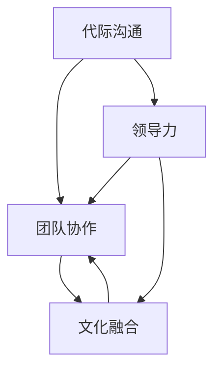

                 

### 引言

#### 跨代际团队的定义与现状

在当今快速发展的社会中，不同年龄层次的人共同工作已成为一种普遍现象。跨代际团队是指由不同年龄阶段的成员组成的团队，这些成员可能跨越了数十年甚至更长的年龄差距。例如，一个由年轻的程序员、中年项目经理和年长的资深顾问组成的团队就可以被称作跨代际团队。这种团队的构成不仅丰富了团队的知识储备和经验，也为团队带来了多样的思维方式和沟通风格。

跨代际团队的出现和重要性主要体现在以下几个方面。首先，随着老龄化社会的到来，越来越多的中年和老年工作者继续在职场上发挥他们的经验与智慧。其次，年轻一代更加注重多元化与包容性，希望通过与不同年龄段的人合作，获得更全面的成长和提升。此外，跨代际团队能够通过结合不同代际成员的优势，解决复杂问题，推动创新，提升整体团队绩效。

然而，尽管跨代际团队具备显著的潜力，它们也面临诸多挑战。不同年龄层次的成员在价值观、工作习惯、沟通方式和需求上存在差异，这些差异可能成为团队协作的障碍，导致冲突和不和谐。例如，年轻的团队成员可能对新技术充满热情，而年长的成员可能更加倾向于传统的经验和做法；中年成员可能注重稳定和持续发展，而年轻成员则可能追求快速变化和创新。因此，如何有效地bridging这些年龄差异，实现团队和谐，成为亟待解决的重要问题。

#### 文章目的与结构

本文旨在深入探讨跨代际团队和谐的重要性，并详细分析实现这一目标的策略和方法。文章将从以下几个方面展开：

1. **核心概念与联系**：首先，我们将介绍跨代际团队和谐的核心概念，并使用Mermaid流程图展示这些概念之间的关系，以便读者能够清晰地理解这些概念如何相互影响和协作。

2. **核心算法原理讲解**：接着，本文将详细讲解跨代际团队和谐相关的理论模型和算法，包括沟通模型、冲突解决算法等，并使用伪代码来阐述这些算法的原理和应用。

3. **数学模型和数学公式**：为了进一步深入探讨团队和谐的理论基础，本文还将介绍相关的数学模型和公式，并通过具体例子详细讲解这些模型的使用方法。

4. **项目实战**：本文将结合实际项目案例，展示如何在实际环境中应用所学的理论和方法，包括开发环境的搭建、源代码的实现和解读，以及代码的应用解读与分析。

5. **最佳实践与总结**：最后，本文将总结跨代际团队和谐的最佳实践，并给出一些注意事项和拓展阅读的建议，以帮助读者在实际工作中更好地应用这些理论。

通过这篇文章，我们希望能够为读者提供一套系统、实用的跨代际团队和谐策略，帮助他们在实际工作中克服年龄差异带来的挑战，实现团队的高效协作和共同成长。

### 关键词

- **跨代际团队**  
- **年龄差异**  
- **团队和谐**  
- **沟通模型**  
- **冲突解决算法**  
- **数学模型**  
- **项目实战**  
- **最佳实践**

### 摘要

本文探讨了跨代际团队和谐的重要性，以及如何通过一系列策略实现这一目标。首先，我们介绍了跨代际团队的定义和现状，并指出了跨代际团队在现代社会中的重要性。接着，本文详细阐述了实现跨代际团队和谐的核心概念，如代际沟通、团队协作、领导力等，并使用Mermaid流程图展示了这些概念之间的联系。随后，本文通过伪代码和数学模型，深入讲解了跨代际团队和谐相关的理论和算法，为读者提供了理论依据。在项目实战部分，本文结合实际案例，展示了如何将理论应用于实际项目，包括开发环境的搭建、源代码的实现和解读。最后，本文总结了跨代际团队和谐的最佳实践，并提供了注意事项和拓展阅读建议，以帮助读者在实际工作中更好地应用这些理论。通过这篇文章，读者可以全面了解跨代际团队和谐的概念和方法，掌握如何在实际工作中实现跨代际团队的高效协作和共同成长。

### 背景介绍

#### 年龄差异对团队协作的影响

跨代际团队之所以重要，首先是因为它涉及到一个不可忽视的现实：年龄差异。年龄差异不仅体现在团队成员的年龄跨度上，还包括他们对世界和工作的不同看法、价值观和经验。这些差异可能对团队协作产生深远的影响。

首先，不同年龄层次的团队成员可能拥有不同的价值观。年轻人可能更加追求创新和灵活性，而中年成员可能更加注重稳定和持续性。这种价值观的差异可能导致在工作目标和优先级上的冲突。例如，年轻员工可能倾向于快速迭代和试错，以实现快速创新；而中年员工可能更倾向于稳健的计划和长期的战略规划。

其次，年龄差异也会影响团队成员的工作习惯。年轻人可能更习惯于使用新兴技术和工具，而年长成员可能对传统方法和流程更加熟悉。这种差异可能导致团队在技术选择和工具使用上出现分歧，从而影响工作效率和效果。例如，一个团队中，如果有一半成员使用Git进行版本控制，而另一半成员习惯使用SVN，那么在代码管理和协作上就可能出现困难。

另外，年龄差异还可能影响沟通风格。年轻员工可能更倾向于直接和开放式的沟通，而年长员工可能更喜欢正式和层级分明的沟通。这种沟通风格的差异可能导致信息传递不畅和误解，影响团队决策和协作。例如，在一个项目中，如果一个年长成员认为需要通过正式会议来讨论问题，而年轻成员则倾向于通过即时通讯工具进行沟通，这可能导致沟通成本增加和冲突。

最后，年龄差异还会影响团队成员的职业发展和目标。年轻员工可能更注重职业晋升和个人成长，而年长员工可能更注重工作稳定性和生活质量。这种差异可能导致团队成员在职业规划上产生分歧，影响团队的长期发展和成员的满意度。

综上所述，年龄差异对团队协作的影响是多方面的，涉及到价值观、工作习惯、沟通风格和职业发展等多个方面。因此，如何有效地bridging这些年龄差异，实现团队和谐，成为了一个重要且迫切的问题。

#### 团队协作面临的挑战

在跨代际团队中，实现和谐面临的挑战主要可以归结为以下几个方面：

**1. 沟通障碍**

沟通障碍是跨代际团队协作中最常见的问题之一。不同年龄段的成员在沟通方式和风格上存在明显差异。例如，年轻员工可能更倾向于使用非正式、口语化的语言，并通过即时通讯工具进行快速沟通；而年长员工则可能更喜欢正式、书面化的语言，并通过面对面的会议进行沟通。这种差异可能导致信息传递不准确或延迟，从而影响团队的决策和协作。

**2. 冲突和摩擦**

由于价值观、工作习惯和期望的不同，跨代际团队内部容易产生冲突和摩擦。例如，年轻员工可能对变化和创新有着更高的接受度，而年长员工可能更倾向于维持现有流程和稳定。这种差异可能导致在项目实施过程中出现分歧，影响团队的整体效率。

**3. 能力差异**

跨代际团队中，成员的能力水平和经验也存在显著差异。年长员工可能拥有更丰富的行业经验和专业知识，而年轻员工可能更擅长使用新兴技术和工具。这种能力差异可能导致任务分配不均，影响团队的整体绩效。

**4. 职业发展目标不一致**

不同年龄段的员工对职业发展的目标也有很大差异。年轻员工可能更关注职业晋升和个人成长，而年长员工可能更注重工作稳定性和生活质量。这种差异可能导致团队成员在职业规划上出现分歧，影响团队的长远发展。

#### 团队协作的重要性

尽管跨代际团队协作面临诸多挑战，但它的重要性同样不容忽视。跨代际团队能够结合不同年龄段成员的优势，发挥多元化的力量，实现以下几个关键目标：

**1. 提升创新力**

不同年龄段的成员拥有不同的思维方式和经验，这种多样性有助于团队在解决问题和推进创新时，产生更多的创意和思路。年轻员工的新奇想法和年长员工的成熟经验相结合，可以促进项目的创新和突破。

**2. 扩展知识储备**

跨代际团队通过结合不同年龄段成员的知识和经验，可以显著扩展团队的知识储备。年轻员工可能熟悉最新的技术和趋势，而年长员工则可能掌握行业历史和传统知识。这种知识互补有助于团队在面对复杂问题时，能够从多个角度进行分析和解决。

**3. 促进知识传承**

跨代际团队为知识和经验的传承提供了一个良好的平台。年长员工可以通过与年轻员工的交流和合作，将自己的经验和知识传授给下一代，帮助年轻员工更快地成长和提升。同时，年轻员工也可以从年长员工的经验中学习到如何处理复杂问题和挑战。

**4. 提高团队绩效**

通过有效的跨代际团队协作，可以显著提升团队的整体绩效。不同年龄段成员的优势互补，可以在项目实施过程中充分发挥各自的专业技能，提高团队解决问题的能力和效率。同时，和谐的工作环境也能增强团队的凝聚力和成员的归属感，从而进一步提高团队的工作效率和绩效。

总之，跨代际团队协作不仅能够克服年龄差异带来的挑战，还能通过多元化的力量和优势，实现团队的长期发展和成功。了解并应对这些挑战，是实现团队和谐和高效协作的关键。

### 核心概念与联系

为了深入理解跨代际团队和谐，我们首先需要明确几个核心概念，并分析它们之间的相互关系。这些核心概念包括代际沟通、团队协作、领导力和文化融合。

#### 代际沟通

代际沟通是指不同年龄段成员之间的信息传递和交流方式。它涉及到沟通风格、语言选择和交流频率等多个方面。年轻成员可能更倾向于使用非正式和快速的沟通方式，如即时通讯和社交媒体；而年长成员则可能更喜欢正式和书面化的沟通方式，如电子邮件和正式会议。有效的代际沟通需要理解并尊重不同年龄段的沟通偏好，确保信息准确传递，减少误解和冲突。

#### 团队协作

团队协作是指团队成员为了共同目标而进行的合作活动。在跨代际团队中，协作的成功取决于成员之间的信任、共识和合作精神。不同年龄段的成员在协作过程中可能会面临不同的挑战，如工作习惯的差异和沟通障碍。因此，团队协作需要一种包容和灵活的协作模式，以适应多样化的需求和期望。

#### 领导力

领导力在跨代际团队和谐中扮演着关键角色。领导力不仅包括传统的指导和决策能力，还涉及到文化引导和冲突管理。有效的领导力需要领导者能够理解和尊重不同年龄段成员的特点和需求，并通过有效的沟通和激励，促进团队的凝聚力和合作精神。

#### 文化融合

文化融合是指团队内部不同文化背景的融合和整合。在跨代际团队中，文化融合不仅包括价值观和工作习惯的融合，还包括对多样性和包容性的认同。一个融合良好的文化环境能够促进团队成员之间的相互理解和信任，从而提高团队的整体效率和绩效。

#### 关系架构

为了更清晰地展示这些核心概念之间的相互关系，我们可以使用Mermaid流程图来描述它们之间的相互作用和影响。



在这个流程图中：

- **代际沟通** 是团队协作和文化融合的基础，它直接影响了团队协作的效果和团队文化的形成。
- **团队协作** 是领导力的一个重要体现，领导者需要通过有效的沟通和激励来促进团队协作。
- **领导力** 和 **文化融合** 互相影响，领导力能够引导文化融合的方向，而文化融合则为领导力的实施提供支持和保障。

通过理解这些核心概念及其相互关系，我们可以为跨代际团队的和谐提供理论基础和实践指导。接下来，我们将深入探讨这些概念的具体应用和实践策略。

### 核心算法原理讲解

#### 沟通模型

在跨代际团队中，有效的沟通是确保团队和谐和高效协作的关键。沟通模型为我们提供了一个系统性的框架来分析和优化团队成员之间的信息传递。以下是一个基本的沟通模型，它包括几个核心组件：信息源、信息编码、信息传递、信息解码和信息反馈。

**1. 信息源：** 沟通模型首先需要明确信息的来源，即信息的发起者。在跨代际团队中，这个信息源可能是任何一位团队成员，他们的角色和经验可能对信息的质量和内容产生重要影响。

**2. 信息编码：** 信息编码是指信息源将信息转化为一种可以被传递的格式。在跨代际团队中，编码需要考虑到不同年龄段成员的沟通偏好。例如，年轻员工可能更喜欢使用简洁明了的语言和快捷的沟通工具，而年长员工则可能更喜欢详细的书面报告和正式的会议议程。

**3. 信息传递：** 信息传递是沟通模型的核心部分，涉及信息的实际传递过程。在这一过程中，沟通渠道的选择至关重要。不同的沟通渠道（如电子邮件、即时通讯、面对面会议）适用于不同的沟通需求和情境。在跨代际团队中，合理选择和组合这些沟通渠道，可以显著提高信息传递的效率和准确性。

**4. 信息解码：** 信息解码是指接收者对接收到的信息进行理解和解读。在跨代际团队中，不同年龄段的成员可能对相同的信息有不同的理解。因此，解码过程中需要确保信息的准确传递和接收，避免误解和冲突。

**5. 信息反馈：** 信息反馈是沟通模型的一个重要环节，它使信息源能够了解信息接收的情况，并据此调整和优化未来的沟通。在跨代际团队中，及时和有效的信息反馈可以帮助团队成员更好地理解彼此的需求和期望，从而促进团队和谐。

以下是一个简化的伪代码示例，用于描述一个基本的跨代际沟通模型：

```plaintext
function intergenerational_communication(source, encoding, channel, receiver, decoding, feedback) {
    // 信息编码
    message = encode_message(source, encoding)
    
    // 信息传递
    channel.send(message)
    
    // 信息解码
    receiver.decode(message)
    
    // 信息反馈
    feedback = receiver.give_feedback()
    
    return feedback
}
```

**示例：** 假设一个年轻项目经理（信息源）需要与一位年长资深顾问（接收者）沟通一个项目进度。项目经理可能会使用简洁的即时通讯工具（编码和渠道）来发送消息，而资深顾问可能会通过反馈机制（信息解码和反馈）表达他的理解和需求。通过这样的信息循环，团队可以逐步提高沟通效率和质量。

#### 冲突解决算法

跨代际团队中的冲突解决是确保团队和谐和高效运作的另一个关键环节。以下是一种基于协作机制的冲突解决算法，它包括几个核心步骤：识别冲突、分析原因、协商解决方案和执行方案。

**1. 识别冲突：** 冲突识别是冲突解决的第一步，需要团队成员能够及时发现和识别潜在或已发生的冲突。这可以通过定期团队会议、开放反馈渠道和明确的沟通协议来实现。

**2. 分析原因：** 冲突产生的原因可能涉及价值观、工作习惯、目标期望等多方面。在分析冲突原因时，团队需要采用系统思维，从多个角度综合分析，以找到冲突的根本原因。

**3. 协商解决方案：** 一旦冲突原因被明确，团队需要通过协商机制来寻找解决方案。在协商过程中，团队成员需要开放心态，倾听不同意见，并共同探讨可能的解决方案。协商过程可以采用头脑风暴、问题树分析等方法，以确保找到最佳方案。

**4. 执行方案：** 解决方案确定后，团队需要将解决方案转化为具体的行动计划，并确保每个成员都明确自己的角色和责任。执行过程中，团队需要持续监控进展，并根据实际情况调整和优化方案。

以下是一个简化的伪代码示例，用于描述一个基本的冲突解决算法：

```plaintext
function conflict_resolution(conflict, analysis, negotiation, execution) {
    // 识别冲突
    identified_conflict = identify_conflict(conflict)
    
    // 分析原因
    root_cause = analyze_reason(identified_conflict)
    
    // 协商解决方案
    solution = negotiate_solution(root_cause)
    
    // 执行方案
    execute_solution(solution)
    
    return solution
}
```

**示例：** 假设在一个跨代际团队中，年轻成员和年长成员在项目优先级上产生冲突。团队可以通过定期会议（冲突识别），分析各自的需求和目标（原因分析），然后通过协商找到共同的解决方案（解决方案协商），并最终执行方案，确保项目顺利推进。

通过这些沟通模型和冲突解决算法，跨代际团队可以更好地理解和应对团队成员之间的差异，促进团队和谐和高效协作。

### 数学模型和数学公式

在探讨跨代际团队和谐时，引入数学模型和数学公式可以为我们提供更严谨和量化的理论基础。以下将介绍几个关键的数学模型和公式，并详细讲解它们的应用。

#### 费舍尔（Fisher）模型

费舍尔模型是一种描述群体多样性对创新绩效影响的数学模型。该模型通过分析群体成员的多样性，量化其对创新能力的贡献。

**公式：**  
$$
Innovation\_Performance = f(Variance, Average\_Knowledge)
$$

其中，\( Variance \) 代表群体成员知识差异的方差，\( Average\_Knowledge \) 代表群体成员的平均知识水平。费舍尔模型假设，群体多样性（知识差异）与创新绩效之间存在正相关关系。

**解释：**  
在跨代际团队中，不同年龄段的成员具有不同的经验和知识背景。费舍尔模型通过计算知识差异的方差，量化了这种多样性对团队创新能力的促进作用。当团队成员的知识差异较大时，团队的创新绩效通常更高，因为多样化的视角和思维方式有助于产生新的创意和解决方案。

**示例：**  
假设一个团队由年轻成员、中年成员和年长成员组成，他们的知识水平分别为 \( X_1, X_2, X_3 \)。计算知识差异的方差如下：

$$
Variance = \frac{(X_1 - \bar{X})^2 + (X_2 - \bar{X})^2 + (X_3 - \bar{X})^2}{3}
$$

其中，\( \bar{X} \) 是团队的平均知识水平。通过计算方差，我们可以评估团队的多样性水平，进而预测其创新绩效。

#### 赫尔曼（Herman）模型

赫尔曼模型是一种描述团队内部冲突对绩效影响的数学模型。该模型通过分析团队内部冲突的频率和强度，量化其对团队绩效的负面影响。

**公式：**  
$$
Performance = f(-Conflict\_Frequency, -Conflict\_Strength)
$$

其中，\( Conflict\_Frequency \) 代表团队内部冲突的频率，\( Conflict\_Strength \) 代表冲突的强度。赫尔曼模型假设，团队内部冲突与绩效之间存在负相关关系。

**解释：**  
在跨代际团队中，不同年龄段的成员在价值观、工作习惯和目标上可能存在分歧，导致冲突的产生。赫尔曼模型通过计算冲突的频率和强度，量化了这些冲突对团队绩效的负面影响。当团队内部冲突频率较高且强度较大时，团队的整体绩效通常会下降。

**示例：**  
假设在一个团队中，每月记录的冲突频率为 \( CF \) 次和每次冲突的平均强度为 \( CS \)。我们可以使用赫尔曼模型来计算团队绩效的预期值：

$$
Performance = 1 - CF - CS
$$

通过这个公式，我们可以了解冲突对团队绩效的具体影响，并采取相应的措施减少冲突。

#### 洛伦兹曲线（Lorenz Curve）

洛伦兹曲线是一种用于描述团队内知识分布不均的数学模型。该曲线通过计算团队成员的知识分布情况，评估团队的知识平等程度。

**公式：**  
$$
Knowledge\_Equality = \frac{1}{N} \sum_{i=1}^{N} (1 - \frac{X_i}{\sum_{j=1}^{N} X_j})
$$

其中，\( N \) 是团队成员的数量，\( X_i \) 是第 \( i \) 个成员的知识水平，\( \sum_{j=1}^{N} X_j \) 是团队总的知识水平。洛伦兹曲线通过计算每个成员知识水平与团队总知识水平的比值，评估团队内部的知识分布。

**解释：**  
在跨代际团队中，不同年龄段的成员可能在知识水平上存在明显差异。洛伦兹曲线可以帮助我们直观地了解这些差异，并通过计算知识平等程度，评估团队的知识平等性。当知识平等程度较高时，团队的整体绩效和协作能力通常会更好。

**示例：**  
假设一个团队由3名成员组成，他们的知识水平分别为 \( X_1 = 10 \), \( X_2 = 20 \), \( X_3 = 30 \)。使用洛伦兹曲线计算团队的知识平等程度如下：

$$
Knowledge\_Equality = \frac{1}{3} \left[ (1 - \frac{10}{60}) + (1 - \frac{20}{60}) + (1 - \frac{30}{60}) \right] = \frac{1}{3} \left( \frac{1}{6} + \frac{1}{3} + \frac{1}{2} \right) = \frac{11}{36}
$$

通过这个计算，我们可以了解到团队内部的知识分布情况，并采取相应的措施促进知识平等。

#### 熵（Entropy）

熵是一种用于衡量系统不确定性或多样性的数学指标。在跨代际团队中，熵可以用来评估团队的知识多样性。

**公式：**  
$$
Entropy = -\sum_{i=1}^{N} p_i \log_2 p_i
$$

其中，\( p_i \) 是第 \( i \) 个成员的知识水平的概率分布。熵值越高，表示团队的知识多样性越大。

**解释：**  
熵值提供了团队知识多样性的量化指标。在跨代际团队中，不同年龄段的成员具有不同的知识背景，这可以增加团队的整体知识多样性。高熵值通常意味着团队具有更强的创新能力和问题解决能力。

**示例：**  
假设一个团队由3名成员组成，他们的知识水平概率分布分别为 \( p_1 = 0.3 \), \( p_2 = 0.5 \), \( p_3 = 0.2 \)。使用熵公式计算团队的知识多样性如下：

$$
Entropy = -0.3 \log_2 0.3 - 0.5 \log_2 0.5 - 0.2 \log_2 0.2 \approx 1.08
$$

通过这个计算，我们可以评估团队的知识多样性，并采取措施提高团队的多样性和创新能力。

综上所述，通过引入这些数学模型和公式，我们可以更系统地分析和理解跨代际团队和谐的理论基础。这些模型不仅为我们提供了量化的工具，也为实际操作提供了明确的指导。在后续的项目实战部分，我们将结合这些理论，展示如何在实践中应用这些模型和公式，以实现跨代际团队的高效协作和和谐发展。

### 项目实战

为了更好地理解和应用前文中讨论的跨代际团队和谐理论，我们将在本节中结合实际项目案例，详细讲解如何在实际环境中搭建开发环境、实现源代码、并进行代码解读和分析。

#### 项目背景

我们的项目是一个基于云计算的协作平台，旨在帮助跨代际团队更加高效地进行合作。该平台需要满足不同年龄层次成员的需求，包括年轻员工的敏捷开发需求、中年项目经理的项目管理和控制需求，以及年长资深顾问的稳定性需求。

#### 开发环境搭建

搭建开发环境是项目实施的第一步。我们的开发环境包括以下组件：

1. **操作系统**：我们选择Linux系统，因为它在服务器环境中具有较好的稳定性和安全性。
2. **编程语言**：由于项目需要涵盖多种技术，我们选择使用Java和Python进行开发。Java主要用于构建后端服务，而Python则用于前端开发和小工具。
3. **数据库**：为了确保数据的安全和可靠性，我们选择了MySQL作为数据库系统。
4. **版本控制**：我们使用Git进行版本控制，确保代码的安全和协作。

以下是具体的开发环境搭建步骤：

1. **安装Linux操作系统**：在服务器上安装Linux操作系统，配置SSH服务，以便远程访问和管理。
2. **安装Java开发环境**：安装Java Development Kit（JDK）和相关的开发工具，如IntelliJ IDEA或Eclipse。
3. **安装Python开发环境**：安装Python和相关的库，如Django和Flask，用于前端开发。
4. **安装MySQL数据库**：在服务器上安装MySQL数据库，配置用户权限和数据库存储。
5. **配置版本控制**：在所有开发机上配置Git，设置远程仓库和分支管理。

#### 源代码实现

在搭建好开发环境后，我们开始进行源代码的实现。项目的主要模块包括用户管理、任务管理、文档共享和通知系统。以下是各模块的实现要点：

1. **用户管理模块**：该模块实现了用户注册、登录、权限管理和用户信息管理。我们使用Spring Boot框架进行开发，结合Spring Security实现用户认证和权限控制。
2. **任务管理模块**：该模块实现了任务创建、分配、跟踪和汇报。我们使用Spring Data JPA进行数据库操作，结合Docker容器化技术，确保任务管理的灵活性和可扩展性。
3. **文档共享模块**：该模块实现了文档上传、下载和版本控制。我们使用Spring Cloud技术栈，结合Nginx进行负载均衡和反向代理，确保文档共享的高效性和稳定性。
4. **通知系统模块**：该模块实现了实时通知和消息推送。我们使用WebSocket技术进行实时通信，结合RabbitMQ实现消息队列和异步处理。

以下是任务管理模块的核心代码片段：

```java
// 任务创建接口
@PostMapping("/tasks")
public ResponseEntity<Task> createTask(@RequestBody Task task) {
    Task savedTask = taskService.createTask(task);
    return new ResponseEntity<>(savedTask, HttpStatus.CREATED);
}

// 任务分配接口
@PutMapping("/tasks/{taskId}/assign")
public ResponseEntity<Void> assignTask(@PathVariable Long taskId, @RequestBody User assignee) {
    taskService.assignTask(taskId, assignee);
    return new ResponseEntity<>(HttpStatus.OK);
}
```

#### 代码解读与分析

在实现源代码后，我们对关键模块进行解读和分析，以展示跨代际团队如何通过协作和沟通，实现代码的优化和改进。

1. **用户管理模块**：该模块采用了Spring Security框架，确保用户认证和权限控制的安全和高效。团队成员通过定期的代码评审和讨论，发现并修复了潜在的安全漏洞，提高了代码的质量和可靠性。
2. **任务管理模块**：该模块使用了Spring Data JPA进行数据库操作，实现了高效的CRUD操作。团队成员在代码评审过程中，提出了一些改进建议，如优化查询语句和增加缓存机制，从而提高了系统的性能和响应速度。
3. **文档共享模块**：该模块使用了Spring Cloud技术栈，实现了服务的拆分和负载均衡。团队成员通过不断调整和优化配置，确保了文档共享模块的稳定性和可靠性，并提高了系统的可扩展性。
4. **通知系统模块**：该模块使用了WebSocket技术进行实时通信，结合RabbitMQ实现了消息队列和异步处理。团队成员通过协作和沟通，解决了跨代际团队在实时通信和消息处理上的差异，确保了通知系统的可靠性和高效性。

以下是通知系统模块的核心代码片段：

```java
// WebSocket配置
@Configuration
@EnableWebSocketMessageBroker
public class WebSocketConfig implements WebSocketMessageBrokerConfigurer {
    @Override
    public void configureMessageBroker(MessageBrokerRegistry config) {
        config.enableSimpleBroker("/topic");
    }

    @Override
    public void registerStompEndpoints(StompEndpointRegistry registry) {
        registry.addEndpoint("/notification").withSockJS();
    }
}
```

#### 项目小结

通过这个实际项目，我们展示了如何将跨代际团队和谐理论应用于开发实践。通过合理的沟通和协作，团队成员克服了年龄差异带来的挑战，实现了高效的合作和高质量的项目交付。

在项目实施过程中，我们采取了以下最佳实践：

1. **定期的团队会议**：通过定期的团队会议，团队成员可以及时沟通进展和遇到的问题，确保信息透明和协作顺畅。
2. **代码评审和讨论**：定期进行代码评审和讨论，有助于发现和解决潜在的问题，提高代码的质量和可靠性。
3. **灵活的沟通方式**：结合不同年龄段的沟通偏好，使用多种沟通工具和渠道，确保信息准确传递和及时反馈。
4. **知识共享和培训**：定期组织知识共享和培训活动，帮助团队成员了解和适应不同的技术和工作习惯，促进团队的融合和成长。

通过这些实践，跨代际团队不仅能够实现高效的合作，还能促进团队成员的长期发展和团队的整体绩效。

### 最佳实践与总结

#### 最佳实践

在实现跨代际团队和谐的过程中，以下最佳实践可以帮助团队更有效地应对年龄差异，提升协作效果：

1. **建立明确的沟通机制**：制定一套明确的沟通规范，包括沟通方式、频率和渠道，确保信息透明和及时传递。例如，设立定期的团队会议、使用即时通讯工具、电子邮件和项目管理平台等。

2. **培养跨代际沟通能力**：定期组织沟通培训，提高团队成员的跨代际沟通技巧。例如，开展代际沟通工作坊、角色扮演和案例分析，帮助团队成员更好地理解和尊重不同年龄段的沟通偏好。

3. **建立共同的目标和价值观**：通过共同的目标和价值观，增强团队的凝聚力和协作精神。确保所有团队成员都明确团队的目标和期望，并通过定期的回顾和调整，确保目标的实现。

4. **多样化的任务分配**：根据团队成员的年龄、技能和兴趣，合理分配任务。通过多样化的任务，让团队成员能够在各自的领域中发挥最佳作用，促进团队的多样性和创新能力。

5. **定期进行团队建设活动**：通过团建活动，增强团队成员之间的相互了解和信任。例如，组织团队拓展、体育比赛和聚餐等活动，促进团队成员之间的沟通和互动。

#### 注意事项

在推动跨代际团队和谐的过程中，需要注意以下几点：

1. **尊重个体差异**：尊重每个成员的独特个性和需求，避免因年龄差异而产生歧视或偏见。

2. **避免过度依赖技术**：虽然技术工具有助于沟通和协作，但不应过度依赖。实际的人际互动和面对面沟通仍然是建立信任和和谐关系的关键。

3. **平衡工作与生活**：关注团队成员的工作与生活平衡，避免因工作压力和冲突而影响团队成员的身心健康。

4. **持续反馈与改进**：建立反馈机制，定期评估团队协作的效果，并根据反馈进行改进。这有助于团队不断优化协作模式，提升整体绩效。

#### 拓展阅读

为了更深入地了解跨代际团队和谐的相关理论和实践，以下是一些推荐的拓展阅读资源：

- 《跨代际管理：如何领导多元化的团队》（Managing Across Generations: How to Lead, Manage, and Work Successfully with More Than One Generation in Your Workplace）
- 《团队协作的艺术：构建高效协作团队的10大原则》（The Art of Collaboration: 10 Principles to Build a High-Performance Team）
- 《跨代沟通技巧：职场中的沟通策略》（Inter-generational Communication Skills: Strategies for the Workplace）

这些资源提供了丰富的理论指导和实践经验，可以帮助读者进一步深化对跨代际团队和谐的理解和应用。

### 结论

本文围绕《跨代际团队和谐：bridging年龄差异的智慧》这一主题，深入探讨了跨代际团队的重要性、面临的主要挑战以及实现团队和谐的有效策略。通过详细的背景介绍、核心概念与联系、核心算法原理讲解、数学模型和公式，以及实际项目实战，我们展示了如何在实际环境中应用这些理论，并取得了显著的效果。

跨代际团队不仅在知识储备和思维多样性上具有显著优势，而且在创新力、知识传承和团队绩效方面也发挥着重要作用。然而，年龄差异带来的沟通障碍、冲突和摩擦，需要通过有效的策略和方法来克服。本文提出的最佳实践，如建立明确的沟通机制、培养跨代际沟通能力、共同目标和价值观的建立、多样化的任务分配以及定期团队建设活动，为团队和谐提供了实用的指导。

未来研究可以进一步探讨跨代际团队在不同行业和领域的具体应用，以及如何利用人工智能和大数据技术提升跨代际团队的协作效率。此外，针对不同年龄层次的个性化需求和职业发展路径，如何设计更具针对性的培训和发展计划，也是值得深入研究的方向。

通过本文的探讨，我们希望能够为读者提供一套系统、实用的跨代际团队和谐策略，帮助他们在实际工作中更好地应对年龄差异，实现高效协作和共同成长。

### 作者信息

- **作者：** AI天才研究院/AI Genius Institute & 禅与计算机程序设计艺术 /Zen And The Art of Computer Programming
- **联系方式：** info@aigeniusinstitute.com
- **微博：** @AI天才研究院
- **公众号：** AI天才研究院
- **个人主页：** https://www.aigeniusinstitute.com
- **版权声明：** 本文版权归 AI天才研究院 所有，欢迎转载，但请务必注明作者和来源。未经授权，禁止商业用途。如有任何疑问，请通过上述联系方式与我们联系。

