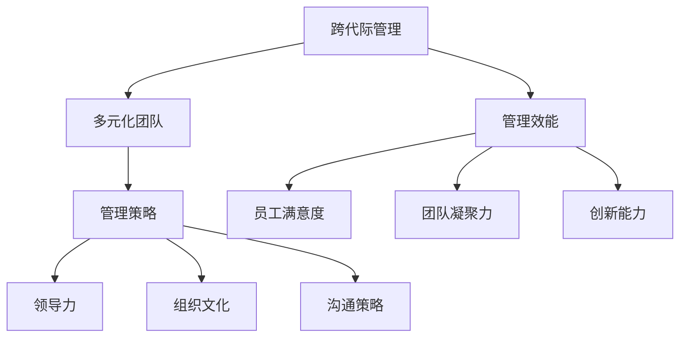

                 

### 文章标题

# 跨代际管理：应对多元化团队

### 关键词

- 跨代际管理
- 多元化团队
- 管理策略
- 领导力
- 沟通
- 案例分析

### 摘要

本文旨在探讨跨代际管理在应对多元化团队中的重要性。随着全球化进程的加快和信息技术的发展，组织内部年龄差异和背景多样性日益凸显，这对传统的管理方式提出了新的挑战。文章首先介绍了跨代际管理和多元化团队的核心概念，接着阐述了跨代际管理与多元化团队之间的关系。随后，本文详细分析了管理策略、领导力、组织文化和沟通在跨代际管理中的关键作用。通过实际案例分享，本文展示了成功应对多元化团队的具体方法，并对未来跨代际管理的挑战和趋势进行了展望。文章最后提出了若干最佳实践和注意事项，以期为企业管理者和人力资源从业者提供有益的参考。

### 引言

在全球化和信息化时代的背景下，组织的多元化已经成为不可避免的趋势。不仅文化背景、教育水平、技能差异显著，年龄差异也日益成为组织内部的一个重要维度。这种多元化不仅体现在团队成员的多样性上，也反映在他们的价值观、工作方式和生活习惯中。因此，如何有效管理这种跨代际的多元化团队，成为现代企业管理中的一项重要课题。

跨代际管理，指的是在组织内部针对不同年龄段员工的管理方法和策略。它关注如何协调和利用不同年龄段员工的独特优势，解决因年龄差异可能带来的冲突和挑战。多元化团队则是指由具有不同背景、文化、经验和技能的成员组成的团队。这种团队不仅能够带来丰富的创意和多样的视角，还可能提升组织的创新能力和市场竞争力。

然而，跨代际管理和多元化团队并不是简单的叠加，而是相互交织、相互影响的关系。年龄差异和文化背景的差异会影响团队成员之间的沟通方式、工作态度和团队氛围。因此，跨代际管理不仅要考虑到员工的年龄因素，还要兼顾团队成员的多样性。

在本文中，我们将首先定义跨代际管理和多元化团队的概念，探讨它们之间的关系。随后，将深入分析跨代际管理在多元化团队中的关键作用，包括管理策略、领导力、组织文化和沟通等方面。为了更好地理解这些理论，我们将通过实际案例进行说明。最后，本文将展望跨代际管理面临的未来挑战和趋势，并总结最佳实践和注意事项。

### 跨代际管理的定义与重要性

跨代际管理是指组织在运营和管理过程中，针对不同年龄段的员工采取的专门管理策略。这一概念强调了在多元化的工作环境中，如何有效地整合不同年龄层的优势，实现团队成员的协同合作与共同发展。随着社会老龄化和生育率的下降，组织内部年龄差异日益显著，跨代际管理的重要性也愈加凸显。

首先，从员工的角度来看，不同年龄段的员工有着各自独特的工作需求和发展目标。例如，年轻员工可能更加注重职业晋升和技能提升，而中年员工则可能更加关注工作稳定和家庭平衡。通过跨代际管理，组织可以针对这些需求，制定个性化的培养和发展计划，从而提高员工的满意度和忠诚度。

其次，从团队协作的角度来看，跨代际管理有助于构建多元化的团队。不同年龄段的员工拥有不同的经验和技能，通过合理的配置和协作，可以实现优势互补，提升团队的整体效能。例如，年轻员工的技术创新能力和快速学习力可以弥补中年员工的经验不足，而中年员工的稳重和经验则可以指导年轻员工避免犯错误。

再次，从组织文化的角度来看，跨代际管理有助于促进组织内部的包容性和多样性。在一个多元化的团队中，不同年龄段的员工能够带来多样化的观点和见解，这有助于激发创新思维和提升决策质量。同时，跨代际管理也有助于构建一个尊重和欣赏多样性的组织文化，增强员工的归属感和认同感。

具体来说，跨代际管理的重要性体现在以下几个方面：

1. **提升员工绩效**：通过针对不同年龄段员工的个性化管理策略，可以帮助他们发挥最大潜力，提高工作效率和绩效。

2. **增强团队凝聚力**：合理的跨代际管理能够促进团队成员之间的相互理解和尊重，提升团队的整体协作能力和凝聚力。

3. **促进组织创新**：跨代际管理能够汇集不同年龄段员工的知识和经验，促进创新思维和创造性工作，提高组织的竞争力。

4. **降低员工流失率**：通过关注员工的需求和提供个性化的发展机会，可以增强员工的满意度和忠诚度，降低员工流失率。

5. **提升组织文化**：跨代际管理有助于构建一个尊重和包容多样性的组织文化，增强员工的归属感和认同感，提升组织的整体形象。

总之，跨代际管理不仅是一个管理策略，更是组织应对多元化团队挑战的重要工具。通过合理运用跨代际管理，组织可以实现员工与组织共同发展的双赢局面。

### 多元化团队的概念与特点

多元化团队，指的是由来自不同背景、拥有不同经验和技能的个体组成的团队。这种团队的组成元素包括但不限于性别、年龄、教育水平、文化背景、工作经验和社会背景等。多元化团队的兴起，是全球化、信息技术发展和多元化社会发展的必然产物。

首先，性别多元化是多元化团队的一个显著特点。在传统观念中，某些岗位或领域被认为更适合特定性别，而性别多元化则打破了这种刻板印象，使团队能够吸纳更多元化的视角和思维。女性员工可能在沟通、协作和人际关系处理方面表现出色，而男性员工可能在逻辑思维和技术能力上更具优势。通过性别多元化，团队可以更好地平衡不同的能力和观点，提升整体决策质量和创新力。

其次，年龄多元化是多元化团队中不可忽视的一个方面。不同年龄段的员工拥有不同的生活经验和工作经历，这使他们能够从不同的角度看待问题。例如，年轻员工可能更具备创新思维和快速学习的能力，而年长员工则拥有丰富的经验和稳健的判断力。年龄多元化的团队可以更好地应对复杂多变的市场环境，通过不同年龄段的员工之间的协作，实现优势互补和共同进步。

教育水平多元化也是多元化团队的一个重要特点。团队成员拥有不同的教育背景和专业知识，这不仅丰富了团队的知识结构，也为解决复杂问题提供了多样化的思路和方法。例如，一个团队中可能既有博士级别的技术专家，也有拥有丰富实践经验的工程师，这种组合有助于在技术研发和项目实施过程中实现高效的协作和高质量的成果。

文化背景多元化是全球化时代多元化团队的重要组成部分。随着国际交流和合作的加深，越来越多的组织在全球范围内招募员工。不同文化背景的员工带来了不同的价值观念、工作习惯和行为方式，这为团队注入了新的活力和灵感。例如，西方文化强调个人主义和竞争，而东方文化则更注重集体主义和和谐。文化背景多元化有助于团队在处理国际业务和跨文化合作时更加灵活和包容。

最后，工作经验多元化也是多元化团队的一个显著特点。团队成员拥有不同的工作经验，这使他们在面对复杂问题时能够提供多样化的解决方案。例如，一个团队中可能既有在大型企业工作过的资深员工，也有在初创公司打拼过的年轻创业者。这种多元化的工作经验有助于团队在项目管理和决策过程中更加全面和细致。

总的来说，多元化团队具有以下特点：

1. **知识多样化**：团队成员拥有不同的知识和技能，能够为团队带来丰富的创意和见解。
2. **视角多元化**：不同背景的员工提供了不同的视角，有助于提升团队的整体决策质量和创新力。
3. **协作效率高**：多元化团队通过优势互补和协作，能够更高效地完成任务和解决问题。
4. **创新能力强**：多元化的团队成员能够从不同角度思考问题，促进创新思维和创造性工作。
5. **适应性强**：多元化团队在面对复杂多变的市场环境时，能够更加灵活和有效地应对挑战。

多元化团队的优势在于，它能够汇聚不同背景、经验和技能的成员，形成一种互补和协同效应，从而提升团队的整体绩效和竞争力。通过充分利用多元化团队的优势，组织可以在全球化和信息化时代中保持持续的创新能力和市场竞争力。

### 跨代际管理与多元化团队的关系

跨代际管理与多元化团队之间存在着紧密的联系，两者相互促进、相互作用，共同影响着团队的整体效能和组织的长远发展。首先，从组织架构的角度来看，跨代际管理为多元化团队提供了有效的组织基础。通过合理的跨代际管理，组织能够确保不同年龄段的员工在团队中找到合适的定位和角色，充分发挥各自的优势。

在多元化团队中，不同年龄段的员工通常具有不同的工作经验、知识背景和价值观。例如，年轻员工可能具备较高的技术能力和创新思维，而年长员工则拥有丰富的行业经验和决策能力。跨代际管理的实施，能够帮助组织充分挖掘这些不同年龄段员工的潜力，实现优势互补。通过明确不同年龄段员工在团队中的角色和职责，组织可以确保团队成员能够在协作中互相支持、互相学习，从而提高团队的整体效能。

其次，跨代际管理有助于增强多元化团队的凝聚力。在多元化团队中，不同年龄段的员工可能会面临文化差异和沟通障碍，而跨代际管理则提供了一种有效的桥梁。通过跨代际管理，组织可以促进不同年龄段员工之间的交流和理解，消除误解和冲突，增强团队的整体凝聚力。例如，通过组织定期的跨代际交流活动，如讲座、研讨会和工作坊，不同年龄段的员工可以分享自己的经验和见解，从而增进彼此的了解和信任。

此外，跨代际管理在多元化团队中还能够促进创新和创造力。不同年龄段的员工拥有不同的视角和思维方式，这种多样性为团队带来了丰富的创意和新的解决方案。通过跨代际管理，组织可以激发团队成员之间的思想碰撞和知识交流，促进创新思维的发展。例如，一个由年轻员工主导的创新项目，可以通过与年长员工的讨论和指导，不断完善和优化，最终实现创新目标。

具体来说，跨代际管理与多元化团队的关系可以表现在以下几个方面：

1. **组织效能提升**：通过跨代际管理，组织能够确保多元化团队的每个成员都在最适合自己的位置上发挥最大的作用，从而提高团队的整体效能。
2. **员工满意度提升**：跨代际管理关注员工的个性化需求和发展，有助于提高员工的满意度和忠诚度，减少员工流失。
3. **沟通障碍减少**：跨代际管理通过促进不同年龄段员工之间的沟通和交流，减少误解和冲突，增强团队的凝聚力。
4. **创新能力增强**：跨代际管理鼓励团队成员之间的思想碰撞和知识交流，促进创新思维的发展，提升团队的创新能力。
5. **组织文化多样化**：跨代际管理有助于构建一个尊重和包容多样性的组织文化，增强员工的归属感和认同感。

总之，跨代际管理与多元化团队之间是相辅相成的关系。跨代际管理为多元化团队提供了有效的组织架构和管理策略，而多元化团队则为跨代际管理提供了实践平台和动力源泉。通过合理运用跨代际管理，组织可以实现多元化团队的卓越表现，提升整体竞争力和可持续发展能力。

### 管理策略在跨代际管理中的应用

在跨代际管理中，制定和实施有效的管理策略是确保多元化团队高效运作的关键。以下是一些关键的管理策略，以及它们在跨代际管理中的应用方法：

#### 1. 明确角色与职责

明确每个团队成员的角色和职责是跨代际管理的第一步。这有助于确保每个人都知道自己的工作重点和期望目标，从而减少冲突和误解。具体应用方法包括：

- **制定详细的职位说明书**：为每个角色编写详细的职位说明书，明确岗位责任、工作目标和关键绩效指标（KPI）。
- **设立明确的沟通渠道**：建立定期的团队会议和汇报机制，确保信息透明，团队成员能够及时了解各自的任务进展和团队目标。
- **提供个性化的培训和发展机会**：根据不同年龄段员工的需求和职业发展规划，提供针对性的培训和发展机会，帮助他们提升技能和实现个人目标。

#### 2. 促进跨代际沟通

跨代际沟通是确保团队成员之间有效协作的重要手段。以下是一些促进跨代际沟通的方法：

- **建立多样化的沟通平台**：利用各种沟通工具，如电子邮件、即时通讯软件、视频会议等，确保团队成员能够随时随地沟通。
- **定期举办跨代际交流活动**：通过组织讲座、研讨会和工作坊等活动，鼓励不同年龄段的员工分享经验和见解，增进相互理解。
- **设立跨代际沟通小组**：成立专门的跨代际沟通小组，负责收集和反馈不同年龄段员工的意见和建议，促进沟通的顺畅和有效。

#### 3. 灵活的工作安排

灵活的工作安排有助于满足不同年龄段员工的需求，提高他们的工作满意度和效率。具体方法包括：

- **弹性工作时间**：允许员工根据个人需求调整工作时间，如远程办公、灵活的工作时段等。
- **项目制管理**：采用项目制管理方式，让员工根据自己的能力和兴趣参与不同的项目，实现个性化发展。
- **合理分配工作负荷**：根据员工的年龄和工作经验，合理分配工作任务，确保他们能够在适宜的负荷下工作。

#### 4. 鼓励团队合作

团队合作是提升团队效能的关键。以下是一些鼓励团队合作的方法：

- **设立共同目标**：确保团队成员都了解团队的目标和愿景，形成共同的目标和价值观。
- **实施团队建设活动**：定期组织团队建设活动，如团队拓展训练、团建旅游等，增强团队凝聚力和合作意识。
- **奖励团队合作**：通过设立团队奖励机制，激励团队成员在团队合作中发挥积极作用，提升整体绩效。

#### 5. 个性化激励

个性化激励能够有效提升员工的工作积极性和忠诚度。具体方法包括：

- **多样化的激励方式**：根据员工的个人需求和职业发展阶段，提供多样化的激励措施，如奖金、晋升机会、培训等。
- **关注员工发展**：定期与员工进行一对一的沟通，了解他们的职业规划和成长需求，提供个性化的支持和指导。
- **认可与表彰**：在团队内部建立认可和表彰制度，及时表扬和奖励表现优秀的员工，增强他们的成就感和自豪感。

#### 6. 持续反馈与改进

持续反馈与改进是提升管理效果的重要手段。具体方法包括：

- **建立反馈机制**：定期收集员工的意见和建议，通过匿名调查、面谈等方式，了解他们在跨代际管理中的体验和感受。
- **实施改进措施**：根据收集到的反馈，及时调整管理策略和方法，优化跨代际管理的实践。
- **鼓励持续改进**：通过组织培训和学习活动，提升管理者和员工的管理能力和协作能力，推动跨代际管理的持续改进。

总之，通过以上管理策略，组织可以在跨代际管理中实现多元化团队的高效运作。这些策略不仅有助于提升团队的整体效能，还能增强员工的满意度和忠诚度，为组织的长期发展奠定坚实基础。

### 领导力在跨代际管理中的作用

在跨代际管理中，领导力是确保团队有效运作和实现目标的关键因素。领导力不仅影响着团队成员的士气和协作效果，还直接关系到跨代际管理的成功与否。以下从多个方面探讨领导力在跨代际管理中的重要作用。

首先，**跨代际领导力要求领导者具备广泛的沟通能力**。由于不同年龄段的员工有着不同的价值观、沟通风格和工作习惯，领导者需要能够有效地与各个年龄段的员工进行沟通，从而促进理解和协作。例如，领导者可以通过定期举行跨代际会议，鼓励不同年龄段的员工分享经验和观点，建立良好的沟通渠道。此外，领导者还可以采用多元化的沟通方式，如面对面会议、电子邮件和即时通讯工具，以满足不同员工的沟通需求。

其次，**领导者在跨代际管理中应注重差异化管理**。不同年龄段的员工在职业发展、工作期望和生活方式上存在显著差异。领导者需要根据这些差异，采取个性化的管理方法，以激发员工的工作热情和潜能。例如，对于年轻员工，领导者可以关注他们的职业发展和创新思维，提供更多培训和成长机会；对于年长员工，领导者可以重视他们的经验和稳重，鼓励他们在团队中发挥传帮带的作用。

第三，**跨代际领导力强调团队建设**。一个高效的团队需要具备良好的团队精神和协作能力。领导者可以通过多种团队建设活动，如团队拓展训练、团建旅游和团队项目合作等，增强团队成员之间的信任和合作意识。这些活动不仅有助于提高团队的整体效能，还能增进不同年龄段员工之间的理解和友谊。

第四，**领导者需要具备战略眼光和前瞻性思维**。在跨代际管理中，领导者需要能够预见和应对未来可能出现的挑战和变化，制定相应的战略和计划。例如，随着科技的发展和市场的变化，领导者需要不断更新知识，提升团队的技术水平和竞争力。此外，领导者还需要关注行业的最新动态和趋势，确保团队在激烈的市场竞争中保持领先地位。

第五，**领导者应具备激励和激励能力**。在跨代际管理中，领导者需要能够激励不同年龄段的员工，提升他们的工作积极性和创造力。例如，领导者可以通过设立明确的目标和奖励机制，激励员工追求卓越；通过认可和表彰优秀员工，增强他们的成就感和自豪感；通过提供职业发展机会，激发员工的职业热情。

第六，**领导者需要具备变革管理能力**。随着组织环境和员工需求的不断变化，领导者需要能够有效地应对变革，推动组织的持续改进和发展。例如，在跨代际管理中，领导者需要能够平衡不同年龄段员工的利益和需求，制定有效的变革策略，确保变革的顺利实施。

总之，跨代际领导力在跨代际管理中具有至关重要的作用。领导者需要具备广泛的沟通能力、差异化管理方法、团队建设能力、战略眼光、激励能力和变革管理能力，以应对多元化团队中的各种挑战。通过不断提升领导力，领导者可以有效地推动跨代际管理，提升团队的整体效能和组织的竞争力。

### 组织文化在跨代际管理中的作用

组织文化在跨代际管理中扮演着至关重要的角色，它不仅影响员工的态度和行为，还直接关系到跨代际管理的成功。一个健康、包容和积极向上的组织文化能够促进不同年龄段员工之间的沟通与合作，增强团队的凝聚力，从而提升整体绩效。

首先，组织文化提供了共同的价值观和目标，为跨代际管理奠定了基础。在一个具有明确价值观和目标的组织内，不同年龄段的员工能够共同认同并努力实现这些目标，从而减少因价值观差异可能引发的冲突。例如，一个以创新和成长为核心价值观的组织，可以鼓励年轻员工发挥其创新精神，同时也能让年长员工感受到自己在组织中的价值。

其次，组织文化影响着员工的沟通方式和工作习惯。在一个开放、透明和包容的组织文化中，员工之间的沟通更加畅通，误解和冲突得以减少。例如，通过定期的团队会议、内部沟通平台和开放的讨论环境，不同年龄段的员工可以分享自己的想法和建议，促进信息的流动和交流。这种良好的沟通氛围有助于消除跨代际管理中的沟通障碍，提高团队的整体协作效率。

再次，组织文化对员工的激励和归属感具有重要影响。在一个重视个人发展和成就的组织文化中，员工更有动力去实现自己的职业目标，提高工作效率和绩效。例如，通过设立明确的职业发展路径、提供丰富的培训机会和公平的晋升机制，组织可以激发员工的积极性和创造力。这种激励机制不仅适用于年轻员工，也适用于年长员工，使他们都能感受到自己在组织中的价值和成就。

此外，组织文化对员工的稳定性和忠诚度有重要影响。在一个具有良好文化和工作氛围的组织中，员工更愿意长期留在组织工作，从而降低员工流失率。例如，通过建立公平、公正和透明的绩效考核体系，组织可以确保员工的工作成果得到认可和奖励，增强他们的归属感和忠诚度。这种稳定的员工队伍有助于组织在跨代际管理中保持连续性和稳定性。

最后，组织文化对跨代际管理中的变革和创新具有重要意义。在一个支持变革和鼓励创新的组织文化中，员工敢于尝试新的方法和思路，推动组织的持续发展和进步。例如，通过设立创新基金、鼓励员工提出创意和建议，组织可以激发员工的创新潜能，促进组织的创新能力和竞争力。

总之，组织文化在跨代际管理中发挥着关键作用。通过建立健康、包容和积极向上的组织文化，组织不仅能够促进不同年龄段员工之间的沟通与合作，提高团队的凝聚力，还能激发员工的积极性和创造力，降低员工流失率，推动组织的持续变革和创新。因此，组织管理者应高度重视组织文化建设，将其作为跨代际管理的重要组成部分，以实现组织的长期发展和成功。

### 沟通策略在跨代际管理中的重要性

在跨代际管理中，沟通策略的重要性不容忽视。有效的沟通不仅是团队协作的基石，也是解决跨代际冲突、提升团队凝聚力和整体绩效的关键。以下是一些关键的沟通策略，以及它们在跨代际管理中的应用：

#### 1. **明确沟通目标**

在跨代际管理中，明确沟通目标是确保沟通效果的首要步骤。领导者需要为每次沟通设定明确的目标，确保信息传递的准确性和有效性。具体应用方法包括：

- **制定沟通计划**：在会议或项目启动时，明确沟通的具体目标、时间节点和预期成果。
- **设定优先级**：根据任务的重要性和紧急程度，确定沟通的优先级，确保关键信息得到及时传达。

#### 2. **多样化的沟通方式**

不同年龄段的员工可能有不同的沟通偏好，采用多样化的沟通方式有助于提高沟通的覆盖面和效果。以下是一些有效的沟通方式：

- **面对面交流**：面对面的交流能够建立信任，增强互动和反馈。对于重要决策或敏感话题，面对面交流是最佳选择。
- **电子邮件**：电子邮件适合正式和书面的沟通，适用于传达详细的信息和文件。
- **即时通讯工具**：即时通讯工具如微信、Slack等，适用于快速沟通和协作。

#### 3. **定期沟通机制**

建立定期的沟通机制有助于保持信息的流通和团队成员之间的联系。以下是一些有效的定期沟通机制：

- **每周/月度会议**：定期举行团队会议，讨论进展、分享经验、解决难题。
- **团队邮件**：通过定期发送团队邮件，更新项目动态、分享成功经验和改进建议。

#### 4. **跨代际沟通小组**

为了促进不同年龄段员工之间的理解和协作，可以设立跨代际沟通小组。该小组的职责包括：

- **收集反馈**：定期收集不同年龄段员工的意见和建议，反映团队内部的潜在问题和挑战。
- **促进交流**：组织跨代际交流活动，如讲座、研讨会和工作坊，鼓励员工分享经验和见解。

#### 5. **透明沟通**

透明沟通是建立信任和增强团队凝聚力的重要手段。领导者应确保团队内部的信息透明，包括项目进展、决策过程和绩效评估等。具体应用方法包括：

- **公开会议纪要**：将会议纪要公开分享，确保团队成员能够了解会议内容和决策结果。
- **透明绩效评估**：通过透明的绩效评估机制，确保员工的努力和成就得到公正的认可。

#### 6. **倾听与反馈**

倾听是有效沟通的重要组成部分。领导者应鼓励团队成员表达自己的想法和意见，并提供及时的反馈。以下是一些有效的倾听和反馈方法：

- **开放性问题**：通过开放性问题，鼓励员工分享他们的观点和感受，增加沟通的深度。
- **定期反馈**：通过定期的绩效反馈和团队建设活动，了解员工的满意度和发展需求，提供有针对性的支持。

#### 7. **文化敏感性培训**

为了提高跨代际沟通的有效性，组织可以提供文化敏感性培训，帮助员工理解和尊重不同年龄段员工的文化差异。具体内容可以包括：

- **文化差异的理解**：介绍不同年龄段员工的文化特点和沟通偏好。
- **沟通技巧的提升**：通过案例分析和工作坊，提升员工在跨代际沟通中的技巧和能力。

总之，通过实施这些沟通策略，组织可以有效地促进跨代际管理中的沟通，减少误解和冲突，提升团队的整体效能和凝聚力。有效的沟通不仅有助于实现团队目标，还能增强员工的归属感和忠诚度，为组织的长期发展奠定坚实基础。

### 实际案例分析

为了更好地理解跨代际管理在多元化团队中的具体应用，我们通过几个实际案例进行深入分析。这些案例涵盖了不同行业和公司，展示了跨代际管理在不同情境下的成功实践和挑战。

#### 案例一：互联网公司A公司的跨代际管理实践

A公司是一家领先的互联网公司，其团队成员涵盖了多个年龄段，从刚刚毕业的年轻员工到具有多年经验的资深员工。为了有效管理多元化团队，A公司采取了一系列跨代际管理策略。

**管理策略：**
1. **设立跨代际领导团队**：公司特别设立了跨代际领导团队，由不同年龄段的员工组成，负责协调和沟通不同年龄段员工的需求和意见。
2. **灵活的工作安排**：公司提供了灵活的工作安排，包括远程办公、弹性工作时间和项目制管理，以适应不同年龄段员工的需求。
3. **多样化的沟通渠道**：公司建立了多种沟通渠道，如定期的团队会议、内部论坛和即时通讯工具，确保信息的透明和流通。
4. **个性化培训和发展**：公司为不同年龄段的员工提供了个性化的培训和发展计划，帮助他们提升技能和实现个人职业目标。

**成效：**
- 通过跨代际管理，A公司的团队凝聚力显著提升，员工满意度和忠诚度也有所提高。
- 公司在多个项目上取得了显著成绩，创新能力和市场竞争力得到了加强。

**挑战：**
- 跨代际沟通初期存在一定困难，不同年龄段员工之间需要时间适应彼此的沟通风格。
- 公司需要不断调整管理策略，以应对快速变化的市场环境和员工需求。

#### 案例二：制造业公司B公司的多元化团队管理

B公司是一家大型制造业企业，其员工队伍中不仅有不同年龄段的员工，还包括来自不同文化背景的员工。为了有效管理多元化团队，B公司采取了一系列措施。

**管理策略：**
1. **文化敏感性培训**：公司定期为员工提供文化敏感性培训，帮助员工理解和尊重不同文化背景的同事。
2. **建立多元化团队**：公司通过建立多元化团队，促进不同文化背景和年龄段员工之间的协作和交流。
3. **透明沟通机制**：公司建立了透明沟通机制，包括定期的团队会议和开放的反馈渠道，确保员工能够充分表达自己的想法和意见。
4. **个性化激励措施**：公司根据不同员工的职业发展和需求，提供了多样化的激励措施，如奖金、晋升机会和培训。

**成效：**
- 通过多元化团队管理，B公司的员工流动率显著下降，员工对公司的认同感和归属感增强。
- 公司在全球市场中的竞争力得到了提升，多元文化的优势在跨国项目中得到了充分体现。

**挑战：**
- 在初期阶段，文化差异和沟通障碍仍然存在，需要公司持续投入资源进行文化敏感性培训。
- 公司需要不断优化管理策略，以适应快速变化的市场环境和员工需求。

#### 案例三：金融服务公司C公司的跨代际管理实践

C公司是一家金融服务公司，其员工队伍中年轻员工比例较高，但同时也需要年长员工的丰富经验和专业知识。为了实现有效的跨代际管理，C公司采取了以下策略。

**管理策略：**
1. **差异化管理**：公司针对不同年龄段的员工采取了差异化的管理方法，如为年轻员工提供更多的培训和发展机会，为年长员工提供更多的咨询和支持。
2. **跨代际导师计划**：公司实施了跨代际导师计划，让年轻员工与年长员工结成对子，通过一对一的指导和支持，帮助年轻员工快速成长。
3. **项目制管理**：公司采用项目制管理，让不同年龄段的员工在项目中发挥各自的优势，实现优势互补。
4. **激励与认可**：公司通过设立多样化的激励和认可机制，如年度优秀员工奖和团队奖，鼓励员工积极参与和贡献。

**成效：**
- 通过跨代际管理，C公司的团队协作效率显著提升，员工的工作满意度和忠诚度也有所提高。
- 公司在多个项目中取得了成功，创新能力和市场竞争力得到了加强。

**挑战：**
- 在跨代际管理初期，年轻员工和年长员工之间需要时间建立信任和理解。
- 公司需要持续优化管理策略，以应对快速变化的市场环境和员工需求。

通过以上案例可以看出，跨代际管理在多元化团队中的应用取得了显著成效，但也面临一定的挑战。通过采取有效的管理策略和持续改进，组织可以充分发挥跨代际管理的优势，提升团队的整体效能和竞争力。

### 跨代际管理的未来挑战与趋势

随着全球化、科技进步和人口结构的变化，跨代际管理在未来将继续面临诸多挑战和机遇。以下是一些主要挑战和趋势：

#### 挑战

1. **技术变革的加速**：随着人工智能、大数据和云计算等技术的发展，员工需要不断更新技能以适应新的工作环境。这要求组织在跨代际管理中更加注重员工的技能培训和职业发展。
   
2. **人口老龄化**：许多国家正面临人口老龄化的趋势，导致员工年龄结构的变化。组织需要制定更加灵活的退休政策和再就业计划，以应对老龄化带来的挑战。

3. **文化多样性**：全球化带来了更加多元的文化背景，这对跨代际管理提出了更高的要求。组织需要培养跨文化的领导力和沟通能力，以促进不同文化背景员工之间的协作。

4. **工作与生活平衡**：随着员工对工作与生活平衡的重视，组织需要提供更多的灵活工作安排和福利政策，以吸引和留住优秀人才。

#### 趋势

1. **个性化管理**：未来跨代际管理将更加注重个性化，根据不同年龄段和个体需求制定个性化的职业发展计划和管理策略。

2. **数字化的跨代际沟通**：随着数字化工具的普及，跨代际沟通将更加依赖数字平台，如社交媒体、即时通讯和虚拟会议等。这将为跨代际管理提供新的沟通方式和管理工具。

3. **终身学习**：为了应对快速变化的工作环境，组织和个人将更加注重终身学习，通过在线课程、工作坊和内部培训等方式不断提升自身能力。

4. **跨文化领导力**：随着全球化进程的加快，组织将需要更多的跨文化领导力，以应对多元文化背景的挑战和机遇。

总之，跨代际管理在未来将继续面临诸多挑战，但也蕴含着巨大的机遇。通过不断创新和适应，组织可以充分发挥跨代际管理的优势，提升团队效能和竞争力。

### 总结与展望

跨代际管理在应对多元化团队中的重要性不容忽视。通过明确角色与职责、促进跨代际沟通、灵活的工作安排、鼓励团队合作和个性化激励等管理策略，组织可以有效应对因年龄差异和多元化背景带来的挑战，提升团队的整体效能和竞争力。同时，领导力、组织文化和沟通策略在跨代际管理中发挥着关键作用，它们共同构建了一个支持多元化和包容性的工作环境。

面对未来的挑战，组织需要持续关注技术变革、人口老龄化和文化多样性等趋势，并采取相应的措施，如个性化管理、数字化沟通和终身学习，以适应快速变化的市场环境。通过不断优化跨代际管理实践，组织不仅可以提升员工的满意度和忠诚度，还能在激烈的市场竞争中保持领先地位。

最后，我们鼓励读者深入思考跨代际管理的实践方法，结合自身组织的实际情况，探索适合的管理策略。通过不断的实践和调整，组织可以建立起一个高效、创新和充满活力的跨代际管理团队，为实现组织的长期目标贡献力量。

### 最佳实践 Tips

1. **开展定期的跨代际培训**：通过定期的跨代际培训，帮助不同年龄段的员工提升沟通能力和管理技能，增强团队凝聚力。

2. **建立多元文化支持系统**：组织应建立多元文化支持系统，如跨文化研讨会和工作坊，促进不同文化背景员工之间的理解和协作。

3. **鼓励员工参与团队建设活动**：定期组织团队建设活动，如团队拓展训练和团建旅游，增强团队成员之间的信任和合作意识。

4. **设立明确的职业发展路径**：为员工提供清晰的职业发展路径和培训计划，帮助他们实现个人职业目标，提高工作满意度。

5. **建立开放的沟通渠道**：确保团队成员能够通过多种渠道表达意见和建议，如内部论坛、定期的团队会议等，促进信息的透明和流通。

### 注意事项

1. **避免刻板印象**：在跨代际管理中，避免对某一年龄段的员工持有刻板印象，尊重每个员工的个性和差异。

2. **关注员工心理健康**：定期关注员工的身心健康，提供心理健康支持和咨询服务，帮助他们应对工作压力。

3. **灵活应对变化**：在跨代际管理中，灵活应对员工需求和市场变化，及时调整管理策略和方法。

4. **确保公平和公正**：在跨代际管理中，确保公平和公正，避免因年龄、性别或文化背景等因素造成的不公平待遇。

### 拓展阅读

1. **《多元化团队管理》**：这本书详细介绍了多元化团队的管理策略和实践，对跨代际管理提供了有益的参考。

2. **《跨代际沟通的艺术》**：这本书探讨了跨代际沟通的技巧和方法，有助于提升团队成员之间的沟通效果。

3. **《组织文化与领导力》**：这本书分析了组织文化对跨代际管理的影响，提供了构建健康组织文化的实践建议。

4. **《终身学习与职业发展》**：这本书介绍了终身学习的理念和方法，对员工的职业发展和技能提升有重要指导意义。

### 附录

以下是本文中提到的几个关键概念及其之间的关系架构 Mermaid 流程图：

### 作者信息

作者：AI天才研究院/AI Genius Institute & 禅与计算机程序设计艺术 /Zen And The Art of Computer Programming

