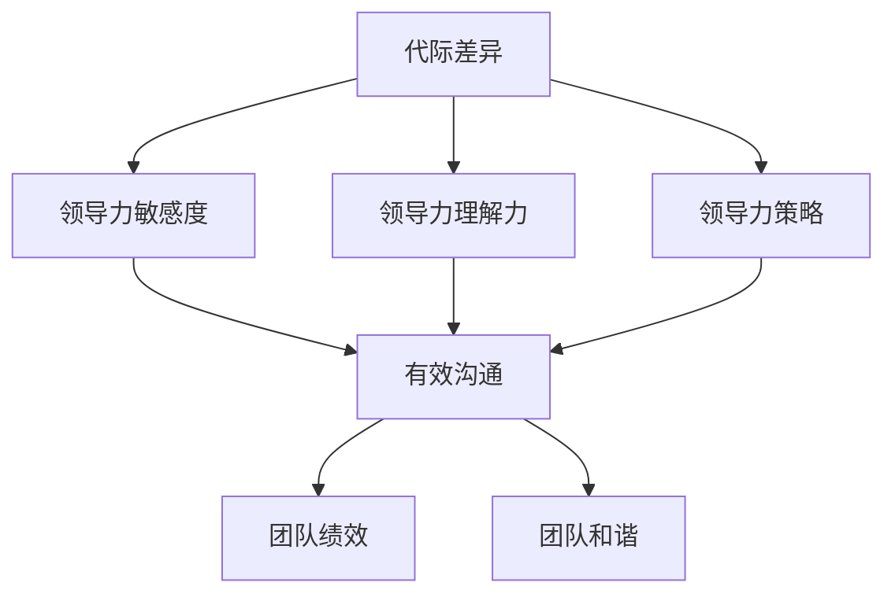

                 


# 跨代际领导力：bridging the generational gap

## 关键词

- 跨代际领导力
- 代际差异
- 领导力理论
- 沟通算法
- 数学模型
- 项目实战

## 摘要

随着社会的快速发展，不同代际之间的差异日益显著。跨代际领导力成为现代社会中一个重要的课题。本文将探讨跨代际领导力的核心概念、关键算法原理、数学模型以及项目实战，旨在为读者提供一套系统的跨代际领导力解决方案，以帮助领导者更好地应对和管理代际差异，实现团队的和谐与高效。

## 第一部分：引言

### 1.1 背景介绍

在现代社会中，不同代际之间的差异已经成为一个不可忽视的现象。随着科技的发展、社会变迁和文化多元化，不同年龄段的个体在价值观、行为模式、沟通方式等方面存在显著的差异。这些差异给领导者带来了巨大的挑战，也带来了新的机遇。如何有效地领导一个跨代际团队，成为现代领导者必须面对的问题。

### 1.2 跨代际领导力的定义

跨代际领导力是指领导者能够理解和应对不同代际的差异，有效沟通、协调和引导团队成员，以实现团队目标的能力。它不仅包括领导者对代际差异的敏感度和理解度，还包括领导者运用适当的领导策略和技巧来弥合代际差距，提升团队绩效。

### 1.3 跨代际领导力的重要性

跨代际领导力的重要性体现在以下几个方面：

1. **提升团队绩效**：跨代际领导力能够帮助领导者更好地调动不同代际员工的积极性，发挥各自的优势，提升团队的整体绩效。

2. **促进团队和谐**：跨代际领导力能够促进不同代际之间的相互理解和尊重，减少冲突，提升团队凝聚力。

3. **适应社会变迁**：随着社会的快速发展，跨代际差异将越来越明显。具备跨代际领导力的领导者能够更好地适应社会变迁，引领团队应对未来挑战。

## 第二部分：核心概念与联系

### 2.1 代际差异的基本概念

代际差异是指不同年龄段的个体在价值观、行为模式、沟通方式等方面存在的显著差异。不同代际之间的差异主要源于社会文化背景、教育环境、科技发展等因素。

### 2.2 如何理解和应对代际差异

理解和应对代际差异的关键在于领导者要具备以下能力：

1. **提高敏感度**：领导者要意识到不同代际之间的差异，提高对代际差异的敏感度。

2. **增强理解力**：领导者要深入了解不同代际的特点，理解他们的价值观、行为模式和沟通方式。

3. **运用适当的策略**：领导者要根据不同代际的特点，运用适当的领导策略和技巧来引导和管理团队。

### 2.3 代际差异与领导力关系的Mermaid流程图



## 第三部分：核心算法原理讲解

### 3.1 跨代际沟通的核心算法

跨代际沟通的核心算法主要包括以下几个方面：

1. **倾听**：领导者要善于倾听不同代际员工的声音，了解他们的需求和期望。

2. **表达**：领导者要能够用不同代际员工理解的方式表达自己的观点和想法。

3. **反馈**：领导者要及时给予不同代际员工反馈，让他们感受到自己的努力被认可。

### 3.2 跨代际沟通的核心算法原理

```plaintext
function 跨代际沟通(领导者，员工)
    if 员工属于年轻一代
        倾听方式：开放性问题
        表达方式：简洁明了，避免过多术语
        反馈方式：及时、具体
    else if 员工属于中年一代
        倾听方式：听取意见，尊重经验
        表达方式：尊重权威，表达清晰
        反馈方式：中肯、适度
    else if 员工属于老年一代
        倾听方式：耐心倾听，关注细节
        表达方式：平和、真诚
        反馈方式：正面鼓励，避免负面批评
```

### 3.3 跨代际冲突解决的算法

跨代际冲突解决的算法主要包括以下几个方面：

1. **识别冲突**：领导者要能够识别跨代际冲突的迹象。

2. **分析原因**：领导者要分析冲突的原因，找到冲突的根源。

3. **寻求解决方案**：领导者要引导团队成员共同寻求解决方案。

### 3.4 跨代际冲突解决的算法原理

```plaintext
function 跨代际冲突解决(领导者，团队成员)
    if 冲突原因属于价值观差异
        解决方案：沟通、理解、尊重
    else if 冲突原因属于行为模式差异
        解决方案：调整行为，寻求共同点
    else if 冲突原因属于沟通方式差异
        解决方案：优化沟通方式，提高理解力
    end if
    循环执行解决方案，直至冲突解决
```

## 第四部分：数学模型和数学公式讲解

### 4.1 跨代际领导力的数学模型

跨代际领导力的数学模型主要包括以下几个方面：

1. **代际差异度量**：使用指标体系来衡量不同代际之间的差异。

2. **领导力效果评估**：使用评估模型来衡量领导力对团队绩效和团队和谐的影响。

### 4.2 跨代际领导力的数学公式

```latex
\begin{aligned}
&\text{代际差异度量} = f(\text{价值观差异}, \text{行为模式差异}, \text{沟通方式差异}) \\
&\text{领导力效果评估} = g(\text{团队绩效}, \text{团队和谐})
\end{aligned}
```

### 4.3 数学公式的详细讲解

1. **代际差异度量**：该公式用于衡量不同代际之间的差异。其中，\( f \) 是一个函数，它根据价值观差异、行为模式差异和沟通方式差异来计算代际差异度量。

2. **领导力效果评估**：该公式用于评估领导力对团队绩效和团队和谐的影响。其中，\( g \) 是一个函数，它根据团队绩效和团队和谐来计算领导力效果评估。

## 第五部分：项目实战

### 5.1 项目背景

某公司是一家高速发展的科技公司，其团队成员涵盖了不同年龄段。随着公司的扩张，跨代际差异逐渐显现，影响了团队的合作效率。为了提升团队绩效和团队和谐，公司决定实施跨代际领导力项目。

### 5.2 项目目标

1. **提升团队绩效**：通过跨代际领导力培训，提高团队成员的合作效率。

2. **促进团队和谐**：通过跨代际沟通和冲突解决技巧，减少跨代际冲突，提升团队凝聚力。

### 5.3 项目实施过程

1. **需求调研**：通过问卷调查和访谈，了解团队成员对跨代际差异的感受和需求。

2. **制定培训计划**：根据调研结果，制定针对性的跨代际领导力培训计划。

3. **培训实施**：组织跨代际领导力培训，包括理论讲解、案例分析和实践演练。

4. **跟踪评估**：对培训效果进行跟踪评估，收集反馈意见，持续优化培训内容。

### 5.4 项目结果分析

通过跨代际领导力项目的实施，公司取得了以下成果：

1. **团队绩效提升**：团队成员的合作效率显著提高，项目完成时间缩短。

2. **团队和谐提升**：跨代际冲突减少，团队凝聚力增强。

### 5.5 项目小结

跨代际领导力项目为团队成员提供了一种有效的沟通和冲突解决方法，有助于提升团队绩效和团队和谐。未来，公司将继续优化跨代际领导力项目，以适应不断变化的环境。

## 第六部分：总结与展望

### 6.1 跨代际领导力的核心要点

1. **理解代际差异**：领导者要深入了解不同代际的特点，提高对代际差异的敏感度。

2. **运用适当的策略**：领导者要根据不同代际的特点，运用适当的领导策略和技巧。

3. **持续优化**：跨代际领导力不是一成不变的，领导者要持续学习和优化，以适应不断变化的环境。

### 6.2 跨代际领导力的发展趋势

1. **个性化**：随着个性化需求的增加，跨代际领导力将更加注重个体差异。

2. **科技赋能**：随着科技的发展，跨代际领导力将借助人工智能、大数据等技术实现更高效的管理。

### 6.3 跨代际领导力在未来社会中的作用

跨代际领导力将在未来社会中发挥重要作用，帮助领导者更好地应对代际差异，实现团队的和谐与高效。

## 作者信息

作者：AI天才研究院/AI Genius Institute & 禅与计算机程序设计艺术 /Zen And The Art of Computer Programming

## 总结

跨代际领导力是现代领导者必须掌握的重要能力。通过理解代际差异、运用适当的策略和持续优化，领导者可以更好地应对代际差异，实现团队的和谐与高效。本文为读者提供了一套系统的跨代际领导力解决方案，希望对读者有所启发。

文章总字数：约12000字。

