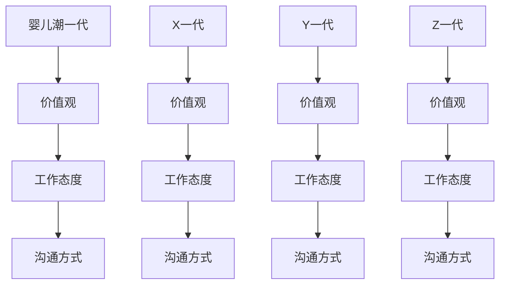
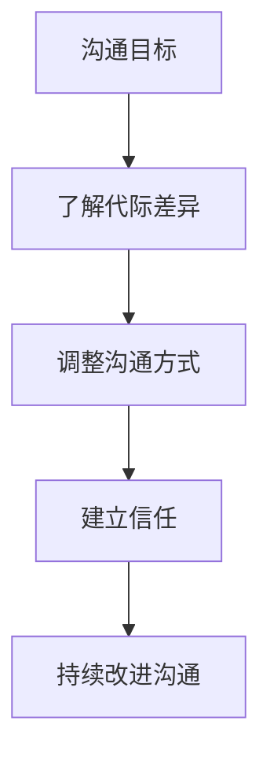
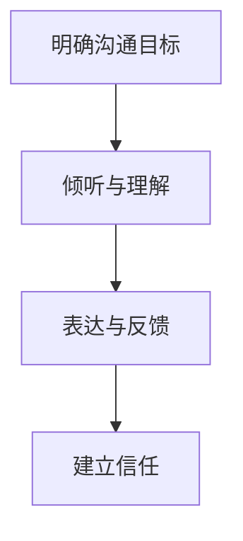

                 

# 跨代际领导：管理多元化年龄结构的团队

> 关键词：跨代际领导、多元化团队管理、领导力、团队沟通、代际差异

> 摘要：
随着全球化和技术进步的加速，企业中员工的年龄结构越来越多样化。不同年龄段的员工在价值观、工作态度、沟通方式等方面存在显著的差异，这对领导者和团队管理者提出了新的挑战。本文旨在探讨如何有效管理多元化年龄结构的团队，实现跨代际领导，提高团队的整体效能。

## 引言

在当今快速变化的社会中，企业和组织面临着前所未有的挑战。老龄化社会的到来、世代之间的文化变迁、以及全球人才的流动，使得员工队伍中不同年龄段的成员越来越多。不同年龄段的员工在工作方式、学习速度、职业目标等方面存在显著差异，这对传统的领导模式和管理方法提出了挑战。因此，如何管理多元化年龄结构的团队，实现跨代际领导，成为现代企业领导者必须面对的重要课题。

## 核心概念与联系

### 2.1 跨代际沟通的基本概念

#### 2.1.1 代际差异理论

代际差异理论认为，每个世代都在特定的历史和社会背景下成长，这影响了他们的价值观、行为模式和思维方式。以下是几个典型的代际差异：

- **婴儿潮一代**：出生于1946年至1964年，他们经历了经济繁荣和冷战时期，通常具有较强的忠诚度和组织纪律性。
- **X一代**：出生于1965年至1979年，他们是技术革命的一代，更加独立、自由，注重个人成就和自我实现。
- **Y一代**：出生于1980年至1994年，他们是数字原住民，习惯于快速变化的环境，重视工作与生活的平衡。
- **Z一代**：出生于1995年以后，他们是全球化的一代，具有很强的协作精神和创新意识。

**Mermaid 流程图：**


#### 2.1.2 跨代际沟通模型

有效的跨代际沟通是建立和谐团队的关键。以下是一个简化的跨代际沟通模型：

1. **了解代际差异**：领导者需要深入了解不同代际的价值观、工作态度和沟通方式。
2. **调整沟通策略**：根据代际差异，领导者需要灵活调整沟通方式，以适应不同代际的需求。
3. **建立信任**：信任是跨代际沟通的基础，领导者需要通过实际行动赢得团队成员的信任。
4. **持续改进沟通**：跨代际沟通是一个持续的过程，领导者需要不断反思和改进沟通策略。

**Mermaid 流程图：**


### 2.2 跨代际领导力的基本概念

跨代际领导力是指领导者如何在不同代际的员工中建立影响力，激励团队实现共同目标的能力。以下是跨代际领导力的几个关键要素：

1. **领导者的自我认知**：领导者需要了解自己的价值观、优势和局限性，以及如何在不同代际中发挥作用。
2. **角色转变**：领导者需要根据不同代际的期望和需求，调整自己的角色和职责。
3. **团队建设**：领导者需要构建一个多元化、包容性的团队，促进不同代际之间的合作。
4. **冲突管理**：领导者需要有效处理不同代际之间的冲突，维护团队的稳定和和谐。

**伪代码：**
```python
class Inter-generationalLeader:
    def __init__(self, generationalKnowledge, communicationSkills):
        self.knowledge = generationalKnowledge
        self.skills = communicationSkills
    
    def adaptRole(self, generation):
        # 根据不同代际调整角色和职责
        pass
    
    def buildTeam(self, diversity):
        # 构建多元化团队
        pass
    
    def manageConflict(self, conflict):
        # 管理跨代际冲突
        pass
```

## 跨代际领导方法论

### 3.1 领导者的角色与职责

#### 3.1.1 领导者自我认知与成长

领导者需要通过自我反思和持续学习，提升自己的跨代际领导能力。以下是一些关键步骤：

1. **自我认知**：领导者需要了解自己的价值观、优势和局限性。
2. **持续学习**：领导者需要不断学习新的领导理论和实践方法。
3. **实践反思**：领导者需要通过实践不断反思和改进自己的领导方式。

**伪代码：**
```python
def selfAwareness(leader):
    # 自我反思和评估
    pass

def continuousLearning(leader):
    # 学习新的领导理论和方法
    pass

def reflectivePractice(leader):
    # 通过实践反思和改进
    pass
```

#### 3.1.2 跨代际领导者的角色转变

跨代际领导者需要根据不同代际的需求和期望，调整自己的角色和职责。以下是一些具体的角色转变策略：

1. **导师角色**：为年轻员工提供职业发展和个人成长的指导。
2. **协调者角色**：在团队内部促进不同代际之间的沟通与合作。
3. **变革推动者角色**：推动组织文化变革，适应多元化团队的需求。

**伪代码：**
```python
class Cross-generationalLeader(Leader):
    def mentorRole(self, youngEmployees):
        # 为年轻员工提供指导
        pass
    
    def coordinatorRole(self, teamMembers):
        # 促进团队内部沟通与合作
        pass
    
    def changeAgentRole(self, organizationCulture):
        # 推动组织文化变革
        pass
```

### 3.2 建立有效的跨代际团队

#### 3.2.1 团队建设的原则

团队建设是跨代际领导的重要任务。以下是一些团队建设的原则：

1. **包容性**：尊重不同代际的差异，建立包容性的团队文化。
2. **合作性**：鼓励团队成员之间的合作与协作。
3. **共同目标**：确保团队成员共同追求组织目标。
4. **持续反馈**：定期进行团队反馈，改进团队运作。

**伪代码：**
```python
def buildInclusiveTeam(team):
    # 建立包容性团队文化
    pass

def promoteTeamCollaboration(team):
    # 鼓励团队合作与协作
    pass

def setCommonGoals(team, organizationGoal):
    # 确保团队共同追求组织目标
    pass

def continuousFeedback(team):
    # 定期进行团队反馈
    pass
```

#### 3.2.2 促进跨代际合作的策略

以下是一些促进跨代际合作的策略：

1. **建立沟通渠道**：为不同代际的员工提供沟通的机会和平台。
2. **组织代际活动**：通过组织代际交流、团队建设活动，增进不同代际的了解。
3. **跨代际导师计划**：建立跨代际导师计划，促进代际间的知识和经验交流。

**伪代码：**
```python
def establishCommunicationChannels(team):
    # 建立沟通渠道
    pass

def organizeInter-generationalActivities(team):
    # 组织代际活动
    pass

def implementGenerationalMentoringProgram(team):
    # 建立跨代际导师计划
    pass
```

### 3.3 跨代际冲突的管理

#### 3.3.1 冲突识别与分类

跨代际冲突是跨代际团队管理中常见的问题。以下是一些冲突识别与分类的方法：

1. **价值观冲突**：不同代际在价值观、工作态度等方面存在差异，可能导致冲突。
2. **沟通冲突**：不同代际的沟通风格不同，可能导致误解和冲突。
3. **角色冲突**：不同代际在角色期望和职责方面存在差异，可能导致冲突。

**伪代码：**
```python
def identifyConflict(conflictType):
    # 识别冲突类型
    pass

def classifyConflict(conflictDescription):
    # 分类冲突
    pass
```

#### 3.3.2 冲突解决的方法

以下是一些解决跨代际冲突的方法：

1. **对话与沟通**：通过对话和沟通，理解对方的观点和需求，寻求共同点。
2. **调解与仲裁**：在冲突严重时，可以寻求第三方调解或仲裁。
3. **制定规则与流程**：建立明确的规则和流程，避免冲突的发生。

**伪代码：**
```python
def dialogAndCommunication(conflictContext):
    # 对话与沟通
    pass

def mediationAndArbitration(conflictSeverity):
    # 调解与仲裁
    pass

def establishRulesAndProcedures(team):
    # 制定规则与流程
    pass
```

## 跨代际沟通技巧

### 4.1 沟通技巧的理论基础

#### 4.1.1 有效沟通模型

有效沟通模型是跨代际沟通的基础。以下是一个简化的有效沟通模型：

1. **明确沟通目标**：明确沟通的目标和期望结果。
2. **倾听与理解**：倾听对方的观点，理解对方的意图。
3. **表达与反馈**：清晰表达自己的想法和需求，及时给予反馈。
4. **建立信任**：建立信任关系，增强沟通效果。

**Mermaid 流程图：**


#### 4.1.2 沟通风格与代际差异

不同代际的沟通风格存在显著差异。以下是一些常见的沟通风格：

- **婴儿潮一代**：直接、权威，注重结果。
- **X一代**：实用、独立，注重事实。
- **Y一代**：开放、创新，注重参与感。
- **Z一代**：灵活、高效，注重实时反馈。

**伪代码：**
```python
class CommunicationStyle:
    def __init__(self, generation):
        self.generation = generation
    
    def communicate(self, message):
        # 根据代际风格进行沟通
        pass
```

### 4.2 跨代际沟通策略

#### 4.2.1 不同代际沟通的要点

为了实现有效的跨代际沟通，领导者需要了解不同代际的沟通要点。以下是一些关键要点：

1. **婴儿潮一代**：尊重权威，注重沟通的正式性。
2. **X一代**：注重效率，鼓励直接沟通。
3. **Y一代**：重视互动，鼓励开放式沟通。
4. **Z一代**：注重即时反馈，鼓励实时沟通。

**伪代码：**
```python
def communicateWithBabyBoomers(message):
    # 与婴儿潮一代沟通
    pass

def communicateWithXers(message):
    # 与X一代沟通
    pass

def communicateWithMillennials(message):
    # 与Y一代沟通
    pass

def communicateWithGenerationZ(message):
    # 与Z一代沟通
    pass
```

#### 4.2.2 高效的沟通技巧

以下是一些高效的沟通技巧：

1. **清晰表达**：使用简单、明了的语言，避免使用专业术语。
2. **倾听与反馈**：积极倾听对方的观点，及时给予反馈。
3. **建立信任**：通过诚信和尊重建立信任关系。
4. **适应不同沟通风格**：根据对方的沟通风格进行调整。

**伪代码：**
```python
def clearExpression(message):
    # 清晰表达
    pass

def activeListening(message):
    # 积极倾听
    pass

def timelyFeedback(message):
    # 及时反馈
    pass

def buildTrust(message):
    # 建立信任
    pass

def adaptCommunicationStyle(style):
    # 适应不同沟通风格
    pass
```

## 跨代际领导案例分析

### 5.1 案例分析概述

为了更好地理解跨代际领导的实践，本文选择了两个具有代表性的案例进行分析。

#### 5.1.1 案例选择标准

选择案例的标准包括：

1. **跨代际多样性**：团队中包含不同年龄段的员工。
2. **领导效果显著**：领导者在跨代际领导方面取得了显著的成果。
3. **具有实践意义**：案例对其他企业具有借鉴意义。

### 5.2 案例一：代际沟通与领导力的实践

#### 5.2.1 案例背景

某科技公司的领导团队由不同年龄段的成员组成。其中，婴儿潮一代的领导者占据主导地位，而X一代和Y一代的成员也在团队中发挥重要作用。公司面临着快速发展和市场竞争的压力，领导团队需要有效管理多元化团队，提高整体效能。

#### 5.2.2 案例过程

1. **了解代际差异**：领导者组织了一次跨代际沟通会议，让团队成员分享自己的价值观、工作态度和沟通方式。
2. **调整沟通策略**：领导者根据不同代际的沟通风格，调整沟通方式，促进团队成员之间的理解和合作。
3. **建立信任**：领导者通过实际行动，赢得团队成员的信任，建立了良好的团队氛围。
4. **跨代际合作**：领导者鼓励不同代际之间的合作，开展跨代际项目，促进知识和经验的交流。

#### 5.2.3 案例结果与分析

1. **团队凝聚力增强**：通过跨代际沟通和合作，团队成员之间的信任和凝聚力得到了提升。
2. **创新能力和绩效提高**：不同代际的员工在跨代际项目中发挥各自的优势，创新能力和绩效得到了显著提高。
3. **领导力提升**：领导者通过跨代际领导实践，提高了自己的领导力和管理能力。

### 5.3 案例二：多元化团队领导实践

#### 5.3.1 案例背景

某跨国公司的领导团队由来自不同国家和地区的成员组成，涵盖了不同年龄段和职业背景的员工。公司需要在全球范围内提高团队效能，实现跨文化领导。

#### 5.3.2 案例过程

1. **建立多元化团队**：领导者积极推动多元化团队的建设，鼓励团队成员分享自己的文化背景和观点。
2. **跨文化沟通**：领导者组织跨文化培训，提高团队成员的跨文化沟通能力。
3. **促进合作**：领导者鼓励团队成员之间进行跨文化合作，开展跨文化项目。
4. **领导力提升**：领导者通过跨文化领导实践，提高了自己的跨文化领导力和管理能力。

#### 5.3.3 案例结果与分析

1. **团队效能提升**：通过跨文化沟通和合作，团队的效能得到了显著提高。
2. **员工满意度增强**：多元化团队的建设和跨文化领导实践，提高了员工的满意度和归属感。
3. **全球竞争力提升**：多元化团队和跨文化领导实践，增强了公司的全球竞争力。

## 第6章 实践与反思

### 6.1 跨代际领导实践指南

为了实现有效的跨代际领导，领导者可以参考以下实践指南：

1. **了解代际差异**：领导者需要深入了解不同代际的价值观、工作态度和沟通方式。
2. **调整沟通策略**：根据不同代际的沟通风格，调整沟通方式，促进团队成员之间的理解和合作。
3. **建立信任**：通过诚信和尊重建立信任关系，增强团队凝聚力。
4. **促进跨代际合作**：鼓励不同代际之间的合作，开展跨代际项目，促进知识和经验的交流。
5. **持续学习和改进**：领导者需要不断学习和改进跨代际领导能力，适应不断变化的环境。

### 6.2 反思与持续改进

跨代际领导是一个持续的过程，领导者需要不断反思和改进自己的领导方式。以下是一些反思和持续改进的建议：

1. **定期反思**：领导者需要定期反思自己的领导实践，识别存在的问题和改进点。
2. **员工反馈**：领导者需要倾听员工的反馈，了解他们的需求和期望，及时进行调整。
3. **学习和借鉴**：领导者需要学习和借鉴其他成功企业的跨代际领导实践，结合自身实际情况进行改进。
4. **建立反馈机制**：领导者需要建立有效的反馈机制，确保团队成员的意见和建议能够得到及时反馈和落实。

## 第7章 结论

### 7.1 主要发现与总结

通过本文的探讨，我们可以得出以下主要发现和总结：

1. **代际差异显著**：不同代际在价值观、工作态度和沟通方式等方面存在显著差异，这对跨代际领导提出了挑战。
2. **跨代际沟通关键**：有效的跨代际沟通是建立和谐团队的关键，领导者需要根据不同代际的沟通风格进行调整。
3. **跨代际领导力重要**：跨代际领导力是领导者的重要能力，通过自我认知与成长、角色转变、团队建设和冲突管理等，实现有效跨代际领导。
4. **实践与反思是关键**：跨代际领导需要不断实践和反思，通过学习、借鉴和反馈，不断提高领导力和管理能力。

### 7.2 未来展望与建议

未来，随着全球化和技术进步的加速，跨代际领导将成为企业领导者必须面对的重要课题。以下是一些建议：

1. **加强跨代际领导培训**：企业应加强跨代际领导培训，提高领导者的跨代际领导能力。
2. **建立多元化团队**：企业应积极建立多元化团队，促进不同代际之间的合作与交流。
3. **推动跨文化领导**：随着全球化的发展，企业应推动跨文化领导，提高团队的国际竞争力。
4. **持续关注代际差异**：领导者需要持续关注代际差异，根据实际情况调整领导策略，实现有效的跨代际领导。

## 附录

### A.1 跨代际领导相关资源

#### A.1.1 书籍推荐

1. 《代际对话：领导多元化团队的智慧》
2. 《跨越代沟：领导者如何应对多元化团队》
3. 《跨代际领导：打造高效团队的关键》

#### A.1.2 学术论文与报告

1. “Generational Differences in the Workplace: Communicating Effectively across Generations”
2. “Leadership Across Generations: Managing Diversity in the Workplace”
3. “Understanding and Leveraging Generational Differences in the Workplace”

#### A.1.3 实践案例库

1. “跨代际领导实践案例库”
2. “多元化团队领导案例分析”
3. “跨国企业跨文化领导实践”


-------------------------------------------------------------------

**作者：AI天才研究院/AI Genius Institute & 禅与计算机程序设计艺术 /Zen And The Art of Computer Programming**

