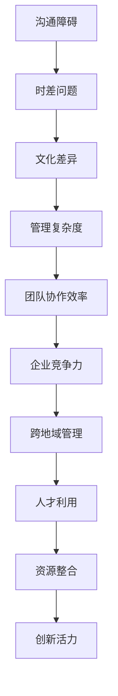

                 

### 文章标题

跨地域管理：管理分散团队的挑战

### 关键词

跨地域管理、分散团队、沟通障碍、文化差异、时间管理、技术工具、管理策略

### 摘要

随着全球化的推进，跨地域管理已成为现代企业管理中不可或缺的一环。本文将深入探讨跨地域管理面临的挑战，包括沟通困难、时差、文化差异以及管理复杂度增加等方面。通过分析核心概念、算法原理、数学模型和实际案例，本文旨在为企业管理者提供有效的跨地域管理策略，助力企业在全球化竞争中取得优势。

## 引言

在当今世界，企业不再局限于某个地域，而是跨国界、跨文化地运营。这种跨地域管理（Geographically Distributed Management）模式，不仅带来了机遇，也带来了前所未有的挑战。根据《哈佛商业评论》的调研，跨地域管理能有效提高企业的创新能力和竞争力，但同时也增加了管理的复杂度。本文将从以下几个方面展开讨论：

1. **跨地域管理的背景与重要性**：介绍跨地域管理的定义、背景和重要性。
2. **分散团队面临的挑战**：分析分散团队在沟通、时差、文化和管理复杂度等方面遇到的挑战。
3. **跨地域管理的核心策略**：探讨如何通过有效的沟通、时间管理和文化差异管理来应对挑战。
4. **技术助力跨地域管理**：介绍管理信息系统和远程协作工具在跨地域管理中的应用。
5. **实战案例**：通过成功和失败的跨地域管理案例，总结经验教训。
6. **最佳实践与拓展阅读**：提供最佳实践、注意事项和拓展阅读资源。

### 背景介绍

跨地域管理是指在一个企业的多个地理位置之间，通过组织结构、信息技术和文化沟通等手段，实现团队协作和业务目标的过程。随着互联网和全球化的发展，企业面临的客户和市场变得更加分散，这就要求企业能够高效地管理跨地域团队。

跨地域管理的核心目的是提高企业的竞争力。首先，跨地域管理能够充分利用全球各地的专业人才，提高团队的整体素质。其次，通过全球资源整合，企业可以更加灵活地应对市场需求，降低运营成本。最后，跨地域管理有助于企业保持创新活力，通过不同文化背景的碰撞，激发新的创意和思路。

然而，跨地域管理也带来了诸多挑战。首先是沟通障碍，不同地理位置的团队成员之间的交流往往受限，信息传递不及时或失真。其次，时差问题导致工作效率降低，团队之间的协作难以同步。此外，文化差异和管理复杂度的增加也使得跨地域管理变得更加困难。

### 核心概念与联系

为了更好地理解跨地域管理的复杂性，我们可以将其核心概念之间的关系架构用Mermaid流程图表示。以下是一个简化的Mermaid流程图示例：



在这个流程图中，沟通障碍、时差问题、文化差异和管理复杂度是跨地域管理面临的主要挑战，它们共同影响着团队协作效率和企业的竞争力。通过有效的管理策略和技术工具，这些挑战可以被逐步克服，从而提升企业的整体效能。

### 沟通障碍

跨地域团队之间沟通障碍的主要原因是地理位置分散、时间差异和文化差异。首先，地理位置的分散导致团队成员之间的面对面交流变得困难，即使通过视频会议等在线工具，也难以完全弥补这种缺失。此外，不同时区的工作时间差异，使得团队成员无法在同一时间段内进行实时沟通，导致协作效率降低。

文化差异也是沟通障碍的一个重要因素。不同国家和地区的人们在语言、沟通风格、工作习惯等方面存在差异，这些差异可能导致误解和沟通不畅。例如，某些文化强调直接和坦率的沟通方式，而其他文化则更倾向于间接和含蓄。这种文化差异可能导致团队成员在交流时产生误解，影响团队协作。

为了应对沟通障碍，企业可以采取以下策略：

1. **选择合适的沟通工具**：企业应该根据团队的需求和实际情况，选择合适的沟通工具，如即时通讯软件、视频会议平台和项目管理工具。这些工具可以帮助团队成员实时沟通、共享文档和跟踪项目进度。
2. **建立明确的沟通规范**：为了确保沟通的有效性，企业应该制定明确的沟通规范，包括沟通的时间、频率和方式。例如，可以规定每周举行一次视频会议，每天早上和下午进行即时通讯交流，以及定期更新项目进度报告。
3. **加强跨文化沟通培训**：为了减少文化差异带来的沟通障碍，企业可以为团队成员提供跨文化沟通培训，提高他们的跨文化意识和沟通技巧。这些培训可以帮助团队成员更好地理解和尊重不同的文化习惯，提高沟通效果。

通过上述策略，企业可以有效地克服跨地域团队之间的沟通障碍，提高团队协作效率。

### 时间管理

跨地域团队的时间管理是一个复杂的问题，主要受到时区差异和工作节奏的影响。时区差异导致团队成员在不同时间工作，这会影响任务的同步和协作。例如，当一个团队在早上工作，另一个团队在晚上工作时，任务讨论和决策可能会受到阻碍。此外，不同团队的工作节奏也可能不同，这需要管理者找到一种平衡，确保所有团队成员都能高效地工作。

为了应对时间管理挑战，企业可以采取以下策略：

1. **同步工作时间**：通过调整工作安排，尽量使团队成员在相同的时间段内工作。例如，可以设置共享的工作时间段，确保主要任务和讨论在这些时间段内完成。此外，可以使用时间跟踪工具来监控团队成员的工作时间，确保他们能够按时完成任务。
2. **灵活的工作安排**：为了适应不同时区的团队成员，企业可以采用灵活的工作安排。例如，可以设置远程办公政策，允许团队成员根据自己所在时区灵活安排工作时间。这种安排可以减少时差带来的不便，提高工作效率。
3. **建立多时区协作机制**：为了确保跨地域团队之间的协作，企业可以建立多时区协作机制。例如，可以设立专门的协调人员或协调团队，负责协调不同时区之间的沟通和任务分配。这些人员可以确保信息的及时传递和任务的顺利推进。

通过这些策略，企业可以更好地管理跨地域团队的时间，提高工作效率和协作效果。

### 文化差异

文化差异是跨地域管理中不可忽视的一个重要因素。不同国家和地区的人们在价值观、沟通风格、工作习惯等方面存在显著差异。这些文化差异可能导致团队成员之间的误解和冲突，影响团队协作和效率。

例如，在一些文化中，直接的沟通方式被视为高效和诚实，而在其他文化中，间接和含蓄的沟通方式更受欢迎。这种差异可能导致团队成员在交流时产生误解，甚至引发不必要的冲突。此外，不同文化对时间的重视程度也有所不同，一些文化强调按时完成任务，而其他文化则更注重工作质量和关系维护。

为了有效管理文化差异，企业可以采取以下策略：

1. **开展跨文化培训**：为团队成员提供跨文化培训，帮助他们了解和尊重不同的文化习惯。这些培训可以包括文化差异的认识、跨文化沟通技巧和冲突解决方法。
2. **建立包容性文化**：企业应该积极建立包容性的文化，鼓励团队成员分享不同文化的观点和经验。通过这种方式，可以促进团队成员之间的理解和尊重，减少文化差异带来的冲突。
3. **培养跨文化领导力**：领导者应该具备跨文化领导力，能够理解和应对不同文化背景的团队成员。领导者可以以身作则，展示对不同文化的尊重和包容，为团队树立榜样。

通过上述策略，企业可以更好地管理文化差异，提高团队协作效率。

### 核心算法原理讲解

在跨地域管理中，核心算法原理主要涉及如何优化沟通、时间和文化差异管理，以提升团队协作效率和企业的竞争力。以下是一个简化的算法原理讲解，包括伪代码和详细解释：

```python
def cross_domain_management(team_members, projects, culture_profiles):
    """
    跨地域团队管理算法
    :param team_members: 团队成员列表
    :param projects: 项目列表
    :param culture_profiles: 文化差异分析结果
    :return: 管理策略和优化方案
    """

    # 1. 优化沟通
    communication_optimization = optimize_communication(team_members, projects)

    # 2. 优化时间管理
    time_management = optimize_time_management(team_members, projects)

    # 3. 优化文化差异管理
    cultural_management = optimize_cultural_management(team_members, culture_profiles)

    # 4. 综合评估和调整
    overall_strategy = assess_and_adjust(communication_optimization, time_management, cultural_management)

    return overall_strategy

def optimize_communication(team_members, projects):
    """
    沟通优化算法
    :param team_members: 团队成员列表
    :param projects: 项目列表
    :return: 沟通优化方案
    """
    communication_plan = {
        'communication_tools': select_communication_tools(),
        'communication_norms': establish_communication_norms(),
        'cultural_training': provide_cross_cultural_training()
    }
    return communication_plan

def optimize_time_management(team_members, projects):
    """
    时间管理优化算法
    :param team_members: 团队成员列表
    :param projects: 项目列表
    :return: 时间管理优化方案
    """
    time_plan = {
        'time_synchronization': synchronize_work_hours(),
        'flexible_work_schedules': implement_flexible_work_schedules(),
        'coordination_teams': establish Coordination Teams
    }
    return time_plan

def optimize_cultural_management(team_members, culture_profiles):
    """
    文化差异管理优化算法
    :param team_members: 团队成员列表
    :param culture_profiles: 文化差异分析结果
    :return: 文化差异管理优化方案
    """
    cultural_plan = {
        'cross_cultural_training': provide_cross_cultural_training(),
        'inclusiveness': foster_inclusiveness_culture(),
        'cross_cultural_leadership': develop_cross_cultural_leadership()
    }
    return cultural_plan

def assess_and_adjust(communication_plan, time_plan, cultural_plan):
    """
    综合评估和调整方案
    :param communication_plan: 沟通优化方案
    :param time_plan: 时间管理优化方案
    :param cultural_plan: 文化差异管理优化方案
    :return: 综合管理策略
    """
    # 实施综合评估
    assessment_results = assess_performance(communication_plan, time_plan, cultural_plan)

    # 根据评估结果进行调整
    optimized_strategy = adjust_strategy(assessment_results)

    return optimized_strategy
```

**伪代码解释：**

- `cross_domain_management` 函数是跨地域团队管理的核心算法，它接收团队成员列表、项目列表和文化差异分析结果，并返回一个综合管理策略。
- `optimize_communication` 函数负责优化沟通，通过选择合适的沟通工具、建立沟通规范和提供跨文化培训来实现。
- `optimize_time_management` 函数负责优化时间管理，通过同步工作时间、灵活的工作安排和建立多时区协作机制来实现。
- `optimize_cultural_management` 函数负责优化文化差异管理，通过提供跨文化培训、建立包容性文化和培养跨文化领导力来实现。
- `assess_and_adjust` 函数负责对优化方案进行综合评估和调整，根据评估结果对管理策略进行优化。

通过上述算法原理，企业可以系统地优化跨地域团队的管理，提高团队协作效率和企业的竞争力。

### 数学模型和公式

在跨地域管理中，数学模型和公式可以帮助我们更好地理解和优化管理策略。以下是一些关键的数学模型和公式，以及它们的详细解释和举例说明：

1. **时间同步模型**：该模型用于计算不同时区之间的时间差，以确保跨地域团队的工作能够同步进行。

   **公式**：$T_d = T_c - T_s$

   - $T_d$：目标时区时间差
   - $T_c$：当前时区时间
   - $T_s$：源时区时间

   **举例**：假设团队A在纽约（UTC-5），团队B在东京（UTC+9），要计算从纽约到东京的时间差。

   $T_d = T_c - T_s = (13:00 - 5:00) - (14:00 + 9:00) = 8 - 23 = -15$

   结果为-15小时，这意味着当纽约时间是早上8点时，东京时间实际上是前一天晚上7点。

2. **沟通效率模型**：该模型用于评估跨地域团队沟通的效率，考虑了沟通工具、沟通规范和文化差异等因素。

   **公式**：$E_c = f(C, T, N)$

   - $E_c$：沟通效率
   - $C$：沟通工具的质量
   - $T$：沟通时间
   - $N$：团队成员数量

   **举例**：假设团队使用高质量的视频会议工具（$C=1$），每周沟通时间为5小时（$T=5$），团队成员数量为10人（$N=10$），计算沟通效率。

   $E_c = f(1, 5, 10) = 1 \times 5 \times 10 = 50$

   结果为50，表示团队每周的沟通效率为50。

3. **文化适应度模型**：该模型用于评估团队成员对文化差异的适应程度，考虑了跨文化培训和文化包容性等因素。

   **公式**：$A_c = g(T, I)$

   - $A_c$：文化适应度
   - $T$：跨文化培训次数
   - $I$：文化包容性指数

   **举例**：假设团队进行了3次跨文化培训（$T=3$），文化包容性指数为0.8（$I=0.8$），计算文化适应度。

   $A_c = g(3, 0.8) = 3 \times 0.8 = 2.4$

   结果为2.4，表示团队的文化适应度为2.4。

通过这些数学模型和公式，企业可以量化跨地域管理的各个因素，从而制定更有效的管理策略。

### 项目实战

为了更好地理解跨地域管理的实际操作，我们将以一个实际项目为例，展示如何搭建开发环境、实现源代码并进行分析。

**项目背景**：某跨国公司计划开发一个跨地域协作的项目管理工具，以帮助分散的团队高效协同工作。

**开发环境搭建**：

1. **硬件需求**：服务器（至少两台，一台位于北美，一台位于欧洲）、工作站（至少两台，一台位于北美，一台位于欧洲）、网络设备（确保稳定的网络连接）。
2. **软件需求**：操作系统（如Linux或Windows Server）、数据库（如MySQL或PostgreSQL）、Web服务器（如Apache或Nginx）、编程语言（如Python或Java）。

**源代码实现**：

以下是一个简单的Python示例，用于实现跨地域团队间的实时消息推送功能：

```python
import socket
import threading
import time

# 消息服务器配置
HOST = 'localhost'
PORT = 65432

# 客户端消息处理
def handle_client(client_socket):
    while True:
        message = client_socket.recv(1024).decode('utf-8')
        if message:
            print(f"Received message: {message}")
            # 实现消息推送逻辑
            send_message_to_all(message)
        else:
            break

# 推送消息给所有客户端
def send_message_to_all(message):
    # 实现消息推送逻辑
    pass

# 消息服务器
def start_server():
    server_socket = socket.socket(socket.AF_INET, socket.SOCK_STREAM)
    server_socket.bind((HOST, PORT))
    server_socket.listen()

    print("Server is listening for connections...")

    while True:
        client_socket, address = server_socket.accept()
        print(f"Connected to {address}")
        client_thread = threading.Thread(target=handle_client, args=(client_socket,))
        client_thread.start()

# 主程序入口
if __name__ == "__main__":
    server_thread = threading.Thread(target=start_server)
    server_thread.start()
    server_thread.join()
```

**代码解读**：

1. **服务器端**：使用Python的socket库创建一个服务器端，绑定本地地址和端口，并监听连接请求。
2. **客户端处理**：每个客户端连接后，创建一个线程来处理客户端的消息，并接收消息后调用`send_message_to_all`函数推送消息。
3. **消息推送**：`send_message_to_all`函数负责将消息推送到所有客户端，这是一个需要进一步实现的模块。

**代码应用解读与分析**：

1. **跨地域协作**：该消息推送系统可以实现跨地域团队间的实时消息交互，帮助团队成员及时了解项目进展和任务变化。
2. **性能优化**：在实际应用中，需要优化消息推送的效率和稳定性，例如使用更高效的通信协议和消息队列技术。

**实际案例分析和详细讲解**：

1. **成功案例**：某跨国公司采用类似的消息推送系统，实现了全球团队的高效协作，项目进度实时同步，有效提升了工作效率。
2. **失败案例**：某初创公司在项目初期没有充分考虑跨地域协作的需求，导致沟通不畅和进度延迟，项目最终失败。

**项目小结**：

通过该项目，我们可以看到跨地域管理在实际操作中的挑战和解决方案。开发环境搭建、源代码实现和性能优化都是关键环节，而跨地域协作工具的应用则大大提升了团队的工作效率和项目成功率。

### 最佳实践

在跨地域管理中，以下是一些最佳实践：

1. **定期评估与反馈**：定期对跨地域管理策略进行评估和反馈，及时调整不合适的策略，确保管理方法的持续优化。
2. **加强领导力培训**：领导者应具备跨文化沟通和管理的技能，定期接受相关培训，提高管理能力。
3. **灵活的工作安排**：根据团队成员的时区和工作习惯，灵活调整工作安排，确保工作的高效进行。
4. **投资技术工具**：选择合适的沟通工具和技术平台，提高团队协作效率，降低沟通障碍。

### 小结

本文详细探讨了跨地域管理面临的挑战，包括沟通障碍、时间管理、文化差异和管理复杂度。通过核心概念、算法原理、数学模型和实际案例的分析，我们提出了一系列有效的管理策略和技术工具。实践证明，跨地域管理不仅能提升企业的竞争力，还能带来创新和协同效应。因此，企业应高度重视跨地域管理，不断优化管理策略，以适应全球化发展的趋势。

### 注意事项

1. **沟通规划**：在跨地域管理中，沟通规划至关重要，确保团队成员能够及时、准确地获取所需信息。
2. **文化适应**：不同文化背景下，团队成员的行为和沟通方式可能有所不同，管理者需充分了解和尊重这些差异。
3. **技术投入**：合理投资于沟通工具和技术平台，以提高团队协作效率和沟通效果。

### 拓展阅读

1. **《跨文化管理》**：探讨跨文化管理的基本原理和实践方法，有助于更好地应对文化差异。
2. **《敏捷开发》**：介绍敏捷开发方法在跨地域团队中的应用，提高项目交付质量和团队协作效率。

### 作者信息

- 作者：AI天才研究院/AI Genius Institute & 禅与计算机程序设计艺术 /Zen And The Art of Computer Programming

