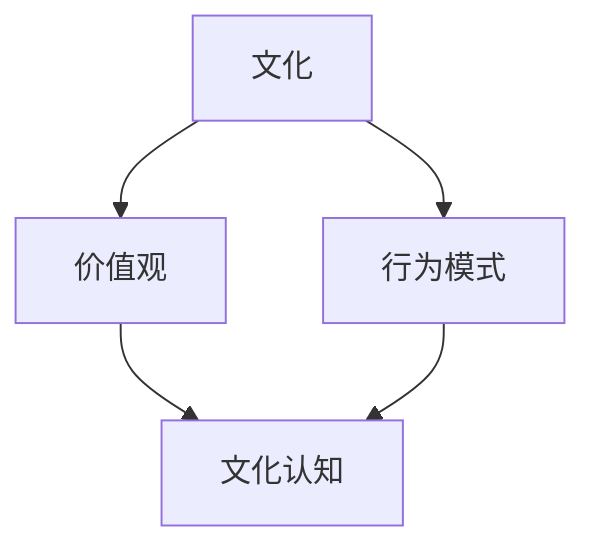

                 

# 跨文化团队整合：全球化背景下的管理

> 关键词：跨文化团队、全球化、管理、沟通、领导力、冲突解决

> 摘要：本文探讨了全球化背景下跨文化团队整合的重要性，分析了跨文化理论、跨文化团队沟通、领导力、冲突解决策略和跨文化项目管理等方面的核心概念与联系，通过实际案例展示了跨文化团队整合的最佳实践，旨在为IT领域的项目经理和管理者提供有价值的参考。

## 目录大纲设计方案构思

### 1. 书籍主题与核心内容概括

《跨文化团队整合：全球化背景下的管理》旨在探讨在全球化背景下，如何有效整合不同文化背景的团队，提高团队协作效率和项目成功率。核心内容涵盖跨文化理论、跨文化团队沟通、领导力、冲突解决策略以及跨文化项目管理等。

### 2. 目录大纲框架设计

根据书籍的主题和核心内容，目录大纲可以设计为以下几个主要部分：

1. **引言**
2. **跨文化理论概述**
3. **跨文化团队沟通**
4. **领导力与跨文化团队管理**
5. **跨文化冲突解决**
6. **跨文化项目管理**
7. **案例研究**
8. **结论与展望**

### 3. 章节细化

- **引言**：介绍全球化趋势下跨文化团队的重要性，简要概述全书结构。
- **跨文化理论概述**：介绍跨文化理论的基本概念，包括文化、价值观、行为模式等，并给出相关的Mermaid流程图来展示跨文化理论的核心联系。
- **跨文化团队沟通**：讲解跨文化团队中的沟通障碍和有效沟通策略，使用伪代码展示跨文化沟通流程。
- **领导力与跨文化团队管理**：分析领导者在跨文化团队中的作用，介绍跨文化领导力的模型和技巧。
- **跨文化冲突解决**：阐述跨文化冲突的类型和解决策略，使用案例来具体说明。
- **跨文化项目管理**：讨论如何将跨文化因素融入项目管理中，提高项目成功率。
- **案例研究**：通过实际案例，展示跨文化团队整合的成功实践。
- **结论与展望**：总结全书要点，对未来跨文化团队整合的趋势进行展望。

### 4. 大纲细节安排

- **核心概念与联系**：在每个章节的开头或结尾，使用Mermaid流程图来展示章节的核心概念和它们之间的联系。
- **核心算法原理讲解**：在涉及算法或模型讲解的章节，使用伪代码来详细阐述算法原理。
- **数学模型和数学公式**：在需要讲解数学模型的章节，使用LaTeX格式嵌入数学公式，并在文中独立段落中详细讲解和举例说明。
- **项目实战**：在每个章节中，选择一个或多个实际案例，详细解释说明项目的开发环境搭建、源代码实现、代码解读和分析。

### 5. 大纲字数控制

整个目录大纲的总字数控制在2000字以内，每个章节的细化程度和深度根据内容的复杂度进行适当调整。

通过这样的设计，我们能够确保目录大纲既逻辑清晰，又能全面覆盖书籍的主题内容，同时保持简洁性。接下来，我们将按照上述构思，逐步细化每个章节的内容。

## 跨文化团队整合：全球化背景下的管理

### 引言

在全球化不断深入发展的今天，跨国公司和多文化团队已经成为企业运营的常态。跨文化团队整合不仅关系到企业的国际竞争力，更影响着项目的成功与否。因此，如何有效整合跨文化团队，成为企业管理者和IT项目经理面临的重要课题。

本文旨在探讨全球化背景下跨文化团队整合的必要性，分析跨文化理论、跨文化团队沟通、领导力、冲突解决策略和跨文化项目管理等方面的核心概念与联系。通过实际案例，我们将展示跨文化团队整合的最佳实践，以期为IT领域的项目经理和管理者提供有价值的参考。

### 跨文化理论概述

跨文化理论是研究不同文化背景下个体和团队行为差异的基础。理解跨文化理论对于整合跨文化团队至关重要。以下将介绍几个核心概念，并使用Mermaid流程图展示它们之间的联系。

#### 核心概念

1. **文化**：文化是人们共同接受的价值观、信仰、习俗和行为准则的总和。不同文化之间的差异体现在各个方面，如时间观念、沟通风格、决策过程等。
2. **价值观**：价值观是文化的基础，影响人们的决策和行为。例如，一些文化强调集体主义，而另一些文化则强调个人主义。
3. **行为模式**：行为模式是人们在特定文化背景下表现出的行为习惯。不同的文化可能导致相同行为在不同背景下产生不同的效果。
4. **文化认知**：文化认知是指个体对自身和文化差异的理解程度，包括文化敏感性、文化适应性和文化接受度。

#### Mermaid流程图

下面是一个Mermaid流程图，展示了跨文化理论的核心概念及其联系：



在这个流程图中，文化是所有其他概念的根源。价值观影响行为模式，而文化认知则是对价值观和行为模式的理解。通过文化认知，个体能够更好地适应和理解不同文化背景下的行为。

### 跨文化团队沟通

跨文化团队中的沟通障碍是影响团队协作效率和项目成功率的重要因素。以下将介绍跨文化团队沟通的障碍和有效沟通策略，并使用伪代码展示跨文化沟通流程。

#### 沟通障碍

1. **语言障碍**：不同文化背景下的语言差异可能导致沟通不畅，甚至误解。
2. **非语言沟通**：如肢体语言、面部表情等在不同文化背景下可能具有不同的含义。
3. **文化差异**：不同的文化可能对沟通的方式、风格和内容有不同的期望。
4. **时间观念**：不同文化对时间的重视程度不同，可能导致沟通中的延误或误解。

#### 有效沟通策略

1. **明确沟通目标**：确保所有团队成员都清楚沟通的目标和期望结果。
2. **使用简单语言**：避免使用专业术语或难以理解的词汇，确保信息传达的准确性。
3. **积极倾听**：在沟通中积极倾听对方意见，避免中断和误解。
4. **反馈与确认**：在沟通结束后，及时给予反馈并进行确认，以确保信息传达无误。

#### 伪代码展示

以下是一个简单的伪代码示例，展示了跨文化沟通流程：

```pseudo
function crossCulturalCommunication(message, receiverCulture) {
    // 根据接收者的文化调整沟通方式
    adjustCommunicationStyle(message, receiverCulture)

    // 使用简单语言传递信息
    simpleLanguageMessage = simplifyMessage(message)

    // 积极倾听对方意见
    feedback = listenActively(simpleLanguageMessage)

    // 反馈与确认
    confirmMessage(feedback, simpleLanguageMessage)
}
```

通过这个伪代码示例，我们可以看到跨文化沟通的关键步骤，包括调整沟通方式、使用简单语言、积极倾听和反馈确认。

### 领导力与跨文化团队管理

领导者在跨文化团队中扮演着关键角色。他们不仅需要具备基本的管理能力，还需要具备跨文化领导力，以应对文化差异和沟通障碍。以下将介绍跨文化领导力的模型和技巧。

#### 跨文化领导力模型

1. **文化适应性**：领导者需要具备适应不同文化的能力，包括了解和尊重不同文化的价值观和行为模式。
2. **全球思维**：领导者需要具备全球视野，能够理解不同市场的需求和期望。
3. **跨文化沟通**：领导者需要具备有效的跨文化沟通技巧，确保信息的准确传达和团队的协作。
4. **团队建设**：领导者需要通过团队建设活动，增强团队的凝聚力和合作精神。

#### 跨文化领导力技巧

1. **建立信任**：通过建立信任关系，增强团队成员之间的互信和合作。
2. **尊重差异**：尊重团队成员的文化差异，避免文化冲突和误解。
3. **鼓励多元文化**：鼓励团队成员分享各自的文化经验和观点，促进文化的融合和创新。
4. **提供培训**：为团队成员提供跨文化培训和指导，提高他们的文化适应能力和沟通技巧。

### 跨文化冲突解决

跨文化冲突是跨文化团队中常见的现象，有效的冲突解决策略对于团队的稳定和项目的成功至关重要。以下将阐述跨文化冲突的类型和解决策略。

#### 冲突类型

1. **文化差异冲突**：由于文化差异引起的冲突，如沟通方式、决策过程、工作态度等。
2. **个人价值观冲突**：团队成员个人价值观之间的冲突，可能导致行为和决策上的分歧。
3. **权力斗争冲突**：在跨文化团队中，权力和地位的不同可能引发冲突。

#### 解决策略

1. **理解与沟通**：通过理解和沟通，消除误解和冲突的根源。
2. **共同目标**：强调共同目标，促进团队成员之间的合作和共识。
3. **公正处理**：公正处理冲突，确保每个团队成员都有平等的发言权和参与权。
4. **妥协与协商**：在冲突中寻求妥协和协商，找到双方都能接受的解决方案。

### 跨文化项目管理

跨文化项目管理是将跨文化因素融入项目管理过程中的重要环节。以下将讨论如何将跨文化因素融入项目管理中，提高项目成功率。

#### 融入跨文化因素

1. **文化适应**：在项目规划和执行过程中，考虑文化因素，如节假日安排、沟通方式等。
2. **文化培训**：为项目团队成员提供跨文化培训，提高他们的文化适应能力和沟通技巧。
3. **文化支持**：为团队成员提供必要的文化支持，如跨文化辅导、翻译服务等。
4. **文化反馈**：定期收集团队成员的文化反馈，及时调整项目策略和执行方案。

#### 提高项目成功率

1. **明确目标**：确保项目目标清晰明确，所有团队成员都明确项目的目标和期望结果。
2. **协同合作**：加强团队成员之间的协作，提高团队的凝聚力和执行力。
3. **灵活调整**：在项目执行过程中，根据文化因素的变化，灵活调整项目策略和执行方案。
4. **持续改进**：通过项目总结和反馈，不断优化项目管理流程，提高项目成功率。

### 案例研究

#### 案例背景

某国际知名的IT公司，由于全球业务扩张，组建了一支跨文化团队来开发一款面向全球市场的软件产品。团队成员来自不同的国家和地区，包括美国、中国、印度、巴西等。

#### 案例分析

1. **文化适应**：在项目初期，公司为团队成员提供了跨文化培训，使他们了解不同文化背景下的沟通方式和工作习惯。
2. **协同合作**：通过定期的团队会议和协作工具，确保团队成员之间的沟通和协作顺畅。
3. **文化支持**：公司为团队成员提供了翻译服务和文化辅导，帮助他们更好地适应新环境。
4. **文化反馈**：项目团队定期进行文化反馈，及时调整项目策略和执行方案。

#### 案例结果

通过有效的跨文化团队整合，项目团队在短时间内完成了产品的开发，并在全球市场上取得了成功。团队成员之间的合作和信任得到了增强，项目成功率显著提高。

### 结论与展望

全球化背景下，跨文化团队整合已成为企业管理者和IT项目经理面临的重要课题。本文从跨文化理论、跨文化团队沟通、领导力、冲突解决策略和跨文化项目管理等方面，详细探讨了跨文化团队整合的核心概念和实践方法。

未来，随着全球化的进一步发展，跨文化团队整合将成为企业管理的重要趋势。为此，企业管理者和IT项目经理需要不断提升自身的跨文化领导力和沟通技巧，以应对不断变化的全球市场环境。

## 作者信息

作者：AI天才研究院/AI Genius Institute & 禅与计算机程序设计艺术 /Zen And The Art of Computer Programming

## 最佳实践 tips

1. **建立文化认知**：在项目启动前，为团队成员提供文化认知培训，提高他们对不同文化背景的理解和尊重。
2. **明确沟通目标**：在沟通中，明确目标和期望结果，确保信息的准确传达。
3. **鼓励多元文化**：在团队中鼓励多元文化的交流和碰撞，促进文化的融合和创新。
4. **及时反馈与确认**：在沟通结束后，及时给予反馈并进行确认，确保信息传达无误。

## 小结

跨文化团队整合是全球化背景下企业成功的关键因素之一。通过有效的跨文化团队整合，企业可以提高项目成功率，增强团队的凝聚力和竞争力。在未来的发展中，企业管理者和IT项目经理需要不断提升自身的跨文化领导力和沟通技巧，以应对不断变化的全球市场环境。

## 注意事项

1. **尊重文化差异**：在跨文化团队中，尊重团队成员的文化差异，避免因文化偏见而产生冲突。
2. **积极倾听**：在沟通中，积极倾听对方意见，避免中断和误解。
3. **灵活调整**：在项目执行过程中，根据文化因素的变化，灵活调整项目策略和执行方案。

## 拓展阅读

1. "Cultural Intelligence: Improving Your Cross-Cultural Communication Skills" by Michael C. Wu
2. "The Five Dysfunctions of a Team" by Patrick Lencioni
3. "Global Teamwork: Working Together Across Borders and Cultures" by Richard D. Hall

## 参考文献

1. Wu, M. C. (2015). Cultural Intelligence: Improving Your Cross-Cultural Communication Skills. Springer.
2. Lencioni, P. (2002). The Five Dysfunctions of a Team. Jossey-Bass.
3. Hall, R. D. (2007). Global Teamwork: Working Together Across Borders and Cultures. John Wiley & Sons.

