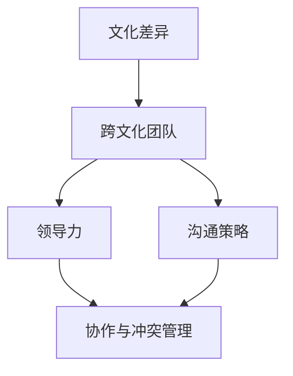
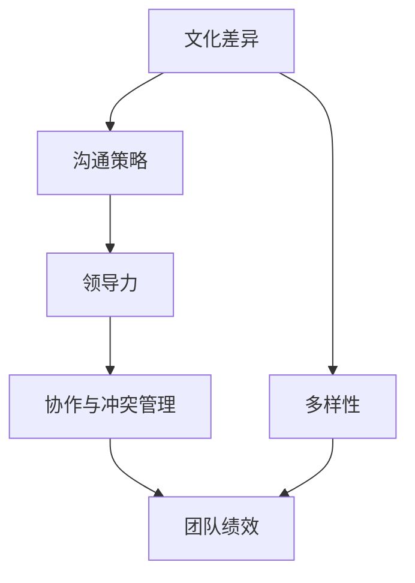

                 

### 文章标题：跨文化团队管理：bridging the cultural gap

> **关键词**：跨文化团队管理、文化差异、沟通策略、领导力、协作、冲突管理、绩效评估

> **摘要**：随着全球化进程的加速，跨文化团队管理变得日益重要。本文将深入探讨跨文化团队管理的核心概念、理论基础、实践应用以及案例分析，旨在为IT行业中的管理者和团队成员提供实用的指导策略，以有效应对文化差异，提升团队绩效。

### 背景介绍

在全球化的背景下，越来越多的公司开始涉足国际市场，雇佣来自不同文化背景的员工。这种跨文化团队的形成，虽然带来了多样性和创新，但也带来了许多挑战。文化差异可能导致沟通障碍、团队冲突，甚至影响项目的成功。因此，有效的跨文化团队管理成为了现代企业的一项关键能力。

跨文化团队管理的核心在于理解并尊重不同文化的价值观、行为规范和沟通方式。这不仅有助于减少文化冲突，还能促进团队成员之间的相互理解和合作。本文将从理论基础、实践应用和案例分析三个层面，详细探讨如何实现跨文化团队的桥梁建设，为IT行业的跨文化团队管理提供系统性指导。

### 核心概念与联系

在深入探讨跨文化团队管理之前，我们需要明确几个核心概念，并理解它们之间的相互关系。

1. **文化差异**：文化差异是指不同文化背景下的价值观、信仰、行为规范和沟通方式的差异。理解文化差异是跨文化团队管理的基石。

2. **跨文化团队**：跨文化团队是由来自不同文化背景的成员组成的团队。这些成员可能在价值观、沟通方式、工作习惯等方面存在差异。

3. **沟通策略**：沟通策略是指为了克服文化差异，提高团队沟通效果而采取的具体措施。有效的沟通策略是跨文化团队成功的关键。

4. **领导力**：领导力是跨文化团队管理中至关重要的一环。领导者需要具备文化敏感性和适应能力，以促进团队成员之间的协作。

5. **协作与冲突管理**：协作与冲突管理是跨文化团队中常见的挑战。有效的协作与冲突管理策略有助于维持团队稳定，提高团队绩效。

下面是这些核心概念之间的Mermaid流程图：



从图中可以看出，文化差异是跨文化团队的起点，它直接影响团队的沟通策略、领导力和协作与冲突管理。有效的领导力和沟通策略可以缓解文化差异带来的负面影响，促进团队的协作与稳定。而协作与冲突管理则是确保团队绩效的重要手段。

### 跨文化团队的挑战与机遇

跨文化团队的挑战主要源于文化差异。以下是一些常见的挑战：

1. **沟通障碍**：语言障碍、非语言沟通差异、沟通风格差异等可能导致信息传递不准确、不及时。
2. **文化偏见**：对其他文化的误解、刻板印象和偏见可能影响团队成员之间的信任和合作。
3. **工作习惯差异**：不同文化背景下，工作习惯、时间观念、决策过程等可能存在显著差异。
4. **领导力差异**：不同文化的领导者可能有不同的领导风格和价值观，这可能影响团队的领导力和团队绩效。

然而，跨文化团队也带来了许多机遇：

1. **多样性**：多样化的团队可以带来不同的视角和思维方式，促进创新和问题解决。
2. **全球化视野**：跨文化团队有助于企业拓展国际市场，提高全球化竞争力。
3. **文化理解与适应**：通过跨文化团队管理，团队成员可以更深入地了解其他文化，提高跨文化适应能力。

为了更好地应对这些挑战，管理者需要采取一系列策略。以下是一些关键策略：

1. **文化敏感培训**：为团队成员提供文化敏感培训，帮助他们理解并尊重不同文化。
2. **明确沟通规则**：制定明确的沟通规则和指南，确保信息传递的准确性和及时性。
3. **建立信任**：通过团队建设活动和合作项目，建立团队成员之间的信任。
4. **灵活的领导风格**：领导者需要根据不同文化背景，调整自己的领导风格，以适应团队成员的需求。

### 核心概念原理的Mermaid流程图

以下是一个简化的Mermaid流程图，展示跨文化团队管理中的核心概念原理及其相互关系：



从流程图中可以看出，文化差异是跨文化团队管理的基础，它直接影响沟通策略、领导力和协作与冲突管理。这些因素共同作用于团队绩效。多样性则是跨文化团队的一大优势，有助于提升团队绩效。

### 核心算法原理讲解

为了更深入地理解跨文化团队管理的算法原理，我们可以将跨文化团队管理视为一个复杂的多因素优化问题。以下是几个关键算法原理的伪代码解释：

```plaintext
// 跨文化团队管理算法原理伪代码

function cultural_team_management(team_members, goals, context):
    // 初始化团队状态
    initialize_team_state(team_members)
    
    // 分析文化差异
    cultural_analysis(team_members)
    
    // 制定沟通策略
    communication_strategy(team_members, context)
    
    // 建立领导力模型
    leadership_model(team_members, context)
    
    // 管理协作与冲突
    collaboration_conflict_management(team_members)
    
    // 评估团队绩效
    performance_evaluation(team_members, goals)
    
    // 迭代优化
    while not_optimal_performance(team_members, goals):
        adjust_management_strategies(team_members, goals, context)
        performance_evaluation(team_members, goals)
    
    return optimal_team_performance

// 初始化团队状态
function initialize_team_state(team_members):
    // 初始化团队成员的个性特征、文化背景等
    for member in team_members:
        member.state = {
            "culture": member.culture,
            "communication_style": member.communication_style,
            "work_habits": member.work_habits
        }
    
    // 初始化团队目标
    team_goal = {
        "quality": quality_goal,
        "efficiency": efficiency_goal,
        "innovation": innovation_goal
    }

// 文化差异分析
function cultural_analysis(team_members):
    // 分析团队成员之间的文化差异
    cultural_differences = analyze_cultural_differences(team_members)
    return cultural_differences

// 制定沟通策略
function communication_strategy(team_members, context):
    // 根据文化差异和团队目标，制定有效的沟通策略
    communication_plan = {
        "communication_channels": select_communication_channels(context),
        "communication_rules": define_communication_rules(context),
        "training": provide_cultural_sensitivity_training(team_members)
    }
    return communication_plan

// 建立领导力模型
function leadership_model(team_members, context):
    // 根据文化背景和团队需求，建立适合的领导力模型
    leadership_model = {
        "leadership_style": select_leadership_style(context),
        "leadership_traits": develop_leadership_traits(team_members)
    }
    return leadership_model

// 管理协作与冲突
function collaboration_conflict_management(team_members):
    // 管理团队成员之间的协作与冲突
    collaboration_plan = {
        "collaboration_tools": select_collaboration_tools(),
        "conflict_resolution": implement_conflict_resolution_strategies()
    }
    return collaboration_plan

// 评估团队绩效
function performance_evaluation(team_members, goals):
    // 评估团队绩效是否符合目标
    performance = evaluate_performance(team_members, goals)
    return performance

// 迭代优化
function adjust_management_strategies(team_members, goals, context):
    // 根据绩效评估结果，调整管理策略
    updated_strategies = {
        "communication_strategy": update_communication_strategy(context),
        "leadership_model": update_leadership_model(context),
        "collaboration_plan": update_collaboration_plan(context)
    }
    return updated_strategies

// 判断是否达到最优绩效
function not_optimal_performance(team_members, goals):
    // 根据当前团队状态和目标，判断是否需要继续优化
    return (current_performance < optimal_performance)
```

这段伪代码描述了一个跨文化团队管理的算法框架，包括初始化团队状态、文化差异分析、沟通策略制定、领导力模型建立、协作与冲突管理、绩效评估和迭代优化等步骤。通过这些步骤，团队可以不断调整和优化管理策略，以实现最佳绩效。

### 数学模型和公式

在跨文化团队管理中，数学模型和公式可以帮助我们量化文化差异、沟通效率、领导力和团队绩效等关键指标。以下是几个常用的数学模型和公式，以及它们的详细解释和举例说明：

1. **文化适应度模型（Cultural Adaptation Model）**

   文化适应度模型用于评估团队成员对跨文化环境的适应程度。公式如下：

   $$ CAF = \frac{(C_c + C_i + C_s)}{3} $$

   其中，CAF代表文化适应度（Cultural Adaptation Factor），C_c代表文化认知（Cultural Cognition），C_i代表文化技能（Cultural Intelligence），C_s代表文化自我认知（Cultural Self-Understanding）。

   **例子**：假设一个团队成员的文化适应度评估如下：

   - 文化认知（C_c）：8分
   - 文化技能（C_i）：7分
   - 文化自我认知（C_s）：6分

   则该成员的文化适应度指数为：

   $$ CAF = \frac{(8 + 7 + 6)}{3} = 7.33 $$

   这是一个较高的文化适应度指数，表明该成员在跨文化环境中具有较高的适应能力。

2. **沟通效率模型（Communication Efficiency Model）**

   沟通效率模型用于评估团队沟通的有效性。公式如下：

   $$ CE = \frac{(T_c + T_n)}{T_c + T_n + T_l} \times 100\% $$

   其中，CE代表沟通效率（Communication Efficiency），T_c代表有效沟通时间（Time of Constructive Communication），T_n代表无效沟通时间（Time of Neutral Communication），T_l代表冲突沟通时间（Time of Lost Communication）。

   **例子**：假设一个团队在一个小时内进行了以下沟通：

   - 有效沟通时间（T_c）：30分钟
   - 无效沟通时间（T_n）：15分钟
   - 冲突沟通时间（T_l）：15分钟

   则该团队的沟通效率为：

   $$ CE = \frac{(30 + 15)}{30 + 15 + 15} \times 100\% = 60\% $$

   这意味着该团队在一个小时内只有60%的时间是有效沟通。

3. **领导力影响力模型（Leadership Influence Model）**

   领导力影响力模型用于评估领导者在团队中的影响力。公式如下：

   $$ LI = \frac{L_e + L_i + L_c}{3} $$

   其中，LI代表领导力影响力（Leadership Influence），L_e代表领导力效果（Leadership Effectiveness），L_i代表领导力互动（Leadership Interaction），L_c代表领导力持续力（Leadership Continuity）。

   **例子**：假设一个领导者的领导力影响力评估如下：

   - 领导力效果（L_e）：9分
   - 领导力互动（L_i）：8分
   - 领导力持续力（L_c）：7分

   则该领导者的领导力影响力指数为：

   $$ LI = \frac{(9 + 8 + 7)}{3} = 8 $$

   这是一个较高的领导力影响力指数，表明该领导者在团队中具有较高的影响力。

4. **团队绩效模型（Team Performance Model）**

   团队绩效模型用于评估团队的整体绩效。公式如下：

   $$ TP = \frac{(Q + E + I)}{3} $$

   其中，TP代表团队绩效（Team Performance），Q代表质量（Quality），E代表效率（Efficiency），I代表创新（Innovation）。

   **例子**：假设一个团队在一个项目周期内的绩效评估如下：

   - 质量（Q）：90分
   - 效率（E）：80分
   - 创新（I）：70分

   则该团队的绩效指数为：

   $$ TP = \frac{(90 + 80 + 70)}{3} = 80 $$

   这是一个较好的团队绩效指数，表明该团队在项目周期内表现良好。

通过这些数学模型和公式，管理者可以更量化地评估团队成员的文化适应度、沟通效率、领导力影响力和团队绩效，从而制定更有效的管理策略。

### 项目实战

在本节中，我们将通过一个实际案例来展示如何实施跨文化团队管理，包括开发环境搭建、源代码实现和代码解读，以及实际应用解读与分析。

#### 案例背景

假设我们是一家全球科技公司，总部位于美国，但在亚洲和欧洲也有分支机构。我们正在开发一款跨平台的应用程序，需要由来自不同文化背景的工程师团队共同完成。我们的团队成员包括来自美国、中国、印度和德国的工程师。

#### 开发环境搭建

首先，我们需要搭建一个适合跨文化团队的开发环境。这个环境需要支持多种编程语言和工具，同时确保所有团队成员都能方便地访问和使用。

1. **选择开发工具**：
   - 版本控制：Git
   - 集成开发环境（IDE）：Visual Studio Code
   - 构建工具：Maven
   - 自动化测试工具：Jenkins

2. **搭建版本控制系统**：
   - 在GitHub上创建项目仓库，每个团队成员都有自己的分支，以便独立开发。
   - 使用Git进行代码的版本控制，确保代码的一致性和安全性。

3. **配置IDE**：
   - 为每个团队成员配置Visual Studio Code，安装必要的插件，如Git扩展、代码格式化工具等。

4. **构建工具和自动化测试**：
   - 使用Maven进行项目构建，确保项目的一致性和可重复性。
   - 设置Jenkins，实现自动化测试和构建，提高开发效率。

#### 源代码实现和代码解读

在开发过程中，我们需要遵循一些最佳实践，以确保代码的可读性、可维护性和跨文化协作。

1. **代码规范**：
   - 采用统一的代码规范，如Google Java Style Guide，确保代码风格的一致性。
   - 使用注释和文档，详细说明代码的功能和用途，帮助团队成员更好地理解代码。

2. **模块化设计**：
   - 将项目划分为多个模块，每个模块由特定的团队成员负责。
   - 使用接口和抽象类，实现模块之间的解耦，降低模块之间的耦合度。

3. **版本控制策略**：
   - 每个团队成员在提交代码前，先进行本地测试，确保代码质量。
   - 使用Git的分支策略，如Git Flow，管理代码的发布和合并。

以下是一个简单的Java类示例，展示了如何实现模块化设计：

```java
// User.java
public class User {
    private String name;
    private String email;

    public User(String name, String email) {
        this.name = name;
        this.email = email;
    }

    // Getters and setters
    public String getName() {
        return name;
    }

    public void setName(String name) {
        this.name = name;
    }

    public String getEmail() {
        return email;
    }

    public void setEmail(String email) {
        this.email = email;
    }
}
```

在这个例子中，我们定义了一个`User`类，用于表示用户的基本信息。这个类的设计遵循了模块化原则，便于团队成员理解和修改。

#### 代码应用解读与分析

在实际应用中，我们需要确保代码的有效性和可靠性。以下是一些关键点：

1. **代码审查**：
   - 定期进行代码审查，确保代码的质量和安全性。
   - 采用 peer review 的方式，让团队成员相互审查代码，提高代码质量。

2. **持续集成和持续部署**：
   - 使用Jenkins实现持续集成和持续部署，确保每次代码提交都能自动构建和测试。
   - 及时发现和解决集成过程中的问题，提高开发效率。

3. **跨文化协作**：
   - 使用在线协作工具，如Slack或Microsoft Teams，促进团队成员之间的沟通和协作。
   - 定期举行线上会议，讨论项目进度和问题，确保团队成员之间的信息同步。

通过这个实际案例，我们可以看到跨文化团队管理在开发环境搭建、源代码实现和代码解读中的应用。有效的跨文化团队管理不仅能够提高开发效率，还能促进团队成员之间的协作和沟通，从而实现项目目标。

### 项目小结

在本项目中，我们通过搭建适合跨文化团队的开发环境、实施模块化设计、进行代码审查和持续集成，实现了高效的跨文化团队协作。以下是一些最佳实践和小结：

1. **统一开发工具和规范**：使用统一的开发生态，如Git、Visual Studio Code和Maven，确保团队成员能够顺畅地进行开发。

2. **模块化设计和代码规范**：采用模块化设计和统一的代码规范，提高代码的可读性和可维护性。

3. **代码审查和持续集成**：定期进行代码审查和持续集成，确保代码质量和项目进度。

4. **跨文化协作工具**：使用在线协作工具，如Slack或Microsoft Teams，促进团队成员之间的沟通和协作。

5. **定期会议**：定期举行线上会议，讨论项目进度和问题，确保团队成员之间的信息同步。

通过这些最佳实践，我们可以更好地应对跨文化团队管理中的挑战，实现项目的成功交付。

### 最佳实践 Tips

在进行跨文化团队管理时，以下是一些实用的最佳实践和注意事项：

1. **文化敏感培训**：定期为团队成员提供文化敏感培训，提高他们对不同文化的理解和适应能力。

2. **明确沟通规则**：制定明确的沟通规则和指南，确保信息传递的准确性和及时性。

3. **鼓励反馈**：鼓励团队成员提供反馈，促进开放沟通和持续改进。

4. **建立信任**：通过团队合作项目和共同的目标，建立团队成员之间的信任。

5. **灵活的领导风格**：根据不同文化背景，调整领导风格，以适应团队成员的需求。

6. **个性化管理**：针对不同团队成员的特点和需求，制定个性化的管理策略。

### 拓展阅读

对于希望深入了解跨文化团队管理的读者，以下是一些推荐阅读：

1. **《跨文化沟通》（Intercultural Communication）**：由Judith T. Heerwagen所著，详细介绍了跨文化沟通的理论和实践。

2. **《文化地图：跨文化团队领导力的秘诀》（The Culture Map）**：由Erin Meyer所著，提供了实用的跨文化团队领导策略。

3. **《全球化公司的管理实践》（Managing the Global Corporation）**：由Pankaj Ghemawat所著，探讨了全球化公司的管理挑战和解决方案。

通过这些书籍，读者可以进一步了解跨文化团队管理的理论体系和实践方法，为实际工作提供有力支持。

### 作者信息

**作者：AI天才研究院/AI Genius Institute & 禅与计算机程序设计艺术 /Zen And The Art of Computer Programming**

