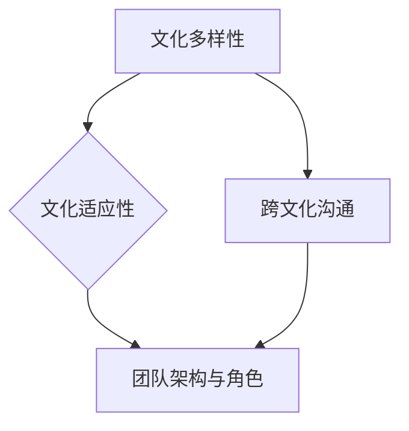

                 

### 跨文化团队管理：bridging the gap

#### 关键词

- 跨文化团队管理
- 沟通与协作
- 文化差异
- 领导风格
- 项目管理
- 激励机制
- 案例分析

#### 摘要

本文旨在探讨跨文化团队管理的重要性和挑战，并分享一些实用的策略和方法。首先，我们介绍了跨文化团队的背景和意义，分析了全球化背景下跨文化团队所带来的挑战和机遇。随后，我们详细探讨了跨文化团队管理的核心概念，包括文化多样性、文化适应性和跨文化沟通等。接着，我们讨论了文化差异的测量方法和评估模型，并介绍了如何通过有效的沟通技巧来减少文化差异带来的沟通障碍。此外，我们还探讨了领导风格在跨文化团队管理中的关键作用，以及如何通过团队建设与激励机制来提高跨文化团队的绩效。最后，我们通过具体案例展示了跨文化团队管理的实践应用，并提出了未来发展的趋势和展望。希望本文能为从事跨文化团队管理的工作者提供有价值的参考。

#### 引言与背景

在当今全球化的背景下，跨文化团队管理变得愈发重要。随着跨国企业的发展和国际合作的加强，越来越多的团队需要在不同的文化背景下进行沟通与协作。跨文化团队不仅包括来自不同国家的成员，还涉及不同民族、宗教、语言和价值观的多样性。这种多样性带来了巨大的挑战，同时也蕴含着巨大的机遇。

首先，跨文化团队面临的挑战主要体现在以下几个方面：

1. **沟通障碍**：由于文化差异，团队成员可能在沟通中遇到误解和障碍。语言障碍、非语言沟通的差异、沟通风格的不同等都可能影响团队的沟通效果。

2. **价值观差异**：不同的文化背景可能导致团队成员在价值观和信念上存在差异。这些差异可能体现在工作态度、时间观念、团队协作方式等方面，从而影响团队的整体绩效。

3. **领导与管理**：跨文化团队需要领导者具备更高的跨文化敏感度和适应性。如何选择合适的领导风格、如何处理文化冲突、如何激发团队的潜力都是领导者面临的重要问题。

4. **团队建设**：跨文化团队的建设过程相对复杂，需要更多的时间和努力。团队成员之间可能需要更长的时间来建立信任和合作关系，这对于团队的整体效能具有重要影响。

然而，跨文化团队也蕴含着巨大的机遇。通过有效的跨文化管理，团队可以更好地利用不同文化背景成员的优势，激发创新的潜力，提高团队的整体绩效。以下是一些跨文化团队所带来的机遇：

1. **创新思维**：不同文化的碰撞和融合往往能够激发新的思维和创意，推动团队在技术创新和业务模式上的突破。

2. **市场拓展**：跨文化团队有助于企业更好地理解和适应不同市场的需求，从而实现更广泛的业务拓展。

3. **多元化团队**：多元化的团队能够吸引更多不同背景的成员，增强团队的多样性和包容性，提高团队的创新能力和竞争力。

4. **全球视野**：跨文化团队能够培养团队成员的全球视野，提高他们的跨文化沟通能力和适应能力，从而为企业的国际化发展奠定基础。

总之，跨文化团队管理不仅是一个挑战，更是一个机遇。通过了解文化差异、掌握有效的沟通技巧、选择合适的领导风格、建立强有力的团队建设与激励机制，企业可以充分利用跨文化团队的优势，实现更高的绩效和更长远的发展。

#### 跨文化团队管理的核心概念

跨文化团队管理是一个复杂且多维度的领域，涉及多个核心概念。理解这些概念对于成功管理跨文化团队至关重要。以下我们将详细探讨跨文化团队管理中的基本概念，包括文化多样性、文化适应性和跨文化沟通。

**1. 文化多样性**

文化多样性是跨文化团队管理的基石。它指的是团队成员来自不同的文化背景，包括不同的民族、语言、宗教、价值观等。文化多样性不仅体现在团队成员的外在特征上，还渗透到他们的行为模式、沟通方式和工作习惯中。文化多样性既是跨文化团队的优势，也是其挑战。优势在于多元化的思维和经验能够带来创新和创意，挑战则在于如何有效整合这些多样性，实现团队的目标。

**2. 文化适应性**

文化适应性是指个体在面对不同文化环境时，调整自己的行为和思维方式以适应新环境的能力。在跨文化团队中，文化适应性对于团队成员来说尤为重要。一个高适应性的团队成员能够在不同文化背景下保持开放的心态，灵活调整自己的行为，减少文化冲突，提高沟通和协作效率。文化适应性的能力可以通过跨文化培训、文化敏感性教育和实践经验来培养。

**3. 跨文化沟通**

跨文化沟通是跨文化团队管理中的关键环节。它指的是在不同文化背景下进行信息交换和互动的过程。有效的跨文化沟通不仅能够减少误解和冲突，还能够增强团队的合作和凝聚力。跨文化沟通的挑战在于不同文化之间的语言障碍、非语言沟通的差异以及文化价值观的差异。为了克服这些挑战，团队成员需要具备文化敏感性，了解并尊重彼此的文化习惯，掌握有效的沟通策略，如明确表达、倾听和反馈等。

**4. 跨文化团队架构与角色**

跨文化团队的架构和角色设置对于团队的成功至关重要。团队成员的角色应根据他们的文化背景、专业能力和在团队中的职责进行合理分配。此外，团队中的领导者和协调者需要具备较高的跨文化管理能力，能够平衡不同文化之间的差异，协调团队内部的关系。合理的团队架构有助于确保跨文化团队的高效运作，提高整体绩效。

**5. Mermaid 流程图：跨文化团队管理框架**

为了更清晰地展示跨文化团队管理的整体框架，我们使用Mermaid流程图来表示核心概念之间的关系。以下是一个简化的Mermaid流程图示例：

在这个流程图中，文化多样性是跨文化团队管理的起点，它决定了团队成员的文化背景和多样性。文化适应性和跨文化沟通是确保团队高效运作的关键环节，而团队架构与角色设置则是实现这些环节的重要保障。通过这个框架，我们可以更直观地理解跨文化团队管理的各个核心概念及其相互关系。

综上所述，理解跨文化团队管理的核心概念是成功管理跨文化团队的基础。通过深入探讨文化多样性、文化适应性、跨文化沟通以及团队架构与角色，我们可以为跨文化团队的管理提供有力的理论支持。

#### 文化差异分析与评估

跨文化团队管理的核心在于理解和分析文化差异，以便更好地应对这些差异带来的挑战。文化差异的分析与评估是跨文化团队管理的关键环节，通过科学的方法和工具，我们可以系统地了解和评估不同文化之间的差异，从而制定有效的管理策略。

**1. 文化差异的测量方法**

文化差异的测量方法多种多样，其中最具代表性的就是Geert Hofstede的文化维度理论。Hofstede通过大规模的调查和研究，提出了六个主要的文化维度，这些维度帮助我们理解不同文化之间的差异。以下是Hofstede的六个文化维度及其简要说明：

- **个体主义与集体主义（Individualism vs. Collectivism）**：个体主义强调个人自主和独立性，而集体主义则强调集体利益和团队合作。
- **权力距离（Power Distance）**：权力距离描述了社会中权力分配的不平等程度。高权力距离的文化中，权力集中于少数人手中，而低权力距离的文化中，权力更加分散。
- **不确定性规避（Uncertainty Avoidance）**：不确定性规避指的是文化对不确定性和变化的容忍程度。高不确定性规避的文化倾向于制定严格的规则和规范，而低不确定性规避的文化则更加灵活和开放。
- **男性化与女性化（Masculinity vs. Femininity）**：男性化强调成就、竞争和物质成功，而女性化则强调关怀、平等和品质生活。
- **长期取向与短期取向（Long-term Orientation vs. Short-term Orientation）**：长期取向的文化注重长期规划和未来投资，而短期取向的文化则更注重即时的满足和短期收益。
- **坚韧性（Indulgence vs. Restraint）**：坚韧性描述了文化对个人自由和个人欲望的容忍程度。高坚忍度的文化强调节俭和自律，而低坚忍度的文化则更加自由和放纵。

**2. 文化差异的评估模型**

除了Hofstede的文化维度理论，还有其他一些评估模型可以用来分析文化差异。以下是一些常用的评估模型：

- **格雷厄姆·埃利奥特的文化评估模型**：该模型将文化差异分为四个维度：个人主义与集体主义、权力距离、不确定性规避和价值观。
- **汉迪文化评估模型**：该模型包括四个维度：权力距离、不确定性规避、个人主义与集体主义以及国际化程度。
- **丹尼斯·米尔的跨文化适应模型**：该模型从心理和文化适应的角度，将文化适应分为六个阶段：震惊、防御、适应、融合、认同和成熟。

**3. 跨文化适应性的评估**

跨文化适应性评估是理解团队成员如何适应不同文化环境的重要工具。以下是一些常见的评估方法：

- **问卷调查**：通过设计问卷，评估团队成员在文化适应性方面的能力，如文化敏感性、沟通技巧和文化理解力。
- **行为观察**：通过观察团队成员在不同文化背景下的行为，评估他们的文化适应能力。
- **自我评估**：鼓励团队成员自我评估他们在文化适应方面的优势和劣势，从而找出改进的方向。

**4. 跨文化团队文化评估实践**

在实际操作中，进行跨文化团队文化评估通常包括以下步骤：

- **确定评估目标**：明确评估的目的，如提高团队的文化适应性、减少文化冲突等。
- **选择评估方法**：根据评估目标选择合适的评估方法，如问卷调查、行为观察或自我评估。
- **数据收集与分析**：通过问卷、观察和自我评估等方式收集数据，并对数据进行系统的分析。
- **反馈与改进**：将评估结果反馈给团队成员，并制定相应的改进策略，如跨文化培训、沟通策略调整等。

通过上述步骤，企业可以系统地分析跨文化团队的文化差异，识别潜在的文化冲突点，并制定有效的管理策略，从而提高团队的整体绩效。

**案例：跨国公司的文化评估实践**

以某跨国公司为例，该公司在全球范围内拥有多个分支机构，团队成员来自不同的国家和地区。为了提高团队的文化适应性，公司采取了以下措施：

- **问卷调查**：公司设计了一份关于文化适应性的问卷，包括文化敏感性、沟通技巧和文化理解力等方面的问题，所有团队成员都参与了问卷填写。
- **文化培训**：公司为团队成员提供了跨文化培训，帮助他们了解不同文化背景的基本知识，提高文化敏感性。
- **行为观察**：人力资源部门通过定期观察团队成员在工作中的行为，评估他们在文化适应性方面的表现，并给予针对性的指导。
- **反馈与改进**：公司将评估结果反馈给团队成员，并根据评估结果制定了详细的改进计划，包括调整工作流程、改进沟通策略等。

通过这些措施，该公司显著提高了跨文化团队的整体绩效，减少了文化冲突，增强了团队的凝聚力和合作能力。

综上所述，文化差异的分析与评估是跨文化团队管理的重要组成部分。通过科学的测量方法和评估模型，企业可以深入了解团队成员的文化背景和差异，制定有效的管理策略，从而提高跨文化团队的整体绩效。

#### 跨文化沟通技巧

跨文化沟通是跨文化团队管理中的关键环节，有效的跨文化沟通能够减少误解和冲突，提高团队的协作效率。以下是一些关键技巧和方法，帮助团队成员在跨文化环境中进行有效沟通。

**1. 文化敏感性与沟通策略**

文化敏感性是有效跨文化沟通的基础。文化敏感性指的是对其他文化的理解和尊重，以及对不同文化行为模式的认知。以下是一些提高文化敏感性的策略：

- **学习文化知识**：团队成员应主动学习不同文化的基本知识，包括语言、习俗、价值观等，从而更好地理解他人的行为和沟通方式。
- **尊重文化差异**：尊重不同文化的差异是跨文化沟通的基本原则。团队成员应避免对其他文化进行刻板印象和偏见，而是以开放和包容的心态去理解和接受不同的文化。
- **文化适应**：团队成员应根据不同文化的特点，灵活调整自己的沟通策略。例如，在一些高权力距离的文化中，直接表达观点可能被视为不尊重，而在低权力距离的文化中，则可能更加鼓励开放和直接的沟通。

**2. 文化障碍与解决方法**

跨文化沟通中，文化障碍是常见的挑战。以下是一些文化障碍及其解决方法：

- **语言障碍**：语言障碍是跨文化沟通中最明显的障碍。解决方法包括使用共同语言、聘请翻译或语言培训，以及通过非语言沟通（如手势和表情）来辅助语言表达。
- **非语言沟通差异**：不同文化之间的非语言沟通方式存在差异，如肢体语言、面部表情和眼神接触。了解和尊重这些差异有助于避免误解和冲突。例如，在某些文化中，直视对方可能被视为不礼貌，而在其他文化中，则被视为真诚和尊重。
- **价值观差异**：不同文化的价值观可能导致团队成员在目标设定、决策过程和问题解决方法上存在差异。解决方法包括加强团队建设，培养共同的价值观，以及通过开放和坦诚的沟通来解决价值观差异带来的冲突。

**3. 有效跨文化沟通的技巧**

以下是一些有效跨文化沟通的技巧：

- **明确表达**：在跨文化沟通中，清晰和明确的表达至关重要。团队成员应避免使用含糊和模糊的语言，确保信息传达的准确性和一致性。
- **积极倾听**：积极倾听是跨文化沟通的关键。团队成员应学会倾听对方的观点，理解其背后的意图，并给予及时的反馈。
- **反馈与确认**：在沟通过程中，及时给予反馈和确认可以减少误解和混淆。团队成员应确保对方理解自己的意图，并确认对方的信息传达无误。
- **使用多种沟通渠道**：跨文化沟通应结合多种沟通渠道，如面对面交流、电子邮件、视频会议等，以确保信息的全面和准确传达。

**4. 有效跨文化沟通案例分析**

以下是一个跨国公司的实际案例，展示了如何通过有效的跨文化沟通提高团队绩效：

**案例：跨国公司的跨文化沟通实践**

某跨国公司在全球范围内设有多个分支机构，团队成员来自不同的国家和地区。为了提高跨文化沟通效率，公司采取了以下措施：

- **共同语言培训**：公司为所有团队成员提供共同语言培训，确保他们具备基本的英语沟通能力。
- **跨文化培训**：公司定期举办跨文化培训课程，帮助团队成员了解不同文化的基本知识和沟通策略。
- **透明沟通机制**：公司建立了透明和开放的沟通机制，鼓励团队成员自由表达观点和建议，并及时反馈沟通效果。
- **定期会议**：公司定期举行跨国会议，通过视频会议系统将全球团队成员连接起来，确保信息传达的一致性和及时性。

通过这些措施，公司显著提高了跨文化沟通的效率，减少了误解和冲突，增强了团队的凝聚力和协作能力。团队成员在跨文化环境中的沟通更加顺畅，工作效率也得到了显著提升。

综上所述，有效的跨文化沟通需要团队成员具备文化敏感性、掌握沟通策略，并灵活应对文化障碍。通过明确表达、积极倾听、多种沟通渠道和透明沟通机制，企业可以显著提高跨文化团队的整体绩效。

#### 领导风格与跨文化管理

领导风格在跨文化团队管理中扮演着至关重要的角色。不同的领导风格会对跨文化团队产生不同的影响，从而决定团队的整体绩效和成员的满意度。因此，了解和掌握不同的领导风格，并根据具体情况选择合适的领导策略，是成功管理跨文化团队的关键。

**1. 领导风格对跨文化团队的影响**

领导风格是指领导者在与团队成员互动时表现出的行为和态度。在不同的文化背景下，领导风格的选择和运用对团队的凝聚力和绩效具有显著影响。以下是一些常见的领导风格及其对跨文化团队的影响：

- **权威型领导**：权威型领导强调领导者的决策权和控制力，通常通过指令和命令来推动工作。在高权力距离的文化中，权威型领导较为有效，因为团队成员尊重和服从领导者的权威。然而，在低权力距离的文化中，这种领导风格可能导致团队成员的被动和缺乏主动性。
- **民主型领导**：民主型领导鼓励团队成员参与决策过程，重视团队的意见和建议。在个体主义文化中，民主型领导风格较为适用，因为它能够激发团队成员的自主性和创造力。然而，在集体主义文化中，团队成员可能更倾向于依赖领导者，民主型领导风格可能会显得过于放任。
- **变革型领导**：变革型领导通过激励和鼓舞团队成员，引导他们实现自我超越，从而推动团队实现变革。在创新和变革驱动的环境中，变革型领导风格能够激发团队的潜力和创造力。然而，在保守和稳定的文化背景下，这种领导风格可能引起成员的焦虑和不确定性。
- **服务型领导**：服务型领导强调领导者的服务精神，领导者被视为团队的服务者，致力于满足团队成员的需求。在注重个人成长和团队合作的跨文化团队中，服务型领导风格能够增强团队的凝聚力和信任感。

**2. 跨文化领导力模型**

为了更系统地理解和应用跨文化领导力，可以借鉴一些跨文化领导力模型，如哈克曼和奥德汉姆的跨文化领导模型和赫赛和布兰查德的领导风格适应模型。以下是这些模型的基本概念：

- **哈克曼和奥德汉姆的跨文化领导模型**：该模型强调领导者需要根据团队成员的文化背景和需求，灵活调整领导策略。模型包括四个关键维度：文化适应性、领导风格、团队结构和沟通方式。
    - **文化适应性**：领导者应具备文化适应性，能够理解和尊重不同文化背景的价值观和行为模式。
    - **领导风格**：领导者应根据团队的具体情况，选择合适的领导风格，如权威型、民主型、变革型或服务型。
    - **团队结构**：领导者应构建适应不同文化的团队结构，确保团队成员之间的协作和沟通。
    - **沟通方式**：领导者应采用多种沟通方式，确保信息传达的准确性和及时性。

- **赫赛和布兰查德的领导风格适应模型**：该模型认为领导者的有效性取决于其能否适应不同的环境需求和团队成员的需求。模型包括三个维度：领导风格、环境适应性和团队成员需求。

    - **领导风格**：领导者根据具体情境，选择合适的领导风格，如指令型、参与型、支持型和成就导向型。
    - **环境适应性**：领导者应具备环境适应性，能够应对不同文化背景和工作环境的变化。
    - **团队成员需求**：领导者应关注团队成员的需求，提供必要的支持和激励。

**3. 领导者在跨文化团队中的角色**

在跨文化团队中，领导者的角色和职责与传统团队有所不同。以下是一些领导者需要扮演的关键角色：

- **文化桥梁**：领导者应成为不同文化之间的桥梁，促进团队成员之间的理解和合作。通过解释和传达不同文化的价值观和行为模式，领导者可以减少文化冲突，增强团队的凝聚力。
- **沟通协调者**：领导者应负责确保信息的准确传递和有效沟通。在跨文化团队中，领导者需要采用多种沟通方式，如书面沟通、口头沟通和视觉沟通，确保信息在多种文化背景下得到理解和执行。
- **冲突管理者**：领导者应具备冲突管理能力，能够及时识别和处理团队内部的文化冲突。通过建立积极的冲突解决机制和提供公平的解决方案，领导者可以维护团队的和谐与稳定。
- **激励机制设计者**：领导者应根据团队成员的不同需求和文化背景，设计有效的激励机制。通过认可和奖励团队成员的贡献，领导者可以激发团队成员的积极性和创造力。

**4. 跨文化领导力培养策略**

为了提升跨文化领导力，企业可以采取以下培养策略：

- **跨文化培训**：企业应为领导者提供跨文化培训，帮助他们了解不同文化的特点和价值，提高文化适应能力。
- **领导力发展计划**：企业应制定领导力发展计划，通过实践项目和角色扮演等方式，提升领导者的跨文化领导技能。
- **国际交流**：企业应鼓励领导者参与国际交流和合作项目，亲身体验不同文化的工作环境，增强跨文化领导力。
- **团队建设活动**：企业可以组织团队建设活动，促进团队成员之间的了解和信任，提高跨文化团队的协作效率。

综上所述，领导风格在跨文化团队管理中具有重要影响。通过了解和掌握不同的领导风格，领导者可以更好地适应不同文化背景的需求，提高团队的绩效和成员的满意度。同时，领导者应扮演文化桥梁、沟通协调者、冲突管理者和激励机制设计者的角色，通过有效的跨文化领导力培养策略，提升团队的跨文化协作能力。

#### 跨文化团队建设与激励机制

跨文化团队建设是确保团队高效运作和协同合作的关键。通过科学的建设原则和有效的激励机制，企业可以激发团队成员的积极性和创造力，提高团队的整体绩效。以下将详细介绍跨文化团队建设的基本原则和激励机制。

**1. 跨文化团队建设原则**

跨文化团队建设应遵循以下基本原则：

- **尊重多样性**：尊重团队成员的文化背景和多样性是跨文化团队建设的基础。企业应营造一个包容和尊重不同文化的氛围，避免文化偏见和歧视，确保每个成员都能在团队中感到被尊重和认可。
- **建立信任**：信任是跨文化团队协作的重要基石。通过透明和开放的沟通，建立团队成员之间的信任关系，减少误解和冲突。领导者应主动倾听团队成员的意见和建议，并给予及时的反馈和回应。
- **共同目标**：跨文化团队应明确共同的目标和愿景，确保每个成员都了解团队的目标，并为之努力。通过制定明确的目标和计划，可以增强团队成员的责任感和使命感。
- **促进协作**：协作是跨文化团队成功的关键。企业应创造一个支持协作的环境，鼓励团队成员之间的互动和合作。通过团队建设活动和跨部门合作项目，可以增强团队成员之间的协作精神和团队凝聚力。
- **持续发展**：跨文化团队建设是一个持续的过程。企业应定期评估团队建设的成效，并根据评估结果进行调整和改进。通过持续的培养和发展，不断提升团队成员的跨文化能力和团队的整体绩效。

**2. 跨文化团队协作机制**

有效的协作机制是跨文化团队建设的重要组成部分。以下是一些关键的协作机制：

- **沟通平台**：企业应建立一个有效的沟通平台，如内部聊天工具、邮件系统和项目管理工具，确保团队成员能够随时交流和共享信息。通过实时沟通和协作，可以减少信息传递的延迟和误解。
- **角色明确**：在跨文化团队中，明确每个成员的角色和职责是确保协作顺利进行的关键。企业应制定详细的岗位职责说明书，明确团队成员的职责和工作范围，避免角色重叠和责任不清。
- **跨部门合作**：跨文化团队的协作不仅限于团队内部，还应涵盖跨部门合作。通过跨部门项目和工作坊，可以促进不同部门之间的沟通和合作，实现资源的共享和优化。
- **冲突解决机制**：跨文化团队中难免会出现冲突，有效的冲突解决机制是维护团队和谐的重要手段。企业应建立一套明确的冲突解决流程，包括冲突的识别、沟通和解决方法，确保冲突能够在早期得到解决，避免影响团队的整体运作。

**3. 跨文化激励机制设计**

激励机制是激发团队成员积极性和创造力的关键。以下是一些有效的激励机制设计：

- **绩效评估**：建立科学和公平的绩效评估体系，根据团队成员的工作表现和贡献进行评估。绩效评估应充分考虑跨文化因素，确保评估结果的公正性和客观性。
- **奖励与认可**：通过奖励和认可来表彰团队成员的优异表现和贡献。奖励可以包括物质奖励（如奖金、晋升机会）和精神奖励（如公开表彰、荣誉称号），以增强团队成员的成就感和归属感。
- **职业发展机会**：为团队成员提供职业发展机会，包括培训、进修和晋升机会，帮助他们不断提升自己的能力和素质。通过职业发展计划，可以激发团队成员的学习热情和工作动力。
- **团队建设活动**：定期组织团队建设活动，如团建活动、培训课程和社交聚会，增强团队成员之间的互动和信任。团队建设活动有助于缓解工作压力，提高团队凝聚力和协作效率。

**4. 跨文化团队激励机制案例分析**

以下是一个实际案例，展示了如何通过有效的激励机制提高跨文化团队的绩效：

**案例：跨国公司的跨文化激励机制**

某跨国公司为了提高其全球团队的绩效，设计了一套综合的激励机制。以下是其主要措施：

- **绩效评估**：公司建立了全球统一的绩效评估体系，根据团队成员的绩效目标和工作表现进行评估。绩效评估结果与奖金、晋升机会直接挂钩，确保评估的公正性和透明度。
- **奖励与认可**：公司定期颁发“全球优秀员工”奖项，表彰在全球业务中表现突出的员工。获奖者不仅能够获得丰厚的奖金，还能获得公开表彰和晋升机会。
- **职业发展机会**：公司为员工提供多种职业发展路径，包括国际岗位调换、跨部门项目和领导力培训。员工可以根据自己的兴趣和职业目标，选择适合自己的发展路径。
- **团队建设活动**：公司定期组织全球团队建设活动，如国际团建、员工家庭日和在线社交聚会。这些活动不仅增强了团队成员之间的互动和信任，还提高了团队的协作效率和凝聚力。

通过这些激励机制，公司显著提高了跨文化团队的绩效和成员的满意度，增强了团队的凝聚力和竞争力。

综上所述，跨文化团队建设与激励机制是确保跨文化团队高效运作和协同合作的关键。通过尊重多样性、建立信任、促进协作和设计有效的激励机制，企业可以激发团队成员的积极性和创造力，提高团队的整体绩效。有效的跨文化团队建设与激励机制不仅有助于提升团队绩效，还能够增强企业的国际竞争力。

#### 项目管理与跨文化协作

在全球化背景下，跨文化团队在项目管理中扮演着越来越重要的角色。项目管理不仅需要关注项目的进度、质量和成本，还需要特别关注跨文化协作的挑战和解决方案。以下将详细探讨跨文化团队在项目管理中的挑战、方法和工具。

**1. 跨文化团队在项目管理中的挑战**

跨文化团队在项目管理中面临的挑战主要体现在以下几个方面：

- **沟通障碍**：由于文化差异，团队成员可能在沟通中遇到误解和障碍。不同的语言、非语言沟通习惯和沟通风格可能导致信息传达不准确，从而影响项目的进度和决策。
- **时间管理**：不同文化的价值观和节奏差异可能导致项目进度的不一致。例如，在一些文化中，时间观念较为灵活，而在其他文化中，时间观念则非常严谨。这种差异可能导致项目延误或进度不统一。
- **团队协作**：跨文化团队中，团队成员可能来自不同的背景和价值观，这可能导致协作困难。团队成员之间的信任建立需要更多的时间和努力，从而影响团队的整体效能。
- **文化冲突**：文化差异可能导致团队成员在工作态度、价值观和行为模式上产生冲突，这些冲突如果不及时解决，可能会影响项目的稳定性和成功率。

**2. 跨文化项目管理的方法**

为了克服跨文化团队在项目管理中面临的挑战，企业可以采用以下方法：

- **文化适应性培训**：为团队成员提供文化适应性培训，帮助他们了解不同文化的基本特点和价值观念。通过培训，可以增强团队成员的文化敏感性和适应能力，减少沟通障碍和文化冲突。
- **透明沟通机制**：建立透明和开放的沟通机制，确保信息的及时传达和反馈。通过多种沟通渠道（如电子邮件、视频会议、即时通讯工具等），可以确保团队成员之间的信息共享和协作。
- **跨文化团队建设**：通过团队建设活动，如团队会议、工作坊和团建活动，增强团队成员之间的信任和合作关系。这些活动有助于建立团队凝聚力，提高协作效率。
- **共同目标设定**：明确项目目标，确保所有团队成员都了解项目的重要性和目标。通过共同的目标设定，可以增强团队成员的责任感和使命感，提高团队的协作效果。

**3. 跨文化项目管理工具**

以下是一些常用的跨文化项目管理工具：

- **项目管理软件**：如Trello、Asana和JIRA等项目管理工具，可以帮助团队跟踪项目进度、任务分配和资源管理。这些工具支持多种语言和时区设置，方便跨文化团队的协作。
- **即时通讯工具**：如Slack、Microsoft Teams和WhatsApp等，可以支持实时沟通和协作。通过这些工具，团队成员可以随时交流、分享文件和协作解决问题。
- **视频会议软件**：如Zoom、Microsoft Teams和Google Meet等，可以支持远程团队的实时视频会议和在线协作。这些工具提供了高质量的音视频通信功能，有助于减少沟通障碍。
- **跨文化沟通指南**：企业可以制定跨文化沟通指南，帮助团队成员了解不同文化背景下的沟通习惯和礼仪。这些指南可以包括语言翻译、文化规范和沟通策略等。

**4. 跨文化项目成功案例分析**

以下是一个跨国公司的实际案例，展示了如何在跨文化项目中实现成功：

**案例：跨国公司的跨文化项目管理**

某跨国公司在全球范围内承担了一个大型IT项目，项目团队由来自不同国家和地区的成员组成。为了确保项目的成功，公司采取了以下措施：

- **文化适应性培训**：公司在项目启动前为所有团队成员提供了文化适应性培训，帮助他们了解不同文化的基本特点和价值观念。通过培训，团队成员提高了跨文化沟通能力和文化敏感性。
- **透明沟通机制**：公司建立了透明的沟通机制，通过定期的项目会议、邮件更新和即时通讯工具，确保信息的及时传达和反馈。团队成员之间建立了高效的沟通渠道，减少了信息传递的延迟和误解。
- **团队建设活动**：公司在项目过程中组织了多次团队建设活动，如国际团建、文化分享会和团队聚会。这些活动增强了团队成员之间的信任和合作关系，提高了团队的协作效率。
- **项目管理工具**：公司使用了Trello和Zoom等项目管理工具，帮助团队跟踪项目进度、任务分配和资源管理。这些工具提供了多种语言和时区设置，方便团队成员之间的协作。

通过这些措施，公司成功地完成了跨文化项目，项目团队在短时间内建立了信任和合作关系，项目进度和质量都达到了预期目标。

综上所述，跨文化团队在项目管理中面临诸多挑战，但通过文化适应性培训、透明沟通机制、团队建设活动和项目管理工具，企业可以有效地克服这些挑战，实现跨文化项目的成功。有效的跨文化项目管理不仅能够提高项目的成功率，还能够增强企业的国际竞争力。

#### 跨文化团队案例分析

为了更好地理解跨文化团队管理的实际应用，我们将通过几个具体案例来分析跨文化团队在不同场景下的管理实践。

**案例一：跨国公司跨文化团队建设**

**背景**：某跨国公司在全球范围内设立了多个分支机构，其项目团队由来自不同国家和地区的成员组成。团队成员包括来自美国、欧洲、亚洲和非洲的工程师、项目经理和市场专家。

**挑战**：团队成员来自不同的文化背景，他们在沟通方式、工作习惯和时间观念上存在显著差异。这些差异导致沟通效率低下，项目进度延误，甚至产生了一些文化冲突。

**解决方案**：
1. **文化适应性培训**：公司为所有团队成员提供了跨文化培训，帮助他们了解不同文化的基本特点和价值观念。培训内容涵盖了语言、非语言沟通习惯、时间观念和团队合作等。
2. **透明沟通机制**：公司建立了透明的沟通机制，通过定期的项目会议、邮件更新和即时通讯工具，确保信息的及时传达和反馈。公司鼓励团队成员使用共同语言（英语）进行沟通，以减少语言障碍。
3. **团队建设活动**：公司定期组织团队建设活动，如国际团建、文化分享会和团队聚会。这些活动不仅增强了团队成员之间的信任和合作关系，还提高了团队的协作效率。

**结果**：通过上述措施，团队成员的文化敏感性和适应能力得到了显著提高，项目进度和质量都达到了预期目标。团队成员之间的沟通更加顺畅，文化冲突显著减少。

**案例二：国际项目团队合作困境与突破**

**背景**：某国际项目团队由来自美国、欧洲和亚洲的成员组成，负责开发一款全球性的软件产品。团队成员在项目管理、工作习惯和文化背景上存在较大差异。

**挑战**：由于文化差异，项目团队在项目管理、任务分配和进度控制上遇到了困难。团队成员之间的沟通不畅，项目进度延误，甚至出现了一些团队内部的矛盾。

**解决方案**：
1. **文化差异评估**：公司对团队成员的文化差异进行了详细评估，识别出可能影响团队合作的障碍。评估内容包括语言能力、时间观念、工作习惯和文化价值观。
2. **定制化沟通策略**：公司根据评估结果，为不同文化背景的团队成员制定了个性化的沟通策略。例如，针对时间观念差异，公司采用了更加灵活的进度安排和更频繁的沟通会议。
3. **跨文化领导**：公司为项目团队配备了一位具有丰富跨文化管理经验的领导者，该领导者负责协调团队成员之间的沟通和协作，并处理文化冲突。

**结果**：通过上述措施，项目团队在沟通和协作方面得到了显著改善。团队成员之间的矛盾减少，项目进度和项目质量都得到了保障。

**案例三：跨文化冲突的解决策略**

**背景**：某跨国公司的一个项目团队在执行跨国项目时，由于文化差异，团队成员在工作态度、沟通方式和决策过程中产生了冲突。

**挑战**：文化差异导致团队成员在项目执行过程中产生了误解和不满，影响了团队的协作和项目的进度。

**解决方案**：
1. **冲突管理培训**：公司为团队成员提供了冲突管理培训，帮助他们了解如何识别和处理文化冲突。
2. **建立沟通渠道**：公司建立了专门的沟通渠道，如“文化大使”和“反馈论坛”，让团队成员可以自由表达意见和建议。
3. **公平的决策机制**：公司制定了公平的决策机制，确保所有团队成员的声音都能被听到。在决策过程中，公司鼓励团队成员分享不同文化的观点和建议，并寻求共同点。

**结果**：通过上述措施，团队成员之间的文化冲突得到了有效解决。团队的合作关系得到加强，项目的进度和质量都得到了保障。

通过这些案例，我们可以看到，跨文化团队管理不仅仅是理论上的探讨，更需要在实践中不断摸索和改进。有效的跨文化管理策略能够帮助团队克服文化差异带来的挑战，提高项目的成功率，并增强团队的凝聚力。

#### 总结与展望

跨文化团队管理作为全球化背景下企业管理的重要组成部分，其重要性日益凸显。通过本文的探讨，我们系统地分析了跨文化团队管理的核心概念、文化差异分析、沟通技巧、领导风格、团队建设与激励机制、项目管理以及实际案例分析。以下是对跨文化团队管理的关键要点进行总结，并提出未来发展的趋势和展望。

**核心要点总结**：

1. **文化多样性与团队绩效**：文化多样性既是跨文化团队的优势，也是挑战。通过有效的管理和整合，文化多样性可以激发创新思维、提高团队绩效和竞争力。
2. **跨文化沟通技巧**：跨文化沟通是跨文化团队管理的核心。文化敏感性、明确表达、积极倾听和多种沟通渠道是提高跨文化沟通效果的关键。
3. **领导风格的选择**：根据不同文化背景和团队需求，选择合适的领导风格，如权威型、民主型、变革型和服务型，有助于增强团队凝聚力和协作效率。
4. **团队建设与激励机制**：建立信任、明确共同目标和促进协作是跨文化团队建设的基本原则。激励机制设计应考虑文化差异，以提高团队成员的积极性和创造力。
5. **项目管理中的跨文化协作**：跨文化项目管理需要关注沟通障碍、时间管理和团队协作，采用文化适应性培训、透明沟通机制和项目管理工具，确保项目的成功实施。
6. **实际案例分析**：通过具体的跨文化团队管理案例，我们可以看到有效的跨文化管理策略能够显著提升团队绩效和项目成功率。

**未来发展趋势和展望**：

1. **技术赋能**：随着人工智能、大数据和区块链等技术的发展，跨文化团队管理将越来越多地依赖技术工具，如智能翻译系统、虚拟现实培训和自动化沟通平台，以提高管理效率和沟通效果。
2. **个性化培训与激励**：未来的跨文化团队管理将更加注重个性化培训与激励。通过定制化的培训方案和激励机制，可以更好地满足不同文化背景成员的需求，提高他们的适应能力和工作满意度。
3. **跨文化领导力培养**：随着全球化进程的加快，企业对具有跨文化领导力的人才需求将不断增加。因此，培养具备跨文化领导力和管理技能的领导者将成为未来企业管理的重要方向。
4. **全球协作模式创新**：未来的跨文化团队管理将探索更多的全球协作模式，如全球虚拟团队、分布式团队和国际项目合作，以应对全球市场和环境的变化。

**对读者的建议**：

1. **培养文化敏感性**：主动学习不同文化的特点和价值观，提高自己的文化敏感性，减少文化冲突和误解。
2. **加强沟通能力**：提高跨文化沟通技巧，学会清晰表达和积极倾听，增强团队的协作效率。
3. **参与跨文化项目**：积极参与跨文化项目，通过实际操作提升自己的跨文化管理能力和实践经验。
4. **持续学习和反思**：不断反思跨文化团队管理中的得失，持续学习和改进，以应对不断变化的跨文化环境。

跨文化团队管理是一个复杂而充满挑战的领域，但通过科学的方法和有效的策略，我们可以充分利用跨文化团队的优势，实现更高的绩效和更长远的发展。希望本文能为从事跨文化团队管理的工作者提供有价值的参考和启示。

### 附录

#### A. 跨文化团队管理参考资料

1. Hofstede, G. (1991). Cultures and Organizations: Software of the Mind. McGraw-Hill.
2. Trompenaars, F. & Hampden-Turner, C. (1998). Riding the Waves of Culture: Understanding Cultural Diversity in Business. McGraw-Hill.
3. Berry, J. W. (2002). Cross-Cultural Psychology and Human Relations. McGraw-Hill.
4. Adler, N. J. & J. E. Honda. (1993). Understanding Cultural Diversity: A Quality Approach. Pearson Education.
5. Jackson, S. E. (1991). Understanding Cross-Cultural Communication. Sage Publications.

#### B. 跨文化沟通与协作工具清单

1. **沟通工具**：
   - Slack
   - Microsoft Teams
   - Zoom
   - Google Meet

2. **项目管理工具**：
   - Trello
   - Asana
   - JIRA
   - Microsoft Project

3. **协作平台**：
   - Confluence
   - SharePoint
   - Notion
   - Miro

4. **翻译工具**：
   - Google Translate
   - DeepL Translator
   - Microsoft Translator

#### C. 跨文化团队管理常用模板与表格

1. **文化差异评估表**：用于评估团队成员的文化差异，包括价值观、沟通风格和时间观念等。
2. **跨文化沟通策略计划表**：用于制定跨文化沟通的具体策略和计划，包括沟通方式、频率和责任人。
3. **团队建设活动计划表**：用于规划和组织团队建设活动，包括活动类型、时间和地点。
4. **跨文化培训记录表**：用于记录跨文化培训的内容、参与人员和培训效果。

#### D. 最佳实践 tips

1. **培养文化敏感性**：定期组织文化敏感性和适应性培训，提高团队成员的文化理解能力。
2. **建立透明沟通机制**：确保所有团队成员都能及时获取信息，减少误解和冲突。
3. **重视团队建设**：定期组织团队建设活动，增强团队成员之间的信任和协作精神。
4. **个性化激励**：根据不同文化背景和团队成员的需求，设计个性化的激励机制，提高工作满意度。

#### E. 注意事项

1. **避免文化偏见**：尊重所有文化背景，避免对其他文化进行刻板印象和偏见。
2. **灵活调整策略**：根据不同文化和团队的特点，灵活调整管理策略，以适应变化。
3. **及时反馈与改进**：定期评估跨文化团队管理的成效，及时反馈和改进，以持续优化管理实践。

#### F. 拓展阅读

1. **跨文化团队管理书籍推荐**：
   - "The Five Minds for the Future" by Howard Gardner
   - "Leading across Cultures: Time to Change Your Mindset" by Linda Sharkey, Melva G. Vasquez, & Fons Trompenaars
   - "Cultural Intelligence: Improving Your CQ to Engage More Productively across Cultures" by Michael Clark & D. Michael Abrash

2. **相关研究和论文**：
   - "Cultural Intelligence: Theory, Measurement, and Applications" by J. Christopher Edgell, David A. C. Jenkins, and Oliver B. Schulz
   - "Toward Understanding Cross-Cultural Adaptation" by H. C. Triandis and J. R. Bayless
   - "Cultural Differences in Management Practices" by N. F. Ledwith and E. R. Ledwith

通过这些参考资料、工具、模板和最佳实践，企业可以更好地开展跨文化团队管理工作，提高团队的协作效率和整体绩效。希望这些内容能为读者提供实用的指导和启示。

