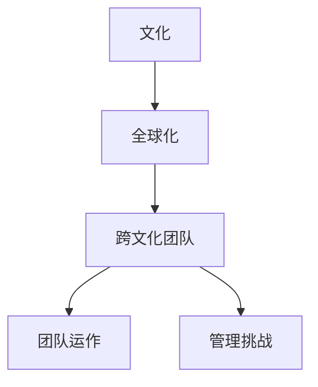

                 

### 引言

在当今全球化飞速发展的背景下，企业和组织越来越倾向于在全球范围内组建多元化团队。这种趋势不仅是为了获取更广阔的市场机会，也是为了充分利用不同地区和文化背景下的专业技能和知识。然而，跨文化团队管理所带来的挑战也随之而来。跨文化团队管理不仅仅是将来自不同国家或地区的员工汇集在一起，而是要确保这个团队在共同目标下高效、和谐地工作。

**全球化背景**：随着全球化的不断深入，国际间的贸易、投资和文化交流日益频繁。企业通过海外扩张、跨国并购、国际合作等方式，组建了越来越多的跨国团队。这些团队中的成员可能来自不同的文化背景，有着不同的价值观、工作习惯和沟通方式。这种文化多样性既为企业带来了丰富的资源和创新机会，也带来了管理上的挑战。

**跨文化团队的重要性**：跨文化团队能够帮助企业更好地理解并适应不同市场的需求，提高产品的适应性和市场竞争力。同时，跨文化团队中的多样性也为团队带来了丰富的思维视角和创意，有助于产生创新的解决方案。然而，如何有效地管理和协调这种多样性，是每个跨文化团队领导者必须面对的难题。

**管理挑战**：跨文化团队管理面临的主要挑战包括：

1. **文化差异**：不同文化背景下的员工可能存在价值观、工作习惯和沟通方式的差异，这可能导致误解和冲突。
2. **沟通障碍**：语言和文化障碍会影响团队的沟通效率，使得信息传递不畅。
3. **领导力挑战**：领导者需要具备跨文化意识和领导能力，以有效激励和引导团队成员。
4. **协作困难**：跨文化团队中的协作可能受到文化差异的影响，导致团队成员间的合作不顺畅。

综上所述，跨文化团队管理是全球化时代企业不可避免的一个课题。通过深入理解和应对这些挑战，领导者可以打造一个高效、和谐的跨文化团队，从而在全球化的竞争中取得优势。

### 核心概念与联系

跨文化团队管理涉及多个核心概念，这些概念不仅相互关联，而且共同构成了理解和管理跨文化团队的基础。以下是对这些核心概念及其相互关系的详细解释。

#### 文化

**定义**：文化是一个社会共同体的成员在其生活过程中创造和传承下来的生活方式、价值观、信仰、习俗和行为的总和。

**特征**：
- **多样性**：不同文化具有独特性，每个文化都有其独特的价值观念和习惯。
- **传承性**：文化通过世代传承，逐渐形成固定的传统和行为模式。
- **适应性**：文化可以随着环境的变化而调整和变化。

**文化维度**：为更好地理解文化差异，Hofstede提出了四个文化维度，分别是：
1. **个体主义与集体主义**：个体主义文化强调个人自主和独立，集体主义文化则强调群体利益和团结。
2. **权力距离**：权力距离大的文化中，权力和资源高度集中，而权力距离小的文化中，权力分配较为平等。
3. **不确定性规避**：不确定性规避程度高的文化倾向于避免不确定性，而低程度的文化则更加包容和适应变化。
4. **男性主义与女性主义**：男性主义文化强调成就、竞争和物质成功，女性主义文化则强调人际关系、合作和关怀。

#### 全球化

**定义**：全球化是指全球范围内的经济、政治、文化和社会关系的相互联系和融合。

**特征**：
- **经济全球化**：全球范围内的贸易和资本流动。
- **文化全球化**：文化产品和信息的全球传播。
- **政治全球化**：国际组织和多边合作增加。
- **社会全球化**：跨国界的社交网络和生活方式的融合。

**全球化的影响**：全球化对企业和团队管理的影响主要体现在：
- **市场机会**：企业可以进入新的市场，利用全球资源。
- **竞争加剧**：企业面临来自全球的竞争压力。
- **文化多样性**：团队成员来自不同的文化背景，增加了管理的复杂性。

#### 跨文化团队

**定义**：跨文化团队是由来自不同文化背景的个体组成的团队。

**特征**：
- **文化多样性**：团队成员具有不同的文化背景、价值观和工作习惯。
- **异质性**：团队内部存在多种不同的观点和思考方式。
- **适应性**：团队需要适应不同的文化环境，以保持高效率。

**跨文化团队的优势**：
- **多元化的思维**：不同的文化背景带来了多样的思维方式和视角，有助于产生创新的解决方案。
- **更全面的知识**：不同文化背景的成员拥有不同的知识和技能，有助于团队更全面地解决问题。
- **全球市场适应性**：团队能够更好地理解和适应不同市场的需求。

**跨文化团队的挑战**：
- **文化冲突**：不同的文化背景可能导致价值观和工作习惯的冲突。
- **沟通障碍**：语言和文化障碍可能影响团队的沟通效率。
- **领导力挑战**：领导者需要具备跨文化意识和领导能力，以有效激励和引导团队成员。

#### 文化、全球化和跨文化团队之间的关系

- **文化是基础**：文化是构成全球化背景和跨文化团队的基础，不同的文化背景决定了团队成员的行为和沟通方式。
- **全球化是驱动因素**：全球化推动了跨国团队的形成，使企业和组织在全球范围内获取资源、市场和人才。
- **跨文化团队是结果**：跨文化团队是全球化背景下企业组织的一种常见形式，它通过整合不同文化背景的个体，实现团队的多元化和高效运作。

### Mermaid 流程图

以下是一个简化的Mermaid流程图，用于展示文化、全球化和跨文化团队之间的关系：

**图解**：
- **A[文化]**：表示跨文化团队管理的基础，即不同的文化背景。
- **B[全球化]**：表示全球化是推动跨国团队形成的重要因素。
- **C[跨文化团队]**：表示全球化背景下形成的团队，需要管理和协调不同文化之间的差异。
- **D[团队运作]**：表示跨文化团队在全球化环境中如何高效运作。
- **E[管理挑战]**：表示跨文化团队管理面临的各种挑战。

通过理解这些核心概念及其相互关系，领导者可以更好地应对跨文化团队管理中的各种挑战，实现团队的多元化和高效运作。

#### 跨文化团队管理理论

跨文化团队管理是一门结合心理学、社会学和组织行为学的综合学科，旨在通过理解和管理文化差异，提升团队的协作效能。以下介绍几种核心理论和框架，以帮助领导者更好地应对跨文化团队管理的挑战。

##### 文化认知理论

**定义**：文化认知理论强调个体对自身和文化差异的认知。根据Triandis的理论，文化认知可以分为个体认知、情景认知和社会认知三个层次。

**应用**：在跨文化团队管理中，领导者需要关注团队成员的文化认知层次，了解他们对文化差异的看法和感受。通过开展文化敏感性和认知培训，可以提升团队成员对文化多样性的理解和接纳。

**案例**：例如，在一个由美国、中国和印度的团队中，领导者可以组织文化认知工作坊，帮助团队成员了解彼此的文化背景，增强对文化差异的敏感性。

##### 文化冲击理论

**定义**：文化冲击理论由Hofsted和Kim提出，认为文化差异会导致心理上的冲击，分为蜜月期、挫折期和适应期三个阶段。

**应用**：跨文化团队领导者可以借助这一理论，预测和管理团队成员在不同文化环境中的心理反应。在蜜月期，领导者应加强团队建设，增进成员之间的信任；在挫折期，领导者应提供情感支持和调整工作环境；在适应期，领导者应鼓励团队成员积极探索和适应新的文化。

**案例**：例如，一位中国公司派驻美国的经理可以通过组织团队活动，帮助新加入的海外员工度过蜜月期，同时通过定期反馈和沟通，帮助他们适应新环境。

##### 社会身份理论

**定义**：社会身份理论由Tajfel和Turner提出，强调个体认同感对行为的影响。个体基于不同的社会身份（如国籍、种族、职业等）形成自我概念。

**应用**：在跨文化团队管理中，领导者需要尊重和承认团队成员的社会身份，避免因身份冲突导致的团队分裂。通过建立共同的团队身份，可以增强团队的凝聚力和归属感。

**案例**：例如，在一个由多个国籍的团队中，领导者可以组织团队建设活动，强调团队的共同目标和价值观，促进团队成员的共同认同。

##### 文化智能理论

**定义**：文化智能（Cultural Intelligence，简称CQ）由Earl Hayes提出，包括四个维度：认知维度、动机维度、技能维度和情感维度。

**应用**：跨文化团队领导者可以通过提升自身的文化智能，更好地理解和管理跨文化团队。具体措施包括：
- **认知维度**：增强对文化差异的理解和认知。
- **动机维度**：培养开放和包容的心态，愿意接受和尊重不同文化。
- **技能维度**：掌握跨文化沟通和协作的技巧。
- **情感维度**：理解和应对文化差异带来的情感挑战。

**案例**：例如，一位跨国公司的CEO可以通过参加文化智能培训，提升其跨文化领导能力，从而更有效地管理多元化的团队。

##### 整合性框架

**定义**：整合性框架是一种结合多种理论的跨文化团队管理模型，旨在提供全面的指导。

**应用**：整合性框架可以帮助领导者从多个角度理解和管理跨文化团队，包括文化认知、文化冲击、社会身份和文化智能等方面。

**案例**：例如，在一个跨国团队的领导培训中，可以结合文化认知理论进行文化敏感性培训，运用文化冲击理论设计跨文化适应策略，利用社会身份理论促进团队建设，以及运用文化智能理论提升领导者的跨文化领导能力。

通过理解并应用这些理论和框架，领导者可以更好地应对跨文化团队管理中的各种挑战，实现团队的多元化和高效运作。

#### 跨文化团队管理方法

为了在全球化背景下有效管理跨文化团队，领导者需要采用一系列具体的方法和策略。以下将详细介绍几种关键的管理方法，包括文化培训、明确目标和角色分工、增强团队凝聚力以及处理冲突的技巧。

##### 文化培训

**定义**：文化培训是一种系统性的教育过程，旨在提升团队成员对文化差异的理解和敏感性。

**步骤**：
1. **评估团队成员的文化背景**：通过问卷调查、访谈等方式，了解团队成员的文化背景、价值观和沟通风格。
2. **设计培训课程**：根据评估结果，设计符合团队实际需求的文化培训课程，包括文化基础知识、沟通技巧、跨文化冲突管理等内容。
3. **实施培训**：邀请专业的文化培训师，通过讲座、角色扮演、案例分析等方式，让团队成员参与其中，提升文化认知。
4. **持续跟进**：培训结束后，定期进行评估和反馈，确保团队成员的文化认知水平持续提升。

**案例**：某跨国公司在其全球团队中实施文化培训项目，通过一系列文化敏感性和沟通技巧的培训，显著提升了团队成员之间的理解和协作能力，减少了跨文化冲突。

##### 明确目标和角色分工

**定义**：明确目标和角色分工是指通过清晰定义团队目标和个人角色，确保团队成员明确自己的职责和任务。

**步骤**：
1. **设定明确的目标**：确保所有团队成员对团队目标有共同的理解，并将目标具体化、量化。
2. **定义角色分工**：明确每个成员的职责和任务，确保团队成员清楚自己的角色和责任。
3. **沟通与确认**：通过会议、邮件等方式，与团队成员沟通并确认各自的目标和角色分工。
4. **持续监督与调整**：定期监督团队成员的工作进度，根据实际情况进行必要的调整。

**案例**：一个由中美韩三国成员组成的软件开发团队，在项目启动阶段，通过明确的目标和角色分工，确保了团队成员对项目目标的共同理解和高效合作。

##### 增强团队凝聚力

**定义**：增强团队凝聚力是指通过多种方式，提升团队成员之间的信任和协作，形成紧密的团队关系。

**方法**：
1. **团队建设活动**：定期组织团队建设活动，如团队拓展训练、户外旅行等，增强团队成员之间的互动和信任。
2. **共同目标**：通过设定共同的目标和任务，让团队成员共同面对挑战，增强团队凝聚力。
3. **积极反馈**：及时给予团队成员正面的反馈和鼓励，增强他们的工作动力和归属感。
4. **建立沟通渠道**：确保团队成员之间有畅通的沟通渠道，便于分享想法和反馈。

**案例**：某国际咨询公司的全球团队通过定期组织团队建设活动和跨区域会议，有效提升了团队成员之间的协作和信任，增强了团队的整体凝聚力。

##### 处理冲突的技巧

**定义**：处理冲突的技巧是指通过有效的方法，解决团队成员之间的文化差异和意见分歧。

**方法**：
1. **积极沟通**：鼓励团队成员在面对冲突时，积极沟通、坦诚表达，寻求共同点。
2. **倾听与理解**：在冲突处理过程中，领导者应耐心倾听各方意见，试图理解对方的立场和情感。
3. **寻找共识**：通过寻找共识和共同利益，缓解冲突，促进合作。
4. **提供支持**：在冲突解决后，为受影响成员提供心理支持，确保他们感受到团队的支持和关怀。

**案例**：在一个由多个国家成员组成的研发团队中，当出现文化冲突时，团队领导者通过积极沟通和寻求共识，成功解决了团队成员之间的分歧，恢复了团队的和谐与高效运作。

通过采用这些跨文化团队管理方法，领导者可以有效地提升团队的整体绩效，实现跨文化团队的多元化和高效运作。

#### 案例分析

为了深入理解跨文化团队管理在实践中的应用，我们将通过两个实际案例，分析其在成功和失败中的经验与教训。

##### 案例一：成功的跨文化团队管理案例

**背景**：某国际知名科技公司决定在全球范围内组建一个研发团队，成员分别来自中国、美国和印度。该团队的任务是开发一款面向全球市场的智能移动应用。

**管理策略**：
1. **文化培训**：团队在成立初期，组织了为期两周的文化培训，内容包括跨文化沟通技巧、文化认知和冲突管理。团队成员通过培训，对彼此的文化背景有了更深的理解。
2. **明确目标和角色分工**：在项目启动前，团队领导者与成员进行了详细的目标和角色分工讨论，确保每个人都知道自己的职责和任务，并明确团队的整体目标。
3. **增强团队凝聚力**：团队定期组织团队建设活动，如团队拓展训练、跨区域会议和庆祝活动，增强了团队成员之间的信任和协作。
4. **积极沟通与冲突解决**：团队建立了畅通的沟通渠道，鼓励成员在面对冲突时积极沟通。领导者通过倾听和理解，帮助团队成员找到共识，有效解决了多次文化冲突。

**结果**：该团队在项目过程中表现出色，成功完成了多个重要里程碑，并在市场上取得了良好的反响。团队成员之间的合作越来越顺畅，团队的凝聚力和工作效率显著提升。

**经验与教训**：
- **文化培训**：通过文化培训，团队成员对彼此的文化背景有了更深的理解，减少了文化冲突。
- **明确目标和角色分工**：明确的目标和角色分工有助于团队成员更好地协作，避免职责重叠和误解。
- **增强团队凝聚力**：定期组织团队建设活动和跨区域会议，有助于增强团队成员之间的信任和合作。
- **积极沟通与冲突解决**：通过积极沟通和冲突解决技巧，及时解决文化差异带来的冲突，确保团队的和谐与高效运作。

##### 案例二：失败的跨文化团队管理案例

**背景**：某跨国银行在印度设立了一个软件开发中心，旨在为其全球业务提供技术支持。然而，该中心在组建和管理过程中遇到了诸多挑战。

**管理策略**：
1. **缺乏文化培训**：团队成员在加入中心后，没有接受过任何关于文化差异和沟通技巧的培训，导致文化冲突和误解频繁发生。
2. **模糊的目标和角色分工**：团队成员对项目目标和自己的职责缺乏清晰的理解，导致工作效率低下和任务重复。
3. **缺乏有效的沟通渠道**：团队成员之间的沟通不畅，许多问题和冲突未能及时解决，积累成更大的问题。
4. **忽视冲突解决**：领导者忽视了团队中的文化冲突，认为这些冲突是不可避免的，未能采取有效措施解决。

**结果**：该软件开发中心在项目过程中频繁出现问题，导致项目延期、成本超支，并影响了全球业务的技术支持。最终，该中心被迫关闭。

**经验与教训**：
- **文化培训**：缺乏文化培训导致团队成员对彼此的文化背景不了解，增加了文化冲突的风险。
- **明确目标和角色分工**：模糊的目标和角色分工导致团队成员缺乏方向感和动力，影响工作效率。
- **建立有效的沟通渠道**：畅通的沟通渠道是解决冲突和提升团队协作的重要保障。
- **重视冲突解决**：忽视文化冲突将导致问题积累，影响团队的整体运作和绩效。

通过这两个案例，我们可以看到，有效的跨文化团队管理能够显著提升团队的绩效和合作效率，而管理不善则可能导致项目失败和团队解散。这些经验与教训对于其他跨文化团队具有重要的参考价值。

#### 领导技能提升

在跨文化团队管理中，领导者的技能至关重要。以下是一些提升领导技能的建议和技巧，帮助领导者更好地应对跨文化团队中的各种挑战。

##### 提高文化认知

1. **自我反思**：领导者应首先了解自己的文化背景和价值观，反思这些因素如何影响其领导风格和决策。通过自我反思，领导者可以更好地识别自己的文化偏见，从而提升对多元文化的理解。
2. **文化学习**：领导者应主动学习不同文化的基本知识，包括价值观、沟通习惯和礼仪等。这可以通过参加文化培训课程、阅读相关书籍或参与国际交流活动来实现。
3. **多角度思考**：领导者应培养从多个文化角度看待问题的能力，尝试理解不同文化背景下的员工如何看待问题、如何处理冲突和如何协作。

##### 增强沟通技巧

1. **倾听与理解**：在跨文化团队中，领导者应积极倾听员工的意见和反馈，尝试理解他们的文化背景和情感需求。通过倾听和理解，领导者可以建立信任和尊重，减少误解和冲突。
2. **清晰表达**：领导者应确保自己的表达清晰、简洁，避免使用模糊或含糊的语言。对于复杂的信息，可以使用具体的例子或图表进行解释，确保团队成员理解。
3. **多渠道沟通**：领导者应利用多种沟通渠道，如会议、邮件、即时通讯和视频会议等，确保信息能够及时、准确地传递到每个团队成员。

##### 提升协作能力

1. **建立共同目标**：领导者应确保团队成员对团队目标有共同的理解，并围绕这些目标进行协作。通过设定具体、可衡量的目标，领导者可以提升团队的整体协作效率。
2. **促进知识共享**：领导者应鼓励团队成员分享知识和经验，建立知识共享的文化。通过知识共享，团队成员可以相互学习和借鉴，提升整个团队的技能水平。
3. **信任建设**：领导者应致力于建立信任文化，通过公平、透明和一致的管理行为，赢得团队成员的信任。信任是团队协作的基础，有助于提升团队的凝聚力和工作效率。

##### 应对文化冲突

1. **冲突预防**：领导者应提前识别可能的文化冲突点，并采取预防措施。这可以通过文化培训、明确角色分工和设定沟通渠道来实现。
2. **冲突解决**：当冲突发生时，领导者应积极介入，采用建设性的冲突解决策略，如寻找共识、提供情感支持和调解。通过有效的冲突解决，领导者可以避免冲突升级，维护团队的和谐。
3. **文化敏感**：领导者应具备文化敏感性，尊重不同文化背景下的员工，避免做出可能引起冲突的言论和行为。

##### 持续学习与改进

1. **反思与评估**：领导者应定期反思和评估自己的领导行为和团队绩效，识别改进的机会。通过反思和评估，领导者可以不断提升自己的领导能力。
2. **寻求反馈**：领导者应主动寻求团队成员的反馈，了解他们在跨文化团队中的感受和需求。通过反馈，领导者可以更好地理解团队成员的期望，并调整自己的领导风格。
3. **持续学习**：领导者应保持学习的心态，不断学习新的管理理论和实践，提升自己的知识水平和领导能力。通过持续学习，领导者可以适应不断变化的管理环境和挑战。

通过以上建议和技巧，领导者可以提升自己在跨文化团队管理中的能力，更好地应对文化差异和团队挑战，实现团队的高效运作和卓越绩效。

#### 跨文化沟通技巧

在跨文化团队中，有效的沟通是确保团队协作和项目成功的基石。以下是一些关键的跨文化沟通技巧，帮助团队成员在不同文化背景下建立理解和信任。

##### 理解文化差异

1. **价值观的差异**：不同文化对工作、生活和沟通的价值观有不同的理解。例如，西方文化中强调个人主义，注重独立和自主；而东方文化则强调集体主义，注重团队合作和和谐。领导者需要了解团队成员的价值观，避免因价值观差异导致的误解和冲突。
2. **沟通风格差异**：不同文化背景下的沟通风格也有所不同。例如，高语境文化（如日本、中国）倾向于通过语境和暗示进行沟通，而低语境文化（如美国、德国）则更直接和明确。领导者需要识别并适应这些沟通风格，确保信息的准确传达。
3. **非言语沟通**：不同文化对非言语沟通（如肢体语言、面部表情、语调）的理解也有差异。例如，一些文化中点头表示同意，而在另一些文化中，点头可能表示怀疑。领导者应了解这些差异，避免因非言语沟通误解导致的问题。

##### 建立信任

1. **积极倾听**：在跨文化沟通中，积极倾听是建立信任的重要手段。领导者应耐心倾听员工的意见和反馈，尊重他们的观点和情感。通过倾听，领导者可以展示对员工的尊重和理解，增强信任。
2. **透明沟通**：领导者应保持透明沟通，确保团队成员了解项目的进展、目标和挑战。通过透明的沟通，团队成员可以更好地理解彼此的角色和责任，增强团队凝聚力。
3. **文化敏感**：领导者应具备文化敏感性，尊重不同文化背景下的沟通习惯和礼仪。避免因文化差异导致的冒犯或不理解。

##### 有效的沟通策略

1. **明确表达**：在跨文化沟通中，领导者应确保自己的表达清晰、简洁，避免使用模糊或含糊的语言。对于复杂的信息，可以使用具体的例子或图表进行解释，确保团队成员理解。
2. **使用多种沟通渠道**：领导者应利用多种沟通渠道，如会议、邮件、即时通讯和视频会议等，确保信息能够及时、准确地传递到每个团队成员。通过多种渠道的沟通，可以确保信息的全面覆盖和有效传达。
3. **反馈与确认**：在沟通过程中，领导者应鼓励团队成员进行反馈和确认。通过反馈和确认，可以确保信息的准确性和一致性，避免误解和错误。

##### 处理误解与冲突

1. **及时解决**：当误解和冲突发生时，领导者应尽快介入，采取建设性的冲突解决策略。通过积极沟通和寻找共识，领导者可以缓解冲突，维护团队的和谐。
2. **文化调适**：在处理误解和冲突时，领导者应考虑文化因素，尊重不同文化背景下的处理方式和期望。通过文化调适，领导者可以更好地解决跨文化冲突，提升团队的整体效能。

通过理解文化差异、建立信任、采用有效的沟通策略和及时处理误解与冲突，跨文化团队可以建立有效的沟通机制，确保项目的顺利推进和团队的长期合作。

#### 全球团队合作

在全球化的背景下，跨文化团队在高效协作中面临诸多挑战。以下将讨论如何在全球环境中实现跨文化团队合作，并提供一系列实用的技巧和策略。

##### 时间管理

1. **灵活安排会议时间**：由于团队成员可能分布在不同的时区，领导者应尽量安排在多个时区都能接受的会议时间。例如，可以采用“轮班制”或“凌晨会议”，确保每个成员都有参与的机会。
2. **优先级排序**：在制定工作计划时，领导者应明确任务的重要性和紧急程度，优先处理关键任务。通过合理的优先级排序，可以确保团队在有限的时间内高效完成任务。
3. **利用工具**：利用时间管理工具，如Trello、Asana或Slack，可以帮助团队跟踪任务进度，确保每个成员都能了解当前的工作状态。

##### 沟通技巧

1. **明确沟通目标**：每次沟通前，领导者应明确沟通的目标和预期结果。通过设定明确的沟通目标，可以避免沟通中的模糊和误解。
2. **多渠道沟通**：利用多种沟通渠道，如邮件、即时通讯、视频会议和电话，确保信息的及时、准确传达。通过多渠道沟通，可以确保每个成员都能方便地参与和交流。
3. **积极反馈**：鼓励团队成员提供积极的反馈，及时解决问题和误解。通过积极的反馈机制，可以提高沟通效率，增强团队的协作能力。

##### 知识共享

1. **建立知识库**：建立一个集中的知识库，用于存储项目文档、最佳实践和重要信息。通过知识库，团队成员可以随时查阅和更新信息，确保信息的共享和更新。
2. **定期分享会**：定期组织分享会，让团队成员分享各自的经验和知识。通过分享会，可以促进知识的流动和传播，提升团队的整体技能水平。
3. **跨区域交流**：鼓励团队成员跨区域交流，通过现场访问、远程视频会议等方式，促进团队成员之间的交流和合作。通过跨区域交流，可以增进团队成员之间的了解，提高协作效率。

##### 文化敏感性

1. **文化培训**：定期组织文化培训，帮助团队成员了解不同文化背景的价值观、沟通习惯和礼仪。通过文化培训，可以减少文化冲突，提高团队的协作效率。
2. **尊重差异**：领导者应尊重团队成员的文化差异，避免因文化偏见导致的误解和冲突。通过尊重差异，可以营造一个包容和友好的工作环境。
3. **文化调适**：在处理团队问题时，领导者应考虑文化因素，采取适应不同文化的解决方案。通过文化调适，可以确保团队在全球环境中顺利运作。

##### 团队建设

1. **团队活动**：定期组织团队建设活动，如团队拓展训练、文化体验活动等，增强团队成员之间的信任和合作。通过团队活动，可以增进团队成员之间的了解和友谊。
2. **共同目标**：确保团队成员对共同目标有清晰的理解和认同。通过共同目标，可以激发团队成员的积极性和合作意愿。
3. **激励与反馈**：领导者应给予团队成员及时的激励和反馈，肯定他们的工作成果和努力。通过激励与反馈，可以提升团队成员的士气和凝聚力。

通过合理的时间管理、有效的沟通技巧、知识共享、文化敏感性和团队建设，跨文化团队可以在全球环境中实现高效协作，克服各种挑战，实现项目的成功。

#### 未来趋势

随着全球化的不断深化，跨文化团队管理将面临新的趋势和挑战。以下是对未来几年跨文化团队管理发展趋势的预测和展望。

##### 技术驱动的管理工具

1. **人工智能与数据分析**：未来，人工智能和数据分析将更多地应用于跨文化团队管理中。通过分析团队成员的互动数据，领导者可以更准确地了解团队的协作模式和文化偏好，从而制定更有效的管理策略。
2. **虚拟现实与增强现实**：虚拟现实（VR）和增强现实（AR）技术将被用于文化培训和团队建设活动。通过虚拟体验，团队成员可以更直观地了解和体验不同文化，增强文化认知和敏感度。

##### 新型工作模式

1. **远程工作常态化**：随着远程工作技术的进步，跨文化团队的成员将更加分散，但协作效率有望提升。通过使用协作工具和虚拟办公室，团队成员可以随时随地保持高效的沟通和合作。
2. **灵活工作制度**：为了适应全球化的需求，企业将推出更灵活的工作制度，如弹性工作时间、远程办公和轮岗制度。这些制度有助于吸引和保留多元化的全球人才。

##### 文化融合与创新

1. **多元文化领导力**：未来，领导者的文化认知和能力将越来越重要。多元化背景的领导者将能够更好地理解和融合不同文化的优势，推动团队创新和协作。
2. **文化创新机制**：企业将建立文化创新机制，鼓励团队成员分享和融合不同文化的观点和想法。通过文化创新，企业可以开发出更具适应性和竞争力的产品和服务。

##### 持续教育与培训

1. **个性化学习**：未来的文化培训将更加个性化，根据团队成员的不同需求和背景，提供定制化的培训课程。通过个性化学习，团队成员可以更高效地提升文化认知和沟通技巧。
2. **终身学习**：随着跨文化团队管理的复杂性增加，团队成员和领导者需要具备持续学习和适应的能力。终身学习将成为团队成员职业发展的重要部分。

##### 社会责任与可持续发展

1. **文化多样性作为社会责任**：企业将认识到文化多样性不仅是管理挑战，更是社会责任。通过促进文化多样性和包容性，企业可以提升品牌形象和社会责任感。
2. **可持续发展与跨文化团队**：企业将更加注重跨文化团队在可持续发展中的作用。通过跨文化团队合作，企业可以更好地理解和满足不同市场需求，推动全球可持续发展。

总之，未来几年跨文化团队管理将面临诸多新的机遇和挑战。通过利用技术驱动的管理工具、探索新型工作模式、促进文化融合与创新、持续教育与培训，以及承担社会责任，企业可以更好地应对全球化带来的挑战，实现跨文化团队的高效运作和卓越绩效。

#### 附录

为了帮助读者更深入地理解跨文化团队管理的相关概念和实践，以下列出了一些重要的资源、工具和进一步阅读的建议。

##### 资源与工具

1. **书籍**：
   - 《跨文化管理》（Hofstede, G., Hofstede, G.J., & Minkov, M.）
   - 《全球化时代的领导力》（Deresky, H.）
   - 《文化冲突与沟通》（Ting-Toomey, S.）

2. **在线课程**：
   - Coursera上的《跨文化沟通》
   - Udemy上的《跨文化团队管理：技能与实践》
   - LinkedIn Learning上的《跨文化沟通技巧》

3. **网站和平台**：
   - Cultural Awareness Training（文化意识培训）
   - Intercultural Communication Institute（跨文化沟通研究所）
   - Global Leadership Network（全球领导力网络）

##### 拓展阅读

1. **学术论文**：
   - “Cultural Intelligence: Theory, Measurement, and Impact on International Assignments”（文化智能：理论、测量和对外派任务的影响）
   - “Managing Cultural Diversity in Global Teams”（管理全球团队中的文化多样性）

2. **研究报告**：
   - “Global Workforce Trends 2021”（2021年全球劳动力趋势）
   - “The Future of Work: Trends and Challenges”（工作未来：趋势和挑战）

通过利用这些资源和工具，读者可以进一步深入学习和实践跨文化团队管理，提升自身的管理能力和团队协作效率。

### 总结与展望

跨文化团队管理是全球化时代企业面临的重大挑战之一。本文从多个角度探讨了跨文化团队管理的核心概念、管理方法、成功案例、领导技能提升以及未来的趋势。通过详细的分析和实际案例的讲解，我们强调了文化认知、沟通技巧、团队建设和冲突处理在跨文化团队管理中的重要性。

**关键要点**：

1. **文化认知**：领导者需要了解团队成员的文化背景和价值观，以减少误解和冲突。
2. **沟通技巧**：有效的沟通是跨文化团队协作的基石，领导者应采用多种沟通渠道，确保信息的清晰和准确。
3. **团队建设**：通过团队建设和明确的目标，增强团队成员之间的信任和凝聚力。
4. **冲突处理**：领导者应积极应对和解决文化冲突，以维护团队的和谐与高效运作。

**未来方向**：

随着全球化的不断深化，跨文化团队管理将面临新的机遇和挑战。利用技术驱动的管理工具、探索新型工作模式、促进文化融合与创新以及持续教育与培训，将是未来跨文化团队管理的重要方向。

**作者信息**：

作者：AI天才研究院/AI Genius Institute & 禅与计算机程序设计艺术 /Zen And The Art of Computer Programming。本文旨在为读者提供全面、深入的跨文化团队管理指南，帮助领导者在全球化的环境中实现团队的高效运作和卓越绩效。

### 结语

跨文化团队管理不仅是企业管理者需要掌握的重要技能，也是全球化时代企业可持续发展的关键。通过本文的探讨，我们希望读者能够更好地理解跨文化团队管理的核心概念和实践方法，从而在实际工作中提升团队绩效。让我们携手面对全球化的挑战，共创美好的未来！

