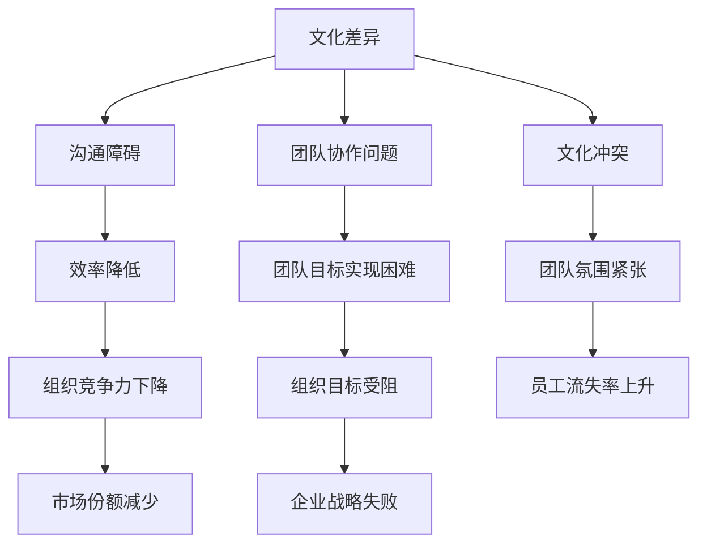
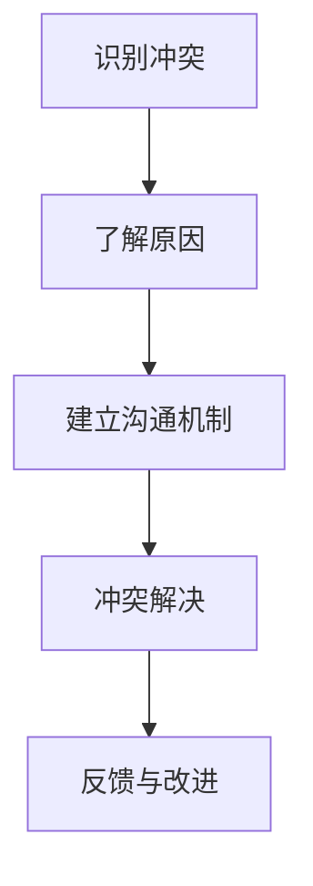

                 

### 了解书名主题

《跨文化团队管理：全球化时代的领导挑战》这本书的主题围绕跨文化团队管理，尤其是在全球化背景下领导所面临的挑战。这一主题的重要性不言而喻，因为随着全球化进程的加速，企业越来越依赖跨国团队来推动业务发展，而如何有效地管理这些团队成为领导者必须面对的重要课题。

**书名解析：**

- **“跨文化团队管理”：** 这一部分揭示了书的焦点在于如何管理由不同文化背景成员组成的团队。这种管理不仅涉及到沟通和协作，还包括如何处理文化差异、提升团队效率和实现共同目标。

- **“全球化时代的领导挑战”：** 这一部分强调了在全球化的背景下，领导者在管理跨文化团队时面临的独特挑战。全球化带来了更多的多样性，但同时也增加了管理的复杂性。

**背景介绍：**

全球化使得跨国企业越来越普遍，团队成员来自不同的国家、拥有不同的文化背景。这为团队带来了多样性的优势，但也带来了文化冲突、沟通障碍和管理难题。领导者在这样的环境中需要具备更高的文化敏感性和管理技能，以便更好地协调团队成员，推动团队目标的实现。

**核心内容和主题思想：**

本书的核心内容将涵盖跨文化团队管理的理论基础、实践策略、以及在全球背景下领导者所面临的特定挑战。通过系统的研究和案例分享，书将探讨如何：

- 理解文化差异及其对团队沟通和协作的影响。
- 制定有效的跨文化团队沟通策略。
- 提升跨文化团队协作的有效方法。
- 发展跨文化领导力，包括角色、责任和自我成长。
- 应对文化冲突与跨文化团队冲突管理。
- 实现跨文化团队决策与执行的优化。
- 通过实践和案例分析，总结跨文化团队管理中的最佳实践和未来趋势。

总之，本书旨在为领导者提供一套系统而实用的跨文化团队管理方法论，帮助他们应对全球化时代的领导挑战，从而提高团队绩效和企业竞争力。

### 第一部分：跨文化团队管理基础

#### 1.1 跨文化管理的定义与背景

跨文化管理是指在一个多元文化环境中，通过理解、尊重和整合不同文化背景的团队成员，以提高团队绩效和组织目标实现的过程。随着全球化进程的加速，跨国企业越来越依赖跨文化团队来推动业务发展。因此，跨文化管理的重要性日益凸显。

**背景介绍：**

全球化带来了文化的多样性和国际交流的增多，这为跨文化管理提供了土壤。然而，文化差异也可能导致误解、冲突和效率低下。因此，领导者需要具备跨文化管理的能力，以便更好地协调和激励团队成员。

**核心概念与联系：**

为了更好地理解跨文化管理的概念，我们可以通过一个Mermaid流程图来展示其核心概念及其相互关系：

**核心概念：**

- **文化差异：** 不同文化背景下人们的行为模式、价值观和沟通方式的差异。
- **沟通障碍：** 由于文化差异导致的交流不畅和信息误解。
- **团队协作问题：** 文化差异可能影响团队成员之间的协作效果。
- **文化冲突：** 文化差异引发的冲突，可能导致团队分裂和效率低下。

**联系架构：**

文化差异是跨文化管理的起点，它直接影响沟通障碍、团队协作问题和文化冲突。这些因素又进一步影响团队效率和目标实现，最终影响组织的整体竞争力。

#### 1.2 全球化背景下的跨文化团队管理

全球化使得企业跨越国界，在多元文化环境中运作。跨文化团队管理在这种背景下变得尤为重要。

**全球化对跨文化团队管理的影响：**

1. **文化多样性增加：** 企业雇佣来自不同国家的员工，这带来了文化的多样性和丰富的资源，但也增加了管理的复杂性。
2. **跨文化团队沟通需求增加：** 在全球化背景下，团队成员之间的沟通需求更为迫切，因为有效沟通是团队协作和目标实现的关键。
3. **文化冲突频率增加：** 多元文化背景下，文化冲突更为普遍，需要领导者具备更强的文化敏感性和冲突管理能力。

**跨文化团队管理面临的挑战：**

1. **沟通障碍：** 不同文化背景下的语言、行为和沟通方式的差异可能导致沟通不畅。
2. **文化差异：** 文化差异可能导致价值观和期望的不同，影响团队协作和目标实现。
3. **文化冲突：** 文化差异引发的冲突可能破坏团队氛围，影响工作效率。
4. **领导者文化敏感度不足：** 许多领导者可能缺乏跨文化管理的知识和经验，导致管理不当。

**解决策略：**

1. **文化意识培训：** 提高领导者和团队成员的文化意识，增强对文化差异的理解和尊重。
2. **有效沟通策略：** 采用多元化的沟通方式，确保信息传递的准确性和有效性。
3. **建立共同价值观：** 通过共同目标和价值观的建立，增强团队的凝聚力。
4. **冲突管理机制：** 建立有效的冲突管理机制，及时解决文化冲突，维护团队和谐。

#### 1.3 跨文化团队管理的挑战与机遇

跨文化团队管理既面临挑战，也蕴含机遇。

**挑战：**

1. **文化差异导致的误解：** 文化差异可能导致团队成员之间的误解，影响团队协作。
2. **沟通障碍：** 语言和文化差异导致沟通不畅，可能影响团队决策和执行。
3. **文化冲突：** 文化冲突可能导致团队氛围紧张，影响工作效率和团队凝聚力。

**机遇：**

1. **文化多样性带来的创新：** 多元文化背景的团队可能带来不同的视角和思维方式，促进创新和问题解决。
2. **全球化带来的市场机会：** 跨文化团队管理有助于企业更好地适应全球市场，开拓新的业务机会。
3. **领导力提升：** 跨文化团队管理要求领导者具备更高的文化敏感性和管理能力，这有助于提升领导力水平。

**总结：**

跨文化团队管理在全球化背景下具有重要意义。领导者需要通过理解文化差异、建立有效的沟通策略和冲突管理机制，应对跨文化团队管理的挑战，并抓住其中的机遇，以提升团队绩效和企业竞争力。

---

**附录：Mermaid流程图**

通过这个流程图，我们可以更直观地看到文化差异如何通过多个环节影响团队和组织绩效。

---

在接下来的章节中，我们将深入探讨跨文化团队沟通与协作的具体策略，以及如何提升跨文化团队领导力。这些内容将为读者提供更加具体和实用的管理工具，帮助他们在全球化时代更好地应对跨文化团队管理的挑战。

### 2. 跨文化团队沟通与协作

跨文化团队沟通与协作是跨文化团队管理的重要组成部分。有效的沟通和协作不仅能够减少文化差异带来的误解和冲突，还能提高团队的整体效率和目标实现能力。

#### 2.1 文化差异对团队沟通的影响

文化差异在团队沟通中扮演着双重角色：一方面，它可能导致沟通障碍；另一方面，它也可能成为创新的源泉。

**文化差异对沟通障碍的影响：**

1. **语言障碍：** 语言是沟通的基础，不同文化背景的团队成员可能使用不同的语言或方言，这可能导致语言理解的障碍。
2. **非语言沟通：** 面部表情、肢体语言和语调等非语言因素在不同文化中可能有不同的含义，可能导致误解。
3. **沟通风格差异：** 不同文化背景的团队成员可能有不同的沟通风格，如直接与间接沟通、高语境与低语境沟通等，这些差异可能导致沟通不畅。

**文化差异作为创新源泉：**

1. **多元视角：** 多元文化背景的团队成员能够提供不同的视角和思维方式，这有助于团队在面对复杂问题时找到创新的解决方案。
2. **文化融合：** 通过文化差异的融合，团队可以创造出新的文化元素，这些元素可能成为企业创新和发展的动力。

**解决策略：**

1. **语言培训：** 提供语言培训，帮助团队成员提高语言沟通能力，减少语言障碍。
2. **跨文化沟通技巧：** 培训跨文化沟通技巧，如有效倾听、非语言沟通的理解和使用，以提高沟通效果。
3. **文化融合活动：** 通过举办文化融合活动，促进团队成员之间的相互理解和尊重，增强团队的凝聚力。

#### 2.2 跨文化团队沟通策略

为了在跨文化团队中实现有效沟通，领导者需要采用一系列策略来应对文化差异和沟通障碍。

**1. 建立共同语言：**

- **共同语言的重要性：** 共同语言是团队沟通的基础，有助于减少误解和冲突。
- **策略：** 在团队中建立一种或多种共同语言（如英语），并通过语言培训提高团队成员的语言能力。

**2. 确保沟通透明性：**

- **透明性在沟通中的作用：** 透明性有助于确保信息传递的准确性和一致性，减少信息失真。
- **策略：** 通过定期的团队会议、电子邮件更新和实时通讯工具，保持沟通渠道的开放和透明。

**3. 采用多元化的沟通方式：**

- **多元化沟通的优势：** 多元化的沟通方式（如口头、书面、视觉和虚拟沟通）能够满足不同团队成员的沟通需求。
- **策略：** 根据不同情境和团队成员的特点，灵活运用多种沟通方式，以提高沟通效果。

**4. 建立文化理解：**

- **文化理解的重要性：** 文化理解有助于团队成员更好地理解和尊重彼此的文化背景。
- **策略：** 通过文化培训和文化交流活动，提高团队成员的文化敏感度和跨文化沟通能力。

**5. 鼓励反馈和反思：**

- **反馈和反思的作用：** 鼓励团队成员提供反馈和进行反思，有助于发现和解决沟通中的问题。
- **策略：** 建立反馈机制，如定期的团队反馈会议和个人反思日记，以促进持续改进。

#### 2.3 提升跨文化团队协作的有效方法

跨文化团队协作的有效性不仅取决于沟通，还取决于团队成员之间的协作和团队整体的工作氛围。

**1. 明确团队目标和角色：**

- **目标明确的重要性：** 明确的团队目标有助于团队成员团结一致，提高协作效率。
- **策略：** 通过制定清晰的团队目标和明确每个成员的角色和职责，确保团队成员朝着共同目标努力。

**2. 促进团队合作：**

- **团队合作的重要性：** 团队合作能够激发团队的创造力和解决问题的能力。
- **策略：** 通过团队建设活动和协作工具（如项目管理软件），促进团队成员之间的合作和协作。

**3. 建立信任和尊重：**

- **信任和尊重的作用：** 信任和尊重是团队协作的基础，有助于提高团队成员的满意度和绩效。
- **策略：** 通过建立开放和透明的沟通环境、表彰团队合作和个人贡献，以及解决冲突，建立和维护团队成员之间的信任和尊重。

**4. 提供资源和支持：**

- **资源支持的重要性：** 足够的资源和支持有助于团队更好地完成任务。
- **策略：** 提供必要的资源和支持，如技术工具、培训和学习机会，确保团队成员能够有效地协作。

**5. 激励和认可：**

- **激励和认可的作用：** 激励和认可是提升团队协作积极性的重要手段。
- **策略：** 通过设立奖励机制、公开表彰和个人发展机会，激励团队成员积极参与团队合作。

通过上述策略，领导者可以提升跨文化团队的沟通和协作效果，从而提高团队的整体绩效和目标实现能力。

---

在下一章节，我们将进一步探讨跨文化团队领导力的发展，包括领导者的角色与责任，以及如何培养和提升跨文化领导力。这将帮助读者深入了解如何在全球化的背景下，更有效地管理跨文化团队。

### 3. 跨文化团队领导力

跨文化团队领导力是全球化时代领导者必备的核心素质。跨文化领导力的关键在于领导者能够理解不同文化背景下的团队成员，并采取合适的策略来激励和引导团队。以下是关于跨文化团队领导力的详细讨论。

#### 3.1 领导力的跨文化维度

领导力是一个多维度的概念，不同的文化背景对领导力的理解和实践有着深远的影响。

**1. 领导风格：**

- **文化中心性：** 不同的文化对领导风格有不同的偏好。例如，集体主义文化倾向于权威型领导，而个体主义文化则偏好参与型和民主型领导。
- **策略：** 领导者需要根据团队文化背景调整领导风格，确保领导行为与团队成员的文化期望相匹配。

**2. 领导者角色：**

- **文化角色期望：** 在不同的文化中，领导者被期望扮演不同的角色。例如，在一些文化中，领导者被视为决策者和权威；而在另一些文化中，领导者被期望作为指导者和协调者。
- **策略：** 领导者需要识别和理解团队成员对领导角色的期望，并调整自己的行为以满足这些期望。

**3. 领导者技能：**

- **文化技能差异：** 不同文化背景的领导者可能拥有不同的技能和优势。例如，一些文化背景的领导者可能擅长人际关系管理，而另一些可能擅长战略规划。
- **策略：** 领导者需要识别并发展自己的文化技能，以便更有效地管理跨文化团队。

#### 3.2 跨文化领导者的角色与责任

跨文化领导者承担着多重角色和责任，这些角色和责任在全球化的背景下尤为重要。

**1. 文化桥梁：**

- **角色描述：** 跨文化领导者作为文化桥梁，帮助团队成员跨越文化障碍，促进理解和合作。
- **责任：** 通过文化培训、沟通活动和跨文化沟通策略，领导者应努力减少文化误解和冲突。

**2. 需求满足者：**

- **角色描述：** 跨文化领导者需要识别和满足团队成员的多元需求，包括职业发展、文化适应和个人需求。
- **责任：** 领导者应通过个性化的职业发展计划和文化适应支持，确保团队成员在新的文化环境中感到舒适和有价值。

**3. 冲突管理者：**

- **角色描述：** 跨文化领导者需要具备处理文化冲突的能力，确保团队内部的和谐和高效。
- **责任：** 通过建立有效的冲突解决机制和提供冲突管理培训，领导者应帮助团队成员学会以建设性的方式处理冲突。

**4. 团队绩效推动者：**

- **角色描述：** 跨文化领导者应推动团队达成共同目标，提高整体绩效。
- **责任：** 通过制定清晰的团队目标、提供资源和支持、激励团队成员，领导者应确保团队朝着共同目标努力。

#### 3.3 跨文化领导力的培养与实践

培养跨文化领导力是一个持续的过程，需要领导者不断学习和实践。

**1. 文化意识培养：**

- **方法：** 通过参加跨文化培训课程、阅读文化相关的书籍和资料，以及实际的文化体验，领导者可以增强自己的文化意识。
- **实践：** 定期举办文化分享会，让团队成员分享自己的文化背景和经历，促进相互理解和尊重。

**2. 沟通技巧提升：**

- **方法：** 学习和掌握跨文化沟通技巧，如有效倾听、非语言沟通的理解和使用。
- **实践：** 在日常工作中，领导者应积极运用这些技巧，确保沟通的准确性和有效性。

**3. 领导力发展：**

- **方法：** 通过领导力发展计划，如领导力研讨会、角色扮演和模拟练习，领导者可以提升自己的领导力和管理能力。
- **实践：** 领导者应积极参与各种领导力发展活动，并在实际工作中应用所学知识和技能。

**4. 反思与持续学习：**

- **方法：** 定期进行自我反思，识别自己的优势和改进领域。
- **实践：** 领导者应保持开放的心态，不断学习和适应新的领导环境和挑战。

通过上述培养和实践方法，跨文化领导者可以不断提升自己的领导力，更有效地管理跨文化团队，实现团队和组织的共同目标。

---

在下一章节，我们将深入探讨文化冲突与应对策略，以及如何通过有效的冲突管理机制来提升团队协作和绩效。这将帮助读者理解跨文化团队中文化冲突的本质，并提供实用的解决方法。

### 4. 文化冲突与应对策略

在跨文化团队中，文化冲突是不可避免的。这些冲突可能源于价值观、行为习惯、沟通方式等方面的差异。有效的文化冲突管理是确保团队协作和绩效的关键。以下我们将详细讨论文化冲突的类型、影响及应对策略。

#### 4.1 文化冲突的类型与表现

文化冲突可以表现为多种形式，以下是几种常见类型：

**1. 价值观冲突：** 不同文化背景的团队成员可能持有不同的价值观，这在决策、工作态度和团队互动中可能导致冲突。例如，在一些文化中，集体主义占主导，个人牺牲被视为必要；而在另一些文化中，个体主义更为突出，个人权益和自我表达受到高度重视。

**2. 行为习惯冲突：** 文化的不同可能导致团队成员在行为习惯上的差异。例如，在一些文化中，直接沟通被视为高效和透明；而在另一些文化中，间接沟通被视为礼貌和尊重。

**3. 沟通风格冲突：** 不同的文化可能拥有不同的沟通风格。例如，一些文化倾向于高语境沟通，即通过暗示和间接方式传达信息；而另一些文化则偏好低语境沟通，即直接、明确地表达意图。

**4. 冲突表达方式冲突：** 一些文化可能鼓励公开和直接的冲突表达，而另一些文化则可能倾向于私下和间接的冲突解决方式。

#### 4.2 文化冲突对团队绩效的影响

文化冲突对团队绩效有着深远的影响：

**1. 降低团队士气：** 文化冲突可能导致团队成员之间的不信任和紧张关系，降低整体的团队士气。

**2. 影响决策效率：** 文化冲突可能阻碍团队的决策过程，导致决策延迟和效率低下。

**3. 降低团队凝聚力：** 文化冲突可能破坏团队的凝聚力，使团队成员更倾向于独立工作，影响团队的协作效果。

**4. 影响工作满意度：** 文化冲突可能导致团队成员感到不适和不满，降低工作满意度。

#### 4.3 应对文化冲突的策略

为了有效管理文化冲突，领导者可以采取以下策略：

**1. 增强文化意识：** 通过文化培训和教育，提高团队成员的文化敏感度，帮助他们理解不同文化的价值观和行为习惯。

**2. 促进文化融合：** 通过团队建设活动和跨文化沟通策略，促进团队成员之间的文化融合，增强团队凝聚力。

**3. 明确沟通规则：** 制定明确的沟通规则，确保团队成员了解不同文化背景下的沟通方式和期望，减少误解和冲突。

**4. 建立冲突解决机制：** 建立有效的冲突解决机制，如定期的冲突讨论会和调解程序，帮助团队成员以建设性的方式解决冲突。

**5. 赋予决策权力：** 在决策过程中赋予团队成员更多的权力和参与度，确保他们的意见和需求得到尊重，减少因价值观和行为习惯差异引起的冲突。

**6. 激励与认可：** 通过设立激励和认可机制，表彰团队成员在解决文化冲突方面的努力和成果，鼓励更多团队成员积极参与冲突管理。

**具体步骤：**

1. **识别冲突来源：** 通过观察和沟通，识别团队中存在的文化冲突来源。
2. **开展文化培训：** 为团队成员提供文化意识培训，帮助他们更好地理解不同文化的价值观和行为习惯。
3. **建立沟通规则：** 制定明确的沟通规则，包括沟通方式和期望，确保团队成员之间的沟通更加顺畅。
4. **建立冲突解决机制：** 设立冲突解决机制，如定期的团队讨论会和调解程序，帮助团队成员以建设性的方式解决冲突。
5. **激励与认可：** 设立激励和认可机制，表彰团队成员在解决文化冲突方面的努力和成果。
6. **持续监控与反馈：** 定期监控文化冲突的情况，收集团队成员的反馈，持续改进冲突管理策略。

通过上述策略，领导者可以有效管理跨文化团队中的文化冲突，提升团队绩效和协作效果，实现团队和组织的共同目标。

---

在下一章节，我们将探讨跨文化团队冲突管理的方法，包括冲突管理的原因、常见冲突类型及具体解决策略。这将帮助读者深入了解如何在跨文化团队中有效管理冲突，以促进团队和谐与高效运作。

### 5. 跨文化团队冲突管理

跨文化团队冲突管理是确保团队和谐与高效运作的关键。有效的冲突管理不仅能够解决团队成员之间的矛盾，还能增强团队的凝聚力和绩效。以下我们将详细探讨跨文化团队冲突管理的原因、常见冲突类型及具体解决策略。

#### 5.1 跨文化团队冲突的原因

跨文化团队冲突的原因多种多样，主要包括以下几点：

**1. 文化差异：** 不同文化背景的团队成员可能在价值观、行为习惯、沟通方式等方面存在差异，这些差异可能导致误解和冲突。

**2. 沟通障碍：** 语言障碍和非语言沟通的差异可能导致信息传递不准确，增加冲突的风险。

**3. 权力斗争：** 在跨文化团队中，权力分布可能不均，导致某些成员或群体感到被忽视或不公平，从而产生冲突。

**4. 工作压力：** 工作压力和紧张的工作环境可能导致情绪波动，增加冲突的可能性。

**5. 个人价值观：** 不同成员的个人价值观和信仰可能存在差异，这些差异在团队互动中可能导致冲突。

#### 5.2 常见冲突类型

跨文化团队中的冲突类型多种多样，以下是几种常见的冲突类型：

**1. 文化价值观冲突：** 由于不同文化背景的价值观差异，团队成员可能在决策、工作态度和团队互动中产生冲突。

**2. 沟通障碍冲突：** 语言和非语言沟通的差异可能导致误解和沟通不畅，引发冲突。

**3. 权力斗争冲突：** 在跨文化团队中，权力斗争可能表现为资源分配不公、决策权分配不均等。

**4. 个人价值观冲突：** 团队成员的个人价值观和信仰差异可能导致在道德和行为标准上的冲突。

**5. 工作压力冲突：** 工作压力和紧张的工作环境可能导致团队成员之间的矛盾加剧，增加冲突的可能性。

#### 5.3 跨文化团队冲突管理的方法

为了有效管理跨文化团队冲突，领导者可以采取以下方法：

**1. 增强文化意识：** 通过文化培训和教育，提高团队成员的文化敏感度，帮助他们更好地理解不同文化的价值观和行为习惯。

**2. 建立沟通机制：** 制定明确的沟通规则，确保团队成员之间的信息传递准确、及时。同时，鼓励团队成员积极参与沟通，减少误解和冲突。

**3. 赋予决策权力：** 在决策过程中，确保团队成员的参与和意见得到尊重，减少因权力分配不公导致的冲突。

**4. 冲突解决机制：** 建立有效的冲突解决机制，如定期的团队讨论会和调解程序，帮助团队成员以建设性的方式解决冲突。

**5. 激励与认可：** 通过设立激励和认可机制，表彰团队成员在解决冲突方面的努力和成果，鼓励更多团队成员积极参与冲突管理。

**具体策略：**

**1. 识别冲突：** 通过观察和沟通，及时发现团队中的冲突隐患。

**2. 了解冲突原因：** 分析冲突的原因，确定是否由文化差异、沟通障碍或其他因素引起。

**3. 建立沟通机制：** 制定沟通规则，确保团队成员之间的信息传递准确、及时。同时，鼓励团队成员积极参与沟通，分享观点和感受。

**4. 冲突解决：** 根据冲突的具体情况，采取适当的解决策略，如调解、妥协、协作等。

**5. 反馈与改进：** 定期收集团队成员的反馈，评估冲突管理的有效性，持续改进冲突管理策略。

通过上述策略，领导者可以有效管理跨文化团队冲突，促进团队和谐与高效运作。以下是一个简化的冲突管理流程图，帮助读者更直观地理解跨文化团队冲突管理的步骤：

通过这一流程图，我们可以看到冲突管理的步骤是如何层层递进，最终达到团队和谐与高效运作的目标。

---

在下一章节，我们将探讨跨文化团队决策与执行，包括决策模型、特点与挑战，以及优化策略。这将帮助读者深入了解如何在全球化的背景下，通过有效的决策和执行，提升跨文化团队的绩效。

### 6. 跨文化团队决策与执行

跨文化团队的决策与执行是确保团队目标实现的关键环节。在全球化背景下，跨文化团队的决策过程具有其独特的特点和挑战，领导者需要采取有效的策略来优化这一过程。

#### 6.1 跨文化决策模型

跨文化决策模型是指在多元文化环境中，团队进行决策的框架和方法。一个有效的跨文化决策模型应包括以下几个步骤：

**1. 问题识别：** 明确团队需要解决的问题或目标，这是决策的起点。

**2. 信息收集：** 收集与问题相关的信息，包括文化差异、团队成员的观点和资源等。

**3. 评估选项：** 分析不同的决策选项，考虑每个选项的优缺点，以及可能的文化影响。

**4. 沟通与讨论：** 团队成员进行开放和充分的讨论，分享不同的观点和解决方案。

**5. 做出决策：** 基于讨论结果，团队共同做出决策。

**6. 执行与监控：** 制定具体的执行计划，并在执行过程中持续监控和调整。

#### 6.2 跨文化团队决策的特点与挑战

跨文化团队决策具有以下特点：

**1. 多元视角：** 跨文化团队成员来自不同的文化背景，能够提供多样化的视角和思维，有助于问题的全面分析。

**2. 沟通障碍：** 文化差异可能导致沟通障碍，影响信息的传递和理解，增加决策的复杂性。

**3. 冲突风险：** 不同文化背景的团队成员可能在价值观和行为习惯上有差异，这可能导致冲突，影响决策的共识。

**4. 文化敏感性：** 跨文化决策需要考虑文化敏感性，确保决策不会伤害团队成员的感情，影响团队和谐。

跨文化团队决策面临的挑战包括：

**1. 信息不对称：** 不同文化背景的团队成员可能在信息获取和共享上存在不对称，影响决策的准确性。

**2. 决策速度：** 文化差异可能导致决策过程缓慢，影响团队响应市场变化的能力。

**3. 文化冲突：** 文化差异可能引发团队成员之间的冲突，影响决策的执行。

#### 6.3 跨文化团队决策的优化策略

为了克服跨文化决策的特点和挑战，领导者可以采取以下优化策略：

**1. 建立共同价值观：** 通过建立共同的价值观和目标，增强团队成员的凝聚力和共识，减少文化冲突。

**2. 提高沟通效率：** 采用多元化的沟通方式，如实时通讯工具、会议视频和跨文化沟通培训，提高信息传递的效率和准确性。

**3. 确保透明度：** 在决策过程中保持透明度，确保团队成员了解决策的背景、过程和结果，减少误解和冲突。

**4. 增强文化敏感度：** 培训团队成员的文化敏感度，提高对文化差异的理解和尊重，促进跨文化沟通和协作。

**5. 采用混合决策模型：** 结合不同文化背景的团队成员的优点，采用混合决策模型，如德尔菲法、头脑风暴法等，提高决策的多样性和准确性。

**6. 建立有效的冲突解决机制：** 建立有效的冲突解决机制，如调解程序、团队讨论会等，及时解决决策过程中的冲突，确保决策的顺利执行。

**具体步骤：**

1. **明确决策目标：** 明确团队需要解决的问题或目标，这是决策的起点。

2. **收集信息：** 通过多种渠道收集与问题相关的信息，包括文化差异、团队成员的观点和资源等。

3. **评估选项：** 分析不同的决策选项，考虑每个选项的优缺点，以及可能的文化影响。

4. **沟通与讨论：** 团队成员进行开放和充分的讨论，分享不同的观点和解决方案。

5. **做出决策：** 基于讨论结果，团队共同做出决策。

6. **执行与监控：** 制定具体的执行计划，并在执行过程中持续监控和调整。

通过上述步骤和策略，领导者可以优化跨文化团队的决策过程，确保决策的科学性和有效性，提高团队的整体绩效。

---

在下一章节，我们将探讨跨文化团队领导者的自我成长，包括个人素质提升、自我反思与持续成长路径。这将帮助读者了解如何在全球化的背景下，不断提升自己的领导力，以应对不断变化的管理挑战。

### 7. 跨文化团队领导者的自我成长

跨文化团队领导者需要不断提升自己的领导力，以适应全球化背景下的复杂环境。自我成长包括个人素质的提升、自我反思和持续学习。以下是关于跨文化团队领导者自我成长的详细探讨。

#### 7.1 跨文化领导者的个人素质

跨文化领导者需要具备以下个人素质：

**1. 文化敏感度：** 跨文化领导者应具备强烈的文化敏感度，能够理解并尊重不同文化的价值观和行为习惯。

**2. 沟通能力：** 跨文化领导者应具备出色的沟通能力，包括语言沟通和非语言沟通，以确保信息传递的准确性和有效性。

**3. 适应性：** 跨文化领导者需要具备高度适应性，能够快速适应不同的文化环境和团队需求。

**4. 决策能力：** 跨文化领导者应具备出色的决策能力，能够在复杂和多变的环境中做出明智的决策。

**5. 领导力：** 跨文化领导者应具备强大的领导力，能够激励和引导团队成员，实现团队目标。

**6. 情绪智力：** 跨文化领导者应具备较高的情绪智力，能够理解和管理自己的情绪，以及识别和应对团队成员的情绪。

#### 7.2 自我反思与提升

自我反思是跨文化领导者提升领导力的重要途径。以下是几个自我反思的关键点：

**1. 识别自身的盲点：** 跨文化领导者应定期反思自己的行为和决策，识别并理解自己的盲点和不足。

**2. 反思领导风格：** 跨文化领导者应反思自己的领导风格，确定是否需要调整以适应不同文化背景的团队成员。

**3. 反思决策过程：** 跨文化领导者应反思决策过程，分析决策的优缺点，以及如何改进决策质量。

**4. 反思团队互动：** 跨文化领导者应反思与团队成员的互动，确保团队成员的需求和意见得到充分关注。

**5. 反思个人成长：** 跨文化领导者应定期评估自己的成长，设定新的目标并制定实现这些目标的计划。

#### 7.3 持续成长路径

为了实现持续成长，跨文化领导者可以采取以下策略：

**1. 学习新知识：** 跨文化领导者应不断学习新知识，包括文化理论、领导力理论和跨文化管理实践。

**2. 参加培训：** 跨文化领导者可以参加专业的领导力培训和跨文化管理课程，提高自己的专业素养。

**3. 建立导师关系：** 跨文化领导者可以寻找导师或导师团队，从他们的经验和知识中学习。

**4. 实践应用：** 跨文化领导者应在实际工作中应用所学知识，通过实践不断提高自己的领导力。

**5. 反思与总结：** 跨文化领导者应定期进行反思和总结，从经验和教训中学习，持续改进自己的领导力。

**6. 反馈与改进：** 跨文化领导者应积极寻求团队成员的反馈，并根据反馈进行改进，以确保领导力不断提升。

通过上述自我成长路径，跨文化领导者可以不断提升自己的领导力，更好地应对全球化背景下的管理挑战，提高团队绩效和企业竞争力。

---

在下一章节，我们将通过实践与案例分析，探讨跨文化团队管理的具体应用。通过成功案例和问题解决方案，我们将提供实用的跨文化团队管理实践经验和启示。

### 8. 跨文化团队管理实践

跨文化团队管理不仅需要在理论层面进行深入探讨，更需要在实际工作中得到有效应用。通过具体的实践案例和问题解决方案，我们可以更好地理解如何将跨文化团队管理理念转化为实际行动，从而提升团队绩效和实现组织目标。

#### 8.1 实践方法与工具

在跨文化团队管理中，以下方法和工具可以有效地支持实践：

**1. 跨文化培训：** 定期为团队成员提供文化意识培训，帮助他们更好地理解不同文化的价值观和行为习惯。这些培训可以包括文化差异的介绍、跨文化沟通技巧和文化敏感度提升等内容。

**2. 多元文化团队建设活动：** 通过举办团队建设活动，如团队拓展训练、文化体验活动和国际交流活动，增强团队成员之间的相互了解和信任。

**3. 跨文化沟通平台：** 利用现代化的沟通工具，如视频会议、即时通讯和项目管理软件，确保团队成员之间的信息传递及时、准确。

**4. 冲突管理机制：** 建立有效的冲突管理机制，如设立专门的冲突解决委员会或调解员，及时解决团队内部的文化冲突。

**5. 激励与认可体系：** 制定多元化的激励与认可体系，表彰在跨文化团队管理中表现出色的成员，鼓励更多团队成员积极参与跨文化管理工作。

#### 8.2 成功案例分享

**案例一：跨国公司的文化融合**

某跨国公司通过实施以下措施，成功实现了跨文化团队的融合：

1. **制定共同价值观：** 公司制定了一系列共同价值观，如尊重、信任、合作和创新，确保不同文化背景的团队成员有共同的目标和行为准则。
2. **跨文化培训：** 定期为所有员工提供文化意识培训，提高团队成员的文化敏感度和沟通能力。
3. **团队建设活动：** 通过定期举办团队拓展训练和文化体验活动，增强团队成员之间的信任和合作。
4. **沟通平台：** 利用视频会议和即时通讯工具，确保全球团队成员之间的沟通无障碍。

**案例二：国际项目的成功执行**

某国际项目团队在执行过程中采取了以下策略：

1. **明确项目目标：** 项目团队在项目启动阶段就明确了共同的项目目标，确保所有团队成员都朝着同一个方向努力。
2. **角色分工：** 根据团队成员的技能和特长，明确每个成员的角色和职责，确保项目任务的合理分配和高效执行。
3. **定期沟通：** 通过定期召开项目会议，及时解决项目执行过程中出现的困难和问题，确保项目进度和质量。
4. **跨文化团队支持：** 为团队成员提供必要的跨文化支持，如心理辅导和文化适应指导，帮助他们更好地适应新的工作环境。

#### 8.3 跨文化团队管理中的问题与解决方案

尽管跨文化团队管理在实践中取得了许多成功，但也面临一些挑战。以下是一些常见问题及解决方案：

**问题一：文化冲突**

**原因：** 文化差异导致团队成员之间的价值观和行为习惯冲突。

**解决方案：** 
1. **加强文化培训：** 定期为团队成员提供文化培训，提高文化敏感度和冲突管理能力。
2. **建立冲突解决机制：** 设立专门的冲突解决委员会或调解员，及时处理和解决文化冲突。
3. **促进沟通：** 通过定期的团队会议和交流活动，增强团队成员之间的沟通和理解。

**问题二：沟通障碍**

**原因：** 语言障碍和非语言沟通的差异导致信息传递不畅。

**解决方案：**
1. **使用共同语言：** 在团队内部推广使用一种共同语言，如英语，减少语言障碍。
2. **跨文化沟通技巧培训：** 提供跨文化沟通技巧培训，帮助团队成员掌握有效的沟通方法。
3. **多元化沟通工具：** 利用多元化的沟通工具，如视频会议和即时通讯，提高沟通的效率和质量。

**问题三：文化适应困难**

**原因：** 新加入的团队成员在适应新文化环境时可能遇到困难。

**解决方案：**
1. **提供文化适应支持：** 为新加入的团队成员提供文化适应指导和心理辅导，帮助他们更好地融入团队。
2. **建立导师制度：** 为新加入的团队成员配备经验丰富的导师，提供实际工作和生活中的指导和支持。
3. **定期交流：** 通过定期交流和团队活动，促进新团队成员与现有团队成员之间的互动和了解。

通过以上成功案例和问题解决方案，我们可以看到跨文化团队管理在实践中的应用。领导者需要灵活运用这些方法和工具，结合具体团队的特点和需求，不断优化跨文化团队管理实践，以实现团队和组织的共同目标。

---

在下一章节，我们将探讨当前跨文化团队管理面临的挑战及其未来趋势。通过分析这些挑战和趋势，我们将为读者提供应对策略，帮助他们在全球化时代更好地管理跨文化团队。

### 9. 跨文化团队管理挑战与未来趋势

随着全球化进程的加速，跨文化团队管理面临一系列新的挑战和趋势。了解这些挑战和趋势，对于领导者来说至关重要，他们需要采取相应的策略来应对这些变化，以保持团队的高效运作和竞争优势。

#### 9.1 当前跨文化团队管理面临的挑战

**1. 快速变化的市场环境：** 全球化带来的市场竞争日益激烈，企业需要迅速适应市场变化，这对跨文化团队的敏捷性和决策速度提出了更高的要求。

**2. 技术进步的影响：** 信息技术和通信技术的快速发展，虽然提高了跨文化团队沟通的效率，但同时也带来了信息安全、数据隐私保护等方面的挑战。

**3. 多元文化成员的期望差异：** 随着团队成员背景的多元化，他们对于工作环境、职业发展和个人成就的期望也多样化，这增加了管理的复杂性。

**4. 文化和价值观的冲突：** 随着全球员工队伍的多元化，不同文化之间的价值观冲突变得更加明显，这可能会影响团队的凝聚力和协作效率。

**5. 劳动力流动的频繁：** 全球化使得员工流动性增加，团队成员可能因为工作调动、职位变动等原因频繁更换，这对团队的稳定性和连续性提出了挑战。

#### 9.2 跨文化团队管理的未来趋势

**1. 数字化与自动化：** 数字化和自动化技术的应用将进一步提升跨文化团队的沟通效率和决策能力。例如，人工智能助手可以协助领导者处理日常管理工作，提供实时数据分析和决策支持。

**2. 文化融合与个性化管理：** 随着团队成员期望的多样性，未来的跨文化团队管理将更加注重文化融合和个性化管理。领导者需要更加灵活地调整管理策略，以适应不同团队成员的需求和期望。

**3. 增强文化敏感度和包容性：** 随着全球文化的日益融合，领导者需要不断提升自己的文化敏感度和包容性，以更好地理解和支持多元文化背景的团队成员。

**4. 持续学习与适应能力：** 领导者和团队成员需要具备持续学习和适应变化的能力，以应对全球化带来的不确定性。这包括参加培训、学习新技能和适应新技术。

**5. 环境与社会责任：** 企业在全球范围内的社会责任和可持续发展成为越来越重要的议题。跨文化团队管理需要考虑如何在保持高效运作的同时，履行企业社会责任和环境保护义务。

#### 9.3 企业如何应对跨文化团队管理的挑战

为了应对跨文化团队管理面临的挑战，企业可以采取以下策略：

**1. 加强文化培训：** 定期为员工提供跨文化管理培训，提高文化敏感度和包容性。

**2. 建立多元文化团队：** 通过组建多元化的团队，促进不同文化背景的成员之间的交流和合作。

**3. 采用灵活的管理策略：** 根据不同团队成员的需求和期望，灵活调整管理策略，实现个性化管理。

**4. 建立有效的沟通机制：** 采用多元化的沟通工具，确保团队内部沟通的及时性和准确性。

**5. 提供持续的学习机会：** 为员工提供持续学习和职业发展的机会，帮助他们提升适应能力和创新能力。

**6. 强化团队合作与支持：** 通过团队建设活动和协作工具，增强团队成员之间的信任和合作，提高团队的整体绩效。

**7. 注重企业社会责任：** 在跨文化团队管理中融入企业社会责任，通过实际行动履行环境保护和社会责任。

通过上述策略，企业可以更好地应对跨文化团队管理面临的挑战，提升团队绩效和竞争力，实现可持续发展。

---

在本文的结尾，我们总结了跨文化团队管理的核心概念和实践方法，强调了全球化时代领导者所需具备的跨文化管理能力。通过理解文化差异、建立有效沟通策略、提升团队协作和领导力，以及应对文化冲突和挑战，领导者可以有效地管理跨文化团队，实现团队和组织的共同目标。在未来的管理实践中，持续学习和适应变化将成为跨文化团队管理的关键。通过不断优化管理策略和提升领导力，企业将能够在全球化的竞争中脱颖而出。

### 总结与展望

《跨文化团队管理：全球化时代的领导挑战》这本书为我们提供了深入理解和管理跨文化团队的重要指南。通过系统的理论探讨和丰富的实践案例，读者能够了解到跨文化团队管理的核心概念、实践方法和挑战应对策略。

在全球化背景下，跨文化团队管理的重要性日益凸显。领导者不仅需要具备跨文化管理的能力，还需要不断提升自身的文化敏感度和包容性。本文通过以下几个关键点进行了总结：

1. **文化差异的理解与尊重**：了解不同文化背景的价值观、行为习惯和沟通方式，尊重并接纳这些差异，是跨文化团队管理的基础。
2. **有效的沟通策略**：建立共同语言、确保沟通透明性、采用多元化的沟通方式，以及建立文化理解，都是提高跨文化团队沟通效果的关键。
3. **领导力的提升**：跨文化领导者需要具备文化敏感度、沟通能力、适应性和决策能力，并通过自我反思和持续学习，不断提升领导力。
4. **冲突管理**：建立冲突解决机制、明确沟通规则、赋予决策权力，以及激励团队成员，都是有效管理跨文化团队冲突的重要策略。
5. **决策与执行的优化**：采用多元化的决策模型、增强文化敏感度、确保透明度和沟通效率，以及强化团队合作，是优化跨文化团队决策与执行的有效途径。
6. **自我成长**：跨文化领导者需要通过持续学习、参加培训、建立导师关系和反思总结，实现自我成长，以应对全球化背景下的管理挑战。

在未来的跨文化团队管理实践中，持续学习和适应变化将成为关键。随着全球化的深入，企业需要不断调整管理策略，以应对不断变化的文化环境和市场动态。

**最佳实践 tips**：

- **定期文化培训**：定期为团队成员提供文化意识培训，提高文化敏感度和沟通能力。
- **鼓励开放沟通**：建立开放和透明的沟通环境，鼓励团队成员分享观点和反馈。
- **个性化管理**：根据团队成员的个性和需求，制定个性化的职业发展计划。
- **团队建设活动**：通过团队建设活动，增强团队成员之间的信任和合作。
- **冲突解决机制**：建立有效的冲突解决机制，及时处理和解决团队冲突。

**注意事项**：

- **文化差异的敏感性**：在处理文化差异时，要避免刻板印象和偏见，尊重每个团队成员的独特性。
- **沟通策略的适应性**：根据团队成员的文化背景和沟通风格，灵活调整沟通策略。
- **持续反馈与改进**：定期收集团队成员的反馈，并根据反馈进行改进，以确保管理策略的有效性。

**拓展阅读**：

- **相关书籍**：《跨文化沟通》（Harry C. Triandis）提供了关于跨文化沟通的深入探讨。
- **研究报告**：查阅国际管理学会（IMC）和跨文化管理协会（ACCM）发布的最新研究报告，了解跨文化管理的最新趋势和实践。

通过以上总结和展望，我们希望读者能够更好地理解跨文化团队管理的重要性和方法，并在实际工作中取得更好的成果。

---

作者：AI天才研究院/AI Genius Institute & 禅与计算机程序设计艺术 /Zen And The Art of Computer Programming

