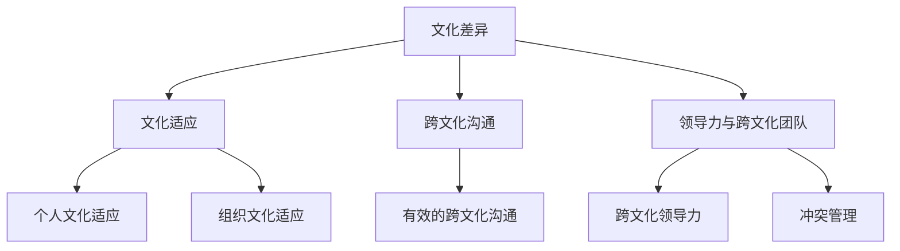

                 


## 引言

### 背景介绍

随着全球化的不断加深，企业跨越国界，将业务扩展到世界各地已成为一种常态。在这一过程中，跨文化团队管理成为了企业面临的重要挑战。跨文化团队由来自不同国家和文化背景的成员组成，他们各自拥有独特的思维方式、工作习惯和价值观。这种多样性在带来机遇的同时，也带来了诸多管理上的挑战。

首先，跨文化团队管理涉及到如何理解和尊重不同文化之间的差异。这些差异可能体现在沟通方式、决策过程、工作态度等多个方面。比如，在高度个体主义的文化中，员工可能更注重个人成就和自我实现，而在集体主义文化中，团队协作和集体荣誉则更为重要。这种文化差异如果不加以妥善处理，可能会导致沟通障碍、团队协作困难甚至文化冲突。

其次，全球化背景下的团队管理还需要应对远程工作、时区差异等问题。由于团队成员可能分布在不同的国家和地区，如何协调时间、确保有效的沟通和工作流程，是团队管理中的另一个重要课题。

最后，领导力在跨文化团队管理中发挥着关键作用。领导者需要具备跨文化意识，能够灵活调整领导风格，以适应不同文化背景的团队成员。同时，领导者还需要具备冲突管理的技能，能够有效地解决团队内部的文化冲突，维护团队的稳定和高效运作。

### 核心概念与联系

为了更好地理解跨文化团队管理，我们需要梳理几个核心概念，并探讨它们之间的联系。

1. **文化差异**：文化差异是指不同文化在价值观、信仰、习惯等方面的差异。这些差异会影响团队成员的思维方式、工作态度和沟通方式。

2. **文化适应**：文化适应是指团队成员在进入一个新的文化环境时，调整自己的行为和思维方式以适应新环境的过程。文化适应包括个人层面和组织层面的适应。

3. **跨文化沟通**：跨文化沟通是指在跨文化团队中，团队成员之间进行的信息交流。有效的跨文化沟通需要理解文化差异，并采用适当的沟通策略。

4. **领导力与跨文化团队**：领导力在跨文化团队管理中至关重要。领导者需要具备跨文化意识和领导技能，以促进团队的合作和冲突管理。

下图展示了这些核心概念之间的联系：



### 核心算法原理讲解

在跨文化团队管理中，没有一个具体的算法可以完全解决所有问题，但我们可以采用一些策略和原则来提高管理的有效性。以下是一个简化的伪代码，用于描述跨文化团队管理的一些核心步骤：

```plaintext
function manage_cross_cultural_team(team_members, team_context):
    for member in team_members:
        adapt_member_to_cultural_context(member, team_context)
        promote_awareness_of_cultural_differences()
        establish_clear_communication_channels()
        apply_leadership_styles_based_on_cultural_context()
        handle_conflicts_culturally appropriated_way()

    return team_performance_evaluation()
```

在这个伪代码中，`manage_cross_cultural_team`函数接收团队成员列表和团队所在的文化背景作为输入参数。函数中包含了以下几个核心步骤：

1. **适应文化背景**：每个团队成员都需要适应团队所在的文化背景，这可能涉及到个人层面的文化适应和组织层面的文化适应。

2. **提高文化意识**：通过培训和其他方式，提高团队成员对文化差异的认识，以减少误解和冲突。

3. **建立清晰的沟通渠道**：确保团队成员之间能够有效地沟通，这可能需要采用一些跨文化沟通技巧，如明确表达、积极倾听和适度的非言语沟通。

4. **根据文化背景调整领导风格**：领导者需要根据团队成员的文化背景调整自己的领导风格，以更好地发挥领导作用。

5. **文化适当地处理冲突**：在处理团队内部的冲突时，领导者需要考虑文化因素，采用适当的方法来解决问题。

最后，函数返回一个团队绩效评估，以评估跨文化团队管理的有效性。

### 数学模型和公式

在跨文化团队管理中，一些数学模型和公式可以帮助我们量化和管理文化差异。以下是一个简化的数学模型，用于描述文化适应的程度：

$$
Cultural_Adaptation = f(Difference, Time_Expended, Training_Received)
$$

在这个公式中：

- **Difference** 表示文化差异的程度。
- **Time_Expended** 表示团队成员在文化适应上投入的时间。
- **Training_Received** 表示团队成员接受的文化适应培训。

文化适应程度越高，团队的整体表现越好。我们可以通过以下步骤来提高文化适应程度：

1. **减少文化差异**：通过教育和培训减少文化差异的影响。
2. **增加投入时间**：鼓励团队成员在文化适应上投入更多的时间。
3. **提供培训**：组织文化适应培训，提高团队成员的文化敏感性。

### 案例分析

为了更好地理解跨文化团队管理的实际应用，我们可以通过一个真实的案例来进行分析。

#### 案例背景

某国际科技公司决定在印度设立一个新的研发中心，以扩大其在亚太地区的影响力。该研发中心将由来自不同国家和文化背景的工程师组成，包括印度本地工程师、中国工程师和欧美工程师。

#### 案例分析

1. **文化差异**：印度工程师可能更注重团队合作和关系建立，而中国工程师可能更注重工作绩效和结果。欧美工程师则可能更倾向于个人主义和独立工作。

2. **文化适应**：为了提高文化适应程度，公司采取了以下措施：
   - **跨文化培训**：为所有工程师提供跨文化沟通和合作的培训。
   - **建立文化适应小组**：由多元文化背景的员工组成，负责提供文化适应建议和支持。

3. **跨文化沟通**：公司采用了多种沟通渠道，包括定期的团队会议、邮件和即时通讯工具。同时，鼓励团队成员在沟通中明确表达，避免误解。

4. **领导力**：领导者在管理跨文化团队时，采用了更加灵活的领导风格，根据不同文化背景的员工调整自己的管理方式。

5. **冲突管理**：在处理文化冲突时，领导者采取了以下策略：
   - **倾听和理解**：倾听不同文化背景的员工的观点，试图理解他们的立场。
   - **共同寻找解决方案**：鼓励团队成员共同参与冲突解决方案的制定。

通过上述措施，该研发中心在短期内实现了高效的合作，团队绩效得到了显著提升。

### 总结

跨文化团队管理是一个复杂而重要的课题。通过理解文化差异、提高文化适应、有效沟通、灵活领导力和有效的冲突管理，企业可以克服全球化背景下的管理挑战，实现跨文化团队的卓越表现。在实际应用中，企业需要根据具体情况进行调整，以实现最佳效果。

### 小结

跨文化团队管理涉及到多个方面，包括文化差异、文化适应、跨文化沟通、领导力和冲突管理。通过理解这些核心概念，并采用适当的策略和技巧，企业可以有效地管理跨文化团队，实现团队的高效运作和卓越表现。在实际应用中，企业需要根据具体情况灵活调整管理策略，以应对不同的文化挑战。

### 注意事项

在跨文化团队管理中，以下几点需要注意：

1. **文化敏感度**：领导者和管理者需要具备较高的文化敏感度，尊重和理解团队成员的文化背景。
2. **持续学习**：企业应该鼓励团队成员持续学习，提高跨文化沟通和合作的能力。
3. **文化适应培训**：组织定期的文化适应培训，帮助团队成员更好地适应新的文化环境。
4. **有效的沟通**：建立清晰、有效的沟通渠道，确保团队成员能够及时传达信息和反馈。
5. **冲突管理**：及时识别和处理文化冲突，避免冲突升级。

### 拓展阅读

对于希望深入了解跨文化团队管理的读者，以下书籍和资源是值得推荐的：

- **《跨文化管理》**：作者：赫尔曼·米勒（Hermann Miller）
- **《全球化时代的团队管理》**：作者：约翰·霍兰德（John Holland）
- **《跨文化沟通技巧》**：作者：斯蒂芬·罗宾斯（Stephen Robbins）
- **《领导力与跨文化团队》**：作者：皮特·德鲁克（Peter Drucker）

通过阅读这些书籍，可以进一步加深对跨文化团队管理的理解和实践。

---

作者：AI天才研究院/AI Genius Institute & 禅与计算机程序设计艺术 /Zen And The Art of Computer Programming

