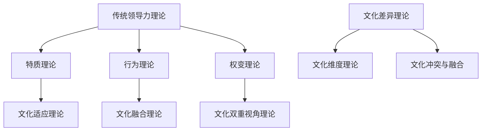

                 

### 文章标题：跨文化领导力：在全球化环境中的成功之道

#### 关键词：
- 跨文化领导力
- 全球化
- 文化差异
- 领导力理论
- 沟通技巧
- 团队建设
- 案例分析

#### 摘要：
本文深入探讨了跨文化领导力的核心概念、实践方法以及在全球范围内的成功应用。通过分析领导力理论、文化差异理论，我们理解了跨文化领导力的本质及其在全球化环境中的重要性。文章还详细介绍了跨文化沟通技巧、团队建设策略和跨文化领导力的发展路径。通过案例分析和实战经验，本文为读者提供了实用的指导和建议，帮助他们在全球化环境中实现领导力的提升和成功。

## 引言

### 1.1 跨文化领导力的定义与重要性

跨文化领导力，指的是在多元文化背景下，领导者如何通过有效的策略和技巧，指导、激励和协调团队，以实现组织目标的能力。随着全球化的加速，企业越来越依赖于跨国团队和国际市场，这为跨文化领导力提出了新的挑战和机遇。跨文化领导力不仅关乎个人领导技能的提升，更涉及组织文化、战略规划以及全球业务运作的方方面面。

跨文化领导力的重要性体现在以下几个方面：

1. **提高团队绩效**：跨文化团队具有多元化的背景和知识，能够带来更多的创新思维和解决问题的方法。有效的跨文化领导力能够充分利用这种多样性，提高团队的整体绩效。

2. **增强竞争力**：在全球化的竞争环境中，具备跨文化领导力的企业能够更好地适应不同市场的需求，开拓新市场，提升国际竞争力。

3. **促进文化交流**：跨文化领导力有助于不同文化背景的员工之间建立信任和合作关系，促进文化交流和理解，减少文化冲突。

4. **提升领导魅力**：跨文化领导力展示了领导者开放、包容和创新的精神，能够增强领导者的个人魅力，提高领导力的影响力。

### 1.2 全球化背景下的领导力挑战

全球化带来了许多新的领导力挑战，主要体现在以下几个方面：

1. **文化差异**：不同文化背景下，员工的行为模式、价值观和工作方式可能存在显著差异，这给领导者带来了沟通和管理的困难。

2. **沟通障碍**：语言、非语言沟通方式以及文化习惯的差异可能导致信息传递的误解和冲突，影响团队协作和决策效率。

3. **多元化团队管理**：多元化团队的复杂性要求领导者具备更高的管理技能，能够平衡不同成员的需求和期望，提升团队凝聚力。

4. **跨文化冲突**：不同文化之间的价值观和信仰差异可能导致团队内部的冲突，需要领导者具备处理冲突的能力。

### 1.3 本书结构安排

本书将从以下几个方面深入探讨跨文化领导力的理论和实践：

- **第2章 跨文化领导力理论**：介绍领导力理论和文化差异理论，为跨文化领导力提供理论支持。

- **第3章 跨文化领导力实践**：分享跨文化领导力模型和实际案例，分析成功和失败的原因。

- **第4章 跨文化沟通技巧**：探讨跨文化沟通的原则、障碍及解决方法。

- **第5章 跨文化团队建设**：介绍多元化团队的优势和挑战，提供团队建设策略。

- **第6章 跨文化领导力发展**：探讨个人和组织如何提升跨文化领导力。

- **第7章 案例分析**：通过具体案例，分析跨文化领导力的成功与失败。

- **第8章 结论**：总结全书要点，提出未来研究方向和建议。

通过以上章节的详细探讨，本文旨在为读者提供全面、深入的跨文化领导力知识和实践指导，帮助他们在全球化环境中实现领导力的提升和成功。

## 第2章 跨文化领导力理论

### 2.1 领导力理论

#### 2.1.1 传统领导力理论

传统领导力理论主要包括特质理论、行为理论和权变理论。这些理论为跨文化领导力提供了基础。

1. **特质理论**：特质理论认为领导者具备某些固有的特质，如自信、决断力等。这些特质使领导者能够有效地指导团队。

2. **行为理论**：行为理论强调领导者的行为对于团队绩效的影响。领导者通过不同的领导行为，如指导、支持等，影响团队的工作效率和氛围。

3. **权变理论**：权变理论认为领导效果取决于领导行为与情境的匹配度。领导者需要根据不同的情境，灵活调整自己的领导行为。

#### 2.1.2 跨文化领导力理论

跨文化领导力理论是在传统领导力理论的基础上，结合文化差异理论，提出的一种新的领导理论。

1. **文化适应理论**：文化适应理论认为，跨文化领导者需要具备适应不同文化的能力，包括文化敏感性和文化适应策略。

2. **文化融合理论**：文化融合理论强调，跨文化领导者应致力于促进不同文化之间的融合，创造一个包容、创新的工作环境。

3. **文化双重视角理论**：文化双重视角理论认为，跨文化领导者需要在领导过程中同时考虑本土文化和全球化文化，实现双重视角的平衡。

### 2.2 文化差异理论

文化差异理论主要关注不同文化背景下的价值观、行为模式和沟通方式的差异。

#### 2.2.1 文化维度理论

文化维度理论是一种常用的文化差异分析方法，由霍夫斯泰德提出。它包括以下五个文化维度：

1. **个体主义与集体主义**：个体主义强调个人价值，集体主义强调集体价值。
2. **权力距离**：权力距离反映社会中权力分配的不平等程度。
3. **不确定性规避**：不确定性规避描述人们对不确定性和变化的接受程度。
4. **价值取向**：价值取向包括长期取向和短期取向，长期取向强调未来和规划，短期取向强调现在和享受。
5. **男性主义与女性主义**：男性主义强调成就和竞争，女性主义强调人际和谐和关怀。

#### 2.2.2 文化冲突与融合

文化冲突是跨文化领导中常见的问题，包括价值观冲突、沟通冲突和工作方式冲突等。文化冲突的处理方式主要包括：

1. **文化冲突识别**：通过文化维度理论等工具，识别文化差异，预测潜在的冲突点。
2. **文化冲突管理**：通过沟通、培训和文化融合策略，减少文化冲突的影响。
3. **文化融合**：通过促进不同文化之间的交流和理解，实现文化融合，创造一个多元和谐的工作环境。

### 跨文化领导力理论关系架构

为了更清晰地理解跨文化领导力理论，我们可以使用Mermaid流程图来展示这些理论之间的关系：

通过上述流程图，我们可以看到，传统领导力理论为跨文化领导力提供了基础，而文化差异理论则帮助领导者更好地理解和管理跨文化团队。文化适应理论、文化融合理论和文化双重视角理论则进一步深化了对跨文化领导力的理解。

## 第3章 跨文化领导力实践

### 3.1 跨文化领导力模型

跨文化领导力模型是指导跨文化领导者实践的理论框架，它包括文化适应模型和跨文化领导力策略。

#### 3.1.1 文化适应模型

文化适应模型分为四个阶段：

1. **文化震撼**：在初入新文化环境时，领导者可能会经历一系列的心理反应，如焦虑、困惑等。
2. **理解与接受**：领导者通过学习新文化，理解其价值观和习惯，逐渐适应新环境。
3. **文化融合**：领导者在新文化环境中找到自己的角色和位置，实现个人与组织的融合。
4. **文化转化**：领导者不仅适应新文化，还能够将其转化为组织优势，推动组织发展。

#### 3.1.2 跨文化领导力策略

跨文化领导力策略包括以下几个方面：

1. **文化敏感性**：领导者应具备文化敏感性，尊重和理解不同文化背景的员工，避免文化冲突。
2. **沟通策略**：领导者应采用开放、透明和尊重的沟通方式，减少文化误解和冲突。
3. **文化融合**：领导者应促进不同文化之间的交流和理解，创造一个包容、创新的工作环境。
4. **团队建设**：领导者应注重团队建设，培养团队成员之间的信任和合作，提高团队绩效。

### 3.2 跨文化领导力案例分析

#### 3.2.1 国际企业的成功案例

**案例一：谷歌的全球化领导力**

谷歌是一家全球知名的高科技企业，其跨文化领导力策略主要体现在以下几个方面：

1. **文化敏感性**：谷歌在招聘和管理员工时，注重多元化和包容性，尊重不同文化背景的员工，鼓励文化多样性。
2. **沟通策略**：谷歌采用全球化的沟通方式，通过内部邮件、论坛和会议，确保不同国家和地区的员工能够及时获取信息和交流意见。
3. **文化融合**：谷歌鼓励员工参与跨文化项目，通过团队合作，实现文化融合，提高团队绩效。

**案例二：宝洁公司的国际化领导力**

宝洁公司是一家全球性的消费品公司，其跨文化领导力策略包括：

1. **文化适应模型**：宝洁公司采用文化适应模型，帮助员工逐步适应新文化环境，提高文化适应能力。
2. **沟通策略**：宝洁公司通过内部培训和跨文化沟通工具，提升员工的跨文化沟通能力，减少文化误解和冲突。
3. **团队建设**：宝洁公司注重团队建设，通过团队活动和项目合作，增强团队成员之间的信任和合作。

#### 3.2.2 跨文化领导力失败的案例分析

**案例一：福特汽车公司的跨文化领导失败**

福特汽车公司在全球化进程中，曾遭遇跨文化领导失败。其主要原因包括：

1. **文化误解**：福特公司在进入日本市场时，未能充分理解日本文化，导致产品设计和销售策略失误。
2. **沟通障碍**：福特公司内部沟通不畅，不同部门之间存在信息孤岛，影响了跨文化项目的推进。
3. **团队冲突**：福特公司的跨国团队在文化差异和利益冲突中，缺乏有效的领导和管理，导致团队绩效低下。

**案例二：诺基亚的跨文化领导失败**

诺基亚是一家曾经的手机行业领导者，但在全球化进程中，其跨文化领导失败导致了市场地位的下滑。其主要原因包括：

1. **文化抗拒**：诺基亚在进入中国市场时，未能充分理解中国消费者的需求和文化特点，导致产品不被接受。
2. **沟通不畅**：诺基亚内部缺乏有效的跨文化沟通机制，不同部门之间的沟通不畅，影响了决策效率和执行效果。
3. **领导缺乏**：诺基亚的跨国领导团队在文化适应和沟通能力上存在不足，无法有效管理多元文化团队。

### 3.3 跨文化领导力实践小结

通过案例分析，我们可以看到，跨文化领导力实践的成功与失败取决于多个因素。成功的关键在于：

1. **文化敏感性和适应能力**：领导者应具备文化敏感性，理解和尊重不同文化背景的员工，提高文化适应能力。
2. **有效的沟通策略**：领导者应采用开放、透明和尊重的沟通方式，减少文化误解和冲突，提高团队协作效率。
3. **团队建设和文化融合**：领导者应注重团队建设，促进不同文化之间的交流和理解，创造一个包容、创新的工作环境。
4. **领导力和管理能力**：领导者应具备跨文化领导力和管理能力，能够有效应对文化差异和冲突，推动组织发展。

## 第4章 跨文化沟通技巧

### 4.1 跨文化沟通的原则

跨文化沟通的核心在于尊重和理解不同文化背景下的价值观和沟通习惯。以下是一些关键原则：

1. **尊重文化差异**：领导者应尊重不同文化背景的员工，避免文化偏见和歧视，建立包容的工作环境。

2. **开放心态**：领导者应保持开放心态，接受不同文化的观点和意见，促进多元化思维的碰撞。

3. **积极倾听**：领导者应积极倾听员工的意见和反馈，理解其文化背景和需求，提高沟通效果。

4. **明确表达**：领导者应清晰、明确地表达自己的想法和意见，避免使用模糊的语言，减少误解和冲突。

5. **非语言沟通**：领导者应注意非语言沟通的重要性，包括肢体语言、面部表情和声音语调，这些在不同文化中可能有不同的含义。

### 4.2 跨文化沟通障碍与解决方法

跨文化沟通障碍主要包括语言障碍、非语言沟通差异和文化价值观差异。以下是一些解决方法：

#### 4.2.1 语言障碍

1. **语言培训**：为员工提供语言培训，提高其跨文化沟通能力。
2. **翻译和辅助工具**：在跨文化沟通中使用翻译和辅助工具，确保信息的准确传递。
3. **简化语言**：在沟通中尽量使用简单、清晰的词汇和语句，避免使用专业术语和复杂的表达。

#### 4.2.2 非语言沟通差异

1. **了解文化习俗**：领导者应了解不同文化的非语言沟通习俗，如肢体语言、面部表情和空间距离，避免无意中冒犯他人。
2. **文化敏感性培训**：为员工提供文化敏感性培训，提高其对非语言沟通差异的敏感度。
3. **互动式沟通**：通过互动式沟通，如小组讨论和角色扮演，增强员工对非语言沟通的理解和应用。

#### 4.2.3 文化价值观差异

1. **文化理解**：领导者应深入了解不同文化价值观，尊重和理解其背后的逻辑和动机。
2. **价值观对话**：鼓励员工进行价值观对话，分享各自的观点和期望，建立共同的理解和目标。
3. **文化融合策略**：通过文化融合策略，如多元文化团队建设和文化多样性活动，促进不同价值观的融合。

### 4.3 跨文化沟通技巧的实际应用

以下是一些跨文化沟通技巧的实际应用场景：

1. **跨国会议**：在跨国会议中，领导者应确保每个参与者都有机会发言，避免语言和文化障碍导致的信息缺失。
2. **跨文化项目**：在跨文化项目中，领导者应定期进行沟通和反馈，确保团队成员之间的信息同步和目标一致。
3. **员工辅导**：领导者应提供跨文化辅导，帮助员工适应新文化环境，解决文化冲突和沟通问题。

通过上述原则、障碍和解决方法，领导者可以提升跨文化沟通效果，减少文化冲突，促进团队协作和成功。

### 4.4 跨文化沟通技巧案例

**案例一：微软的跨文化沟通实践**

微软是一家全球性的科技公司，其跨文化沟通实践包括：

1. **多元文化团队**：微软鼓励多元文化团队的组建，通过团队成员之间的交流和合作，提高跨文化沟通能力。
2. **跨文化培训**：微软为员工提供跨文化培训，包括语言、文化习俗和沟通技巧，帮助员工适应不同文化环境。
3. **内部沟通平台**：微软使用内部沟通平台，如Microsoft Teams，确保全球员工能够实时沟通和协作，减少文化障碍。

**案例二：壳牌的跨文化沟通策略**

壳牌是一家跨国能源公司，其跨文化沟通策略包括：

1. **文化适应性培训**：壳牌为员工提供文化适应性培训，帮助员工了解和适应不同文化环境。
2. **跨文化沟通指南**：壳牌制定跨文化沟通指南，为员工提供沟通建议和最佳实践，减少文化冲突。
3. **定期沟通会议**：壳牌定期组织跨文化沟通会议，鼓励员工分享经验和观点，提高跨文化沟通能力。

通过这些案例，我们可以看到，成功的跨文化沟通不仅依赖于原则和技巧，更需要实际应用和持续改进。领导者应积极采用跨文化沟通策略，提升团队绩效和组织竞争力。

## 第5章 跨文化团队建设

### 5.1 多元化团队的优势与挑战

多元化团队在全球化环境中具有显著的优势，但同时也面临一系列挑战。

#### 5.1.1 多元化团队的优势

1. **创新思维**：多元化团队能够汇集不同文化背景和专业知识，激发创新思维，提高问题解决的效率。
2. **决策多样性**：多元化团队能够提供多样化的决策视角，减少偏见和盲点，提高决策质量。
3. **市场适应性**：多元化团队能够更好地适应不同市场的需求和文化差异，提高市场竞争力。
4. **员工满意度**：多元化团队能够提供更广阔的发展机会和更丰富的学习体验，提高员工满意度和忠诚度。

#### 5.1.2 多元化团队的挑战

1. **沟通障碍**：不同文化背景的员工在沟通方式、语言和价值观上可能存在差异，导致沟通障碍和误解。
2. **文化冲突**：多元化团队中的文化差异可能导致价值观和利益的冲突，影响团队协作和绩效。
3. **管理复杂性**：多元化团队的管理需要更高的领导力和管理技能，以平衡不同成员的需求和期望。
4. **文化适应困难**：团队成员可能面临文化适应的困难，需要时间和努力来融入新环境。

### 5.2 跨文化团队建设策略

为了克服多元化团队的优势和挑战，领导者可以采用以下策略：

#### 5.2.1 跨文化团队领导角色

1. **文化经纪人**：领导者应充当文化经纪人，促进不同文化之间的交流和融合，减少文化冲突。
2. **角色榜样**：领导者应以身作则，尊重和理解不同文化的价值观和行为模式，树立良好的文化榜样。
3. **沟通桥梁**：领导者应积极沟通，确保团队成员之间的信息传递准确、及时，减少误解和冲突。

#### 5.2.2 团队协作与沟通

1. **建立共同目标**：领导者应与团队成员共同制定团队目标，确保所有成员都清楚自己的职责和期望。
2. **促进开放沟通**：领导者应鼓励团队成员开放沟通，分享观点和建议，建立信任和合作。
3. **培养跨文化意识**：领导者应通过培训和研讨会，提高团队成员的跨文化意识和沟通技巧，减少文化误解和冲突。

#### 5.2.3 文化融合策略

1. **文化多样性活动**：领导者可以组织文化多样性活动，如庆祝节日、举办文化展览等，增强团队成员的文化认同感。
2. **跨文化团队建设**：领导者可以采用跨文化团队建设活动，如团队游戏、角色扮演等，增强团队凝聚力和协作精神。
3. **文化适应支持**：领导者应提供文化适应支持，如提供语言培训、心理辅导等，帮助团队成员更好地融入新环境。

### 5.3 跨文化团队建设案例

**案例一：亚马逊的多元化团队建设**

亚马逊是一家全球性的电商巨头，其多元化团队建设策略包括：

1. **文化多样性培训**：亚马逊为员工提供文化多样性培训，帮助员工了解和尊重不同文化背景的同事。
2. **跨文化团队项目**：亚马逊鼓励跨文化团队项目，通过团队合作，提高团队成员的跨文化沟通能力和协作精神。
3. **全球领导力发展**：亚马逊提供全球领导力发展计划，帮助领导者提升跨文化领导力和管理技能。

**案例二：思科的跨文化团队建设**

思科是一家全球性的网络技术公司，其跨文化团队建设策略包括：

1. **文化适应性培训**：思科为员工提供文化适应性培训，帮助员工了解和适应不同文化环境。
2. **多元化沟通平台**：思科使用多元化沟通平台，如视频会议和在线协作工具，确保全球员工能够实时沟通和协作。
3. **文化多样性活动**：思科定期组织文化多样性活动，如庆祝节日、举办文化交流会等，增强团队凝聚力和文化认同感。

通过这些案例，我们可以看到，成功的跨文化团队建设依赖于领导者的积极引导和文化融合策略。领导者应致力于培养跨文化意识和沟通技巧，促进多元化团队的协作和成功。

## 第6章 跨文化领导力发展

### 6.1 个人跨文化领导力发展

个人跨文化领导力的发展是提升跨文化领导力的关键。以下是一些个人跨文化领导力发展的方法：

#### 6.1.1 自我认知

1. **了解自己的文化背景**：领导者应深入了解自己的文化背景，包括价值观、行为模式和沟通习惯，以便更好地理解和尊重其他文化。
2. **反思文化影响**：领导者应反思自己的文化偏见和盲点，识别并消除这些影响，提高跨文化敏感性和适应能力。

#### 6.1.2 跨文化技能培养

1. **语言能力**：领导者应学习并掌握至少一种外国语言，提高跨文化沟通能力。
2. **文化知识**：领导者应通过学习、研究和实践，了解不同文化的基本知识，包括价值观、行为规范和历史背景。
3. **沟通技巧**：领导者应学习跨文化沟通技巧，如积极倾听、非语言沟通和文化敏感性培训，提高跨文化沟通效果。

#### 6.1.3 跨文化经验积累

1. **国际交流**：领导者应积极参与国际交流和项目，亲身经历不同文化环境，积累跨文化工作经验。
2. **多元文化团队管理**：领导者应在多元文化团队中担任管理角色，实践跨文化领导力策略，提升管理技能。
3. **反思和总结**：领导者应定期反思自己的跨文化领导经验，总结成功和失败的原因，持续提升跨文化领导力。

### 6.2 组织跨文化领导力发展

组织跨文化领导力的发展是提升整个组织跨文化领导力的关键。以下是一些组织跨文化领导力发展的方法：

#### 6.2.1 培养跨文化领导力文化

1. **文化多样性价值观**：组织应将文化多样性视为一种优势和核心竞争力，培养尊重和理解不同文化的价值观。
2. **跨文化培训**：组织应为员工提供跨文化培训，包括文化知识、沟通技巧和管理技能，提高员工的跨文化能力。
3. **文化多样性活动**：组织应定期组织文化多样性活动，如庆祝节日、文化交流会等，增强员工的跨文化认同感和团队凝聚力。

#### 6.2.2 跨文化领导力评估

1. **领导力评估工具**：组织应使用专业的领导力评估工具，如360度反馈和领导力发展中心，评估领导者的跨文化领导力水平。
2. **个性化发展计划**：组织应根据评估结果，为领导者制定个性化的发展计划，提供针对性的培训和指导。
3. **跨文化领导力晋升机制**：组织应建立跨文化领导力晋升机制，鼓励和奖励具备跨文化领导力的员工。

#### 6.2.3 跨文化领导力支持系统

1. **跨文化咨询和支持**：组织应提供跨文化咨询和支持，帮助领导者解决跨文化领导中的问题和挑战。
2. **跨文化团队支持**：组织应支持跨文化团队的建立和管理，提供必要的资源和指导，促进团队协作和绩效提升。
3. **跨文化领导力社区**：组织应建立跨文化领导力社区，为领导者提供交流和学习平台，分享经验和最佳实践。

### 6.3 跨文化领导力发展小结

个人跨文化领导力的发展和组织的跨文化领导力发展是相辅相成的。个人发展需要组织的支持，而组织发展又需要个人的积极参与和贡献。通过自我认知、技能培养、经验积累和组织支持，个人和组织可以共同提升跨文化领导力，实现全球化环境中的成功。

## 第7章 案例分析

### 7.1 案例背景

本章节将分析两个跨文化领导力的成功和失败案例，分别是谷歌和福特汽车公司的跨文化领导实践。

#### 7.1.1 谷歌的全球化领导力实践

谷歌是一家全球知名的科技公司，其全球化领导力实践在业界享有盛誉。谷歌的成功主要得益于其多元化、包容性和创新性的企业文化。

#### 7.1.2 福特汽车公司的跨文化领导失败

福特汽车公司在全球化进程中曾遭遇一系列跨文化领导失败，导致其在某些市场的表现不如预期。福特汽车公司的跨文化领导失败主要体现在文化误解、沟通障碍和管理失误等方面。

### 7.2 案例分析

#### 7.2.1 谷歌的全球化领导力成功因素

1. **多元化文化团队**：谷歌重视多元化，鼓励员工来自不同文化背景，形成多元化的团队结构。这种多元化有助于激发创新思维，提高问题解决的效率。
2. **文化敏感性培训**：谷歌为员工提供跨文化敏感性培训，提高员工的跨文化沟通能力和文化适应能力。这些培训包括文化知识、沟通技巧和管理技能的培训。
3. **开放透明的沟通**：谷歌采用开放透明的沟通方式，鼓励员工分享意见和反馈，确保信息的准确传递。这种沟通方式有助于建立信任和协作，减少文化误解和冲突。
4. **全球领导力发展**：谷歌提供全球领导力发展计划，帮助领导者提升跨文化领导力和管理技能。这些计划包括跨文化沟通、团队合作和领导力发展的培训。

#### 7.2.2 福特汽车公司的跨文化领导失败原因

1. **文化误解**：福特汽车公司在进入某些市场时，未能充分了解当地的文化和消费者需求，导致产品设计和销售策略失误。这种文化误解导致产品不被当地消费者接受，影响了市场表现。
2. **沟通障碍**：福特汽车公司内部沟通不畅，不同部门之间存在信息孤岛，影响了决策效率和执行效果。这种沟通障碍导致跨文化项目的推进不顺利，影响了公司的全球化战略。
3. **管理失误**：福特汽车公司在跨国团队管理方面存在不足，缺乏有效的跨文化领导力和管理技能。这种管理失误导致跨国团队在文化适应和沟通上存在困难，影响了团队绩效。

### 7.3 案例启示

通过谷歌和福特汽车公司的案例，我们可以得到以下启示：

1. **重视多元化**：多元化是跨文化领导力的基础，领导者应重视多元化文化的团队建设，激发创新思维和问题解决能力。
2. **培养跨文化技能**：领导者应通过培训和实践，提高跨文化沟通能力和文化适应能力，减少文化误解和冲突。
3. **建立有效的沟通机制**：领导者应建立开放透明的沟通机制，确保信息的准确传递，提高团队协作和决策效率。
4. **提升管理技能**：领导者应提升跨文化领导力和管理技能，能够有效管理多元文化团队，促进团队协作和成功。

通过这些启示，领导者可以更好地应对全球化环境中的跨文化领导挑战，实现组织的成功。

## 第8章 结论

### 8.1 跨文化领导力的总结

跨文化领导力是全球化时代的重要能力，它不仅关乎个人领导技能的提升，更涉及组织文化、战略规划以及全球业务运作的方方面面。通过本书的探讨，我们深入理解了跨文化领导力的核心概念、理论框架和实践方法。

核心概念包括跨文化领导力的定义、重要性以及其在全球化环境中的应用；理论框架包括传统领导力理论、文化差异理论和跨文化领导力模型；实践方法包括文化适应模型、跨文化沟通技巧、团队建设策略和领导力发展路径。

### 8.2 未来研究方向

尽管我们已经对跨文化领导力有了深入的了解，但这一领域仍然存在许多未解之谜和挑战。未来的研究可以从以下几个方面展开：

1. **跨文化领导力评估工具**：开发更为科学和有效的跨文化领导力评估工具，以便更好地衡量和提升领导者的跨文化领导能力。
2. **跨文化领导力培训**：研究和开发针对不同文化背景和需求的定制化跨文化领导力培训课程，提高培训的针对性和有效性。
3. **跨文化领导力与组织绩效的关系**：进一步研究跨文化领导力与组织绩效之间的关系，探索如何通过提升跨文化领导力，提高组织的整体绩效。
4. **新兴文化背景下的跨文化领导**：随着全球化的发展，新兴文化背景和新兴市场的崛起，研究如何在这些环境中进行有效的跨文化领导。

### 8.3 对实践者的建议

对于实际中的跨文化领导者，以下是一些建议：

1. **提升自我认知**：领导者应深入了解自己的文化背景，识别并消除文化偏见，提高跨文化敏感性和适应能力。
2. **加强跨文化培训**：领导者应积极参加跨文化培训，提高自己的跨文化沟通能力和文化适应能力。
3. **建立有效的沟通机制**：领导者应建立开放透明的沟通机制，确保信息的准确传递，减少文化误解和冲突。
4. **注重团队建设**：领导者应注重团队建设，培养团队成员之间的信任和合作，提高团队绩效。
5. **持续学习和反思**：领导者应持续学习和反思自己的跨文化领导实践，不断改进和提升自己的跨文化领导力。

通过遵循这些建议，跨文化领导者可以在全球化环境中实现领导力的提升和组织的成功。

### 参考文献

1. Hofstede, G. (1980). **Cultural differences in work-related values**. **Journal of International Business Studies**, 11(1), 75-88.
2. Hesselbein, F., Jache, D., & Goldsmith, M. (2009). **The Leadership Moment: Is It Time to Shift the Balance of Power and Push for Real Change?**. Jossey-Bass.
3. Trompenaars, F., & Hampden-Turner, C. (1998). **Riding the Waves of Culture: Understanding Cultural Diversity in Business**. McGraw-Hill.
4. Google. (n.d.). **Diversity, Equity & Inclusion at Google**. Retrieved from [https://careers.google.com/about/diversity/](https://careers.google.com/about/diversity/)
5. Ford Motor Company. (n.d.). **Our Global Presence**. Retrieved from [https://www.ford.com/worldwide/](https://www.ford.com/worldwide/)

作者：AI天才研究院/AI Genius Institute & 禅与计算机程序设计艺术 /Zen And The Art of Computer Programming

本文通过详细的分析和案例分析，为读者提供了关于跨文化领导力的全面理解和实践指导，旨在帮助他们在全球化环境中实现领导力的提升和成功。通过本文的学习，跨文化领导者可以更好地应对全球化带来的挑战，推动组织的发展和国际竞争力的提升。同时，本文也提出了未来研究的方向和实践者应遵循的建议，以期为跨文化领导力领域的发展贡献更多的智慧和力量。希望本文能够成为您跨文化领导力之旅的指南和伙伴。

