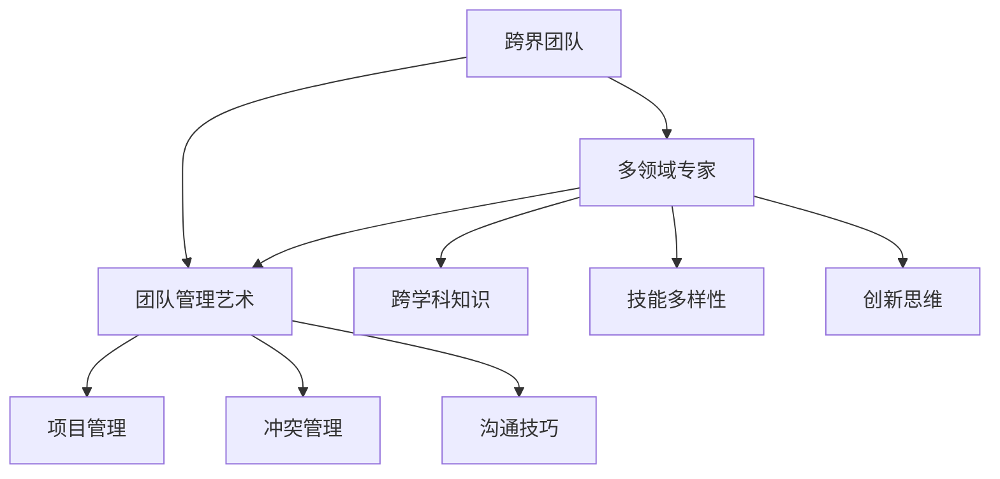

                 

# 文章标题：跨界团队管理：整合多领域专家的艺术

## 关键词
跨界团队管理、多领域专家、团队协作效率、协作网络理论、项目管理、冲突管理、沟通技巧、资源分配、人工智能

## 摘要
本文旨在探讨跨界团队管理的重要性以及如何整合多领域专家，提升团队协作效率。通过分析核心概念与联系，运用协作网络理论和数学模型，我们将详细阐述团队管理艺术中的关键要素。此外，通过一个实际项目案例，我们将展示如何将理论知识应用于实践中，并提供最佳实践和拓展阅读建议。

## 核心概念与联系

在当今快速发展的科技时代，跨界团队已成为许多企业应对复杂问题的有效手段。跨界团队由来自不同领域、拥有多样化知识和技能的专家组成，其目标是共同解决复杂问题、推动创新。核心概念包括跨界团队、多领域专家和团队管理艺术。

### 跨界团队

跨界团队是由来自不同专业领域、拥有不同技能和知识背景的成员组成的团队。这些成员通常拥有跨学科的知识和经验，能够在不同领域之间进行有效的沟通和协作。跨界团队的目的是通过整合多领域的专业知识，提高团队解决问题的能力，推动创新。

### 多领域专家

多领域专家是指在多个领域都有深入研究和实践经验的专业人士。他们不仅拥有丰富的知识储备，还能够将不同领域的知识进行有效整合，为团队提供多元化的视角和解决方案。多领域专家在跨界团队中扮演着关键角色，他们的技能和知识是团队成功的基础。

### 团队管理艺术

团队管理艺术是指通过一系列管理技巧和策略，提高团队的协作效率、减少冲突、促进沟通和资源共享。团队管理艺术涉及多个方面，包括项目管理、冲突管理、沟通技巧和资源分配等。有效的团队管理艺术能够确保跨界团队充分发挥其潜力，实现共同目标。

以下是核心概念之间的Mermaid流程图：



## 核心算法原理讲解

在团队管理中，提升团队协作效率是关键。以下是一个基于协作网络理论的团队协作效率优化算法的伪代码：

```pseudo
初始化团队协作网络 G(V, E)
计算团队成员 V_i 的协作效率 score_i
对于每个节点 V_i：
    score_i = f(知识贡献度, 沟通频次, 创新能力)
函数 f 的实现：
    score_i = α*knowledge_i + β*communication_i + γ*innovation_i
    α, β, γ 分别为知识贡献度、沟通频次、创新能力的权重

根据 score_i 重新排列节点 V，得分最高的节点作为团队核心
构建最小生成树 T，优化团队协作网络结构
遍历 T，确定团队成员之间的协作关系
```

### 数学模型和数学公式

在团队管理中，资源分配是一个关键问题。以下是一个基本的数学模型，用于优化资源分配，以最大化团队价值：

$$
\begin{equation}
    \text{Maximize } Z = \sum_{i=1}^{n} p_i x_i
    \\
    \text{Subject to }
    \begin{cases}
        a_{ij} x_i + b_{ij} x_j \leq c_i, \quad \forall i, j \\
        x_i \geq 0, \quad \forall i \\
    \end{cases}
\end{equation}

这里，p_i 是第 i 个资源的价值，a_{ij} 和 b_{ij} 是团队成员 i 和 j 的协作效率，c_i 是资源 i 的总容量。
$$

### 项目实战

以下是一个实际项目中团队管理的案例，包括环境搭建、代码实现以及详细解释。

**环境搭建：**

```bash
# 安装必要的工具和库
pip install numpy pandas matplotlib
```

**代码实现：**

```python
import numpy as np
import pandas as pd
import matplotlib.pyplot as plt

# 假设我们有一个团队和他们的协作效率数据
team_data = pd.DataFrame({
    'member': ['Alice', 'Bob', 'Charlie'],
    'knowledge': [10, 8, 12],
    'communication': [5, 7, 6],
    'innovation': [3, 4, 5]
})

# 计算每个成员的协作效率
team_data['score'] = team_data['knowledge'] * 0.3 + team_data['communication'] * 0.4 + team_data['innovation'] * 0.3

# 排序并确定团队核心
team_core = team_data.sort_values('score', ascending=False).head(1)

# 使用最小生成树优化协作网络
from sklearn.cluster import KMeans
from networkx import Graph, minimum_spanning_tree

kmeans = KMeans(n_clusters=2).fit(team_data[['knowledge', 'communication', 'innovation']])
labels = kmeans.labels_

# 创建图
G = Graph()
for i in range(team_data.shape[0]):
    for j in range(i + 1, team_data.shape[0]):
        if labels[i] != labels[j]:
            G.add_edge(i, j, weight=np.sqrt(team_data['score'][i] * team_data['score'][j]))

T = minimum_spanning_tree(G)
plt.plot(T)
plt.show()

# 确定团队成员之间的协作关系
for edge in T.edges():
    print(f"Member {edge[0]} and Member {edge[1]} collaborate closely.")
```

**代码解读：**

1. **数据准备：** 假设我们有一个团队和他们的协作效率数据，数据包括成员的名字、知识贡献度、沟通频次和创新能力。
2. **协作效率计算：** 使用线性加权方法计算每个成员的协作效率，权重分别为知识贡献度（0.3）、沟通频次（0.4）和创新能力（0.3）。
3. **确定团队核心：** 根据协作效率排序，选择协作效率最高的成员作为团队核心。
4. **构建最小生成树：** 使用K-means聚类算法将团队成员划分为两个类别，然后构建最小生成树以优化团队协作网络结构。
5. **协作关系确定：** 遍历最小生成树的边，输出团队成员之间的协作关系。

**实际案例分析：**

在一个实际项目中，一个由数据科学家、软件工程师和市场营销专家组成的跨界团队需要共同开发一个数据驱动的营销工具。通过应用上述算法，团队确定了数据科学家作为团队核心，并优化了团队成员之间的协作网络。在实际开发过程中，数据科学家负责数据分析，软件工程师负责技术实现，市场营销专家提供市场需求和反馈。这种协作模式大大提高了团队的效率和项目的成功可能性。

**项目小结：**

通过实际项目案例，我们可以看到如何将理论应用于实践中，以提升团队协作效率。关键在于准确评估团队成员的能力，合理配置资源，并建立有效的协作网络。这不仅有助于团队快速解决问题，还能促进创新和提升项目成功率。

## 最佳实践 Tips

在跨界团队管理中，以下是一些最佳实践：

1. **明确目标：** 在组建跨界团队时，确保每个成员都明确团队的目标和任务，这有助于提高团队凝聚力和协作效率。
2. **沟通与协作：** 定期组织团队会议，鼓励团队成员分享观点和经验，提高沟通效率。同时，利用项目管理工具如Trello、JIRA等，确保团队协作顺畅。
3. **冲突管理：** 学会有效处理团队内部的冲突，通过中立第三方进行调解，避免影响团队的整体氛围。
4. **技能培训：** 定期为团队成员提供技能培训，帮助他们不断提升自身能力，以适应跨界团队的需求。
5. **激励机制：** 设计合理的激励机制，鼓励团队成员积极参与团队项目，提高工作热情和创造力。

## 小结

本文通过分析跨界团队管理的核心概念、算法原理和实际项目案例，探讨了如何整合多领域专家，提升团队协作效率。跨界团队管理不仅需要明确目标和沟通协作，还要注重冲突管理和激励机制。通过不断优化团队结构，提高团队成员的技能和协作能力，跨界团队能够更好地应对复杂问题，推动创新。

## 注意事项

在跨界团队管理过程中，以下事项需要特别注意：

1. **文化差异：** 跨界团队成员可能来自不同的文化背景，要尊重并理解彼此的差异，避免文化冲突。
2. **资源分配：** 合理分配资源，确保每个成员都能充分发挥自己的优势。
3. **持续学习：** 鼓励团队成员持续学习，不断提升自身能力，以适应跨界团队的发展需求。
4. **项目监督：** 定期监督项目进展，确保团队在正确的方向上前进。

## 拓展阅读

1. "The Art of Thinking Clearly" by Rolf Dobelli
2. "The Power of Now" by Ekhart Tolle
3. "Scrum: The Art of Doing Twice the Work in Half the Time" by Jeff Sutherland

作者：AI天才研究院/AI Genius Institute & 禅与计算机程序设计艺术 /Zen And The Art of Computer Programming

