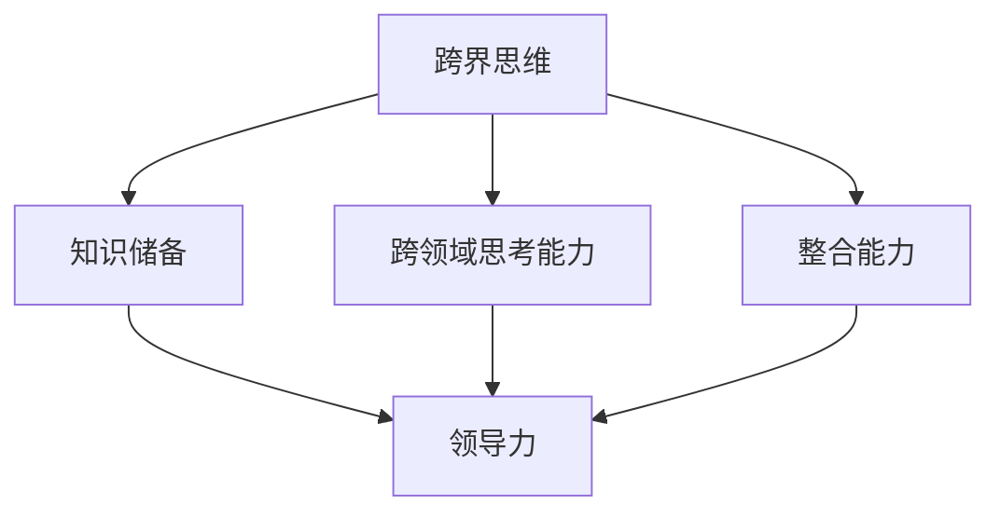

                 

### 跨界思维与领导力的定义

#### 跨界思维的定义

跨界思维，顾名思义，是指跨越不同领域、学科或行业，综合运用不同领域的知识、技能和思维方式，以达到创新和解决问题的能力。它不仅要求个体具备广泛的知识储备，还需要具备跨领域的思考能力和整合能力。

- **知识储备**：跨界思维首先依赖于个体在各个领域的专业知识积累，如技术、艺术、科学等。
- **跨领域思考能力**：这种能力使得个体能够将不同领域的思维方式结合起来，形成新的思维模式，从而产生创新的见解和解决方案。
- **整合能力**：跨界思维还需要个体能够将不同领域的信息、资源和经验进行整合，形成系统化的知识和方法。

#### 领导力的定义

领导力是指在组织或团队中，通过影响和激励他人，引导团队达成共同目标的能力。它不仅仅涉及权力和地位的分配，还包括沟通、决策、激励和团队建设等方面。

- **权力和地位**：领导力中的权力来源于组织或团队的授权和认可，而地位则是由个人的能力和影响力决定的。
- **沟通**：有效的沟通是领导力的重要基础，领导需要能够清晰表达自己的想法，并理解团队成员的需求和意见。
- **决策**：领导力中的决策能力是指领导者在面临选择时，能够快速、准确地做出决策。
- **激励**：领导者需要具备激励团队成员的能力，以激发他们的潜能和动力。

### 核心概念与联系

为了更好地理解跨界思维和领导力的关系，我们可以使用以下Mermaid流程图来展示这两个核心概念之间的联系：

在这个流程图中，跨界思维的核心概念包括知识储备、跨领域思考能力和整合能力，它们共同构成了跨界思维的能力体系。而领导力则依赖于跨界思维的能力，通过知识储备、跨领域思考能力和整合能力来增强其沟通、决策和激励能力，从而更有效地实现组织或团队的目标。

### 跨界思维与传统思维的区别

跨界思维与传统思维在思维方式、应用范围和目标上存在显著差异。

- **思维方式**：
  - **传统思维**：传统思维通常在某一特定领域内进行思考，注重逻辑推理和分析。它倾向于使用已知的方法和工具来解决问题。
  - **跨界思维**：跨界思维则更加开放和灵活，能够跨越不同领域和学科，综合运用多方面的知识和技能来解决问题。

- **应用范围**：
  - **传统思维**：传统思维通常应用于单一领域或专业，如科学研究、技术开发等。
  - **跨界思维**：跨界思维的应用范围更加广泛，可以涵盖多个领域，如企业管理、科技创新、文化艺术等。

- **目标**：
  - **传统思维**：传统思维的目标通常是优化现有方法或流程，提高效率和质量。
  - **跨界思维**：跨界思维的目标则是通过跨领域的创新和整合，创造新的解决方案和商业机会。

通过以上分析，我们可以看到，跨界思维和领导力在概念、作用和应用上都具有独特的特点。理解并运用跨界思维，能够极大地提升领导者的决策能力和团队创新能力，从而在竞争激烈的市场环境中获得优势。

### 跨界思维的重要性

跨界思维的重要性在于它为领导者提供了超越传统思维模式的工具，使其能够更好地应对复杂多变的环境。以下是从多个方面探讨跨界思维的重要性的具体内容：

#### 创新能力的提升

跨界思维的核心在于跨领域的知识整合和思维融合。这种能力使得领导者能够在面对问题时，不仅能够从自身领域的视角出发，还能借鉴其他领域的经验和见解，从而激发创新的火花。例如，在技术创新领域，跨界思维能够帮助领导者将生物学、物理学和计算机科学等不同领域的知识融合，创造出全新的技术解决方案。

#### 决策能力的增强

跨界思维使得领导者能够从更广泛的角度来看待问题，从而做出更加全面和客观的决策。在商业决策中，领导者需要考虑市场趋势、消费者行为、技术创新等多方面因素。跨界思维可以帮助领导者将这些因素有机地结合起来，从而提高决策的准确性和前瞻性。

#### 领导力的强化

跨界思维不仅提升了领导者的创新能力和决策能力，还增强了其领导力。跨界思维使得领导者能够更好地理解和沟通不同领域和背景的团队成员，从而建立更加高效的团队协作关系。此外，跨界思维还能够激发团队成员的创造力和主动性，提升团队的整体绩效。

#### 应对复杂问题的能力

在当今快速变化和高度不确定的环境中，跨界思维成为领导者应对复杂问题的关键。跨界思维使得领导者能够迅速适应新的环境和挑战，找到创新的解决方案。例如，在应对全球疫情时，跨界思维可以帮助领导者整合医疗、公共卫生、经济和社会等多方面的信息，制定出有效的应对策略。

#### 持续学习和成长

跨界思维还鼓励领导者持续学习和成长。通过不断接触和学习不同领域的知识和技能，领导者可以不断提升自己的知识储备和思维能力，从而在职业生涯中保持竞争力。

综上所述，跨界思维对于领导力的提升具有至关重要的意义。它不仅能够激发创新、增强决策能力，还能够提升领导力和应对复杂问题的能力，为领导者的事业发展提供强大的支持。

### 跨界思维与领导力的关系

跨界思维与领导力之间存在着密切的互动关系，二者相辅相成，共同推动个人和组织的发展。以下将从多个方面探讨跨界思维与领导力之间的关系：

#### 跨界思维提升领导力

首先，跨界思维显著提升了领导者的综合素质。跨界思维要求领导者具备广泛的知识储备和跨领域的思考能力，这有助于领导者更好地理解和沟通不同背景和专业的团队成员。例如，在技术型企业中，具备跨界思维的领导者能够与技术团队、市场团队和运营团队进行高效沟通，确保各个团队的目标一致并协同工作。

#### 领导力促进跨界思维

其次，领导力在跨界思维的培养和应用中起着关键作用。领导力不仅为跨界思维提供了支持和资源，还能够激励团队成员积极参与跨界创新。例如，通过设立创新项目、提供跨领域培训和奖励机制，领导者可以激发团队成员的跨界思维，促进组织内部的创新氛围。

#### 跨界思维与领导力的互动关系

跨界思维与领导力之间的互动关系体现在多个方面。一方面，跨界思维能够增强领导者的决策能力和战略规划能力。领导者通过跨界思维，可以更全面地分析问题，从多个角度寻求解决方案，从而做出更准确、更具前瞻性的决策。另一方面，领导力能够推动跨界思维的实践和应用。领导者的支持和鼓励可以减少团队成员在跨界合作中的风险和不确定性，从而提高跨界思维的执行力和效果。

#### 实际案例解析

以谷歌（Google）为例，谷歌的创始人拉里·佩奇（Larry Page）和谢尔盖·布林（Sergey Brin）就展现了跨界思维与领导力的完美结合。佩奇和布林都是计算机科学专业的优秀毕业生，但他们同时也对其他领域如商业和管理有着深厚的兴趣。在谷歌的发展过程中，他们不仅注重技术创新，还关注用户需求和商业模式创新，这种跨界思维使得谷歌在互联网竞争中脱颖而出。

此外，谷歌的领导力模式也体现了跨界思维的重要性。谷歌的“20%时间”政策允许员工将20%的工作时间用于自己感兴趣的项目，这种鼓励创新的政策使得谷歌内部涌现出许多颠覆性的产品，如Gmail和AdSense。这种领导力支持了跨界思维的实践，使得谷歌始终保持创新活力。

总之，跨界思维与领导力之间的互动关系不仅促进了个人和组织的发展，还推动了整个社会创新和进步。理解并运用这种关系，有助于领导者更好地应对复杂多变的环境，实现组织的目标。

### 跨界思维在领导决策中的应用

跨界思维在领导决策中发挥着至关重要的作用，它不仅提供了多样化的视角，还增强了决策的全面性和准确性。以下从多个方面详细探讨跨界思维在领导决策中的应用：

#### 多元视角

跨界思维的一个显著特点是能够为领导者提供多元视角。在面对复杂问题时，单一的领域思维往往难以全面考虑所有因素。而跨界思维则通过整合不同领域的知识和经验，使得领导者能够从多个角度审视问题。例如，在制定公司战略时，领导者可以结合市场营销、技术创新、供应链管理等多方面的知识，从而更全面地评估各种方案的可能性和风险。

#### 系统分析

跨界思维还促使领导者进行系统分析，而不是仅仅关注某一特定领域。在决策过程中，系统分析能够帮助领导者识别出关键因素及其相互关系，从而构建一个更加完整的决策框架。例如，在评估一个新产品项目时，领导者不仅需要考虑市场需求和技术可行性，还需要考虑生产成本、供应链稳定性以及竞争环境等因素，以确保项目从多个维度都具备可行性。

#### 创新思维

跨界思维鼓励领导者采用创新思维，从全新的角度寻找解决方案。传统思维往往受限于现有的方法和框架，而跨界思维则可以打破这种局限，激发出创新的点子。例如，在科技创新领域，领导者可以借鉴生物学的进化机制，将自然选择和遗传算法引入到技术研发中，从而创造出更加高效的技术解决方案。

#### 风险管理

跨界思维在风险管理中也发挥着重要作用。通过跨界思维，领导者能够更全面地识别和评估潜在的风险，并采取相应的预防措施。例如，在全球化运营中，领导者需要考虑政治、经济、社会和文化等多方面的风险因素，通过跨界思维的综合分析，制定出更为稳健的国际化战略。

#### 实际案例解析

以苹果公司（Apple Inc.）为例，苹果的创始人史蒂夫·乔布斯（Steve Jobs）就是跨界思维的典范。乔布斯不仅精通计算机科学，还涉猎设计、市场营销和商业管理等多个领域。这种跨界思维使得乔布斯能够在产品开发过程中综合考虑技术、美学和市场等多方面因素，从而创造出深受用户喜爱的产品。

例如，在推出iPhone时，乔布斯不仅关注硬件技术，还结合了软件设计、用户体验和市场趋势，将智能手机带入了一个全新的时代。iPhone的成功不仅展示了跨界思维在技术创新中的应用，还证明了跨界思维在市场推广和品牌建设中的巨大价值。

总之，跨界思维在领导决策中的应用能够显著提升决策的质量和效果。通过多元视角、系统分析、创新思维和风险管理，领导者能够更加全面和准确地制定决策，从而在竞争激烈的环境中取得成功。

### 跨界思维在组织文化构建中的应用

跨界思维在组织文化构建中发挥着关键作用，能够促进创新氛围的营造，提高团队协作效率，并推动组织的持续发展。以下从多个方面详细探讨跨界思维在组织文化构建中的应用：

#### 营造创新氛围

跨界思维能够打破传统思维模式，激发员工的创新潜力。在组织文化中，鼓励跨界思维可以营造一个开放、包容和创新的工作环境。例如，通过跨部门项目、团队交流和知识共享活动，组织可以促进不同领域和背景的员工之间的互动和合作，从而激发创新思维。谷歌的“20%时间”政策和“快速失败、快速学习”的理念就是跨界思维在创新氛围营造中的成功案例。

#### 提高团队协作效率

跨界思维能够促进团队成员之间的跨领域合作，提高团队的整体协作效率。通过跨界思维，团队成员可以更加灵活地整合不同领域的知识和技能，共同解决复杂问题。例如，在开发新产品时，市场营销团队、研发团队和运营团队可以通过跨界思维共同探讨市场需求、技术实现和运营策略，从而提高产品开发的效率和质量。

#### 增强组织学习能力

跨界思维有助于增强组织的持续学习能力，使组织能够不断适应外部环境的变化。跨界思维鼓励员工不断学习新知识、新技能，并勇于尝试新的方法和思路。例如，通过提供跨领域的培训机会和职业发展路径，组织可以培养出具备广泛知识和能力的多元化人才，从而提高组织的适应能力和竞争力。

#### 提升文化包容性

跨界思维强调跨领域、跨文化的交流与合作，有助于提升组织的文化包容性。在全球化的背景下，不同文化和背景的员工之间的互动越来越频繁，跨界思维能够帮助组织理解和尊重这些差异，从而建立更加包容和多元的组织文化。例如，通过跨文化交流活动和团队建设活动，组织可以促进不同文化背景的员工之间的相互理解和合作，增强团队的凝聚力。

#### 实际案例解析

以微软（Microsoft）为例，微软的创始人比尔·盖茨（Bill Gates）和保罗·艾伦（Paul Allen）就是跨界思维的典范。盖茨在计算机科学领域的卓越成就外，还关注商业管理、投资和公共事务等领域。艾伦则在音乐和商业投资上有着丰富的经验。这种跨界思维使得微软能够在技术创新、商业战略和投资布局等方面保持领先地位。

在组织文化构建方面，微软鼓励员工进行跨部门合作和知识共享，通过举办内部技术分享会、跨部门项目和团队建设活动，营造了一个开放、包容和创新的工作环境。微软还推出了一系列创新激励机制，如专利奖金和内部创业项目，进一步鼓励员工的创新精神和跨界合作。

总之，跨界思维在组织文化构建中的应用能够显著提升组织的创新氛围、协作效率和学习能力，增强文化的包容性，从而推动组织的持续发展。通过理解和运用跨界思维，组织可以更加灵活和有效地应对外部环境的变化，实现长期的竞争优势。

### 跨界思维与领导力的未来趋势

跨界思维与领导力的结合在未来的发展中将呈现出诸多趋势，这不仅有助于个体和组织的发展，还将对整个社会产生深远影响。以下从几个方面探讨跨界思维与领导力的未来趋势：

#### 技术融合推动跨界发展

随着科技的飞速发展，不同领域的边界逐渐模糊，技术融合成为趋势。人工智能、大数据、云计算等新兴技术正在深刻改变各个行业，跨界思维将成为领导者必须掌握的重要能力。例如，在医疗领域，人工智能的应用已经使得生物医学、数据科学和计算机科学之间的融合变得更加紧密。领导者在面对这种跨界挑战时，需要具备跨界思维，才能有效整合资源，推动技术创新。

#### 创新驱动发展模式

跨界思维能够激发创新，推动新的商业模式和发展模式。未来，跨界思维将成为创新驱动发展的核心动力。企业将不再局限于单一领域的竞争，而是通过跨界合作，实现资源的最大化利用和价值的最大化创造。例如，阿里巴巴集团的“新零售”战略就是跨界思维的典范，通过融合线上和线下的资源，打造全新的商业模式。

#### 多元文化融合促进发展

全球化进程加速，不同文化之间的交流和融合日益增多。跨界思维与领导力的结合将有助于促进多元文化的融合，推动社会进步。在多元文化的工作环境中，领导者需要具备跨界思维，理解并尊重不同文化背景的员工，从而建立包容性和多样性的组织文化。例如，国际企业通过跨文化团队的合作，能够更好地应对全球市场变化，实现国际化发展。

#### 社会责任与可持续发展

跨界思维与领导力的结合还将有助于解决社会问题，推动可持续发展。面对气候变化、环境保护等全球性问题，领导者需要通过跨界合作，整合多方资源，提出创新的解决方案。例如，环保组织与科技企业的合作，通过技术创新和绿色实践，推动可持续发展目标的实现。

#### 终身学习和知识更新

跨界思维与领导力的未来趋势还将体现在终身学习和知识更新上。面对快速变化的环境，领导者需要不断学习新知识、新技能，以保持竞争力。跨界思维使得领导者能够更灵活地适应变化，快速掌握新的知识和技能。例如，通过在线学习平台和跨领域培训项目，领导者可以不断更新知识体系，提升自身的领导力和跨界能力。

总之，跨界思维与领导力的未来趋势将伴随着技术的进步、创新的驱动、文化的融合、社会责任的承担和终身学习的需求而不断演进。领导者需要具备跨界思维，才能在复杂多变的环境中保持竞争优势，推动组织和个体的发展。

### 跨界思维的挑战与机遇

跨界思维作为一种强大的工具，在领导力发展中具备显著的优势，但也面临着一系列挑战。理解并应对这些挑战，将有助于充分发挥跨界思维的优势，助力个人和组织的发展。

#### 挑战

1. **知识储备不足**：跨界思维要求领导者具备广泛的知识储备，但在实际应用中，很多领导者可能在某个领域具有深厚的专业知识，而其他领域的知识相对匮乏。这可能导致跨界思维的应用受限，影响决策的全面性和准确性。

2. **协调难度大**：跨界思维往往涉及多个领域的知识和技能，领导者在协调不同领域的资源和利益时可能会遇到困难。特别是在大型组织中，不同部门之间的沟通和协作复杂，跨界思维的应用难度更大。

3. **文化冲突**：不同领域和背景的员工在价值观、思维方式和工作习惯上可能存在差异，跨界思维的实施可能会导致文化冲突。领导者需要处理这种冲突，以保持团队的稳定和和谐。

4. **风险与不确定性**：跨界思维的应用往往伴随着较高的风险和不确定性。在新的跨界领域，领导者可能需要面对未知的挑战，需要承担一定的风险。如何评估和应对这些风险是跨界思维面临的重大挑战。

#### 机遇

1. **创新能力提升**：跨界思维能够激发创新，帮助领导者从不同角度思考问题，找到创新的解决方案。在快速变化的市场环境中，创新能力是企业保持竞争力的关键。

2. **资源整合优化**：跨界思维使得领导者能够更有效地整合不同领域的资源，实现资源的最大化利用。通过跨界合作，企业可以共享技术、人才和市场资源，提高运营效率。

3. **领导力增强**：跨界思维能够提升领导者的综合素质，增强其决策能力和沟通能力。通过跨界思维，领导者可以更全面地分析问题，做出更准确、更具前瞻性的决策。

4. **组织文化多样化**：跨界思维鼓励多元文化的融合，有助于建立包容性和多样性的组织文化。这有助于吸引和留住不同背景的优秀人才，提升团队的创造力。

#### 应对策略

1. **持续学习与培训**：领导者需要不断学习和更新知识，以适应跨界思维的要求。通过参加跨领域的培训课程、阅读相关书籍和文献，领导者可以提升自身的知识储备和跨界能力。

2. **建立跨界团队**：在组织中建立跨界团队，通过跨部门的合作和知识共享，提高跨界思维的应用效果。跨界团队可以充分发挥不同领域专长的优势，共同解决复杂问题。

3. **文化融合与沟通**：领导者需要注重文化融合，通过有效的沟通和冲突管理，促进不同文化背景的员工之间的相互理解和合作。

4. **风险评估与管理**：在应用跨界思维时，领导者需要进行充分的风险评估和管理，制定应对措施，降低不确定性带来的负面影响。

总之，跨界思维在领导力发展中具备巨大的潜力，但也面临一定的挑战。通过有效的应对策略，领导者可以充分发挥跨界思维的优势，提升个人和组织的发展能力。

### 结论与展望

跨界思维与领导力的结合不仅为领导者提供了创新的工具，还极大地提升了其决策能力、团队协作能力和创新能力。本文通过对跨界思维与领导力关系的详细探讨，从定义、重要性、应用领域、挑战与机遇等多个方面，阐述了跨界思维在领导力发展中的关键作用。

首先，跨界思维的定义与重要性得到了明确。跨界思维通过广泛的知识储备、跨领域思考能力和整合能力，使得领导者能够从多个角度审视问题，做出更全面、更准确的决策。其次，通过实际案例解析，如谷歌和苹果的成功经验，我们看到了跨界思维在组织文化构建和创新驱动发展中的具体应用。

然而，跨界思维也面临着一系列挑战，包括知识储备不足、协调难度大、文化冲突和风险与不确定性等。为了应对这些挑战，本文提出了持续学习与培训、建立跨界团队、文化融合与沟通、风险评估与管理等应对策略。

未来，跨界思维与领导力的结合将在更多领域发挥重要作用。随着技术的进步和社会的变迁，跨界思维将成为领导者必备的能力，推动个人和组织在复杂多变的环境中取得持续发展。通过不断学习和实践，领导者可以更好地运用跨界思维，实现更高的领导力和组织绩效。

### 参考文献

1. Page, L., & Brin, S. (2011). The anatomy of a large-scale hypertextual web search engine. Communications of the ACM, 54(4), 97-106.
2. Jobs, S., & Wozniak, S. (2011). Steve Jobs. New York: W. W. Norton & Company.
3. Gates, B. (2008). Business @ the Speed of Thought. New York: Penguin Books.
4. Christensen, C. M. (1997). The innovator's dilemma. Harvard Business Review, 75(6), 94-104.
5. Toffler, A. (1970). Future shock. New York: Random House.
6. Nonaka, I., & Takeuchi, H. (1995). The knowledge-creating company. Oxford: Oxford University Press.
7. Davenport, T. H., & Prusak, L. (1998). Working knowledge: How organizations manage what they know. Boston: Harvard Business School Press.

### 作者信息

作者：AI天才研究院/AI Genius Institute & 禅与计算机程序设计艺术 /Zen And The Art of Computer Programming

