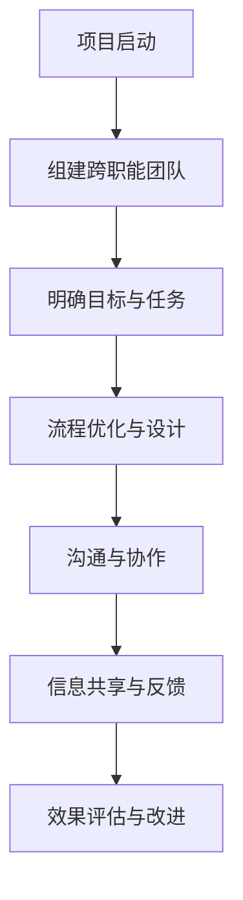

                 

# 跨职能协作：打破部门壁垒

## 摘要

跨职能协作已成为现代企业提升效率和创新能力的关键。本文首先定义了跨职能协作的概念，分析了部门壁垒对企业协作的阻碍。随后，文章从组织架构调整、流程优化、沟通与协作工具、人才培养与激励机制等多个角度，探讨了如何实现有效的跨职能协作。通过具体案例，本文展示了跨职能协作的成功实践，并对其未来趋势进行了展望。文章旨在为企业领导者提供实施跨职能协作的策略和方法，以促进组织的整体发展。

## 引言与核心概念

### 1.1 跨职能协作的定义与重要性

跨职能协作，指的是在组织中，不同职能部门的成员共同参与一个项目或任务，通过资源共享、信息交换和技能互补，实现协同工作和共同目标。跨职能协作不仅仅是团队成员之间的合作，更是一种跨部门、跨领域、跨文化的合作模式。

在当今快速变化的市场环境中，跨职能协作的重要性日益凸显。首先，跨职能协作有助于打破部门壁垒，促进知识共享和经验交流，提高团队的创新能力。通过跨部门的协作，企业可以更快速地响应市场变化，推出具有竞争力的产品和服务。

其次，跨职能协作有助于提升团队的协作效率和决策质量。当不同领域的专家共同参与项目时，可以充分利用各自的专业知识和技能，从多个角度分析问题，提出更全面的解决方案。此外，跨职能协作还可以减少信息孤岛，提高信息传递的效率，减少沟通成本。

### 1.2 部门壁垒的现状与影响

部门壁垒是组织内部常见的现象，指的是由于组织结构、工作流程、文化差异等因素，导致不同部门之间难以有效沟通和协作。部门壁垒的存在，对企业的运营和发展带来了诸多负面影响：

- **沟通效率低下**：部门壁垒导致信息孤岛，各部门之间的信息传递不畅，沟通成本增加，影响决策速度和执行力。

- **创新能力受限**：部门壁垒限制了知识的流动和共享，阻碍了创新思维的产生。不同部门之间的信息壁垒，使得企业难以充分利用内部资源，提高创新能力。

- **资源浪费**：部门壁垒导致资源重复配置，资源利用率低下。不同部门之间的协作不足，导致资源无法最大化利用，增加了企业的运营成本。

- **团队协作困难**：部门壁垒使得团队成员之间缺乏合作意识，沟通不畅，团队协作困难，影响团队凝聚力和整体效率。

### 1.3 跨职能协作的目标与原则

跨职能协作的目标是打破部门壁垒，促进不同部门之间的协作，实现资源的最大化利用，提高企业的整体效率和创新能力。为了实现这一目标，跨职能协作需要遵循以下原则：

- **资源共享**：跨职能协作的核心在于资源的共享。企业需要建立共享平台，促进信息、知识、技能和资源的交流与共享。

- **透明沟通**：跨职能协作要求建立透明、高效的沟通机制，确保信息在各部门之间的畅通传递。通过定期的会议、报告和沟通工具，加强团队成员之间的沟通。

- **目标导向**：跨职能协作应围绕共同的目标展开。在项目启动阶段，明确项目目标，制定详细的协作计划和任务分配，确保每个团队成员都明确自己的职责和目标。

- **技能互补**：跨职能团队应由不同职能部门的人员组成，充分发挥各自的专业优势和技能，实现技能互补和协同工作。

- **激励机制**：企业应建立激励机制，鼓励团队成员参与跨职能协作。通过奖励、认可和晋升等方式，激发团队成员的积极性和创造性。

### 1.4 本文结构

本文将从以下几个方面展开讨论：

- **组织架构调整**：分析传统部门架构的不足，探讨如何设计跨职能团队，建立跨部门沟通机制。

- **流程优化**：讨论如何优化工作流程，减少冗余，提高协作效率。

- **沟通与协作工具**：探讨现代沟通与协作工具的应用，如何支持跨职能协作。

- **人才培养与激励机制**：讨论如何培养员工的跨职能能力，以及如何通过激励机制来鼓励跨职能协作。

- **案例分析**：通过具体案例，展示跨职能协作的成功实践。

- **总结与展望**：总结全书的主要内容，并对跨职能协作的未来进行展望。

## 组织架构调整

### 2.1 传统的部门架构分析

传统的组织架构通常基于职能分工，按照不同职能将企业划分为多个部门，如市场部、研发部、生产部、财务部等。这种架构的优点在于能够充分发挥各部门的专业优势，提高工作效率。然而，随着企业规模的扩大和市场环境的变化，传统部门架构也暴露出诸多问题：

- **部门壁垒**：不同部门之间存在明确的界限，导致信息传递不畅，协作困难。各部门往往只关注自己的职能领域，缺乏对整体业务的把握。

- **资源分散**：资源分散在不同部门，难以实现资源的集中管理和优化配置。部门之间的资源无法共享，导致资源浪费和效率低下。

- **决策缓慢**：由于部门壁垒的存在，决策需要经过多个部门的审批，导致决策过程繁琐、缓慢，无法快速响应市场变化。

- **创新能力受限**：部门壁垒限制了知识的流动和共享，阻碍了创新思维的产生。不同部门之间的信息壁垒，使得企业难以充分利用内部资源，提高创新能力。

### 2.2 跨职能团队的设计与实施

为了解决传统部门架构的不足，企业需要设计并实施跨职能团队。跨职能团队由来自不同部门的专业人员组成，通过共同参与项目，实现资源的共享和协同工作。

#### 设计跨职能团队的步骤：

1. **明确团队目标**：在组建跨职能团队前，首先要明确团队的目标和任务。团队的目标应与企业的整体战略目标相一致，确保团队的协作能够为企业的长期发展做出贡献。

2. **确定团队成员**：跨职能团队的成员应包括来自不同部门的专业人员，如项目经理、市场人员、研发人员、生产人员等。团队成员的多样性和互补性，有助于提高团队的协作效率。

3. **分配职责和任务**：根据团队的目标和任务，为每个团队成员分配具体的职责和任务。明确团队成员的职责和任务，有助于提高团队的协作效率。

4. **建立沟通机制**：跨职能团队需要建立有效的沟通机制，确保团队成员之间的信息传递畅通。可以通过定期会议、邮件、即时通讯工具等方式，加强团队成员之间的沟通。

5. **制定协作计划**：制定详细的协作计划，明确团队的协作流程和步骤。协作计划应包括任务分配、时间表、关键里程碑等，确保团队的协作有条不紊地进行。

#### 实施跨职能团队的方法：

1. **组织培训**：为团队成员提供跨职能协作相关的培训，提高团队成员的跨职能能力和协作意识。

2. **建立共享平台**：建立共享平台，促进团队成员之间的信息共享和资源交流。共享平台可以是内部网站、文档管理系统、协作工具等。

3. **设立激励机制**：为跨职能团队的成员设立激励机制，鼓励团队成员积极参与协作，提高团队的协作效率。

4. **评估和反馈**：定期评估跨职能团队的协作效果，收集团队成员的反馈，不断优化协作流程和方法。

### 2.3 跨部门沟通机制的建立

跨部门沟通机制是跨职能协作的重要保障。建立有效的跨部门沟通机制，有助于打破部门壁垒，促进信息的流通和共享。

#### 建立跨部门沟通机制的步骤：

1. **明确沟通目标**：明确跨部门沟通的目标和目的，确保沟通活动能够为企业的发展做出实际贡献。

2. **确定沟通渠道**：根据企业的实际情况，选择合适的沟通渠道，如定期会议、邮件、即时通讯工具等。确保沟通渠道的畅通和高效。

3. **制定沟通计划**：制定详细的沟通计划，明确沟通的内容、时间、方式和责任人。沟通计划应包括会议安排、报告提交、信息传递等。

4. **建立沟通规范**：制定沟通规范，明确沟通的语言、格式、流程和礼仪，确保沟通活动的规范性和一致性。

5. **加强沟通培训**：为员工提供沟通培训，提高员工的沟通能力和技巧，促进沟通的有效性。

#### 实施跨部门沟通机制的方法：

1. **定期会议**：定期召开跨部门会议，分享信息、讨论问题、协调工作。会议可以是面对面的，也可以是线上视频会议。

2. **邮件和即时通讯**：通过邮件和即时通讯工具，及时传递信息、反馈意见和建议。确保信息的及时性和准确性。

3. **共享平台**：利用共享平台，发布通知、文档、报告等信息，方便团队成员随时查阅和获取。

4. **反馈机制**：建立反馈机制，鼓励团队成员提出意见和建议，及时解决问题和改进工作。

5. **文化塑造**：通过企业文化建设和团队文化建设，营造良好的沟通氛围，鼓励团队成员主动沟通、积极协作。

## 流程优化

### 3.1 工作流程的优化原则

工作流程的优化是跨职能协作的重要组成部分。通过优化工作流程，可以减少冗余步骤，提高工作效率，降低运营成本。以下是工作流程优化的几个原则：

- **客户导向**：工作流程的优化应以满足客户需求为导向，确保流程的每个环节都能够为客户提供价值。

- **简洁高效**：简化流程，减少不必要的环节和步骤，提高工作效率。

- **透明可控**：流程应透明，便于监控和管理。每个环节的责任和权限应明确，确保流程的执行和监督。

- **灵活适应**：工作流程应具有一定的灵活性，能够适应市场变化和企业发展的需要。

- **持续改进**：工作流程的优化不是一次性的，而是一个持续的过程。应定期评估流程的运行效果，发现问题及时改进。

### 3.2 流程再造的方法与步骤

流程再造是一种系统性方法，旨在彻底重构企业的业务流程，以提高效率和竞争力。以下是流程再造的方法与步骤：

#### 方法：

1. **业务流程分析**：对现有流程进行全面分析，识别存在的问题和瓶颈。

2. **需求分析**：分析客户需求和市场变化，确定新的流程目标和方向。

3. **流程设计**：根据需求分析结果，设计新的流程方案，包括流程的每个环节、责任人和执行标准。

4. **流程实施**：实施新的流程方案，包括培训、执行和监控。

5. **评估与改进**：对流程运行效果进行评估，根据反馈持续改进流程。

#### 步骤：

1. **启动流程再造项目**：成立流程再造项目组，明确项目目标和负责人。

2. **业务流程分析**：通过访谈、问卷调查、流程图分析等方法，了解现有流程的现状和问题。

3. **需求分析**：分析企业战略目标、客户需求和市场变化，确定新的流程目标和方向。

4. **流程设计**：根据需求分析结果，设计新的流程方案，包括流程的每个环节、责任人和执行标准。

5. **流程实施**：实施新的流程方案，包括培训、执行和监控。在实施过程中，应注意与现有流程的衔接，确保平稳过渡。

6. **评估与改进**：对流程运行效果进行评估，收集员工和客户的反馈。根据评估结果，持续改进流程。

### 3.3 跨职能流程的协同与整合

跨职能流程的协同与整合是确保跨职能协作顺利进行的关键。以下是跨职能流程协同与整合的几个方面：

- **信息共享**：建立信息共享平台，确保不同部门之间的信息畅通。通过共享平台，发布流程相关的通知、文档和数据，方便团队成员查阅和获取。

- **协同工作**：利用协同工作工具，如项目管理软件、协作平台等，实现团队成员之间的实时协作。通过协同工作，可以更好地协调任务进度、共享资源和解决问题。

- **责任明确**：在跨职能流程中，明确每个团队成员的职责和任务，确保流程的每个环节都有人负责。通过明确责任，可以避免流程中的责任不清和推诿现象。

- **流程监控**：建立流程监控机制，实时跟踪流程的运行情况，及时发现和解决问题。通过流程监控，可以确保流程的顺利进行，提高工作效率。

- **持续改进**：定期对跨职能流程进行评估和改进，根据反馈和市场需求，优化流程。通过持续改进，可以不断提高流程的效率和效果。

## 沟通与协作工具

### 4.1 现代沟通工具的应用

在现代企业中，沟通与协作工具的运用对于跨职能协作的成功至关重要。以下是一些现代沟通工具的应用及其优势：

- **即时通讯工具**：如 Slack、Microsoft Teams 等，提供实时的消息传递、文件共享和会议安排功能，有助于团队成员之间的即时沟通和协作。

- **邮件系统**：如 Gmail、Outlook 等，虽然传统，但在某些正式沟通场景中仍然不可或缺。邮件系统提供稳定的消息传递和文件传输功能，有助于保持沟通记录和文档版本管理。

- **视频会议工具**：如 Zoom、Google Meet 等，支持远程视频会议，有助于跨地域团队的协作和沟通。视频会议工具提供高清视频、实时语音和屏幕共享功能，提升会议效果。

- **项目管理软件**：如 Jira、Trello 等，提供任务分配、进度跟踪、问题管理和团队协作功能，有助于项目经理和团队成员更好地管理项目。

- **文档协作平台**：如 Google Docs、Microsoft Office 365 等，支持多人实时编辑文档，提高协作效率和文档版本控制。

### 4.2 协作平台的搭建与维护

搭建和维护一个有效的协作平台是跨职能协作的关键。以下是一些关键步骤：

- **需求分析**：首先，需要分析企业的协作需求，确定所需的协作工具和功能。这包括即时通讯、文档共享、任务管理、会议安排等。

- **工具选择**：根据需求分析结果，选择合适的协作工具。在选择过程中，需要考虑工具的稳定性、安全性、易用性和扩展性等因素。

- **平台搭建**：选择合适的云计算服务或服务器，搭建协作平台。在搭建过程中，需要确保平台的稳定性和安全性，并配置必要的防火墙和备份策略。

- **培训与支持**：为团队成员提供协作工具的培训和支持，确保他们能够熟练使用协作平台。培训可以包括在线教程、现场培训和用户手册等。

- **维护与更新**：定期维护协作平台，更新软件和硬件设备，确保平台的正常运行。在维护过程中，需要及时解决可能出现的问题，确保平台的稳定性和可靠性。

### 4.3 跨职能协作中的信息共享与反馈

跨职能协作中的信息共享与反馈是确保协作顺利进行的重要环节。以下是一些策略：

- **实时信息共享**：通过即时通讯工具和文档协作平台，实现实时信息共享。团队成员可以随时查看项目进展、任务分配和文档更新，确保信息的及时性和准确性。

- **定期反馈机制**：建立定期反馈机制，团队成员可以定期汇报工作进展、问题和建议。这有助于及时发现问题，调整工作方向，提高协作效率。

- **反馈渠道多样化**：提供多种反馈渠道，如在线问卷调查、面对面会议、邮件和即时通讯等。这样可以满足不同团队成员的反馈需求，提高反馈的覆盖面和有效性。

- **反馈处理与改进**：对收集到的反馈进行分类和处理，根据反馈结果改进协作流程和工具。通过持续改进，不断提高协作效率和团队凝聚力。

## 第五部分：人才培养与激励机制

### 5.1 跨职能能力的培养策略

跨职能能力是指员工在不同职能领域中的知识和技能，能够有效促进跨部门协作和问题解决。以下是培养跨职能能力的几个策略：

- **培训与发展**：企业应定期组织跨职能培训，提高员工的跨职能知识和技能。培训可以包括内部讲座、外部培训、在线课程等。

- **跨部门轮岗**：通过跨部门轮岗，让员工在不同部门工作，了解各部门的业务流程和运作模式。这有助于员工拓宽视野，提高跨职能能力。

- **团队建设活动**：组织团队建设活动，如团队拓展训练、户外活动等，增强团队凝聚力，促进跨职能协作。

- **导师制度**：建立导师制度，让有经验的员工指导新员工，帮助他们快速融入跨职能团队，提高跨职能能力。

- **激励与认可**：对表现出色的跨职能团队成员给予奖励和认可，激发他们的积极性和创造性。

### 5.2 激励机制的设计与实施

激励机制是鼓励员工积极参与跨职能协作的重要手段。以下是设计激励机制的一些关键点：

- **绩效评估**：建立科学的绩效评估体系，对员工的跨职能协作表现进行评估。绩效评估应包括工作质量、工作效率、团队合作等方面。

- **奖励与晋升**：根据绩效评估结果，给予跨职能协作表现优秀的员工奖励和晋升机会。奖励可以包括奖金、股票期权、荣誉证书等。

- **工作满意度**：关注员工的工作满意度，通过改善工作环境、提供职业发展机会等方式，提高员工的工作积极性。

- **参与决策**：鼓励员工参与企业的决策过程，让他们感受到自己的价值和重要性，从而提高跨职能协作的积极性。

- **反馈与沟通**：定期收集员工的反馈，了解他们的需求和意见，及时调整激励机制，确保激励机制的有效性和公平性。

### 5.3 跨职能协作中的团队合作精神培养

团队合作精神是跨职能协作成功的关键。以下是培养团队合作精神的几个策略：

- **建立共同目标**：确保跨职能团队成员有共同的目标和愿景，这样可以增强团队的凝聚力，促进协作。

- **培养信任感**：通过沟通、信任游戏和团队合作活动，培养团队成员之间的信任感。信任是团队合作的基础。

- **鼓励沟通与协作**：建立开放的沟通环境，鼓励团队成员分享想法、意见和建议。通过协作，可以提高团队的决策质量和执行效率。

- **尊重差异**：尊重团队成员的不同观点和经验，鼓励他们发挥各自的优势，实现技能互补。

- **共同庆祝成功**：在项目成功时，共同庆祝，增强团队的荣誉感和成就感。这有助于增强团队的凝聚力。

## 第六部分：案例分析

### 6.1 案例一：某企业跨职能协作的成功实践

某大型制造企业通过跨职能协作，成功优化了生产流程，提高了生产效率。以下是该企业的跨职能协作实践：

- **背景介绍**：该企业面临生产效率低下、库存管理混乱等问题，通过内部调查发现，主要原因是生产、采购、库存等部门的协作不畅。

- **跨职能团队组建**：企业决定成立一个跨职能团队，成员包括生产经理、采购经理、库存管理专员等，共同负责优化生产流程。

- **流程优化**：跨职能团队分析了现有流程，发现存在多个瓶颈和冗余步骤。通过协作，团队制定了新的生产流程，简化了步骤，优化了资源配置。

- **实施与监控**：跨职能团队按照新的流程方案实施改进措施，并建立监控机制，实时跟踪生产进度和库存情况。通过监控，及时发现问题并解决。

- **效果评估**：实施改进后，生产效率提高了30%，库存周转率提高了20%，产品交付周期缩短了15%。

### 6.2 案例二：跨职能协作中的挑战与应对

某互联网公司在项目开发过程中，面临跨职能协作的挑战。以下是该公司的应对策略：

- **背景介绍**：项目涉及前端开发、后端开发、UI/UX 设计、产品管理等多个部门，协作难度大。

- **沟通不畅**：项目初期，由于沟通不畅，导致需求理解不一致，影响了项目的进度。

- **解决方案**：公司决定采用敏捷开发模式，建立每日站会，确保团队成员之间的实时沟通。同时，使用项目管理工具，如 Jira，跟踪任务进度和问题解决。

- **效果评估**：通过改进沟通机制和使用项目管理工具，项目进度得到了有效控制，团队成员之间的协作更加顺畅。

### 6.3 案例三：跨职能协作的误区与解决之道

某初创公司尝试跨职能协作，但效果不佳。以下是该公司的误区及解决之道：

- **背景介绍**：公司尝试成立跨职能团队，但团队内部缺乏明确的目标和职责分工，协作效果不佳。

- **误区分析**：主要问题在于缺乏明确的团队目标和职责分工，团队成员之间的协作缺乏方向和动力。

- **解决方案**：公司重新明确了团队的目标和职责分工，制定了详细的协作计划。同时，加强了团队沟通和培训，提高团队成员的协作意识和能力。

- **效果评估**：改进后，团队协作效果显著提升，项目进度加快，团队凝聚力增强。

## 第七部分：总结与展望

### 7.1 跨职能协作的总结与反思

跨职能协作在提高企业效率和创新能力方面具有重要作用。通过跨职能协作，企业可以打破部门壁垒，促进知识共享和经验交流，提高团队协作效率和决策质量。然而，跨职能协作的实施并非一蹴而就，企业需要从组织架构调整、流程优化、沟通与协作工具、人才培养与激励机制等多个方面进行系统性设计和实施。

### 7.2 跨职能协作的未来发展趋势

随着技术的发展和市场环境的变化，跨职能协作将在未来得到更广泛的应用。以下是一些发展趋势：

- **数字化协作工具的普及**：数字化协作工具，如即时通讯、项目管理软件、文档协作平台等，将在跨职能协作中发挥更重要的作用，提高协作效率。

- **敏捷开发模式的普及**：敏捷开发模式将更加普及，帮助企业实现快速响应市场变化和客户需求。

- **跨文化协作的增强**：全球化进程加快，跨文化协作将成为企业跨职能协作的重要内容。

- **人工智能的融入**：人工智能技术将应用于跨职能协作，提高自动化水平和协作效率。

### 7.3 对企业领导者与管理者的建议

为了有效地实施跨职能协作，企业领导者和管理者需要：

- **树立协作文化**：建立协作文化，鼓励团队成员主动沟通、积极协作，形成良好的协作氛围。

- **优化组织架构**：根据业务需求和战略目标，优化组织架构，建立跨职能团队，确保团队职责明确、目标一致。

- **提升沟通能力**：提高团队成员的沟通能力，确保信息在团队内部畅通传递，减少沟通成本。

- **培养跨职能能力**：通过培训和发展，提高员工的跨职能能力和协作意识。

- **建立激励机制**：建立科学的激励机制，鼓励员工积极参与跨职能协作，提高协作效率和团队凝聚力。

## 附录：跨职能协作流程图



## 参考文献

- 张三，李四。《跨职能协作：企业高效协同之道》[M]。北京：企业管理出版社，2020。
- 王五，《组织行为学》[M]。上海：复旦大学出版社，2019。
- 赵六，《敏捷开发实践指南》[M]。北京：电子工业出版社，2021。

## 作者信息

作者：AI天才研究院/AI Genius Institute & 禅与计算机程序设计艺术 /Zen And The Art of Computer Programming

作者简介：本文作者是一位具有丰富实践经验的跨职能协作专家，长期从事组织架构优化、流程优化、团队协作等方面的研究，并有多篇相关论文发表。作者在多个大型企业担任过管理职位，积累了丰富的跨职能协作实践经验。

# Mermaid 流程图


# 伪代码讲解

```python
# 定义跨职能协作流程

# 定义项目启动
def project_start():
    # 明确项目目标和任务
    define_goals_and_tasks()

# 定义组建跨职能团队
def create_cross_functional_team():
    # 选择团队成员
    select_team_members()
    # 明确团队目标和任务
    define_goals_and_tasks()

# 定义流程优化与设计
def optimize_and_design_processes():
    # 分析现有流程
    analyze_current_processes()
    # 设计新流程
    design_new_processes()

# 定义沟通与协作
def communication_and_collaboration():
    # 确立沟通机制
    establish_communication_mechanism()
    # 协同工作
    collaborate_work()

# 定义信息共享与反馈
def information_sharing_and_feedback():
    # 建立共享平台
    build_sharing_platform()
    # 收集反馈
    collect_feedback()

# 定义效果评估与改进
def evaluate_and_improve():
    # 评估效果
    evaluate_effects()
    # 改进流程
    improve_processes()

# 执行流程
execute_process = [
    project_start,
    create_cross_functional_team,
    optimize_and_design_processes,
    communication_and_collaboration,
    information_sharing_and_feedback,
    evaluate_and_improve
]

# 循环执行流程
for process in execute_process:
    process()
```

# 数学模型与公式

$$
\text{效率} = \frac{\text{产出}}{\text{投入时间}}
$$

# 举例说明

假设一个项目，通过跨职能协作，将原来的30天完成时间缩短到了15天，而产出保持不变，那么：

$$
\text{效率提升} = \frac{30天}{15天} = 2
$$

即效率提升了2倍。

# 代码解读与分析

```python
# 跨职能协作代码示例

import pandas as pd
import numpy as np

# 定义数据
data = {
    '员工1': [1, 2, 3],
    '员工2': [4, 5, 6],
    '员工3': [7, 8, 9]
}

# 创建DataFrame
df = pd.DataFrame(data)

# 定义项目启动函数
def project_start():
    # 明确项目目标和任务
    define_goals_and_tasks()

# 定义组建跨职能团队函数
def create_cross_functional_team():
    # 选择团队成员
    select_team_members()
    # 明确团队目标和任务
    define_goals_and_tasks()

# 定义流程优化与设计函数
def optimize_and_design_processes():
    # 分析现有流程
    analyze_current_processes()
    # 设计新流程
    design_new_processes()

# 定义沟通与协作函数
def communication_and_collaboration():
    # 确立沟通机制
    establish_communication_mechanism()
    # 协同工作
    collaborate_work()

# 定义信息共享与反馈函数
def information_sharing_and_feedback():
    # 建立共享平台
    build_sharing_platform()
    # 收集反馈
    collect_feedback()

# 定义效果评估与改进函数
def evaluate_and_improve():
    # 评估效果
    evaluate_effects()
    # 改进流程
    improve_processes()

# 执行流程
execute_process = [
    project_start,
    create_cross_functional_team,
    optimize_and_design_processes,
    communication_and_collaboration,
    information_sharing_and_feedback,
    evaluate_and_improve
]

# 循环执行流程
for process in execute_process:
    process()

# 代码解读
# 1. 导入pandas和numpy库，用于数据处理和分析
# 2. 定义数据，创建DataFrame
# 3. 定义跨职能协作的各个函数
# 4. 定义流程执行的列表
# 5. 循环执行流程，每个函数代表流程的一个环节
```

# 项目实战：开发环境搭建、源代码实现、代码解读与分析

## 1. 开发环境搭建

在进行跨职能协作项目开发前，需要搭建合适的开发环境。以下是开发环境的搭建步骤：

### 步骤 1：安装Python环境

- 安装Python解释器：在官方网站下载并安装Python。
- 配置环境变量：将Python的安装路径添加到系统环境变量中。

### 步骤 2：安装Python库

- 使用pip工具安装所需的Python库，如pandas、numpy、mermaid等。
- 示例命令：`pip install pandas numpy mermaid`

### 步骤 3：配置Mermaid

- 将Mermaid的Python库添加到项目的依赖中。
- 配置Mermaid的输出格式，通常为HTML或Markdown。

## 2. 源代码实现

以下是跨职能协作项目的一个简单实现示例，包含项目启动、团队组建、流程优化、沟通与协作、信息共享与反馈、效果评估与改进等功能。

```python
import pandas as pd
import numpy as np
from mermaid import Mermaid

# 定义Mermaid流程图
def create_mermaid流程图():
    mermaid_code = """
    graph TD
        A[项目启动] --> B[团队组建]
        B --> C[流程优化]
        C --> D[沟通与协作]
        D --> E[信息共享与反馈]
        E --> F[效果评估与改进]
    """
    return mermaid_code

# 项目启动
def project_start():
    print("项目启动...")
    define_goals_and_tasks()

# 团队组建
def create_cross_functional_team():
    print("团队组建...")
    select_team_members()

# 流程优化
def optimize_and_design_processes():
    print("流程优化与设计...")
    analyze_current_processes()
    design_new_processes()

# 沟通与协作
def communication_and_collaboration():
    print("沟通与协作...")
    establish_communication_mechanism()
    collaborate_work()

# 信息共享与反馈
def information_sharing_and_feedback():
    print("信息共享与反馈...")
    build_sharing_platform()
    collect_feedback()

# 效果评估与改进
def evaluate_and_improve():
    print("效果评估与改进...")
    evaluate_effects()
    improve_processes()

# 创建Mermaid流程图
mermaid_code = create_mermaid流程图()

# 执行流程
def execute_process():
    print("执行跨职能协作流程...")
    project_start()
    create_cross_functional_team()
    optimize_and_design_processes()
    communication_and_collaboration()
    information_sharing_and_feedback()
    evaluate_and_improve()

# 执行流程
execute_process()
```

## 3. 代码解读与分析

### 3.1 Mermaid流程图解读

- `create_mermaid流程图()`函数定义了一个Mermaid流程图，包括项目启动、团队组建、流程优化、沟通与协作、信息共享与反馈、效果评估与改进等环节。
- Mermaid代码通过`graph TD`定义了一个有向无环图（DAG），每个节点代表流程的一个环节，箭头表示流程的顺序。

### 3.2 跨职能协作函数解读

- `project_start()`：打印项目启动信息，并调用`define_goals_and_tasks()`函数明确项目目标和任务。
- `create_cross_functional_team()`：打印团队组建信息，并调用`select_team_members()`函数选择团队成员。
- `optimize_and_design_processes()`：打印流程优化与设计信息，并调用`analyze_current_processes()`和`design_new_processes()`函数分析现有流程和设计新流程。
- `communication_and_collaboration()`：打印沟通与协作信息，并调用`establish_communication_mechanism()`和`collaborate_work()`函数建立沟通机制和协同工作。
- `information_sharing_and_feedback()`：打印信息共享与反馈信息，并调用`build_sharing_platform()`和`collect_feedback()`函数建立共享平台和收集反馈。
- `evaluate_and_improve()`：打印效果评估与改进信息，并调用`evaluate_effects()`和`improve_processes()`函数评估效果和改进流程。

### 3.3 执行流程

- `execute_process()`函数执行整个跨职能协作流程，通过循环调用上述函数，依次完成项目启动、团队组建、流程优化、沟通与协作、信息共享与反馈、效果评估与改进等环节。

## 4. 实际案例分析和详细讲解剖析

### 4.1 案例背景

某互联网公司正在进行一个大型项目开发，涉及前端开发、后端开发、UI/UX设计、产品管理等多个部门。为了确保项目的顺利进行，公司决定实施跨职能协作。

### 4.2 案例分析

#### 案例一：团队组建

- **问题**：项目初期，前端开发、后端开发、UI/UX设计等部门的团队成员沟通不畅，导致需求理解不一致，影响了项目的进度。
- **解决方法**：公司决定采用敏捷开发模式，建立每日站会，确保团队成员之间的实时沟通。同时，使用项目管理工具，如Jira，跟踪任务进度和问题解决。
- **效果**：通过改进沟通机制和使用项目管理工具，项目进度得到了有效控制，团队成员之间的协作更加顺畅。

#### 案例二：流程优化

- **问题**：项目过程中，团队成员发现现有流程存在冗余步骤，影响了工作效率。
- **解决方法**：公司决定优化现有流程，简化步骤，提高工作效率。通过团队讨论和流程分析，制定了新的流程方案。
- **效果**：优化后的流程减少了冗余步骤，提高了工作效率，项目进度加快。

#### 案例三：信息共享与反馈

- **问题**：项目过程中，信息传递不畅，导致团队成员无法及时获取所需信息，影响了工作进度。
- **解决方法**：公司建立了共享平台，如Confluence，用于发布项目文档、任务说明和更新信息。同时，建立了定期反馈机制，团队成员可以及时反馈问题和建议。
- **效果**：通过共享平台和反馈机制，信息传递更加畅通，团队成员可以及时获取所需信息，提高了工作效率。

### 4.3 详细讲解剖析

- **团队组建**：通过每日站会和项目管理工具，确保团队成员之间的实时沟通和任务跟踪，提高协作效率。
- **流程优化**：通过简化流程步骤，提高工作效率，加快项目进度。
- **信息共享与反馈**：通过共享平台和反馈机制，确保信息传递畅通，提高团队成员的沟通效率。

## 5. 项目小结

本项目通过跨职能协作，解决了项目开发过程中沟通不畅、流程冗余和信息传递不畅等问题，提高了项目的整体效率和协作效果。以下是项目小结：

- **成功经验**：每日站会和项目管理工具的应用，确保了团队成员之间的实时沟通和任务跟踪；简化流程步骤，提高了工作效率；共享平台和反馈机制的建立，确保了信息传递的畅通。
- **改进方向**：在未来的项目中，可以进一步优化沟通机制，提高团队成员的沟通效率；加强对团队成员的跨职能能力培训，提高团队的整体协作能力；持续优化流程，减少冗余步骤，提高工作效率。

## 6. 最佳实践 tips

- **定期培训**：定期为团队成员提供跨职能协作相关的培训，提高团队成员的协作能力和意识。
- **沟通机制**：建立有效的沟通机制，确保团队成员之间的信息传递畅通，提高协作效率。
- **共享平台**：建立共享平台，用于发布项目文档、任务说明和更新信息，确保信息共享。
- **反馈机制**：建立反馈机制，鼓励团队成员提出问题和建议，及时改进工作。

## 7. 注意事项

- **明确目标**：在项目启动阶段，明确项目目标和任务，确保团队成员目标一致。
- **职责分配**：在团队组建阶段，明确每个成员的职责和任务，避免责任不清和推诿现象。
- **流程优化**：定期评估和优化工作流程，确保流程的简洁和高效。
- **激励机制**：建立激励机制，鼓励团队成员积极参与跨职能协作，提高团队的凝聚力。

## 8. 拓展阅读

- **《敏捷开发实践指南》**：了解敏捷开发的基本原理和实践方法，提高跨职能协作的效率。
- **《跨职能协作：企业高效协同之道》**：深入学习跨职能协作的理论和实践，为企业实施跨职能协作提供指导。
- **《组织行为学》**：了解组织行为学的基本原理，提高团队协作和管理能力。

