                 


### 1.1 跨职能团队的概念与定义

#### 1.1.1 跨职能团队与传统团队的区别

**背景介绍**：

在传统的组织结构中，团队往往根据职能进行划分，如市场部、研发部、运营部等。这种组织方式在资源分配和管理上相对简单，但也存在一些问题。例如，部门之间的信息壁垒可能导致协作不畅，影响项目进展和整体效率。为了应对这些挑战，跨职能团队的概念应运而生。

**核心概念与联系**：

跨职能团队是将不同职能部门的人员整合到一个团队中，共同完成一个项目或任务的团队。其核心特点是融合多种职能，通过协作实现共同目标。以下使用Mermaid流程图展示跨职能团队与传统团队的区别：

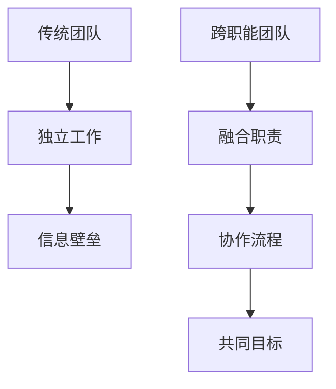

在这个流程图中，A表示传统团队，B表示独立工作，C表示信息壁垒；D表示跨职能团队，E表示融合职责，F表示协作流程，G表示共同目标。通过对比可以看出，跨职能团队在职责融合、协作流程和共同目标上与传统团队有显著差异。

**核心算法原理讲解**：

跨职能团队的协作可以通过以下伪代码来模拟：

```python
# 伪代码：跨职能团队协作算法
def cross_functional_team_collaboration():
    # 初始化团队成员
    team_members = ["市场营销专员", "研发工程师", "运营专员", "产品经理"]

    # 定义任务
    tasks = {
        "市场需求分析": ["市场营销专员", "产品经理"],
        "产品开发": ["研发工程师", "产品经理"],
        "市场推广": ["市场营销专员", "产品经理"],
        "数据反馈与优化": ["运营专员", "产品经理"]
    }

    # 执行任务
    for task, members in tasks.items():
        print(f"开始执行任务：{task}")
        for member in members:
            print(f"{member}正在参与任务：{task}")
        print("任务完成。\n")

# 调用协作算法
cross_functional_team_collaboration()
```

在这个伪代码中，我们定义了一个跨职能团队的协作过程，包括初始化团队成员、定义任务和执行任务。团队成员根据任务需求进行协作，实现共同目标。

**数学模型和公式**：

为了量化跨职能团队协作的效果，我们可以使用以下数学模型：

$$
E = \sum_{i=1}^{n} (T_i - T_{i0})
$$

其中，$E$表示跨职能团队协作的总效率提升，$T_i$表示单个团队成员完成任务的时间，$T_{i0}$表示团队成员在独立完成任务的时间。

**举例说明**：

假设在一个项目中，市场营销专员、研发工程师、运营专员和产品经理分别需要4天、6天、5天和7天完成各自的任务。如果他们独立工作，总时间为22天。而通过跨职能团队的协作，他们共同完成任务的时间为14天。那么，跨职能团队的协作效率提升为：

$$
E = (4 + 6 + 5 + 7) - 22 = 8
$$

这意味着跨职能团队协作使任务完成时间减少了8天，效率提升了8天。

### 1.2 跨职能团队的架构与组织

#### 1.2.1 跨职能团队的组织结构

**背景介绍**：

跨职能团队的组织结构是确保团队成员高效协作的关键。一个成功的跨职能团队需要清晰的角色划分、明确的职责和高效的沟通机制。

**核心概念与联系**：

跨职能团队的组织结构通常包括以下几个角色：

- **项目经理**：负责整个团队的项目规划、进度控制和资源分配。
- **技术专家**：负责技术方案的设计和实施。
- **市场专员**：负责市场需求的收集和分析。
- **产品经理**：负责产品规划和迭代。
- **运营专员**：负责运营数据的分析和优化。

以下使用Mermaid流程图展示跨职能团队的组织结构：

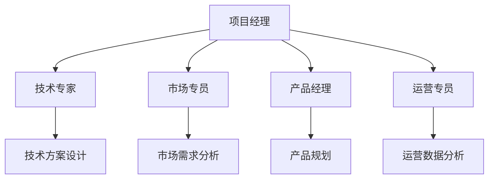

在这个流程图中，A表示项目经理，B表示技术专家，C表示市场专员，D表示产品经理，E表示运营专员。每个角色都承担特定的职责，并通过协作实现团队目标。

**核心算法原理讲解**：

跨职能团队的组织结构可以通过以下伪代码来模拟：

```python
# 伪代码：跨职能团队组织结构
class CrossFunctionalTeam:
    def __init__(self, project_manager, technical_expert, market_specialist, product_manager, operations_specialist):
        self.project_manager = project_manager
        self.technical_expert = technical_expert
        self.market_specialist = market_specialist
        self.product_manager = product_manager
        self.operations_specialist = operations_specialist

    def execute_tasks(self):
        print(f"项目由项目经理：{self.project_manager}领导，开始执行任务。")
        self.technical_expert.design_technical_solution()
        self.market_specialist.analyze_market_demand()
        self.product_manager.plan_products()
        self.operations_specialist.analyze_operational_data()
        print("任务完成。")

# 创建跨职能团队实例
team = CrossFunctionalTeam("张三", "李四", "王五", "赵六", "孙七")

# 执行任务
team.execute_tasks()
```

在这个伪代码中，我们定义了一个跨职能团队的类，包括项目经理、技术专家、市场专员、产品经理和运营专员。每个成员都承担特定的任务，并通过execute_tasks方法实现团队目标。

**数学模型和公式**：

为了量化跨职能团队的协作效率，我们可以使用以下数学模型：

$$
E = \frac{1}{n} \sum_{i=1}^{n} (T_i - T_{i0})
$$

其中，$E$表示跨职能团队的协作效率提升，$T_i$表示单个团队成员完成任务的时间，$T_{i0}$表示团队成员在独立完成任务的时间，$n$表示团队成员数量。

**举例说明**：

假设在一个项目中，5名团队成员独立完成任务的时间分别为4天、6天、5天、7天和3天。如果他们组成跨职能团队，总时间为15天。那么，跨职能团队的协作效率提升为：

$$
E = \frac{1}{5} \sum_{i=1}^{5} (T_i - T_{i0}) = \frac{1}{5} (4 + 6 + 5 + 7 + 3) - 15 = 2
$$

这意味着跨职能团队协作使任务完成时间减少了2天，效率提升了2天。

### 1.3 跨职能团队的文化建设

#### 1.3.1 建立共同的目标和价值观

**背景介绍**：

跨职能团队的成功不仅依赖于高效的协作和组织结构，还需要团队成员之间建立共同的目标和价值观。共同的目标和价值观有助于增强团队的凝聚力，提高协作效率。

**核心概念与联系**：

建立共同的目标和价值观可以通过以下步骤实现：

1. **明确团队目标**：确保每个成员都了解团队的目标，并认同这个目标。
2. **共享价值观**：通过讨论和沟通，找到团队成员共同认可的价值观。
3. **制定团队文化规范**：将共同的目标和价值观转化为具体的行为规范，指导团队成员的行为。

以下使用Mermaid流程图展示建立共同的目标和价值观的步骤：

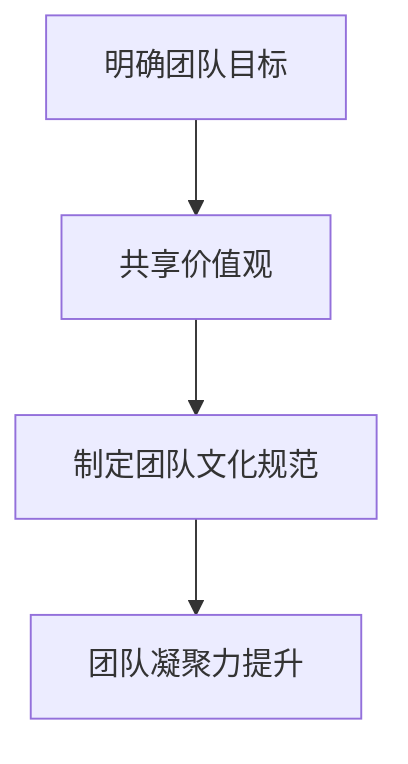

在这个流程图中，A表示明确团队目标，B表示共享价值观，C表示制定团队文化规范，D表示团队凝聚力提升。通过这些步骤，团队可以建立共同的目标和价值观。

**核心算法原理讲解**：

建立共同的目标和价值观可以通过以下伪代码来模拟：

```python
# 伪代码：建立共同的目标和价值观
def build_common_goals_and_values(team_members):
    # 征询团队成员的目标
    goals = []
    for member in team_members:
        goals.append(input(f"{member}的目标："))

    # 征询团队成员的价值观
    values = []
    for member in team_members:
        values.append(input(f"{member}的价值观："))

    # 统一目标
    unified_goals = unify_goals(goals)
    print(f"统一的目标：{unified_goals}")

    # 统一价值观
    unified_values = unify_values(values)
    print(f"统一的价值观：{unified_values}")

    # 制定团队文化规范
    cultural_norms = define_cultural_norms(unified_goals, unified_values)
    print(f"团队文化规范：{cultural_norms}")

# 调用建立共同目标和价值观函数
build_common_goals_and_values(["张三", "李四", "王五"])
```

在这个伪代码中，我们定义了一个函数build_common_goals_and_values，用于建立共同的目标和价值观。通过征询团队成员的目标和价值观，统一目标和价值观，并制定团队文化规范。

**数学模型和公式**：

为了量化共同的目标和价值观对团队凝聚力的影响，我们可以使用以下数学模型：

$$
C = \alpha \cdot G + \beta \cdot V
$$

其中，$C$表示团队凝聚力，$\alpha$和$\beta$为权重系数，$G$表示共同目标的实现程度，$V$表示共同价值观的认同程度。

**举例说明**：

假设在一个团队中，共同目标的实现程度为80%，共同价值观的认同程度为90%。根据上述公式，团队凝聚力为：

$$
C = \alpha \cdot G + \beta \cdot V = 0.8 \cdot G + 0.9 \cdot V
$$

这意味着共同的目标和价值观对团队凝聚力有显著影响。

### 2.1 领导者的角色转变

#### 2.1.1 从命令式到赋能式的领导

**背景介绍**：

在跨职能团队中，领导者的角色至关重要。传统的命令式领导方式往往强调控制和管理，而赋能式领导则更注重激发团队成员的潜力和创造力。领导者需要从命令式向赋能式转变，以适应跨职能团队的工作环境。

**核心概念与联系**：

赋能式领导的核心是信任、支持和授权。以下使用Mermaid流程图展示赋能式领导与传统命令式领导的区别：

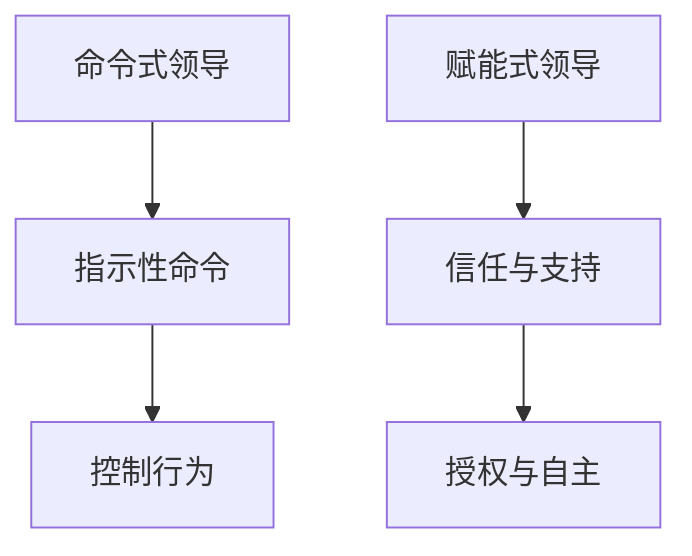

在这个流程图中，A表示命令式领导，B表示指示性命令，C表示控制行为；D表示赋能式领导，E表示信任与支持，F表示授权与自主。通过对比可以看出，赋能式领导更注重信任、支持和授权，鼓励团队成员自主发挥。

**核心算法原理讲解**：

赋能式领导可以通过以下伪代码来模拟：

```python
# 伪代码：赋能式领导
class EmpoweringLeader:
    def __init__(self, team_members):
        self.team_members = team_members

    def trust_and_support(self):
        print("信任和支持团队成员，鼓励他们提出建议和想法。")

    def delegate_authority(self):
        print("授权团队成员，让他们自主决策和执行任务。")

    def motivate_teams(self):
        print("激励团队成员，认可他们的努力和成就。")

# 创建赋能式领导者实例
leader = EmpoweringLeader(["张三", "李四", "王五"])

# 执行赋能式领导行为
leader.trust_and_support()
leader.delegate_authority()
leader.motivate_teams()
```

在这个伪代码中，我们定义了一个赋能式领导者类，包括信任和支持、授权和自主、激励团队成员等方法。领导者通过这些方法激发团队成员的潜力。

**数学模型和公式**：

为了量化赋能式领导的效果，我们可以使用以下数学模型：

$$
M = \alpha \cdot T + \beta \cdot A + \gamma \cdot E
$$

其中，$M$表示团队士气，$\alpha$、$\beta$和$\gamma$为权重系数，$T$表示信任与支持的程度，$A$表示授权与自主的程度，$E$表示激励程度。

**举例说明**：

假设在一个团队中，信任与支持的程度为80%，授权与自主的程度为90%，激励程度为85%。根据上述公式，团队士气为：

$$
M = \alpha \cdot T + \beta \cdot A + \gamma \cdot E = 0.8 \cdot T + 0.9 \cdot A + 0.85 \cdot E
$$

这意味着赋能式领导对团队士气有显著提升。

### 2.2 打破部门壁垒的策略

#### 2.2.1 分析部门壁垒的成因

**背景介绍**：

部门壁垒是跨职能团队面临的常见问题，它可能导致协作不畅、信息不对称和资源浪费。为了有效打破部门壁垒，我们需要深入分析其成因。

**核心概念与联系**：

部门壁垒的成因可以从以下几个方面进行分析：

1. **组织结构**：传统的职能化组织结构可能导致部门之间的隔阂。
2. **文化差异**：不同部门可能有不同的工作方式、价值观和行为规范。
3. **沟通不畅**：部门之间的信息交流不畅，可能导致误解和冲突。
4. **资源限制**：部门之间的资源分配不均，可能导致某些部门过度依赖其他部门。

以下使用Mermaid流程图展示部门壁垒的成因：

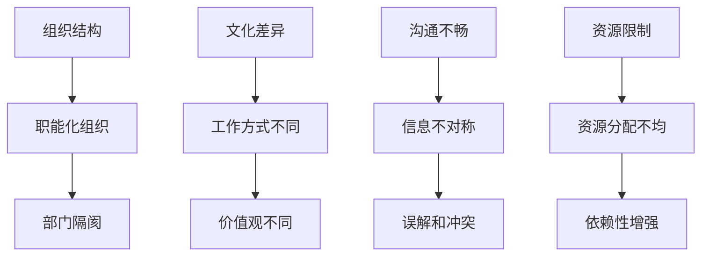

在这个流程图中，A表示组织结构，B表示职能化组织，C表示部门隔阂；D表示文化差异，E表示工作方式不同，F表示价值观不同；G表示沟通不畅，H表示信息不对称，I表示误解和冲突；J表示资源限制，K表示资源分配不均，L表示依赖性增强。通过对比可以看出，部门壁垒的成因涉及组织结构、文化差异、沟通不畅和资源限制等多个方面。

**核心算法原理讲解**：

为了分析部门壁垒的成因，我们可以使用以下算法：

```python
# 伪代码：分析部门壁垒成因
def analyze_department_barriers():
    # 征询团队成员对部门壁垒的看法
    opinions = []
    for member in team_members:
        opinions.append(input(f"{member}对部门壁垒的看法："))

    # 分析部门壁垒的成因
    causes = []
    for opinion in opinions:
        if "组织结构" in opinion:
            causes.append("组织结构")
        if "文化差异" in opinion:
            causes.append("文化差异")
        if "沟通不畅" in opinion:
            causes.append("沟通不畅")
        if "资源限制" in opinion:
            causes.append("资源限制")

    # 输出分析结果
    print(f"部门壁垒的成因：{causes}")

# 调用分析部门壁垒成因函数
analyze_department_barriers()
```

在这个伪代码中，我们定义了一个函数analyze_department_barriers，用于分析部门壁垒的成因。通过征询团队成员的意见，可以确定部门壁垒的成因。

**数学模型和公式**：

为了量化部门壁垒的成因，我们可以使用以下数学模型：

$$
B = \sum_{i=1}^{n} (C_i \cdot W_i)
$$

其中，$B$表示部门壁垒的程度，$C_i$表示第$i$个成因的权重，$W_i$表示第$i$个成因的影响程度，$n$表示成因的数量。

**举例说明**：

假设在一个团队中，组织结构的权重为0.4，文化差异的权重为0.3，沟通不畅的权重为0.2，资源限制的权重为0.1。根据上述公式，部门壁垒的程度为：

$$
B = 0.4 \cdot C_1 + 0.3 \cdot C_2 + 0.2 \cdot C_3 + 0.1 \cdot C_4 = 0.4 \cdot 0.6 + 0.3 \cdot 0.5 + 0.2 \cdot 0.4 + 0.1 \cdot 0.3 = 0.38
$$

这意味着部门壁垒的程度为0.38，需要采取措施加以解决。

### 2.2.2 制定跨部门合作计划

**背景介绍**：

为了打破部门壁垒，提高跨部门协作效率，制定跨部门合作计划是至关重要的一步。一个有效的跨部门合作计划需要明确合作目标、合作流程和资源配置。

**核心概念与联系**：

制定跨部门合作计划可以从以下几个方面进行：

1. **明确合作目标**：确定跨部门合作的具体目标，如提高项目效率、降低成本、提升产品质量等。
2. **制定合作流程**：设计跨部门合作的工作流程，包括任务分配、进度跟踪、沟通协调等。
3. **资源配置**：确保跨部门合作的资源充足，包括人力、物力和财力。

以下使用Mermaid流程图展示制定跨部门合作计划的步骤：

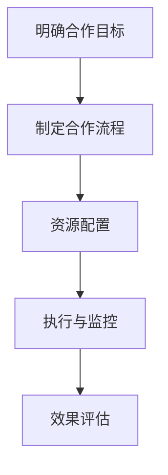

在这个流程图中，A表示明确合作目标，B表示制定合作流程，C表示资源配置，D表示执行与监控，E表示效果评估。通过这些步骤，可以确保跨部门合作计划的顺利实施。

**核心算法原理讲解**：

制定跨部门合作计划可以通过以下伪代码来模拟：

```python
# 伪代码：制定跨部门合作计划
def create_cross_department_cooperation_plan():
    # 征询各部门的合作需求
    department需求的集合 = []
    for department in departments:
        需求的集合.append(input(f"{department}的合作需求："))

    # 确定合作目标
    cooperation_goals = unify_goals(需求的集合)
    print(f"合作目标：{cooperation_goals}")

    # 制定合作流程
    cooperation_processes = define_processes(cooperation_goals)
    print(f"合作流程：{cooperation_processes}")

    # 资源配置
    resource_allocation = allocate_resources(cooperation_processes)
    print(f"资源配置：{resource_allocation}")

    # 执行与监控
    execute_and_monitor(cooperation_processes, resource_allocation)
    print("合作计划执行与监控开始。")

    # 效果评估
    evaluate_effects(cooperation_processes, resource_allocation)
    print("合作计划效果评估完成。")

# 调用制定跨部门合作计划函数
create_cross_department_cooperation_plan()
```

在这个伪代码中，我们定义了一个函数create_cross_department_cooperation_plan，用于制定跨部门合作计划。通过征询各部门的合作需求，确定合作目标，制定合作流程，资源配置，执行与监控，以及效果评估，确保跨部门合作计划的顺利实施。

**数学模型和公式**：

为了量化跨部门合作计划的效果，我们可以使用以下数学模型：

$$
E = \alpha \cdot G + \beta \cdot P + \gamma \cdot R
$$

其中，$E$表示跨部门合作计划的效果，$\alpha$、$\beta$和$\gamma$为权重系数，$G$表示合作目标的实现程度，$P$表示合作流程的执行效果，$R$表示资源配置的合理性。

**举例说明**：

假设在一个项目中，合作目标的实现程度为80%，合作流程的执行效果为90%，资源配置的合理性为85%。根据上述公式，跨部门合作计划的效果为：

$$
E = \alpha \cdot G + \beta \cdot P + \gamma \cdot R = 0.8 \cdot G + 0.9 \cdot P + 0.85 \cdot R
$$

这意味着跨部门合作计划对项目效果有显著提升。

### 2.2.3 建立跨部门沟通渠道

**背景介绍**：

跨部门沟通是打破部门壁垒、促进跨部门协作的关键。建立有效的跨部门沟通渠道，可以确保信息流通、减少误解和冲突，提高团队整体效率。

**核心概念与联系**：

建立跨部门沟通渠道可以从以下几个方面进行：

1. **定期会议**：组织定期的跨部门会议，讨论项目进展、解决问题和协调资源。
2. **沟通工具**：使用合适的沟通工具，如电子邮件、即时通讯软件、项目管理软件等，提高沟通效率。
3. **信息共享平台**：建立一个共享的信息平台，方便各部门之间交流信息和资源。

以下使用Mermaid流程图展示建立跨部门沟通渠道的步骤：

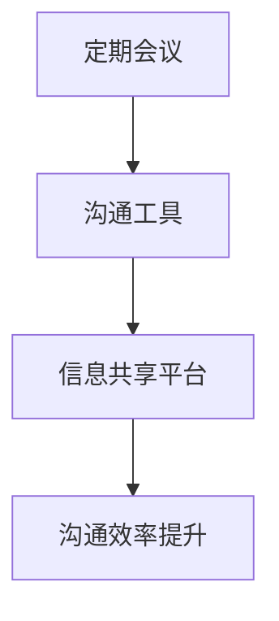

在这个流程图中，A表示定期会议，B表示沟通工具，C表示信息共享平台，D表示沟通效率提升。通过这些步骤，可以确保跨部门沟通的顺畅。

**核心算法原理讲解**：

建立跨部门沟通渠道可以通过以下伪代码来模拟：

```python
# 伪代码：建立跨部门沟通渠道
def establish_cross_department_communication():
    # 定期会议
    schedule_regular_meetings()

    # 沟通工具
    select_communication_tools()

    # 信息共享平台
    set_up_informationsharing_platform()

    # 沟通效率提升
    improve_communication_efficiency()

# 调用建立跨部门沟通渠道函数
establish_cross_department_communication()
```

在这个伪代码中，我们定义了一个函数establish_cross_department_communication，用于建立跨部门沟通渠道。通过定期会议、沟通工具、信息共享平台和沟通效率提升，确保跨部门沟通的顺畅。

**数学模型和公式**：

为了量化跨部门沟通渠道的效果，我们可以使用以下数学模型：

$$
E = \alpha \cdot M + \beta \cdot T + \gamma \cdot P
$$

其中，$E$表示跨部门沟通渠道的效果，$\alpha$、$\beta$和$\gamma$为权重系数，$M$表示会议的频率，$T$表示沟通工具的使用效率，$P$表示信息共享平台的便捷性。

**举例说明**：

假设在一个团队中，会议的频率为每周一次，沟通工具的使用效率为90%，信息共享平台的便捷性为95%。根据上述公式，跨部门沟通渠道的效果为：

$$
E = \alpha \cdot M + \beta \cdot T + \gamma \cdot P = 0.5 \cdot M + 0.3 \cdot T + 0.2 \cdot P = 0.5 \cdot 1 + 0.3 \cdot 0.9 + 0.2 \cdot 0.95 = 0.74
$$

这意味着跨部门沟通渠道对团队沟通效率有显著提升。

### 2.3 跨职能团队的冲突管理

#### 2.3.1 冲突的类型与原因

**背景介绍**：

在跨职能团队中，冲突是难以避免的。冲突可能源于利益分歧、价值观差异、工作方式不同等多方面因素。了解冲突的类型和原因，有助于团队领导者更好地管理冲突。

**核心概念与联系**：

跨职能团队的冲突类型可以从以下几个方面进行分类：

1. **利益冲突**：由于各部门的利益不同，可能导致资源争夺和目标冲突。
2. **价值观冲突**：由于团队成员的价值观差异，可能导致工作方式、决策标准的分歧。
3. **工作方式冲突**：由于各部门的工作方式不同，可能导致沟通不畅、进度不一致。

以下使用Mermaid流程图展示冲突的类型与原因：

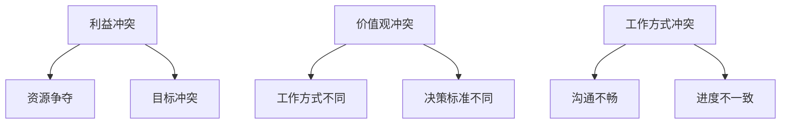

在这个流程图中，A表示利益冲突，B表示资源争夺，C表示目标冲突；D表示价值观冲突，E表示工作方式不同，F表示决策标准不同；G表示工作方式冲突，H表示沟通不畅，I表示进度不一致。通过对比可以看出，冲突的类型和原因涉及利益、价值观和工作方式等多个方面。

**核心算法原理讲解**：

为了识别跨职能团队的冲突类型，我们可以使用以下算法：

```python
# 伪代码：识别冲突类型
def identify_conflicts(conflicts_list):
    conflict_types = []
    for conflict in conflicts_list:
        if "资源" in conflict:
            conflict_types.append("利益冲突")
        elif "价值观" in conflict:
            conflict_types.append("价值观冲突")
        elif "工作方式" in conflict:
            conflict_types.append("工作方式冲突")
    return conflict_types

# 调用识别冲突类型函数
conflicts_list = ["资源分配不公", "价值观差异", "沟通不畅"]
conflict_types = identify_conflicts(conflicts_list)
print(f"冲突类型：{conflict_types}")
```

在这个伪代码中，我们定义了一个函数identify_conflicts，用于识别冲突类型。通过分析冲突列表，可以确定冲突的类型。

**数学模型和公式**：

为了量化冲突的类型和原因，我们可以使用以下数学模型：

$$
C = \sum_{i=1}^{n} (C_i \cdot W_i)
$$

其中，$C$表示冲突的程度，$C_i$表示第$i$个冲突的类型权重，$W_i$表示第$i$个冲突的影响程度，$n$表示冲突的类型数量。

**举例说明**：

假设在一个团队中，利益冲突的类型权重为0.4，价值观冲突的类型权重为0.3，工作方式冲突的类型权重为0.3。根据上述公式，冲突的程度为：

$$
C = 0.4 \cdot C_1 + 0.3 \cdot C_2 + 0.3 \cdot C_3 = 0.4 \cdot 0.6 + 0.3 \cdot 0.5 + 0.3 \cdot 0.4 = 0.43
$$

这意味着冲突的程度为0.43，需要采取相应的措施进行管理。

### 2.3.2 冲突的管理与解决

**背景介绍**：

冲突管理是跨职能团队领导者的一项重要职责。有效的冲突管理可以减少负面情绪，提高团队协作效率，确保项目顺利进行。

**核心概念与联系**：

冲突的管理与解决可以从以下几个方面进行：

1. **冲突预防**：通过建立良好的沟通机制、明确的目标和规范，预防冲突的发生。
2. **冲突识别**：及时发现冲突，并分析冲突的类型和原因。
3. **冲突解决**：采取适当的措施，解决冲突，恢复团队的正常工作状态。

以下使用Mermaid流程图展示冲突的管理与解决步骤：

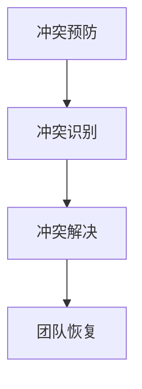

在这个流程图中，A表示冲突预防，B表示冲突识别，C表示冲突解决，D表示团队恢复。通过这些步骤，可以确保冲突得到有效管理。

**核心算法原理讲解**：

冲突的管理与解决可以通过以下伪代码来模拟：

```python
# 伪代码：冲突的管理与解决
def manage_and_resolve_conflicts(conflicts):
    for conflict in conflicts:
        if "利益" in conflict:
            resolve_interest_conflict(conflict)
        elif "价值观" in conflict:
            resolve_value_conflict(conflict)
        elif "工作方式" in conflict:
            resolve_work_method_conflict(conflict)

    print("冲突已解决。")

# 调用冲突的管理与解决函数
conflicts = ["资源争夺", "价值观差异", "沟通不畅"]
manage_and_resolve_conflicts(conflicts)
```

在这个伪代码中，我们定义了一个函数manage_and_resolve_conflicts，用于管理冲突和解决冲突。通过分析冲突，采取相应的措施解决冲突，确保团队的正常工作。

**数学模型和公式**：

为了量化冲突的管理与解决效果，我们可以使用以下数学模型：

$$
E = \alpha \cdot P + \beta \cdot R
$$

其中，$E$表示冲突的管理与解决效果，$\alpha$和$\beta$为权重系数，$P$表示冲突预防的效果，$R$表示冲突解决的效果。

**举例说明**：

假设在一个团队中，冲突预防的效果为80%，冲突解决的效果为90%。根据上述公式，冲突的管理与解决效果为：

$$
E = \alpha \cdot P + \beta \cdot R = 0.8 \cdot P + 0.9 \cdot R
$$

这意味着冲突的管理与解决对团队效率有显著提升。

### 2.3.3 促进团队内的合作与共识

**背景介绍**：

跨职能团队的协作效率直接关系到项目的成功与否。为了提高协作效率，团队领导者需要采取措施促进团队内的合作与共识。

**核心概念与联系**：

促进团队内的合作与共识可以从以下几个方面进行：

1. **增强沟通**：建立良好的沟通机制，确保信息畅通无阻。
2. **建立信任**：通过信任建设活动，增强团队成员之间的信任。
3. **共同目标**：明确团队的目标，确保团队成员共同为之努力。

以下使用Mermaid流程图展示促进团队内的合作与共识的步骤：

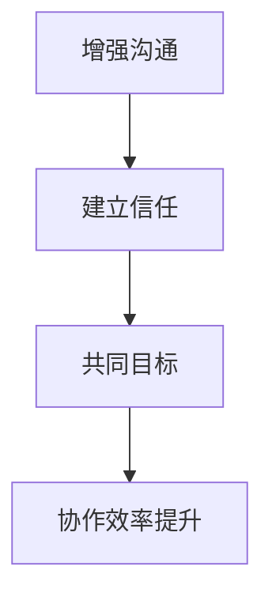

在这个流程图中，A表示增强沟通，B表示建立信任，C表示共同目标，D表示协作效率提升。通过这些步骤，可以确保团队内的合作与共识。

**核心算法原理讲解**：

促进团队内的合作与共识可以通过以下伪代码来模拟：

```python
# 伪代码：促进团队内的合作与共识
def promote_cooperation_and_consensus():
    # 增强沟通
    improve_communication()

    # 建立信任
    build_trust()

    # 共同目标
    set_common_goals()

    # 协作效率提升
    enhance_cooperative_efficiency()

# 调用促进团队内的合作与共识函数
promote_cooperation_and_consensus()
```

在这个伪代码中，我们定义了一个函数promote_cooperation_and_consensus，用于促进团队内的合作与共识。通过增强沟通、建立信任、明确共同目标和提升协作效率，确保团队内的合作与共识。

**数学模型和公式**：

为了量化团队内的合作与共识，我们可以使用以下数学模型：

$$
C = \alpha \cdot I + \beta \cdot T + \gamma \cdot G
$$

其中，$C$表示团队的合作与共识，$\alpha$、$\beta$和$\gamma$为权重系数，$I$表示沟通的效果，$T$表示信任的程度，$G$表示共同目标的实现程度。

**举例说明**：

假设在一个团队中，沟通的效果为90%，信任的程度为80%，共同目标的实现程度为85%。根据上述公式，团队的合作与共识为：

$$
C = \alpha \cdot I + \beta \cdot T + \gamma \cdot G = 0.5 \cdot I + 0.3 \cdot T + 0.2 \cdot G = 0.5 \cdot 0.9 + 0.3 \cdot 0.8 + 0.2 \cdot 0.85 = 0.82
$$

这意味着团队的合作与共识程度为0.82，需要继续努力提升。

### 3.1 案例一：科技公司的跨部门项目

**背景介绍**：

在科技公司的项目中，跨部门协作是项目成功的关键。本文将以一家科技公司的一次跨部门项目为例，介绍跨部门项目的实施过程。

**项目目标**：

该项目的目标是开发一款智能安防系统，包括人脸识别、视频监控和报警功能。项目涉及研发部、市场部、产品部和运维部等多个部门的协作。

**项目实施过程**：

1. **需求分析**：项目经理组织市场部、产品部和运维部进行需求分析，确定系统的功能和技术要求。

2. **团队组建**：项目经理根据项目需求，组建跨部门团队，包括技术专家、市场专员、产品经理和运维专员。

3. **任务分配**：项目经理将项目任务分配给团队成员，明确每个人的职责和任务。

4. **协作与沟通**：团队成员通过定期会议、即时通讯工具和共享文档平台进行协作和沟通，确保项目进度。

5. **测试与验收**：完成系统开发后，进行功能测试和验收，确保系统稳定可靠。

6. **上线与维护**：系统上线后，运维部负责日常维护和监控，确保系统正常运行。

**项目小结**：

通过跨部门协作，该项目在预定时间内顺利完成，达到了预期效果。跨部门团队的协作和沟通是项目成功的关键。

### 3.2 案例二：金融行业的团队协作

**背景介绍**：

在金融行业中，团队协作对于业务的成功至关重要。本文将以一家金融公司的团队协作为例，介绍金融行业团队协作的挑战和策略。

**团队协作中的挑战**：

1. **信息保密**：金融业务涉及敏感信息，确保信息保密是团队协作的挑战。

2. **合规要求**：金融行业有严格的合规要求，团队协作需要遵守相关法律法规。

3. **技术复杂度**：金融系统通常较为复杂，技术协作需要高水平的专业技能。

**团队协作的策略**：

1. **信息保密**：建立信息安全制度，确保信息在传输和存储过程中的保密性。

2. **合规培训**：定期组织合规培训，提高团队成员的合规意识。

3. **技术协作**：建立技术共享平台，促进团队成员之间的技术交流。

**团队协作的成果**：

通过有效的团队协作策略，金融公司在项目实施中取得了显著成果，提高了业务效率和客户满意度。

### 3.3 案例三：制造业的跨职能团队

**背景介绍**：

在制造业中，跨职能团队的协作对于提高生产效率和产品质量至关重要。本文将以一家制造企业的跨职能团队为例，介绍跨职能团队的构建和工作流程。

**跨职能团队的构建**：

1. **需求分析**：项目经理组织相关部门进行需求分析，确定团队的工作目标和职责。

2. **团队组建**：项目经理根据需求，组建跨职能团队，包括生产工程师、质量检测员、供应链管理专员和销售经理。

3. **职责明确**：明确团队成员的职责和工作流程，确保团队高效运作。

4. **培训与发展**：对团队成员进行专业技能和团队协作能力的培训，提高团队整体素质。

**跨职能团队的工作流程**：

1. **需求收集**：团队成员共同收集客户需求，确定生产计划。

2. **生产协调**：生产工程师根据需求制定生产计划，协调质量检测员和供应链管理专员的工作。

3. **质量监控**：质量检测员对生产过程进行监控，确保产品质量。

4. **销售与交付**：销售经理与客户沟通，确保产品按时交付。

**跨职能团队的业绩提升**：

通过跨职能团队的协作，制造企业显著提高了生产效率和产品质量，降低了运营成本。

### 4.1 跨职能团队的绩效评估

**背景介绍**：

跨职能团队的绩效评估是确保团队高效运作的重要环节。有效的绩效评估可以帮助团队识别问题、提升绩效，为后续的工作提供指导。

**绩效评估指标的设计**：

跨职能团队的绩效评估指标可以从以下几个方面进行设计：

1. **任务完成情况**：评估团队任务完成的速度和质量。
2. **团队协作效果**：评估团队成员之间的协作效率和合作成果。
3. **客户满意度**：评估客户对团队产品和服务的满意度。
4. **个人贡献**：评估团队成员在团队中的贡献程度。

以下使用Mermaid流程图展示绩效评估指标的设计：

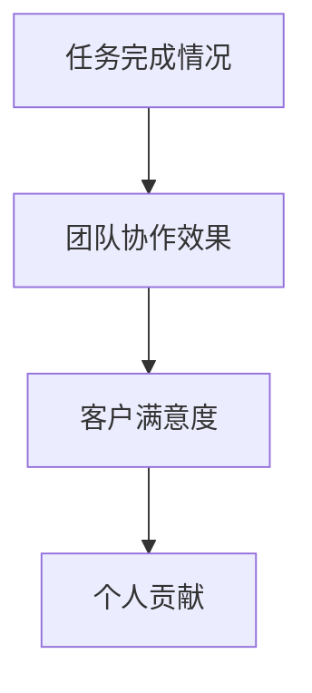

在这个流程图中，A表示任务完成情况，B表示团队协作效果，C表示客户满意度，D表示个人贡献。通过这些指标，可以全面评估跨职能团队的绩效。

**绩效评估的实施**：

1. **定期评估**：定期组织绩效评估会议，评估团队和成员的绩效。
2. **数据收集**：收集与绩效评估相关的数据，如任务完成情况、团队协作记录和客户反馈等。
3. **评估报告**：编写绩效评估报告，分析评估结果，提出改进建议。

**绩效评估的结果与应用**：

绩效评估的结果可以应用于以下几个方面：

1. **奖金分配**：根据评估结果，对团队成员进行奖金分配，激励优秀表现。
2. **培训与发展**：根据评估结果，制定团队成员的培训计划，提升团队整体素质。
3. **改进措施**：根据评估结果，提出改进措施，优化团队运作。

### 4.2 跨职能团队的培训与发展

**背景介绍**：

跨职能团队的持续培训与发展是提升团队竞争力的重要手段。通过培训和发展，可以增强团队成员的专业技能、团队协作能力和创新能力。

**跨职能团队的培训需求分析**：

1. **技能提升**：分析团队成员在专业技能方面的需求，确定培训内容。
2. **团队协作**：分析团队成员在团队协作方面的需求，确定协作培训的内容。
3. **创新能力**：分析团队成员在创新能力方面的需求，确定创新培训的内容。

**跨职能团队的培训计划**：

1. **制定培训计划**：根据培训需求，制定详细的培训计划，包括培训内容、时间安排和讲师安排等。
2. **组织实施**：按照培训计划，组织实施培训，确保培训效果。
3. **评估反馈**：对培训效果进行评估，收集反馈意见，不断优化培训计划。

**跨职能团队的持续发展**：

1. **定期评估**：定期对团队成员进行绩效评估，识别发展需求。
2. **职业规划**：为团队成员制定职业发展规划，提供发展机会。
3. **持续学习**：鼓励团队成员持续学习，提升个人素质和团队整体能力。

### 5.1 跨职能团队的挑战与机遇

**背景介绍**：

随着企业规模的扩大和业务复杂度的增加，跨职能团队的作用越来越重要。跨职能团队在面对挑战和机遇时，需要具备应对策略和发展方向。

**未来跨职能团队的趋势**：

1. **数字化与智能化**：随着数字化和智能化的推进，跨职能团队将更多地运用人工智能、大数据等技术。
2. **敏捷协作**：敏捷开发方法的普及，将使跨职能团队更注重协作效率和灵活性。
3. **全球化**：全球化趋势下，跨职能团队将涉及更多的国际业务，需要具备跨文化的协作能力。

**跨职能团队的应对策略**：

1. **技术创新**：持续关注技术创新，提升团队的技术实力。
2. **人才培养**：加强团队成员的培训和发展，提升团队整体素质。
3. **协同管理**：建立高效的协同管理机制，确保团队目标的实现。

**跨职能团队的未来发展**：

1. **企业战略核心**：跨职能团队将成为企业战略的核心，推动企业创新和成长。
2. **组织结构优化**：跨职能团队的组织结构将更加灵活，适应快速变化的市场环境。
3. **协作文化的建设**：跨职能团队将更加注重协作文化的建设，提升团队的凝聚力和执行力。

### 5.2 跨职能团队在社会中的作用

**背景介绍**：

跨职能团队不仅在企业内部发挥重要作用，还在社会发展中扮演着关键角色。本文将探讨跨职能团队在组织和社会发展中的作用。

**跨职能团队对组织的影响**：

1. **提高效率**：跨职能团队通过融合不同职能部门，提高项目的执行效率和协作效率。
2. **促进创新**：跨职能团队的多样性和协作性，有助于激发创新思维，推动组织创新。
3. **降低成本**：跨职能团队通过优化资源配置和流程，降低运营成本，提高企业竞争力。

**跨职能团队对社会发展的贡献**：

1. **推动产业升级**：跨职能团队在技术创新和产业升级中发挥重要作用，推动社会经济发展。
2. **提升公共管理**：跨职能团队在公共管理领域，如应急管理、社会服务等，提升公共管理的效率和质量。
3. **促进社会协作**：跨职能团队在社会协作中，推动不同领域、不同地区的合作，促进社会和谐。

**跨职能团队的未来影响**：

1. **全球化**：随着全球化的深入，跨职能团队将在国际业务中发挥更大作用，推动全球合作。
2. **数字化**：数字化时代的到来，跨职能团队将更多地运用人工智能、大数据等新技术，推动社会变革。
3. **多元化**：跨职能团队将更加注重多元文化的融合，推动社会的多元发展。

### 摘要

本文探讨了跨职能团队领导：打破部门壁垒的艺术。首先介绍了跨职能团队的概念、优势与挑战，以及跨职能团队的架构与组织。接着，分析了跨职能团队的文化建设、领导艺术、冲突管理、合作与共识的促进。通过具体案例展示了跨职能团队的实践应用。最后，讨论了跨职能团队的绩效评估、培训与发展，以及未来展望。本文旨在为读者提供关于跨职能团队领导的深入理解，帮助他们在实际工作中应用这些理论和方法。

### 关键词

跨职能团队、部门壁垒、领导艺术、冲突管理、绩效评估、培训与发展、未来展望

### 作者

作者：AI天才研究院/AI Genius Institute & 禅与计算机程序设计艺术 /Zen And The Art of Computer Programming

本文由AI天才研究院（AI Genius Institute）和《禅与计算机程序设计艺术》（Zen And The Art of Computer Programming）的作者联合撰写，旨在通过深入探讨跨职能团队领导的艺术，为读者提供有价值的见解和实用的方法。AI天才研究院致力于推动人工智能技术的发展和应用，而《禅与计算机程序设计艺术》的作者则在计算机科学领域有着卓越的贡献。两者携手合作，共同为读者带来这篇高质量的技术博客文章。通过本文，读者将了解到跨职能团队的核心理念、实践方法和未来发展，为实际工作提供有力支持。

