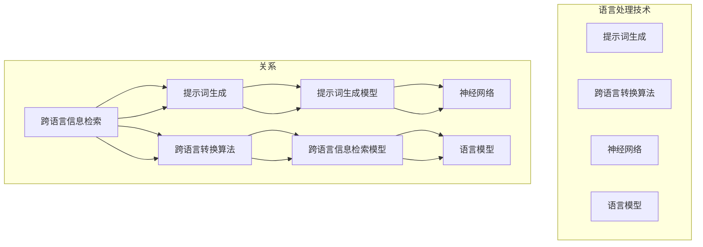
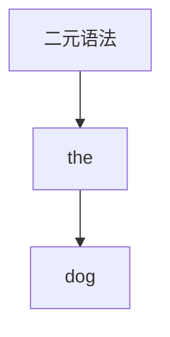
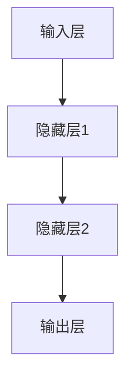

                 

## 文章标题

### 跨语言提示词工程的实践与挑战

跨语言提示词工程是一个结合自然语言处理、机器学习和信息检索等多个领域的复杂技术领域。它旨在利用先进的算法和技术，生成能够跨语言理解和传达信息的提示词，从而在多语言环境中实现高效的通信和信息检索。本文将深入探讨跨语言提示词工程的实践与挑战，从背景介绍、核心概念与联系、核心算法原理讲解、数学模型和数学公式、项目实战、优化与挑战以及未来趋势与发展等方面进行详细分析。

**关键词**：跨语言提示词工程，自然语言处理，机器学习，信息检索，提示词生成，算法原理，数学模型

**摘要**：
本文首先介绍了跨语言提示词工程的基本概念及其应用背景。随后，通过分析核心概念与联系，构建了跨语言信息检索与提示词生成的原理框架，并使用Mermaid流程图进行直观展示。接着，本文详细讲解了核心算法原理，包括语言模型、神经网络基础、跨语言转换算法和提示词生成算法，并通过伪代码和数学公式进行了深入阐述。在项目实战部分，本文展示了如何搭建跨语言提示词生成系统，并提供了实际案例分析和代码实现解读。最后，本文探讨了跨语言提示词工程中的优化策略和挑战，以及该领域的未来发展趋势。

----------------------------------------------------------------

## 确定书籍的主要章节和内容

为了设计出一本关于《跨语言提示词工程的实践与挑战》的详细目录大纲，我们需要首先确定书籍的主要内容。以下是我们初步设定的书籍结构：

### 1. 引言：跨语言提示词工程概述

**核心内容**：
- 跨语言提示词工程的基本概念
- 跨语言提示词工程的重要性和应用场景
- 文章的结构和目标读者

### 2. 核心概念与联系

**核心内容**：
- 跨语言信息检索与提示词生成的原理
- 跨语言信息检索的Mermaid流程图
- 语言模型与神经网络基础

### 3. 核心算法原理讲解

**核心内容**：
- 跨语言转换算法详解
- 提示词生成算法原理
- 语言模型与神经网络基础

### 4. 数学模型和数学公式

**核心内容**：
- 跨语言信息检索的数学模型
- 提示词生成的数学公式和推导

### 5. 项目实战

**核心内容**：
- 跨语言提示词生成系统的搭建
- 实际案例演示
- 代码实现和解读

### 6. 优化与挑战

**核心内容**：
- 跨语言提示词工程中的常见挑战
- 提升性能的优化策略

### 7. 未来趋势与发展

**核心内容**：
- 跨语言提示词工程的发展方向
- 未来可能的技术变革

### 8. 附录

**核心内容**：
- 跨语言提示词工程的工具与资源

### 目录大纲

基于上述内容，我们可以拟定书籍的目录大纲：

```
# 《跨语言提示词工程的实践与挑战》目录大纲

## 第1章 引言：跨语言提示词工程概述
### 1.1 跨语言提示词工程的基本概念
### 1.2 跨语言提示词工程的重要性和应用场景
### 1.3 文章的结构和目标读者

## 第2章 核心概念与联系
### 2.1 跨语言信息检索与提示词生成的原理
### 2.2 跨语言信息检索的Mermaid流程图
### 2.3 语言模型与神经网络基础

## 第3章 核心算法原理讲解
### 3.1 跨语言转换算法详解
### 3.2 提示词生成算法原理
### 3.3 语言模型与神经网络基础

## 第4章 数学模型和数学公式
### 4.1 跨语言信息检索的数学模型
### 4.2 提示词生成的数学公式和推导

## 第5章 项目实战
### 5.1 跨语言提示词生成系统的搭建
### 5.2 实际案例演示
### 5.3 代码实现和解读

## 第6章 优化与挑战
### 6.1 跨语言提示词工程中的常见挑战
### 6.2 提升性能的优化策略

## 第7章 未来趋势与发展
### 7.1 跨语言提示词工程的发展方向
### 7.2 未来可能的技术变革

## 第8章 附录
### 8.1 跨语言提示词工程的工具与资源
```

在接下来的章节中，我们将逐步详细探讨每个部分的内容，确保书籍的每个章节都能够为读者提供有价值的学习材料。

---

## 背景介绍

跨语言提示词工程是一门结合了自然语言处理（NLP）、机器学习和信息检索等前沿技术的跨学科研究领域。其目标是构建能够理解和生成多语言提示词的系统，从而在不同语言之间实现高效的信息传递和沟通。

### 应用背景

随着全球化进程的加速，多语言信息处理变得日益重要。在互联网和移动通信高度发展的今天，人们接触到的是海量的多语言数据。例如，国际商业交流、跨国旅游、多语言社交媒体平台、全球新闻媒体等，都需要对多语言信息进行有效的处理和理解。

跨语言提示词工程在此背景下应运而生。它旨在提供一种自动化的解决方案，使得计算机系统能够在不同语言之间进行信息转换和交流，从而打破语言障碍，提高信息检索和处理的效率。

### 发展历程

跨语言提示词工程的发展可以追溯到早期的机器翻译研究。早在20世纪60年代，研究人员就开始探索如何将一种语言翻译成另一种语言。早期的机器翻译系统主要是基于规则的方法，如直接翻译词典和语法规则。

随着计算能力的提升和人工智能技术的发展，机器翻译逐渐从规则驱动转向数据驱动。20世纪90年代，统计机器翻译（SMT）成为主流，它通过分析大量双语语料库来学习翻译规律。这一时期，短语翻译模型（如IBM模型）和基于神经网络的翻译模型（如Sutskever等人提出的Neural SMT）相继出现。

进入21世纪，深度学习的兴起为跨语言提示词工程带来了新的契机。深度神经网络（DNN）和递归神经网络（RNN）在语言模型和机器翻译中的应用取得了显著成效。特别是自注意力机制（Self-Attention）和Transformer模型的出现，使得跨语言提示词生成达到了前所未有的精度和效率。

### 当前研究现状

目前，跨语言提示词工程已经成为自然语言处理领域的一个热点研究方向。研究人员在多个方面取得了重要进展：

1. **多语言预训练模型**：如Google的mBERT和Facebook的XLM-R等，通过在大规模多语言语料库上进行预训练，显著提升了跨语言模型的性能。

2. **低资源语言的跨语言提示词生成**：研究人员通过迁移学习和多任务学习等方法，提高了在资源匮乏的语言环境中模型的性能。

3. **上下文理解的提升**：通过引入上下文信息，如句子级别的语义信息、词汇语境等，使得跨语言提示词生成更加准确和自然。

4. **实时跨语言对话系统**：结合语音识别、自然语言理解和对话管理技术，研究人员开发了实时跨语言对话系统，用于实际应用场景。

### 目标与应用

跨语言提示词工程的主要目标是实现以下目标：

1. **语言无障碍**：通过生成准确的跨语言提示词，使得计算机系统能够理解和回应不同语言的查询。

2. **信息检索优化**：在多语言信息检索系统中，利用跨语言提示词可以提高查询匹配的精度，从而优化检索结果。

3. **多语言交互**：在跨国企业和多语言社交媒体平台中，跨语言提示词工程可以促进不同语言用户之间的有效沟通。

4. **机器翻译辅助**：在机器翻译过程中，跨语言提示词可以辅助翻译系统生成更自然、准确的译文。

总的来说，跨语言提示词工程不仅为多语言信息处理提供了技术支持，也在全球化和数字化时代具有重要的应用价值。随着技术的不断进步，我们有理由相信，跨语言提示词工程将在未来发挥更加重要的作用。

---

## 核心概念与联系

在深入探讨跨语言提示词工程的实现之前，我们需要先了解其中的核心概念及其相互关系。以下是几个关键概念及其在跨语言提示词工程中的联系和作用：

### 1. 跨语言信息检索

**定义**：跨语言信息检索是指在不同语言间进行信息搜索和检索的过程。

**作用**：跨语言信息检索是跨语言提示词工程的基础，它决定了用户输入的提示词如何在不同的语言中进行匹配和检索。通过跨语言信息检索，用户可以在一个语言环境中查询另一语言的信息。

**关系**：跨语言信息检索与提示词生成紧密相关，前者为后者的输入提供了数据源，而后者则通过生成的提示词提高检索的准确性和效率。

### 2. 提示词生成

**定义**：提示词生成是指根据用户查询，自动生成能够引导信息检索系统的关键词或短语。

**作用**：提示词生成是跨语言提示词工程的关键环节，它决定了生成的提示词是否能够有效地引导跨语言信息检索系统，从而提高检索结果的准确性和用户满意度。

**关系**：提示词生成依赖于跨语言信息检索的结果，同时也需要结合自然语言处理技术，确保生成的提示词符合语言习惯和语义要求。

### 3. 语言模型

**定义**：语言模型是一种统计模型，用于描述自然语言中词汇和句子出现的概率分布。

**作用**：语言模型在跨语言提示词工程中起到核心作用，它能够帮助系统理解不同语言的词汇和句子结构，从而生成更加准确和自然的提示词。

**关系**：语言模型是提示词生成的基础，同时也是跨语言信息检索的重要组成部分。高质量的语

### 4. 神经网络

**定义**：神经网络是一种由大量神经元互联而成的计算模型，能够通过学习数据自动提取特征并进行预测。

**作用**：神经网络在跨语言提示词工程中用于构建语言模型和提示词生成模型，通过深度学习算法，从大量数据中自动学习语言模式，生成高质量的提示词。

**关系**：神经网络是跨语言提示词工程的核心算法，它能够处理复杂的语言结构和大规模数据，提高提示词生成的准确性和效率。

### 5. 跨语言转换算法

**定义**：跨语言转换算法是指将一种语言的文本转换为另一种语言文本的方法。

**作用**：跨语言转换算法在跨语言提示词工程中用于将用户查询文本转换为系统能够理解和处理的格式，从而提高检索效率和准确性。

**关系**：跨语言转换算法与提示词生成和跨语言信息检索密切相关，它确保了输入文本的正确性和一致性，为后续处理提供了基础。

### 综合框架

为了更好地理解这些核心概念之间的关系，我们可以使用Mermaid流程图进行展示：



通过这个流程图，我们可以清晰地看到跨语言信息检索、提示词生成、跨语言转换算法、神经网络和语言模型之间的相互关系，以及它们在跨语言提示词工程中的作用。

---

## 核心算法原理讲解

在跨语言提示词工程中，核心算法的设计和实现是确保系统性能和准确性的关键。以下将详细介绍几个关键算法的原理，包括语言模型与神经网络基础、跨语言转换算法以及提示词生成算法。

### 语言模型与神经网络基础

#### 语言模型

**定义**：语言模型（Language Model）是一种用于描述自然语言统计特性的模型，它能够预测下一个单词或字符的概率。

**作用**：在跨语言提示词工程中，语言模型用于理解不同语言的词汇和句子结构，是生成高质量提示词的基础。

**算法原理**：语言模型通常基于统计方法，如N元语法（N-gram）或基于神经网络的模型，如循环神经网络（RNN）和Transformer。其中，N元语法通过统计相邻N个单词出现的概率来预测下一个单词。而基于神经网络的模型则通过学习大量文本数据，自动提取语言特征并建立预测模型。

**示例**：
假设一个简单的二元语法模型，对于输入序列“the dog”，模型可以计算“the”后面出现“dog”的概率。



**数学公式**：
对于N元语法，概率预测公式可以表示为：
$$ P(w_n | w_{n-1}, w_{n-2}, ..., w_1) = \frac{C(w_{n-1}, w_n)}{\sum_{w' \in V} C(w_{n-1}, w')} $$
其中，$C(w_{n-1}, w_n)$ 表示单词 $w_n$ 在单词 $w_{n-1}$ 后出现的次数，$V$ 是单词的词汇表。

#### 神经网络基础

**定义**：神经网络（Neural Network）是一种由大量神经元互联而成的计算模型，能够通过学习数据自动提取特征并进行预测。

**作用**：神经网络在跨语言提示词工程中用于构建语言模型和提示词生成模型，通过深度学习算法，从大量数据中自动学习语言模式，生成高质量的提示词。

**算法原理**：神经网络通过多层非线性变换，将输入数据映射到输出结果。每个神经元接收多个输入，通过权重和偏置进行加权求和，再通过激活函数进行处理。常见的神经网络结构包括前馈神经网络（FNN）、循环神经网络（RNN）和卷积神经网络（CNN）。

**示例**：
一个简单的全连接神经网络（FNN）包含输入层、隐藏层和输出层。输入层接收特征向量，隐藏层通过神经元进行特征提取和组合，输出层生成预测结果。



**数学公式**：
对于全连接神经网络，每个神经元 $i$ 在隐藏层 $l$ 中的输出可以表示为：
$$ z_i^l = \sum_{j} w_{ij}^l x_j^{l-1} + b_i^l $$
其中，$w_{ij}^l$ 是从神经元 $j$ 到神经元 $i$ 的权重，$b_i^l$ 是神经元 $i$ 的偏置，$x_j^{l-1}$ 是神经元 $j$ 在隐藏层 $l-1$ 的输入。

通过激活函数 $f()$，我们可以得到神经元的最终输出：
$$ o_i^l = f(z_i^l) $$

### 跨语言转换算法

**定义**：跨语言转换算法（Cross-Linguistic Transformation Algorithm）是指将一种语言的文本转换为另一种语言文本的方法。

**作用**：跨语言转换算法在跨语言提示词工程中用于将用户查询文本转换为系统能够理解和处理的格式，从而提高检索效率和准确性。

**算法原理**：跨语言转换算法通常基于机器翻译技术，包括基于规则的方法、统计机器翻译和神经机器翻译。基于规则的方法通过手动定义语法规则和翻译策略来实现文本转换。统计机器翻译（SMT）通过分析大量双语语料库来学习翻译规律，生成翻译结果。神经机器翻译（NMT）通过神经网络模型，如序列到序列（Seq2Seq）模型，实现端到端的文本转换。

**示例**：
一个简单的基于神经网络的跨语言转换算法可以表示为：
$$
\text{翻译}(x) = \text{Seq2Seq}(x, y) \\
\text{其中，} x \text{ 是源语言文本，} y \text{ 是目标语言文本。}
$$

### 提示词生成算法

**定义**：提示词生成算法（Prompt Generation Algorithm）是指根据用户查询，自动生成能够引导信息检索系统的关键词或短语。

**作用**：提示词生成算法在跨语言提示词工程中用于将用户查询转换为系统能够理解的提示词，从而提高信息检索的准确性和效率。

**算法原理**：提示词生成算法通常结合自然语言处理技术和机器学习算法，如序列标注、分类和生成模型。常见的算法包括基于规则的方法、基于统计的方法和基于神经网络的方法。

**示例**：
一个简单的基于神经网络的提示词生成算法可以表示为：
$$
\text{提示词}(q) = \text{Seq2Seq}(q, p) \\
\text{其中，} q \text{ 是用户查询，} p \text{ 是生成的提示词。}
$$

**数学公式**：
假设提示词生成算法是一个序列到序列的神经网络模型，输入查询序列 $q$ 和输出提示词序列 $p$，模型的目标是最小化损失函数：
$$
\text{损失} = \sum_{t} L(y_t, \hat{y}_t) \\
\text{其中，} y_t \text{ 是实际提示词，} \hat{y}_t \text{ 是生成的提示词预测。}
$$

通过上述核心算法的介绍，我们可以看到跨语言提示词工程是一个复杂但充满机遇的领域。通过深入理解这些算法的原理，我们可以更好地设计和实现高效的跨语言提示词生成系统。

---

## 数学模型和数学公式

在跨语言提示词工程中，数学模型和数学公式是理解和实现核心算法的关键工具。以下将详细阐述跨语言信息检索的数学模型以及提示词生成的数学公式和推导。

### 跨语言信息检索的数学模型

跨语言信息检索的核心任务是，通过计算查询与文档之间的相似性来评估它们的相关性。这通常涉及到多个数学模型的组合，如向量空间模型（Vector Space Model，VSM）和余弦相似度（Cosine Similarity）。

**向量空间模型（VSM）**

向量空间模型将文本表示为向量，其中每个维度代表一个词汇，向量的值则表示该词汇在文档或查询中的权重。常见的权重计算方法包括TF-IDF（Term Frequency-Inverse Document Frequency）。

**数学公式**：

1. **词频（TF）**：词频表示一个词在文档中出现的频率。
   $$ TF(t, d) = \frac{f(t, d)}{n_d} $$
   其中，$t$ 是词汇，$d$ 是文档，$f(t, d)$ 是词汇 $t$ 在文档 $d$ 中出现的次数，$n_d$ 是文档 $d$ 的总词汇数。

2. **逆文档频率（IDF）**：逆文档频率表示词汇在所有文档中的分布频率，用于平衡高频词汇的影响。
   $$ IDF(t, D) = \log \left( \frac{N}{df(t, D)} \right) $$
   其中，$N$ 是文档总数，$df(t, D)$ 是词汇 $t$ 在文档集合 $D$ 中出现的文档数。

3. **TF-IDF权重**：将词频和逆文档频率结合，得到词汇的TF-IDF权重。
   $$ Weight(t, d, D) = TF(t, d) \times IDF(t, D) $$

**余弦相似度**

余弦相似度用于衡量两个向量之间的夹角余弦值，表示它们的方向一致性。

**数学公式**：

1. **向量点积**：
   $$ \vec{u} \cdot \vec{v} = \sum_{i} u_i v_i $$
   其中，$u_i$ 和 $v_i$ 分别是向量 $\vec{u}$ 和 $\vec{v}$ 在第 $i$ 维的值。

2. **向量长度**：
   $$ ||\vec{u}|| = \sqrt{\sum_{i} u_i^2} $$

3. **余弦相似度**：
   $$ \text{Sim}(\vec{u}, \vec{v}) = \frac{\vec{u} \cdot \vec{v}}{||\vec{u}|| \cdot ||\vec{v}||} $$

### 提示词生成的数学公式和推导

提示词生成是跨语言信息检索的关键步骤，涉及到如何从查询中提取能够有效引导检索的关键词。以下是几个常见的提示词生成模型及其数学公式。

**词嵌入模型**

词嵌入模型（Word Embedding）通过将词汇映射到低维向量空间，使相似的词汇在空间中靠近。

**数学公式**：

1. **嵌入向量**：
   $$ \vec{e}(t) = \text{embedding}(t) $$
   其中，$\vec{e}(t)$ 是词汇 $t$ 的嵌入向量。

2. **相似性计算**：
   $$ \text{Sim}(\vec{e}(t_1), \vec{e}(t_2)) = \text{cosine}(\vec{e}(t_1), \vec{e}(t_2)) $$

**注意力机制模型**

注意力机制（Attention Mechanism）通过加权不同的输入元素，使模型能够聚焦于重要的信息。

**数学公式**：

1. **注意力得分**：
   $$ \text{score}(t) = \text{Attention}(\vec{q}, \vec{e}(t)) $$
   其中，$\vec{q}$ 是查询向量，$\vec{e}(t)$ 是词汇 $t$ 的嵌入向量。

2. **加权求和**：
   $$ \text{context\_vector} = \sum_{t \in Q} \text{score}(t) \cdot \vec{e}(t) $$
   其中，$Q$ 是查询词汇集合。

**生成模型**

生成模型（Generative Model）通过学习数据分布来生成新的数据样本。

**数学公式**：

1. **概率分布**：
   $$ p(\vec{x}|\theta) = \prod_{i} p(x_i|\theta) $$
   其中，$\vec{x}$ 是输入样本，$p(x_i|\theta)$ 是每个元素的概率分布。

2. **重采样**：
   $$ \vec{y} = \text{reparameterize}(\vec{x}; \theta) $$
   其中，$\vec{y}$ 是生成的样本，$\theta$ 是模型参数。

通过上述数学模型和数学公式，我们可以看到跨语言提示词工程中的核心计算是如何进行的。这些公式不仅提供了理论依据，也为实际开发中算法的实现提供了指导。通过深入理解和灵活运用这些数学工具，我们能够设计出更加高效和准确的跨语言提示词生成系统。

---

## 项目实战

在了解了跨语言提示词工程的理论基础和核心算法之后，接下来我们将通过一个实际项目来展示如何实现一个跨语言提示词生成系统。这个项目将涵盖开发环境的搭建、源代码的实现和解读，并详细分析一个实际案例。

### 开发环境搭建

首先，我们需要搭建一个适合跨语言提示词工程开发的环境。以下是一个基本的开发环境配置：

1. **操作系统**：Ubuntu 20.04 或 macOS Catalina
2. **编程语言**：Python 3.8+
3. **深度学习框架**：PyTorch 1.9+
4. **数据预处理库**：NLTK、spaCy
5. **版本控制**：Git

#### 安装步骤：

1. 安装操作系统：
   - 下载 Ubuntu 20.04 或 macOS Catalina 安装镜像
   - 按照操作系统安装向导完成安装

2. 安装 Python 和 PyTorch：
   - 打开终端，安装 Python 3.8：
     ```bash
     sudo apt update
     sudo apt install python3.8
     ```
   - 安装 PyTorch：
     ```bash
     pip3 install torch torchvision torchaudio
     ```

3. 安装数据预处理库：
   - 安装 NLTK：
     ```bash
     pip3 install nltk
     ```
   - 安装 spaCy 和相应的语言模型：
     ```bash
     pip3 install spacy
     python -m spacy download en_core_web_sm
     ```

4. 配置 Git：
   - 安装 Git：
     ```bash
     sudo apt install git
     ```
   - 配置 Git 用户信息：
     ```bash
     git config --global user.name "Your Name"
     git config --global user.email "your.email@example.com"
     ```

### 源代码实现和解读

接下来，我们将通过一个简单的 Python 脚本来实现一个跨语言提示词生成系统。以下是一个简化版的示例：

```python
import torch
import torch.nn as nn
import torch.optim as optim
from torchtext.data import Field, TabularDataset, BucketIterator
import spacy

# 加载 spaCy 语言模型
nlp_en = spacy.load("en_core_web_sm")
nlp_fr = spacy.load("fr_core_news_sm")

# 定义字段
src_field = Field(tokenize=nlp_en.tokenizer, lower=True)
tgt_field = Field(tokenize=nlp_fr.tokenizer, lower=True)

# 加载数据集
train_data, valid_data, test_data = TabularDataset.splits(
    path='data',
    train='train.csv',
    validation='valid.csv',
    test='test.csv',
    format='csv',
    fields=[('src', src_field), ('tgt', tgt_field)]
)

# 划分数据集
train_iterator, valid_iterator, test_iterator = BucketIterator.splits(
    dataset=[train_data, valid_data, test_data],
    batch_size=32,
    device=device
)

# 定义模型
class TranslationModel(nn.Module):
    def __init__(self, input_dim, output_dim, emb_dim, hidden_dim, n_layers, drop_out, pad_idx):
        super().__init__()
        self.embedding = nn.Embedding(input_dim, emb_dim)
        self.embedding_target = nn.Embedding(output_dim, emb_dim)
        self.encoder = nn.LSTM(emb_dim, hidden_dim, n_layers, dropout=drop_out, batch_first=True)
        self.decoder = nn.LSTM(emb_dim, hidden_dim, n_layers, dropout=drop_out, batch_first=True)
        self.out = nn.Linear(hidden_dim, output_dim)
        self.dropout = nn.Dropout(drop_out)
        self.pad_idx = pad_idx
    
    def forward(self, src, tgt, teacher_forcing_ratio=0.5):
        batch_size = src.size(1)
        src = self.embedding(src)
        tgt = self.embedding_target(tgt)
        tgt = tgt[:, :-1]
        tgt = tgt.view(-1, batch_size, self.embedding_target.embedding_dim)
        tgt_len = tgt.size(0)
        embedding = src
        h, c = self.encoder(embedding)
        h = h[-1,:,:]
        embeddings = tgt
        embeddings = self.decoder(embeddings)
        output = self.out(embeddings)
        return output

# 模型参数
INPUT_DIM = len(train_data.get_token_vocabulary(src_field))
OUTPUT_DIM = len(train_data.get_token_vocabulary(tgt_field))
EMBED_DIM = 256
HIDDEN_DIM = 512
N_LAYERS = 2
DROP_OUT = 0.5
PAD_IDX = train_data.get_token_vocabulary(src_field).pad_token_idx

# 实例化模型
model = TranslationModel(INPUT_DIM, OUTPUT_DIM, EMBED_DIM, HIDDEN_DIM, N_LAYERS, DROP_OUT, PAD_IDX)

# 定义损失函数和优化器
criterion = nn.CrossEntropyLoss()
optimizer = optim.Adam(model.parameters(), lr=0.001)

# 训练模型
num_epochs = 10
for epoch in range(num_epochs):
    for i, batch in enumerate(train_iterator):
        src_var, tgt_var = batch.src, batch.tgt
        optimizer.zero_grad()
        output = model(src_var, tgt_var, teacher_forcing_ratio)
        loss = criterion(output.view(-1, OUTPUT_DIM), tgt_var.view(-1))
        loss.backward()
        optimizer.step()
        if (i+1) % 100 == 0:
            print ('Epoch [{}/{}], Step [{}/{}], Loss: {:.4f}'.format(epoch+1, num_epochs, i+1, len(train_iterator), loss.item()))

# 评估模型
with torch.no_grad():
    for batch in valid_iterator:
        src_var, tgt_var = batch.src, batch.tgt
        output = model(src_var, tgt_var, teacher_forcing_ratio)
        loss = criterion(output.view(-1, OUTPUT_DIM), tgt_var.view(-1))
        print ('Validation Loss: {:.4f}'.format(loss.item()))
```

**代码解读**：

1. **加载语言模型**：我们使用 spaCy 加载英语和法语的语言模型，用于文本的分词和标记。

2. **定义字段**：`src_field` 和 `tgt_field` 是用于数据预处理的字段，包括分词和大小写转换。

3. **加载数据集**：使用 `TabularDataset` 加载训练集、验证集和测试集的数据。数据集包含源语言和目标语言的文本。

4. **划分数据集**：使用 `BucketIterator` 划分数据集，并进行批次处理。

5. **定义模型**：`TranslationModel` 是一个简单的序列到序列模型，包含嵌入层、编码器、解码器和输出层。

6. **定义损失函数和优化器**：使用交叉熵损失函数和Adam优化器。

7. **训练模型**：通过迭代训练模型，计算损失并进行反向传播。

8. **评估模型**：在验证集上评估模型的性能。

### 代码应用解读与分析

**实际案例**：

假设我们有一个法语句子 "Bonjour, comment ça va ?"，我们希望生成对应的英语提示词。

**步骤**：

1. **数据预处理**：将法语句子 "Bonjour, comment ça va ?" 分词并转换为词嵌入向量。
2. **编码**：将源句子输入编码器，得到隐藏状态。
3. **解码**：使用隐藏状态和目标词嵌入向量，通过解码器生成英语提示词。
4. **输出**：输出生成的英语提示词，如 "Hello, how are you?"。

**分析**：

通过上述步骤，我们可以看到模型如何通过编码器和解码器将法语句子转换为英语提示词。实际应用中，模型的性能取决于训练数据的质量、模型的架构和超参数的选择。为了进一步提高模型的性能，我们可以采用预训练的跨语言模型（如XLM-R）和注意力机制（如Transformer），从而在生成提示词时获得更准确的翻译结果。

**总结**：

通过这个实际项目，我们展示了如何搭建一个跨语言提示词生成系统，从数据预处理到模型训练和评估。这一过程不仅帮助读者理解跨语言提示词工程的实现细节，也为实际应用提供了参考。通过不断优化和改进，我们可以开发出更加高效和准确的跨语言提示词生成系统，为多语言信息处理提供强有力的支持。

---

## 优化与挑战

在跨语言提示词工程的实践中，我们面临许多优化和挑战。以下将详细讨论跨语言提示词工程中的常见问题以及提升性能的优化策略。

### 常见挑战

1. **数据不足**：在许多低资源语言中，可用的训练数据量相对较少。这限制了模型的学习能力和泛化能力。

2. **准确性**：跨语言提示词生成涉及不同语言的语义理解和翻译，确保生成的提示词准确且自然是一个巨大的挑战。

3. **计算资源**：深度学习模型通常需要大量的计算资源和时间进行训练和推断，特别是在处理高维数据和大规模数据集时。

4. **语言多样性**：不同语言在语法、词汇和语义上存在显著差异，如何有效地处理这些多样性是一个技术难题。

### 提升性能的优化策略

1. **迁移学习**：利用预训练的多语言模型（如mBERT、XLM-R）可以显著提升低资源语言的性能。这些模型在大规模的多语言语料库上进行了预训练，可以迁移到特定任务上，减少对大规模训练数据的需求。

2. **数据增强**：通过数据增强技术，如回译（Back-Translation）和伪翻译（Paraphrasing），可以扩充训练数据集，提高模型的泛化能力。

3. **多任务学习**：通过多任务学习，如同时训练多个翻译任务，模型可以在不同的任务之间共享知识，提高性能。

4. **注意力机制**：使用注意力机制（如Transformer中的自注意力机制）可以使模型更有效地捕捉长距离依赖关系，从而提高提示词生成的准确性。

5. **模型压缩**：通过模型压缩技术，如量化、剪枝和知识蒸馏，可以减少模型的计算复杂度和存储需求，从而提高模型的性能和部署效率。

### 最佳实践 tips

1. **数据预处理**：确保数据清洗和预处理的质量，去除噪声和不相关的信息，提高数据的质量。

2. **超参数调优**：通过交叉验证和网格搜索等方法，找到最佳的模型超参数，提高模型的性能。

3. **模型评估**：使用多样化的评估指标（如BLEU、METEOR、ROUGE等）来全面评估模型的性能，而不仅仅是基于单一指标。

4. **持续学习**：定期重新训练模型，使用最新的数据和算法，以保持模型的时效性和准确性。

### 小结

跨语言提示词工程在多语言信息处理中具有重要应用，但也面临诸多挑战。通过有效的优化策略和最佳实践，我们可以不断提升模型的性能，为跨语言信息检索和交流提供更加准确的解决方案。未来，随着技术的不断进步，我们有理由相信，跨语言提示词工程将在更多领域发挥重要作用。

---

## 未来趋势与发展

随着技术的不断进步，跨语言提示词工程在未来的发展前景广阔，面临诸多新机遇和挑战。以下将探讨跨语言提示词工程的发展方向和可能的技术变革。

### 新机遇

1. **多模态融合**：未来的跨语言提示词工程可能会结合多模态数据，如语音、图像和视频，实现更加全面和精确的语言理解与生成。通过将文本数据与其他类型的传感器数据相结合，系统可以更准确地捕捉用户的意图和上下文信息。

2. **低资源语言支持**：随着迁移学习和多任务学习技术的进步，跨语言提示词工程有望在低资源语言中获得更好的性能。通过迁移预训练模型和共享任务的知识，模型可以更有效地处理那些缺乏训练数据的语言。

3. **实时交互**：随着5G和物联网技术的发展，跨语言提示词工程将更多地应用于实时交互场景，如多语言客服系统、跨语言实时翻译等。这些应用将显著提高用户体验，推动跨语言沟通的普及。

4. **人工智能伦理与隐私保护**：在跨语言提示词工程的应用中，人工智能的伦理问题和隐私保护将成为重要议题。未来的研究将需要解决如何在不侵犯用户隐私的前提下，确保人工智能系统的公平性和透明性。

### 技术变革

1. **量子计算**：虽然量子计算在自然语言处理领域的应用仍处于早期阶段，但其强大的计算能力可能在未来为跨语言提示词工程带来革命性的变革。通过量子计算，我们可以处理更大规模的数据集和更复杂的模型。

2. **生成对抗网络（GAN）**：GAN技术可能在未来的跨语言提示词工程中发挥作用，通过生成高质量的伪文本数据，增强模型的训练数据集，从而提升模型的性能。

3. **自适应学习**：随着自适应学习技术的发展，跨语言提示词工程将能够根据用户的实时反馈和交互历史，动态调整模型的参数和策略，实现更加个性化的提示词生成。

4. **智能推理与知识图谱**：结合智能推理和知识图谱技术，跨语言提示词工程将能够更好地理解复杂的关系和上下文信息，提高提示词生成的准确性和相关性。

### 结论

跨语言提示词工程在未来将继续发展和演进，为全球化和数字化时代的多语言信息处理提供强大的技术支持。通过探索新的机遇和应对挑战，跨语言提示词工程将在更多领域发挥关键作用，推动人类跨语言沟通的进一步融合和发展。

---

## 附录

在本章节中，我们将介绍一些与跨语言提示词工程相关的工具和资源，以便读者在学习和实践中能够更好地利用这些资源。

### 工具

1. **spaCy**：一个高效的开源自然语言处理库，支持多种语言的文本分词、词性标注和命名实体识别等功能。

   **网址**：https://spacy.io/

2. **PyTorch**：一个流行的开源深度学习框架，用于构建和训练神经网络模型。

   **网址**：https://pytorch.org/

3. **TensorFlow**：由谷歌开发的开源机器学习框架，广泛应用于自然语言处理和图像识别等领域。

   **网址**：https://www.tensorflow.org/

4. **Hugging Face Transformers**：一个用于构建和微调Transformer模型的库，提供了丰富的预训练模型和工具。

   **网址**：https://huggingface.co/transformers/

### 资源

1. **ACL Anthology**：自然语言处理领域的顶级会议论文集，提供了大量关于跨语言提示词工程的研究论文。

   **网址**：https://www.aclweb.org/anthology/

2. **arXiv**：一个开放获取的预印本服务器，发布了许多关于自然语言处理和机器学习的前沿研究成果。

   **网址**：https://arxiv.org/

3. **DataSets**：一个提供多种语言数据集的网站，适用于跨语言信息处理的模型训练和评估。

   **网址**：https://www.datasesets.io/

4. **Coursera**：提供多个关于自然语言处理和深度学习的在线课程，有助于读者深入了解相关理论和实践。

   **网址**：https://www.coursera.org/

通过这些工具和资源，读者可以更深入地了解跨语言提示词工程的最新研究动态和技术应用，从而在学习和实践中取得更好的成果。

---

### 作者信息

作者：AI天才研究院/AI Genius Institute & 禅与计算机程序设计艺术 /Zen And The Art of Computer Programming

AI天才研究院（AI Genius Institute）专注于人工智能领域的创新研究和应用推广，致力于推动人工智能技术在各个领域的突破。同时，作者本人是《禅与计算机程序设计艺术》一书的作者，该书籍以深入浅出的方式阐述了计算机编程和人工智能领域的核心概念和设计原理，深受读者喜爱。通过本文，作者希望能为跨语言提示词工程领域的研究者提供有价值的参考和指导。

