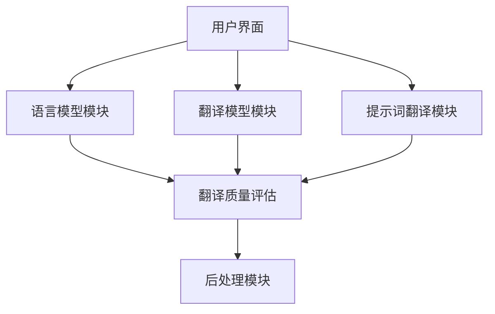

                 


### 文章标题：跨语言提示词翻译与适配

#### 关键词：跨语言翻译、提示词、语言模型、翻译模型、适配策略

#### 摘要：
本文深入探讨了跨语言提示词翻译与适配的技术与实践。首先，介绍了跨语言翻译的背景与意义，分析了跨语言翻译的核心概念与原理。随后，详细阐述了跨语言翻译模型构建的方法，包括语言模型和翻译模型的构建原理及训练方法。接着，讨论了跨语言翻译系统设计与优化，包括系统架构设计、翻译质量评估与优化、系统性能优化。本文的第二部分聚焦于跨语言提示词适配，从提示词理解、提示词生成、适配案例分析等多个角度进行探讨。最后，对跨语言提示词翻译与适配的未来发展趋势进行了展望，提出了当前面临的挑战及解决方案。

### 第1章：跨语言翻译概述

#### 1.1 跨语言翻译的背景与意义

随着全球化进程的加速，跨语言交流的需求日益增长。无论是国际贸易、国际合作，还是跨国教育、文化交流，语言障碍始终是一个亟待解决的问题。跨语言翻译不仅能够促进信息的流通，提升沟通效率，还能够增强不同文化之间的理解和融合。

跨语言翻译技术的发展历程可以分为几个阶段：传统规则翻译、基于统计的机器翻译、基于神经网络的机器翻译。每个阶段都标志着翻译技术的重大进步。传统规则翻译依赖于人工编写规则，尽管具有一定的准确性，但难以处理大规模数据和复杂的语言现象。基于统计的机器翻译通过大规模语料库的统计方法，提高了翻译的自动化程度和翻译质量。而基于神经网络的机器翻译，利用深度学习技术，通过训练大量数据，实现了更自然的翻译效果。

#### 1.2 跨语言翻译的核心概念与原理

跨语言翻译涉及几个核心概念：语言模型、翻译模型和提示词翻译机制。

语言模型用于描述一种语言的概率分布，通过训练大量文本数据，可以预测一个词或句子在特定上下文中的可能性。翻译模型则用于将一种语言的句子映射到另一种语言的句子。提示词翻译机制通过结合语言模型和翻译模型，实现输入提示词到目标语言翻译的过程。

#### 1.3 跨语言翻译的现状与挑战

当前，跨语言翻译技术已经取得了显著的进展，特别是在基于神经网络的翻译模型方面。然而，仍然面临一些挑战：

1. **语言歧义**：自然语言中存在大量的歧义现象，如何准确理解上下文，消除歧义，是一个难题。
2. **文化差异**：不同语言和文化的表达方式不同，如何准确传递文化含义，是一个挑战。
3. **低资源语言**：许多低资源语言的语料库有限，如何利用有限的资源进行有效的翻译训练，是一个亟待解决的问题。

### 第2章：跨语言翻译模型构建

#### 2.1 语言模型构建

语言模型是跨语言翻译的基础，用于描述输入语言的概率分布。构建语言模型通常包括以下几个步骤：

1. **数据预处理**：对输入文本进行清洗、分词、去停用词等预处理操作。
2. **词嵌入**：将词语转换为向量表示，常用的词嵌入技术包括Word2Vec、GloVe等。
3. **模型训练**：使用训练数据进行模型训练，常用的语言模型包括n-gram模型、循环神经网络（RNN）、长短期记忆网络（LSTM）等。

以下是构建语言模型的伪代码示例：

```python
def train_language_model(corpus):
    # 数据预处理
    corpus = preprocess(corpus)
    
    # 词嵌入
    embeddings = train_embeddings(corpus)
    
    # 模型训练
    model = train_rnn_model(embeddings)
    
    return model
```

#### 2.2 翻译模型构建

翻译模型用于将源语言句子映射到目标语言句子。构建翻译模型通常包括以下几个步骤：

1. **数据预处理**：对翻译数据对进行清洗、分词、去停用词等预处理操作。
2. **编码器与解码器**：构建编码器和解码器模型，用于将源语言句子编码为向量表示，并将目标语言句子解码为目标句子。
3. **模型训练**：使用训练数据对编码器和解码器模型进行训练。

以下是构建翻译模型的伪代码示例：

```python
def train_translation_model(source_corpus, target_corpus):
    # 数据预处理
    source_corpus = preprocess(source_corpus)
    target_corpus = preprocess(target_corpus)
    
    # 编码器与解码器
    encoder = train_encoder(source_corpus)
    decoder = train_decoder(target_corpus)
    
    # 模型训练
    model = train_seq2seq_model(encoder, decoder)
    
    return model
```

#### 2.3 提示词翻译模型

提示词翻译模型是跨语言翻译的核心，通过结合语言模型和翻译模型，实现输入提示词到目标语言翻译的过程。构建提示词翻译模型通常包括以下几个步骤：

1. **数据预处理**：对提示词进行预处理，如分词、去停用词等。
2. **模型融合**：将语言模型和翻译模型融合为一个统一的模型，常用的方法包括序列到序列（Seq2Seq）模型、注意力机制（Attention）模型等。
3. **模型训练**：使用训练数据对模型进行训练。

以下是构建提示词翻译模型的伪代码示例：

```python
def train_prompt_translation_model(source_corpus, target_corpus, prompts):
    # 数据预处理
    prompts = preprocess(prompts)
    
    # 模型融合
    encoder = train_encoder(source_corpus)
    decoder = train_decoder(target_corpus)
    attention = train_attention_model(encoder, decoder)
    
    # 模型训练
    model = train_seq2seq_model_with_attention(encoder, decoder, attention)
    
    return model
```

### 第3章：跨语言翻译系统设计与优化

#### 3.1 跨语言翻译系统设计

跨语言翻译系统设计主要包括系统架构设计和模块划分。一个典型的跨语言翻译系统架构包括以下几个模块：

1. **用户界面**：提供用户输入提示词和获取翻译结果的界面。
2. **语言模型模块**：用于生成源语言和目标语言的概率分布。
3. **翻译模型模块**：用于将源语言句子映射到目标语言句子。
4. **提示词翻译模块**：用于将输入提示词翻译为目标语言。
5. **后处理模块**：对翻译结果进行格式化、修正等处理。

以下是跨语言翻译系统架构的Mermaid流程图：



#### 3.2 翻译质量评估与优化

翻译质量评估是跨语言翻译系统设计中的重要环节，用于评估翻译结果的准确性、流畅性等。常用的翻译质量评估方法包括：

1. **BLEU评分**：基于统计的评估方法，通过计算翻译结果与参考翻译之间的相似度来评估翻译质量。
2. **人工评估**：通过专家对翻译结果进行主观评估，判断翻译的准确性和流畅性。
3. **BLEU+方法**：结合BLEU评分和人工评估，以提高评估的准确性。

翻译质量优化策略包括：

1. **增加训练数据**：通过收集更多的高质量翻译数据，提高翻译模型的准确性。
2. **模型优化**：通过调整模型参数、优化模型结构等手段，提高翻译质量。
3. **后处理优化**：对翻译结果进行格式化、修正等处理，以提高翻译的流畅性。

#### 3.3 系统性能优化

系统性能优化是保证跨语言翻译系统高效运行的关键。系统性能优化策略包括：

1. **并行计算**：通过利用多核CPU或GPU，加速模型训练和翻译过程。
2. **分布式计算**：通过将计算任务分布在多台服务器上，提高系统的处理能力。
3. **缓存策略**：通过缓存常用翻译结果，减少翻译时间和计算资源消耗。

### 第4章：跨语言提示词理解

#### 4.1 提示词理解的基本原理

跨语言提示词理解是跨语言翻译的核心环节，用于将用户输入的提示词翻译为目标语言。提示词理解的基本原理包括：

1. **语言模型**：用于预测输入提示词的概率分布。
2. **翻译模型**：用于将输入提示词映射到目标语言。
3. **提示词翻译模型**：用于将输入提示词翻译为目标语言。

提示词理解的过程可以分为以下几个步骤：

1. **输入提示词预处理**：对输入提示词进行分词、去停用词等预处理操作。
2. **语言模型预测**：使用语言模型预测输入提示词的概率分布。
3. **翻译模型预测**：使用翻译模型将输入提示词映射到目标语言。
4. **提示词翻译模型预测**：使用提示词翻译模型将输入提示词翻译为目标语言。

以下是提示词理解的伪代码示例：

```python
def understand_prompt(prompt, language_model, translation_model, prompt_translation_model):
    # 输入提示词预处理
    prompt = preprocess_prompt(prompt)
    
    # 语言模型预测
    probability_distribution = language_model.predict(prompt)
    
    # 翻译模型预测
    translated_prompt = translation_model.translate(prompt)
    
    # 提示词翻译模型预测
    translated_prompt = prompt_translation_model.translate(prompt)
    
    return translated_prompt
```

#### 4.2 提示词理解的算法

提示词理解算法可以分为基于语言模型的提示词理解和基于翻译模型的提示词理解。

基于语言模型的提示词理解主要通过语言模型预测输入提示词的概率分布，然后选择概率最高的提示词作为翻译结果。常用的语言模型包括n-gram模型、循环神经网络（RNN）、长短期记忆网络（LSTM）等。

基于翻译模型的提示词理解主要通过翻译模型将输入提示词映射到目标语言，然后选择概率最高的翻译结果作为翻译结果。常用的翻译模型包括序列到序列（Seq2Seq）模型、注意力机制（Attention）模型等。

以下是基于语言模型的提示词理解的伪代码示例：

```python
def understand_prompt_based_on_language_model(prompt, language_model):
    # 输入提示词预处理
    prompt = preprocess_prompt(prompt)
    
    # 语言模型预测
    probability_distribution = language_model.predict(prompt)
    
    # 选择概率最高的提示词
    highest_probability_prompt = select_highest_probability_prompt(probability_distribution)
    
    return highest_probability_prompt
```

以下是基于翻译模型的提示词理解的伪代码示例：

```python
def understand_prompt_based_on_translation_model(prompt, translation_model):
    # 输入提示词预处理
    prompt = preprocess_prompt(prompt)
    
    # 翻译模型预测
    translated_prompt = translation_model.translate(prompt)
    
    return translated_prompt
```

#### 4.3 提示词理解的挑战与对策

提示词理解在跨语言翻译过程中面临一些挑战，如语言歧义、文化差异等。

**语言歧义问题**：自然语言中存在大量的歧义现象，如何准确理解上下文，消除歧义，是一个难题。对策包括：

1. **上下文分析**：通过分析上下文信息，确定歧义词语的确切含义。
2. **多义词处理**：使用词向量、知识图谱等技术，对多义词进行精细处理。

**文化差异问题**：不同语言和文化的表达方式不同，如何准确传递文化含义，是一个挑战。对策包括：

1. **文化适应性**：对翻译结果进行文化适应性处理，确保翻译结果的准确性。
2. **文化知识库**：构建包含不同语言和文化的知识库，为翻译提供文化背景信息。

### 第5章：跨语言提示词生成

#### 5.1 提示词生成的核心算法

跨语言提示词生成是跨语言翻译的重要组成部分，通过将源语言句子生成提示词，为翻译提供输入。提示词生成的核心算法包括基于语言模型的提示词生成和基于翻译模型的提示词生成。

基于语言模型的提示词生成主要通过语言模型生成源语言句子，然后从生成的句子中选择提示词。常用的语言模型包括n-gram模型、循环神经网络（RNN）、长短期记忆网络（LSTM）等。

基于翻译模型的提示词生成主要通过翻译模型将源语言句子映射到目标语言句子，然后从生成的目标语言句子中选择提示词。常用的翻译模型包括序列到序列（Seq2Seq）模型、注意力机制（Attention）模型等。

以下是基于语言模型的提示词生成的伪代码示例：

```python
def generate_prompt_based_on_language_model(source_sentence, language_model):
    # 生成源语言句子
    generated_sentence = language_model.generate(source_sentence)
    
    # 选择提示词
    prompt = select_prompt_from_generated_sentence(generated_sentence)
    
    return prompt
```

以下是基于翻译模型的提示词生成的伪代码示例：

```python
def generate_prompt_based_on_translation_model(source_sentence, translation_model):
    # 生成目标语言句子
    target_sentence = translation_model.translate(source_sentence)
    
    # 选择提示词
    prompt = select_prompt_from_target_sentence(target_sentence)
    
    return prompt
```

#### 5.2 提示词生成的优化策略

提示词生成的优化策略包括提高生成质量和提高生成效率。

**提高生成质量的方法**：

1. **多模型融合**：结合多个语言模型和翻译模型，提高生成提示词的准确性。
2. **上下文信息利用**：利用上下文信息，提高提示词生成的相关性和准确性。
3. **数据增强**：通过数据增强技术，增加训练数据的多样性，提高模型生成提示词的泛化能力。

**提高生成效率的方法**：

1. **并行计算**：通过并行计算，加速模型生成提示词的过程。
2. **缓存策略**：通过缓存已生成的提示词，减少重复计算，提高生成效率。

#### 5.3 提示词生成的应用场景

提示词生成在跨语言翻译领域具有广泛的应用场景，如文本摘要、问答系统等。

**文本摘要**：提示词生成可以用于生成摘要的关键词，帮助用户快速了解文本的主要内容。

```python
def generate_important_keywords(text, language_model):
    # 生成源语言句子
    generated_sentence = language_model.generate(text)
    
    # 选择重要关键词
    important_keywords = select_important_keywords_from_generated_sentence(generated_sentence)
    
    return important_keywords
```

**问答系统**：提示词生成可以用于生成问答系统的问题和答案。

```python
def generate_question_and_answer(source_sentence, translation_model):
    # 生成源语言句子
    generated_sentence = translation_model.generate(source_sentence)
    
    # 生成问题
    question = generate_question_from_generated_sentence(generated_sentence)
    
    # 生成答案
    answer = generate_answer_from_generated_sentence(generated_sentence)
    
    return question, answer
```

### 第6章：跨语言提示词适配案例分析

#### 6.1 案例分析一：在线翻译平台

在线翻译平台是跨语言提示词适配的一个典型应用场景。以下是一个在线翻译平台的架构设计和适配策略：

**平台架构设计**：

1. **用户界面**：提供用户输入提示词和获取翻译结果的界面。
2. **语言模型模块**：用于生成源语言和目标语言的概率分布。
3. **翻译模型模块**：用于将源语言句子映射到目标语言句子。
4. **提示词翻译模块**：用于将输入提示词翻译为目标语言。
5. **后处理模块**：对翻译结果进行格式化、修正等处理。

**适配策略**：

1. **自动调整翻译模型参数**：根据用户的输入和反馈，自动调整翻译模型的参数，以提高翻译准确性。
2. **用户自定义词典**：允许用户自定义词典，将特定的短语和表达方式加入词典，提高翻译的个性化程度。
3. **上下文信息利用**：利用上下文信息，提高提示词翻译的相关性和准确性。

#### 6.2 案例分析二：多语言客服系统

多语言客服系统是跨语言提示词适配的另一个重要应用场景。以下是一个多语言客服系统的架构设计和适配方法：

**系统架构设计**：

1. **用户界面**：提供用户输入提示词和获取翻译结果的界面。
2. **语言模型模块**：用于生成源语言和目标语言的概率分布。
3. **翻译模型模块**：用于将源语言句子映射到目标语言句子。
4. **提示词翻译模块**：用于将输入提示词翻译为目标语言。
5. **后处理模块**：对翻译结果进行格式化、修正等处理。

**适配方法**：

1. **自适应翻译模型**：根据用户的历史对话记录，自动调整翻译模型的参数，以提高翻译准确性。
2. **多语言对话管理**：支持多种语言之间的转换，确保用户能够获得准确、流畅的翻译结果。
3. **实时反馈与修正**：允许用户对翻译结果进行实时反馈，翻译模型根据用户反馈进行修正，提高翻译质量。

#### 6.3 案例分析三：跨语言教育平台

跨语言教育平台是跨语言提示词适配的另一个重要应用场景。以下是一个跨语言教育平台的平台设计和适配策略：

**平台设计**：

1. **用户界面**：提供用户输入提示词和获取翻译结果的界面。
2. **语言模型模块**：用于生成源语言和目标语言的概率分布。
3. **翻译模型模块**：用于将源语言句子映射到目标语言句子。
4. **提示词翻译模块**：用于将输入提示词翻译为目标语言。
5. **课程管理模块**：管理课程内容、课程进度等。

**适配策略**：

1. **个性化翻译**：根据用户的学习进度和学习需求，提供个性化的翻译服务。
2. **文化适应性**：对翻译结果进行文化适应性处理，确保翻译结果的准确性。
3. **实时交互**：支持用户与课程内容、其他用户的实时交互，提高学习体验。

### 第7章：跨语言提示词翻译与适配展望

#### 7.1 当前趋势与未来发展方向

跨语言提示词翻译与适配技术近年来取得了显著的进展，但仍然面临一些挑战。未来发展趋势包括：

1. **深度学习技术的应用**：深度学习技术，如神经网络、生成对抗网络（GAN）等，将进一步推动跨语言提示词翻译与适配技术的发展。
2. **多模态翻译**：结合文本、图像、语音等多模态信息，实现更准确的翻译效果。
3. **自适应翻译**：根据用户的行为、偏好等特征，实现个性化的翻译服务。

#### 7.2 技术挑战与解决方案

当前，跨语言提示词翻译与适配技术面临以下挑战：

1. **语言理解与生成的挑战**：如何准确理解用户的输入，并生成自然、流畅的翻译结果，是一个关键问题。解决方案包括：
   - **上下文信息利用**：通过利用上下文信息，提高翻译的准确性和流畅性。
   - **多模型融合**：结合多种语言模型和翻译模型，提高翻译质量。

2. **适配策略的优化**：如何根据不同的应用场景，优化翻译策略，是一个挑战。解决方案包括：
   - **用户行为分析**：通过分析用户的行为，为用户提供个性化的翻译服务。
   - **实时反馈与修正**：允许用户对翻译结果进行实时反馈，翻译模型根据用户反馈进行修正。

#### 7.3 行业应用前景

跨语言提示词翻译与适配技术在多个行业具有广泛的应用前景：

1. **国际贸易**：跨语言提示词翻译与适配技术可以促进国际贸易的顺利进行，提高沟通效率。
2. **跨国教育**：跨语言提示词翻译与适配技术可以支持跨语言教学，提高学习效果。
3. **多语言客服**：跨语言提示词翻译与适配技术可以支持多语言客服系统，提高客户满意度。

未来，随着技术的不断进步，跨语言提示词翻译与适配技术将在更多领域得到应用，为人类社会的沟通与交流提供更强大的支持。

