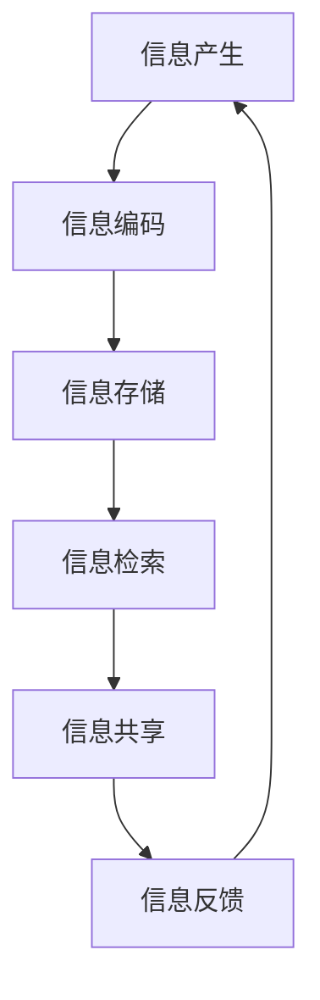
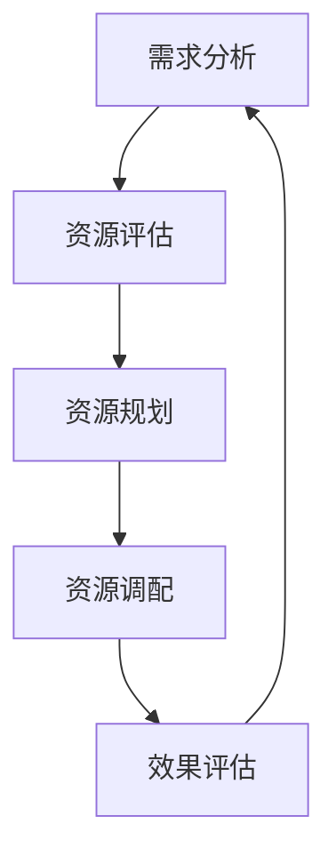
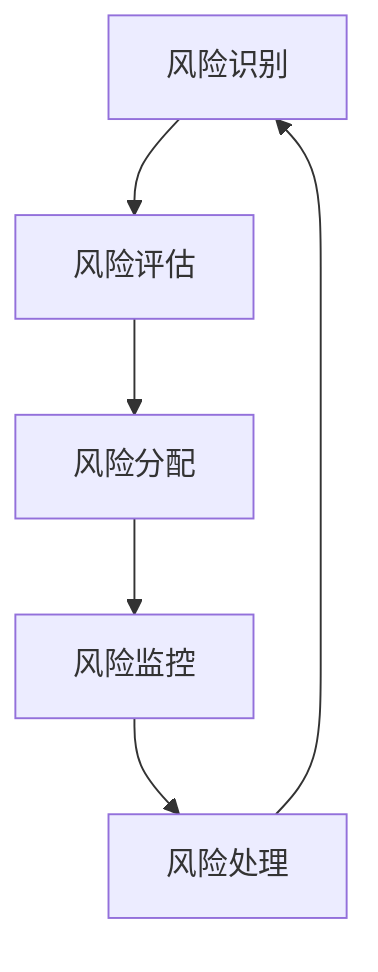
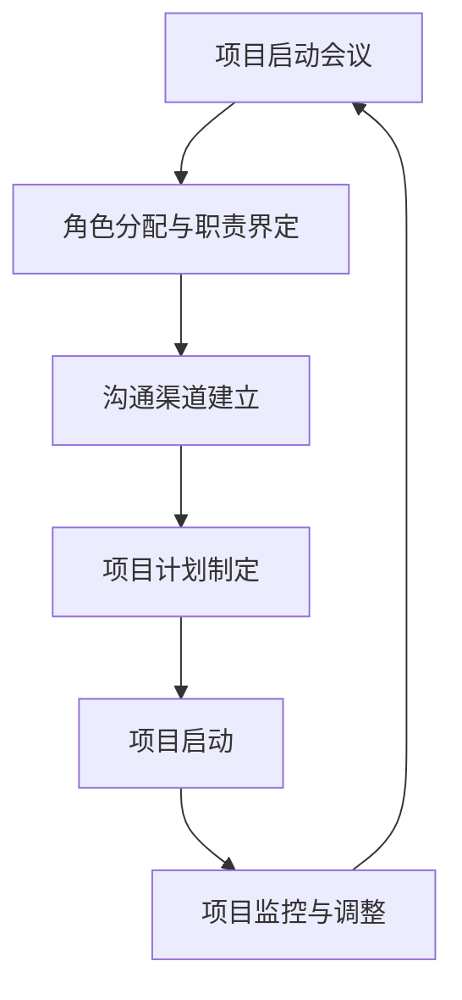
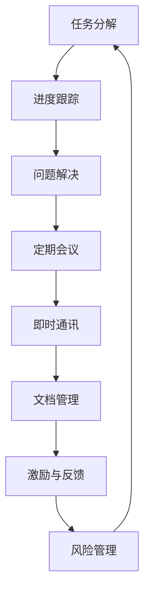
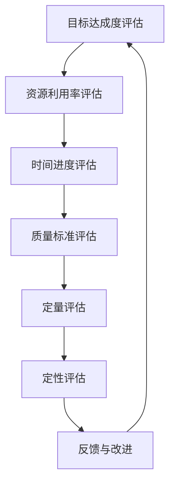
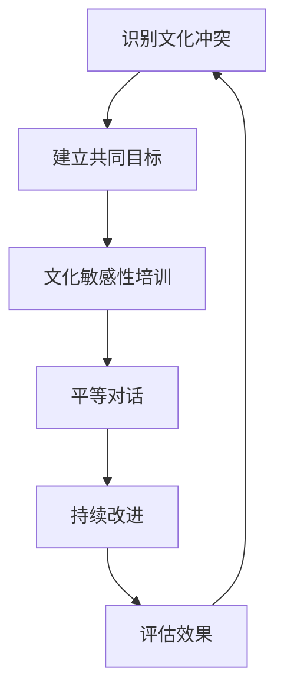
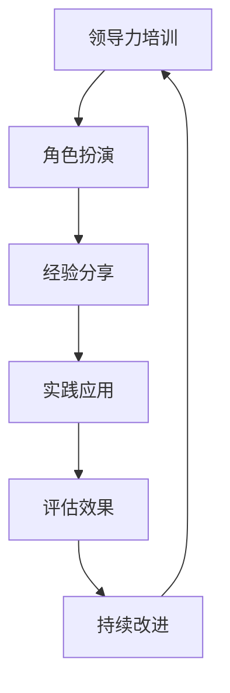
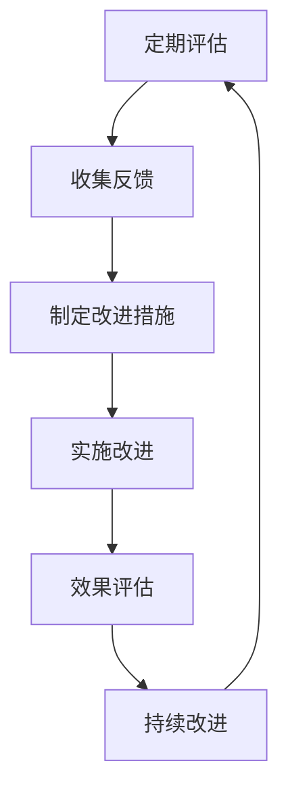

                 

### 引言

在现代企业运作中，跨部门协作的重要性日益凸显。随着企业规模的扩大和业务复杂性的增加，各个部门之间的联系愈加紧密，彼此之间的协作效率和质量直接影响着企业的整体运营效率和竞争力。然而，现实中存在诸多部门壁垒，这些壁垒严重阻碍了跨部门协作的有效进行。

#### 部门壁垒的现状与影响

部门壁垒是指由于组织结构、文化差异、沟通障碍等因素，导致各部门之间难以实现顺畅协作的一种现象。具体表现在：

1. **组织结构壁垒**：各部门的职责和权限划分明确，容易导致各自为政，信息流通不畅。
2. **文化差异壁垒**：不同的部门有着不同的工作方式和价值观，彼此之间缺乏理解和信任，难以形成协同效应。
3. **沟通障碍壁垒**：沟通渠道不畅，信息传递不及时、不准确，导致协作效率低下。

这些部门壁垒对企业的负面影响是多方面的：

1. **资源浪费**：各部门之间的资源无法有效整合，导致重复劳动和资源浪费。
2. **决策效率降低**：信息传递不畅，决策周期延长，影响企业快速响应市场变化的能力。
3. **创新能力受限**：缺乏跨部门的合作和交流，限制了企业的创新能力和市场竞争力。

#### 跨部门协作的重要性

跨部门协作不仅有助于打破部门壁垒，提升企业整体效率，还能带来以下几方面的好处：

1. **资源优化**：通过跨部门协作，企业能够充分利用各部门的资源和优势，实现资源的最优配置。
2. **信息共享**：跨部门协作促进了信息的流通和共享，提高了决策的准确性和及时性。
3. **协同创新**：跨部门协作激发了不同部门和团队的创意和创新能力，为企业发展注入新动力。
4. **客户满意度**：跨部门协作确保了项目的高效推进和客户需求的有效响应，提升了客户满意度。

综上所述，优化跨部门协作，打破部门壁垒，已成为现代企业提升竞争力的重要途径。接下来，我们将从理论基础、核心要素、实际操作等多个角度，深入探讨如何实现有效的跨部门协作。

### 关键词

- 跨部门协作
- 部门壁垒
- 组织效率
- 信息共享
- 资源整合
- 风险共担
- 领导力
- 持续改进

### 摘要

本文旨在探讨如何优化跨部门协作，以打破部门壁垒，提升企业整体运营效率。首先，我们介绍了跨部门协作的重要性及其在当前企业运作中的现状与影响。接着，从理论层面分析了协作理论、部门壁垒的成因及跨部门协作的策略框架。随后，详细阐述了信息共享、资源整合和风险共担等核心要素，并通过项目实战展示了跨部门协作的实际操作方法。最后，我们分析了跨部门协作的挑战与解决方案，并总结了一些最佳实践。通过本文的深入探讨，希望为企业提供有效优化跨部门协作的策略和方法。

### 第二部分：跨部门协作的理论基础

#### 协作理论

跨部门协作的理论基础首先源自协作理论。协作理论关注的是个体和集体如何通过相互配合来实现共同的目标。以下是一些关键的协作理论概念：

1. **协作网络**：协作网络描述了个体和集体之间的互动关系，通过节点和边来表示。节点代表个体或组织，边表示它们之间的协作关系。一个高效的协作网络具有高度的连通性和适当的密度，以便在需要时快速传递信息。

2. **协作效率**：协作效率指的是完成特定任务所需的时间和资源。高效的协作依赖于良好的沟通机制、合理的资源配置以及团队成员之间的信任。

3. **协作共享**：协作共享是指团队成员在任务执行过程中共享信息、知识和资源。协作共享可以提升团队的整体效能，缩短任务完成时间，并减少错误率。

#### 协作的理论框架

在跨部门协作中，协作理论提供了一个整体框架，帮助理解协作的各个方面：

1. **协作目标**：确定明确的协作目标是跨部门协作的第一步。目标应具体、可衡量、可实现、相关性强且时限明确（SMART原则）。明确的目标有助于团队集中精力，避免资源的浪费。

2. **角色分工**：在跨部门协作中，明确每个团队成员的角色和职责至关重要。角色分工需要考虑成员的专业技能、经验和团队整体需求的平衡。

3. **沟通机制**：良好的沟通机制是跨部门协作成功的关键。沟通机制包括定期的会议、信息共享平台和即时的沟通工具。有效的沟通确保了信息的透明度和实时性，有助于团队成员之间的理解和合作。

4. **协作文化**：协作文化是指团队内部对协作的态度和价值观念。一个健康的协作文化鼓励开放性、信任和共享，能够减少摩擦，促进合作。

#### 部门壁垒的成因

部门壁垒的产生通常源于以下几个方面的原因：

1. **组织结构壁垒**：企业的组织结构往往使得各部门相对独立，形成信息孤岛。各部门在职能划分、资源分配和决策权上的隔离，导致协作效率降低。

2. **文化差异壁垒**：不同的部门有着不同的工作方式和价值观。例如，技术部门可能注重数据和技术创新，而销售部门可能更关注市场和客户需求。这些差异可能导致各部门之间的误解和冲突。

3. **沟通障碍壁垒**：跨部门的沟通往往面临障碍，如信息传递的不及时、不准确和不全面。沟通障碍可能是由于沟通渠道不畅、沟通工具不适用或团队成员之间的沟通能力不足。

4. **资源分配壁垒**：资源分配的不合理可能导致部门间的资源不平衡，进而影响协作效率。例如，一个部门可能拥有充足的资源，而另一个部门则面临资源短缺。

#### 跨部门协作的策略框架

为了实现有效的跨部门协作，企业需要制定一个综合的策略框架。以下是一些关键策略：

1. **明确协作目标**：确保所有部门都明确了解协作的目标和意义，并将个人目标与整体目标结合起来。

2. **搭建协作平台**：建立一个统一的信息共享平台，使各部门能够方便地获取和共享信息。这可以是内部网、共享数据库或协作工具。

3. **建立跨部门团队**：组建跨部门的临时或常设团队，以解决特定问题或项目。这些团队应包括来自不同部门的成员，确保多样化视角。

4. **培训与激励**：提供跨部门协作的培训，提升团队成员的沟通能力和协作意识。同时，制定激励政策，鼓励团队成员积极参与协作。

5. **定期评估与反馈**：定期评估跨部门协作的效果，收集团队成员的反馈，不断优化协作流程。

通过上述策略，企业可以有效地打破部门壁垒，提升跨部门协作的效率和效果。

### 第三部分：跨部门协作的核心要素

跨部门协作的成功依赖于一系列核心要素的协同作用。以下是信息共享、资源整合和风险共担这三个关键要素的详细阐述。

#### 信息共享

信息共享是跨部门协作的重要基础。通过有效的信息共享，各部门可以实时获取所需的信息，确保协作的顺利进行。

1. **信息共享的重要性**：
   - 提高协作效率：信息共享使得团队成员能够及时获取关键信息，避免重复工作，提高整体效率。
   - 减少误解和冲突：共享的信息有助于各部门之间建立信任，减少因信息不对称导致的误解和冲突。
   - 支持决策制定：全面、准确的信息是制定科学决策的基础，信息共享有助于提高决策的质量。

2. **信息共享的障碍**：
   - 信息孤岛：各部门独立运作，信息难以互通，形成信息孤岛。
   - 信息滞后：信息传递不及时，导致决策延迟。
   - 信息不完整：信息传递过程中，重要信息可能丢失或不完整，影响协作效果。

3. **信息共享的策略与实践**：
   - **建立统一的信息共享平台**：构建一个统一的信息共享平台，如企业内部网、共享数据库等，方便各部门获取和分享信息。
   - **规范信息管理流程**：明确信息的分类、编码、存储和访问权限，确保信息的规范化和标准化。
   - **采用现代化的沟通工具**：使用即时通讯工具、电子邮件、视频会议等，提高信息传递的速度和效率。

以下是一个简单的信息共享流程图：

#### 资源整合

资源整合是指将各部门的资源和优势进行有效配置和利用，以实现整体效益的最大化。

1. **资源整合的概念**：
   - 资源：包括人力、物资、资金、技术等。
   - 整合：通过优化配置和高效利用，使资源发挥最大效能。

2. **资源整合的步骤**：
   - **需求分析**：了解各部门的资源需求，识别资源缺口和优势资源。
   - **资源评估**：评估各部门的资源现状，包括资源数量、质量、使用效率等。
   - **资源规划**：根据需求分析和资源评估结果，制定资源整合方案。
   - **资源调配**：实施资源整合方案，将资源进行优化配置和利用。

3. **资源整合的案例分析**：
   - 案例一：某企业通过跨部门资源整合，将市场营销部门的需求与研发部门的技术优势相结合，成功推出了一款新产品，提高了市场竞争力。
   - 案例二：某公司通过整合各部门的人力资源，组建了一个跨部门的专项项目组，快速响应市场变化，提升了项目执行效率。

以下是一个简单的资源整合流程图：

#### 风险共担

在跨部门协作中，风险共担是指各部门共同承担项目风险，以降低单个部门的风险负担，提高项目的整体稳定性。

1. **风险共担的原则**：
   - **公平性**：各部门应按照实际贡献和风险承受能力公平地分担风险。
   - **合作性**：各部门应建立信任，共同应对风险，避免推诿责任。
   - **透明性**：风险分担的规则和结果应透明公开，确保各部门的知情权和参与权。

2. **风险共担的机制设计**：
   - **风险识别**：各部门共同识别项目潜在的风险点，明确各自的风险责任。
   - **风险评估**：对识别出的风险进行评估，确定风险等级和应对策略。
   - **风险分配**：根据风险评估结果，制定风险分担方案，明确各部门的风险分担比例。
   - **风险监控**：建立风险监控机制，及时掌握风险动态，确保风险得到有效控制。

3. **风险共担的实践案例**：
   - 案例一：某企业通过建立跨部门的风险共担机制，成功应对了一次市场突发事件，减少了企业的经济损失。
   - 案例二：某项目团队在实施跨部门协作时，制定了详细的风险分担方案，确保了项目按期完成，避免了项目延误带来的损失。

以下是一个简单的风险共担流程图：

通过信息共享、资源整合和风险共担这三个核心要素的有效实施，企业可以打破部门壁垒，提升跨部门协作的效率和效果，从而实现企业的整体目标。

### 第四部分：跨部门协作的实际操作

#### 项目启动

跨部门协作项目的成功启动是整个项目顺利推进的重要前提。以下是如何成功启动跨部门协作项目的关键步骤：

1. **项目启动的准备**：
   - **明确项目目标**：确保所有参与部门都明确了解项目的目标，目标应具体、可衡量、可实现、相关性强且时限明确（SMART原则）。
   - **组建项目团队**：根据项目需求，从各部门挑选合适的团队成员，确保团队成员具备相关技能和经验。
   - **制定项目计划**：制定详细的项目计划，包括项目的范围、进度、资源需求、风险评估等。

2. **项目启动的流程**：
   - **项目启动会议**：召开项目启动会议，介绍项目背景、目标、计划，确保所有团队成员对项目有清晰的认识。
   - **角色分配与职责界定**：明确每个团队成员的角色和职责，确保每个人都知道自己的任务和期望成果。
   - **沟通渠道建立**：建立一个有效的沟通渠道，包括定期会议、邮件、即时通讯工具等，确保信息及时传递。

3. **项目启动的案例分析**：
   - **案例一**：某企业在启动一个新产品开发项目时，通过召开跨部门启动会议，明确了各团队的目标和任务，建立了有效的沟通渠道，确保项目顺利启动。
   - **案例二**：某公司为了推进一个大型IT项目，从各部门挑选了具备技术和管理经验的团队成员，制定了详细的项目计划，并通过定期的项目会议确保项目按计划进行。

以下是一个简单的项目启动流程图：

#### 项目执行

项目执行是跨部门协作的核心阶段，以下是项目执行中的关键协作要素：

1. **项目执行中的协作**：
   - **任务分解**：将项目任务分解为具体的子任务，并明确每个子任务的负责人和交付时间。
   - **进度跟踪**：建立进度跟踪机制，定期检查任务进度，确保项目按计划进行。
   - **问题解决**：及时解决项目执行过程中遇到的问题，避免问题积累导致项目延误。

2. **项目执行中的沟通**：
   - **定期会议**：定期召开项目会议，汇报项目进展，讨论遇到的问题，确保信息畅通。
   - **即时通讯**：使用即时通讯工具，如Slack、Microsoft Teams等，确保团队成员之间的沟通及时、高效。
   - **文档管理**：建立统一的文档管理平台，确保项目文档的及时更新和共享。

3. **项目执行中的团队管理**：
   - **激励与反馈**：对团队成员进行激励，鼓励他们积极参与项目，并对项目进度和成果进行定期反馈。
   - **风险管理**：持续监控项目风险，采取预防措施，确保项目稳定推进。

以下是一个简单的项目执行流程图：

#### 项目评估

项目评估是跨部门协作项目完成后必不可少的一步，以下是项目评估的关键步骤：

1. **项目评估的标准**：
   - **目标达成度**：评估项目是否实现了预定目标，达成目标的程度如何。
   - **资源利用率**：评估项目资源的使用情况，包括人力、资金、物资等。
   - **时间进度**：评估项目是否按时完成，是否有延误现象。
   - **质量标准**：评估项目成果是否符合预定的质量标准。

2. **项目评估的方法**：
   - **定量评估**：使用数据和分析工具，如KPI、统计图表等，对项目成果进行量化评估。
   - **定性评估**：通过访谈、问卷调查等方式，收集团队成员和客户的反馈，进行定性评估。

3. **项目评估的案例分析**：
   - **案例一**：某企业在新产品开发项目完成后，通过定量和定性评估方法，评估了项目的目标达成度、资源利用率和时间进度，并收集了客户的反馈，为后续项目提供了改进方向。
   - **案例二**：某公司通过项目评估，发现项目执行过程中存在沟通不畅的问题，通过改进沟通渠道和团队管理，提升了项目的执行效率。

以下是一个简单的项目评估流程图：

通过上述实际操作步骤，企业可以确保跨部门协作项目的高效执行和顺利完成，从而实现企业的战略目标。

### 第五部分：跨部门协作的挑战与解决方案

#### 文化冲突的解决

文化冲突是跨部门协作中常见的问题，解决文化冲突是确保协作顺利进行的关键。以下是一些解决文化冲突的策略：

1. **识别文化冲突**：
   - **行为观察**：观察团队成员的行为，发现潜在的冲突点。
   - **沟通反馈**：与团队成员进行一对一沟通，了解他们的观点和感受。

2. **解决策略**：
   - **建立共同目标**：明确跨部门协作的共同目标，使团队成员聚焦于共同成果。
   - **文化敏感性培训**：开展文化敏感性培训，提升团队成员对多样性的认识和接受度。
   - **平等对话**：鼓励团队成员开展平等对话，尊重彼此的意见和观点。

3. **案例分析**：
   - **案例一**：某公司在跨部门协作中，通过文化敏感性培训和共同目标设定，成功解决了技术部门与市场部门之间的文化冲突。
   - **案例二**：某企业通过平等对话和共同目标建立，解决了不同部门之间的文化差异，提高了协作效率。

以下是一个简单的文化冲突解决流程图：

#### 领导力与跨部门协作

领导力在跨部门协作中起着至关重要的作用。以下是一些提升领导力的策略：

1. **领导力在跨部门协作中的作用**：
   - **协调资源**：领导力有助于协调各部门的资源，确保项目顺利进行。
   - **激励团队**：领导力能够激励团队成员，提升协作积极性和创造力。
   - **解决冲突**：领导力能够有效解决跨部门协作中出现的冲突，保持团队稳定。

2. **领导力培养的策略**：
   - **领导力培训**：提供领导力培训课程，提升领导者的管理能力和协作能力。
   - **角色扮演**：通过角色扮演和模拟情景，提升领导者在实际情境中的应变能力。
   - **经验分享**：鼓励领导者之间进行经验分享和交流，互相学习，共同成长。

3. **领导力在跨部门协作中的实践案例**：
   - **案例一**：某公司的CEO通过定期召开跨部门协作会议，协调各部门资源，提升了项目执行效率。
   - **案例二**：某项目经理通过领导力培训和角色扮演，成功解决了跨部门协作中的沟通障碍，提高了团队协作效果。

以下是一个简单的领导力提升流程图：

#### 持续改进与优化

持续改进是跨部门协作中的一项重要原则，以下是一些持续改进的方法：

1. **持续改进的必要性**：
   - **适应变化**：企业内外部环境不断变化，持续改进能够帮助企业适应这些变化。
   - **提升效率**：持续改进有助于发现并消除协作中的瓶颈和问题，提升整体效率。
   - **提高竞争力**：持续改进能够提升企业的创新能力，增强市场竞争力。

2. **持续改进的方法**：
   - **定期评估**：定期对跨部门协作的效果进行评估，识别存在的问题和改进方向。
   - **收集反馈**：通过问卷调查、访谈等方式，收集团队成员和客户的反馈，了解协作过程中的问题和改进需求。
   - **实施改进**：根据评估和反馈结果，制定改进措施，并逐一实施。

3. **持续改进的实践案例**：
   - **案例一**：某企业通过定期项目评估和反馈，发现跨部门协作中存在沟通不畅的问题，通过改进沟通渠道和团队管理，显著提升了协作效率。
   - **案例二**：某公司通过持续改进，优化了跨部门协作流程，减少了项目执行时间，提高了客户满意度。

以下是一个简单的持续改进流程图：

通过上述挑战与解决方案的探讨，企业可以更好地应对跨部门协作中的文化冲突、提升领导力并实现持续改进，从而提高跨部门协作的效率和质量。

### 第六部分：跨部门协作的成功案例

#### 国内外跨部门协作成功案例

跨部门协作的成功案例在全球范围内都得到了广泛的认可和应用，以下是一些国内外知名企业的成功实践：

1. **案例一：苹果公司**

苹果公司以其卓越的产品设计和创新技术而闻名，其成功的一个关键因素在于高效的跨部门协作。苹果公司的产品设计团队、研发团队和市场团队紧密合作，确保从设计理念到产品发布整个过程的高效推进。

- **成功要素**：明确的协作目标、高效的沟通渠道、资源共享机制、跨部门定期会议。
- **实践成效**：苹果公司通过跨部门协作，快速响应市场需求，不断推出具有竞争力的产品，大大提升了市场占有率。

2. **案例二：亚马逊**

亚马逊是一家全球领先的电子商务公司，其成功的跨部门协作表现在多个方面，包括物流、客户服务和技术研发。

- **成功要素**：强大的信息共享平台、透明的决策机制、高效的团队管理、跨部门协作文化的培养。
- **实践成效**：亚马逊通过跨部门协作，优化了物流流程，提高了客户服务水平，并在技术研发方面不断创新，保持了行业领先地位。

3. **案例三：丰田汽车**

丰田汽车以其精益生产模式和卓越的协作文化而闻名。丰田的跨部门协作体现在生产、采购、研发等多个领域。

- **成功要素**：跨部门团队协作、持续改进机制、问题解决文化、资源共享和知识共享。
- **实践成效**：丰田通过跨部门协作，实现了生产效率的提升、产品质量的保证和成本的降低，使其在全球汽车市场中取得了显著竞争优势。

#### 跨部门协作最佳实践

通过对上述成功案例的分析，可以总结出一些跨部门协作的最佳实践：

1. **建立明确的协作目标**：确保所有部门都明确协作的目标和期望成果，有助于集中精力，避免资源的浪费。

2. **搭建信息共享平台**：建立一个统一的信息共享平台，如内部网、共享数据库等，方便各部门获取和分享信息，提升协作效率。

3. **实施高效的沟通机制**：建立定期的沟通渠道，如跨部门会议、即时通讯工具等，确保信息的及时传递和反馈。

4. **培养协作文化**：鼓励开放性、信任和共享的协作文化，减少摩擦，促进合作。

5. **定期评估与改进**：定期对跨部门协作的效果进行评估，收集团队成员的反馈，不断优化协作流程。

6. **激励与认可**：通过激励政策，鼓励团队成员积极参与协作，提升协作的积极性和创造力。

通过上述最佳实践的借鉴和应用，企业可以更好地优化跨部门协作，提升整体运营效率，实现持续发展。

### 结语与展望

#### 跨部门协作的重要性再强调

跨部门协作在现代企业中具有不可替代的重要性。它不仅能够打破部门壁垒，提高企业的整体运营效率，还能够促进资源的优化配置、信息的及时共享和风险的合理分担。通过跨部门协作，企业可以更好地应对市场变化，提升创新能力，增强竞争力。

#### 跨部门协作的未来发展趋势

随着技术的不断进步和企业管理的成熟，跨部门协作将呈现以下发展趋势：

1. **数字化协作工具的普及**：云计算、大数据、人工智能等新兴技术将进一步提升跨部门协作的效率和效果。
2. **协作文化的深化**：企业将更加重视协作文化的建设，推动开放性、信任和共享的协作氛围。
3. **跨部门团队的常态化**：跨部门团队将成为企业运营的常态化组织形式，专注于解决复杂问题，推动创新。
4. **持续改进机制的完善**：企业将建立完善的持续改进机制，通过定期评估和反馈，不断优化跨部门协作流程。

#### 作者寄语

作为人工智能专家和计算机编程领域的大师，我深知跨部门协作对企业发展的重要性。通过本书，我希望能够为读者提供一套系统、实用的跨部门协作优化策略，帮助企业在激烈的市场竞争中脱颖而出。

我期望读者能够：

1. **认真思考**：深入理解跨部门协作的核心概念和策略，结合自身企业的实际情况，制定合适的协作方案。
2. **勇于实践**：将理论知识应用到实际工作中，不断尝试和改进，提升跨部门协作的效率和质量。
3. **持续学习**：关注跨部门协作的最新发展趋势和最佳实践，持续学习，为企业发展注入新动力。

通过有效的跨部门协作，我相信企业能够实现更高的目标，迈向更美好的未来。让我们一起努力，打破部门壁垒，共创辉煌！

