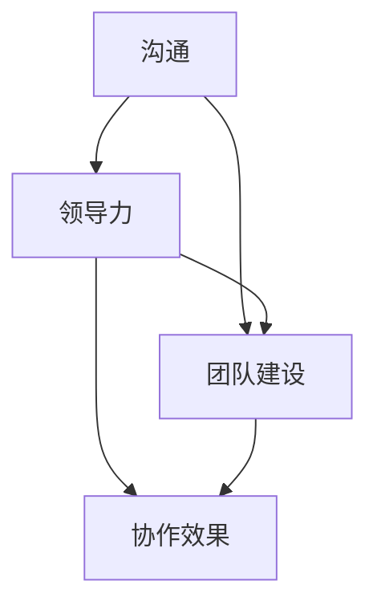

                 

### 引言

在现代企业的运营中，跨部门协作已经成为一项至关重要的活动。随着组织规模的扩大和业务复杂性的增加，单一部门的工作模式已经难以满足企业发展的需求。跨部门协作不仅能够提高资源利用效率，还能促进创新和提升整体效能。因此，理解跨部门协作的重要性，明确其作用，对于企业而言至关重要。

首先，跨部门协作可以打破部门壁垒，促进信息的流通和共享。在传统的部门结构中，各个部门往往各自为政，导致信息孤岛现象严重。通过跨部门协作，企业能够实现信息的无缝连接，使各部门之间的信息能够迅速传递和共享。这样不仅提高了决策的速度和准确性，还能减少因信息不对称而产生的风险。

其次，跨部门协作能够提高整体效能，实现资源的最优配置。在单一部门运作的模式下，资源的使用往往局限于本部门的业务范围，而跨部门协作可以打破这种局限，使资源能够在整个企业内部得到更高效的使用。例如，技术部门和市场部门之间的紧密协作，可以更好地理解市场需求，从而开发出更符合用户需求的产品。此外，跨部门协作还可以优化工作流程，减少重复劳动，提高工作效率。

再次，跨部门协作有助于促进创新。创新往往需要不同领域的知识和技能的融合。通过跨部门协作，企业可以集合各个部门的专业力量，共同攻克难题，推动创新。例如，产品开发部门与设计部门、市场部门的合作，可以创造出更具市场竞争力的产品。

最后，跨部门协作能够增强团队凝聚力。在协作过程中，员工能够更好地理解企业的整体目标，增强对企业文化的认同感。同时，协作过程中的互动和沟通，也有助于员工之间的相互理解和支持，提升团队的凝聚力。

综上所述，跨部门协作对于现代企业来说，不仅是提高效率和效能的必要手段，也是促进创新和提升团队凝聚力的重要途径。因此，企业需要重视跨部门协作，积极探索和实践有效的协作机制，以实现企业的长远发展。

### 核心概念与联系

跨部门协作的有效实施离不开几个核心概念，这些概念相互作用，共同构成了一个完整的协作体系。下面，我们将详细探讨这些核心概念，并展示它们之间的联系。

首先是**沟通**。沟通是跨部门协作的基础，无论是信息的传递、意见的交流，还是决策的制定，都离不开有效的沟通。没有良好的沟通，跨部门协作就会变得困难重重，甚至可能失败。沟通不仅仅是口头或书面的交流，还包括非语言沟通、肢体语言等多种形式。在跨部门协作中，沟通的有效性直接影响到协作的效果。

其次是**领导力**。领导力在跨部门协作中起着至关重要的作用。领导者需要具备全局视野，能够协调各个部门之间的工作，确保协作顺利进行。领导者的领导力不仅体现在决策和指挥上，更重要的是在激发团队成员的积极性和创造力，以及解决协作过程中出现的矛盾和冲突上。一个优秀的领导者能够促进团队成员之间的合作，推动跨部门协作的顺利进行。

再次是**团队建设**。团队建设是跨部门协作的重要组成部分，它关系到团队成员之间的相互信任、合作和共同目标的实现。一个高效的跨部门团队需要具备共同的价值观、清晰的职责分工和明确的目标。团队建设不仅仅是组织一些团建活动，更重要的是要建立一种相互信任、开放和包容的工作氛围。通过团队建设，可以增强团队成员之间的默契，提高协作效率。

**沟通**、**领导力**和**团队建设**这三个核心概念之间的联系是紧密的。良好的沟通是团队建设和领导力发挥作用的基础，领导者的有效领导需要依赖于良好的沟通和团队建设。同时，团队建设又是领导力的重要体现，一个成功的团队离不开强有力的领导。

为了更好地展示这三个概念之间的联系，我们可以使用Mermaid流程图来直观地表达它们之间的关系：



在这个流程图中，沟通是基础，领导力是核心，团队建设是实现目标的手段，它们共同作用于协作效果，推动跨部门协作的顺利进行。

综上所述，沟通、领导力和团队建设是跨部门协作中的三个核心概念，它们相互联系，共同作用，构成了一个完整的协作体系。企业需要重视这些概念，并通过有效的实践，提升跨部门协作的整体效能。

### 组织文化与协作

组织文化在跨部门协作中扮演着至关重要的角色。一个积极、开放、支持协作的组织文化能够极大地促进跨部门协作的顺利进行，而反之，一个僵化、封闭、不支持协作的组织文化则会成为跨部门协作的障碍。那么，如何塑造支持协作的组织文化呢？以下是几个关键的步骤：

首先，**建立共同的目标和价值观**。组织文化的基础在于共同的目标和价值观。通过明确企业的愿景、使命和核心价值观，可以统一各部门的视野，增强团队凝聚力。例如，阿里巴巴的“客户第一、员工第二、股东第三”的价值观，就为公司内部各部门的合作提供了共同的准则。各部门在协作时，能够始终以企业整体利益为出发点，从而提高协作的效率和效果。

其次，**推行透明化管理**。透明化管理意味着信息在企业内部的自由流动，没有人为的障碍。通过建立透明的工作流程、开放的管理机制和及时的信息分享，可以减少信息孤岛现象，提高协作效率。例如，Google 的透明化管理和信息共享机制，使得不同部门的员工能够轻松获取到其他部门的信息和资源，从而提升了协作效果。

再次，**鼓励开放沟通和反馈**。开放沟通和反馈是组织文化中的重要组成部分。通过鼓励员工开放表达意见、提出建议，可以增强员工之间的互动和理解，促进协作。例如，微软在开发新产品时，会定期召开跨部门会议，鼓励各部门员工分享自己的想法和意见，通过讨论和交流，达成共识，提高协作效率。

此外，**培养协作意识和团队精神**。协作意识和团队精神是跨部门协作的重要推动力。通过组织一些团队建设活动，如团队拓展训练、团队文化之夜等，可以增强员工之间的互信和合作意识。例如，华为每年都会组织全球员工参加团队建设活动，通过共同完成任务，增强团队凝聚力和协作精神。

最后，**建立奖励机制**。奖励机制是激励员工积极参与跨部门协作的重要手段。通过设立协作奖项、优秀团队奖等，可以激发员工的积极性和创造力，促进跨部门协作的顺利进行。例如，IBM 会定期评选出“最佳协作团队”，并对获奖团队进行表彰和奖励，从而鼓励员工积极参与跨部门协作。

总的来说，塑造支持协作的组织文化需要从多个方面入手，包括建立共同的目标和价值观、推行透明化管理、鼓励开放沟通和反馈、培养协作意识和团队精神，以及建立奖励机制等。只有通过这些措施的综合运用，才能打造一个真正支持协作的组织文化，从而提升跨部门协作的整体效能。

### 沟通策略

在跨部门协作中，有效的沟通策略是确保协作顺利进行的关键。不同部门之间的沟通障碍可能会影响协作效率，甚至导致协作失败。因此，理解并克服这些沟通障碍，建立有效的沟通策略，对于实现跨部门协作的目标至关重要。

首先，**识别沟通障碍**。沟通障碍可能来源于多个方面，包括文化差异、语言障碍、信息过载等。文化差异可能导致各部门对同一问题的理解不同，从而影响协作；语言障碍则可能使得信息传递不准确；信息过载则可能导致关键信息被忽视。因此，在跨部门协作开始之前，首先需要识别可能存在的沟通障碍，并采取相应措施加以克服。

接下来，**提高沟通效率**。提高沟通效率的关键在于选择合适的沟通工具和技巧。以下是一些有效的沟通策略：

1. **明确沟通目标**。每次沟通前，都应该明确沟通的目标和预期成果。这有助于沟通的双方在沟通过程中保持焦点，避免偏离主题。
2. **使用简洁明了的语言**。避免使用复杂的术语和专业词汇，特别是与非专业人员沟通时。清晰、简洁的语言有助于确保信息的准确传递。
3. **定期沟通**。建立定期的沟通机制，如周会、月度报告等，可以确保信息及时传递，减少信息滞后导致的误解和问题。
4. **多渠道沟通**。结合使用多种沟通渠道，如面对面会议、电话、电子邮件、即时通讯工具等，可以提高沟通的灵活性，满足不同场景的需求。

此外，**培养有效的沟通技巧**也是提高沟通效率的重要手段。以下是一些培养沟通技巧的建议：

1. **积极倾听**。倾听是有效沟通的重要组成部分。通过积极倾听，可以更好地理解对方的意思，避免误解和冲突。
2. **清晰表达**。确保自己的表达清晰、准确，避免使用模糊的语言。可以通过举例、图表等方式，使信息更加直观易懂。
3. **反馈与确认**。在沟通过程中，及时给予反馈，确保双方对信息的理解一致。可以通过询问对方的理解，确认信息的准确性。
4. **建立信任**。建立信任是跨部门协作成功的基础。通过开放、诚实的沟通，可以增强各部门之间的信任，提高协作的效率。

最后，**技术工具与平台**也在现代跨部门协作中发挥着重要作用。借助各种协作软件和工具，可以更好地实现信息的共享和沟通。例如，Slack、Microsoft Teams、Trello 等工具，不仅支持即时通讯，还能帮助各部门进行任务分配、进度跟踪和文档共享，从而提高协作效率。

综上所述，通过识别沟通障碍、提高沟通效率、培养有效的沟通技巧，以及利用技术工具和平台，可以建立一套有效的跨部门沟通策略。这不仅有助于克服沟通障碍，还能提高协作效率，实现跨部门协作的目标。

### 领导力与跨部门协作

在跨部门协作中，领导者的作用不可忽视。领导者的领导力直接影响到跨部门协作的成效。那么，领导者如何促进跨部门协作呢？以下是几个关键步骤和策略。

首先，**建立明确的协作目标**。一个明确的协作目标是跨部门协作的起点。领导者需要与各部门负责人共同制定协作目标，确保目标具有可衡量性和可实现性。通过明确的目标，可以统一各部门的行动方向，减少因目标不一致而导致的协作障碍。

其次，**提升跨部门沟通**。领导者需要主动促进各部门之间的沟通。可以通过定期召开跨部门会议、设置沟通渠道、建立信息共享平台等方式，确保各部门之间的信息畅通。领导者还应该鼓励团队成员积极交流，分享各自的经验和见解，促进知识的共享和整合。

接下来，**培养协作文化**。领导者需要从组织层面推动协作文化的建设。可以通过树立榜样、奖励协作行为、组织团队建设活动等方式，营造一种支持协作的组织氛围。协作文化的培养需要长期的坚持和不断的强化，领导者需要时刻关注并推动这一过程。

此外，**解决协作冲突**。跨部门协作过程中难免会出现冲突，领导者需要具备解决冲突的能力。在处理冲突时，领导者应该采取客观、公正的态度，通过对话和协商解决分歧。同时，领导者需要明确各方的职责和责任，确保协作过程的透明和公平。

最后，**激励团队成员**。领导者需要通过有效的激励机制，激发团队成员的积极性和创造力。可以通过设立协作奖项、提供培训和发展机会等方式，激励团队成员积极参与跨部门协作。

以下是一个简化的伪代码框架，展示了如何通过领导力促进跨部门协作：

```python
def promote_collaboration():
    # 建立明确的协作目标
    set_clear_goals()

    # 提升跨部门沟通
    enhance_communication()

    # 培养协作文化
    cultivate_collaborative_culture()

    # 解决协作冲突
    resolve_conflicts()

    # 激励团队成员
    motivate_team_members()

    # 监控协作效果
    monitor_progress()

# 建立明确的协作目标
def set_clear_goals():
    goals = define_goals()
    communicate_goals_to_all_departments()

# 提升跨部门沟通
def enhance_communication():
    schedule_regular_meetings()
    implement_communication_tools()

# 培养协作文化
def cultivate_collaborative_culture():
    set_role_models()
    reward_collaborative_behaviors()

# 解决协作冲突
def resolve_conflicts():
    take_an_ unbiased_approach()
    ensure_transparency()

# 激励团队成员
def motivate_team_members():
    implement_incentive_programs()
    provide_training_opportunities()
```

通过以上步骤和策略，领导者可以有效地促进跨部门协作，提高企业的整体效能。

### 跨部门团队建设

建立高效的跨部门团队是实现跨部门协作的关键。一个高效的跨部门团队需要明确的角色定义、清晰的目标设定和科学的团队发展过程。以下是详细的步骤和策略。

首先，**角色定义**。明确各角色的职责和权限是建立高效团队的基础。每个团队成员都应该清楚自己的工作职责和期望成果。以下是一个典型的跨部门团队角色定义示例：

- **项目经理**：负责整个项目的规划、执行和监控，确保项目按时、按质量完成。
- **技术专家**：提供技术支持，解决项目中遇到的技术问题。
- **市场分析师**：负责市场需求分析，为产品开发和市场推广提供数据支持。
- **产品经理**：负责产品规划和管理，确保产品满足市场需求并具备竞争力。
- **设计团队**：负责产品设计和用户体验，确保产品的美观性和易用性。

通过明确各角色的职责，可以避免角色重叠和职责不清的问题，提高团队的工作效率。

其次，**目标设定**。设定明确、可衡量的目标是团队协作的重要步骤。目标应包括短期和长期目标，并具体到每个成员的职责。以下是一个目标设定的示例：

- **短期目标**：在本季度内，完成产品的研发和测试，确保产品按时发布。
- **长期目标**：在未来一年内，提高产品的市场占有率，实现盈利。

为了确保目标的实现，每个成员都应该根据自己的职责，设定具体的任务和指标。例如，技术专家的目标可以是确保系统的稳定性，而市场分析师的目标则是收集和分析市场需求数据。

接下来，**团队发展过程**。团队的发展可以分为以下几个阶段：

1. **组建阶段**：确定团队成员，明确各自的角色和职责，并设定初始目标。
2. **磨合阶段**：团队成员之间相互了解，逐步建立起信任和默契，提高协作效率。
3. **高效阶段**：团队成员之间的协作达到最佳状态，能够快速响应变化和解决问题。
4. **持续优化阶段**：不断反思和改进团队的工作流程，提高团队的效率和效能。

为了确保团队的发展过程顺利进行，以下是一些策略：

- **定期反馈**：通过定期的团队会议和反馈机制，了解团队成员的工作情况和存在的问题，及时进行调整和改进。
- **培训与提升**：提供培训和学习机会，帮助团队成员提升技能和知识，提高整体团队的素质。
- **激励与奖励**：通过激励机制，鼓励团队成员积极参与团队建设，提高团队的凝聚力和战斗力。

最后，**团队冲突管理**。冲突在跨部门团队中难以避免，关键在于如何有效管理冲突。以下是一些管理冲突的策略：

- **早期干预**：在冲突初期，及时干预，避免冲突升级。
- **公正处理**：确保冲突处理的公正性和透明度，避免偏袒和偏见。
- **寻求共识**：通过对话和协商，寻求团队成员之间的共识，解决冲突。
- **建立冲突解决机制**：建立一套明确的冲突解决流程和规则，确保冲突能够得到及时和有效的解决。

以下是一个简化的伪代码框架，展示了如何建立高效的跨部门团队：

```python
def build_efficient_team():
    define_roles()
    set_goals()
    develop_team_through_phases()
    manage_conflicts()

# 定义角色
def define_roles():
    assign_roles_to_members()

# 设定目标
def set_goals():
    define_short_term_goals()
    define_long_term_goals()
    assign_individual_goals()

# 团队发展过程
def develop_team_through_phases():
    manage_growing_phases()
    enhance_performance()
    continuously_improve()

# 管理冲突
def manage_conflicts():
    intervene_early()
    handle_equally()
    seek_common_understanding()
    establish_solution_mechanism()
```

通过以上步骤和策略，可以建立一支高效、协作的跨部门团队，从而提升整体效能。

### 案例分析

为了更好地理解跨部门协作的实际应用，我们可以通过分析一些成功的企业案例来探讨跨部门协作的实施效果、面临的挑战以及解决方法。

**案例一：阿里巴巴的跨部门协作**

阿里巴巴是中国的一家电子商务巨头，其成功的跨部门协作是其持续创新和快速响应市场变化的关键。阿里巴巴的跨部门协作主要体现在其“双11”购物节的策划和执行过程中。

- **实施效果**：在“双11”购物节期间，阿里巴巴的各个部门，如技术部门、市场部门、物流部门等，通过紧密的协作，实现了无缝衔接。技术部门负责确保系统的稳定性，市场部门负责策划和推广活动，物流部门负责保障商品及时配送。这种跨部门的协作使得“双11”购物节取得了巨大的成功，创造了巨额的销售额。

- **面临的挑战**：跨部门协作面临的主要挑战包括信息不对称、资源分配不均、以及跨部门沟通障碍。由于各部门的职责不同，信息传递容易出现滞后，导致协作效率下降。

- **解决方法**：阿里巴巴通过以下方法解决了这些挑战：

  - **信息共享平台**：阿里巴巴建立了信息共享平台，确保各部门能够实时获取相关信息，减少信息滞后。
  - **项目化管理**：将“双11”购物节视为一个项目，通过项目管理的理念，明确各部门的职责和任务，确保协作顺利进行。
  - **定期沟通**：设立定期沟通机制，如周会、月度报告等，确保各部门之间的信息流通和协调。

**案例二：谷歌的跨部门协作**

谷歌是全球知名的科技公司，其跨部门协作在产品开发和项目管理中发挥了重要作用。

- **实施效果**：谷歌通过跨部门协作，成功推出了多个创新产品，如Google Maps、Google Drive等。这些产品的开发过程中，技术部门、市场部门、设计部门等紧密协作，确保产品能够满足用户需求，并在市场上取得成功。

- **面临的挑战**：谷歌的跨部门协作面临的主要挑战包括技术复杂性高、项目周期长、跨部门协调难度大等。

- **解决方法**：谷歌采取了以下措施来解决这些挑战：

  - **敏捷开发**：采用敏捷开发方法，通过迭代和增量开发，缩短产品开发周期，提高协作效率。
  - **跨职能团队**：建立跨职能团队，将不同部门的专家集中在一起，共同推进项目，减少跨部门协调难度。
  - **开放沟通**：鼓励团队成员之间的开放沟通，确保信息畅通，减少误解和冲突。

**案例三：腾讯的跨部门协作**

腾讯是中国的一家领先的互联网科技公司，其跨部门协作在产品开发和运营中发挥了重要作用。

- **实施效果**：腾讯通过跨部门协作，成功推出了多个受欢迎的产品，如微信、QQ等。这些产品的开发和运营过程中，技术部门、产品部门、市场部门等紧密协作，确保产品能够快速迭代，满足用户需求。

- **面临的挑战**：腾讯的跨部门协作面临的主要挑战包括产品竞争激烈、市场变化快、跨部门沟通难度大等。

- **解决方法**：腾讯采取了以下措施来解决这些挑战：

  - **项目驱动**：通过项目驱动的方式，明确各部门的职责和任务，确保协作目标一致。
  - **灵活调度**：根据项目需求，灵活调度各部门的资源，确保项目能够按时完成。
  - **激励机制**：通过激励机制，鼓励团队成员积极参与跨部门协作，提高协作积极性。

综上所述，成功的跨部门协作不仅能够提高企业的整体效能，还能促进创新和提升团队的凝聚力。通过分析这些成功案例，我们可以看到，实现跨部门协作需要企业从信息共享、项目管理、沟通机制等多个方面进行综合措施，以克服挑战，实现协作目标。

### 技术工具与平台

在现代企业的跨部门协作中，技术工具和平台的选择与部署发挥着至关重要的作用。借助合适的工具和平台，企业可以显著提升协作效率，确保信息流畅，优化资源分配。以下将详细介绍几种常见的跨部门协作工具和平台，并探讨其选择和部署的关键因素。

#### 协作软件

协作软件是跨部门协作中最常用的工具之一。这类软件能够提供即时通讯、文档共享、任务分配和进度跟踪等功能，有助于各部门之间的高效协作。

- **Slack**：Slack 是一款功能强大的即时通讯工具，支持多种集成服务，如Google Drive、Trello等，方便团队成员之间的实时沟通和文件共享。
- **Microsoft Teams**：Microsoft Teams 结合了聊天、视频会议、文档协作等多种功能，是微软企业协作套件的重要组成部分，与Office 365深度集成，适用于各种规模的企业。

**选择和部署关键因素**：
1. **集成能力**：选择能够与现有系统集成的协作软件，以减少技术障碍。
2. **用户友好**：界面简洁易用，确保团队成员能够快速上手。
3. **定制化**：支持定制化工作流程和通知，以满足不同部门的特定需求。

#### 项目管理工具

项目管理工具能够帮助跨部门团队更好地管理项目进度、任务分配和资源调度。

- **Trello**：Trello 是一款基于看板的项目管理工具，通过卡片和列的方式，可视化地展示项目进度，适合小团队和跨部门协作。
- **JIRA**：JIRA 是一款功能全面的项目管理工具，支持敏捷开发方法，适用于大型项目和复杂任务的管理。

**选择和部署关键因素**：
1. **灵活性**：工具需要具备足够的灵活性，以适应不同类型的项目和任务。
2. **用户界面**：直观易用的用户界面，减少学习和使用成本。
3. **集成与扩展性**：能够与其他工具和平台集成，并支持扩展功能，以适应企业的长期发展需求。

#### 文档共享与协作平台

文档共享和协作平台可以帮助各部门实时编辑和共享文档，确保信息的一致性和及时性。

- **Google Workspace**：Google Workspace 包括Google Docs、Google Sheets等工具，支持多人实时协作，适用于各种规模的团队。
- **Microsoft 365**：Microsoft 365 提供了Word、Excel等办公软件的在线协作版本，具备强大的文档管理功能。

**选择和部署关键因素**：
1. **安全性**：确保文档共享平台具备足够的安全性，防止数据泄露。
2. **版本控制**：支持文档版本控制，避免因版本冲突导致的协作障碍。
3. **易用性**：界面友好，易于操作，确保团队成员能够快速上手。

#### 选择和部署策略

在选择和部署跨部门协作工具和平台时，企业需要考虑以下策略：

1. **需求分析**：明确各部门的协作需求，选择适合的工具和平台。
2. **试点应用**：在初步部署阶段，选择小范围进行试点应用，收集反馈并进行调整。
3. **培训与支持**：为团队成员提供培训和支持，确保他们能够熟练使用新工具。
4. **持续优化**：根据实际使用情况，持续优化工具和平台的配置和使用方式。

通过合理选择和部署技术工具和平台，企业可以大大提升跨部门协作的效率，实现信息共享和资源优化的目标。

### 实施与监控

在跨部门协作中，制定和实施跨部门协作计划，以及监控协作效果，是确保协作成功的关键步骤。以下详细描述如何进行这些步骤，并提供一些实用的最佳实践。

#### 制定跨部门协作计划

1. **明确协作目标**：首先，需要明确跨部门协作的目标和预期成果。这包括短期和长期的目标，如提高项目完成率、优化工作流程、提升客户满意度等。目标应具体、可衡量、可实现、相关性强和时间限制（SMART）。

2. **识别协作需求**：了解各部门的协作需求，包括所需资源、沟通频率、任务分工等。可以通过问卷调查、访谈或工作坊等形式，收集各部门的反馈和需求。

3. **确定协作流程**：制定详细的协作流程，明确各部门在协作中的职责和任务。流程应包括项目的启动、执行、监控和收尾阶段，确保每个环节都有明确的责任人和操作步骤。

4. **分配责任**：根据协作流程，明确各责任人的职责，确保每个任务都有人负责。可以通过角色定义表、责任矩阵等工具，清晰地展示各角色的职责和任务。

5. **制定时间表**：为每个任务分配时间，制定详细的时间表。时间表应包括任务的开始和结束时间、里程碑节点和关键日期，以便于监控和调整。

6. **沟通与确认**：与所有相关部门和责任人进行沟通，确认协作计划的内容和时间表。确保所有参与者都对计划有清晰的理解和共识。

7. **审批与发布**：提交协作计划给相关管理层审批，获得批准后正式发布。发布前，应确保计划已经过多次讨论和修改，以减少执行过程中的问题。

#### 实施跨部门协作计划

1. **培训与支持**：在计划实施前，对团队成员进行必要的培训和指导，确保他们了解协作计划的内容和操作流程。提供持续的支持，帮助团队成员解决在协作过程中遇到的问题。

2. **启动会议**：在计划实施前，召开启动会议，明确协作目标、分工和流程，确保所有参与者对计划有统一的理解和认同。

3. **持续沟通**：建立定期的沟通机制，如周会、月度报告等，确保各部门之间的信息流通和协调。利用协作软件和工具，如Slack、Microsoft Teams等，进行实时沟通和协作。

4. **任务执行**：按照协作计划和时间表，各部门按部就班地执行任务。确保每个任务都有明确的进度和反馈，及时调整和优化。

5. **进度监控**：通过项目管理工具，如Trello、JIRA等，监控任务的进度和完成情况。定期检查关键节点和里程碑，确保项目按计划推进。

#### 监控协作效果

1. **关键绩效指标（KPI）**：设定关键绩效指标，用于衡量协作效果。如项目完成率、任务响应时间、资源利用率等。通过这些指标，可以直观地了解协作的成效。

2. **定期评估**：定期对协作效果进行评估，如每月或每季度进行一次评估。评估内容包括任务完成情况、协作效率、团队反馈等。可以通过问卷调查、访谈或工作坊等形式，收集团队成员的反馈和建议。

3. **问题反馈**：在评估过程中，及时发现和解决协作过程中出现的问题。对于严重问题，应立即采取措施，防止问题扩大。

4. **持续改进**：根据评估结果，不断优化协作流程和策略。可以借鉴最佳实践，引入新的工具和平台，提高协作效率。

#### 最佳实践 Tips

- **建立协作文化**：营造一种支持协作的组织文化，鼓励各部门之间的合作和沟通。
- **明确责任和权限**：确保每个团队成员都清楚自己的职责和权限，避免推诿和责任不清。
- **灵活调整计划**：在实施过程中，根据实际情况灵活调整计划，确保计划的可行性和适应性。
- **激励机制**：设立激励机制，如奖励和表彰，鼓励团队成员积极参与协作，提高协作积极性。

通过制定和实施跨部门协作计划，以及有效的监控和评估，企业可以显著提升跨部门协作的效能，实现资源的优化配置和整体效能的提升。

### 总结

跨部门协作在提升企业整体效能中扮演着至关重要的角色。通过有效的跨部门协作，企业能够打破部门壁垒，实现信息的无缝流通，优化资源利用，促进创新，并增强团队凝聚力。本文详细探讨了跨部门协作的核心概念、组织文化、沟通策略、领导力、团队建设、案例分析、技术工具与平台，以及实施与监控的各个方面。

首先，跨部门协作的关键概念包括沟通、领导力和团队建设。这些概念相互联系，共同构成了跨部门协作的基础。其次，塑造支持协作的组织文化是确保跨部门协作成功的重要前提，这需要建立共同的目标和价值观、推行透明化管理、鼓励开放沟通和反馈，以及培养协作意识和团队精神。在沟通策略方面，识别沟通障碍、提高沟通效率、培养有效的沟通技巧以及利用技术工具和平台，是确保协作顺利进行的关键。

领导者在跨部门协作中发挥着核心作用，他们需要通过建立明确的协作目标、提升跨部门沟通、培养协作文化、解决协作冲突和激励团队成员，来促进协作的顺利进行。团队建设则是跨部门协作的重要保障，包括明确角色定义、目标设定和科学的团队发展过程，以及有效的冲突管理。

通过实际案例分析，我们看到了跨部门协作在企业中的成功应用，如阿里巴巴的“双11”购物节、谷歌的产品开发和腾讯的产品运营等。这些案例表明，成功的跨部门协作不仅能够显著提升企业的整体效能，还能推动企业的创新和持续发展。

最后，技术工具和平台在跨部门协作中发挥着重要作用。选择和部署合适的协作软件、项目管理工具和文档共享平台，能够大大提升协作效率，确保信息的流畅和资源的优化配置。实施和监控跨部门协作计划，则是确保协作目标实现的关键步骤，包括制定明确的协作目标、识别协作需求、确定协作流程、分配责任、培训与支持、沟通与确认、启动会议、任务执行、进度监控和评估等。

总之，跨部门协作不仅是现代企业提升整体效能的必要手段，也是推动企业创新和持续发展的关键途径。企业应重视跨部门协作，积极探索和实践有效的协作机制，以实现企业的长远发展。通过本文的探讨，希望读者能够更好地理解和应用跨部门协作的理念和方法，提升企业的协作效能，实现企业的战略目标。

### 扩展阅读

为了进一步深入理解跨部门协作的重要性和实施方法，以下是几本推荐的专业书籍和论文，供读者参考：

1. **《The Five Dysfunctions of a Team》**（作者：Patrick Lencioni）
   - 这本书通过寓言故事的形式，生动地描述了团队协作中的五大障碍，并提供了解决这些障碍的策略。
   - 关键内容：团队建设、团队动态、领导力。

2. **《Collaboration Technology: Enabling Effective Knowledge Sharing and Teamwork》**（作者：Paul A. Marsden和John M. Parham）
   - 本书探讨了协作技术在促进有效知识共享和团队合作中的应用，提供了丰富的实际案例和最佳实践。
   - 关键内容：协作技术、知识共享、团队合作。

3. **《The Power of Communication: Skills to Build Trust, Inspire Loyalty, and Utilize Conflict to Your Advantage》**（作者：Jeanette McDonald）
   - 这本书详细阐述了沟通技巧，包括倾听、表达、反馈和解决冲突的方法，对于提升跨部门协作中的沟通效率非常有帮助。
   - 关键内容：沟通技巧、信任建设、冲突管理。

4. **论文《Cross-Disciplinary Collaboration in Software Development》**（作者：Klaus P. Jantke和Klaus-Dieter Schewe）
   - 这篇论文分析了跨学科协作在软件开发中的应用，提出了跨部门协作中的关键问题和解决方案。
   - 关键内容：软件工程、跨学科协作、团队管理。

5. **论文《The Role of Leadership in Cross-Functional Teams》**（作者：Mariana M. Opre和George M. Opre）
   - 该论文探讨了领导者在跨职能团队中的作用，以及如何通过有效的领导力促进团队协作。
   - 关键内容：领导力、团队协作、组织行为学。

通过阅读这些书籍和论文，读者可以进一步加深对跨部门协作的理解，并掌握更多实用的方法和技巧，以提升企业的协作效能。同时，这些资源也为企业提供了一个广阔的视野，帮助其在实际操作中更好地实施跨部门协作。希望这些推荐能够为读者带来更多的启发和帮助。

