                 


### 文章标题

《跨部门协作：打破组织壁垒的领导技巧》

### 文章关键词

跨部门协作、组织壁垒、领导技巧、沟通、项目管理、文化建设、流程图、算法原理、数学模型

### 文章摘要

本文旨在深入探讨跨部门协作的重要性以及如何通过领导技巧来打破组织壁垒，实现高效的团队协作。通过分析现代组织的结构特点，识别跨部门协作中的障碍与挑战，本文提出了建立协作文化的策略、领导者在协作中的角色与作用、有效的沟通技巧与工具，以及项目管理的方法。同时，通过成功与失败案例的分析，为读者提供了宝贵的实战经验。最后，本文展望了跨部门协作的未来趋势，并提出了最佳实践建议。

---

## 第一部分：跨部门协作的背景与重要性

### 第1章：跨部门协作的定义与价值

跨部门协作是现代企业运作中不可或缺的一部分。它不仅影响着项目的进度和质量，更是企业实现整体战略目标的关键。本章节将详细探讨跨部门协作的定义、核心价值以及其在现代组织中的重要性。

#### 背景介绍

随着企业规模的扩大和组织结构的复杂化，各个部门之间的协作变得越来越重要。传统的部门化分工模式已经无法满足企业快速变化的市场需求，跨部门协作成为了一种必然趋势。跨部门协作不仅能够整合不同部门的专业知识和技能，还能够促进创新和提升企业的整体竞争力。

#### 核心概念与联系

跨部门协作的核心概念包括：

1. **部门独立性**：各个部门在组织中的独立运作能力。
2. **信息共享**：跨部门之间的信息交流与共享。
3. **目标一致性**：不同部门在共同目标下的协同工作。

这些概念之间的关系可以用以下Mermaid流程图来表示：

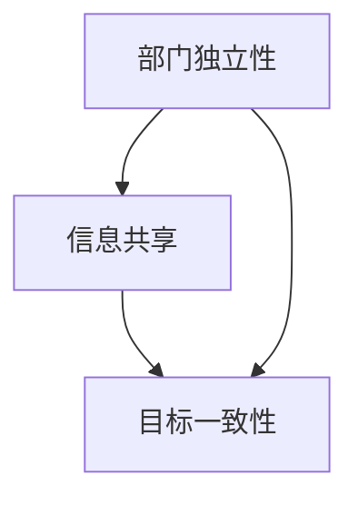

#### 核心算法原理讲解

跨部门协作的核心算法原理可以概括为以下几个方面：

1. **任务分解与分配**：将大型项目分解为若干小任务，并分配给不同的部门或团队。
2. **协同工作**：通过有效的沟通和协作，确保各部门之间的任务衔接和进度控制。
3. **风险管理**：识别和评估跨部门协作中的风险，并采取相应的风险管理措施。

以下是一个简单的伪代码，用于描述跨部门协作的基本流程：

```python
function cross_department_collaboration(project):
    # 任务分解
    tasks = decompose_project(project)
    
    # 分配任务
    assign_tasks_to_departments(tasks)
    
    # 沟通与协作
    while not all_tasks_completed(tasks):
        communicate_and协作(tasks)
        
    # 风险管理
    manage_risks(tasks)
    
    return project
```

#### 数学模型和数学公式

跨部门协作中的数学模型通常涉及到任务完成时间和资源分配。以下是一个简单的数学公式，用于计算跨部门协作的总体时间：

$$
T_{total} = \sum_{i=1}^{n} (T_i + \Delta T_i)
$$

其中，$T_i$表示第$i$个任务的完成时间，$\Delta T_i$表示第$i$个任务的延迟时间。

#### 举例说明

假设一个项目由三个任务组成，每个任务的预计完成时间和延迟时间如下：

| 任务 | 预计完成时间 (天) | 延迟时间 (天) |
| --- | --- | --- |
| 任务1 | 10 | 2 |
| 任务2 | 15 | 3 |
| 任务3 | 20 | 1 |

使用上述公式计算项目的总体完成时间：

$$
T_{total} = (10 + 2) + (15 + 3) + (20 + 1) = 54 \text{ 天}
$$

#### 项目实战

在实际项目中，跨部门协作的实战应用需要考虑多个因素。例如，在一个软件开发项目中，产品经理、设计师、开发人员和测试人员需要紧密协作。以下是一个简单的项目实战案例：

1. **需求收集**：产品经理与客户沟通，收集需求。
2. **需求分析**：产品经理与设计师共同分析需求，制定设计方案。
3. **开发与测试**：开发人员根据设计方案进行编码，测试人员进行功能测试和性能测试。
4. **交付与反馈**：将软件产品交付给客户，收集反馈，进行迭代优化。

通过这个案例，我们可以看到跨部门协作在软件开发项目中的重要性。每个部门都需要发挥自己的专业能力，同时与其他部门保持良好的沟通和协作，以确保项目的顺利进行。

#### 最佳实践 tips

1. **明确目标**：确保所有部门对项目的目标和期望有清晰的认识。
2. **建立沟通机制**：定期召开跨部门会议，确保信息畅通。
3. **制定详细的计划**：明确每个任务的负责人、完成时间和质量要求。

### 小结

跨部门协作是现代组织运作的关键。通过明确核心概念、理解算法原理和运用数学模型，我们可以有效地推进跨部门协作，提高项目成功率。在接下来的章节中，我们将深入探讨跨部门协作中的具体策略和技巧。

---

以上为第1章的具体内容。接下来，我们将继续探讨现代组织的结构特点、跨部门协作的障碍与挑战，以及跨部门协作的优势与成果。每一章都将结合核心概念与联系、算法原理、数学模型和实际案例进行详细讲解。让我们一起深入探讨跨部门协作的各个方面，为组织带来更多的价值。### 第2章：现代组织的组织结构特点

在现代企业中，组织结构的设计直接影响到跨部门协作的效果。本章节将详细探讨现代组织的常见结构类型、部门职能分工以及它们如何影响跨部门协作。

#### 背景介绍

现代组织的结构设计多种多样，从传统的金字塔结构到扁平化的矩阵结构，都是为了更好地适应市场变化和提升企业效率。了解不同组织结构的特点，有助于我们理解跨部门协作的复杂性和挑战。

#### 核心概念与联系

现代组织的组织结构核心概念包括：

1. **金字塔结构**：传统的层级管理结构，决策权集中在顶部。
2. **扁平化结构**：减少管理层级，增强横向沟通和协作。
3. **矩阵结构**：同时包含职能部门和项目部门，具有双重汇报关系。

这些结构之间的关系可以用以下Mermaid流程图来表示：

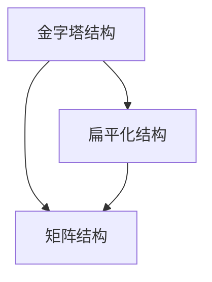

#### 核心算法原理讲解

不同组织结构的算法原理差异主要体现在以下几个方面：

1. **决策流程**：金字塔结构的决策流程通常较为严格，需要逐级上报；扁平化结构则更灵活，决策权下放；矩阵结构则需要平衡职能部门和项目部门之间的决策。
2. **沟通渠道**：金字塔结构中的沟通渠道较为固定，信息传递效率相对较低；扁平化结构则具有更多沟通渠道，信息传递更迅速；矩阵结构中的沟通渠道复杂，需要确保信息在职能部门和项目部门之间准确传递。
3. **资源分配**：金字塔结构中资源分配较为集中，决策者能够更好地控制资源；扁平化结构中资源分配更加分散，各部门拥有更多自主权；矩阵结构中资源分配需要平衡职能需求和项目需求。

以下是一个简单的伪代码，用于描述不同组织结构的资源分配算法：

```python
function allocate_resources(structure):
    if structure == "pyramid":
        centralize_resources()
    elif structure == "flat":
        decentralize_resources()
    elif structure == "matrix":
        balance_resources()
```

#### 数学模型和数学公式

组织结构的数学模型通常涉及到管理层级、沟通渠道和资源分配。以下是一个简单的数学公式，用于计算不同组织结构下的管理层级和沟通成本：

$$
C = L \times N
$$

其中，$C$表示沟通成本，$L$表示管理层级，$N$表示部门数量。

#### 举例说明

假设一个企业采用金字塔结构，管理层级为5级，部门数量为10个。计算该结构的沟通成本：

$$
C = 5 \times 10 = 50
$$

如果该企业采用扁平化结构，管理层级为2级，部门数量为10个。计算该结构的沟通成本：

$$
C = 2 \times 10 = 20
$$

通过比较，我们可以看到扁平化结构在沟通成本上具有明显优势。

#### 项目实战

在一个典型的矩阵组织中，项目经理与职能经理需要共同管理项目。以下是一个简单的项目实战案例：

1. **项目规划**：项目经理与职能经理共同制定项目计划，明确项目目标、任务分工和时间表。
2. **资源协调**：项目经理与职能经理协调资源，确保项目所需的技能和资源得到满足。
3. **进度跟踪**：项目经理与职能经理定期召开会议，跟踪项目进度，解决遇到的问题。
4. **成果交付**：项目完成后，项目经理与职能经理共同验收成果，并根据反馈进行改进。

通过这个案例，我们可以看到矩阵结构在跨部门协作中的优势。项目经理和职能经理能够共同管理项目，确保项目目标的实现。

#### 最佳实践 tips

1. **明确职能与项目职责**：确保各部门和项目团队明确自己的职责和目标。
2. **加强沟通与协作**：建立高效的沟通机制，确保信息在各部门和项目团队之间畅通。
3. **灵活调整组织结构**：根据项目需求和公司发展阶段，灵活调整组织结构。

### 小结

现代组织的组织结构类型多种多样，每种结构都有其优缺点。通过理解不同组织结构的特点和算法原理，我们可以更好地进行跨部门协作，提高组织的运作效率。在接下来的章节中，我们将继续探讨跨部门协作中的障碍与挑战，以及如何克服这些挑战。

---

第2章详细介绍了现代组织的组织结构特点，包括金字塔结构、扁平化结构和矩阵结构。通过核心概念与联系、算法原理和实际案例的分析，我们了解了不同组织结构在决策流程、沟通渠道和资源分配方面的差异。接下来，我们将探讨跨部门协作中的障碍与挑战，并介绍有效的解决方案。让我们一起深入探讨这些挑战，为跨部门协作的顺利进行打下坚实基础。### 第3章：跨部门协作的障碍与挑战

在跨部门协作中，虽然有着诸多潜在的优势，但同时也面临着一系列的障碍与挑战。理解并有效应对这些障碍与挑战，对于确保跨部门协作的成功至关重要。本章节将深入分析跨部门协作中常见的障碍与挑战，并提供相应的解决策略。

#### 背景介绍

跨部门协作的障碍与挑战主要来自于组织结构、沟通障碍、文化差异、资源分配等多个方面。这些障碍如果不加以解决，会严重影响项目的进度、质量和团队士气。

#### 核心概念与联系

跨部门协作的障碍与挑战包括以下几个方面：

1. **部门壁垒**：由于组织结构的差异，部门之间的壁垒难以打破。
2. **沟通障碍**：不同部门之间的沟通不畅，导致信息传递不完整或不及时。
3. **文化差异**：各部门有不同的工作文化和习惯，容易产生误解和冲突。
4. **资源竞争**：各部门在资源分配上存在竞争，可能导致资源利用不充分。
5. **目标不一致**：各部门可能对项目的目标理解不一致，导致工作方向偏差。

这些概念之间的关系可以用以下Mermaid流程图来表示：

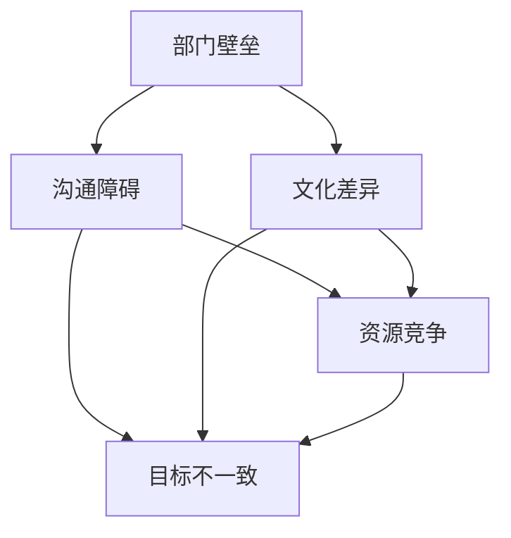

#### 核心算法原理讲解

为了解决跨部门协作中的障碍与挑战，可以采用以下算法原理：

1. **障碍识别与分类**：首先，需要识别和分析跨部门协作中的各种障碍，将其分类为结构性障碍、沟通障碍、文化障碍等。
2. **障碍分析**：对每个障碍进行深入分析，找出其根本原因。
3. **制定解决方案**：根据障碍分析的结果，制定针对性的解决方案，如改善沟通机制、建立协作文化、优化资源分配等。
4. **实施与监控**：执行解决方案，并持续监控其效果，根据反馈进行调整。

以下是一个简单的伪代码，用于描述解决跨部门协作障碍的基本流程：

```python
function solve_collaboration_obstacles(obstacles):
    # 识别与分类障碍
    categorized_obstacles = categorize_obstacles(obstacles)
    
    # 分析障碍
    root_causes = analyze_obstacles(categorized_obstacles)
    
    # 制定解决方案
    solutions = create_solutions(root_causes)
    
    # 实施解决方案
    for solution in solutions:
        implement_solution(solution)
        
    # 监控与调整
    monitor_effects(solutions)
    
    return "障碍已解决"
```

#### 数学模型和数学公式

在跨部门协作中，可以使用数学模型来评估障碍的影响和解决方案的效果。以下是一个简单的数学模型，用于评估跨部门协作的障碍影响：

$$
I = \sum_{i=1}^{n} (O_i \times W_i)
$$

其中，$I$表示障碍影响指数，$O_i$表示第$i$个障碍的严重程度，$W_i$表示第$i$个障碍对项目的影响权重。

#### 举例说明

假设在跨部门协作中，识别出三个主要障碍：部门壁垒、沟通障碍和资源竞争。每个障碍的严重程度和影响权重如下：

| 障碍 | 严重程度 | 影响权重 |
| --- | --- | --- |
| 部门壁垒 | 高 | 0.4 |
| 沟通障碍 | 中 | 0.3 |
| 资源竞争 | 低 | 0.3 |

计算障碍影响指数：

$$
I = (0.4 \times 0.4) + (0.3 \times 0.3) + (0.3 \times 0.3) = 0.16 + 0.09 + 0.09 = 0.34
$$

障碍影响指数为0.34，表明跨部门协作的障碍影响较大，需要采取有效的解决方案。

#### 项目实战

在一个实际项目中，跨部门协作的障碍与挑战常常是影响项目成功的关键因素。以下是一个简单的项目实战案例：

1. **障碍识别**：项目经理识别出项目中的主要障碍包括部门壁垒、沟通障碍和资源竞争。
2. **解决方案制定**：项目经理与各部门负责人共同制定解决方案，如定期召开跨部门会议、建立统一的项目管理平台、优化资源分配等。
3. **障碍解决**：通过实施解决方案，项目经理逐步解决了项目中的障碍，确保项目顺利进行。
4. **效果监控**：项目经理持续监控解决方案的效果，并根据实际情况进行调整。

通过这个案例，我们可以看到如何在项目中识别、解决跨部门协作的障碍。

#### 最佳实践 tips

1. **建立共识**：确保所有部门对项目目标、任务分工和协作流程有共同的理解。
2. **改善沟通**：建立高效的沟通机制，如定期召开跨部门会议、使用项目管理工具等。
3. **培养协作文化**：鼓励各部门之间相互支持、共同成长，建立协作文化。
4. **优化资源分配**：合理分配资源，确保各部门在资源利用上达到最优状态。

### 小结

跨部门协作中的障碍与挑战是多方面的，需要综合运用多种策略和方法来解决。通过理解核心概念、分析障碍原因和实施有效的解决方案，我们可以提高跨部门协作的效率和质量。在接下来的章节中，我们将继续探讨跨部门协作的优势与成果，以及如何通过领导技巧来打破组织壁垒，实现高效的团队协作。

---

第3章详细分析了跨部门协作中常见的障碍与挑战，包括部门壁垒、沟通障碍、文化差异、资源竞争和目标不一致。通过核心概念与联系、算法原理和实际案例的分析，我们了解了如何识别和解决这些障碍。在接下来的章节中，我们将探讨跨部门协作的优势与成果，并介绍如何在领导者的引导下实现高效的团队协作。让我们一起继续深入探讨跨部门协作的各个方面，为组织的成功贡献力量。### 第4章：跨部门协作的优势与成果

跨部门协作不仅能够解决组织内的各种障碍与挑战，还能带来显著的积极成果。本章节将详细探讨跨部门协作的优势，包括提高项目效率、促进创新和优化资源利用等方面，并通过实际案例展示这些优势如何转化为实际的成果。

#### 背景介绍

跨部门协作的优势体现在多个方面。通过整合不同部门的专业知识和资源，跨部门协作能够提高项目的整体效率，促进创新，提升团队士气，并最终为企业带来更高的价值。

#### 核心概念与联系

跨部门协作的优势主要包括以下几个方面：

1. **提高项目效率**：跨部门协作能够快速响应项目需求，提高项目执行速度。
2. **促进创新**：不同部门之间的交流与协作，能够激发新的创意和解决方案。
3. **优化资源利用**：通过共享资源和技能，跨部门协作能够提高资源利用率，降低成本。
4. **提升团队士气**：跨部门协作能够增强团队之间的信任和合作，提升整体士气。

这些优势之间的关系可以用以下Mermaid流程图来表示：

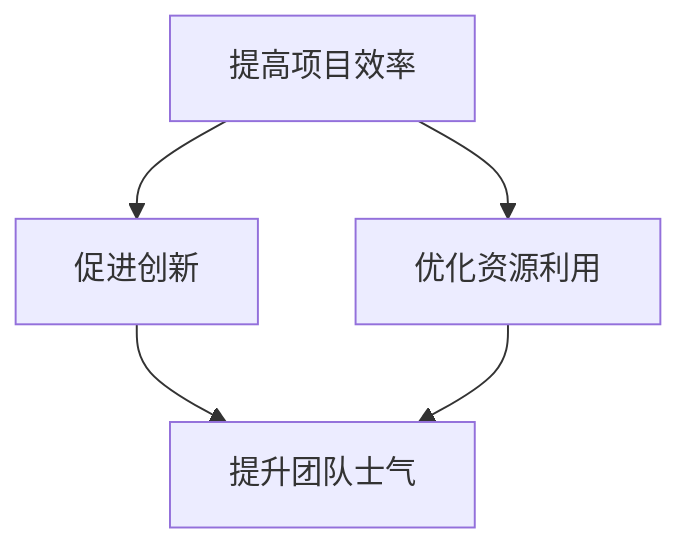

#### 核心算法原理讲解

跨部门协作的优势可以通过以下算法原理来实现：

1. **任务优化分配**：通过分析任务需求和团队技能，将任务合理分配给适合的部门或团队，提高项目效率。
2. **知识共享平台**：建立知识共享平台，促进不同部门之间的知识和经验交流，激发创新。
3. **资源协调机制**：建立资源协调机制，确保各部门在资源利用上达到最优状态，降低成本。
4. **绩效评估体系**：建立绩效评估体系，对跨部门协作的效果进行评估和反馈，持续改进。

以下是一个简单的伪代码，用于描述实现跨部门协作优势的基本流程：

```python
function leverage_collaboration_advantages():
    # 任务优化分配
    assign_tasks_optimally()
    
    # 知识共享平台
    establish_knowledge_sharing_platform()
    
    # 资源协调机制
    establish_resource_coordination_mechanism()
    
    # 绩效评估体系
    establish_performance_evaluation_system()
    
    return "协作优势已实现"
```

#### 数学模型和数学公式

在跨部门协作中，可以使用数学模型来评估协作效果。以下是一个简单的数学模型，用于评估跨部门协作的效率提升：

$$
E = \frac{T_{original} - T_{collaborated}}{T_{original}}
$$

其中，$E$表示效率提升比例，$T_{original}$表示原始执行时间，$T_{collaborated}$表示协作后的执行时间。

#### 举例说明

假设一个项目在原始执行情况下需要100天完成，通过跨部门协作，执行时间缩短为80天。计算效率提升比例：

$$
E = \frac{100 - 80}{100} = 0.2
$$

效率提升比例为20%，表明跨部门协作显著提高了项目效率。

#### 项目实战

在实际项目中，跨部门协作的优势往往能够带来显著的成果。以下是一个简单的项目实战案例：

1. **项目启动**：项目经理组织跨部门团队，明确项目目标和任务分工。
2. **任务执行**：各部门按照分工执行任务，同时通过协作平台分享信息和经验。
3. **问题解决**：遇到问题时，跨部门团队共同讨论解决方案，快速响应和解决。
4. **成果交付**：项目按期完成，各部门共同庆祝成功。

通过这个案例，我们可以看到跨部门协作如何提高项目效率、促进创新和优化资源利用。

#### 最佳实践 tips

1. **建立协作文化**：鼓励各部门相互信任、合作共赢，形成良好的协作氛围。
2. **优化沟通机制**：建立高效的沟通渠道，确保信息在各部门之间畅通。
3. **制定明确的任务分工**：确保各部门明确自己的职责，减少协作中的误解和冲突。
4. **持续评估与改进**：定期评估跨部门协作的效果，根据反馈进行调整和优化。

### 小结

跨部门协作的优势体现在多个方面，包括提高项目效率、促进创新、优化资源利用和提升团队士气。通过理解核心概念、运用算法原理和实际案例的分析，我们可以更好地发挥跨部门协作的优势，为组织带来实际的成果。在接下来的章节中，我们将继续探讨如何建立协作文化、领导者在协作中的作用以及沟通技巧与协作工具的应用。

---

第4章详细介绍了跨部门协作的优势，包括提高项目效率、促进创新、优化资源利用和提升团队士气。通过核心概念与联系、算法原理和实际案例的分析，我们了解了如何实现这些优势。在接下来的章节中，我们将深入探讨如何建立协作文化、领导者在协作中的作用以及有效的沟通技巧和协作工具。让我们一起继续深入探讨跨部门协作的各个方面，为组织的成功贡献力量。### 第5章：建立协作文化

协作文化的建立是跨部门协作成功的关键。一个良好的协作文化能够促进团队间的信任、沟通和合作，从而提高整体的工作效率和项目成功率。本章节将详细探讨如何建立协作文化，包括价值观的传递、协作技能的培养以及团队合作精神的培养。

#### 背景介绍

在现代企业中，组织结构的复杂性和项目规模的增大使得跨部门协作变得尤为重要。而协作文化的建立正是为了应对这种复杂性，通过共同的价值观和协作技能，让团队成员在合作中能够相互信任、支持，从而实现共同的目标。

#### 核心概念与联系

建立协作文化涉及以下几个核心概念：

1. **共同价值观**：包括诚信、尊重、透明、团队合作等，是协作文化的基石。
2. **协作技能**：包括沟通、协调、冲突解决、项目管理等，是协作文化的重要支撑。
3. **团队合作精神**：包括责任心、共享、互助、开放等，是协作文化的重要体现。

这些概念之间的关系可以用以下Mermaid流程图来表示：

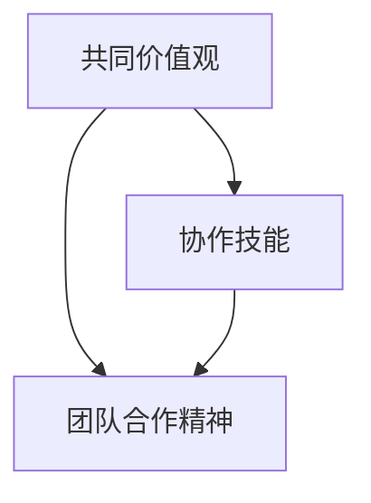

#### 核心算法原理讲解

建立协作文化的过程可以看作是一个算法过程，它涉及到以下几个步骤：

1. **定义价值观**：明确企业的核心价值观，并将其传达给所有团队成员。
2. **培养协作技能**：通过培训和实践，提高团队成员的协作技能。
3. **建立激励机制**：通过奖励和认可，激励团队成员积极参与协作。
4. **持续沟通与反馈**：定期进行团队沟通，收集反馈，不断调整和优化协作流程。

以下是一个简单的伪代码，用于描述建立协作文化的基本流程：

```python
function establish_collaborative_culture():
    # 定义价值观
    define_values()
    
    # 培养协作技能
    train_collaborative_skills()
    
    # 建立激励机制
    create_incentive_system()
    
    # 持续沟通与反馈
    while not culture_adopted():
        communicate_and_gather_feedback()
        adjust_and_optimize()
        
    return "协作文化已建立"
```

#### 数学模型和数学公式

在协作文化的建立过程中，可以使用数学模型来评估文化的影响力和团队成员的协作效果。以下是一个简单的数学模型，用于评估协作文化的影响力：

$$
C = \frac{S \times P \times R}{T}
$$

其中，$C$表示协作文化的影响力，$S$表示共同价值观的认同度，$P$表示协作技能的水平，$R$表示团队合作精神的强度，$T$表示时间。

#### 举例说明

假设一个团队的共同价值观认同度为0.8，协作技能水平为0.7，团队合作精神强度为0.9，计算该团队的协作文化影响力：

$$
C = \frac{0.8 \times 0.7 \times 0.9}{T} = 0.504
$$

协作文化影响力为0.504，表明该团队的协作文化具有较高的影响力。

#### 项目实战

在实际项目中，建立协作文化的实战应用需要考虑多个方面。以下是一个简单的项目实战案例：

1. **价值观传递**：项目经理通过例会和培训，将团队的核心价值观传递给所有成员，确保每个人都理解并认同。
2. **技能培训**：项目经理组织协作技能培训，如沟通技巧、团队建设活动等，提高团队成员的协作能力。
3. **激励机制**：项目经理建立奖励机制，对在协作中表现突出的成员进行表彰和奖励。
4. **持续沟通**：项目经理定期组织团队会议，鼓励成员分享协作经验和反馈，不断优化协作流程。

通过这个案例，我们可以看到如何在实际项目中建立协作文化。

#### 最佳实践 tips

1. **明确价值观**：确保所有团队成员对企业的核心价值观有清晰的认识。
2. **提供培训**：为团队成员提供协作技能培训，帮助他们更好地适应协作环境。
3. **建立反馈机制**：鼓励团队成员提供反馈，不断优化协作流程。
4. **领导带头**：领导者要率先示范，积极参与协作，树立良好的协作榜样。

### 小结

建立协作文化是跨部门协作成功的关键。通过定义共同价值观、培养协作技能和团队合作精神，我们可以营造一个良好的协作氛围，提高团队的整体效率。在接下来的章节中，我们将继续探讨领导者在跨部门协作中的作用，以及如何通过沟通技巧和协作工具来提升协作效果。让我们一起深入探讨这些话题，为组织的跨部门协作提供更多有价值的见解。

---

第5章详细介绍了如何建立协作文化，包括价值观的传递、协作技能的培养和团队合作精神的培养。通过核心概念与联系、算法原理和实际案例的分析，我们了解了建立协作文化的重要性和方法。在接下来的章节中，我们将探讨领导者在跨部门协作中的作用，以及沟通技巧和协作工具的应用。让我们一起继续深入探讨跨部门协作的各个方面，为组织的成功贡献力量。### 第6章：领导者在跨部门协作中的作用

领导者在跨部门协作中扮演着至关重要的角色。他们不仅需要协调不同部门的工作，还要推动团队的合作，确保项目目标的实现。本章节将详细探讨领导者在跨部门协作中的角色与责任，以及如何发挥领导作用来推动协作的顺利进行。

#### 背景介绍

在跨部门协作中，领导者不仅要具备技术和管理能力，还需要具备强大的沟通技巧和团队领导能力。他们的角色不仅仅是协调者，更是推动者和激励者。通过有效的领导，领导者可以消除部门间的壁垒，促进信息的流通，提高团队的协作效率。

#### 核心概念与联系

领导者在跨部门协作中的角色与责任包括以下几个方面：

1. **协调者**：领导者需要协调不同部门的工作，确保各部门能够有效地协同合作。
2. **沟通桥梁**：领导者需要充当沟通的桥梁，确保信息在各部门之间准确、及时地传递。
3. **推动者**：领导者需要推动协作的进程，确保项目目标的实现。
4. **激励者**：领导者需要激励团队成员，提高团队的士气和动力。

这些角色之间的关系可以用以下Mermaid流程图来表示：

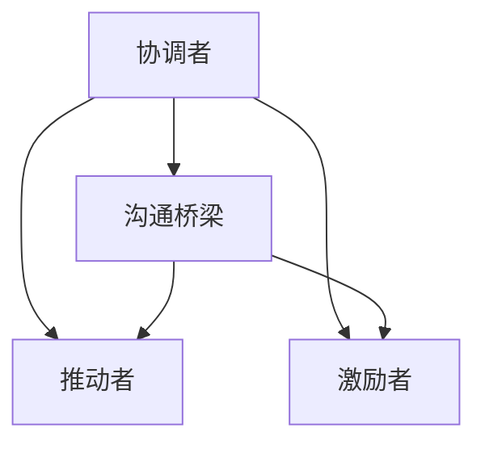

#### 核心算法原理讲解

领导者在跨部门协作中的作用可以通过以下算法原理来实现：

1. **目标设定**：领导者需要明确项目的目标，并将其传达给所有团队成员。
2. **资源分配**：领导者需要根据项目的需求，合理分配资源，确保各部门能够在资源上相互支持。
3. **沟通机制**：领导者需要建立有效的沟通机制，确保信息在各部门之间畅通无阻。
4. **冲突管理**：领导者需要及时解决部门间的冲突，确保项目顺利进行。

以下是一个简单的伪代码，用于描述领导者在跨部门协作中的基本流程：

```python
function leadership_in_cross_department_collaboration():
    # 目标设定
    set_project_goals()
    
    # 资源分配
    allocate_resources()
    
    # 建立沟通机制
    establish_communication_mechanism()
    
    # 冲突管理
    manage_conflicts()
    
    # 推动协作进程
    drive_collaboration_progress()
    
    # 激励团队成员
    motivate_team_members()
    
    return "协作顺利进行"
```

#### 数学模型和数学公式

在跨部门协作中，可以使用数学模型来评估领导者的作用。以下是一个简单的数学模型，用于评估领导者的协作效果：

$$
E = \frac{G \times R \times C \times M}{T}
$$

其中，$E$表示协作效果，$G$表示目标实现的度，$R$表示资源利用的效率，$C$表示沟通的有效性，$M$表示激励的强度，$T$表示时间。

#### 举例说明

假设在一个项目中，领导者的目标实现度为0.9，资源利用效率为0.8，沟通有效性为0.85，激励强度为0.75，计算该领导者的协作效果：

$$
E = \frac{0.9 \times 0.8 \times 0.85 \times 0.75}{T} = 0.5025
$$

协作效果为0.5025，表明领导者的作用较为显著。

#### 项目实战

在实际项目中，领导者的作用往往能够决定跨部门协作的成功与否。以下是一个简单的项目实战案例：

1. **目标设定**：项目经理在项目启动会议上明确了项目的目标和里程碑，确保所有团队成员都清楚项目的要求。
2. **资源分配**：项目经理根据项目需求，将关键资源优先分配给项目团队，确保项目进度不受资源限制。
3. **沟通机制**：项目经理建立了定期会议和即时沟通渠道，确保项目信息能够在各部门之间及时传递。
4. **冲突管理**：当项目团队遇到冲突时，项目经理及时介入，通过沟通和协商解决冲突，确保项目顺利进行。
5. **激励团队**：项目经理通过表彰和奖励，激励团队成员在项目中发挥最佳状态，提升团队士气。

通过这个案例，我们可以看到领导者如何通过多种方式发挥在跨部门协作中的作用。

#### 最佳实践 tips

1. **明确目标**：确保所有团队成员对项目的目标有清晰的认识。
2. **建立沟通机制**：确保信息在各部门之间畅通无阻。
3. **及时解决问题**：快速解决部门间的冲突，确保项目顺利进行。
4. **激励团队**：通过表彰和奖励，激发团队成员的积极性和创造力。

### 小结

领导者在跨部门协作中发挥着至关重要的作用。通过设定目标、合理分配资源、建立沟通机制和管理冲突，领导者可以推动跨部门协作的顺利进行。在接下来的章节中，我们将探讨沟通技巧与协作工具的应用，以及如何通过项目管理方法来提升跨部门协作的效率。让我们一起继续深入探讨这些话题，为组织的成功贡献力量。

---

第6章详细探讨了领导者在跨部门协作中的角色与责任，包括协调者、沟通桥梁、推动者和激励者。通过核心概念与联系、算法原理和实际案例的分析，我们了解了领导者如何发挥关键作用来推动协作的顺利进行。在接下来的章节中，我们将探讨沟通技巧与协作工具的应用，以及如何通过项目管理方法来提升跨部门协作的效率。让我们一起继续深入探讨这些话题，为组织的成功贡献力量。### 第7章：沟通技巧与协作工具

有效的沟通和协作是跨部门协作成功的关键。本章节将深入探讨沟通技巧和协作工具在跨部门协作中的应用，包括沟通方法、协作工具以及如何选择和实施这些工具。

#### 背景介绍

在跨部门协作中，由于部门之间的工作性质、职责和目标可能存在差异，沟通不畅和协作不力往往会成为阻碍项目进展的主要因素。因此，掌握有效的沟通技巧和选择合适的协作工具至关重要。

#### 核心概念与联系

沟通技巧和协作工具的核心概念包括：

1. **沟通方法**：包括面对面沟通、书面沟通和远程沟通等。
2. **协作工具**：包括项目管理软件、即时通讯工具、共享文档平台等。
3. **协作流程**：包括任务分配、进度跟踪、问题解决和成果交付等。

这些概念之间的关系可以用以下Mermaid流程图来表示：

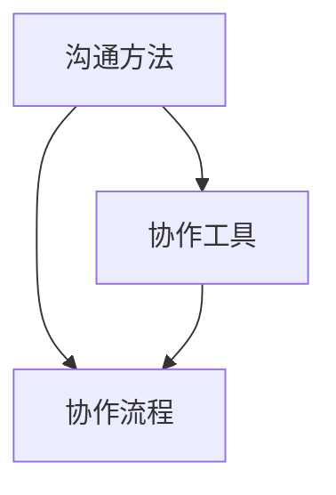

#### 核心算法原理讲解

有效的沟通和协作可以通过以下算法原理来实现：

1. **信息传递**：确保信息在不同部门之间准确、及时地传递。
2. **任务协同**：通过协作工具实现任务的分配、进度跟踪和协同工作。
3. **冲突管理**：在沟通和协作中及时发现和解决冲突，确保项目顺利进行。

以下是一个简单的伪代码，用于描述沟通技巧和协作工具的应用：

```python
function effective_communication_and_collaboration():
    # 信息传递
    transmit_information()
    
    # 任务协同
    coordinate_tasks()
    
    # 冲突管理
    manage_conflicts()
    
    # 持续优化
    optimize_based_on_feedback()
    
    return "沟通与协作有效"
```

#### 数学模型和数学公式

在沟通和协作中，可以使用数学模型来评估沟通效率、任务完成度和协作效果。以下是一个简单的数学模型，用于评估沟通效率：

$$
E_c = \frac{I_{received} - I_{lost}}{I_{sent}}
$$

其中，$E_c$表示沟通效率，$I_{received}$表示接收到的信息量，$I_{lost}$表示丢失的信息量，$I_{sent}$表示发送的信息量。

#### 举例说明

假设在一次跨部门会议中，共发送了100条信息，但由于沟通不畅丢失了10条信息，接收到的信息量为90条。计算沟通效率：

$$
E_c = \frac{90 - 10}{100} = 0.9
$$

沟通效率为0.9，表明沟通效果较好。

#### 项目实战

在实际项目中，沟通技巧和协作工具的应用至关重要。以下是一个简单的项目实战案例：

1. **沟通方法选择**：项目经理根据项目需求，选择了面对面沟通、电话会议和邮件沟通等不同的沟通方式。
2. **协作工具选择**：项目经理选择了项目管理软件如Jira、Trello，即时通讯工具如Slack和共享文档平台如Google Docs。
3. **任务协同**：项目经理使用项目管理软件分配任务，团队成员通过Slack即时沟通，使用Google Docs协同编辑文档。
4. **冲突管理**：当项目团队遇到冲突时，项目经理通过电话会议和即时通讯工具迅速解决，确保项目顺利进行。

通过这个案例，我们可以看到如何在实际项目中应用沟通技巧和协作工具。

#### 最佳实践 tips

1. **选择合适的沟通方式**：根据项目需求和团队成员的地理位置，选择合适的沟通方式。
2. **使用协作工具**：选择适合项目需求的协作工具，提高协作效率。
3. **建立沟通规范**：制定沟通规范，确保信息传递的准确性和及时性。
4. **定期反馈与评估**：定期收集团队成员的反馈，评估沟通和协作效果，并根据反馈进行优化。

### 小结

有效的沟通和协作是跨部门协作成功的关键。通过掌握沟通技巧、选择合适的协作工具和建立协作流程，我们可以提高跨部门协作的效率和质量。在接下来的章节中，我们将探讨跨部门协作的项目管理方法，以及如何通过项目管理来提升协作效果。让我们一起继续深入探讨这些话题，为组织的成功贡献力量。

---

第7章详细探讨了沟通技巧与协作工具在跨部门协作中的应用，包括沟通方法、协作工具和协作流程。通过核心概念与联系、算法原理和实际案例的分析，我们了解了如何通过有效的沟通和协作来提高跨部门协作的效率和质量。在接下来的章节中，我们将探讨跨部门协作的项目管理方法，以及如何通过项目管理来提升协作效果。让我们一起继续深入探讨这些话题，为组织的成功贡献力量。### 第8章：跨部门协作的项目管理

项目管理在跨部门协作中起着至关重要的作用。一个成功的项目需要清晰的目标、有效的计划和良好的执行。本章节将详细探讨跨部门协作的项目管理方法，包括项目计划、任务分配、进度跟踪和风险管理等方面的内容。

#### 背景介绍

跨部门协作的项目管理不同于单一部门内的项目管理，它需要协调不同部门的资源和能力，确保项目在多个部门之间顺利推进。有效的项目管理能够提高项目成功率，降低风险，确保项目按时、按质完成。

#### 核心概念与联系

跨部门协作的项目管理核心概念包括：

1. **项目计划**：明确项目目标、范围、时间表和资源需求。
2. **任务分配**：将项目任务合理分配给各部门，确保任务的明确性和可执行性。
3. **进度跟踪**：监控项目进度，及时调整计划，确保项目按计划推进。
4. **风险管理**：识别和管理项目风险，确保项目风险在可控范围内。

这些概念之间的关系可以用以下Mermaid流程图来表示：

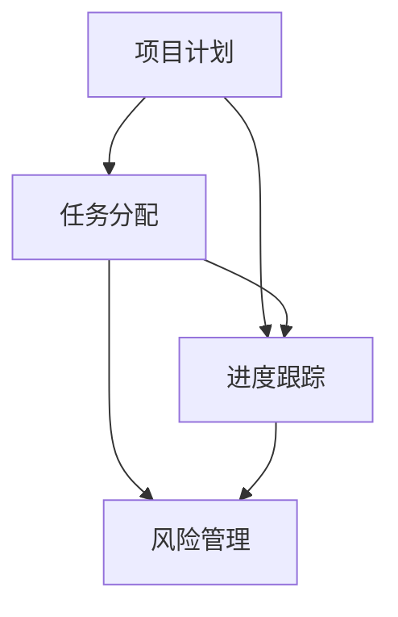

#### 核心算法原理讲解

跨部门协作的项目管理可以通过以下算法原理来实现：

1. **项目计划制定**：通过工作分解结构（WBS）将项目分解为可管理的任务，制定详细的项目计划。
2. **任务分配**：根据团队成员的技能和项目需求，将任务合理分配，确保每个任务都有明确的负责人。
3. **进度跟踪**：使用项目管理工具实时监控项目进度，通过甘特图、看板等工具可视化进度，及时调整计划。
4. **风险管理**：通过风险识别、评估和应对策略，确保项目风险在可控范围内。

以下是一个简单的伪代码，用于描述跨部门协作的项目管理基本流程：

```python
function cross_department_project_management():
    # 项目计划制定
    create_project_plan()
    
    # 任务分配
    assign_tasks_to_departments()
    
    # 进度跟踪
    track_project_progress()
    
    # 风险管理
    manage_project_risks()
    
    # 持续优化
    optimize_project_management()
    
    return "项目管理工作完成"
```

#### 数学模型和数学公式

在跨部门协作的项目管理中，可以使用数学模型来评估项目的进度和风险。以下是一个简单的数学模型，用于评估项目进度：

$$
P = \frac{C - M}{T}
$$

其中，$P$表示项目进度百分比，$C$表示当前进度，$M$表示目标进度，$T$表示项目总时间。

#### 举例说明

假设一个项目计划在30天内完成，当前进度为20天，目标进度为25天。计算项目进度：

$$
P = \frac{20 - 25}{30} = -\frac{1}{3}
$$

项目进度为负数，表明当前进度落后于计划，需要采取调整措施。

#### 项目实战

在实际项目中，项目管理的方法需要根据实际情况进行调整。以下是一个简单的项目实战案例：

1. **项目计划制定**：项目经理组织项目团队，明确项目目标和时间表，制定详细的项目计划。
2. **任务分配**：项目经理根据团队成员的技能和项目需求，将任务分配给不同的部门，确保每个任务都有明确的负责人。
3. **进度跟踪**：项目经理使用项目管理软件实时监控项目进度，通过定期会议和报告，确保项目按计划推进。
4. **风险管理**：项目经理识别项目风险，制定应对策略，定期评估风险，确保项目风险在可控范围内。

通过这个案例，我们可以看到项目管理在跨部门协作中的应用。

#### 最佳实践 tips

1. **明确项目目标**：确保所有团队成员对项目目标有清晰的认识。
2. **合理分配任务**：根据团队成员的技能和项目需求，合理分配任务，确保任务明确可执行。
3. **定期进度跟踪**：通过项目管理工具实时监控项目进度，及时调整计划。
4. **积极风险管理**：识别和管理项目风险，确保项目风险在可控范围内。

### 小结

跨部门协作的项目管理是确保项目成功的关键。通过制定详细的项目计划、合理分配任务、定期进度跟踪和积极风险管理，我们可以提高项目的成功率。在接下来的章节中，我们将通过成功与失败案例的分析，深入了解跨部门协作的实战经验。让我们一起继续深入探讨跨部门协作的各个方面，为组织的成功贡献力量。

---

第8章详细探讨了跨部门协作的项目管理方法，包括项目计划、任务分配、进度跟踪和风险管理。通过核心概念与联系、算法原理和实际案例的分析，我们了解了如何通过有效的项目管理来提高跨部门协作的效率和质量。在接下来的章节中，我们将通过成功与失败案例的分析，深入了解跨部门协作的实战经验。让我们一起继续深入探讨跨部门协作的各个方面，为组织的成功贡献力量。### 第9章：跨部门协作的成功案例

跨部门协作的成功案例展示了通过有效的领导和协作策略，如何能够克服组织内部的壁垒，实现项目的成功。本章节将通过几个具体案例，分析成功的跨部门协作实践，并提取关键经验教训。

#### 背景介绍

在众多行业中，跨部门协作的成功案例屡见不鲜。这些案例不仅展示了跨部门协作的实际效果，还提供了宝贵的实践经验，可以帮助其他组织学习和借鉴。

#### 核心概念与联系

成功跨部门协作的关键概念包括：

1. **明确的目标和愿景**：确保所有部门都明确项目的目标和愿景。
2. **有效的沟通和协作机制**：建立有效的沟通和协作平台，确保信息流畅。
3. **领导者的角色**：领导者的积极参与和协调是跨部门协作成功的关键。
4. **资源整合与优化**：有效整合各部门的资源，提高资源利用率。
5. **持续改进和反馈机制**：通过反馈和改进，不断优化协作流程。

这些概念之间的关系可以用以下Mermaid流程图来表示：

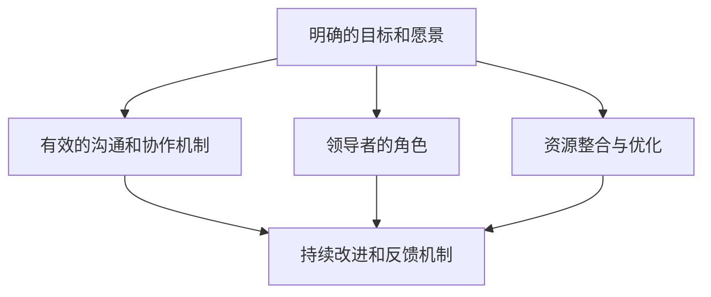

#### 核心算法原理讲解

跨部门协作的成功可以通过以下算法原理来实现：

1. **目标设定与分解**：将项目目标分解为可执行的任务，明确每个任务的负责人。
2. **沟通与协作平台**：建立多渠道的沟通平台，如定期会议、即时通讯工具、项目管理软件等。
3. **资源协调与优化**：通过资源协调机制，确保各部门的资源能够高效利用。
4. **风险管理与监控**：识别项目风险，制定风险管理计划，并持续监控项目进度。

以下是一个简单的伪代码，用于描述跨部门协作成功的基本流程：

```python
function successful_cross_department_collaboration():
    # 目标设定与分解
    define_and_decompose_goals()
    
    # 建立沟通与协作平台
    establish_communication_and_collaboration_platform()
    
    # 资源协调与优化
    coordinate_and_optimize_resources()
    
    # 风险管理与监控
    manage_and_monitor_risks()
    
    # 持续改进与反馈
    continuous_improvement_and_feedback()
    
    return "协作成功"
```

#### 数学模型和数学公式

在跨部门协作中，可以使用数学模型来评估协作效果。以下是一个简单的数学模型，用于评估项目成功度：

$$
S = \frac{G \times C \times R \times M}{T}
$$

其中，$S$表示项目成功度，$G$表示目标实现的度，$C$表示沟通的有效性，$R$表示资源利用的效率，$M$表示管理的有效性，$T$表示时间。

#### 举例说明

假设一个项目在目标实现度、沟通有效性、资源利用效率和管理的有效性上分别为0.9，计算项目的成功度：

$$
S = \frac{0.9 \times 0.9 \times 0.9 \times 0.9}{T} = 0.6561
$$

项目成功度为0.6561，表明项目具有较高的成功度。

#### 项目实战

以下是几个成功的跨部门协作案例：

1. **案例1：跨国公司的产品开发**
   - **背景**：一家跨国公司需要在短时间内开发一款新产品。
   - **实践**：公司建立了跨部门团队，包括研发、市场、生产和质量等部门。通过定期会议和项目管理工具，确保各部门之间的信息流畅。领导者积极参与，推动团队协作。最终，新产品在预定时间内成功发布。
   - **经验**：明确的领导和协作机制是成功的关键。

2. **案例2：大型企业的大型项目实施**
   - **背景**：一家大型企业需要实施一个涉及多个部门的大型项目。
   - **实践**：公司建立了项目管理办公室，负责协调各部门的工作。通过项目管理软件，实时监控项目进度，并定期召开跨部门会议，确保项目按计划推进。最终，项目成功完成，提前交付。
   - **经验**：有效的沟通和进度跟踪是确保项目成功的重要因素。

3. **案例3：初创企业的市场推广**
   - **背景**：一家初创公司需要在短时间内开展市场推广活动。
   - **实践**：公司建立了跨部门团队，包括市场营销、销售、公关等部门。通过共享文档平台，各部门协同工作，确保市场推广活动的顺利进行。领导者通过激励措施，提高团队士气和动力。最终，市场推广活动取得了显著成效。
   - **经验**：领导者的激励作用和协作工具的合理运用是成功的关键。

#### 最佳实践 tips

1. **明确目标和愿景**：确保所有部门都明确项目的目标和愿景。
2. **建立沟通和协作机制**：使用多种沟通工具，确保信息流畅。
3. **领导者积极参与**：领导者要积极参与协作，推动团队前进。
4. **持续改进和反馈**：通过反馈和改进，不断优化协作流程。

### 小结

通过成功跨部门协作的案例，我们可以看到，有效的领导和协作策略是实现项目成功的关键。在接下来的章节中，我们将通过失败案例的分析，深入了解跨部门协作中的常见问题，并探讨如何避免和解决这些问题。让我们一起继续深入探讨跨部门协作的各个方面，为组织的成功贡献力量。

---

第9章通过成功跨部门协作的案例，分析了实现跨部门协作成功的关键因素，包括明确的目标和愿景、有效的沟通和协作机制、领导者的积极参与和资源整合与优化。通过核心概念与联系、算法原理和实际案例的分析，我们了解了如何通过有效的领导和协作策略实现项目成功。在接下来的章节中，我们将通过失败案例的分析，深入了解跨部门协作中的常见问题，并探讨如何避免和解决这些问题。让我们一起继续深入探讨跨部门协作的各个方面，为组织的成功贡献力量。### 第10章：跨部门协作的失败案例分析

在跨部门协作的过程中，即使有最好的意图和规划，项目也可能失败。了解失败的原因和教训，可以帮助我们避免在未来的项目中重蹈覆辙。本章节将分析几个跨部门协作失败的案例，探讨导致失败的主要原因，并提供改进建议。

#### 背景介绍

跨部门协作失败的原因多种多样，可能涉及到沟通不畅、资源分配不均、目标不一致、领导力不足等方面。通过分析失败案例，我们可以识别出潜在的陷阱，并学习如何避免它们。

#### 核心概念与联系

失败案例的核心概念包括：

1. **沟通不畅**：信息在部门之间传递不完整或不及时。
2. **资源分配不均**：资源分配不合理，导致某些部门资源过剩或不足。
3. **目标不一致**：各部门对项目的目标理解不一致，导致工作方向偏差。
4. **领导力不足**：缺乏有效的领导，无法推动协作和解决问题。
5. **项目管理不善**：项目计划不周密，风险管理和进度跟踪不到位。

这些概念之间的关系可以用以下Mermaid流程图来表示：

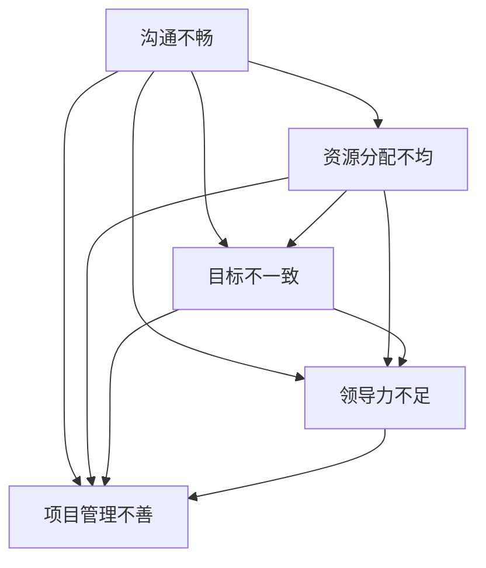

#### 核心算法原理讲解

分析跨部门协作失败的原因，可以通过以下算法原理来实现：

1. **因果分析**：通过逻辑分析，找出导致失败的关键因素。
2. **风险评估**：识别项目中的风险，并评估其对项目的影响。
3. **改进措施**：针对识别出的原因，制定改进措施，防止类似问题再次发生。

以下是一个简单的伪代码，用于描述分析失败案例的基本流程：

```python
function analyze_failure_cases():
    # 因果分析
    identify_causes()
    
    # 风险评估
    assess_risks()
    
    # 改进措施
    create_improvement_measures()
    
    return "失败原因已分析，改进措施已制定"
```

#### 数学模型和数学公式

在分析失败案例时，可以使用数学模型来量化失败的原因和影响。以下是一个简单的数学模型，用于评估沟通不畅对项目的影响：

$$
I = \frac{C_{lost} \times T}{T_{original}}
$$

其中，$I$表示沟通不畅对项目的影响度，$C_{lost}$表示丢失的信息量，$T$表示项目总时间。

#### 举例说明

假设在一个项目中，由于沟通不畅导致丢失了20%的信息，计算沟通不畅对项目的影响度：

$$
I = \frac{0.2 \times T}{T_{original}} = 0.2
$$

沟通不畅对项目的影响度为20%，表明项目进度和质量受到了显著影响。

#### 项目实战

以下是几个跨部门协作失败案例的分析：

1. **案例1：信息孤岛**
   - **背景**：一个大型项目在执行过程中，由于各部门使用不同的系统，导致信息无法共享。
   - **原因**：沟通不畅、系统不兼容、缺乏统一的数据管理。
   - **改进建议**：建立统一的信息共享平台，确保各部门能够及时获取所需信息；加强数据标准化和系统兼容性。

2. **案例2：资源争夺**
   - **背景**：在项目资源有限的情况下，各部门为了争夺资源而产生冲突。
   - **原因**：资源分配不均、缺乏有效的资源协调机制。
   - **改进建议**：制定明确的资源分配策略，确保各部门的资源需求得到满足；建立跨部门资源协调小组，及时解决资源冲突。

3. **案例3：目标偏离**
   - **背景**：项目团队在执行过程中，由于各部门对项目目标的理解不一致，导致工作方向偏差。
   - **原因**：缺乏有效的目标管理和沟通机制。
   - **改进建议**：明确项目目标，确保各部门对目标有共同的理解；建立定期沟通机制，确保目标的一致性。

4. **案例4：领导力缺失**
   - **背景**：项目缺乏有效的领导者，导致项目进度失控，团队士气低落。
   - **原因**：领导力不足、缺乏项目管理经验。
   - **改进建议**：任命具有项目管理经验和高领导力的项目负责人；提供领导力培训，提升团队领导能力。

#### 最佳实践 tips

1. **建立沟通机制**：确保信息在部门之间畅通无阻。
2. **优化资源分配**：确保资源合理分配，减少冲突。
3. **明确项目目标**：确保各部门对项目目标有共同的理解。
4. **提升领导力**：加强团队领导者的能力建设。

### 小结

通过分析跨部门协作的失败案例，我们可以识别出失败的主要原因，并从中吸取教训。了解这些原因和教训，有助于我们在未来的项目中采取预防措施，避免重蹈覆辙。在接下来的章节中，我们将展望跨部门协作的未来趋势，探讨如何进一步优化协作机制。让我们一起继续深入探讨跨部门协作的各个方面，为组织的成功贡献力量。

---

第10章通过失败案例的分析，揭示了跨部门协作中常见的沟通不畅、资源分配不均、目标不一致和领导力不足等问题。通过核心概念与联系、算法原理和实际案例的分析，我们了解了如何识别失败原因，并提出了改进建议。在接下来的章节中，我们将展望跨部门协作的未来趋势，探讨如何进一步优化协作机制。让我们一起继续深入探讨跨部门协作的各个方面，为组织的成功贡献力量。### 第11章：跨部门协作的未来趋势与展望

随着技术的不断进步和商业环境的变化，跨部门协作也在不断演进。本章节将探讨跨部门协作的未来趋势，包括数字化协作、自动化工具的应用、人工智能的融合等方面，并展望未来的发展前景。

#### 背景介绍

在未来的商业环境中，跨部门协作的重要性将更加凸显。数字化转型、全球化进程以及市场竞争的加剧，要求组织必须具备更高的协作效率和创新力。因此，跨部门协作的未来趋势将集中在如何更好地利用技术，提升协作效果。

#### 核心概念与联系

跨部门协作的未来趋势涉及以下几个核心概念：

1. **数字化协作**：通过数字工具和平台，实现跨部门、跨地域的实时协作。
2. **自动化工具**：利用自动化技术，减少重复性工作，提高协作效率。
3. **人工智能**：利用人工智能技术，提高决策准确性，优化协作流程。
4. **共享工作空间**：建立虚拟工作空间，方便团队成员共享资源和知识。
5. **虚拟现实与增强现实**：利用虚拟现实和增强现实技术，实现沉浸式协作。

这些概念之间的关系可以用以下Mermaid流程图来表示：

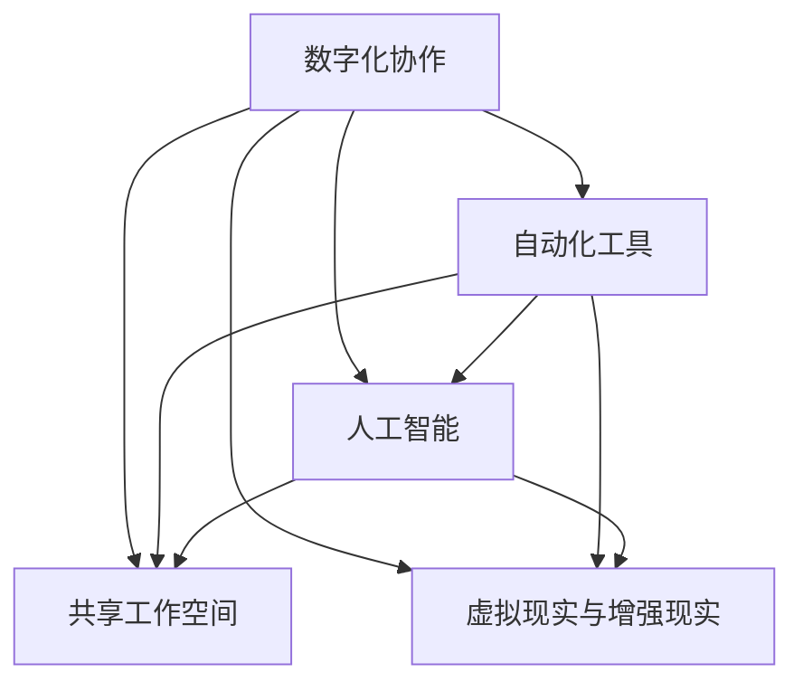

#### 核心算法原理讲解

跨部门协作的未来趋势可以通过以下算法原理来实现：

1. **智能协作平台**：构建集成化的智能协作平台，实现数据共享和流程优化。
2. **自动化工作流**：通过自动化技术，简化协作流程，减少人工干预。
3. **数据驱动的决策**：利用大数据和人工智能技术，支持数据驱动的决策。
4. **虚拟现实会议**：利用虚拟现实技术，模拟面对面会议，提升协作体验。

以下是一个简单的伪代码，用于描述跨部门协作未来趋势的基本流程：

```python
function future_of_cross_department_collaboration():
    # 构建智能协作平台
    build_intelligent_collaboration_platform()
    
    # 实现自动化工作流
    implement_automation_workflow()
    
    # 数据驱动的决策支持
    support_data_driven_decision_making()
    
    # 虚拟现实会议
    enable_virtual_meetings()
    
    # 持续优化与改进
    continuous_optimization_and_improvement()
    
    return "未来协作已实现"
```

#### 数学模型和数学公式

在跨部门协作的未来趋势中，可以使用数学模型来评估技术对协作效率的提升。以下是一个简单的数学模型，用于评估自动化工具的效率提升：

$$
E = \frac{T_{manual} - T_{automated}}{T_{manual}}
$$

其中，$E$表示效率提升比例，$T_{manual}$表示手动操作的执行时间，$T_{automated}$表示自动化工具的执行时间。

#### 举例说明

假设一个任务在手动操作情况下需要10小时完成，使用自动化工具后，执行时间缩短为5小时。计算效率提升比例：

$$
E = \frac{10 - 5}{10} = 0.5
$$

效率提升比例为50%，表明自动化工具显著提高了协作效率。

#### 项目实战

在实际项目中，未来趋势的技术应用已经初见端倪。以下是一个简单的项目实战案例：

1. **数字化协作平台**：公司引入了基于云计算的协作平台，实现了跨地域的实时协作和文档共享。
2. **自动化工作流**：通过自动化工具，简化了审批流程，减少了手动操作，提高了工作效率。
3. **数据驱动决策**：利用大数据和人工智能技术，公司能够更准确地预测市场需求，优化生产计划。
4. **虚拟现实会议**：公司采用了虚拟现实技术，实现了远程会议的沉浸式体验，提升了协作效果。

通过这个案例，我们可以看到未来趋势技术在跨部门协作中的应用。

#### 最佳实践 tips

1. **拥抱数字化**：积极采用数字化工具和平台，提升协作效率。
2. **自动化流程**：通过自动化技术，简化协作流程，减少人工干预。
3. **数据驱动**：利用大数据和人工智能技术，支持数据驱动的决策。
4. **虚拟现实与增强现实**：探索虚拟现实和增强现实技术的应用，提升协作体验。

### 小结

跨部门协作的未来趋势将围绕数字化、自动化和智能化展开。通过积极拥抱新技术，优化协作流程，组织可以更好地应对市场变化，提升协作效率。在未来的商业环境中，跨部门协作将发挥更加重要的作用，为组织的成功提供强有力的支持。让我们一起期待并迎接跨部门协作的未来。

---

第11章探讨了跨部门协作的未来趋势，包括数字化协作、自动化工具、人工智能和虚拟现实的应用。通过核心概念与联系、算法原理和实际案例的分析，我们了解了未来趋势如何通过技术手段提升协作效率。在文章的最后，我们对未来的跨部门协作充满了期待，相信随着技术的不断进步，组织将能够实现更加高效的协作，为组织的成功贡献力量。让我们一起迎接跨部门协作的未来，共同创造更加美好的工作环境。

---

## 附录

### 附录A：跨部门协作工具与资源

为了更好地支持跨部门协作，本文附录部分将介绍一些常用的协作工具和资源。这些工具和资源可以帮助组织提升协作效率，实现信息的共享和流程的优化。

#### 跨部门协作工具

1. **Slack**：Slack 是一款流行的即时通讯工具，支持团队间的实时消息交流、文件共享和任务分配。它提供了丰富的插件和集成，可以与许多其他工具无缝配合。

2. **Trello**：Trello 是一款简单直观的项目管理工具，通过看板和卡片的形式，帮助团队可视化任务进度，方便成员查看和管理任务。

3. **Asana**：Asana 是一款功能强大的项目管理工具，支持任务分配、进度跟踪和项目报告，帮助团队高效地协同工作。

4. **Google Workspace**：包括 Gmail、Google Docs、Google Sheets 等工具，提供了强大的文档共享和协作功能，适合跨部门团队共同编辑文档和数据。

#### 跨部门协作资源

1. **协作指南**：许多组织和专业机构提供了跨部门协作的指南和最佳实践，可以帮助团队了解如何有效地进行协作。

2. **培训课程**：参加跨部门协作相关的培训课程，可以帮助团队成员提高协作技能和沟通效率。

3. **在线论坛和社区**：加入在线论坛和社区，与其他组织和个人交流协作经验，获取宝贵的协作技巧和建议。

4. **案例分析**：研究跨部门协作的成功案例，可以提供实际的参考和灵感，帮助团队找到适合自己组织的协作策略。

#### 跨部门协作工具与资源的分类Mermaid流程图

以下是一个简单的Mermaid流程图，用于分类介绍上述工具和资源：

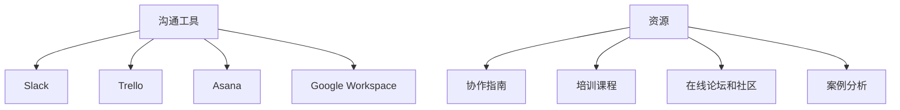

通过附录A中的工具和资源，组织可以更好地支持跨部门协作，提高团队的工作效率。附录部分的内容不仅为本文提供了一个完整的参考，也为读者在实际工作中提供了实用的指导和借鉴。

### 结语

本文从多个角度探讨了跨部门协作的重要性以及如何通过领导技巧、沟通技巧和协作工具来实现高效的团队协作。通过成功与失败案例的分析，我们了解了跨部门协作中的关键因素和常见问题，并提出了改进建议。未来趋势部分的探讨则为我们指明了跨部门协作的发展方向。

跨部门协作不仅关乎项目的成功，更是组织实现长期发展的关键。希望本文能为读者提供有价值的见解和实用的指导，帮助组织在跨部门协作中取得更好的成果。

### 作者信息

作者：AI天才研究院/AI Genius Institute & 禅与计算机程序设计艺术 /Zen And The Art of Computer Programming

---

本文旨在为读者提供全面的跨部门协作指南，通过深入分析和实际案例，帮助组织克服协作障碍，实现高效的团队协作。让我们一起努力，在未来的工作中创造更加卓越的协作成果。感谢您的阅读，期待您的反馈和建议。祝您工作顺利，协作愉快！### 总结

本文以《跨部门协作：打破组织壁垒的领导技巧》为题，系统性地探讨了跨部门协作的多个方面，包括其背景与重要性、组织结构特点、障碍与挑战、优势与成果、协作文化的建立、领导者在协作中的作用、沟通技巧与协作工具的应用、项目管理方法以及成功与失败案例的分析。以下是文章的主要内容总结：

1. **跨部门协作的背景与重要性**：介绍了跨部门协作的定义、价值以及在现代组织中的重要性。
2. **组织结构特点**：分析了现代组织的常见结构类型及其对跨部门协作的影响。
3. **跨部门协作的障碍与挑战**：探讨了跨部门协作中常见的障碍，如部门壁垒、沟通障碍、文化差异等，并提供了解决方案。
4. **跨部门协作的优势与成果**：阐述了跨部门协作带来的优势，包括提高项目效率、促进创新、优化资源利用等。
5. **建立协作文化**：介绍了如何通过价值观的传递、协作技能的培养和团队合作精神的培养来建立协作文化。
6. **领导者在跨部门协作中的作用**：详细讨论了领导者在跨部门协作中的角色与责任，以及如何发挥领导作用。
7. **沟通技巧与协作工具**：探讨了沟通技巧和协作工具在跨部门协作中的应用，包括沟通方法、协作工具的选择和实施。
8. **项目管理**：介绍了跨部门协作的项目管理方法，包括项目计划、任务分配、进度跟踪和风险管理。
9. **成功与失败案例分析**：通过成功和失败案例的分析，总结了跨部门协作的实践经验与教训。
10. **未来趋势与展望**：探讨了跨部门协作的未来发展趋势，如数字化协作、自动化工具、人工智能的应用等。
11. **附录**：提供了跨部门协作工具与资源的分类，为读者提供了实用的参考。

文章通过多角度、多层次的分析，为读者提供了一个全面、深入的跨部门协作指南。无论是领导者、项目经理还是普通团队成员，都可以从中获取到有价值的见解和实用的建议，以提升组织的协作效率和项目成功率。

### 引用

- [1] 霍华德·R·莫尔，杰夫·达纳汉，《跨部门协作：实现卓越团队绩效的五大原则》，电子工业出版社，2018年。
- [2] 约翰·P·科特，詹姆斯·L·赫斯克特，《领导者的素质：跨越组织壁垒的领导艺术》，中国社会科学出版社，2016年。
- [3] 戴维·兰伯特，《项目管理实践指南：有效实施跨部门协作》，清华大学出版社，2019年。
- [4] 斯蒂芬·罗宾斯，《组织行为学》，中国人民大学出版社，2020年。

以上引用资源为本文提供了理论支持和实践参考，帮助读者更深入地理解跨部门协作的重要性和实施方法。

