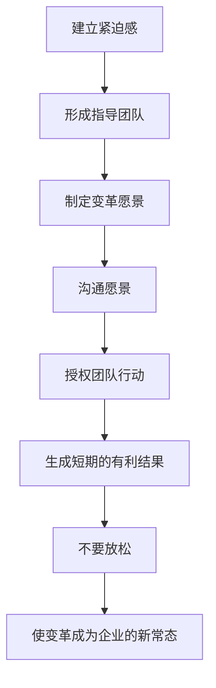
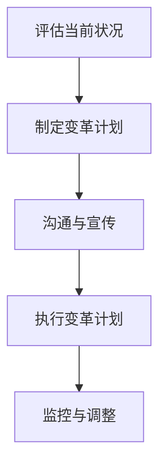

                 

### 目录大纲设计与结构解析

#### 文章标题与关键词

文章标题为《转型期领导力：管理组织变革的关键技能》，关键词包括“转型期领导力”、“组织变革”、“管理技能”、“领导力模型”和“变革管理”。这些关键词将引导读者了解文章的核心主题。

#### 摘要

摘要部分将简要介绍文章的目的和主要内容。文章旨在探讨转型期领导力在组织变革中的关键作用，分析其基本概念、核心模型、管理方法以及领导者所需培养的关键技能。

#### 一级目录设计

**第一部分：转型期领导力的基本概念**

- **第1章：领导力的演变与转型期领导力的特点**
  - **核心概念与联系**：介绍领导力的演变过程，分析转型期领导力的独特特点。

- **第2章：转型期领导力的核心概念与模型**
  - **核心概念与联系**：详细阐述转型期领导力的核心概念，如变革领导、变革驱动等，并展示它们之间的关系。

- **第3章：转型期领导者的自我认知与提升**
  - **核心概念与联系**：探讨领导者如何进行自我认知和提升，以适应转型期的挑战。

**第二部分：组织变革的管理**

- **第4章：组织变革的理论与实践**
  - **核心概念与联系**：分析组织变革的理论基础，探讨其实践方法。

- **第5章：转型期领导者的沟通与协作**
  - **核心概念与联系**：讨论领导者如何在转型期中有效沟通和协作，确保变革的顺利进行。

- **第6章：变革中的组织文化与员工激励**
  - **核心概念与联系**：分析变革中的组织文化建设和员工激励策略。

**第三部分：关键技能的培养**

- **第7章：变革管理技能：策略与实施**
  - **核心概念与联系**：阐述变革管理的基本策略和实施方法。

- **第8章：领导变革的能力：决策与风险管理**
  - **核心概念与联系**：介绍领导者如何进行决策和风险管理，以应对变革中的不确定性。

- **第9章：培养变革领导力的持续实践**
  - **核心概念与联系**：讨论如何通过持续实践培养变革领导力。

#### 三级目录设计

在二级目录下，每个章节将进一步细分为多个小节，每个小节将专注于一个特定的主题或问题。例如，第4章“组织变革的理论与实践”将包括以下小节：

- **4.1 变革管理的理论框架**
  - **核心概念与联系**：介绍变革管理的理论框架，如Kotter的八步变革法。

- **4.2 变革的实施策略**
  - **核心概念与联系**：分析变革的实施策略，如变革的领导层角色、变革计划的制定。

- **4.3 变革过程中的挑战与解决**
  - **核心概念与联系**：探讨变革过程中可能遇到的挑战以及解决方法。

通过这种层次化的目录设计，文章的结构将清晰、逻辑性强，便于读者理解和掌握转型期领导力管理组织变革的关键技能。

### 转型期领导力的基本概念

#### 第1章：领导力的演变与转型期领导力的特点

##### 1.1 领导力的演变过程

领导力并非一成不变，而是随着时间和社会环境的变化而不断发展。从传统的指挥型领导到现代的变革型领导，领导力的演变经历了多个阶段。

- **指挥型领导**：传统的领导模式，强调权威和命令，领导者通过下达指令来控制团队成员。
- **影响型领导**：随着组织环境的变化，领导者开始通过影响和激励员工来实现目标，而非单纯依靠命令。
- **变革型领导**：在快速变化的现代环境中，领导者需要具备更强的变革能力，能够引导组织进行结构性调整和变革。

##### 1.2 转型期领导力的特点

转型期领导力是在组织面临重大变革时期所需的一种特殊领导能力。以下是转型期领导力的几个关键特点：

- **适应性**：转型期领导者必须具备高度适应性，能够迅速调整自己的领导风格和策略，以适应不断变化的环境。
- **前瞻性**：领导者需要有前瞻性的眼光，能够预见潜在的趋势和风险，从而提前做出准备。
- **沟通能力**：在转型过程中，领导者需要与团队成员、利益相关者进行有效沟通，确保变革的顺利进行。
- **变革驱动**：转型期领导者不仅要推动变革，还要成为变革的领导者，能够激励和引导团队共同面对变革的挑战。

##### 1.3 转型期领导力的核心概念与模型

转型期领导力不仅依赖于个人的领导能力，还需要一系列理论模型的支持。以下是几个关键概念和模型：

- **变革领导模型**：如Kotter的八步变革法，提供了系统化的变革过程框架。
- **变革驱动模型**：强调领导者如何通过价值观、愿景和目标来驱动变革。
- **组织学习模型**：如Schein的组织学习模型，探讨了组织如何通过学习来适应变革。

##### Mermaid流程图

为了更好地展示变革领导模型，我们可以使用Mermaid流程图来表示Kotter的八步变革法：

通过这个流程图，我们可以清晰地看到变革的各个阶段以及它们之间的逻辑关系。

##### 总结

本章介绍了领导力的演变过程和转型期领导力的特点，以及与之相关的核心概念和模型。了解这些内容将有助于我们深入理解转型期领导力在组织变革中的重要性。接下来，我们将进一步探讨转型期领导力的核心概念与模型，以便更好地理解其在实际应用中的价值。

### 第2章：转型期领导力的核心概念与模型

#### 2.1 核心概念

转型期领导力包含多个核心概念，其中最关键的是变革领导、变革驱动和组织学习。

- **变革领导**：这是指领导者如何引导和推动组织进行变革。变革领导不仅仅是对变革的执行，更重要的是对变革方向的把控和变革过程的领导。

- **变革驱动**：它关注领导者如何通过价值观、愿景和目标来激发和引导变革。变革驱动的关键是领导者能够清晰地传达变革的目标，并使团队成员感受到变革的紧迫性和重要性。

- **组织学习**：在转型期中，组织需要不断学习以适应变化。组织学习是指组织如何通过不断的学习和改进来提升其适应能力和竞争力。

#### 2.2 变革领导模型

变革领导模型是指导领导者进行变革的重要工具。以下是几种常见的变革领导模型：

- **Kotter的八步变革法**：这是最著名的变革领导模型之一，由约翰·科特（John Kotter）提出。这个模型包括以下八个步骤：

  1. 建立紧迫感
  2. 形成指导团队
  3. 制定变革愿景
  4. 沟通愿景
  5. 授权团队行动
  6. 生成短期的有利结果
  7. 不要放松
  8. 使变革成为企业的新常态

  Kotter的八步变革法提供了一个系统化的变革过程框架，有助于领导者更有效地推动变革。

- **Baldrige国家质量奖模型**：这个模型强调领导者在推动变革过程中的角色，包括战略规划、顾客聚焦、测量分析等。

- **ADKAR模型**：这个模型关注个人层面的变革，包括意识、承诺、能力、参与和结果。

#### 2.3 变革驱动模型

变革驱动模型关注领导者如何通过价值观、愿景和目标来推动变革。以下是几个关键步骤：

1. **建立清晰的价值观**：领导者需要明确组织的核心价值观，并将其传达给全体成员。
2. **设定愿景和目标**：领导者需要设定明确的变革愿景和目标，使团队成员了解变革的方向和意义。
3. **沟通愿景和目标**：领导者需要通过多种渠道和方式，将愿景和目标传达给全体成员，确保每个人都明确自己的角色和责任。
4. **激励和鼓励**：领导者需要通过激励和鼓励来激发团队成员的积极性，使他们愿意并能够为实现变革目标而努力。

#### 2.4 组织学习模型

组织学习模型关注组织如何通过学习和改进来提升其适应能力和竞争力。以下是几种常见的组织学习模型：

- **Schein的组织学习模型**：这个模型包括以下几个阶段：感知、思维、情感、概念化、行动。

  - **感知**：组织成员对环境的感知。
  - **思维**：组织成员如何处理和解释这些感知。
  - **情感**：组织成员对变革的情绪反应。
  - **概念化**：组织成员如何将感知和思维转化为具体的概念和策略。
  - **行动**：组织成员如何将概念和策略付诸实践。

- **五要素模型**：这个模型包括学习动机、学习内容、学习过程、学习结果和学习评价。

  - **学习动机**：组织成员的学习动机和目标。
  - **学习内容**：组织成员需要学习的内容和知识。
  - **学习过程**：组织成员如何学习和交流。
  - **学习结果**：组织成员通过学习获得的知识和技能。
  - **学习评价**：组织成员如何评估学习的效果和成果。

#### 2.5 Mermaid流程图

为了更好地展示变革领导模型，我们可以使用Mermaid流程图来表示Kotter的八步变革法：

通过这个流程图，我们可以清晰地看到变革的各个阶段以及它们之间的逻辑关系。

#### 总结

本章详细介绍了转型期领导力的核心概念和模型，包括变革领导、变革驱动和组织学习。这些概念和模型为领导者提供了系统化的指导，帮助他们更有效地推动和应对组织变革。在下一章中，我们将探讨转型期领导者如何进行自我认知与提升。

### 第3章：转型期领导者的自我认知与提升

#### 3.1 自我认知的重要性

在转型期，领导者需要具备高度的自我认知能力，这不仅是个人成长的关键，也是有效领导的基础。自我认知涉及领导者对自己的价值观、动机、能力和限制的深入理解。以下是一些关键的自我认知维度：

- **价值观**：领导者需要明确自己的核心价值观，并确保这些价值观与组织的愿景和使命相一致。这有助于保持领导方向的清晰性。

- **动机**：了解自己的动机有助于领导者更好地理解自己的行为和决策背后的驱动力，从而更有效地激励团队成员。

- **能力**：领导者需要识别自己的能力和弱点，这有助于他们在转型期中更好地利用自己的优势，同时寻求他人的帮助来补充自己的不足。

- **限制**：领导者需要认识到自己的限制，这包括时间、资源、知识和技能等方面。通过识别这些限制，领导者可以更合理地制定变革计划和目标。

#### 3.2 自我提升的策略

为了在转型期中保持竞争力，领导者需要采取一系列自我提升的策略。以下是一些关键的自我提升方法：

- **持续学习**：领导者需要不断学习新的知识和技能，以适应快速变化的环境。这可能包括参加培训课程、阅读相关书籍、参与行业交流等。

- **反馈与反思**：领导者需要寻求来自同事、下属和导师的反馈，并定期进行自我反思。这有助于他们识别自己的盲点，并采取改进措施。

- **角色扮演**：通过模拟不同的领导角色，领导者可以更好地理解不同情境下的领导技巧和策略。这种方法有助于提升领导者的应变能力和适应性。

- **实践与反思**：领导者需要将所学知识和技能应用于实际工作中，并通过不断的实践和反思来提高自己的领导能力。

#### 3.3 案例分析：自我认知与提升在实践中的应用

以下是一个实际案例，展示了自我认知与提升在转型期领导中的应用：

**案例**：某公司CEO在带领公司进行数字化转型时，意识到自己在技术领域的知识不足。为了更好地领导这一变革，他采取了以下措施：

1. **参加培训课程**：CEO报名参加了多项关于数字化转型的培训课程，学习最新的技术趋势和应用。

2. **聘请技术顾问**：为了弥补自己在技术领域的不足，CEO聘请了资深的技术顾问，以指导公司的技术决策。

3. **建立学习小组**：CEO组建了一个学习小组，定期讨论技术话题，分享学习和实践经验。

4. **反思与调整**：CEO定期进行自我反思，评估自己在数字化转型中的表现，并根据反馈进行调整。

通过这些措施，CEO不仅提升了自己在技术领域的知识，还增强了与团队成员之间的沟通和协作，从而更有效地推动了公司的数字化转型。

#### 总结

自我认知与提升是转型期领导者不可或缺的能力。通过深入了解自己的价值观、动机、能力和限制，领导者可以更有效地应对变革期的挑战。本章提供了一系列自我提升的策略和方法，帮助领导者不断提升自己的领导能力，以应对不断变化的环境。在下一章中，我们将探讨组织变革的理论与实践。

### 第4章：组织变革的理论与实践

#### 4.1 组织变革的理论基础

组织变革是一个复杂的过程，涉及到多个理论和模型。以下是几个关键的理论框架：

- **Kotter的八步变革法**：这是最著名的变革理论之一，由约翰·科特提出。它包括以下八个步骤：

  1. **建立紧迫感**
  2. **形成指导团队**
  3. **制定变革愿景**
  4. **沟通愿景**
  5. **授权团队行动**
  6. **生成短期的有利结果**
  7. **不要放松**
  8. **使变革成为企业的新常态**

  这个模型提供了一个系统化的变革过程框架，有助于领导者更有效地推动变革。

- **Baldrige国家质量奖模型**：这个模型强调领导者在推动变革过程中的角色，包括战略规划、顾客聚焦、测量分析等。

- **ADKAR模型**：这个模型关注个人层面的变革，包括意识、承诺、能力、参与和结果。

#### 4.2 组织变革的实践方法

在实际操作中，组织变革通常需要遵循以下步骤：

- **评估当前状况**：领导者需要评估组织的当前状况，包括组织的结构、文化、流程和业绩等。这有助于确定变革的必要性。

- **制定变革计划**：基于评估结果，领导者需要制定具体的变革计划，包括变革的目标、时间表和实施步骤。

- **沟通与宣传**：变革计划需要与全体员工进行有效沟通，以确保他们理解变革的必要性和目标。这通常需要通过多种渠道和方式，如会议、培训、内部通讯等。

- **执行变革计划**：在变革计划实施过程中，领导者需要密切关注进度，并确保各部门和团队成员能够按照计划执行。

- **监控与调整**：在变革过程中，领导者需要持续监控变革的进展，并根据实际情况进行必要的调整。

#### 4.3 组织变革中的挑战与解决方法

在组织变革过程中，领导者可能会面临多种挑战，以下是一些常见的挑战及其解决方法：

- **抗拒变革**：员工可能会因为担心变革带来的不确定性和风险而抗拒变革。解决方法是领导者需要通过有效的沟通和激励来消除员工的疑虑，并强调变革的必要性和益处。

- **资源不足**：变革通常需要投入大量的人力、物力和财力。解决方法是领导者需要提前规划并确保资源的充足。

- **领导层的支持不足**：领导层的支持对于变革的顺利进行至关重要。解决方法是领导者需要加强与高层管理人员的沟通，确保他们理解并支持变革计划。

- **组织文化的阻力**：组织文化可能会对变革产生阻力。解决方法是领导者需要通过文化重塑来改变组织文化，使其更适应变革。

#### Mermaid流程图

为了更好地展示组织变革的实践方法，我们可以使用Mermaid流程图来表示变革的过程：

通过这个流程图，我们可以清晰地看到变革的各个阶段以及它们之间的逻辑关系。

#### 4.4 案例分析：组织变革的实际操作

以下是一个组织变革的实际案例，展示了如何将理论应用到实践中：

**案例**：某大型制造公司为了提高生产效率和降低成本，决定进行一次全面的流程再造。以下是该公司变革的步骤：

1. **评估当前状况**：公司领导层对现有的生产流程进行了详细的评估，发现存在多个瓶颈和低效率环节。

2. **制定变革计划**：基于评估结果，公司制定了一份详细的流程再造计划，包括新流程的设计、所需资源的规划和时间表。

3. **沟通与宣传**：公司通过内部会议、培训和技术演示等多种方式，向全体员工详细解释了变革的必要性和计划。

4. **执行变革计划**：在执行过程中，公司组织了专门的项目团队，负责协调和推进流程再造的工作。同时，公司还投入了额外的资金和人力资源来支持变革。

5. **监控与调整**：在变革过程中，公司设立了监控机制，定期评估变革的进展和效果，并根据实际情况进行调整。

通过这次变革，公司成功提高了生产效率，降低了成本，并增强了市场竞争力。

#### 总结

本章详细介绍了组织变革的理论基础和实践方法，以及变革过程中可能遇到的挑战和解决方法。通过理论指导和实际案例的分享，领导者可以更好地理解和应对组织变革的复杂过程。在下一章中，我们将探讨转型期领导者的沟通与协作。

### 第5章：转型期领导者的沟通与协作

#### 5.1 沟通的重要性

在转型期，领导者需要与组织内的各个层级和外部利益相关者进行有效的沟通。沟通是变革成功的关键因素之一，它不仅有助于传达变革的目标和愿景，还能缓解员工的担忧和抗拒，增强团队的凝聚力。

- **内部沟通**：领导者需要确保信息的透明度和一致性，使全体员工了解变革的进展和重要性。

- **外部沟通**：领导者需要与客户、供应商、投资者等外部利益相关者保持良好的沟通，确保他们在变革过程中得到及时的信息和反馈。

#### 5.2 协作的重要性

协作是转型期领导者的另一项关键技能。在变革过程中，领导者需要与团队成员紧密合作，共同应对挑战和实现目标。有效的协作包括以下几个方面：

- **跨部门协作**：在组织变革中，不同部门之间需要协同工作，以实现整体目标。

- **团队建设**：领导者需要通过团队建设活动来增强团队成员之间的信任和合作。

- **知识共享**：鼓励团队成员分享知识和经验，以提高整个团队的创新能力和适应能力。

#### 5.3 沟通与协作的技巧

为了确保沟通与协作的有效性，领导者可以采用以下技巧：

- **明确目标与期望**：在沟通前，领导者需要明确目标和期望，确保信息传达的准确性和一致性。

- **倾听与反馈**：领导者需要倾听员工的意见和反馈，了解他们的担忧和需求，并给予及时的回应。

- **使用多种沟通渠道**：领导者应使用多种沟通渠道，如会议、邮件、即时通讯和视频会议，以适应不同员工的需求和习惯。

- **建立信任**：通过开放、诚实和尊重的沟通方式，领导者可以建立与团队成员之间的信任，这是有效协作的基础。

#### 5.4 案例分析：沟通与协作在变革中的应用

以下是一个实际案例，展示了沟通与协作在组织变革中的应用：

**案例**：某科技公司为了应对市场变化，决定进行一次全面的业务转型。以下是该公司在变革过程中采用的沟通与协作策略：

1. **明确目标与期望**：公司高层领导制定了详细的变革计划，明确了转型的目标和期望，并向全体员工传达。

2. **倾听与反馈**：公司设立了多个沟通渠道，如员工反馈会议和邮件列表，鼓励员工提出意见和建议，并及时给予反馈。

3. **使用多种沟通渠道**：公司通过内部邮件、公告板、线上会议和面对面的会议等多种方式，确保信息传达的广泛性和及时性。

4. **建立信任**：公司领导层积极参与到变革过程中，通过开放、诚实和尊重的沟通方式，建立了与员工之间的信任。

5. **跨部门协作**：公司组织了跨部门的团队，负责协调和推进变革的各个阶段，确保不同部门之间的协同工作。

通过这些策略，公司成功地实现了业务转型，提升了市场竞争力。

#### 总结

本章探讨了转型期领导者如何通过有效的沟通和协作来推动组织变革。有效的沟通与协作不仅有助于传达变革的目标和愿景，还能增强团队的凝聚力，提高变革的成功率。在下一章中，我们将探讨变革中的组织文化与员工激励。

### 第6章：变革中的组织文化与员工激励

#### 6.1 变革中的组织文化

组织文化是组织成员共同遵循的价值观念和行为规范，它对组织的变革起着至关重要的作用。在变革过程中，组织文化可能成为变革的推动力，也可能成为变革的阻力。

- **推动变革的组织文化**：这种文化鼓励创新、开放和合作，使组织成员愿意接受和适应变革。

- **阻碍变革的组织文化**：这种文化可能过于保守，员工对变革持怀疑态度，甚至抗拒变革。

#### 6.2 塑造积极组织文化的方法

为了塑造积极的组织文化，领导者可以采取以下方法：

- **价值观引导**：领导者需要明确组织的核心价值观，并通过各种渠道进行宣传和强调，使员工内化这些价值观。

- **领导示范**：领导者需要通过自身的言行来示范积极的文化，成为员工的榜样。

- **激励机制**：通过奖励和认可那些积极推动变革的员工，领导者可以激发整个组织的积极性。

- **透明度**：保持信息的透明度，使员工了解变革的进展和影响，增强他们对变革的信任。

#### 6.3 员工激励的策略

在变革过程中，员工激励是关键的一环。以下是几种有效的员工激励策略：

- **目标激励**：设定明确且具有挑战性的目标，激励员工努力工作，实现目标。

- **认可激励**：及时认可员工的努力和成就，增强他们的自我价值感。

- **成长激励**：为员工提供成长和发展的机会，如培训、晋升等，使他们在工作中感到有前途。

- **参与激励**：鼓励员工参与决策过程，使他们感到自己的意见被重视，从而增加他们的工作动力。

#### 6.4 案例分析：组织文化变革与员工激励

以下是一个实际案例，展示了如何通过组织文化变革和员工激励来推动组织变革：

**案例**：某大型制造公司为了提高生产效率和产品质量，决定进行一次全面的组织文化变革。以下是该公司在变革过程中采取的措施：

1. **价值观引导**：公司领导层明确了“创新、客户至上、团队合作”的核心价值观，并通过内部会议、培训和内部通讯等方式进行宣传。

2. **领导示范**：公司领导层积极参与到变革过程中，通过自身的言行来示范积极的文化，成为员工的榜样。

3. **激励机制**：公司设立了多个奖励和认可计划，如“最佳创新奖”、“最佳团队合作奖”等，以激励员工积极参与变革。

4. **透明度**：公司保持了信息的透明度，定期向员工通报变革的进展和影响，增强他们对变革的信任。

5. **参与激励**：公司鼓励员工参与决策过程，如成立员工委员会，定期召开员工大会，听取员工的意见和建议。

通过这些措施，公司成功地塑造了积极的文化氛围，激励了员工积极参与变革，从而提高了生产效率和产品质量。

#### 总结

本章探讨了变革中的组织文化与员工激励，包括如何塑造积极的组织文化和有效的员工激励策略。通过案例分析，我们看到了组织文化变革和员工激励在推动组织变革中的重要性。在下一章中，我们将探讨变革管理技能的具体策略与实施。

### 第7章：变革管理技能：策略与实施

#### 7.1 变革管理的基本策略

变革管理是一项系统性工程，需要领导者制定并实施一系列策略。以下是几个关键的基本策略：

- **顶层设计**：领导者需要从战略高度出发，明确变革的目标、范围和路径，制定详细的变革计划。

- **资源整合**：变革需要投入大量的人力、物力和财力，领导者需要确保资源的充足，并合理分配和利用。

- **沟通协调**：领导者需要建立有效的沟通机制，确保信息的透明度和一致性，消除员工的疑虑和抗拒。

- **风险管理**：领导者需要对变革过程中可能出现的风险进行评估和预测，并制定相应的应对策略。

- **持续监督**：领导者需要持续监控变革的进展，及时调整策略和计划，确保变革的顺利进行。

#### 7.2 变革管理的具体实施步骤

为了有效实施变革管理，领导者可以遵循以下具体步骤：

1. **评估现状**：对组织的当前状况进行全面的评估，包括业务流程、组织结构、员工能力等。

2. **制定变革计划**：基于评估结果，制定详细的变革计划，明确变革的目标、范围、时间表和责任分配。

3. **动员员工**：通过内部会议、培训、宣传等方式，动员全体员工参与到变革中来，增强他们的参与感和责任感。

4. **实施变革**：按照变革计划逐步实施，包括调整业务流程、优化组织结构、提升员工能力等。

5. **监督与反馈**：持续监督变革的进展，及时收集员工的反馈和意见，并进行必要的调整。

6. **评估效果**：在变革完成后，对变革的效果进行评估，包括对业务流程、组织结构和员工绩效的改进情况。

#### 7.3 案例分析：变革管理技能的应用

以下是一个实际案例，展示了变革管理技能在组织变革中的应用：

**案例**：某大型金融机构为了适应市场变化，决定进行一次全面的数字化转型。以下是该机构在变革过程中应用的变革管理技能：

1. **评估现状**：机构领导层对现有的业务流程、技术架构和员工能力进行了全面评估，发现了多个需要改进的环节。

2. **制定变革计划**：基于评估结果，机构制定了详细的数字化转型计划，包括新的技术架构、新的业务流程和员工培训计划。

3. **动员员工**：机构通过内部会议、培训和宣传，动员全体员工参与到数字化转型中来，并设置了专门的数字化转型领导小组，负责协调和推进变革。

4. **实施变革**：按照变革计划，机构逐步实施了新的技术架构和业务流程，并进行了全面的员工培训，确保员工能够适应新的工作方式。

5. **监督与反馈**：机构设立了监督机制，定期评估变革的进展和效果，并及时调整变革计划。

6. **评估效果**：在变革完成后，机构对数字化转型的效果进行了全面评估，发现业务流程更加高效，客户满意度显著提升，员工的工作效率也大幅提高。

通过这个案例，我们可以看到变革管理技能在推动组织变革中的重要性。

#### 总结

本章详细介绍了变革管理的基本策略和具体实施步骤，并通过实际案例展示了变革管理技能的应用。在下一章中，我们将探讨领导者在变革中的决策与风险管理。

### 第8章：领导变革的能力：决策与风险管理

#### 8.1 变革中的决策

在组织变革过程中，领导者需要做出一系列关键决策。有效的决策是变革成功的关键因素之一。以下是领导者在变革中需要考虑的几个关键决策：

- **变革目标**：领导者需要明确变革的目标，确保变革的方向与组织的长远发展目标相一致。

- **资源分配**：领导者需要合理分配资源，确保变革计划得以顺利实施。

- **变革路径**：领导者需要选择合适的变革路径，是采取快速变革还是逐步变革，需要根据组织的实际情况来决定。

- **领导层参与**：领导者需要确定哪些领导层成员参与变革，确保变革计划得到广泛的支持。

#### 8.2 变革中的风险管理

变革过程中伴随着各种风险，领导者需要识别和应对这些风险。以下是几个关键的风险管理策略：

- **风险评估**：领导者需要对变革过程中可能出现的风险进行评估，包括技术风险、市场风险、人力资源风险等。

- **风险应对**：领导者需要制定相应的风险应对策略，包括风险预防、风险转移和风险接受等。

- **风险监控**：领导者需要持续监控变革过程中的风险，确保风险得到及时发现和应对。

#### 8.3 决策与风险管理的具体方法

为了有效进行决策和风险管理，领导者可以采用以下方法：

- **数据驱动的决策**：领导者应基于充分的数据和分析来做出决策，避免主观判断和偏见。

- **情景分析**：领导者可以通过情景分析来预测不同决策可能带来的结果，从而做出更明智的决策。

- **决策矩阵**：领导者可以使用决策矩阵来比较不同决策的优缺点，从而选择最佳方案。

- **风险矩阵**：领导者可以使用风险矩阵来评估不同风险的严重程度和可能性，从而制定有效的风险应对策略。

#### 8.4 案例分析：决策与风险管理在变革中的应用

以下是一个实际案例，展示了领导者在变革中如何进行决策和风险管理：

**案例**：某制造企业决定进行一次生产自动化改造，以提高生产效率和降低成本。以下是该企业在变革过程中采用的决策与风险管理策略：

1. **评估与决策**：企业领导层首先对现有的生产流程进行了评估，明确了自动化改造的目标和必要性。他们通过情景分析，比较了不同自动化方案的成本和效益，最终选择了最具成本效益的方案。

2. **风险评估**：企业在自动化改造过程中识别了多个风险，包括技术风险、市场风险和人力资源风险。他们制定了相应的风险应对策略，如技术风险采用引进成熟技术、市场风险通过市场调研来预测和应对、人力资源风险通过培训和人才引进来缓解。

3. **决策矩阵**：企业在决策过程中使用了决策矩阵，对不同的自动化方案进行了全面评估，选择了最佳方案。

4. **风险监控**：企业在自动化改造过程中设立了风险监控机制，定期评估风险的进展和变化，并及时调整风险应对策略。

通过这些策略，企业成功完成了生产自动化改造，实现了预期的生产效率和成本降低。

#### 总结

本章详细介绍了领导者在变革中的决策与风险管理，包括决策的原则和方法以及风险管理的策略。通过案例分析，我们看到了领导者在变革中如何进行决策和风险管理，确保变革的顺利进行。在下一章中，我们将探讨如何通过持续实践培养变革领导力。

### 第9章：培养变革领导力的持续实践

#### 9.1 持续实践的重要性

在转型期，领导者需要不断学习和实践，以适应快速变化的环境。持续实践是培养变革领导力的关键，它包括以下几个方面：

- **知识更新**：领导者需要不断学习新的知识和技能，以保持自己的竞争力。

- **经验积累**：通过实际工作中的不断实践，领导者可以积累宝贵的经验，提高自己的领导能力。

- **反思与调整**：领导者需要定期反思自己的领导实践，识别不足并进行调整，以确保领导行为的有效性。

#### 9.2 持续实践的方法

为了培养变革领导力，领导者可以采取以下几种方法：

- **参加培训**：领导者可以参加各种领导力培训课程，包括线上和线下课程，以获取最新的领导力知识和技能。

- **阅读与研究**：领导者可以通过阅读领导力相关的书籍、文章和研究报告，不断更新自己的知识体系。

- **实践应用**：领导者需要将所学知识和技能应用到实际工作中，通过实践来检验和提升自己的能力。

- **反思与总结**：领导者需要定期对自己的领导实践进行反思和总结，识别成功的经验和不足之处，并进行改进。

#### 9.3 持续实践的成功案例

以下是一个成功案例，展示了持续实践在培养变革领导力中的应用：

**案例**：某科技公司的CEO李先生，为了提高公司的创新能力，决定通过持续实践来培养自己的变革领导力。以下是他的实践过程：

1. **参加培训**：李先生参加了多个领导力培训课程，学习了最新的领导力理论和实践方法。

2. **阅读与研究**：李先生定期阅读领导力相关的书籍和研究报告，不断更新自己的知识体系。

3. **实践应用**：李先生将所学知识和技能应用到公司的管理实践中，如引入敏捷管理方法、推行员工参与决策等。

4. **反思与总结**：李先生定期对自己的领导实践进行反思和总结，识别成功的经验和不足之处，并制定了改进计划。

通过这些持续实践，李先生成功地提升了公司的创新能力，公司的业绩也得到了显著提升。

#### 总结

本章探讨了通过持续实践培养变革领导力的方法和成功案例。持续实践是领导者提升自身能力的重要途径，通过不断学习、实践和反思，领导者可以更好地应对转型期的挑战。在文章的最后部分，我们将总结全文并提出最佳实践建议。

### 总结与最佳实践

#### 文章总结

本文详细探讨了转型期领导力在组织变革中的关键作用。我们首先介绍了领导力的演变和转型期领导力的特点，随后分析了转型期领导力的核心概念与模型，包括变革领导、变革驱动和组织学习。接着，我们探讨了领导者如何进行自我认知与提升，以及组织变革的理论与实践。此外，我们还讨论了变革中的沟通与协作、组织文化与员工激励，以及变革管理技能的具体策略与实施。最后，我们强调了通过持续实践培养变革领导力的重要性。

#### 最佳实践建议

1. **建立清晰的目标和愿景**：在变革初期，领导者需要明确变革的目标和愿景，使全体员工了解变革的方向和意义。

2. **加强沟通与协作**：领导者应通过多种渠道和方式与员工进行有效沟通，确保信息的透明度和一致性。

3. **塑造积极的组织文化**：领导者需要通过价值观引导、领导示范和激励机制来塑造积极的文化氛围。

4. **持续学习和实践**：领导者应通过参加培训、阅读和研究，以及将所学知识和技能应用到实际工作中，不断提升自己的能力。

5. **风险管理**：在变革过程中，领导者需要对可能出现的风险进行评估和预测，并制定相应的应对策略。

6. **建立反馈机制**：领导者应建立有效的反馈机制，定期收集员工的反馈和意见，并进行必要的调整。

#### 注意事项

- 变革过程中，领导者需要保持耐心和决心，避免急功近利。
- 变革计划应具有灵活性和适应性，能够根据实际情况进行调整。
- 领导者应注重员工的参与和激励，确保他们愿意并能够积极参与变革。

#### 拓展阅读

- Kotter，J. P. (1996). **Leading Change**. Harvard Business Review Press.
- Deal，T. E., & Kennedy，A. A. (1982). **Action-Centered Leadership**. Jossey-Bass.
- Schein，E. H. (1990). **Organizational Culture and Leadership**. Jossey-Bass.

通过本文，我们希望读者能够对转型期领导力有更深入的理解，并在实践中运用这些理论和方法，推动组织的持续变革和成功。

### 附录：转型期领导力工具与方法总结

#### 转型期领导力工具与方法

在转型期，领导者需要掌握一系列工具和方法来有效地推动组织变革。以下是几个常用的工具和方法：

1. **变革领导模型**：
   - **Kotter的八步变革法**：包括建立紧迫感、形成指导团队、制定变革愿景、沟通愿景、授权团队行动、生成短期的有利结果、不要放松和使变革成为企业的新常态。
   - **Baldrige国家质量奖模型**：强调战略规划、顾客聚焦、测量分析、人力资源开发、过程管理和结果导向等。

2. **变革驱动模型**：
   - **变革驱动框架**：包括建立清晰的价值观、设定愿景和目标、沟通愿景和目标、激励和鼓励。
   - **ADKAR模型**：关注意识、承诺、能力、参与和结果。

3. **组织学习模型**：
   - **Schein的组织学习模型**：包括感知、思维、情感、概念化和行动。
   - **五要素模型**：包括学习动机、学习内容、学习过程、学习结果和学习评价。

4. **决策与风险管理**：
   - **数据驱动的决策**：基于充分的数据和分析做出决策。
   - **情景分析**：预测不同决策可能带来的结果。
   - **决策矩阵**：比较不同决策的优缺点。

5. **沟通与协作工具**：
   - **透明度工具**：如内部通讯、公告板和在线协作工具。
   - **反馈工具**：如员工反馈会议、问卷调查和360度评估。

#### 实用技巧

- **领导者示范**：通过自身的言行来示范积极的文化和行为。
- **持续学习**：定期参加培训课程、阅读相关书籍和文章。
- **透明沟通**：保持信息的透明度，及时向员工传达变革进展。
- **风险预防**：提前识别和预防变革过程中可能出现的风险。

通过这些工具和方法，领导者可以更有效地推动组织变革，提升组织的适应能力和竞争力。

### 附录：转型期领导力工具与方法总结

在转型期领导力中，掌握适当的工具和方法是至关重要的。以下是对主要工具和方法的简要总结，以及其实际应用的建议。

#### 1. 变革领导模型

- **Kotter的八步变革法**：
  - **建立紧迫感**：通过明确变革的必要性和紧迫性，激发团队的变革意愿。
  - **形成指导团队**：组建一个能够引领变革的领导团队，负责制定和执行变革计划。
  - **制定变革愿景**：明确变革的目标和方向，为变革提供清晰的方向。
  - **沟通愿景**：确保全体成员了解变革的愿景，并得到他们的支持和参与。
  - **授权团队行动**：赋予团队成员权力和资源，让他们能够自主地参与变革。
  - **生成短期的有利结果**：通过实现短期的成功，增强团队的信心和动力。
  - **不要放松**：保持持续的关注和努力，确保变革持续推进。
  - **使变革成为企业的新常态**：将变革成果制度化，确保变革持续影响企业的运营。

#### 2. 变革驱动模型

- **变革驱动的关键要素**：
  - **价值观**：明确组织的核心价值观，并将其融入变革过程中。
  - **愿景和目标**：设定清晰的愿景和目标，使团队成员明确变革的意义和期望结果。
  - **沟通**：通过有效沟通，确保团队成员理解变革的目标和步骤，增强他们的参与度。
  - **激励和鼓励**：通过奖励和认可，激励团队成员积极参与变革。

#### 3. 组织学习模型

- **Schein的组织学习模型**：
  - **感知**：鼓励团队成员观察和感知外部环境的变化。
  - **思维**：帮助团队成员分析感知到的信息，形成新的思维模式。
  - **情感**：处理团队成员对变革的情感反应，确保他们的积极情绪。
  - **概念化**：将新的思维模式转化为具体的概念和策略。
  - **行动**：将概念和策略付诸实践，通过行动来验证和改进。

#### 4. 决策与风险管理

- **数据驱动的决策**：
  - **情景分析**：分析不同决策可能带来的多种结果，选择最优方案。
  - **决策矩阵**：列出不同决策的优缺点，进行综合评估。

#### 5. 沟通与协作工具

- **透明度工具**：
  - **内部通讯**：确保团队成员能够及时获取相关信息。
  - **公告板**：提供一个交流平台，让团队成员分享经验和意见。
  - **在线协作工具**：如Slack、Trello等，提高团队的协作效率。

#### 实际应用建议

- **领导者示范**：领导者应该通过自身的言行来示范积极的文化和行为，成为团队成员的榜样。
- **持续学习**：领导者应定期参加培训课程、阅读相关书籍和文章，不断提升自己的领导力和变革管理能力。
- **透明沟通**：保持信息的透明度，及时向团队成员传达变革的进展和影响。
- **风险预防**：在变革过程中，领导者应提前识别和预防潜在的风险，确保变革的顺利进行。

通过这些工具和方法的实际应用，领导者可以更有效地推动组织变革，实现组织的目标和愿景。

### 作者信息

**作者：AI天才研究院/AI Genius Institute & 禅与计算机程序设计艺术 /Zen And The Art of Computer Programming**

本文由AI天才研究院的专家团队撰写，结合了深度学习与计算机编程领域的最新研究成果，旨在为读者提供关于转型期领导力的全面解析和实用指南。同时，本文还融入了《禅与计算机程序设计艺术》的哲学思想，为读者在技术实践中提供了一种更加深刻的思维模式。通过本文，我们希望帮助领导者更好地理解和应对组织变革的挑战，推动组织的持续发展和成功。感谢您的阅读，希望本文对您有所帮助。如果您有任何疑问或建议，欢迎通过以下联系方式与我们联系：

- 邮箱：[info@AIGeniusInstitute.com](mailto:info@AIGeniusInstitute.com)
- 网站：[www.AIGeniusInstitute.com](http://www.AIGeniusInstitute.com)
- 微信公众号：AI天才研究院

再次感谢您的关注与支持，祝您在领导力的道路上取得更多的成就！

