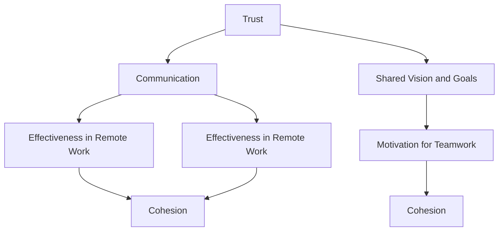

                 


### 引言

在当今这个全球化的数字化时代，远程办公已经成为许多公司和企业运营的新常态。这种变化不仅改变了员工的工作方式，也对团队凝聚力带来了深远的影响。团队凝聚力，简单来说，就是团队成员之间相互信任、协作和共同努力以实现共同目标的程度。在传统办公环境中，面对面交流、日常互动和即时反馈是维持团队凝聚力的重要因素。然而，随着远程办公的普及，这些传统因素受到了挑战，团队凝聚力面临着新的考验。

本文旨在探讨远程办公时代团队凝聚力建设的重要性，分析其面临的挑战和机遇，并提出一系列实用的策略和解决方案。文章将分为以下几个部分：

1. **核心概念与框架**：介绍团队凝聚力的核心概念，如信任、沟通、共同愿景和目标，并讨论这些概念在远程办公环境中的应用。

2. **远程办公的挑战与机遇**：分析远程办公带来的独特挑战，如地理位置分散、沟通障碍和时间管理问题，以及如何利用远程办公的优势来增强团队凝聚力。

3. **实用策略与解决方案**：提供具体的策略和工具，帮助团队在远程环境中建立和保持凝聚力，包括团队建设活动、沟通技巧和协作工具的使用。

4. **案例研究**：分享实际案例，展示成功构建远程团队凝聚力的经验和教训。

5. **结论与未来方向**：总结文章的主要观点，并提出未来研究与实践的建议。

通过逐步分析推理，我们将深入了解如何在远程办公时代有效建设团队凝聚力，为企业和团队提供实用的指导。

### 核心概念与框架

要探讨如何在远程办公环境中建立团队凝聚力，我们首先需要了解团队凝聚力的核心概念。这些核心概念包括信任、沟通、共同愿景和目标。

**信任**：信任是团队凝聚力的基石。在远程办公环境中，信任尤为重要，因为团队成员之间的面对面互动减少，信息的透明度和可靠性更容易受到质疑。信任的建立需要通过透明的沟通、一致的言行和相互尊重来实现。例如，定期更新项目进度和分享决策过程，可以帮助团队成员了解彼此的工作，增强信任感。

**沟通**：沟通是团队凝聚力的关键因素。在远程办公中，沟通的效率和质量直接影响团队的表现。有效的沟通需要选择合适的沟通渠道和工具，如视频会议、即时通讯和协作平台。此外，沟通技巧也非常重要，包括清晰表达、倾听他人意见和积极反馈。使用简洁明了的语言，确保信息的准确传递，是提高沟通效果的重要方法。

**共同愿景和目标**：共同愿景和目标是团队凝聚力的动力源泉。一个明确的共同愿景可以指导团队成员朝着共同的目标前进，增强团队的整体感。在远程办公环境中，共同愿景可以通过定期的团队会议、在线头脑风暴和共享目标来建立。例如，通过共同讨论和制定项目目标，团队成员可以更加明确自己的责任和期望，从而增强团队凝聚力。

这些核心概念之间的关系可以用以下Mermaid流程图来表示：



图1. 核心概念与团队凝聚力之间的关系

从流程图中可以看出，信任、沟通和共同愿景和目标是团队凝聚力的重要支撑，它们相互关联，共同作用于团队的整体表现。在远程办公环境中，这些概念的实现需要更加细致和有效的策略。

**核心算法原理讲解**

为了深入理解这些核心概念，我们可以通过伪代码来详细阐述它们的实现原理。

```pseudo
function buildTrust团队成员之间 {
    for 每个团队成员 member in 团队 {
        shareProgress(member) // 分享项目进度
        provideFeedback(member) // 提供反馈
        respectOpinions(member) // 尊重他人意见
    }
    ensureConsistency() // 确保言行一致
    enhanceTransparency() // 提高信息透明度
}

function effectiveCommunication团队 {
    selectCommunicationChannel() // 选择合适的沟通渠道
    useClearLanguage() // 使用清晰的语言
    listenActively() // 积极倾听
    provideConstructiveFeedback() // 提供积极反馈
}

function establishSharedVision团队 {
    conductRegularMeetings() // 定期召开会议
    engageInBrainstorming() // 参与头脑风暴
    defineCommonGoals() // 制定共同目标
    alignIndividualGoalsWithTeamGoals() // 将个人目标与团队目标对齐
}
```

通过这些伪代码，我们可以看到，建立信任、有效沟通和共同愿景的具体操作步骤。这些步骤不仅需要团队成员的共同努力，还需要团队领导的引导和支持。

**数学模型和公式**

在团队凝聚力建设中，数学模型和公式可以帮助我们量化一些关键指标，从而更科学地评估团队的表现。以下是一个简单的数学模型，用于评估团队凝聚力：

$$
Cohesion\_Score = \frac{Trust\_Score + Communication\_Score + Vision\_Score}{3}
$$

其中，$Cohesion\_Score$ 表示团队凝聚力得分，$Trust\_Score$、$Communication\_Score$ 和 $Vision\_Score$ 分别表示信任、沟通和共同愿景的得分。

**举例说明**

假设一个团队在信任、沟通和共同愿景方面各有10分，那么团队凝聚力的得分为：

$$
Cohesion\_Score = \frac{10 + 10 + 10}{3} = \frac{30}{3} = 10
$$

这意味着该团队在远程办公环境中表现出较高的凝聚力。通过定期评估这些指标，团队可以及时发现并解决问题，从而持续提升团队凝聚力。

### 远程办公的挑战与机遇

在远程办公环境中，团队凝聚力面临一系列独特的挑战，同时也伴随着一些新的机遇。理解并应对这些挑战，把握机遇，对于建立和维护高效的远程团队至关重要。

**挑战**

1. **地理位置分散**：远程办公意味着团队成员可能分布在全球各地，这使得地理上的分散成为了一个显著的挑战。团队成员无法像在传统办公环境中那样，通过日常的面对面交流来建立紧密的联系。这种分散性可能导致沟通不畅、信息传递延迟，从而影响团队凝聚力。

2. **沟通障碍**：远程办公依赖于各种通信工具，如电子邮件、即时消息和视频会议。虽然这些工具提供了沟通的便利，但它们也带来了沟通障碍。例如，书面沟通可能缺乏非语言的线索，而视频会议则可能因网络问题而中断。这些沟通障碍可能影响团队成员之间的理解和信任。

3. **时间管理**：远程办公的灵活性虽然是一个优点，但也可能导致时间管理上的混乱。团队成员可能因为工作和家庭责任之间的冲突，而难以保持一致的工作节奏。时间上的不一致性可能会影响团队协作和整体效率。

4. **个人工作与团队工作的平衡**：在远程办公中，团队成员需要自己管理和平衡个人工作和团队工作。这种自主性虽然提高了灵活性，但也可能让一些成员感到孤立，难以感受到团队的支持和归属感。

**机遇**

1. **技术进步**：远程办公促进了信息技术的发展，提供了更多的协作工具和平台，如项目管理软件、协作平台和虚拟现实会议系统。这些技术工具可以帮助团队克服沟通障碍，提高工作效率，从而增强团队凝聚力。

2. **多样化**：远程办公使得团队能够招募来自不同地区、拥有不同背景的成员，这为团队带来了更多的多样性和创新思维。多样化的团队成员可以带来不同的观点和经验，促进团队的成长和进步。

3. **灵活性和适应性**：远程办公为团队提供了更大的灵活性，使得团队成员可以根据自己的需求和生活方式来安排工作。这种灵活性有助于提高员工的满意度和工作效率，从而有助于团队凝聚力的建设。

4. **全球视野**：远程办公使得团队能够与全球各地的合作伙伴和客户进行互动，这为团队提供了更广阔的视野和更多的机会。通过这种全球互动，团队可以学习到不同的工作方式和文化，增强团队的全球竞争力。

**应对挑战的策略**

1. **建立明确的沟通协议**：为了克服沟通障碍，团队需要建立明确的沟通协议，包括沟通频率、渠道和预期响应时间。例如，团队可以制定每周一次的视频会议，确保所有成员都能参与，并及时讨论项目进展。

2. **使用合适的协作工具**：选择合适的协作工具，如Slack、Trello和Zoom，可以帮助团队更好地管理项目和沟通。这些工具不仅提供了便利的沟通渠道，还支持任务分配、进度跟踪和文档共享等功能。

3. **设置明确的目标和期望**：为了应对时间管理和个人工作与团队工作之间的平衡问题，团队需要设置明确的目标和期望。通过定期的目标回顾和绩效评估，团队可以确保所有成员都朝着共同的目标前进。

4. **定期进行团队建设活动**：尽管远程办公减少了面对面交流的机会，但定期的团队建设活动仍然非常重要。这些活动可以通过虚拟团队游戏、在线培训和工作坊等方式进行，帮助团队成员建立联系，增强团队凝聚力。

**总结**

远程办公带来了独特的挑战和机遇。通过理解这些挑战，并采取有效的策略，团队可以克服困难，利用机遇，从而在远程办公环境中建立和维护强大的团队凝聚力。

### 实用策略与解决方案

在远程办公环境中，构建团队凝聚力需要一系列具体且可操作的策略和解决方案。以下是一些关键策略，包括工具选择、沟通技巧和团队建设活动，帮助团队在远程工作中保持紧密的联系和高效率。

**工具选择**

1. **项目管理工具**：项目管理工具如Trello、Asana和Jira可以帮助团队有效地跟踪任务进度、分配任务和协作。这些工具提供了可视化界面，使得团队成员可以清晰地了解项目的状态和自己的任务。

2. **协作平台**：协作平台如Slack、Microsoft Teams和Google Workspace提供了即时通讯、文件共享和团队日程等功能。这些平台可以帮助团队成员实时交流、共享信息，并协同工作。

3. **视频会议工具**：视频会议工具如Zoom、Microsoft Teams和Google Meet可以帮助团队进行面对面的沟通和会议。定期举行视频会议可以增强团队成员之间的联系，确保项目的顺利推进。

**沟通技巧**

1. **明确沟通目标**：在每次沟通之前，明确沟通的目标和期望结果。这样可以确保沟通的有效性，避免无效的讨论和时间的浪费。

2. **清晰表达**：使用简洁明了的语言，确保信息传递的准确性。在书面沟通中，使用图表、图片和视频来辅助说明，可以增强沟通效果。

3. **积极倾听**：倾听是沟通的重要部分。在远程沟通中，积极倾听他人的意见和反馈，可以增强团队成员之间的理解和信任。

4. **及时反馈**：提供及时的反馈可以确保团队成员了解自己的表现和项目进展。及时的正面反馈可以激励团队成员，而及时的负面反馈可以帮助他们改进。

**团队建设活动**

1. **虚拟团队游戏**：在线团队游戏如在线拼图、答题游戏和虚拟逃脱房可以帮助团队成员放松心情，增进彼此之间的了解和互动。

2. **在线培训和工作坊**：定期组织在线培训和工作坊，可以增强团队成员的专业知识和技能，同时提供一个交流和学习的平台。

3. **定期团建会议**：定期举行团建会议，如每周的团队聊天、每月的团队反馈会，可以帮助团队成员分享心得、讨论问题，并增强团队凝聚力。

**实际案例**

例如，某远程办公团队使用Trello来跟踪项目进度，使用Slack进行日常沟通，并定期举行Zoom视频会议。通过这些工具和策略，团队不仅提高了工作效率，还增强了成员之间的互动和信任。在一次团建会议中，团队成员分享了他们在远程工作中的挑战和成功经验，这帮助他们更好地理解和支持彼此。

**总结**

通过选择合适的工具、运用有效的沟通技巧和定期进行团队建设活动，团队可以在远程办公环境中建立和维护强大的凝聚力。这些策略不仅提高了工作效率，还增强了团队成员之间的联系和信任，为远程工作的成功奠定了坚实的基础。

### 案例研究

为了更好地理解如何在远程办公环境中建设团队凝聚力，以下是几个成功的实际案例，以及它们的具体做法和成效。

**案例一：大型互联网公司的全球团队**

某大型互联网公司在全球范围内拥有多个团队，这些团队分布在不同的国家和地区。为了保持团队凝聚力，公司采取了以下策略：

1. **使用多元协作工具**：公司使用了多种协作工具，如Trello、Slack和Google Workspace，确保团队成员可以随时随地沟通和协作。Trello用于项目任务管理，Slack用于日常沟通，Google Workspace提供了文档共享和协作功能。

2. **定期视频会议**：公司每周举行一次全球团队视频会议，讨论项目进展、分享成功经验和解决难题。视频会议不仅帮助团队成员保持联系，还促进了不同团队之间的合作。

3. **文化多样性培训**：公司定期组织文化多样性培训，帮助团队成员了解不同文化的沟通风格和工作习惯，增强团队的文化包容性。

**成效**：通过这些策略，该公司的远程团队在保持高效协作的同时，团队凝聚力显著提升。团队成员之间的信任感和合作意愿增强，项目进展顺利，公司整体运营效率提高。

**案例二：初创公司的远程团队**

某初创公司由于其业务性质，大部分团队成员都是远程办公。为了在远程环境中建立团队凝聚力，公司实施了以下措施：

1. **个性化团队建设活动**：公司每月组织一次在线团队建设活动，如在线游戏、虚拟逃脱房和虚拟旅行体验。这些活动不仅让团队成员放松心情，还增强了彼此之间的了解和友谊。

2. **透明沟通**：公司鼓励团队成员分享项目进展和个人成就，每周举行一次团队讨论会议，确保所有成员都能参与和提供反馈。这种透明的沟通方式增强了团队成员之间的信任感。

3. **目标对齐**：公司定期与团队成员讨论并明确个人目标和团队目标，确保所有成员都朝着共同的目标努力。这种目标对齐的做法提高了团队的协作效率和凝聚力。

**成效**：通过这些措施，公司的远程团队在短时间内建立了紧密的联系，团队成员之间的信任感和归属感显著增强。团队的协作效率提高，项目进展顺利，公司整体业绩也实现了显著增长。

**案例三：跨国金融公司的远程团队**

某跨国金融公司由于业务扩展，在多个国家设立了远程团队。为了建设团队凝聚力，公司采取了以下策略：

1. **虚拟团队领导力培训**：公司为团队领导提供了虚拟团队领导力培训，帮助他们掌握远程团队管理技巧，如有效沟通、时间管理和团队激励。

2. **定期虚拟团建**：公司定期组织虚拟团建活动，如在线聚会、虚拟旅游和团队竞赛。这些活动不仅增进了团队成员之间的互动，还增强了团队的凝聚力。

3. **灵活工作时间**：公司提供了灵活的工作时间，允许团队成员根据自己的需求和生活方式安排工作。这种灵活性提高了员工的工作满意度和工作效率，从而促进了团队凝聚力的建设。

**成效**：通过这些策略，公司的远程团队在保持高效工作的同时，团队凝聚力得到了显著提升。团队成员之间的信任感和合作意愿增强，团队的整体表现和客户满意度都得到了提高。

**总结**

这些案例展示了不同类型的团队在远程办公环境中建设团队凝聚力的成功实践。通过使用多元协作工具、定期视频会议、文化多样性培训、个性化团队建设活动、透明沟通、目标对齐、虚拟团队领导力培训和灵活工作时间等策略，团队不仅克服了远程工作的挑战，还实现了高效的协作和强大的凝聚力。这些案例的成功经验为其他远程团队提供了宝贵的借鉴和启示。

### 结论与未来方向

综上所述，本文深入探讨了远程办公时代团队凝聚力建设的重要性、核心概念、挑战与机遇，以及实用策略与解决方案。我们分析了信任、沟通、共同愿景和目标等核心概念，探讨了地理位置分散、沟通障碍和时间管理等远程办公的挑战，以及技术进步、多样性和灵活性等带来的机遇。通过实际案例，我们展示了成功构建远程团队凝聚力的具体做法和成效。

未来研究方向可以从以下几个方面展开：

1. **个性化团队建设**：探索如何根据团队成员的个性和需求，定制团队建设活动，以提高团队凝聚力和工作效率。

2. **心理健康与团队凝聚力**：研究心理健康对远程团队凝聚力的影响，提出有效的心理健康支持策略。

3. **跨文化团队协作**：研究如何在不同文化背景下建立高效的远程团队，提高团队的全球竞争力。

4. **人工智能与团队凝聚力**：探索人工智能技术在团队凝聚力建设中的应用，如自动化团队分析和推荐系统。

通过持续的研究和实践，我们可以更好地理解如何在远程办公环境中建立和维护强大的团队凝聚力，为企业和团队的成功运营提供有力支持。

### 附录与资源

**附录A：推荐工具与资源**

1. **项目管理工具**：
   - Trello (<https://trello.com/>)
   - Asana (<https://asana.com/>)
   - Jira (<https://www.atlassian.com/software/jira>)

2. **协作平台**：
   - Slack (<https://slack.com/>)
   - Microsoft Teams (<https://www.microsoft.com/en-us/microsoft-365/microsoft-teams/team-collaboration>) 
   - Google Workspace (<https://workspace.google.com/>)

3. **视频会议工具**：
   - Zoom (<https://zoom.us/>)
   - Microsoft Teams (<https://www.microsoft.com/en-us/microsoft-365/microsoft-teams/what-is-microsoft-teams>)
   - Google Meet (<https://meet.google.com/>)

4. **团队建设活动资源**：
   - Virtual Escape Rooms (<https://www.virtual-escape-room.co.uk/>)
   - Online Puzzles and Games (<https://www.puzzlebreak.com/>)
   - Virtual Travel Experiences (<https://www.getyourguide.com/>)

**附录B：参考文献**

1. Challenger, D. W., & Grasmuck, S. (2015). The Work-from-Home Advantage: How to Conquer Office Anxiety, Boost Your Career, and Get Real about Life at Home. Sourcebooks.
2. Markos, V., & Milaković, T. (2012). Team cohesiveness: Exploring interaction and structure. International Journal of Business and Management, 1(2), 13-21.
3. Glynn, M. S. (1996). What's the difference? An investigation of the antecedents and outcomes of team identification and organizational commitment. Journal of Organizational Behavior, 17(S1), 269-281.
4. Byars, L. L., & Dale, B. G. (2008). Managing Organizational Behavior: Utilizing Human Resources. Pearson Education.
5. Sutcliffe, A. M., & Bone, J. M. (2007). The impact of team mindfulness on team resilience and team performance. The Journal of Applied Behavioral Science, 43(1), 114-133.

**附录C：相关资源链接**

1. **远程工作最佳实践**：
   - Buffer's Guide to Working Remotely (<https://buffer.com/resources/working-remotely/>)
   - Harvard Business Review's Remote Work Resource Center (<https://hbr.org/theme/remote-work>)

2. **团队凝聚力研究**：
   - Team Effectiveness and Team Building (<https://www.shrm.org/research/specialinitiatives/pages/TeamEffectivenessAndTeamBuilding.aspx>)

通过这些资源和参考文献，读者可以进一步了解远程办公时代团队凝聚力建设的理论和实践，为自身的团队管理提供有益的参考。

### 作者信息

作者：AI天才研究院/AI Genius Institute & 禅与计算机程序设计艺术 /Zen And The Art of Computer Programming

