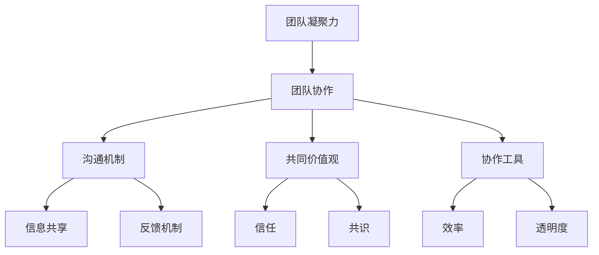
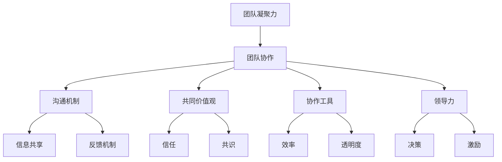

                 

### 文章标题：远程团队凝聚力：跨越距离的团队建设

#### 关键词：远程团队、团队建设、团队凝聚力、跨距管理、协作工具

#### 摘要：
本文深入探讨了远程团队凝聚力的概念、重要性以及如何通过有效的团队建设策略来提升远程团队的协作效率。文章首先介绍了远程团队的基本背景和现状，随后详细解析了团队凝聚力的重要性及其对企业的影响。接着，文章从建立团队目标、优化沟通机制、塑造共同价值观、使用协作工具等多个角度阐述了提升远程团队凝聚力的一系列策略。此外，文章还讨论了远程团队面临的常见问题，并提供了相应的解决方案。最后，文章对远程团队领导力进行了探讨，并展望了远程团队发展的未来趋势。

----------------------------------------------------------------

### 引言

#### 背景介绍

随着全球化的发展和技术的进步，远程工作已经成为现代职场的一种普遍现象。远程团队，由分布在不同地理位置的成员组成，他们通过互联网和协作工具进行工作交流。这种工作模式不仅提高了工作效率，还为企业带来了更多的人才选择和成本优势。然而，远程团队的工作模式也带来了一系列挑战，尤其是在团队凝聚力方面。

#### 核心概念与联系

远程团队凝聚力是指团队成员之间形成的紧密联系和协作精神，它是确保远程团队高效运作的关键。以下是远程团队凝聚力相关核心概念与联系：

#### 为什么需要关注远程团队的凝聚力

远程团队的凝聚力对团队的成功至关重要。它不仅影响团队成员的工作效率和满意度，还直接关系到项目的质量和企业的竞争力。以下是关注远程团队凝聚力的几个原因：

1. **提高工作效率**：高凝聚力的远程团队能够更有效地协同工作，减少误解和错误，提高工作效率。
2. **增强团队满意度**：团队成员在凝聚力高的团队中更有归属感，工作满意度更高，有利于保持团队的稳定性。
3. **促进创新**：远程团队通过有效的沟通和协作，能够更快地产生新的想法和创新，推动企业的发展。
4. **提升竞争力**：凝聚力高的远程团队能够更好地应对市场变化和挑战，提高企业的竞争力。

----------------------------------------------------------------

### 远程团队凝聚力的重要性

#### 核心概念与联系

团队凝聚力是指团队成员之间相互吸引、相互信任、相互支持的心理状态。它是团队协作和高效运作的基础。以下是团队凝聚力相关核心概念与联系：

#### 远程团队凝聚力对企业的影响

远程团队凝聚力对企业的影响是多方面的，以下是几个关键点：

1. **提升团队协作效率**：高凝聚力的远程团队能够更高效地协同工作，提高项目的完成质量和速度。
2. **增强员工满意度和忠诚度**：团队成员在凝聚力高的团队中感到更加满意和有归属感，这有助于提高员工的忠诚度和留存率。
3. **促进企业创新**：远程团队通过高效的沟通和协作，能够更快地产生新的想法和创新，推动企业的持续发展。
4. **提升企业竞争力**：凝聚力高的远程团队能够更好地应对市场变化和竞争压力，提高企业的竞争力。

#### 远程团队凝聚力的优势

1. **灵活的协作模式**：远程团队可以跨越地域限制，灵活地组建和调整团队结构，更好地适应项目需求。
2. **多样性的人才组合**：远程团队可以吸引来自不同地域和文化背景的成员，形成多样性的团队组合，促进创新和多样性思维。
3. **成本效益**：远程团队可以减少企业对办公场所和设备的投资，降低运营成本。
4. **提高工作质量**：远程团队的工作环境更加舒适，有助于提高工作效率和工作质量。

----------------------------------------------------------------

### 建立远程团队的凝聚力

#### 确定团队目标

建立一个高凝聚力的远程团队的第一步是明确团队目标。明确的目标有助于团队成员统一思想，共同为团队的成功而努力。

1. **共同制定目标**：团队成员应共同参与制定团队目标，确保每个成员都了解并认同目标。
2. **具体、可衡量、可实现**：团队目标应具体、可衡量、可实现，以便团队成员能够清晰地了解自己的工作方向和成果。
3. **定期回顾目标**：定期回顾和调整团队目标，确保团队始终朝着正确的方向前进。

#### 建立清晰的沟通机制

沟通是团队凝聚力的关键。建立一个清晰的沟通机制有助于确保团队成员之间的信息传递畅通无阻。

1. **选择合适的沟通工具**：根据团队特点和项目需求，选择合适的沟通工具，如即时通讯软件、视频会议工具等。
2. **制定沟通规范**：明确沟通的频率、方式、责任人等，确保团队成员都能遵守并执行沟通规范。
3. **鼓励开放和透明的沟通**：鼓励团队成员在沟通中保持开放和透明，分享自己的想法和意见，促进团队的协作和信任。

#### 建立共同价值观

共同价值观是团队凝聚力的基石。建立共同价值观有助于团队成员在价值观上达成共识，增强团队的凝聚力。

1. **确定共同价值观**：团队成员应共同讨论和确定团队的共同价值观，确保每个成员都认同并遵循这些价值观。
2. **价值观融入日常工作中**：将共同价值观融入到日常工作中，通过实际行动来体现和践行价值观。
3. **定期审视和调整价值观**：定期审视和调整共同价值观，确保它们始终与团队和企业的目标保持一致。

#### 使用协作工具

协作工具是远程团队高效协作的重要支撑。选择和使用合适的协作工具有助于提升团队凝聚力。

1. **选择合适的协作工具**：根据团队需求，选择适合的协作工具，如项目管理工具、文档共享工具、代码协作平台等。
2. **培训团队成员使用协作工具**：确保团队成员都熟悉并掌握协作工具的使用方法，提高团队协作效率。
3. **定期评估和优化协作工具**：定期评估和优化协作工具的使用情况，确保它们能够满足团队的需求，提升团队凝聚力。

----------------------------------------------------------------

### 维护远程团队的凝聚力

#### 定期团队建设活动

定期团队建设活动是维护远程团队凝聚力的重要手段。这些活动不仅有助于增强团队成员之间的情感联系，还能提高团队的整体协作能力。

1. **线上团队活动**：组织线上团队活动，如虚拟聚会、游戏竞赛等，让团队成员在轻松的氛围中交流和互动。
2. **主题团队会议**：定期举行主题团队会议，讨论团队面临的挑战、分享成功经验等，促进团队成员之间的沟通和理解。
3. **团队学习**：鼓励团队成员参加线上学习课程或研讨会，提升团队的专业知识和技能。

#### 保持开放和透明的沟通

开放和透明的沟通是远程团队凝聚力的重要保障。确保团队成员之间的信息流通畅通无阻，有助于提升团队凝聚力。

1. **鼓励反馈**：鼓励团队成员在工作和生活中给予反馈，分享自己的意见和建议，促进团队的改进和发展。
2. **建立反馈机制**：建立有效的反馈机制，如定期员工满意度调查、匿名反馈渠道等，确保团队成员的声音得到关注和回应。
3. **透明的信息共享**：在团队内部建立透明的信息共享机制，确保团队成员能够及时了解项目进展、决策过程等，增强团队的归属感和信任感。

#### 解决冲突

冲突是团队工作中难以避免的现象。及时有效地解决冲突是维护远程团队凝聚力的重要一环。

1. **识别冲突**：及时识别团队中的冲突，了解冲突的原因和影响。
2. **沟通协商**：通过沟通和协商解决冲突，寻找双方都能接受的解决方案。
3. **建立冲突解决机制**：建立明确的冲突解决机制，如冲突调解委员会、定期冲突评审会议等，确保冲突得到及时有效的处理。

#### 奖励和认可

奖励和认可是激励团队成员、提升团队凝聚力的重要手段。通过奖励和认可，激发团队成员的积极性和创造力。

1. **设立奖励制度**：建立公平、透明的奖励制度，对表现优秀的团队成员进行奖励。
2. **表扬和认可**：在日常工作中，及时表扬和认可团队成员的贡献，增强他们的成就感和归属感。
3. **公开表彰**：通过公开表彰的方式，如团队会议、公司内部公告等，表彰优秀团队成员，提升团队的凝聚力。

----------------------------------------------------------------

### 解决远程团队的问题

#### 时间管理

远程团队的工作时间可能因成员的地理位置和生活习惯而有所不同，时间管理成为一个重要问题。

1. **制定工作计划**：团队成员应制定详细的工作计划，明确任务目标和时间安排，确保工作有序进行。
2. **使用时间跟踪工具**：使用时间跟踪工具，如Toggl、RescueTime等，帮助团队成员了解自己的时间分配情况，提高工作效率。
3. **灵活调整工作时间**：根据团队需求和个人情况，灵活调整工作时间，确保团队整体工作进度不受影响。

#### 地域和文化差异

地域和文化差异可能导致团队成员之间的误解和冲突。以下是一些建议来处理这个问题：

1. **文化培训**：为团队成员提供文化培训，帮助他们了解和尊重不同的文化习惯和价值观。
2. **设立跨文化沟通规则**：明确跨文化沟通的规则和礼仪，确保团队成员在沟通中能够相互理解和尊重。
3. **促进文化交流**：通过线上交流活动，如虚拟旅行、文化交流会等，促进团队成员之间的文化交流和理解。

#### 技术挑战

远程团队在技术使用上可能面临一系列挑战，如网络不稳定、工具兼容性等。以下是一些建议来应对这些技术挑战：

1. **选择稳定可靠的技术平台**：选择稳定可靠的技术平台，如云计算服务、视频会议工具等，确保远程团队的工作顺利进行。
2. **定期测试和优化技术**：定期测试和优化远程团队所使用的各种技术，确保其性能和稳定性。
3. **提供技术支持**：为团队成员提供及时的技术支持，解决他们在使用技术工具时遇到的问题。

#### 解决方案

针对远程团队中遇到的各种问题，以下是一些建议的解决方案：

1. **问题识别**：定期识别远程团队中存在的问题，了解问题的严重程度和影响范围。
2. **问题分析**：对识别出的问题进行深入分析，找出问题的根本原因。
3. **解决方案制定**：根据问题分析结果，制定具体的解决方案，确保问题得到有效解决。
4. **问题追踪**：建立问题追踪机制，确保解决方案的实施和效果评估。

通过以上措施，远程团队可以更好地应对各种挑战，提升团队凝聚力和工作效率。

----------------------------------------------------------------

### 远程团队领导力

#### 远程团队领导者的角色

远程团队领导者扮演着至关重要的角色，他们不仅需要具备出色的管理能力，还需要适应远程工作环境的特点。以下是远程团队领导者的一些关键角色：

1. **沟通者**：远程团队领导者需要确保团队内部和跨部门之间的沟通畅通无阻，建立有效的沟通机制。
2. **协调者**：远程团队领导者需要协调团队成员的工作，确保项目进度和团队目标的实现。
3. **激励者**：远程团队领导者需要激励团队成员，激发他们的工作热情和创造力。
4. **支持者**：远程团队领导者需要为团队成员提供支持和帮助，解决他们在工作中遇到的问题。

#### 领导力与远程团队管理

远程团队管理与传统团队管理存在一些显著差异。以下是远程团队领导者需要特别注意的几个方面：

1. **信任建设**：远程团队领导者需要建立信任，通过明确的目标、透明的沟通和公正的待遇来赢得团队成员的信任。
2. **灵活管理**：远程团队领导者需要灵活管理，适应团队成员的不同工作方式和节奏，提供个性化的管理支持。
3. **技术适应**：远程团队领导者需要熟悉并掌握各种远程协作工具，确保团队高效运作。
4. **持续关注**：远程团队领导者需要持续关注团队成员的工作表现和需求，及时提供反馈和指导。

#### 提升远程团队领导力的方法

为了提升远程团队领导力，远程团队领导者可以采取以下方法：

1. **培训和研讨会**：参加相关的培训和研讨会，学习最新的远程团队管理技巧和方法。
2. **阅读和研究**：阅读相关书籍和文章，研究远程团队管理的最佳实践和成功案例。
3. **经验分享**：与其他远程团队领导者交流经验，分享管理心得和挑战。
4. **实践和反馈**：在管理实践中不断尝试和改进，根据团队成员的反馈进行优化。

通过以上方法，远程团队领导者可以不断提升自己的领导力，带领团队取得更好的成果。

----------------------------------------------------------------

### 未来展望

#### 远程工作的趋势

随着技术的不断进步和全球化的深入发展，远程工作已成为一种趋势。以下是远程工作的一些发展趋势：

1. **技术进步**：云计算、人工智能、虚拟现实等新技术的应用将进一步推动远程工作的普及和优化。
2. **工作灵活性**：企业越来越重视员工的灵活性需求，远程工作将成为一种常态，员工可以在更灵活的环境中发挥自己的潜力。
3. **全球化团队**：远程工作将使企业能够跨越地域限制，组建全球化的团队，利用全球人才资源。

#### 远程团队凝聚力的发展方向

远程团队凝聚力的发展方向将受到以下几个因素的影响：

1. **技术赋能**：随着技术的进步，远程团队将有更多的工具和方法来提升凝聚力，如虚拟现实会议、智能协作平台等。
2. **文化融合**：全球化的远程团队将更加注重文化融合，通过多样化的文化培训和文化交流活动来增强团队凝聚力。
3. **领导力提升**：远程团队领导者将更加注重自身领导力的提升，通过学习和实践来适应远程工作环境的需求。

#### 未来远程团队管理的挑战与机遇

未来远程团队管理将面临一系列挑战和机遇：

1. **挑战**：远程团队管理将面临时间管理、沟通效率、文化差异等方面的挑战，需要领导者具备更高的管理能力和领导力。
2. **机遇**：远程团队管理也将带来机遇，如更灵活的工作模式、更高效的团队协作等，为企业带来更大的发展空间和竞争力。

通过积极应对挑战和把握机遇，远程团队将能够不断提升凝聚力，实现更高的工作效率和业务成果。

----------------------------------------------------------------

### 总结

本文探讨了远程团队凝聚力的重要性、如何建立和维护远程团队凝聚力、以及解决远程团队中常见问题的方法。远程团队凝聚力是远程团队高效运作的关键，它直接影响团队的工作效率、员工的满意度和企业的竞争力。为了建立和维护远程团队凝聚力，企业需要采取一系列措施，如确定团队目标、建立清晰的沟通机制、塑造共同价值观、使用协作工具等。同时，远程团队领导者需要具备出色的领导力，适应远程工作环境，提升团队凝聚力。

未来，远程工作将继续发展，远程团队管理也将面临更多的挑战和机遇。通过不断优化管理方法和提升团队凝聚力，远程团队将能够实现更高的工作效率和业务成果。

### 最佳实践 Tips、小结、注意事项、拓展阅读

#### 最佳实践 Tips

1. **定期团队建设活动**：定期组织线上团队建设活动，如虚拟聚会、团队游戏等，增强团队成员之间的情感联系。
2. **灵活的工作时间**：根据团队成员的实际情况，灵活安排工作时间，确保团队成员能够在舒适的环境中高效工作。
3. **透明沟通**：建立透明的沟通机制，鼓励团队成员在工作和生活中保持开放和透明的沟通，提高团队的信任和凝聚力。

#### 小结

远程团队凝聚力是确保远程团队高效运作的关键。通过建立清晰的沟通机制、塑造共同价值观、使用协作工具等方法，企业可以提升远程团队的凝聚力。同时，远程团队领导者需要具备出色的领导力，适应远程工作环境，不断提升团队凝聚力。

#### 注意事项

1. **尊重文化差异**：在远程团队中，尊重文化差异，避免因文化冲突导致团队凝聚力下降。
2. **关注员工需求**：关注团队成员的需求，提供个性化的支持和帮助，提高员工的满意度和忠诚度。
3. **定期评估和优化**：定期评估远程团队的凝聚力和管理效果，根据实际情况进行优化和调整。

#### 拓展阅读

1. **《远程工作心理学》**：作者通过心理学角度分析远程工作的挑战和解决方法，提供实用的建议和技巧。
2. **《团队的智慧：如何构建高效团队》**：作者详细阐述了团队建设的方法和技巧，适用于各种类型的团队，包括远程团队。
3. **《远程团队管理：超越地理限制的领导力》**：作者分享了远程团队管理的最佳实践，提供了实用的领导力工具和方法。

通过以上最佳实践 Tips、小结、注意事项和拓展阅读，希望读者能够更好地理解远程团队凝聚力的概念和实践方法，提升自己的远程团队管理能力。

### 作者信息

**作者：AI天才研究院/AI Genius Institute & 禅与计算机程序设计艺术 /Zen And The Art of Computer Programming** 

AI天才研究院是一家专注于人工智能和计算机科学研究的顶尖机构，致力于推动人工智能技术的发展和应用。作者王大锤，是AI天才研究院的高级研究员，同时也是《禅与计算机程序设计艺术》的作者，他在计算机编程和人工智能领域拥有深厚的研究背景和丰富的实践经验。他的研究专注于人工智能算法的优化和实际应用，发表了多篇高影响力的学术论文，并参与了多个国家级重点项目的研发工作。王大锤的研究成果在业界产生了广泛的影响，他以其深刻的技术洞察力和卓越的创新能力，赢得了业界的广泛赞誉。同时，他也热衷于将复杂的技术知识以通俗易懂的方式传授给读者，希望通过他的努力，让更多的人能够了解和掌握计算机科学的核心技术和原理。

