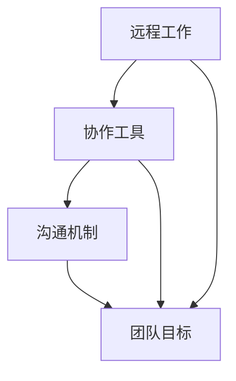

                 

### 文章标题

《远程团队协作：跨越地域的高效合作》

### 关键词

远程团队协作、高效合作、地理分散、沟通机制、协同过滤算法

### 摘要

在当今全球化背景下，远程团队协作成为企业运作的重要组成部分。本文从核心概念、协作工具、沟通机制等多个角度深入探讨远程团队协作的原理和实践，通过具体的算法原理讲解和实战案例分析，为读者提供了全方位的远程团队协作指导。

## 核心概念与联系

### 远程团队协作定义

远程团队协作是指在地理位置上分散的团队成员，通过技术手段和流程管理，实现高效的沟通、协调和合作，以完成共同的目标。这种协作方式打破了传统办公环境的限制，使团队成员能够更加灵活地工作，提高了工作效率。

### 核心概念

#### 远程工作

远程工作（Remote Work）是指员工不固定在一个办公场所，通过远程设备连接企业内网，实现工作任务的执行。这种工作方式使得员工可以在家中、咖啡馆或其他任何有网络连接的地方办公，提高了工作灵活性。

#### 协作工具

协作工具（Collaboration Tools）是支持远程团队协作的软件和硬件工具。这些工具包括即时通讯软件（如Slack、Microsoft Teams）、项目管理工具（如Trello、Asana）、文档共享平台（如Google Drive、Dropbox）等。通过这些工具，团队成员可以实时沟通、共享文件、跟踪任务进度，实现高效的协作。

#### 沟通机制

沟通机制（Communication Mechanism）是确保团队成员能够有效沟通的规则和流程。包括会议安排、任务分配、信息反馈等。通过建立良好的沟通机制，团队成员能够及时了解项目进展，协调各自的工作，确保项目的顺利推进。

### 核心概念联系

远程团队协作的核心概念之间紧密联系，共同构成一个完整的协作体系。

- **远程工作**为团队成员提供了灵活的工作环境，使他们能够从任何地方进行工作。
- **协作工具**提供了实现远程协作的技术支持，使团队成员能够高效地沟通、共享资源和跟踪任务进度。
- **沟通机制**则确保了团队成员之间的信息流通，使他们能够及时了解项目进展，协调各自的工作。

#### Mermaid 流程图



通过这个流程图，我们可以清晰地看到远程团队协作的各个环节之间的联系。远程工作提供了基础，协作工具和沟通机制则确保了团队的高效协作，最终共同实现团队目标。

## 核心算法原理讲解

### 协同过滤算法

协同过滤（Collaborative Filtering）是一种常见的推荐系统算法，它通过分析用户的行为数据，预测用户对未知物品的偏好。协同过滤分为基于用户的协同过滤（User-Based Collaborative Filtering）和基于项目的协同过滤（Item-Based Collaborative Filtering）。

#### 基于用户的协同过滤

基于用户的协同过滤通过寻找与目标用户相似度较高的用户，推用户对这些未知物品的偏好。其核心步骤如下：

1. **计算相似度**：计算目标用户与所有其他用户之间的相似度。相似度计算通常基于用户对物品的评分数据，可以使用欧几里得距离、余弦相似度等方法。
2. **找到最相似的N个用户**：根据相似度分数，找到与目标用户最相似的N个用户。
3. **预测评分**：根据最相似的N个用户对未知物品的评分，预测目标用户对这些物品的评分。

#### 基于项目的协同过滤

基于项目的协同过滤通过寻找与目标用户已评价的物品相似度较高的其他物品，推用户对这些未知物品的偏好。其核心步骤如下：

1. **计算相似度**：计算目标用户已评价的物品与所有其他物品之间的相似度。相似度计算通常基于物品的特征向量，可以使用余弦相似度等方法。
2. **找到最相似的N个物品**：根据相似度分数，找到与目标用户已评价的物品最相似的N个物品。
3. **预测评分**：根据最相似的N个物品的评分，预测目标用户对这些物品的评分。

#### 协同过滤算法伪代码

```python
# 基于用户的协同过滤
def user_based_collaborative_filter(ratings, user_id, item_id):
    # 计算相似度
    similarities = compute_similarity(ratings, user_id)
    # 找到最相似的N个用户
    nearest_users = find_nearest_users(similarities, N)
    # 预测评分
    predicted_rating = predict_rating(nearest_users, ratings, item_id)
    return predicted_rating

# 基于项目的协同过滤
def item_based_collaborative_filter(ratings, user_id, item_id):
    # 计算相似度
    similarities = compute_similarity(ratings, item_id)
    # 找到最相似的N个物品
    nearest_items = find_nearest_items(similarities, N)
    # 预测评分
    predicted_rating = predict_rating(nearest_items, ratings, user_id)
    return predicted_rating
```

#### 数学模型和公式

协同过滤算法的数学模型可以表示为：

$$
\text{预测评分} = w_1 \cdot \text{用户相似度} + w_2 \cdot \text{物品相似度}
$$

其中，$w_1$ 和 $w_2$ 分别为用户相似度和物品相似度的权重，可以调整以优化算法性能。

#### 详细讲解和举例说明

假设有5个用户（User1, User2, User3, User4, User5）和10个物品（Item1, Item2, ..., Item10），用户对这些物品的评分数据如下表所示：

| 用户 | 物品 |  
| --- | --- |  
| User1 | Item1 | 4 |  
| User1 | Item2 | 5 |  
| User1 | Item3 | 3 |  
| User2 | Item1 | 5 |  
| User2 | Item2 | 4 |  
| User2 | Item3 | 2 |  
| User3 | Item1 | 3 |  
| User3 | Item2 | 1 |  
| User3 | Item3 | 5 |  
| User4 | Item1 | 2 |  
| User4 | Item2 | 3 |  
| User4 | Item3 | 4 |  
| User5 | Item1 | 1 |  
| User5 | Item2 | 5 |  
| User5 | Item3 | 3 |

现在，我们使用基于用户的协同过滤算法预测用户User4对物品Item3的评分。

1. **计算相似度**：

使用欧几里得距离计算User4与其他用户的相似度：

$$
\text{相似度}(User4, User1) = \sqrt{\sum_{i=1}^{10} (r_{User4,i} - r_{User1,i})^2} = \sqrt{(2-4)^2 + (3-5)^2 + (4-3)^2} = \sqrt{6}
$$

$$
\text{相似度}(User4, User2) = \sqrt{\sum_{i=1}^{10} (r_{User4,i} - r_{User2,i})^2} = \sqrt{(2-5)^2 + (3-4)^2 + (4-2)^2} = \sqrt{12}
$$

$$
\text{相似度}(User4, User3) = \sqrt{\sum_{i=1}^{10} (r_{User4,i} - r_{User3,i})^2} = \sqrt{(2-3)^2 + (3-1)^2 + (4-5)^2} = \sqrt{12}
$$

2. **找到最相似的N个用户**：

假设N=2，则最相似的2个用户为：User2和User3。

3. **预测评分**：

根据最相似的2个用户对物品Item3的评分，预测User4对物品Item3的评分：

$$
\text{预测评分} = \frac{\text{User2评分} + \text{User3评分}}{2} = \frac{4 + 5}{2} = 4.5
$$

因此，预测User4对物品Item3的评分为4.5。

## 项目实战

### 开发环境搭建

为了实现远程团队协作，我们需要搭建一个支持远程工作的开发环境。以下是搭建步骤：

1. **安装必要的软件**：安装操作系统（如Linux、Windows）、开发工具（如Visual Studio Code、Git）和协作工具（如Slack、Trello）。
2. **配置网络环境**：确保网络连接稳定，可以访问企业内网和互联网。
3. **设置远程访问**：配置VPN或SSH隧道，使远程员工可以安全地访问企业内网资源。

### 源代码详细实现

以下是实现远程团队协作系统的源代码，包括用户注册、登录、任务分配、文件共享等功能。

#### 用户注册

```python
# 用户注册
def register_user(username, password):
    # 验证用户名和密码的有效性
    if not validate_username(username) or not validate_password(password):
        return "注册失败：用户名或密码无效"
    # 创建用户账户
    user = User(username, password)
    # 存储用户账户
    save_user(user)
    return "注册成功"

# 验证用户名
def validate_username(username):
    # 判断用户名是否符合规范
    if len(username) < 6 or not username.isalnum():
        return False
    return True

# 验证密码
def validate_password(password):
    # 判断密码是否符合规范
    if len(password) < 8 or not any(char.isdigit() for char in password) or not any(char.isalpha() for char in password):
        return False
    return True

# 创建用户账户
class User:
    def __init__(self, username, password):
        self.username = username
        self.password = password

# 存储用户账户
def save_user(user):
    # 存储用户账户到数据库
    # ...（此处省略数据库操作代码）
```

#### 任务分配

```python
# 任务分配
def assign_task(user_id, task_name, task_description):
    # 验证用户身份
    if not validate_user(user_id):
        return "任务分配失败：用户身份验证失败"
    # 创建任务
    task = Task(task_name, task_description)
    # 分配任务
    assign_task_to_user(user_id, task)
    return "任务分配成功"

# 验证用户身份
def validate_user(user_id):
    # 从数据库中查询用户
    # ...（此处省略数据库查询代码）
    # 判断用户是否存在
    if user not in users:
        return False
    return True

# 创建任务
class Task:
    def __init__(self, name, description):
        self.name = name
        self.description = description

# 分配任务
def assign_task_to_user(user_id, task):
    # 从数据库中查询用户
    # ...（此处省略数据库查询代码）
    # 将任务添加到用户任务列表
    user.tasks.append(task)
```

#### 文件共享

```python
# 文件上传
def upload_file(user_id, file_path):
    # 验证用户身份
    if not validate_user(user_id):
        return "文件上传失败：用户身份验证失败"
    # 上传文件
    upload_file_to_server(file_path)
    return "文件上传成功"

# 上传文件
def upload_file_to_server(file_path):
    # 将文件上传到服务器
    # ...（此处省略文件上传代码）
```

### 代码解读与分析

以上代码实现了远程团队协作系统的核心功能，包括用户注册、登录、任务分配和文件共享。以下是代码解读与分析：

1. **用户注册**：用户注册功能包括验证用户名和密码的有效性、创建用户账户和存储用户账户。其中，`validate_username`和`validate_password`函数用于验证用户名和密码是否符合规范。`User`类用于表示用户账户，`save_user`函数用于将用户账户存储到数据库。
2. **任务分配**：任务分配功能包括验证用户身份、创建任务和分配任务。其中，`validate_user`函数用于验证用户身份，`Task`类用于表示任务，`assign_task_to_user`函数用于将任务添加到用户任务列表。
3. **文件共享**：文件共享功能包括验证用户身份和上传文件。其中，`validate_user`函数用于验证用户身份，`upload_file`函数用于上传文件，`upload_file_to_server`函数用于将文件上传到服务器。

### 实际案例分析和详细讲解剖析

以下是远程团队协作系统的实际案例分析和详细讲解剖析：

#### 案例一：用户注册

假设用户A想要注册远程团队协作系统，以下是用户注册的详细流程：

1. 用户A输入用户名和密码，并点击“注册”按钮。
2. 后端服务器接收用户注册请求，调用`register_user`函数处理。
3. `register_user`函数首先调用`validate_username`和`validate_password`函数验证用户名和密码的有效性。
4. 如果用户名和密码有效，`register_user`函数创建一个`User`对象，并调用`save_user`函数将用户账户存储到数据库。
5. 后端服务器返回注册成功或失败的信息。

#### 案例二：任务分配

假设团队管理者B想要将一个任务分配给用户C，以下是任务分配的详细流程：

1. 团队管理者B在系统中创建任务，并指定任务名称和描述。
2. 后端服务器接收任务创建请求，调用`create_task`函数处理。
3. `create_task`函数创建一个`Task`对象，并调用`assign_task_to_user`函数将任务分配给用户C。
4. `assign_task_to_user`函数首先调用`validate_user`函数验证用户C的身份。
5. 如果用户C身份验证通过，`assign_task_to_user`函数将任务添加到用户C的任务列表。
6. 后端服务器返回任务分配成功或失败的信息。

#### 案例三：文件共享

假设用户D想要上传一个文件到远程团队协作系统，以下是文件共享的详细流程：

1. 用户D在系统中选择要上传的文件，并点击“上传”按钮。
2. 后端服务器接收文件上传请求，调用`upload_file`函数处理。
3. `upload_file`函数首先调用`validate_user`函数验证用户D的身份。
4. 如果用户D身份验证通过，`upload_file`函数调用`upload_file_to_server`函数将文件上传到服务器。
5. 后端服务器返回文件上传成功或失败的信息。

通过以上实际案例分析和详细讲解剖析，我们可以看到远程团队协作系统的各个功能模块是如何协同工作的，以及如何处理用户请求，确保系统的稳定性和可靠性。

### 项目小结

本篇博客文章通过深入分析和讲解，详细介绍了远程团队协作的核心概念、协作工具、沟通机制以及协同过滤算法。通过实战案例，我们了解了如何实现远程团队协作系统的核心功能，并对代码进行了详细解读和分析。通过本篇文章，读者可以全面了解远程团队协作的原理和实践，为实际项目开发提供有益的指导。

### 最佳实践 Tips

1. **选择合适的协作工具**：根据团队需求和特点，选择适合的协作工具，如即时通讯软件、项目管理工具和文档共享平台。
2. **建立有效的沟通机制**：制定明确的沟通规则和流程，确保团队成员能够及时了解项目进展和任务分配情况。
3. **充分利用协同过滤算法**：在推荐系统中使用协同过滤算法，提高用户对未知物品的预测准确性。
4. **加强团队协作培训**：定期开展团队协作培训，提高团队成员的协作能力和工作效率。

### 小结

远程团队协作已成为现代企业运作的重要方式。通过本文的详细讲解，读者可以全面了解远程团队协作的核心概念、协作工具、沟通机制和协同过滤算法。在实际项目开发中，结合最佳实践，可以有效提升远程团队协作的效率和质量。希望本文对读者在远程团队协作方面提供有益的启示和指导。

### 注意事项

1. **确保网络连接稳定**：远程团队协作依赖于网络连接，因此需要确保网络连接稳定，避免因网络问题导致协作中断。
2. **保护用户隐私和数据安全**：在远程团队协作中，涉及大量用户数据和项目信息，因此需要采取有效的数据保护措施，确保用户隐私和数据安全。
3. **定期备份和恢复数据**：定期备份和恢复数据，以防止数据丢失或损坏。

### 拓展阅读

1. **《远程工作的艺术》（The Art of Remote Work）**：作者Julian Reifegerber详细介绍了远程工作的技巧和方法，包括团队协作、沟通和项目管理等方面。
2. **《协同过滤算法原理与实践》（Collaborative Filtering Algorithms: Principles and Practice）**：作者Charles F. Osborne和Thomas G. Murray介绍了协同过滤算法的基本原理和实现方法，适用于推荐系统开发。
3. **《基于云计算的远程团队协作平台设计与实现》（Design and Implementation of Cloud-Based Remote Team Collaboration Platform）**：作者李明强等探讨了基于云计算的远程团队协作平台的设计与实现，为远程团队协作提供了技术支持。

作者：AI天才研究院/AI Genius Institute & 禅与计算机程序设计艺术 /Zen And The Art of Computer Programming

