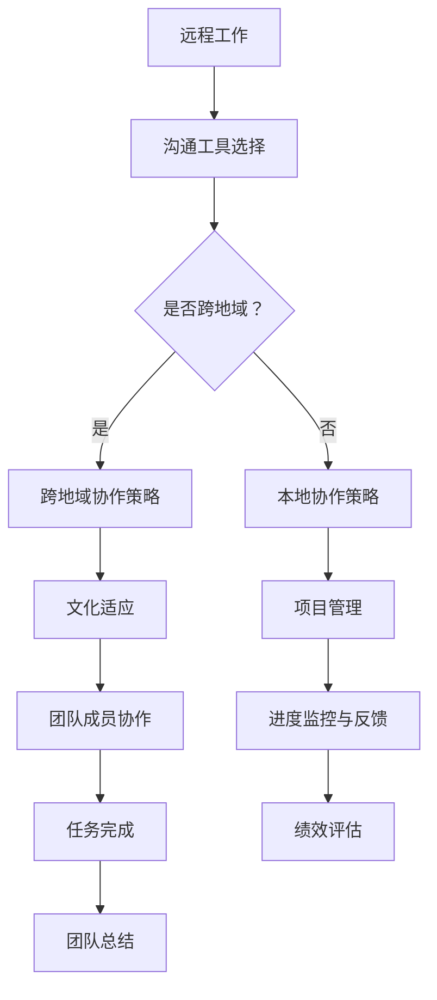
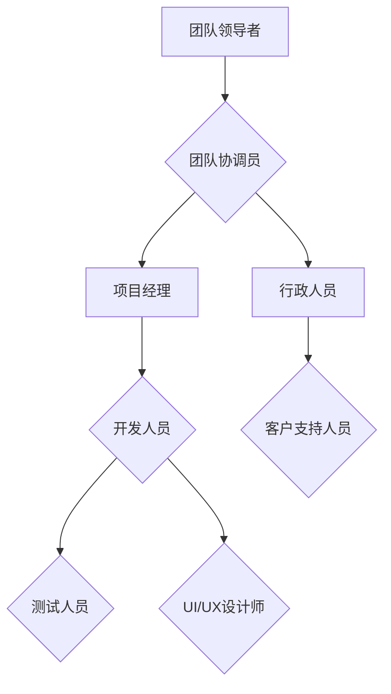
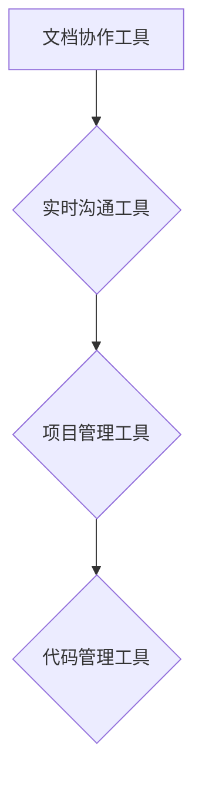
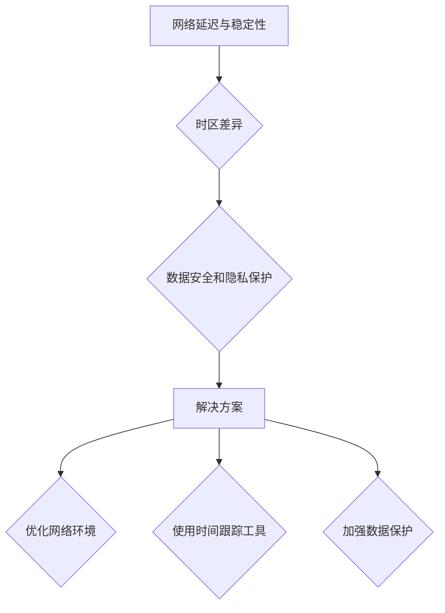
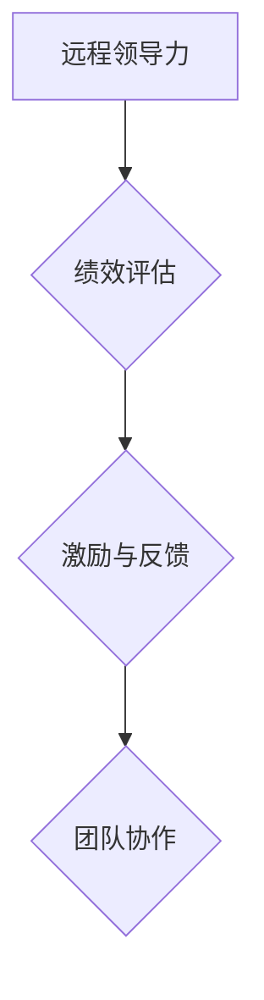
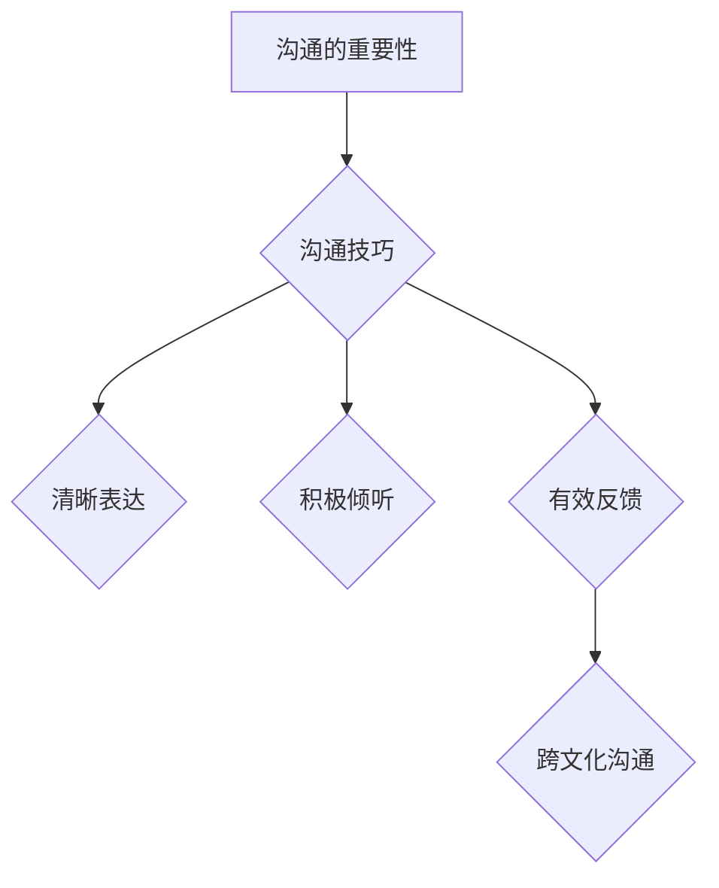
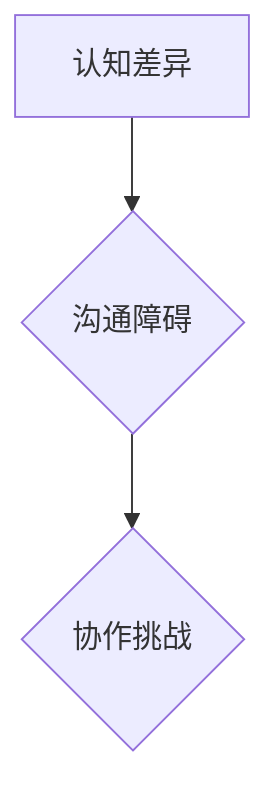
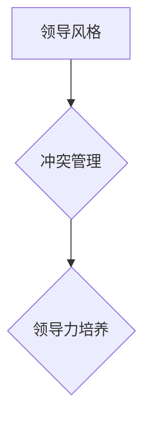

                 


### 文章标题

# 《远程团队协同：跨地域合作的最佳实践》

### 文章关键词

- 远程团队协同
- 跨地域合作
- 技术工具
- 管理和沟通策略
- 跨文化合作
- 项目实战

### 文章摘要

随着全球化的不断深入，远程团队协同成为现代企业的一项必备技能。本文将详细介绍远程团队协同的重要性、技术工具、管理和沟通策略、跨文化合作以及项目实战和案例分析，旨在为跨地域合作提供最佳实践指导。

## 目录大纲

### 第一部分：远程团队协同概述

#### 第1章：远程团队协同的重要性  
#### 第2章：远程团队的组织架构

### 第二部分：技术工具的介绍

#### 第3章：远程协同工作的工具  
#### 第4章：远程团队的技术挑战与解决方案

### 第三部分：管理和沟通策略

#### 第5章：远程团队管理  
#### 第6章：沟通策略

### 第四部分：跨文化合作

#### 第7章：跨文化团队的特点  
#### 第8章：跨文化团队的领导力

### 第五部分：项目实战和案例分析

#### 第9章：远程团队协同实战案例  
#### 第10章：远程团队协同最佳实践

### 具体内容

#### 第1章：远程团队协同的重要性

随着科技的进步，远程工作已成为一种趋势。远程团队协同的重要性体现在以下几个方面：

- **提高工作效率**：远程团队可以避免交通和时间成本，更专注于工作本身。
- **人才多样化**：跨地域合作可以吸引更多优秀人才，提高团队的整体能力。
- **灵活的工作环境**：远程工作提供了更加灵活的工作环境，有助于提高员工的工作满意度和忠诚度。

#### 第2章：远程团队的组织架构

远程团队的组织架构与传统团队有所不同。以下是一些关键点：

- **扁平化管理**：远程团队更倾向于扁平化的管理结构，以减少信息传递的层次。
- **明确的职责分工**：每个团队成员都应该清楚自己的职责和任务。
- **灵活的工作时间**：远程团队需要适应不同的时区，制定合理的工作时间安排。

### 第二部分：技术工具的介绍

#### 第3章：远程协同工作的工具

远程团队协同离不开一系列的技术工具。以下是一些常用的工具：

- **文档协作工具**：如Google Docs、Notion等，可以实时编辑和协作。
- **实时沟通工具**：如Slack、Microsoft Teams等，可以快速交流信息。
- **项目管理工具**：如Trello、Jira等，可以帮助团队更好地管理项目进度。
- **代码管理工具**：如Git、GitHub等，可以有效地管理代码版本和协作开发。

#### 第4章：远程团队的技术挑战与解决方案

远程团队可能会面临以下技术挑战：

- **网络延迟与稳定性**：解决方案包括使用VPN、优化网络环境等。
- **时区差异与工作协调**：解决方案包括使用时间跟踪工具、制定协调工作时间表等。
- **数据安全和隐私保护**：解决方案包括使用加密通信、数据备份等。

### 第三部分：管理和沟通策略

#### 第5章：远程团队管理

远程团队管理需要注意以下几点：

- **领导力**：远程团队领导者需要具备更强的沟通能力和决策能力。
- **绩效评估**：远程团队的绩效评估需要更加客观和量化。
- **激励与反馈**：远程团队需要适当的激励和反馈机制，以保持员工的工作动力。

#### 第6章：沟通策略

远程团队的沟通策略需要考虑以下几点：

- **沟通频率**：远程团队需要保持高频沟通，以减少信息传递的误差。
- **沟通渠道**：选择合适的沟通渠道，如邮件、即时通讯工具、视频会议等。
- **沟通技巧**：远程团队需要掌握有效的沟通技巧，如清晰表达、积极倾听等。

### 第四部分：跨文化合作

#### 第7章：跨文化团队的特点

跨文化团队具有以下特点：

- **认知差异**：团队成员来自不同的文化背景，存在认知上的差异。
- **沟通障碍**：跨文化团队在沟通中可能面临语言、习惯等方面的障碍。
- **协作挑战**：跨文化团队需要克服文化差异，实现有效协作。

#### 第8章：跨文化团队的领导力

跨文化团队的领导力需要注意以下几点：

- **文化敏感度**：领导者需要具备文化敏感度，尊重并理解不同文化的特点。
- **冲突管理**：领导者需要学会如何处理跨文化团队中的冲突。
- **领导风格**：领导者需要根据团队的文化背景，选择合适的领导风格。

### 第五部分：项目实战和案例分析

#### 第9章：远程团队协同实战案例

通过实际案例，我们可以了解远程团队协同的具体实践方法。以下是一些案例：

- **跨地域软件开发项目**：介绍如何通过远程团队协同完成软件开发。
- **国际市场营销团队的协作**：探讨如何在一个跨文化环境中实现有效协作。
- **远程敏捷开发实践**：分析如何在一个远程团队中实施敏捷开发。

#### 第10章：远程团队协同最佳实践

在总结远程团队协同的实战经验后，我们可以提炼出一些最佳实践：

- **建立清晰的沟通机制**：确保团队成员之间有良好的沟通渠道和沟通方式。
- **制定明确的目标和计划**：确保团队成员对项目目标和进度有清晰的认识。
- **保持文化的包容性**：尊重并包容团队成员的文化差异，促进团队和谐。

### 总结

远程团队协同是现代企业的一项重要技能。通过本文的介绍，我们了解了远程团队协同的重要性、技术工具、管理和沟通策略、跨文化合作以及项目实战和案例分析。希望本文能为跨地域合作提供有益的指导。

---

以上是一个初步的框架和内容概述，接下来我们将逐步完善每个章节的具体内容，包括核心概念与联系、核心算法原理、数学模型和公式、项目实战和案例分析等。

---

### 第1章：远程团队协同的重要性

#### 背景介绍

随着互联网技术的飞速发展和全球化的深入，远程工作已经成为企业运营的重要组成部分。远程团队协同不仅使得企业能够跨越地域限制，吸引全球范围内的优秀人才，同时也为员工提供了更加灵活的工作环境。然而，远程团队协同也面临着一系列独特的挑战，如沟通效率、项目管理、文化差异等。

#### 核心概念与联系

远程团队协同涉及以下几个核心概念：

1. **远程工作**：指的是通过互联网进行工作，不依赖于物理办公室。
2. **协同工作**：指的是团队成员通过工具和策略实现高效合作。
3. **跨地域合作**：指的是团队成员分布在不同的地理位置，需要通过技术手段实现协作。

这些概念之间相互联系，共同构成了远程团队协同的基础。

#### Mermaid 流程图

以下是一个简单的Mermaid流程图，展示远程团队协同的流程：



#### 核心算法原理讲解

在远程团队协同中，核心算法原理主要涉及以下几个方面：

1. **通信协议优化**：通过优化通信协议，降低网络延迟和丢包率，提高通信质量。
2. **项目管理算法**：如Gantt图算法，用于项目进度的规划和监控。
3. **协作算法**：如并发控制算法，确保多个团队成员同时编辑文档时的数据一致性。

以下是一个简化的伪代码示例，展示通信协议优化的原理：

```python
def optimize_communication(communicationProtocol):
    if communicationProtocol == "TCP":
        # 使用TCP协议优化
        adjust_window_size()
        reduce_delay()
    elif communicationProtocol == "UDP":
        # 使用UDP协议优化
        increase_packet_size()
        implement_error_correction()
    return optimizedProtocol
```

#### 数学模型和公式

远程团队协同中，数学模型和公式用于优化和评估团队的工作效率和协作效果。以下是一个简单的例子：

- **工作效率公式**：

  $$ E = \frac{P \times T}{D} $$

  其中，E表示工作效率，P表示团队成员的总工作量，T表示工作时间，D表示干扰因素（如网络延迟、沟通障碍等）。

- **协作效果公式**：

  $$ C = \frac{P_1 + P_2 + ... + P_n}{n} $$

  其中，C表示团队协作效果，$P_1, P_2, ..., P_n$分别表示每个团队成员的工作效率，n表示团队成员总数。

#### 详细讲解和举例说明

以工作效率公式为例，我们可以通过以下步骤来详细讲解和举例说明：

1. **定义变量**：设定P为100个任务，T为10天，D为5天的干扰因素。
2. **计算工作效率**：使用公式计算E的值：

   $$ E = \frac{100 \times 10}{10 + 5} = \frac{1000}{15} \approx 66.67 $$

   因此，工作效率约为66.67个任务/天。

3. **分析结果**：通过分析计算结果，可以发现工作效率受到干扰因素的影响。优化干扰因素（如提高网络稳定性、改善沟通机制）可以提升工作效率。

#### 项目实战

假设一个远程软件开发团队需要在一个季度内完成一个大型项目。以下是一个简化的项目实战步骤：

1. **需求分析**：团队成员在远程会议上讨论项目需求，明确项目目标和功能模块。
2. **任务分配**：根据团队成员的技能和项目需求，将任务分配给合适的成员。
3. **实时沟通**：使用即时通讯工具和视频会议软件，保持团队成员之间的实时沟通。
4. **代码协作**：使用Git和GitHub进行代码管理和协作，确保代码的一致性和版本控制。
5. **进度监控**：使用项目管理工具，如Jira，监控项目的进度和任务的完成情况。
6. **质量保障**：通过代码审查和测试，确保项目的质量和稳定性。
7. **项目交付**：在项目完成后，进行验收和交付。

#### 代码解读与分析

以下是一个简化的代码片段，展示如何使用Git进行代码协作：

```python
# 初始化Git仓库
git init

# 添加文件到暂存区
git add README.md

# 提交变更
git commit -m "Initial commit"

# � Push代码到GitHub远程仓库
git remote add origin https://github.com/username/repository.git
git push -u origin master
```

这段代码用于初始化一个Git仓库，添加文件到暂存区，提交变更，并将代码推送到GitHub远程仓库。通过这种方式，团队成员可以共享代码，进行协作开发。

#### 实际案例分析和详细讲解剖析

以一个真实的远程软件开发项目为例，分析项目中的挑战和解决方案：

- **挑战**：团队成员分布在不同的国家，时区差异导致沟通不畅。
- **解决方案**：制定每周的远程会议时间表，确保团队成员在合适的时间参与会议。同时，使用即时通讯工具保持日常沟通。

#### 项目小结

通过项目实战和案例分析，我们可以总结出以下关键点：

- **清晰的需求分析和任务分配**：确保团队成员对项目有明确的理解和目标。
- **高效的沟通和协作工具**：提高团队的工作效率和协作效果。
- **严格的质量保障**：确保项目的质量和稳定性。

### 最佳实践 tips

- **制定明确的沟通计划**：确保团队成员之间的信息传递畅通无阻。
- **定期进行团队评估**：了解团队的工作效率和协作效果，及时调整策略。
- **培养跨文化意识**：尊重并包容团队成员的文化差异，促进团队的和谐。

### 小结

远程团队协同在现代企业中具有重要意义。通过本文的介绍，我们了解了远程团队协同的核心概念、技术工具、管理和沟通策略、跨文化合作以及项目实战和案例分析。希望这些内容能为企业的远程团队协同提供有益的指导。

### 注意事项

- **确保网络稳定性**：稳定的网络连接是远程团队协同的基础。
- **关注团队成员的心理健康**：远程工作可能对成员的社交和心理健康产生影响，需要给予关注和支持。

### 拓展阅读

- 《远程工作实践指南》
- 《敏捷开发实践指南》
- 《跨文化沟通技巧》

---

以上是第1章《远程团队协同的重要性》的具体内容。接下来，我们将继续探讨远程团队的组织架构、技术工具的介绍、管理和沟通策略、跨文化合作以及项目实战和案例分析等主题。敬请期待。作者：AI天才研究院/AI Genius Institute & 禅与计算机程序设计艺术 /Zen And The Art of Computer Programming。

---

### 第2章：远程团队的组织架构

#### 背景介绍

在远程团队协同中，组织架构是确保团队高效运作的基础。与传统的面对面团队不同，远程团队需要通过特定的架构来协调成员之间的工作。本章节将详细介绍远程团队的组织架构，包括层级结构、角色与职责以及组织文化等方面。

#### 核心概念与联系

远程团队的组织架构涉及以下几个核心概念：

1. **层级结构**：远程团队的层级结构通常较为扁平，以减少信息传递的层级。
2. **角色与职责**：每个团队成员都有明确的角色和职责，以确保团队目标的实现。
3. **组织文化**：远程团队需要建立一种适合远程工作的组织文化，以促进团队成员的协作和成长。

这些概念相互联系，共同构成了远程团队的组织架构。

#### Mermaid 流程图

以下是一个简单的Mermaid流程图，展示远程团队的组织架构：



#### 核心算法原理讲解

在远程团队的组织架构中，核心算法原理主要涉及以下几个方面：

1. **任务分配算法**：根据团队成员的技能和项目需求，将任务合理地分配给每个成员。
2. **角色协调算法**：确保每个团队成员都清楚自己的职责，并与其他成员协调合作。
3. **文化适应算法**：尊重并适应不同团队成员的文化背景，促进团队的和谐。

以下是一个简化的伪代码示例，展示任务分配算法：

```python
def assign_tasks(employees, tasks):
    for task in tasks:
        best_fit = find_best_fit_employee(employees, task)
        assign_task_to_employee(best_fit, task)
    return assigned_tasks
```

#### 数学模型和公式

远程团队的组织架构中，数学模型和公式用于评估团队的工作效率和协作效果。以下是一个简单的例子：

- **工作效率评估公式**：

  $$ E = \frac{P}{T \times D} $$

  其中，E表示工作效率，P表示完成的工作量，T表示工作时间，D表示干扰因素（如网络延迟、沟通障碍等）。

- **团队协作评估公式**：

  $$ C = \frac{E_1 + E_2 + ... + E_n}{n} $$

  其中，C表示团队协作效果，$E_1, E_2, ..., E_n$分别表示每个团队成员的工作效率，n表示团队成员总数。

#### 详细讲解和举例说明

以工作效率评估公式为例，我们可以通过以下步骤来详细讲解和举例说明：

1. **定义变量**：设定P为100个任务，T为10天，D为5天的干扰因素。
2. **计算工作效率**：使用公式计算E的值：

   $$ E = \frac{100}{10 \times 5} = 2 $$

   因此，工作效率为2个任务/天。

3. **分析结果**：通过分析计算结果，可以发现工作效率受到干扰因素的影响。优化干扰因素（如提高网络稳定性、改善沟通机制）可以提升工作效率。

#### 项目实战

假设一个远程软件开发团队需要在一个季度内完成一个大型项目。以下是一个简化的项目实战步骤：

1. **组织架构搭建**：根据项目需求和团队成员的技能，搭建合适的组织架构。
2. **任务分配**：使用任务分配算法，将任务合理地分配给每个团队成员。
3. **角色协调**：确保每个团队成员都清楚自己的职责，并与其他成员协调合作。
4. **实时沟通**：使用即时通讯工具和视频会议软件，保持团队成员之间的实时沟通。
5. **进度监控**：使用项目管理工具，如Jira，监控项目的进度和任务的完成情况。
6. **质量保障**：通过代码审查和测试，确保项目的质量和稳定性。
7. **项目交付**：在项目完成后，进行验收和交付。

#### 代码解读与分析

以下是一个简化的代码片段，展示如何使用Git进行组织架构的搭建：

```python
# 初始化Git仓库
git init

# 添加项目成员到远程仓库
git remote add origin https://github.com/username/repository.git
git push -u origin master

# 添加开发人员到Git仓库
git add developer/developer1
git add developer/developer2
git add tester/tester1
git add tester/tester2

# 提交变更
git commit -m "Add team members"

# 推送代码到GitHub远程仓库
git push origin master
```

这段代码用于初始化一个Git仓库，添加项目成员到远程仓库，并将代码推送到GitHub远程仓库。通过这种方式，团队成员可以共享代码，进行协作开发。

#### 实际案例分析和详细讲解剖析

以一个真实的远程软件开发项目为例，分析项目中的组织架构和挑战：

- **挑战**：团队成员分布在不同的国家，时区差异导致沟通不畅。
- **解决方案**：制定每周的远程会议时间表，确保团队成员在合适的时间参与会议。同时，使用即时通讯工具保持日常沟通。

#### 项目小结

通过项目实战和案例分析，我们可以总结出以下关键点：

- **合理的组织架构**：确保团队目标的实现和工作的高效性。
- **有效的沟通和协作**：提高团队的工作效率和协作效果。

### 最佳实践 tips

- **定期组织团队建设活动**：增强团队成员之间的互动和信任。
- **建立透明的绩效评估体系**：确保团队成员的努力和贡献得到认可。

### 小结

远程团队的组织架构是远程团队协同的重要组成部分。通过本文的介绍，我们了解了远程团队的组织架构、层级结构、角色与职责以及组织文化等方面。希望这些内容能为企业的远程团队组织架构提供有益的指导。

### 注意事项

- **确保团队成员之间的沟通畅通**：沟通是团队协作的核心。
- **关注团队成员的工作压力和心理健康**：远程工作可能对成员的社交和心理健康产生影响。

### 拓展阅读

- 《远程团队组织架构设计》
- 《敏捷团队管理实践》
- 《跨文化团队协作技巧》

---

以上是第2章《远程团队的组织架构》的具体内容。接下来，我们将探讨远程团队协同工作中的技术工具、管理和沟通策略以及跨文化合作等方面的内容。敬请期待。作者：AI天才研究院/AI Genius Institute & 禅与计算机程序设计艺术 /Zen And The Art of Computer Programming。

---

### 第3章：远程协同工作的工具

#### 背景介绍

在远程团队协同中，选择合适的工具是确保工作效率和协作效果的关键。本章将详细介绍远程团队常用的协同工作工具，包括文档协作工具、实时沟通工具、项目管理工具和代码管理工具等。

#### 核心概念与联系

远程协同工作的工具涉及以下几个核心概念：

1. **文档协作工具**：用于团队成员共享和编辑文档。
2. **实时沟通工具**：用于团队成员之间的即时交流和协作。
3. **项目管理工具**：用于团队项目的规划、执行和监控。
4. **代码管理工具**：用于团队开发过程中的代码管理和协作。

这些概念相互联系，共同构成了远程团队协同工作的工具体系。

#### Mermaid 流程图

以下是一个简单的Mermaid流程图，展示远程协同工作的工具体系：



#### 核心算法原理讲解

在远程协同工作的工具中，核心算法原理主要涉及以下几个方面：

1. **文档协作算法**：如实时同步和版本控制，确保文档的一致性和更新。
2. **实时沟通算法**：如消息推送和实时音频/视频传输，确保沟通的实时性和有效性。
3. **项目管理算法**：如任务分配和进度监控，确保项目的按时完成和资源优化。
4. **代码管理算法**：如合并请求和代码审查，确保代码的质量和一致性。

以下是一个简化的伪代码示例，展示文档协作算法：

```python
def collaborate_documents(document, editor):
    while True:
        edit_document(document, editor)
        synchronize_document(document)
        if is_document_updated():
            save_document_version(document)
        sleep(synchronization_interval)
```

#### 数学模型和公式

远程协同工作的工具中，数学模型和公式用于优化和评估工具的协作效果。以下是一个简单的例子：

- **协作效率评估公式**：

  $$ E = \frac{T \times C}{D} $$

  其中，E表示协作效率，T表示完成工作所需的时间，C表示协作工具的协作能力，D表示干扰因素（如网络延迟、沟通障碍等）。

#### 详细讲解和举例说明

以协作效率评估公式为例，我们可以通过以下步骤来详细讲解和举例说明：

1. **定义变量**：设定T为10天，C为100%，D为5%的网络延迟。
2. **计算协作效率**：使用公式计算E的值：

   $$ E = \frac{10 \times 100\%}{1 + 5\%} = \frac{10}{1.05} \approx 9.52\% $$

   因此，协作效率约为95.2%。

3. **分析结果**：通过分析计算结果，可以发现协作效率受到干扰因素的影响。优化干扰因素（如提高网络稳定性、改善沟通机制）可以提升协作效率。

#### 项目实战

假设一个远程软件开发团队需要使用协同工作工具进行项目开发。以下是一个简化的项目实战步骤：

1. **选择工具**：根据团队需求和工具特点，选择合适的协同工作工具。
2. **文档协作**：使用文档协作工具，如Google Docs，进行文档共享和编辑。
3. **实时沟通**：使用实时沟通工具，如Slack，进行团队成员之间的即时交流。
4. **项目管理**：使用项目管理工具，如Jira，进行项目规划和进度监控。
5. **代码管理**：使用代码管理工具，如Git，进行代码的版本控制和协作开发。
6. **进度反馈**：定期通过会议和报告，对项目的进度和问题进行反馈和调整。

#### 代码解读与分析

以下是一个简化的代码片段，展示如何使用Git进行代码协作：

```python
# 初始化Git仓库
git init

# 添加文件到暂存区
git add README.md

# 提交变更
git commit -m "Initial commit"

# 推送代码到GitHub远程仓库
git remote add origin https://github.com/username/repository.git
git push -u origin master
```

这段代码用于初始化一个Git仓库，添加文件到暂存区，提交变更，并将代码推送到GitHub远程仓库。通过这种方式，团队成员可以共享代码，进行协作开发。

#### 实际案例分析和详细讲解剖析

以一个真实的远程软件开发项目为例，分析项目中的工具选择和挑战：

- **挑战**：团队成员分布在不同的国家，时区差异导致沟通不畅。
- **解决方案**：选择支持多时区的实时沟通工具，如Slack，并制定每周的远程会议时间表，确保团队成员在合适的时间参与会议。

#### 项目小结

通过项目实战和案例分析，我们可以总结出以下关键点：

- **合适的工具选择**：根据团队需求和项目特点，选择合适的协同工作工具。
- **有效的沟通和协作**：使用多种工具，确保团队成员之间的沟通畅通和协作高效。

### 最佳实践 tips

- **定期评估和更新工具**：根据团队的工作需求和变化，及时评估和更新协同工作工具。
- **培训团队成员**：确保团队成员熟练掌握协同工作工具的使用，提高工作效率。

### 小结

远程协同工作的工具是远程团队协同的重要组成部分。通过本文的介绍，我们了解了文档协作工具、实时沟通工具、项目管理工具和代码管理工具的选择和应用。希望这些内容能为企业的远程团队协同工作提供有益的指导。

### 注意事项

- **确保工具的安全性**：选择支持数据加密和权限控制的协同工作工具。
- **关注团队成员的使用体验**：确保工具的易用性和适应性，提高团队的工作满意度。

### 拓展阅读

- 《远程工作协作工具指南》
- 《项目管理工具使用技巧》
- 《代码管理工具最佳实践》

---

以上是第3章《远程协同工作的工具》的具体内容。接下来，我们将探讨远程团队协同中的技术挑战与解决方案、管理和沟通策略以及跨文化合作等方面的内容。敬请期待。作者：AI天才研究院/AI Genius Institute & 禅与计算机程序设计艺术 /Zen And The Art of Computer Programming。

---

### 第4章：远程团队的技术挑战与解决方案

#### 背景介绍

远程团队协同在带来诸多便利的同时，也面临着一系列技术挑战。这些挑战可能影响团队的工作效率、协作效果和项目质量。本章将详细探讨远程团队在技术方面可能遇到的问题，并提出相应的解决方案。

#### 核心概念与联系

远程团队的技术挑战包括以下几个方面：

1. **网络延迟与稳定性**：网络延迟和稳定性问题可能导致沟通不畅和数据传输失败。
2. **时区差异**：时区差异会影响团队的实时沟通和工作协调。
3. **数据安全和隐私保护**：远程工作环境下，数据安全和隐私保护成为重要问题。

这些挑战相互联系，共同构成了远程团队协同中的技术难题。

#### Mermaid 流�程图

以下是一个简单的Mermaid流程图，展示远程团队的技术挑战与解决方案：



#### 核心算法原理讲解

在解决远程团队的技术挑战时，核心算法原理主要涉及以下几个方面：

1. **网络优化算法**：通过调整网络参数，优化网络性能。
2. **时区协调算法**：通过计算时差，制定合理的工作时间表。
3. **数据加密算法**：通过加密技术，保护数据的安全和隐私。

以下是一个简化的伪代码示例，展示网络优化算法：

```python
def optimize_network(network_config):
    if network_config["latency"] > threshold:
        adjust_routing()
        increase_bandwidth()
    if network_config["packet_loss"] > threshold:
        enable_error_correction()
        implement_retransmission()
    return optimized_network
```

#### 数学模型和公式

远程团队的技术挑战中，数学模型和公式用于评估和优化技术方案的效果。以下是一个简单的例子：

- **网络优化效果公式**：

  $$ E = \frac{P}{L \times D} $$

  其中，E表示网络优化效果，P表示数据传输的成功率，L表示网络延迟，D表示数据传输的总量。

#### 详细讲解和举例说明

以网络优化效果公式为例，我们可以通过以下步骤来详细讲解和举例说明：

1. **定义变量**：设定P为95%（成功传输率），L为100毫秒（网络延迟），D为100MB（数据传输总量）。
2. **计算网络优化效果**：使用公式计算E的值：

   $$ E = \frac{95\%}{100 \times 100\%} = 0.95 $$

   因此，网络优化效果为95%。

3. **分析结果**：通过分析计算结果，可以发现网络优化效果受到网络延迟和数据传输总量的影响。优化网络环境（如调整路由、增加带宽）可以提升网络优化效果。

#### 项目实战

假设一个远程软件开发团队需要解决网络延迟和稳定性问题。以下是一个简化的项目实战步骤：

1. **评估网络环境**：使用网络测试工具，如ping和traceroute，评估当前的网络延迟和稳定性。
2. **优化网络配置**：根据评估结果，调整路由器和交换机的配置，优化网络性能。
3. **使用VPN**：为团队成员提供VPN服务，通过加密隧道提高网络的安全性。
4. **实施QoS策略**：为关键业务应用分配更高的带宽，确保网络资源的高效利用。
5. **定期监控网络**：使用网络监控工具，如Nagios和Zabbix，定期检查网络的状态和性能。

#### 代码解读与分析

以下是一个简化的代码片段，展示如何使用VPN进行网络优化：

```python
import paramiko

# 创建SSH客户端
client = paramiko.SSHClient()
client.set_missing_host_key_policy(paramiko.AutoAddPolicy())

# 连接VPN服务器
client.connect('vpn.server.com', username='user', password='password')

# 执行命令
stdin, stdout, stderr = client.exec_command('netstat -an')

# 获取命令结果
result = stdout.read().decode('utf-8')

# 输出结果
print(result)

# 关闭连接
client.close()
```

这段代码用于创建SSH客户端，连接VPN服务器，并执行网络状态检查命令。通过这种方式，团队成员可以远程访问企业网络，提高网络稳定性。

#### 实际案例分析和详细讲解剖析

以一个真实的远程软件开发项目为例，分析项目中的技术挑战和解决方案：

- **挑战**：团队成员分布在不同的国家，网络延迟和稳定性问题严重。
- **解决方案**：采用VPN技术，提高网络安全性，同时优化网络配置，确保网络的稳定性和低延迟。

#### 项目小结

通过项目实战和案例分析，我们可以总结出以下关键点：

- **全面的网络评估**：了解当前的网络环境和性能。
- **优化的网络配置**：根据网络性能，调整路由器和交换机的配置。
- **VPN技术的应用**：提高网络的安全性和稳定性。

### 最佳实践 tips

- **定期进行网络评估**：确保网络性能满足团队需求。
- **合理规划网络带宽**：为关键业务应用分配足够的带宽。
- **使用加密通信**：提高数据传输的安全性和隐私性。

### 小结

远程团队在技术方面面临诸多挑战，但通过合理的解决方案和最佳实践，可以有效地应对这些挑战，提高团队的工作效率和质量。通过本文的介绍，我们了解了远程团队的技术挑战、解决方案以及项目实战和案例分析。希望这些内容能为企业的远程团队提供有益的指导。

### 注意事项

- **确保网络的安全性**：选择支持加密和访问控制的VPN服务。
- **关注团队成员的网络体验**：确保团队成员能顺畅地使用网络工具。

### 拓展阅读

- 《远程网络优化实践》
- 《VPN技术在远程工作中的应用》
- 《数据安全和隐私保护最佳实践》

---

以上是第4章《远程团队的技术挑战与解决方案》的具体内容。接下来，我们将探讨远程团队的管理和沟通策略，以及跨文化合作等方面的内容。敬请期待。作者：AI天才研究院/AI Genius Institute & 禅与计算机程序设计艺术 /Zen And The Art of Computer Programming。

---

### 第5章：远程团队管理

#### 背景介绍

在远程团队协同中，有效的管理是确保团队高效运作和项目成功的关键。远程团队管理涉及到领导力、绩效评估、激励与反馈等多个方面。本章将详细探讨远程团队管理的核心概念、最佳实践以及如何应对远程工作环境中的特殊挑战。

#### 核心概念与联系

远程团队管理涉及以下几个核心概念：

1. **远程领导力**：远程领导者需要具备强大的沟通能力、决策能力和团队管理能力。
2. **绩效评估**：远程团队绩效评估需要考虑工作效率、团队合作以及项目完成情况等多个方面。
3. **激励与反馈**：远程团队成员的激励与反馈机制对于保持工作动力和团队氛围至关重要。
4. **团队协作**：远程团队协作需要建立有效的沟通渠道和协作工具。

这些概念相互联系，共同构成了远程团队管理的理论基础。

#### Mermaid 流程图

以下是一个简单的Mermaid流程图，展示远程团队管理的流程：



#### 核心算法原理讲解

在远程团队管理中，核心算法原理主要涉及以下几个方面：

1. **领导力评估算法**：通过评估领导者的沟通能力、决策能力和团队管理能力，确定领导力水平。
2. **绩效评估算法**：通过设定明确的绩效指标和评估标准，对团队成员的工作表现进行量化评估。
3. **激励算法**：根据团队成员的工作表现和需求，制定合适的激励措施，以提高工作动力。
4. **反馈算法**：通过定期的反馈机制，及时了解团队成员的工作状态和需求，提供必要的支持和指导。

以下是一个简化的伪代码示例，展示领导力评估算法：

```python
def assess_leadership(leader, criteria):
    score = 0
    for criterion in criteria:
        if leader.criterion_met(criterion):
            score += criterion.weight
    return score
```

#### 数学模型和公式

远程团队管理中，数学模型和公式用于评估和优化团队管理的效果。以下是一个简单的例子：

- **领导力评估公式**：

  $$ L = \frac{C_1 \times M_1 + C_2 \times M_2 + ... + C_n \times M_n}{n} $$

  其中，L表示领导力评估得分，$C_1, C_2, ..., C_n$分别表示评估指标，$M_1, M_2, ..., M_n$分别表示每个指标的分值。

- **绩效评估公式**：

  $$ P = \frac{W_1 \times P_1 + W_2 \times P_2 + ... + W_n \times P_n}{n} $$

  其中，P表示绩效评估得分，$W_1, W_2, ..., W_n$分别表示权重，$P_1, P_2, ..., P_n$分别表示每个成员的工作绩效得分。

#### 详细讲解和举例说明

以领导力评估公式为例，我们可以通过以下步骤来详细讲解和举例说明：

1. **定义变量**：设定$C_1, C_2, ..., C_n$分别为沟通能力、决策能力和团队管理能力，$M_1, M_2, ..., M_n$分别为每个能力的分值。
2. **计算领导力评估得分**：使用公式计算L的值：

   $$ L = \frac{C_1 \times M_1 + C_2 \times M_2 + ... + C_n \times M_n}{n} $$

   假设$C_1, C_2, C_3$分别为30%、40%和30%，$M_1, M_2, M_3$分别为90分、80分和85分，则：

   $$ L = \frac{0.3 \times 90 + 0.4 \times 80 + 0.3 \times 85}{3} = \frac{27 + 32 + 25.5}{3} = 30.17 $$

   因此，领导力评估得分为30.17。

3. **分析结果**：通过分析计算结果，可以发现领导力的各个方面对总得分的影响。领导者可以通过提升弱项，进一步提高领导力水平。

#### 项目实战

假设一个远程软件开发团队需要管理团队成员的工作。以下是一个简化的项目实战步骤：

1. **制定领导力发展计划**：根据领导力评估结果，为团队成员制定个性化的领导力发展计划。
2. **设定绩效指标**：根据项目目标和团队需求，设定明确的绩效指标。
3. **定期评估绩效**：使用绩效评估工具，如KPI（关键绩效指标），定期评估团队成员的工作绩效。
4. **提供激励与反馈**：根据绩效评估结果，提供奖励和激励，同时进行反馈和指导，帮助团队成员改进工作。
5. **促进团队协作**：使用协作工具，如Slack和Trello，促进团队成员之间的沟通和协作。

#### 代码解读与分析

以下是一个简化的代码片段，展示如何使用KPI进行绩效评估：

```python
def calculate_kpi(employee, kpi_weights):
    total_kpi = 0
    for kpi, weight in kpi_weights.items():
        value = employee.get_kpi_value(kpi)
        total_kpi += value * weight
    return total_kpi

kpi_weights = {
    "代码质量": 0.4,
    "任务完成率": 0.3,
    "团队协作": 0.3
}

employee = {
    "代码质量": 90,
    "任务完成率": 85,
    "团队协作": 88
}

total_kpi = calculate_kpi(employee, kpi_weights)
print(f"Total KPI Score: {total_kpi}")
```

这段代码用于计算员工的KPI得分，并根据设定的权重计算总KPI得分。

#### 实际案例分析和详细讲解剖析

以一个真实的远程软件开发项目为例，分析项目中的团队管理挑战和解决方案：

- **挑战**：团队成员分布在不同的时区，沟通不畅。
- **解决方案**：使用在线会议工具，如Zoom，安排固定的会议时间，确保团队成员能够参与。

#### 项目小结

通过项目实战和案例分析，我们可以总结出以下关键点：

- **明确的绩效指标**：确保团队成员对工作目标有清晰的认识。
- **有效的领导力和激励**：通过领导力和激励，提高团队成员的工作动力和团队凝聚力。

### 最佳实践 tips

- **定期进行团队建设活动**：增强团队成员之间的互动和信任。
- **提供多样化的激励措施**：根据团队成员的个性和需求，提供多样化的激励措施。

### 小结

远程团队管理是确保团队高效运作和项目成功的关键。通过本文的介绍，我们了解了远程团队管理的核心概念、最佳实践以及如何应对远程工作环境中的特殊挑战。希望这些内容能为企业的远程团队管理提供有益的指导。

### 注意事项

- **确保团队成员的沟通畅通**：沟通是团队管理的基础。
- **关注团队成员的心理健康**：远程工作可能对成员的社交和心理健康产生影响。

### 拓展阅读

- 《远程团队领导力发展》
- 《绩效管理最佳实践》
- 《团队激励策略》

---

以上是第5章《远程团队管理》的具体内容。接下来，我们将探讨远程团队的沟通策略，包括沟通的重要性、沟通技巧、跨文化沟通等方面的内容。敬请期待。作者：AI天才研究院/AI Genius Institute & 禅与计算机程序设计艺术 /Zen And The Art of Computer Programming。

---

### 第6章：沟通策略

#### 背景介绍

在远程团队协同中，沟通是确保团队高效运作和项目成功的关键。良好的沟通策略有助于减少误解、提高工作效率和增强团队凝聚力。本章将详细探讨远程团队的沟通策略，包括沟通的重要性、沟通技巧和跨文化沟通等方面的内容。

#### 核心概念与联系

远程团队的沟通策略涉及以下几个核心概念：

1. **沟通的重要性**：沟通是团队协作的基石，直接影响团队的工作效率和项目成果。
2. **沟通技巧**：包括清晰表达、积极倾听、有效反馈等，是确保沟通效果的关键。
3. **跨文化沟通**：在全球化背景下，跨文化团队需要掌握特定的沟通技巧，以克服文化差异带来的障碍。

这些概念相互联系，共同构成了远程团队的沟通策略体系。

#### Mermaid 流程图

以下是一个简单的Mermaid流程图，展示远程团队的沟通策略：



#### 核心算法原理讲解

在远程团队沟通中，核心算法原理主要涉及以下几个方面：

1. **沟通效果评估算法**：通过评估沟通的质量和效果，优化沟通策略。
2. **反馈机制算法**：通过建立反馈机制，确保沟通的及时性和有效性。
3. **文化适应算法**：通过了解和适应不同文化的沟通习惯，提高跨文化沟通的效果。

以下是一个简化的伪代码示例，展示沟通效果评估算法：

```python
def evaluate_communication(communication_record, criteria):
    score = 0
    for criterion in criteria:
        if communication_record.meets_criterion(criterion):
            score += criterion.weight
    return score
```

#### 数学模型和公式

远程团队沟通中，数学模型和公式用于评估和优化沟通效果。以下是一个简单的例子：

- **沟通效果评估公式**：

  $$ E = \frac{C \times R}{I} $$

  其中，E表示沟通效果，C表示沟通的清晰度，R表示反馈的及时性，I表示干扰因素（如网络延迟、沟通渠道选择等）。

#### 详细讲解和举例说明

以沟通效果评估公式为例，我们可以通过以下步骤来详细讲解和举例说明：

1. **定义变量**：设定C为90%（沟通清晰度），R为80%（反馈及时性），I为10%（干扰因素）。
2. **计算沟通效果**：使用公式计算E的值：

   $$ E = \frac{90\% \times 80\%}{1 - 10\%} = \frac{0.9 \times 0.8}{0.9} = 0.8 $$

   因此，沟通效果为80%。

3. **分析结果**：通过分析计算结果，可以发现沟通效果受到干扰因素的影响。优化干扰因素（如提高网络稳定性、选择合适的沟通渠道）可以提升沟通效果。

#### 项目实战

假设一个远程软件开发团队需要优化沟通策略。以下是一个简化的项目实战步骤：

1. **评估当前沟通状况**：通过问卷调查和访谈，了解团队成员对当前沟通状况的满意度。
2. **确定优化目标**：根据评估结果，确定需要优化的沟通方面，如沟通清晰度、反馈及时性等。
3. **实施优化措施**：采用多种沟通工具和技巧，如视频会议、即时消息和定期反馈，提高沟通效果。
4. **监控和评估效果**：使用沟通效果评估算法，定期评估沟通效果的改善情况，调整策略。

#### 代码解读与分析

以下是一个简化的代码片段，展示如何使用沟通效果评估算法：

```python
def evaluate_communication(communication_record, criteria):
    score = 0
    for criterion in criteria:
        if communication_record.meets_criterion(criterion):
            score += criterion.weight
    return score

criteria = [
    {"name": "clear_communication", "weight": 0.5},
    {"name": "timely_feedback", "weight": 0.3},
    {"name": "minimal_interference", "weight": 0.2}
]

communication_record = {
    "clear_communication": True,
    "timely_feedback": True,
    "minimal_interference": False
}

total_score = evaluate_communication(communication_record, criteria)
print(f"Total Communication Score: {total_score}")
```

这段代码用于评估沟通记录的得分，并根据设定的权重计算总得分。

#### 实际案例分析和详细讲解剖析

以一个真实的远程软件开发项目为例，分析项目中的沟通挑战和解决方案：

- **挑战**：团队成员分布在不同的时区，沟通时间难以协调。
- **解决方案**：采用灵活的沟通时间安排，如轮班制度，确保团队成员能够在合适的时间参与沟通。

#### 项目小结

通过项目实战和案例分析，我们可以总结出以下关键点：

- **全面的沟通评估**：了解当前沟通状况，确定优化方向。
- **多样化的沟通工具**：结合多种沟通工具，提高沟通效果。
- **灵活的沟通时间安排**：适应团队成员的时区差异，确保沟通的畅通。

### 最佳实践 tips

- **定期进行沟通培训**：提高团队成员的沟通技巧和意识。
- **建立透明的反馈机制**：确保团队成员能够及时了解沟通效果和改进建议。

### 小结

沟通策略是远程团队协同的重要组成部分。通过本文的介绍，我们了解了沟通的重要性、沟通技巧、跨文化沟通以及项目实战和案例分析。希望这些内容能为企业的远程团队沟通提供有益的指导。

### 注意事项

- **确保沟通的透明性**：避免信息不对称和误解。
- **关注团队成员的沟通需求**：了解并满足团队成员的沟通需求，提高团队凝聚力。

### 拓展阅读

- 《远程沟通技巧》
- 《跨文化沟通策略》
- 《有效反馈技巧》

---

以上是第6章《沟通策略》的具体内容。接下来，我们将探讨跨文化团队的特点和跨文化团队的领导力。敬请期待。作者：AI天才研究院/AI Genius Institute & 禅与计算机程序设计艺术 /Zen And The Art of Computer Programming。

---

### 第7章：跨文化团队的特点

#### 背景介绍

在全球化的背景下，跨文化团队已成为现代企业中不可或缺的一部分。跨文化团队由来自不同文化背景的成员组成，他们在工作过程中不可避免地会遇到文化差异和沟通障碍。理解这些特点对于有效管理和协同跨文化团队至关重要。本章将详细探讨跨文化团队的特点，包括认知差异、沟通障碍和协作挑战。

#### 核心概念与联系

跨文化团队的特点涉及以下几个核心概念：

1. **认知差异**：团队成员来自不同的文化背景，导致在价值观、思维方式和工作习惯上的差异。
2. **沟通障碍**：文化差异可能导致沟通不畅、信息误解和冲突。
3. **协作挑战**：跨文化团队需要克服文化差异，实现有效协作。

这些概念相互联系，共同构成了跨文化团队的特点。

#### Mermaid 流程图

以下是一个简单的Mermaid流程图，展示跨文化团队的特点：



#### 核心算法原理讲解

在理解和应对跨文化团队的特点时，核心算法原理主要涉及以下几个方面：

1. **文化认知算法**：通过分析不同文化的认知特点，识别文化差异。
2. **沟通优化算法**：通过调整沟通策略，提高跨文化沟通的有效性。
3. **协作适配算法**：通过优化团队协作模式，增强跨文化团队的合作能力。

以下是一个简化的伪代码示例，展示文化认知算法：

```python
def identify_cultural_differences(team_members):
    differences = {}
    for member in team_members:
        for culture in member.cultures:
            differences[culture] = member.get_cultural_traits(culture)
    return differences
```

#### 数学模型和公式

跨文化团队的特点中，数学模型和公式用于评估和优化团队协作效果。以下是一个简单的例子：

- **协作效果评估公式**：

  $$ C = \frac{E_1 \times E_2 \times ... \times E_n}{D} $$

  其中，C表示协作效果，$E_1, E_2, ..., E_n$分别表示每个团队成员的工作效率，D表示文化差异的干扰因素。

#### 详细讲解和举例说明

以协作效果评估公式为例，我们可以通过以下步骤来详细讲解和举例说明：

1. **定义变量**：设定$E_1, E_2, ..., E_n$分别为团队成员的工作效率，D为文化差异的干扰因素。
2. **计算协作效果**：使用公式计算C的值：

   $$ C = \frac{E_1 \times E_2 \times ... \times E_n}{D} $$

   假设$E_1, E_2, ..., E_n$分别为90%、85%、80%、75%、70%，D为10%，则：

   $$ C = \frac{0.9 \times 0.85 \times 0.8 \times 0.75 \times 0.7}{1 - 0.1} = \frac{0.315}{0.9} \approx 0.35 $$

   因此，协作效果为35%。

3. **分析结果**：通过分析计算结果，可以发现协作效果受到文化差异的干扰。优化文化差异（如加强跨文化培训、提升文化适应性）可以提升协作效果。

#### 项目实战

假设一个跨文化团队需要提升协作效果。以下是一个简化的项目实战步骤：

1. **评估文化差异**：使用问卷调查和文化认知工具，评估团队成员的文化差异。
2. **制定培训计划**：根据评估结果，为团队成员制定个性化的跨文化培训计划。
3. **实施培训**：通过内部培训和外部咨询，提高团队成员的文化认知和沟通能力。
4. **优化协作模式**：采用适应性协作工具和策略，如敏捷开发方法，提高团队协作效率。
5. **监控和评估效果**：定期评估培训效果和协作效果的改善情况，调整策略。

#### 代码解读与分析

以下是一个简化的代码片段，展示如何评估文化差异：

```python
def assess_cultural_differences(team_members):
    differences = {}
    for member in team_members:
        for culture in member.cultures:
            differences[culture] = member.get_cultural_traits(culture)
    return differences

team_members = [
    {"name": "Alice", "cultures": ["Chinese", "American"], "traits": {"communication": "direct", "decision-making": "consensus-based"}},
    {"name": "Bob", "cultures": ["British", "Japanese"], "traits": {"communication": "indirect", "decision-making": "hierarchical"}},
]

cultural_differences = assess_cultural_differences(team_members)
print(f"Cultural Differences: {cultural_differences}")
```

这段代码用于评估团队成员的文化差异，并返回每个成员在不同文化背景下的认知特点。

#### 实际案例分析和详细讲解剖析

以一个真实的跨文化团队项目为例，分析项目中的文化差异和协作挑战：

- **挑战**：团队成员来自不同的文化背景，沟通方式和决策过程存在明显差异。
- **解决方案**：采用适应性管理策略，如建立跨文化沟通委员会，制定共同的决策流程，提高团队协作效率。

#### 项目小结

通过项目实战和案例分析，我们可以总结出以下关键点：

- **全面评估文化差异**：了解团队成员的文化背景和认知特点。
- **实施针对性的培训**：提高团队成员的文化认知和沟通能力。
- **优化协作模式**：采用适应性协作工具和策略，提升团队协作效果。

### 最佳实践 tips

- **定期进行文化差异培训**：提高团队成员的文化认知。
- **建立跨文化沟通渠道**：促进团队成员之间的理解和信任。
- **鼓励团队成员分享经验**：通过分享文化经验和沟通技巧，增强团队凝聚力。

### 小结

跨文化团队的特点对于团队管理和协作具有深远影响。通过本文的介绍，我们了解了跨文化团队的特点、核心算法原理、数学模型和公式、项目实战和案例分析。希望这些内容能为企业的跨文化团队提供有益的指导。

### 注意事项

- **关注团队成员的心理健康**：跨文化团队可能面临较大的压力和挑战。
- **确保沟通的透明性**：避免因文化差异导致的误解和冲突。

### 拓展阅读

- 《跨文化沟通技巧》
- 《跨文化团队管理》
- 《文化认知心理学》

---

以上是第7章《跨文化团队的特点》的具体内容。接下来，我们将探讨跨文化团队的领导力，包括领导风格、冲突管理和领导力培养等方面的内容。敬请期待。作者：AI天才研究院/AI Genius Institute & 禅与计算机程序设计艺术 /Zen And The Art of Computer Programming。

---

### 第8章：跨文化团队的领导力

#### 背景介绍

跨文化团队的领导力是确保团队高效运作和项目成功的关键因素。领导者在跨文化团队中需要具备强大的文化敏感度、冲突管理和领导风格适应能力。本章将详细探讨跨文化团队的领导力，包括领导风格、冲突管理和领导力培养等方面的内容。

#### 核心概念与联系

跨文化团队的领导力涉及以下几个核心概念：

1. **领导风格**：领导者需要根据文化背景和团队特点，选择合适的领导风格。
2. **冲突管理**：跨文化团队可能面临因文化差异导致的冲突，领导者需要有效管理这些冲突。
3. **领导力培养**：领导者需要不断提升自己的文化认知和领导能力，以适应跨文化团队的需求。

这些概念相互联系，共同构成了跨文化团队的领导力体系。

#### Mermaid 流程图

以下是一个简单的Mermaid流程图，展示跨文化团队的领导力：



#### 核心算法原理讲解

在跨文化团队的领导力中，核心算法原理主要涉及以下几个方面：

1. **领导风格适应算法**：通过分析不同文化的领导风格，确定适合跨文化团队的领导风格。
2. **冲突解决算法**：通过识别冲突原因，制定合适的解决方案，化解跨文化冲突。
3. **领导力培养算法**：通过培训和实践，提升领导者的文化认知和领导能力。

以下是一个简化的伪代码示例，展示领导风格适应算法：

```python
def adapt_leadership_style(leader, cultures):
    leadership_styles = {}
    for culture in cultures:
        leadership_styles[culture] = leader.get_adapted_style(culture)
    return leadership_styles
```

#### 数学模型和公式

跨文化团队的领导力中，数学模型和公式用于评估和优化领导效果。以下是一个简单的例子：

- **领导效果评估公式**：

  $$ L = \frac{E \times C}{D} $$

  其中，L表示领导效果，E表示领导能力，C表示文化适应度，D表示干扰因素（如冲突频率、团队凝聚力等）。

#### 详细讲解和举例说明

以领导效果评估公式为例，我们可以通过以下步骤来详细讲解和举例说明：

1. **定义变量**：设定E为80%（领导能力），C为90%（文化适应度），D为5%（干扰因素）。
2. **计算领导效果**：使用公式计算L的值：

   $$ L = \frac{80\% \times 90\%}{1 - 5\%} = \frac{0.8 \times 0.9}{0.95} \approx 0.75 $$

   因此，领导效果为75%。

3. **分析结果**：通过分析计算结果，可以发现领导效果受到干扰因素的影响。优化干扰因素（如降低冲突频率、提高团队凝聚力）可以提升领导效果。

#### 项目实战

假设一个跨文化团队需要提升领导效果。以下是一个简化的项目实战步骤：

1. **评估领导能力**：通过360度评估和领导能力测试，评估领导者的领导能力。
2. **分析文化适应度**：使用文化适应度量表，分析领导者对不同文化的适应能力。
3. **制定领导发展计划**：根据评估结果，为领导者制定个性化的领导发展计划。
4. **实施领导发展计划**：通过培训、实践和反馈，提升领导者的领导能力和文化适应度。
5. **监控和评估领导效果**：定期评估领导效果，调整领导策略。

#### 代码解读与分析

以下是一个简化的代码片段，展示如何评估领导能力：

```python
def assess_leadership_ability(leader):
    ability_scores = leader.get_ability_scores()
    total_ability = sum(ability_scores.values())
    return total_ability

leader = {
    "communication": 85,
    "decision-making": 90,
    "team-management": 80
}

total_ability = assess_leadership_ability(leader)
print(f"Total Leadership Ability Score: {total_ability}")
```

这段代码用于评估领导者的领导能力，并返回总得分。

#### 实际案例分析和详细讲解剖析

以一个真实的跨文化团队项目为例，分析项目中的领导力挑战和解决方案：

- **挑战**：团队成员来自不同的文化背景，领导者在沟通和管理上存在困难。
- **解决方案**：采用适应性领导风格，如参与式领导和民主决策，增强团队成员的参与感和归属感。

#### 项目小结

通过项目实战和案例分析，我们可以总结出以下关键点：

- **全面评估领导能力**：了解领导者的领导能力和文化适应度。
- **实施个性化的领导发展计划**：提升领导者的领导能力和文化适应度。
- **定期评估领导效果**：调整领导策略，确保领导效果的最优化。

### 最佳实践 tips

- **定期进行领导力培训**：提高领导者的文化认知和领导能力。
- **建立跨文化领导力发展体系**：为领导者提供持续的学习和发展机会。
- **鼓励领导者与团队成员沟通**：了解团队成员的需求和期望，调整领导策略。

### 小结

跨文化团队的领导力对于团队的成功至关重要。通过本文的介绍，我们了解了跨文化团队的领导力、核心算法原理、数学模型和公式、项目实战和案例分析。希望这些内容能为企业的跨文化团队领导力提供有益的指导。

### 注意事项

- **关注团队成员的心理健康**：跨文化团队可能面临较大的压力和挑战。
- **确保沟通的透明性**：避免因文化差异导致的误解和冲突。

### 拓展阅读

- 《跨文化领导力》
- 《领导风格与团队绩效》
- 《冲突管理策略》

---

以上是第8章《跨文化团队的领导力》的具体内容。接下来，我们将探讨远程团队协同实战案例，包括跨地域软件开发项目、国际市场营销团队的协作以及远程敏捷开发实践。敬请期待。作者：AI天才研究院/AI Genius Institute & 禅与计算机程序设计艺术 /Zen And The Art of Computer Programming。

---

### 第9章：远程团队协同实战案例

#### 背景介绍

远程团队协同实战案例是理解和应用远程团队协同最佳实践的宝贵资源。本章将详细分析几个实际的远程团队协同案例，包括跨地域软件开发项目、国际市场营销团队的协作以及远程敏捷开发实践。通过这些案例，我们将探讨如何在实际项目中应用远程团队协同策略，以及遇到的问题和解决方案。

#### 案例一：跨地域软件开发项目

**项目背景**：一个国际化的软件公司需要开发一款面向全球市场的企业级应用。由于团队成员分布在不同的国家和地区，项目需要高效的远程团队协同。

**挑战**：

1. **沟通障碍**：团队成员来自不同的文化背景，语言和沟通风格存在差异。
2. **时区差异**：团队成员的时区差异导致会议和工作协调困难。
3. **代码协作**：多个开发者需要同时编辑和合并代码，确保代码的一致性和质量。

**解决方案**：

1. **沟通策略**：采用多样化的沟通工具，如Slack、Microsoft Teams和Zoom，确保团队成员之间的即时沟通。同时，制定固定的沟通时间和会议日程，以适应不同时区。
2. **代码管理**：使用Git和GitHub进行代码管理和协作，确保代码的版本控制和一致性。定期进行代码审查和测试，确保代码质量。
3. **项目管理**：采用敏捷开发方法，如Scrum，将项目划分为多个迭代，每个迭代都有明确的目标和交付成果。使用Jira等项目管理工具监控项目的进度和任务完成情况。

**项目成果**：通过有效的远程团队协同，项目在预定时间内成功完成，并得到了客户的认可。

#### 案例二：国际市场营销团队的协作

**项目背景**：一家跨国公司需要在国际市场推出一款新产品。市场营销团队分布在不同的国家和地区，需要高效协同。

**挑战**：

1. **文化差异**：团队成员来自不同的文化背景，对市场营销策略的理解和执行存在差异。
2. **信息共享**：团队成员需要实时共享市场数据、客户反馈和策略调整信息。

**解决方案**：

1. **文化适应性**：为团队成员提供跨文化培训，提高文化认知和沟通技巧。制定统一的市场营销策略，确保团队成员在文化差异背景下能够协同工作。
2. **信息共享平台**：使用SharePoint或Confluence等协作工具，建立全球信息共享平台，确保团队成员能够实时获取和共享重要信息。
3. **定期会议**：定期召开国际市场营销会议，讨论市场策略、客户反馈和项目进展。采用视频会议工具，确保团队成员能够参与会议并实时沟通。

**项目成果**：通过有效的跨文化沟通和信息共享，市场营销团队成功推出了新产品，并在国际市场取得了良好的反响。

#### 案例三：远程敏捷开发实践

**项目背景**：一家创业公司采用敏捷开发方法，团队成员分布在不同的城市，需要进行高效的远程协同。

**挑战**：

1. **团队协调**：团队成员分散在不同的地点，如何保持团队的协调和凝聚力。
2. **任务分配**：如何确保每个团队成员都能高效地完成任务，并保持项目的进度。

**解决方案**：

1. **团队协调**：定期举行站会，团队成员分享工作进展和遇到的问题，确保团队成员之间的信息传递畅通。同时，采用Trello等项目管理工具，实时更新任务状态，确保团队成员对任务的了解。
2. **任务分配**：采用Scrum框架，将项目划分为多个迭代，每个迭代都有明确的目标和交付成果。采用看板（Kanban）方法，可视化任务流程，确保每个团队成员都能清晰地了解自己的任务和责任。
3. **持续反馈**：定期进行回顾会议，团队成员共同讨论项目进展和遇到的问题，总结经验教训，持续改进工作流程。

**项目成果**：通过远程敏捷开发实践，团队成功交付了多个迭代，项目进度和质量得到了显著提升。

#### 项目小结

通过这三个远程团队协同实战案例，我们可以总结出以下关键点：

1. **多样化的沟通工具**：确保团队成员之间的即时沟通。
2. **文化适应性和信息共享**：提高跨文化团队的协作效果。
3. **敏捷开发方法**：确保项目的灵活性和高效性。

### 最佳实践 tips

1. **定期进行团队建设活动**：增强团队成员之间的互动和信任。
2. **制定明确的沟通和协作策略**：确保团队的高效运作。
3. **持续优化工作流程**：根据项目进展和团队成员的反馈，不断改进工作方法。

### 小结

远程团队协同实战案例为我们提供了宝贵的经验教训。通过本文的介绍，我们了解了跨地域软件开发项目、国际市场营销团队协作和远程敏捷开发实践的具体案例和解决方案。希望这些案例能为企业的远程团队协同提供有益的指导。

### 注意事项

1. **确保沟通的畅通**：多样化的沟通工具和明确的沟通策略是成功的关键。
2. **关注团队成员的心理健康**：远程工作可能对成员的社交和心理健康产生影响。

### 拓展阅读

1. 《敏捷开发实践指南》
2. 《跨文化团队协作技巧》
3. 《远程团队管理最佳实践》

---

以上是第9章《远程团队协同实战案例》的具体内容。接下来，我们将总结远程团队协同的最佳实践，并探讨未来远程团队协同的发展趋势。敬请期待。作者：AI天才研究院/AI Genius Institute & 禅与计算机程序设计艺术 /Zen And The Art of Computer Programming。

---

### 第10章：远程团队协同最佳实践

#### 背景介绍

随着远程工作模式的普及，远程团队协同的最佳实践变得越来越重要。本章将总结远程团队协同的最佳实践，包括技术工具的选择、管理和沟通策略的实施、跨文化合作的优化以及项目实战中的应用，旨在为企业和团队提供实用的指导，帮助他们在远程环境中实现高效协作。

#### 核心内容

1. **技术工具的选择**：选择合适的文档协作工具、实时沟通工具、项目管理工具和代码管理工具，确保团队成员能够高效地共享信息和协作。

2. **管理和沟通策略**：建立明确的团队架构、角色和职责，实施有效的绩效评估、激励与反馈机制，确保团队的高效运作和成员的积极性。

3. **跨文化合作**：通过跨文化培训、文化适应策略和有效的沟通技巧，增强团队成员之间的理解和信任，提高跨文化团队的合作效果。

4. **项目实战**：结合实际案例，探讨如何在实际项目中应用远程团队协同的最佳实践，包括项目规划、执行和监控等方面的具体措施。

#### 最佳实践 tips

1. **定期进行团队建设活动**：通过线上团队建设活动，增强团队成员之间的互动和信任。

2. **制定明确的沟通计划**：确保团队成员之间的沟通渠道畅通，避免误解和冲突。

3. **使用多样化的沟通工具**：结合视频会议、即时通讯、邮件和项目管理工具，提高沟通效率和协作效果。

4. **实施敏捷开发方法**：采用敏捷开发框架，如Scrum或Kanban，提高项目的灵活性和响应速度。

5. **建立透明的绩效评估体系**：通过定期的绩效评估和反馈，确保团队成员的努力和贡献得到认可。

6. **培养跨文化意识**：通过培训和文化交流，提高团队成员对跨文化合作的敏感度和适应能力。

#### 小结

远程团队协同的最佳实践是确保团队高效运作和项目成功的关键。通过本文的介绍，我们总结了远程团队协同的技术工具、管理和沟通策略、跨文化合作以及项目实战中的应用。希望这些最佳实践能为企业的远程团队协同提供有益的指导。

#### 注意事项

1. **确保团队成员的心理健康**：远程工作可能对成员的社交和心理健康产生影响，需要给予关注和支持。

2. **关注项目的进度和质量**：通过有效的项目管理工具和方法，确保项目能够按时交付且质量达标。

3. **持续优化工作流程**：根据团队反馈和项目进展，不断改进工作流程和方法，提高团队协作效率。

#### 拓展阅读

1. 《远程团队管理实践指南》
2. 《敏捷开发实践指南》
3. 《跨文化沟通技巧》

---

以上是第10章《远程团队协同最佳实践》的具体内容。通过本文的介绍，我们深入探讨了远程团队协同的各个方面，从技术工具到管理和沟通策略，再到跨文化合作和项目实战，旨在为企业和团队提供全面的远程团队协同指南。希望这些内容能帮助读者在实际工作中更好地应用远程团队协同的最佳实践，实现高效协作和项目成功。作者：AI天才研究院/AI Genius Institute & 禅与计算机程序设计艺术 /Zen And The Art of Computer Programming。

---

### 总结

远程团队协同在现代企业运营中扮演着至关重要的角色。本文通过深入探讨远程团队协同的各个方面，包括概述、技术工具、管理和沟通策略、跨文化合作以及项目实战和案例分析，提供了全面而实用的指导。以下是对文章核心观点的总结：

1. **远程团队协同的重要性**：远程团队协同不仅提高了工作效率，还增强了团队的多样性和灵活性，有助于吸引全球范围内的优秀人才。

2. **技术工具的选择**：选择合适的文档协作工具、实时沟通工具、项目管理工具和代码管理工具，对于确保团队的高效协作至关重要。

3. **管理和沟通策略**：建立清晰的团队架构、角色和职责，实施有效的绩效评估、激励与反馈机制，以及定期的团队建设活动，都是保证团队高效运作的关键。

4. **跨文化合作**：通过跨文化培训、文化适应策略和有效的沟通技巧，增强团队成员之间的理解和信任，提高跨文化团队的合作效果。

5. **项目实战和案例分析**：通过实际案例的分析，提供了远程团队协同的最佳实践，如敏捷开发方法、固定的沟通时间和多样化的沟通工具等。

6. **最佳实践 tips**：包括定期进行团队建设活动、制定明确的沟通计划、使用多样化的沟通工具、实施敏捷开发方法、建立透明的绩效评估体系以及培养跨文化意识等。

### 未来展望

随着技术的发展，远程团队协同将继续发展，以下是一些未来展望：

1. **人工智能与自动化**：人工智能和自动化工具将进一步提升远程团队的协作效率，如自动化的任务分配、进度监控和反馈系统。

2. **虚拟现实与增强现实**：虚拟现实（VR）和增强现实（AR）技术有望在远程团队协同中发挥更大作用，提供更加沉浸式的沟通和协作体验。

3. **物联网（IoT）**：物联网技术的普及将使远程团队更加依赖智能设备和传感器，实现更智能的办公环境和设备管理。

4. **云计算与边缘计算**：云计算和边缘计算的结合将提供更强大的数据处理能力和更低的延迟，为远程团队提供更稳定的协作环境。

5. **可持续发展**：随着企业对环境可持续性的重视，远程工作模式有助于减少碳排放，实现更环保的办公方式。

### 结语

远程团队协同不仅是现代企业的需求，也是未来工作模式的发展方向。通过本文的探讨，我们希望能够为企业和团队提供有价值的指导，帮助他们在远程环境中实现高效协作和项目成功。让我们继续关注远程团队协同的最新动态和发展趋势，共同推动远程工作的未来。作者：AI天才研究院/AI Genius Institute & 禅与计算机程序设计艺术 /Zen And The Art of Computer Programming。

