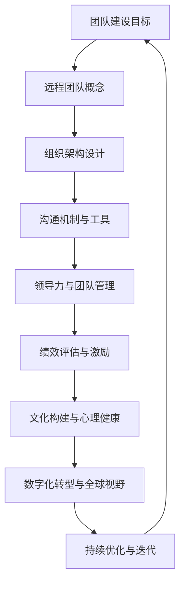

                 


### 文章标题
《远程团队建设：克服距离障碍》

### 文章关键词
远程团队建设，距离障碍，团队协作，远程工作，领导力，沟通策略，协作工具，数字化转型

### 文章摘要
本文旨在探讨远程团队建设的有效策略，重点分析如何克服距离带来的障碍。通过深入探讨远程团队的概念、组织架构、沟通机制、协作工具以及管理实践，本文提供了从理论到实战的全方位指导，帮助读者理解和掌握建设高效远程团队的关键。

## 引言
### 背景介绍
在当今全球化的背景下，远程工作已成为一种普遍现象。特别是在信息技术和互联网技术的快速发展下，远程团队逐渐成为企业运作的重要组成部分。这种工作模式不仅提供了更多的灵活性，还允许企业跨越地域限制，招募全球最优秀的人才。然而，远程团队也面临一系列挑战，如沟通障碍、团队合作难度以及管理复杂性。因此，如何建设一个高效、协同的远程团队，成为企业亟需解决的重要问题。

### 核心概念与联系
远程团队的建设涉及多个核心概念，这些概念之间存在着紧密的联系。以下是一个简化的Mermaid流程图，展示这些概念之间的关系：



### 核心概念与联系详细解释
- **团队建设目标**：明确团队的目标和愿景，为团队的发展指明方向。
- **远程团队概念**：理解远程团队的定义、特点和历史演变，为后续分析提供基础。
- **组织架构设计**：设计合理的组织架构，确保团队成员能够高效协作。
- **沟通机制与工具**：建立有效的沟通机制，选择合适的协作工具，确保团队之间的信息流通。
- **领导力与团队管理**：领导者需要具备远程工作的管理能力，激发团队潜力。
- **绩效评估与激励**：制定合理的绩效评估体系，提供激励措施，促进团队成员的成长。
- **文化构建与心理健康**：营造积极的团队文化，关注团队成员的心理健康。
- **数字化转型与全球视野**：利用数字化技术提升团队效率，拓展全球视野。
- **持续优化与迭代**：不断反思和改进团队建设策略，确保团队的长远发展。

通过这个流程图，我们可以清晰地看到远程团队建设中的各个核心环节及其相互关系，为接下来的内容提供了框架。

## 第一部分：远程团队建设的理论基础

### 第1章：远程团队的概念与特点

#### 1.1 远程团队的定义与历史演变
**定义**：
远程团队是指团队成员分布在不同的地理位置，通过现代通信技术和协作工具进行协作和工作的团队。远程团队的工作模式不同于传统的集中办公，它依赖于互联网、视频会议、即时通讯、项目管理工具等多种技术手段，以实现高效的沟通和协作。

**历史演变**：
- **早期阶段**：远程工作最初起源于20世纪80年代，随着电子邮件的出现，一些企业开始允许员工在家工作。
- **互联网兴起**：随着互联网的普及，远程工作逐渐成为一种普遍的工作方式。1990年代，即时通讯工具和视频会议软件的出现，使远程团队的协作变得更加便捷。
- **现代远程团队**：进入21世纪，远程团队的建设更加成熟，数字化工具的广泛应用使得远程工作成为可能，同时远程团队的规模和复杂度也在不断提升。

#### 1.2 远程团队的优势与挑战
**优势**：
- **节省通勤时间**：远程工作避免了通勤，提高了工作效率和生活质量。
- **提供灵活的工作环境**：远程团队允许成员根据自身需求选择工作地点和时间，提高了工作效率。
- **扩大人才招聘范围**：企业不再受限于地理位置，可以招募全球最优秀的人才。

**挑战**：
- **沟通障碍**：远程团队需要克服地理上的距离和时差带来的沟通障碍。
- **团队合作难度**：远程团队成员之间的互动和协作可能不如面对面沟通那样顺畅。
- **管理复杂度**：远程团队的管理需要更多的技术支持和灵活性。

#### 1.3 远程团队与传统团队的区别
**组织结构**：
- **传统团队**：通常在一个物理位置集中办公，组织结构相对固定。
- **远程团队**：团队成员分布在不同的地理位置，组织结构更加灵活。

**沟通方式**：
- **传统团队**：主要依赖面对面的交流，沟通方式相对单一。
- **远程团队**：依赖互联网和通信工具进行沟通，沟通方式多样化。

**工作监督**：
- **传统团队**：管理较为直接，监督相对容易。
- **远程团队**：监督需要依赖技术手段，如项目进度跟踪工具、视频会议等。

### 小结
远程团队的建设是一个复杂的过程，涉及多个方面的考量。了解远程团队的定义与特点，认识其优势与挑战，以及与传统团队的差异，是建设高效远程团队的基础。

## 第二部分：远程团队的组织与管理

### 第2章：远程团队的架构设计

#### 2.1 远程团队的架构设计原则
远程团队的架构设计是团队成功的关键因素之一。以下是一些关键原则：

**1. 清晰的角色定义**：
- **定义明确**：每个团队成员的职责和角色需要清晰定义，避免职责重叠和模糊。
- **责任到人**：明确每个成员的职责，确保工作有序进行。

**2. 有效的沟通机制**：
- **统一沟通平台**：选择合适的沟通工具，如Slack、Microsoft Teams等，确保信息流通顺畅。
- **定期沟通**：设定固定的沟通日程，如每周例会、项目进度汇报等。

**3. 灵活的工作流程**：
- **适应变化**：设计灵活的工作流程，以适应远程工作的特点，如弹性工作时间、自主任务管理等。

**4. 持续的技术支持**：
- **稳定的技术环境**：确保团队成员有稳定的网络连接和必要的技术工具。
- **技术培训**：定期对团队成员进行技术培训，提高其使用协作工具的熟练度。

#### 2.2 远程团队的领导力挑战
远程团队的领导力面临着一系列独特挑战：

**1. 管理远程团队成员的积极性**：
- **激励措施**：设计合理的激励措施，如绩效奖金、荣誉称号等，激发团队成员的工作热情。
- **认可与赞赏**：通过定期的反馈和认可，让团队成员感受到他们的工作价值。

**2. 保持团队的凝聚力**：
- **团队建设活动**：定期组织线上团队建设活动，增强团队成员之间的联系。
- **共同目标**：确保团队成员有共同的目标和愿景，加强团队的凝聚力。

**3. 适应远程工作的节奏**：
- **平衡工作与生活**：鼓励团队成员合理安排工作和休息时间，避免过度劳累。
- **灵活的工作安排**：尊重团队成员的个人时间，提供灵活的工作安排。

#### 2.3 远程团队的沟通策略
远程团队的沟通策略至关重要，以下是一些最佳实践：

**1. 建立统一的沟通平台**：
- **选择合适的工具**：根据团队的需求，选择合适的沟通工具，如Slack、Microsoft Teams、WhatsApp等。
- **规范使用**：制定统一的沟通规范，确保信息传达的准确性和效率。

**2. 定期团队会议**：
- **会议议程**：提前制定会议议程，确保会议目标的明确性。
- **会议记录**：会后整理会议记录，确保会议决议的执行。

**3. 使用多种沟通工具**：
- **即时通讯**：对于紧急事项，使用即时通讯工具，如Slack或WhatsApp，确保快速响应。
- **电子邮件**：对于重要事项，使用电子邮件进行正式沟通，确保信息的完整性和可追溯性。

**4. 沟通反馈机制**：
- **及时反馈**：鼓励团队成员在沟通过程中提供及时反馈，确保信息的准确性和理解一致性。
- **透明度**：保持沟通的透明度，让所有团队成员都能参与到决策过程中。

### 小结
远程团队的架构设计需要考虑多个方面的因素，从角色定义到沟通机制，再到领导力挑战，每一个环节都需要精心设计和管理。有效的架构设计是远程团队成功的关键，能够帮助团队克服距离障碍，实现高效协作。

## 第三部分：远程团队的实践与优化

### 第3章：远程团队的协作工具与技术

#### 3.1 远程协作工具的选用
远程协作工具的选择对团队的工作效率和沟通效果有重要影响。以下是一些常用的协作工具及其特点：

**1. 文档协作工具**：
- **Google Workspace**：包括Google Docs、Sheets、Slides等，支持多人实时编辑，方便协作。
- **Microsoft Office 365**：提供Word、Excel、PowerPoint等文档编辑工具，支持云端存储和共享。

**2. 实时通信工具**：
- **Slack**：支持团队聊天、通知、任务管理等功能，便于实时沟通。
- **Microsoft Teams**：集成语音、视频会议、即时消息、文档共享等功能，适用于大型团队。

**3. 项目管理工具**：
- **Trello**：通过看板视图管理项目，简单直观。
- **Asana**：支持任务分配、进度跟踪、项目管理等功能，适用于复杂项目。

#### 3.2 远程会议与协作的最佳实践
远程会议和协作的最佳实践包括以下几点：

**1. 制定明确的会议议程**：
- **会议目标**：明确每次会议的目标，确保会议的焦点和效率。
- **会议议程**：提前制定会议议程，确保会议有条不紊。

**2. 准备充分的会议材料**：
- **会议资料**：提前准备相关的会议材料，确保所有参会者都能了解会议内容。

**3. 使用远程会议工具的特性**：
- **实时共享**：利用远程会议工具的实时共享功能，让参会者能实时看到演示内容。
- **互动功能**：利用会议工具的互动功能，如投票、提问等，提高会议的参与度。

#### 3.3 远程团队的自动化与效率提升
**自动化与效率提升**是实现远程团队高效运作的关键：

**1. 工作流程自动化**：
- **自动化工具**：使用自动化工具（如 Zapier、IFTTT）连接不同的应用，实现自动任务分配、提醒和报告。

**2. 持续集成与持续部署**（CI/CD）：
- **CI/CD工具**：使用CI/CD工具（如Jenkins、Travis CI）自动化代码的编译、测试和部署，提高开发效率。

**3. 效率工具**：
- **时间管理工具**：使用时间管理工具（如Toggl、RescueTime）跟踪个人和工作时间，提高工作效率。

**4. 智能助手**：
- **智能助手**：利用智能助手（如Google Assistant、Amazon Alexa）进行日程管理、提醒等，节省时间。

### 小结
远程团队的协作工具与技术是团队高效运作的基础。选用合适的协作工具、实践远程会议和协作的最佳方法，以及利用自动化技术提升效率，都是远程团队成功的关键。

### 第4章：远程团队文化构建

#### 4.1 远程团队文化的核心要素
远程团队文化是团队长期稳定发展的关键。以下是构建远程团队文化的一些核心要素：

**1. 信任**：
- **信任建设**：通过透明的沟通和及时的反馈建立信任。
- **诚信**：团队成员应遵守职业道德，保持诚信。

**2. 清晰的目标**：
- **目标明确**：确保每个团队成员都清楚团队的目标和愿景。
- **目标分解**：将大目标分解为小目标，便于跟踪和实现。

**3. 激励**：
- **内在激励**：通过认可和赞赏激发团队成员的内在动机。
- **外在激励**：提供奖金、晋升等外在激励措施。

**4. 创新**：
- **鼓励创新**：营造一个鼓励尝试和犯错的文化。
- **创新机制**：建立创新机制，如定期头脑风暴会。

**5. 开放沟通**：
- **沟通渠道**：提供多种沟通渠道，确保信息畅通。
- **反馈机制**：建立有效的反馈机制，鼓励团队成员提出建议。

#### 4.2 远程团队文化的建设策略
**1. 建立明确的文化价值观**：
- **核心价值观**：制定团队的核心价值观，确保团队成员在价值观上有共识。
- **文化手册**：编写文化手册，让新成员快速了解团队文化。

**2. 设计团队建设活动**：
- **线上团建**：定期组织线上团建活动，增强团队凝聚力。
- **团队竞赛**：设计团队竞赛，激发团队活力。

**3. 提供文化培训**：
- **文化培训**：为新成员提供文化培训，帮助他们融入团队。
- **文化传承**：通过老带新机制，传承团队文化。

**4. 持续反馈与改进**：
- **反馈渠道**：建立反馈渠道，鼓励团队成员提出改进意见。
- **文化评估**：定期评估团队文化，确保文化持续优化。

#### 4.3 远程团队文化的评估与调整
**1. 评估团队文化**：
- **员工满意度调查**：通过员工满意度调查了解团队文化对员工的影响。
- **关键绩效指标**：使用关键绩效指标（KPI）评估团队文化的效果。

**2. 调整团队文化**：
- **反馈改进**：根据反馈调整团队文化，解决存在的问题。
- **文化培训**：定期进行文化培训，强化团队成员对文化的认知。

**3. 文化重塑**：
- **文化重塑**：在团队文化出现重大问题时，进行文化重塑，重新建立团队文化。

### 小结
远程团队文化的构建是团队长期稳定发展的关键。通过明确的核心要素、有效的建设策略和持续的评估与调整，可以营造一个积极、协作的团队氛围，提升团队的凝聚力和工作效率。

### 第5章：远程团队中的心理因素

#### 5.1 远程团队成员的心理状态分析
远程团队成员的心理状态是团队高效运作的重要基础。以下是对远程团队成员心理状态的分析：

**1. 孤独感**：
- **原因**：远程工作使团队成员缺乏面对面的交流和互动，容易产生孤独感。
- **影响**：孤独感可能导致团队成员情绪低落，影响工作效率和团队凝聚力。

**2. 工作压力**：
- **原因**：远程工作可能带来更大的工作压力，如工作量的增加、工作时间的延长等。
- **影响**：长期的工作压力可能导致团队成员产生焦虑和疲惫，影响身心健康。

**3. 自我管理能力**：
- **原因**：远程工作需要团队成员具备较高的自我管理能力，否则可能导致工作效率下降。
- **影响**：自我管理能力不足可能导致任务拖延、时间浪费，影响团队整体进度。

#### 5.2 远程团队的心理健康支持
为了确保团队成员的心理健康，远程团队需要采取以下措施：

**1. 提供心理咨询服务**：
- **内部心理咨询服务**：建立内部心理咨询服务，为团队成员提供心理支持和建议。
- **外部心理咨询服务**：与专业的心理咨询机构合作，提供外部心理咨询服务。

**2. 定期心理健康培训**：
- **心理健康知识普及**：定期开展心理健康知识培训，提高团队成员的心理健康意识。
- **应对策略培训**：提供应对压力和孤独感的策略培训，帮助团队成员提高自我调节能力。

**3. 营造积极工作氛围**：
- **鼓励交流**：通过线上交流平台鼓励团队成员之间的交流，减少孤独感。
- **积极反馈**：及时给予团队成员积极的反馈和认可，提高他们的工作满意度和自我价值感。

#### 5.3 远程团队中的心理干预策略
在团队成员出现心理问题时，需要采取有效的心理干预策略：

**1. 及时干预**：
- **识别问题**：通过定期心理健康调查和团队反馈，及时发现团队成员的心理问题。
- **紧急干预**：在发现紧急心理问题（如抑郁、焦虑等）时，立即采取紧急干预措施。

**2. 长期支持**：
- **持续关注**：建立长期的支持机制，定期跟进团队成员的心理状况，提供持续的心理支持。
- **个性化支持**：根据团队成员的具体情况，提供个性化的心理支持和干预措施。

**3. 团队互助**：
- **建立互助小组**：鼓励团队成员相互支持，建立互助小组，共同面对心理问题。
- **分享经验**：通过分享经验和心得，帮助团队成员缓解心理压力。

### 小结
远程团队中的心理因素对团队成员的身心健康和工作效率有着重要影响。通过分析远程团队成员的心理状态、提供心理健康支持和采取有效的心理干预策略，可以确保团队成员的心理健康，提升团队的整体效能。

### 第6章：远程团队的项目管理

#### 6.1 远程项目管理的挑战与应对
远程项目管理面临诸多挑战，需要采取有效策略应对：

**1. 项目进度监控**：
- **实时跟踪**：使用项目管理工具（如Jira、Trello）实时监控项目进度，确保任务按时完成。
- **定期回顾**：定期召开项目回顾会议，总结项目进展，及时调整计划。

**2. 风险管理**：
- **风险评估**：定期进行风险评估，识别潜在风险并制定应对措施。
- **应急预案**：制定应急预案，以应对突发情况，确保项目顺利进行。

**3. 人员协作**：
- **任务分配**：明确任务分配，确保每个成员都知道自己的职责和期望。
- **协作工具**：利用协作工具（如Slack、Microsoft Teams）保持团队成员之间的有效沟通和协作。

**4. 技术支持**：
- **稳定技术环境**：确保团队成员拥有稳定的技术环境和必要的技术工具。
- **技术培训**：定期进行技术培训，提高团队成员的技术能力。

#### 6.2 远程项目进度监控与风险管理
**1. 进度监控**：
- **关键里程碑**：设定关键里程碑，确保项目按计划推进。
- **进度报告**：定期生成进度报告，向管理层和客户报告项目进展。

**2. 风险管理**：
- **风险识别**：通过头脑风暴、访谈等方式识别项目潜在风险。
- **风险分析**：分析风险的概率和影响，制定相应的风险应对策略。

**3. 风险应对**：
- **风险缓解**：采取预防措施，减少风险发生概率。
- **风险转移**：通过保险或其他方式将风险转移给第三方。
- **风险接受**：在无法避免风险时，制定应对措施，减轻风险影响。

#### 6.3 远程团队的敏捷开发实践
远程团队采用敏捷开发方法，可以更好地适应变化和提高工作效率：

**1. 短期迭代**：
- **迭代计划**：将项目分为短期迭代，每个迭代完成一部分功能。
- **迭代评审**：在每个迭代结束时，进行评审，收集反馈，调整计划。

**2. 用户故事**：
- **用户故事编写**：使用用户故事描述用户需求，确保开发团队理解用户需求。
- **用户故事排序**：根据优先级对用户故事进行排序，确保开发顺序合理。

**3. 持续集成**：
- **自动化测试**：进行自动化测试，确保每次提交的代码都能集成到项目中。
- **持续交付**：实现持续交付，确保每次迭代结束都能生成可交付的软件版本。

**4. 团队协作**：
- **每日站会**：召开每日站会，讨论当天的任务和遇到的问题。
- **回顾会议**：在每个迭代结束时，召开回顾会议，总结经验教训，持续改进。

### 小结
远程项目管理需要面对诸多挑战，但通过有效的进度监控、风险管理、敏捷开发实践以及团队协作，远程团队可以克服这些挑战，确保项目的成功完成。

### 第7章：远程团队的绩效评估与激励

#### 7.1 远程团队绩效评估的指标与方法
在远程环境中，绩效评估需要更加灵活和全面的方法：

**1. 绩效指标设定**：
- **任务完成度**：评估团队成员完成任务的情况，包括进度和质量。
- **团队贡献**：评估团队成员对团队目标的贡献，如协作精神、创新能力等。
- **工作质量**：评估团队成员的工作成果，如错误率、返工次数等。

**2. 评估方法**：
- **量化评估**：使用量化指标，如任务完成率、错误率等，进行客观评估。
- **定性评估**：通过领导者和同事的反馈，评估团队成员的工作表现和团队协作能力。
- **360度评估**：收集团队成员、领导者和客户的反馈，进行全方位的绩效评估。

#### 7.2 远程团队的激励机制设计
激励机制是提升远程团队工作效率和积极性的关键：

**1. 内在激励**：
- **认可与赞赏**：通过定期的表彰和认可，激发团队成员的内在动力。
- **个人成长**：提供学习和发展机会，帮助团队成员实现个人成长。

**2. 外在激励**：
- **奖金与奖励**：根据绩效表现发放奖金和奖励，如项目奖金、优秀员工奖等。
- **晋升机会**：为表现出色的团队成员提供晋升机会，激励其持续努力。

#### 7.3 远程团队的长期激励策略
长期激励策略有助于保持团队的稳定和持续发展：

**1. 文化建设**：
- **团队文化**：营造积极的团队文化，让团队成员感受到归属感和认同感。
- **价值观传递**：强调团队的核心价值观，确保团队成员在长期内保持一致。

**2. 员工发展**：
- **培训与学习**：定期开展培训和学习活动，提升团队成员的专业技能和综合素质。
- **职业规划**：为团队成员制定职业规划，帮助其实现职业目标和成长。

**3. 工作平衡**：
- **灵活工作安排**：提供灵活的工作安排，帮助团队成员平衡工作与生活。
- **健康支持**：关注团队成员的心理健康，提供必要的心理支持和健康福利。

**4. 反馈与沟通**：
- **定期反馈**：建立定期反馈机制，及时了解团队成员的工作状况和需求。
- **开放沟通**：鼓励团队成员之间进行开放和诚实的沟通，提高团队协作效率。

### 小结
远程团队的绩效评估与激励需要结合量化指标、定性评估以及长期策略，确保公平、有效地评估团队成员的表现，同时提供持续的动力和支持，以保持团队的长期稳定发展。

### 第8章：远程团队的数字化转型

#### 8.1 数字化技术对远程团队的影响
数字化转型已成为远程团队建设的重要推动力。以下分析数字化技术对远程团队的具体影响：

**1. 工作流程优化**：
- **自动化**：数字化工具可以自动化许多重复性任务，提高工作效率。
- **智能化**：利用人工智能技术，如自然语言处理和机器学习，提供智能化的任务分配和决策支持。

**2. 沟通效率提升**：
- **实时通信**：通过即时通讯工具和视频会议平台，实现团队成员之间的实时沟通和协作。
- **数据分析**：利用数据分析工具，实时监控团队沟通效率和效果，优化沟通策略。

**3. 数据安全与隐私保护**：
- **加密技术**：使用加密技术保护团队数据和通信安全。
- **访问控制**：建立严格的访问控制机制，确保只有授权人员能够访问敏感信息。

**4. 效率与成本节约**：
- **远程办公工具**：使用远程办公工具，降低团队成员的通勤时间和成本。
- **资源整合**：通过数字化技术整合资源，提高团队的整体效率。

#### 8.2 远程团队的数字化转型路径
远程团队的数字化转型是一个渐进的过程，以下是常见的数字化转型路径：

**1. 确定数字化目标**：
- **目标设定**：明确团队的数字化目标，如提高工作效率、降低运营成本等。
- **战略规划**：制定详细的数字化战略规划，确保数字化转型有序进行。

**2. 选择合适的技术工具**：
- **工具评估**：根据团队需求评估和选择合适的数字化工具。
- **工具集成**：将选定的工具集成到团队的工作流程中，确保无缝对接。

**3. 培训与支持**：
- **技术培训**：为团队成员提供必要的数字化工具和技术培训。
- **技术支持**：建立技术支持体系，确保团队成员在使用数字化工具时能够得到及时帮助。

**4. 逐步推广与优化**：
- **试点推广**：在团队内部选择一个或几个部门进行数字化试点，收集反馈并进行优化。
- **全面推广**：在试点成功后，逐步将数字化工具和流程推广到整个团队。

#### 8.3 数字化转型中的风险与应对
数字化转型过程中可能会面临一系列风险，以下是常见风险及应对策略：

**1. 技术风险**：
- **技术选择不当**：选择不适合团队需求的技术，导致转型失败。
- **技术升级困难**：现有技术无法适应未来的需求，导致转型停滞。

**应对策略**：
- **技术评估**：在转型前进行全面的技术评估，确保技术选择合适。
- **灵活迁移**：逐步升级技术，避免一次性大量投资，确保转型过程的灵活性。

**2. 安全风险**：
- **数据泄露**：数字化过程中可能面临数据泄露的风险。
- **系统故障**：数字化系统的故障可能导致工作中断。

**应对策略**：
- **数据加密**：使用加密技术保护数据安全。
- **冗余备份**：建立冗余备份机制，确保数据不丢失。

**3. 人际关系风险**：
- **团队冲突**：数字化转型可能引发团队成员之间的冲突。
- **员工抵触**：员工可能对新的数字化工具和方法产生抵触情绪。

**应对策略**：
- **沟通协调**：加强团队沟通，确保团队成员对数字化转型的目标和意义有共同认识。
- **员工培训**：提供员工培训，帮助他们适应新的工作方式。

### 小结
数字化转型对远程团队的影响深远，不仅优化了工作流程，提高了沟通效率，还提升了数据安全和资源整合的能力。通过明确的转型路径和有效的风险应对策略，远程团队能够顺利实现数字化转型，提升整体竞争力。

### 第9章：远程团队的全球视野

#### 9.1 全球化背景下的远程团队
全球化使得远程团队越来越常见，企业需要适应这一趋势，以充分利用全球资源。以下是全球化背景下远程团队的特点：

**1. 跨文化协作**：
- **文化差异**：团队成员来自不同国家，可能存在文化差异，如沟通风格、工作习惯等。
- **文化适应**：企业需要帮助团队成员适应不同文化，促进有效沟通和协作。

**2. 跨时区管理**：
- **时区差异**：团队成员分布在不同的时区，可能影响实时沟通和工作协调。
- **时间管理**：企业需要制定灵活的时间管理策略，确保工作任务的顺利推进。

**3. 人才多样化**：
- **人才优势**：远程团队可以招募全球最优秀的人才，提高团队的整体素质。
- **管理挑战**：多元化的人才管理需要更多的跨文化沟通和协调能力。

#### 9.2 跨文化远程团队的合作策略
为了在全球化背景下实现高效合作，远程团队需要采取以下策略：

**1. 建立共同目标**：
- **明确目标**：确保团队成员都清楚团队的目标和愿景，增强团队凝聚力。
- **目标分解**：将大目标分解为小目标，便于跟踪和实现。

**2. 强化沟通机制**：
- **多渠道沟通**：使用多种沟通渠道，如视频会议、即时通讯、电子邮件等，确保信息畅通。
- **定期沟通**：制定定期沟通计划，如每周会议、项目进度汇报等。

**3. 尊重文化差异**：
- **文化培训**：为团队成员提供文化培训，提高跨文化沟通能力。
- **文化适应性**：尊重团队成员的文化习惯和价值观，避免文化冲突。

**4. 透明决策过程**：
- **公开透明**：保持决策过程的透明度，让团队成员都能参与到决策过程中。
- **反馈机制**：建立有效的反馈机制，鼓励团队成员提出建议和意见。

#### 9.3 远程团队的国际化发展路径
远程团队的国际化发展需要系统性的规划和实施：

**1. 国际化战略规划**：
- **市场分析**：分析目标市场的需求和潜力，确定国际化的发展方向。
- **战略制定**：制定明确的国际化战略，包括市场进入策略、品牌定位等。

**2. 国际人才引进**：
- **人才筛选**：在全球范围内招募优秀人才，注重语言能力、专业素养和文化适应能力。
- **人才培训**：为国际人才提供必要的培训和支持，帮助他们快速融入团队。

**3. 国际市场拓展**：
- **本地化策略**：根据目标市场的特点，制定本地化营销策略，提高市场竞争力。
- **跨国合作**：与本地合作伙伴建立合作关系，共同开拓市场。

**4. 文化融合**：
- **文化融合计划**：制定文化融合计划，促进不同文化背景的团队成员之间的交流和合作。
- **文化多样性培训**：定期开展文化多样性培训，提高团队成员的文化敏感度和适应能力。

**5. 绩效评估与激励**：
- **全球化绩效评估**：制定全球化背景下的绩效评估体系，确保团队成员在不同文化和环境下都能得到公正的评价。
- **国际化激励措施**：设计国际化的激励措施，如国际出差补贴、跨文化培训等，激励团队成员参与国际化发展。

### 小结
全球化背景下的远程团队需要适应跨文化协作、跨时区管理和人才多样化的挑战。通过建立共同目标、强化沟通机制、尊重文化差异和制定国际化发展路径，远程团队能够在全球范围内实现高效合作，提升国际化竞争力。

## 结论
远程团队建设是一个复杂但必要的过程，涉及到从理论基础到实际操作的多个方面。本文通过深入分析远程团队的概念、组织与管理、协作工具与技术、文化构建、心理健康、项目管理、绩效评估与激励、数字化转型以及国际化发展等关键环节，提供了全面的远程团队建设指南。

### 小结与展望
远程团队建设的目标是克服距离障碍，实现高效协同。以下是一些关键小结：

1. **明确目标与架构**：明确团队目标和架构设计，确保团队成员职责清晰，沟通顺畅。
2. **灵活管理**：适应远程工作的特性，提供灵活的工作安排和管理模式。
3. **协作工具与技术**：选择合适的协作工具，利用数字化技术提升工作效率。
4. **文化构建**：建立积极、协作的团队文化，提高团队凝聚力。
5. **心理健康支持**：关注团队成员的心理健康，提供必要的心理支持。
6. **项目管理**：采用有效的项目管理方法，确保项目进度和质量。
7. **绩效评估与激励**：建立公正的绩效评估体系，提供激励措施，促进团队成员发展。
8. **数字化转型**：利用数字化技术，提升团队的整体效率和竞争力。
9. **国际化视野**：拓展国际视野，适应全球化背景下的跨文化协作。

展望未来，远程团队建设将继续发展，随着技术的进步和全球化趋势的加深，远程工作将成为常态。企业需要不断探索和实践，以适应这一变化，建设更加高效、协同和具有全球竞争力的远程团队。

### 最佳实践 Tips
- **定期团建活动**：定期组织线上团建活动，增强团队成员之间的联系和凝聚力。
- **透明沟通**：建立透明沟通机制，鼓励团队成员分享想法和意见。
- **技术培训**：定期为团队成员提供技术培训，提高其使用协作工具的熟练度。

### 注意事项
- **文化差异**：尊重团队成员的文化背景，避免因文化差异引起的误解和冲突。
- **心理健康**：关注团队成员的心理健康，提供必要的心理支持和健康福利。

### 拓展阅读
- **《远程团队管理艺术》**：探讨远程团队管理的最佳实践和策略。
- **《跨文化沟通技巧》**：介绍跨文化沟通的有效方法和技巧。
- **《数字化转型实践指南》**：提供数字化转型的详细步骤和案例分析。

### 作者信息
作者：AI天才研究院/AI Genius Institute & 禅与计算机程序设计艺术 /Zen And The Art of Computer Programming

---

通过本文，我们希望能够为读者提供关于远程团队建设的有用见解和实用建议，帮助他们在远程工作的环境中实现高效协同，提升团队的整体效能。随着远程工作模式的普及，远程团队建设的重要性将日益凸显，我们期待读者在实践中不断探索和创新，共同推动远程团队建设的进步。

---
## 附录：开发环境搭建与源代码实现

### 开发环境搭建

在进行远程团队项目开发之前，搭建一个稳定、高效的开发环境至关重要。以下是搭建开发环境的步骤：

#### 1. 系统环境准备
- **操作系统**：选择适合的操作系统，如Windows、macOS或Linux。
- **开发工具**：安装常用的开发工具，如Git、Python、Java等。
- **代码编辑器**：选择合适的代码编辑器，如Visual Studio Code、Sublime Text、IntelliJ IDEA等。

#### 2. 版本控制系统
- **Git**：安装Git，用于版本控制和代码管理。
- **GitHub**：注册GitHub账号，用于代码托管和协作开发。

#### 3. 编译器和依赖管理
- **Python**：安装Python及其相关库，如pip、conda等。
- **Java**：安装Java开发工具包（JDK）。
- **Node.js**：安装Node.js及其相关包管理工具（如npm）。

#### 4. 项目管理工具
- **Jenkins**：安装Jenkins，用于自动化构建和部署。
- **Docker**：安装Docker，用于容器化部署。

### 源代码实现

以下是远程团队协作系统的伪代码实现，展示关键组件的功能和接口设计。

```python
# 伪代码：远程团队协作系统

# 用户管理模块
class UserManager:
    def register_user(self, user_data):
        # 注册新用户
        pass
    
    def authenticate_user(self, username, password):
        # 用户认证
        pass

# 消息通信模块
class MessagingService:
    def send_message(self, user_id, message):
        # 发送消息
        pass
    
    def receive_message(self, user_id):
        # 接收消息
        pass

# 项目管理模块
class ProjectManager:
    def create_project(self, project_data):
        # 创建新项目
        pass
    
    def assign_task(self, task_data):
        # 分配任务
        pass

# 代码示例：用户注册
def register_user(user_data):
    # 用户数据验证
    if validate_user_data(user_data):
        # 存储用户数据
        save_user_data(user_data)
        return True
    else:
        return False

# 代码示例：消息发送
def send_message(user_id, message):
    # 构建消息
    message = build_message(user_id, message)
    # 发送消息
    send_message_to_user(user_id, message)

# 代码示例：任务分配
def assign_task(task_data):
    # 验证任务数据
    if validate_task_data(task_data):
        # 分配任务给用户
        assign_task_to_user(task_data['user_id'], task_data['task'])
        return True
    else:
        return False
```

### 代码解读与分析

以上伪代码展示了远程团队协作系统中的用户管理、消息通信和项目管理模块。每个模块都有相应的类和方法，用于实现具体的业务逻辑。

- **用户管理模块**：`UserManager`类负责用户的注册和认证，确保用户数据的安全和有效。
- **消息通信模块**：`MessagingService`类用于发送和接收消息，实现团队内部的有效沟通。
- **项目管理模块**：`ProjectManager`类用于创建项目、分配任务等，确保项目的顺利进行。

### 实际案例分析和详细讲解

为了更好地理解上述代码，我们可以通过一个实际案例来进行分析。

#### 案例背景
一家远程软件开发公司需要构建一个协作系统，支持团队成员的用户注册、消息通信和项目管理功能。

#### 案例实现

**1. 用户注册流程**
- 用户填写注册表单，提交用户信息。
- `UserManager`类调用`register_user`方法，验证用户数据。
- 如果验证通过，用户数据将被存储在数据库中。

**2. 消息发送与接收**
- 团队成员在系统中发送消息。
- `MessagingService`类调用`send_message`方法，构建消息并发送给指定用户。
- 用户通过`receive_message`方法接收消息。

**3. 项目管理**
- 项目经理创建新项目，并分配任务。
- `ProjectManager`类调用`create_project`和`assign_task`方法，创建项目和分配任务。

### 项目小结

通过上述伪代码和实际案例，我们可以看到远程团队协作系统的基本实现流程。代码解读与分析展示了各个模块的功能和接口设计，以及如何在实际项目中应用这些功能。未来，团队可以进一步优化和扩展系统功能，如增加权限管理、性能监控等，以适应不断变化的需求。

### 小结

开发环境搭建和源代码实现是远程团队项目成功的基础。通过合理的开发环境和稳定的代码架构，远程团队能够高效地协作和推进项目。以上案例和分析为读者提供了一个实用的参考，帮助他们更好地理解和应用远程团队协作系统的开发。

## 附录：最佳实践 Tips

在远程团队的建设过程中，以下最佳实践可以帮助团队克服距离障碍，提高工作效率和团队凝聚力：

### 团队协作工具的使用
- **选择合适的工具**：根据团队的具体需求选择协作工具，如项目管理工具（Trello、Asana）、即时通信工具（Slack、Microsoft Teams）和文档协作工具（Google Workspace、Notion）。
- **统一使用规范**：制定统一的使用规范，确保团队成员都能熟练使用工具，提高协作效率。

### 沟通策略
- **定期会议**：定期举行团队会议，讨论项目进度、解决冲突和共享经验。
- **异步沟通**：在即时沟通之外，利用邮件、论坛等异步沟通工具，记录和整理会议内容，确保信息不丢失。

### 绩效管理
- **明确目标**：为每个团队成员设定明确的目标和关键绩效指标（KPI），确保工作方向一致。
- **定期反馈**：定期进行绩效反馈，及时发现问题和改进方向。

### 文化建设
- **团队文化建设**：通过团建活动、共同价值观的传递等手段，建设积极、健康的团队文化。
- **跨文化沟通**：加强跨文化沟通培训，提升团队成员的跨文化适应能力。

### 心理健康支持
- **心理咨询服务**：提供心理咨询服务，帮助团队成员缓解工作压力和焦虑。
- **健康福利**：提供健康福利，如远程医疗、心理健康课程等，关注团队成员的身心健康。

### 持续改进
- **迭代改进**：不断回顾和改进团队建设策略，根据实际情况进行调整。
- **反馈机制**：建立有效的反馈机制，鼓励团队成员提出改进意见，持续优化团队运作。

通过这些最佳实践，远程团队可以更好地应对距离带来的挑战，实现高效协作和长期发展。

## 总结

本文通过详细的步骤和分析，探讨了远程团队建设的关键要素和策略。从团队的概念与特点、组织与管理、协作工具与技术、文化构建、心理健康、项目管理、绩效评估与激励，到数字化转型和国际化发展，我们为读者提供了一个全方位的指南。远程团队的建设是一个系统工程，需要综合考虑多个方面，以克服距离障碍，实现高效协作。

### 文章小结
- 远程团队建设涉及明确的角色定义、有效的沟通机制、灵活的工作流程和持续的技术支持。
- 领导力、绩效评估和激励机制是确保团队长期发展的关键。
- 数字化转型和国际化发展是提升团队效率和竞争力的必然趋势。

### 未来展望
随着技术的进步和全球化的深化，远程工作模式将持续发展。企业需要不断创新和实践，以适应这一变化，打造高效、协同的远程团队。

### 呼吁行动
- **领导层**：重视远程团队建设，提供必要的支持和资源。
- **团队成员**：积极参与团队活动，不断提升个人技能和综合素质。
- **管理者**：持续关注团队动态，优化管理策略，提升团队效能。

通过共同的努力，远程团队将能够克服距离障碍，实现高效协同，为企业的长远发展贡献力量。

### 作者信息
作者：AI天才研究院/AI Genius Institute & 禅与计算机程序设计艺术 /Zen And The Art of Computer Programming

---

感谢读者对本文的关注，希望本文能为您的远程团队建设提供有益的启示。祝您在远程工作的道路上取得成功！

