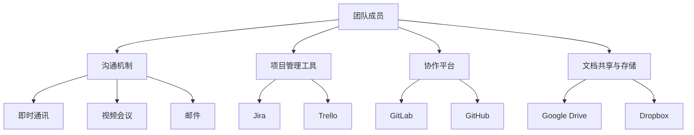

                 

### 文章标题

远程团队建设：克服距离障碍的方法

### 文章关键词

远程团队、距离障碍、协作工具、领导力、文化差异

### 文章摘要

本文旨在探讨远程团队建设的重要性和挑战，尤其是如何克服由于地理位置带来的距离障碍。文章将详细分析远程团队的组织结构、沟通策略、技术工具使用以及团队领导与激励措施，并结合实际案例，为读者提供有价值的建设性建议。

---

## 引言

在现代商业环境中，远程工作已成为一种常态。特别是在全球化进程加快和信息技术的迅猛发展的推动下，越来越多的企业开始采用远程团队模式。远程团队不仅能够突破地域限制，汇聚全球最优秀的专业人才，还能够降低办公成本，提高工作效率和灵活性。然而，远程工作也带来了一系列挑战，尤其是如何有效克服由于距离产生的障碍。

远程团队面临的距离障碍主要包括以下几个方面：

1. **沟通困难**：地理位置的差异导致沟通成本增加，信息传递不及时，容易产生误解。
2. **文化差异**：不同国家和地区的文化背景差异，可能导致团队合作中的冲突。
3. **时间管理**：时区差异给远程团队的协调和同步工作带来了困难。
4. **信任建立**：缺乏面对面交流的机会，团队成员之间的信任建立变得复杂。

本文将围绕以上挑战，通过理论分析、案例研究和最佳实践，探讨如何构建一个高效、和谐的远程团队。

## 核心概念与联系

### 远程团队架构

为了更好地理解远程团队的建设，首先需要明确其核心概念和架构。远程团队的基本架构通常包括以下几个部分：

1. **团队成员**：包括项目经理、开发人员、设计师、业务分析师等角色。
2. **沟通机制**：利用即时通讯工具、视频会议平台、邮件等手段保持团队内部的信息交流。
3. **项目管理工具**：如Jira、Trello等，用于任务分配、进度跟踪和风险管理。
4. **协作平台**：如GitLab、GitHub等，用于代码管理、版本控制和协作开发。
5. **文档共享与存储**：使用Google Drive、Dropbox等工具，确保团队成员可以随时访问共享文档。

下面是远程团队架构的Mermaid流程图：

### 远程团队工作模式

远程团队的工作模式通常可以分为分散式工作、同步协作和异步协作三种。

#### 分散式工作

分散式工作是远程团队最基本的模式，团队成员可以在各自的地点独立完成工作任务。这种模式的优势在于灵活性高，成员可以根据个人时间表灵活安排工作。然而，分散式工作也带来了一些挑战，如沟通不畅、协调困难等。

#### 同步协作

同步协作是指团队成员在特定的时间段内进行实时协作。这种方式通常适用于需要集体讨论、决策或者共同开发的项目。同步协作可以通过视频会议、在线聊天等方式实现，有助于增强团队成员之间的互动和协作。

#### 异步协作

异步协作是指团队成员在不同时间完成各自的工作，并通过工具进行信息交换和任务更新。这种方式适用于一些不需要实时响应的任务，如文档编写、代码审核等。异步协作的优点是效率高、灵活性大，但需要注意任务的协调和进度的把控。

### 远程团队协作与沟通的关键要素

一个成功的远程团队离不开以下几个关键要素：

1. **信任建设**：团队成员之间需要建立相互信任，这有助于提高团队的合作效率和满意度。
2. **沟通频率**：定期沟通可以保持团队成员之间的信息同步，减少误解和冲突。
3. **信息透明度**：团队内部的工作进展、问题和风险应该保持透明，以便所有成员都能及时了解情况。

## 团队组织与沟通

### 远程团队的组成与分工

远程团队的组成与分工是团队建设的基础。一个有效的远程团队应该包含不同职能的角色，以确保项目的顺利进行。

#### 项目经理

项目经理是远程团队的核心角色，负责整体项目的规划、执行和监控。项目经理需要具备良好的沟通能力和项目管理技能，以确保团队目标的实现。

#### 开发人员

开发人员是远程团队的主要劳动力，负责软件的编写、测试和部署。开发人员需要具备扎实的编程技能和问题解决能力。

#### 设计师

设计师负责产品的界面设计和用户体验。设计师需要与开发人员紧密合作，确保设计能够落地实施。

#### 业务分析师

业务分析师负责分析用户需求，制定功能规格说明书，并与团队成员沟通以确保需求的理解和实现。

### 沟通机制

沟通机制是远程团队协作的关键。以下是一些有效的沟通策略：

#### 即时通讯

即时通讯工具如Slack、Telegram等，可以实时交流，提高沟通效率。

#### 视频会议

视频会议工具如Zoom、Microsoft Teams等，有助于团队成员进行面对面的交流，增强团队凝聚力。

#### 邮件

邮件是一种正式的沟通方式，适用于重要信息的传递和记录。

### 远程工作流程设计

远程工作流程设计是确保项目顺利进行的重要环节。以下是一些关键步骤：

#### 任务分配

任务分配应基于团队成员的技能和兴趣，确保任务的高效完成。

#### 进度跟踪

使用项目管理工具如Jira、Trello等，实时跟踪任务进度，确保项目按时完成。

#### 风险管理

定期评估项目风险，制定相应的应对措施，确保项目能够顺利推进。

## 技术工具与平台

### 远程协作工具选择

选择合适的远程协作工具对于团队的高效运作至关重要。以下是一些常用的协作工具：

#### GitLab

GitLab是一款强大的代码托管和协作工具，支持Git版本控制、项目管理、持续集成和持续部署等功能。

#### Trello

Trello是一款简洁易用的项目管理工具，通过看板和卡片的形式，帮助团队可视化任务进度。

#### Slack

Slack是一款即时通讯工具，提供聊天室、直接消息、文件共享等功能，有助于团队成员之间的实时沟通。

### 通信与会议平台的利用

有效的通信与会议平台利用是确保远程团队协作顺畅的关键。以下是一些常用的平台：

#### Zoom

Zoom是一款功能强大的视频会议平台，支持高清视频、语音、屏幕共享等功能。

#### Microsoft Teams

Microsoft Teams是一款集成通信、协作和会议功能的一体化平台，适用于企业级团队协作。

#### Google Meet

Google Meet是Google推出的视频会议平台，支持多人实时视频会议，并与Google Workspace集成。

### 文档共享与管理工具

文档共享与管理工具可以帮助团队高效地共享和协作文档。以下是一些常用的工具：

#### Google Drive

Google Drive提供了强大的文档共享和协作功能，支持实时编辑和版本控制。

#### Dropbox

Dropbox是一款流行的云存储服务，提供了方便的文档共享和同步功能。

#### Notion

Notion是一款功能丰富的笔记和组织工具，适用于文档管理、项目管理等多种场景。

## 克服距离障碍

### 文化差异与解决策略

文化差异是远程团队协作中常见的障碍。以下是一些解决策略：

#### 敏感度培训

定期组织文化敏感度培训，提高团队成员对不同文化的认识和尊重。

#### 明确沟通规则

制定明确的沟通规则，确保团队成员在交流时使用一致的沟通方式和语言。

#### 文化交流活动

组织线上或线下的文化活动，增进团队成员之间的了解和友谊。

### 时区差异的影响及应对方法

时区差异给远程团队协作带来了额外的挑战。以下是一些应对方法：

#### 调整工作计划

根据团队成员的时区调整工作计划，确保关键任务能够在团队成员的工作时间完成。

#### 时区匹配会议

安排时区匹配的会议，尽量减少跨时区的沟通成本。

#### 自动化工具

使用自动化工具，如Tasker或ifttt，实现日程提醒和任务自动化。

### 跨境合作中的挑战

跨境合作涉及不同的法律、法规和文化背景，需要特别注意以下挑战：

#### 法律合规

确保项目符合所在国家或地区的法律法规，避免法律风险。

#### 语言障碍

提供多语言支持，确保团队成员能够理解和沟通。

#### 文化适应

了解和适应目标市场的文化，确保项目能够符合当地需求。

## 团队领导与激励机制

### 远程团队领导的角色

远程团队领导需要具备以下角色：

#### 沟通者

领导需要确保团队成员之间的沟通畅通无阻，及时传递信息和反馈。

#### 激励者

领导需要激发团队成员的工作热情和积极性，确保项目目标的实现。

#### 监督者

领导需要监督项目的进展，确保任务按时完成，风险得到有效控制。

### 激励远程团队成员的策略

以下是一些激励远程团队成员的策略：

#### 设定明确的奖励机制

设定明确的奖励机制，对表现优秀的成员给予奖励。

#### 提供职业发展机会

为团队成员提供职业发展机会，如培训、晋升等。

#### 定期反馈和沟通

定期与团队成员进行反馈和沟通，了解他们的需求和困惑，提供支持。

### 远程团队的绩效评估

绩效评估是远程团队管理的重要环节。以下是一些关键点：

#### 多维度评估

从多个维度评估团队成员的表现，如工作质量、团队协作、创新能力等。

#### 定期评估

定期进行绩效评估，确保评估的及时性和准确性。

#### 反馈与改进

根据评估结果，给予团队成员反馈，并制定改进计划。

## 成功案例研究

### 案例一：跨国远程团队的成功案例

某国际知名的软件开发公司，通过建立全球远程团队，成功完成了多个大型项目。以下是他们的成功经验：

#### 1. 文化融合

公司定期组织跨文化培训，提高团队成员对不同文化的认知和尊重。

#### 2. 高效沟通

公司采用多种沟通工具，如Slack、Zoom等，确保团队成员之间的信息畅通。

#### 3. 明确的目标和任务

公司制定明确的项目目标和任务，确保团队成员对项目的方向和目标有清晰的认识。

### 案例二：初创公司远程团队的建设

某初创公司通过远程团队模式，迅速发展并获得了投资者的青睐。以下是他们的经验：

#### 1. 小团队协作

初创公司采用小团队协作模式，确保团队成员之间的沟通和协作更加紧密。

#### 2. 灵活的工作时间

初创公司允许团队成员灵活安排工作时间，提高工作效率。

#### 3. 强大的技术支持

初创公司使用先进的协作工具和技术，确保团队的高效运作。

## 总结与未来展望

### 远程团队建设的现状与趋势

远程团队建设已经成为现代企业的重要战略。随着信息技术的不断进步，远程团队将变得更加高效、灵活和多样化。

### 未来远程团队建设的发展方向

未来远程团队建设将更加注重以下几个方面：

#### 1. 自动化与智能化

自动化和智能化技术的应用将进一步提高远程团队的工作效率和灵活性。

#### 2. 人性化管理

人性化管理将更加重视团队成员的情感和需求，提高团队的整体幸福感和工作效率。

#### 3. 文化融合

随着全球化的推进，远程团队将更加注重文化融合，提高跨文化沟通和协作能力。

### 对远程团队建设者的建议

对于远程团队建设者，以下是一些建议：

#### 1. 建立明确的沟通机制

确保团队成员之间的沟通畅通无阻，定期更新项目进展。

#### 2. 注重团队文化建设

培养团队成员之间的信任和凝聚力，提高团队的整体效率。

#### 3. 不断提升自身能力

作为团队领导者，不断提升自身的沟通、管理和领导能力，以更好地引领团队前进。

---

**作者：AI天才研究院/AI Genius Institute & 禅与计算机程序设计艺术 /Zen And The Art of Computer Programming**

以上是针对《远程团队建设：克服距离障碍的方法》一书的详细目录大纲。每个章节都包含了丰富的内容和具体的讲解，旨在帮助读者深入了解远程团队建设的各个方面。希望通过本文，读者能够获得对远程团队建设的全面认识，并掌握有效的建设和管理策略。在实际应用中，还需要结合具体情况和团队特点，灵活调整和优化，以实现最佳效果。让我们一起迈向更加高效、和谐的远程团队建设之路！

