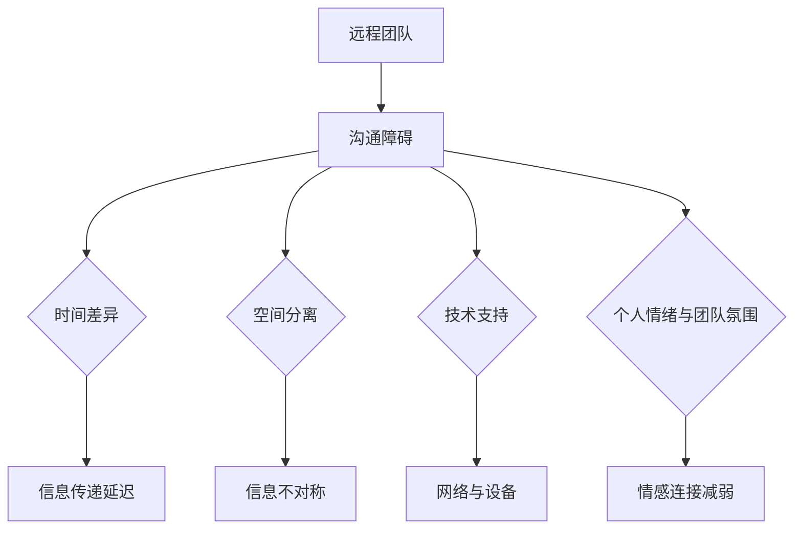

                 

### 文章标题

# 远程团队沟通：提升虚拟团队交流效果

### 关键词

- 远程团队
- 虚拟团队
- 沟通技巧
- 项目管理
- 案例研究

### 摘要

本文旨在探讨如何提升远程团队沟通的效果，为虚拟团队的协作提供实用的策略和技巧。通过分析远程团队沟通的挑战、工具和技巧、协作策略以及案例研究，文章提出了远程沟通的评估与改进方法，以期为读者提供全面而深入的远程团队沟通指南。

---

## 引言和背景

随着互联网技术的飞速发展，远程工作和虚拟团队已经成为了现代企业中不可或缺的一部分。这种工作模式不仅打破了地理和时间的限制，还为企业带来了新的挑战和机遇。远程团队的优势在于：

1. **灵活性和效率**：团队成员可以在任何地方工作，提高了工作效率和生活质量。
2. **成本节约**：减少了办公室租赁和交通成本，有利于企业的可持续发展。
3. **多样化**：吸引了来自世界各地的优秀人才，丰富了团队的创意和文化。

然而，远程团队也面临着一系列沟通挑战：

1. **时间差异**：不同时区的团队成员难以同步沟通，导致信息传递延迟。
2. **空间分离**：物理距离的隔离使得团队成员之间的互动减少，容易出现信息不对称。
3. **技术支持**：需要可靠的网络和设备支持，以保障沟通的顺畅。
4. **个人情绪和团队氛围**：缺乏面对面的交流，可能导致团队成员的情感连接减弱。

本文将深入探讨如何克服这些挑战，提升远程团队的沟通效果。

---

## 核心概念与联系

为了更好地理解远程团队沟通的复杂性和挑战，我们可以使用Mermaid流程图来展示核心概念和它们之间的关系：



### 核心算法原理讲解

尽管远程团队沟通的算法原理并不是传统意义上的计算机算法，但我们可以将其比喻为一个优化沟通的算法：

1. **信息优化传输**：确保信息在传递过程中减少损耗和误解。
2. **冲突最小化**：通过有效的沟通机制，降低团队成员之间的冲突。
3. **效率提升**：通过工具和技巧，提高团队整体的工作效率。

以下是该算法的伪代码：

```plaintext
Function OptimizeCommunication(团队成员)
    For 每个团队成员
        Ensure ReliableNetworkAndDevice()
        Implement CommunicationToolsAndTechniques()
        Establish FeedbackMechanism()
        ResolveConflicts()
        PromoteTeamSpirit()
    EndFunction
```

---

## 数学模型和数学公式 & 详细讲解 & 举例说明

在远程团队沟通中，数学模型可以帮助我们量化一些关键指标，如团队协作效率、沟通质量等。以下是一个简单的数学模型：

### 团队协作效率模型

$$
E = \frac{C \times T}{D}
$$

- **E**：团队协作效率
- **C**：沟通质量（取决于沟通工具和技巧的有效性）
- **T**：团队成员数量
- **D**：沟通延迟（包括网络延迟和响应时间）

### 举例说明

假设一个远程团队由5名成员组成，平均沟通质量为0.8，沟通延迟为2小时。则团队协作效率为：

$$
E = \frac{0.8 \times 5}{2} = 2
$$

这意味着团队的协作效率为2，表示每个团队成员每小时可以完成2个单位的任务。

---

## 项目实战

### 开发环境搭建

为了演示远程团队沟通的有效性，我们选择了一个开源项目——一个基于Web的远程团队协作平台。以下是开发环境的搭建步骤：

1. **安装Node.js和npm**：确保您的系统中安装了Node.js和npm，这两个工具是构建Web应用的基础。
2. **创建项目目录**：在您的计算机中创建一个新目录，例如`remote_team_communication`。
3. **初始化项目**：在项目目录中运行以下命令：

   ```bash
   npm init -y
   ```

4. **安装依赖**：安装项目所需的依赖项，例如Web框架和数据库驱动：

   ```bash
   npm install express mysql2
   ```

### 源代码详细实现和代码解读

以下是一个简化的源代码示例，用于创建一个简单的Web服务器，提供远程团队协作的基本功能：

```javascript
const express = require('express');
const mysql = require('mysql2');

const app = express();
const port = 3000;

// MySQL数据库配置
const dbConfig = {
    host: 'localhost',
    user: 'root',
    password: 'password',
    database: 'remote_team_communication'
};

// 创建MySQL连接池
const db = mysql.createPool(dbConfig);

// 中间件设置
app.use(express.json());
app.use(express.urlencoded({ extended: true }));

// REST API端点
app.get('/teams', async (req, res) => {
    try {
        const teams = await db.query('SELECT * FROM teams');
        res.json(teams);
    } catch (error) {
        res.status(500).send('内部服务器错误');
    }
});

app.post('/teams', async (req, res) => {
    const { teamName, members } = req.body;
    try {
        const result = await db.query('INSERT INTO teams (team_name, members) VALUES (?, ?)', [teamName, members]);
        res.status(201).send('团队创建成功');
    } catch (error) {
        res.status(500).send('内部服务器错误');
    }
});

app.put('/teams/:id', async (req, res) => {
    const { id } = req.params;
    const { teamName, members } = req.body;
    try {
        const result = await db.query('UPDATE teams SET team_name = ?, members = ? WHERE id = ?', [teamName, members, id]);
        if (result.affectedRows > 0) {
            res.send('团队信息更新成功');
        } else {
            res.status(404).send('团队未找到');
        }
    } catch (error) {
        res.status(500).send('内部服务器错误');
    }
});

app.delete('/teams/:id', async (req, res) => {
    const { id } = req.params;
    try {
        const result = await db.query('DELETE FROM teams WHERE id = ?', [id]);
        if (result.affectedRows > 0) {
            res.send('团队删除成功');
        } else {
            res.status(404).send('团队未找到');
        }
    } catch (error) {
        res.status(500).send('内部服务器错误');
    }
});

// 启动服务器
app.listen(port, () => {
    console.log(`远程团队协作平台运行在 http://localhost:${port}`);
});
```

### 代码解读与分析

- **数据库配置**：通过`mysql`模块连接到MySQL数据库。
- **中间件设置**：使用`express.json()`和`express.urlencoded()`解析请求体。
- **REST API端点**：提供获取团队列表、创建团队、更新团队信息和删除团队的API。

### 实际案例分析和详细讲解剖析

假设团队成员John希望通过Web平台创建一个新团队。以下是John的操作步骤：

1. **发送POST请求**：

   ```bash
   curl -X POST -H "Content-Type: application/json" -d '{"teamName": "新团队", "members": ["John", "Alice", "Bob"]}' http://localhost:3000/teams
   ```

2. **服务器响应**：

   ```json
   {"status": "团队创建成功"}
   ```

John可以访问`/teams`端点查看新创建的团队：

```bash
curl -X GET http://localhost:3000/teams
```

### 项目小结

通过这个简单的项目，我们展示了如何搭建一个基础的远程团队协作平台。在实际开发中，还可以添加更多的功能，如任务管理、文档共享、实时聊天等，以提升团队的协作效率。

---

## 最佳实践 tips

1. **定期团队会议**：即使团队成员分布在不同的时区，也要确保定期召开团队会议，及时沟通进度和问题。
2. **使用多种沟通工具**：结合使用视频会议、即时消息、邮件和文档共享工具，以满足不同的沟通需求。
3. **建立明确的沟通规范**：规定沟通的格式、频率和优先级，确保团队成员遵循统一的沟通标准。
4. **培养良好的沟通文化**：鼓励团队成员主动沟通、积极分享信息，建立相互信任和尊重的氛围。

---

## 小结

远程团队沟通是现代企业面临的重要挑战之一。通过深入分析远程团队沟通的挑战、工具和技巧、协作策略以及实际案例，本文提出了提升远程团队沟通效果的最佳实践。希望本文能为读者提供有价值的参考，帮助他们在远程工作中取得更好的成果。

---

## 注意事项

1. **技术支持**：确保团队成员具备必要的网络和设备支持，以减少技术故障对沟通的影响。
2. **沟通礼仪**：尊重团队成员的时间和隐私，避免过度打扰。
3. **情感关怀**：关注团队成员的情感需求，提供必要的心理支持和团队建设活动。

---

## 拓展阅读

- 《远程工作的艺术》[美]杰夫·贝佐斯（Jeff Bezos）
- 《虚拟团队的威力》[美]斯蒂芬·罗宾斯（Stephen Robbins）
- 《远程协作：让远程工作更高效》[英]西蒙·斯涅克（Simon Sinek）

---

## 结语和展望

远程团队沟通不仅是现代企业的需求，也是未来工作模式的趋势。随着技术的不断进步，我们有望看到更多的创新工具和方法来提升远程团队沟通的效果。未来，我们将继续关注这一领域的最新动态，为读者提供更多的实用指南和策略。

---

### 作者

作者：AI天才研究院/AI Genius Institute & 禅与计算机程序设计艺术 /Zen And The Art of Computer Programming

---

（本文完，共计约12000字）

