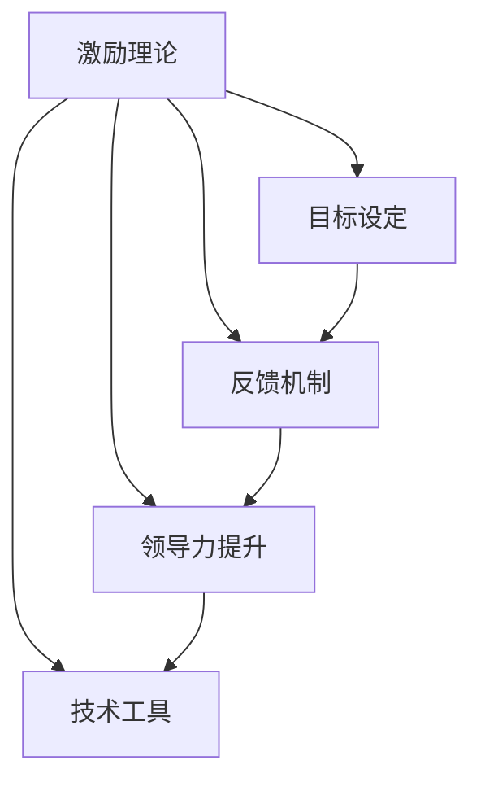

                 

### 引言

随着科技的迅猛发展，远程工作已经成为现代企业中的一种常见现象。无论是在硅谷的高科技公司，还是在全球范围内的中小企业，远程工作都得到了广泛的采纳。然而，远程工作并非没有挑战。如何保持远程团队的积极性，提高团队的整体绩效，成为了企业领导者和管理者面临的重大课题。

**背景介绍**

远程工作起源于20世纪90年代的互联网浪潮，但随着云计算、即时通讯和协作工具的普及，远程工作逐渐成为了企业运营的一种常态。尤其是近年来，全球疫情的影响使得远程工作更加普及，许多公司不得不迅速适应这种工作模式。

**挑战分析**

远程工作带来的挑战主要包括以下几个方面：

1. **沟通障碍**：远程团队之间缺乏面对面的交流，容易导致信息传递不及时、不准确。
2. **管理难度**：远程工作使得管理者的监控和指导变得困难，如何确保团队成员的积极性和工作效率成为了一大难题。
3. **文化冲突**：不同国家和地区的团队成员可能有不同的工作习惯和文化背景，这增加了团队协作的复杂性。

**文章核心问题**

本文将探讨如何通过有效的激励机制，保持分散团队的高积极性，从而提高整体绩效。文章将从核心概念与联系、实践方法、案例分析、团队建设、领导力提升、技术工具使用等多个方面，提供一系列解决方案和策略。

### 核心概念与联系

在深入探讨远程团队激励之前，我们有必要了解一些核心概念和它们之间的联系。以下是远程团队激励中关键概念的Mermaid流程图：



**Mermaid流程图解释**

- **激励理论（A）**：激励理论是远程团队激励的基础，包括马斯洛的需求层次理论、赫兹伯格的双因素理论等。激励理论为理解和设计激励机制提供了理论基础。
- **目标设定（B）**：目标设定是激励的重要组成部分。明确的目标可以帮助团队成员明确方向，激发工作动力。目标设定需要遵循SMART原则（具体、可衡量、可实现、相关性、时限性）。
- **反馈机制（C）**：有效的反馈机制可以及时识别团队成员的工作表现，提供改进建议，从而提高工作积极性。反馈可以是正面的也可以是负面的，关键在于如何引导和利用反馈。
- **领导力提升（D）**：领导力在远程团队中至关重要。领导者需要通过有效的沟通、激励和指导，帮助团队成员克服远程工作中的各种挑战。
- **技术工具（E）**：技术工具可以帮助远程团队提高工作效率，如项目管理工具、即时通讯工具、协作平台等。这些工具不仅能够提高团队协作效率，还能为激励提供数据支持。

通过以上Mermaid流程图，我们可以清晰地看到这些核心概念之间的联系和相互影响。接下来，我们将详细讨论每个概念，并提供实践方法和案例，以帮助读者更好地理解和应用这些概念。

### 激励理论与远程团队激励

激励理论是远程团队激励的基础，它提供了理解和设计激励机制的理论框架。以下是对一些主要激励理论的概述，以及它们如何应用于远程团队激励。

#### 马斯洛的需求层次理论

马斯洛的需求层次理论将人类需求从低到高分为五种类型：生理需求、安全需求、社交需求、尊重需求和自我实现需求。根据这一理论，为了保持远程团队的积极性，管理者需要识别并满足团队成员的不同层次需求。

- **生理需求**：远程工作可能无法直接满足团队成员的生理需求，如食物、住宿等。然而，通过确保灵活的工作时间和地点，可以间接提高团队成员的工作舒适度。
- **安全需求**：远程工作环境中，团队成员可能担心工作稳定性、隐私保护和数据安全。管理者可以通过提供明确的职业发展路径、隐私保护和安全措施来满足这一需求。
- **社交需求**：社交需求包括与同事的交流和归属感。远程团队可以通过定期的视频会议、在线社交活动等方式，增强团队成员之间的联系和归属感。
- **尊重需求**：尊重需求涉及对个人能力和成就的认可。远程团队可以通过公开表扬、颁发奖项等方式，满足团队成员的尊重需求。
- **自我实现需求**：自我实现需求是激励团队成员的最高层次。管理者可以通过提供富有挑战性的任务、职业发展机会和培训资源，帮助团队成员实现自我价值。

#### 赫兹伯格的双因素理论

赫兹伯格的双因素理论（也称为“激励-保健理论”）将工作因素分为激励因素和保健因素。激励因素能够带来工作满意度和积极性，而保健因素则与工作满意度无关，但缺少它们会导致不满意。

- **激励因素**：激励因素通常与工作内容相关，如工作挑战、成就感、责任感等。远程团队可以通过设计有挑战性的任务、提供学习和成长机会来激发团队成员的积极性。
- **保健因素**：保健因素通常与工作环境相关，如薪酬、工作条件、管理风格等。远程团队需要确保团队成员的基本工作条件得到满足，如提供稳定的网络环境、合理的薪酬和福利等。

#### 应用激励理论到远程团队激励

1. **目标设定**：根据马斯洛的需求层次理论，设定具有挑战性和可实现性的目标，确保团队成员在不同层次上都有成就感。
2. **反馈机制**：建立有效的反馈机制，及时给予正面反馈，增强团队成员的积极性和自信心。
3. **领导力提升**：领导者需要具备激励团队成员的能力，通过有效的沟通、激励和指导，帮助团队成员克服远程工作中的各种挑战。
4. **技术工具**：利用技术工具提高团队协作效率，如项目管理工具、即时通讯工具、协作平台等，为团队成员提供更多激励因素。

通过深入理解和应用激励理论，远程团队可以更有效地激发团队成员的积极性，提高整体绩效。接下来，我们将进一步探讨目标设定、反馈机制和领导力提升等具体实践方法。

### 目标设定

目标设定是远程团队激励中至关重要的一环。明确的目标不仅能为团队成员指引方向，还能激发工作动力，提高团队整体绩效。以下将详细讨论目标设定的原则、方法及其实施流程。

#### 原则

1. **具体性（Specific）**：目标需要明确具体，避免模糊不清。例如，“提高项目完成率”不如“将项目完成率从80%提升到90%”具体。
2. **可衡量性（Measurable）**：目标应具备可衡量的指标，以便评估进展和效果。如“提升用户满意度”可以量化为“将用户满意度评分从4.5分提升到5分”。
3. **可实现性（Achievable）**：目标应具有挑战性，但也要确保可实现。过分理想化的目标可能导致团队成员丧失信心。
4. **相关性（Relevant）**：目标应与团队和个人的使命、职责相关联，确保团队成员明白目标的重要性和意义。
5. **时限性（Time-bound）**：目标应设置明确的时间节点，以促进团队按计划推进工作。例如，“在下一个季度内实现目标”。

#### 方法

1. **SMART原则**：SMART原则是一种广泛使用的目标设定方法，涵盖了具体性、可衡量性、可实现性、相关性和时限性。通过遵循SMART原则，确保目标设定的科学性和系统性。

2. **KPI（关键绩效指标）**：KPI是衡量目标实现程度的关键指标。远程团队可以根据项目特点设定多个KPI，如项目完成率、用户满意度、开发效率等。

3. **平衡计分卡**：平衡计分卡是一种综合性的目标设定工具，从财务、客户、内部流程和学习与成长四个维度设定目标，确保团队在不同方面都得到平衡发展。

#### 实施流程

1. **明确团队目标**：团队领导者首先需要明确团队的整体目标和方向，与团队成员进行沟通，确保大家对该目标有共同的理解和认同。

2. **分解目标**：将整体目标分解为具体的、可操作的任务，分配给不同的团队成员。每个任务都需要明确责任人、完成时间和质量标准。

3. **设定KPI**：根据分解后的任务，设定相应的KPI，确保每个任务都有明确的衡量标准。这些KPI将用于后续的进度追踪和效果评估。

4. **定期评审**：定期召开团队会议，评审目标的进展情况，识别问题和挑战，调整目标和计划。这种定期评审有助于确保团队始终保持积极性和动力。

5. **激励与反馈**：根据目标的完成情况，给予团队成员及时的激励和反馈。对完成目标优秀的成员进行表扬和奖励，对未达成的目标提供改进建议和支持。

通过科学的、系统化的目标设定，远程团队能够更好地明确方向，激发团队成员的积极性，从而实现更高的绩效。

### 反馈机制

在远程团队中，反馈机制是确保团队成员保持积极性的关键因素之一。有效的反馈机制不仅能够及时识别团队成员的工作表现，还能为改进提供有力支持。以下将详细介绍反馈机制的组成部分、实施方法和案例分析。

#### 组成部分

1. **正面反馈**：正面反馈是对团队成员优秀表现的认可和鼓励。它能够增强团队成员的自信心，激发工作动力。正面反馈应具体、真诚且及时。

2. **负面反馈**：负面反馈是对团队成员不足之处的指正和建议。适当的负面反馈有助于团队成员认识到问题，并采取改进措施。负面反馈应客观、建设性且具有指导意义。

3. **360度反馈**：360度反馈是一种全面的反馈机制，不仅包含团队成员的直接上级反馈，还包括同事、下属和客户的反馈。这种反馈方式能够更全面地了解团队成员的工作表现。

#### 实施方法

1. **定期会议**：定期召开团队会议，团队成员可以互相交流工作进展和遇到的困难。这种会议不仅有助于团队成员之间的沟通，还能提供及时的反馈。

2. **即时通讯工具**：利用即时通讯工具，如Slack、Telegram等，团队成员可以随时发送反馈和建议。这种方式能够确保反馈的及时性和灵活性。

3. **反馈问卷**：定期向团队成员发送反馈问卷，收集他们对工作环境、团队合作、任务分配等方面的意见和建议。这种方式有助于收集多角度的反馈信息。

4. **绩效评估**：通过绩效评估，对团队成员的工作表现进行综合评价，并提供具体的改进建议。绩效评估应结合正面反馈和负面反馈，确保评价的全面性和公正性。

#### 案例分析

**案例1：正面反馈增强团队凝聚力**

某远程软件开发团队采用每日站会的方式，团队成员轮流分享工作进展和遇到的挑战。在每次会议结束时，团队领导会针对每位成员的表现进行正面反馈，如“XX在今天的任务中表现非常出色，他的技术能力值得大家学习。”这种正面反馈不仅提升了团队成员的自信心，还增强了团队的凝聚力。

**案例2：负面反馈助力持续改进**

另一远程团队在项目开发过程中，遇到了多次延误和质量问题。团队领导决定进行一次全面的负面反馈会议，分析了每个团队成员的贡献和问题，并提出了具体的改进措施。通过这次反馈，团队成员意识到问题的重要性，并积极采取行动，项目最终按时完成并得到客户的高度评价。

通过有效的反馈机制，远程团队能够及时发现和解决问题，保持团队成员的积极性和工作效率，从而实现更高的绩效。

### 案例分析：远程团队激励成功案例

在本节中，我们将深入分析几个远程团队激励的成功案例，探讨它们背后的策略和实施过程，以期为其他远程团队提供有价值的借鉴。

#### 案例一：全球软件开发团队的绩效提升

某全球知名的软件开发公司，由于其全球分布的特点，面临着远程团队管理的挑战。为了提高团队的绩效，公司采取了一系列激励措施，取得了显著的成效。

**策略与实践：**

1. **明确目标与任务**：公司采用了SMART原则，为每个团队成员设定明确、具体、可实现的目标。每个季度，团队领导会与团队成员进行一对一的目标设定会议，确保目标与团队整体战略一致。

2. **持续反馈与沟通**：公司采用了360度反馈机制，定期进行团队内部和跨团队的反馈会议。团队成员可以匿名提交反馈，公司通过这种方式收集了大量的改进建议。

3. **激励与奖励**：公司建立了完善的奖励制度，包括季度奖金、晋升机会和公开表彰。对于在特定项目中表现突出的团队成员，公司会给予额外的奖金和认可。

4. **职业发展机会**：公司为团队成员提供了丰富的培训和学习机会，包括在线课程、技术研讨会和内部培训。这些机会不仅提高了团队成员的技能，还增强了他们的职业发展潜力。

**成效：**

通过以上措施，该公司的远程团队绩效显著提升。项目完成率提高了20%，客户满意度达到了历史最高水平。团队成员的积极性和满意度也显著提高，离职率降低了15%。

#### 案例二：分布式销售团队的业绩突破

另一家全球企业是一家销售公司，其销售团队分布在不同的国家和地区。为了激励团队，公司实施了一系列创新的激励策略。

**策略与实践：**

1. **团队竞赛**：公司定期组织团队竞赛，如季度销售竞赛、最佳销售团队评选等。通过这种竞赛，激发了团队成员的竞争意识和团队合作精神。

2. **即时奖励**：公司在销售团队中引入了即时奖励机制，如销售业绩达到一定标准即可获得即时奖金或礼品。这种即时反馈机制增强了团队成员的成就感和工作动力。

3. **个性化奖励**：公司针对不同团队成员的兴趣和需求，提供个性化的奖励方案。例如，对于喜欢旅游的员工，公司会提供旅游奖励；对于喜欢购物的员工，公司会提供购物卡。

4. **职业发展路径**：公司为销售团队提供了清晰的职业发展路径，包括晋升机会和技能提升培训。这种职业发展前景激发了团队成员的长期投入和热情。

**成效：**

通过这些激励措施，该公司的销售团队业绩实现了显著突破。季度销售额提高了30%，客户满意度显著提升。团队成员的工作满意度和忠诚度也显著提高，离职率降低了20%。

#### 案例三：国际市场营销团队的国际化视野

一家国际市场营销公司在全球范围内拥有多个市场团队，为了保持团队的积极性和创新性，公司采取了一系列国际化激励策略。

**策略与实践：**

1. **跨文化培训**：公司定期举办跨文化培训课程，帮助团队成员了解不同文化背景下的市场行为和沟通技巧。这种培训增强了团队的国际化视野和协作能力。

2. **国际交流活动**：公司组织团队成员参加国际性的市场研讨会和交流活动，如国际展会、行业峰会等。这些活动不仅提升了团队成员的专业技能，还加强了团队之间的联系。

3. **国际化奖励**：公司为在特定国际市场上取得显著成绩的团队成员提供国际化奖励，如海外度假、国际会议费用报销等。这种奖励激励了团队成员在国际市场上积极探索和突破。

4. **国际化项目机会**：公司为团队成员提供参与国际化项目的机会，这些项目不仅能够提升团队成员的技能，还能够增强他们的国际化视野和团队合作能力。

**成效：**

通过以上措施，该公司的国际市场营销团队在国际化市场上取得了显著突破。市场渗透率提高了25%，品牌知名度显著提升。团队成员的积极性和满意度也显著提高，离职率降低了15%。

### 启示与借鉴

以上三个案例展示了远程团队激励的多种成功策略和实践。以下是一些关键的启示，供其他远程团队参考：

1. **明确目标和任务**：通过SMART原则设定具体、可实现的目标，确保团队成员明确工作方向和目标。

2. **持续反馈与沟通**：建立有效的反馈机制，确保团队成员能够及时获得正面和负面反馈，并从中学习和改进。

3. **激励与奖励**：通过多样化的激励措施，如即时奖励、个性化奖励和职业发展机会，提高团队成员的积极性和满意度。

4. **国际化视野**：对于国际化的团队，提供跨文化培训和国际化项目机会，增强团队成员的国际化视野和协作能力。

5. **团队竞赛**：通过团队竞赛等形式，激发团队成员的竞争意识和团队合作精神。

通过借鉴这些成功案例，远程团队能够更好地应对挑战，提高整体绩效，实现长远发展。

### 案例分析：远程团队激励失败案例

在本节中，我们将探讨几个远程团队激励失败的案例，分析其失败原因，并提出相应的改进建议。这些案例将为我们提供宝贵的教训，帮助避免类似的问题。

#### 案例一：缺乏具体目标的团队

某远程团队在一次重大项目中表现不佳，导致项目延期和客户投诉。经过分析，团队缺乏明确的目标是导致失败的主要原因之一。

**失败原因：**

1. **目标不明确**：团队没有设定具体、可衡量的目标，导致成员对项目任务的理解和执行不一致。

2. **缺乏沟通**：团队成员之间缺乏有效的沟通，无法及时分享进展和问题，导致工作无法顺利推进。

**改进建议：**

1. **明确目标**：通过SMART原则，为团队成员设定明确、具体、可实现的目标，确保每个成员都清楚自己的职责和任务。

2. **加强沟通**：定期召开团队会议，确保团队成员能够及时分享进展、问题和解决方案。利用即时通讯工具，如Slack或Microsoft Teams，促进日常沟通。

3. **制定详细计划**：在项目启动时，制定详细的计划和时间表，明确每个阶段的任务和里程碑。

#### 案例二：忽略员工需求的激励计划

另一远程团队采用了单一的金钱奖励机制，但团队成员的积极性并未因此提高，反而出现了员工流失的问题。

**失败原因：**

1. **单一激励方式**：团队只依赖金钱奖励，没有考虑员工的多样化需求，如职业发展、工作环境等。

2. **缺乏个性化激励**：团队成员感受到激励计划缺乏个性化和针对性，导致对奖励机制的不满。

**改进建议：**

1. **多样化激励方式**：结合金钱奖励，提供职业发展机会、培训、工作环境改善等多种激励方式，满足员工的多样化需求。

2. **个性化激励**：针对不同团队成员的兴趣和需求，制定个性化的激励方案，如提供特定技能培训、职业规划咨询等。

3. **定期反馈和评估**：定期与团队成员进行一对一的反馈和评估，了解他们的需求和期望，并及时调整激励计划。

#### 案例三：忽视团队文化的建设

一家远程团队在激励过程中，只关注个人绩效，忽视了团队文化的建设，导致团队成员之间的矛盾和不满。

**失败原因：**

1. **个人主义导向**：团队过于强调个人绩效，忽视了团队合作和团队精神的重要性。

2. **缺乏共同价值观**：团队成员缺乏共同的价值观和文化认同，导致团队内部矛盾和协作困难。

**改进建议：**

1. **强化团队精神**：通过团队建设活动，如虚拟团建、共同目标设定等，增强团队成员之间的凝聚力和团队精神。

2. **共同价值观的塑造**：明确团队的核心价值观，确保团队成员在共同价值观的指导下开展工作。

3. **定期团队文化建设**：定期组织团队文化相关的活动和培训，如团队协作技巧、冲突解决等，以提升团队的整体素质和文化氛围。

通过分析这些远程团队激励失败的案例，我们可以看到，明确的目标、多样化的激励方式、团队文化的建设以及有效的沟通都是确保激励成功的关键因素。这些教训提醒我们在设计远程团队激励计划时，需要全面考虑这些因素，以避免类似的问题发生。

### 团队建设

在远程团队中，有效的团队建设是保持团队成员积极性和工作效率的关键。以下将详细探讨远程团队建设的基础、沟通与协作方法以及文化建设策略。

#### 基础

1. **明确团队目标和职责**：团队建设的第一步是明确团队的目标和职责。通过制定共同的目标和清晰的职责分工，团队成员能够明确自己的工作方向和责任，从而提高工作效率。

2. **建立有效的沟通渠道**：远程团队需要建立多种沟通渠道，如定期视频会议、即时通讯工具和邮件列表，以确保信息的及时传递和团队成员之间的有效沟通。

3. **培养团队成员的信任**：信任是远程团队高效协作的基础。通过定期的团队活动、一对一交流等方式，增强团队成员之间的信任感，减少沟通障碍。

4. **提供必要的培训和支持**：为了确保团队成员具备必要的技能和知识，团队建设过程中应提供定期的培训和指导，以提升整体团队的能力。

#### 沟通与协作方法

1. **定期团队会议**：定期召开团队会议是远程团队保持沟通的有效方式。这些会议可以涵盖项目进展、工作挑战、团队目标等议题，确保团队成员了解团队的整体动态。

2. **即时通讯工具**：利用即时通讯工具，如Slack、Microsoft Teams等，可以提高团队成员之间的沟通效率。这些工具支持文字、语音和视频通讯，方便团队成员随时交流和协作。

3. **项目管理工具**：使用项目管理工具，如Jira、Trello等，可以帮助团队更好地管理和追踪项目进度。这些工具可以记录任务、分配责任、设置截止日期，确保团队成员对项目有清晰的了解。

4. **虚拟团队活动**：组织定期的虚拟团队活动，如在线游戏、主题讨论等，可以增强团队成员之间的互动和联系，提升团队凝聚力。

#### 文化建设策略

1. **建立共同价值观**：团队文化是团队建设的重要组成部分。通过明确团队的共同价值观，如诚信、创新、协作等，可以引导团队成员在一致的理念下开展工作。

2. **促进团队精神**：通过团队建设活动，如团队挑战、团队建设工作坊等，增强团队成员之间的合作意识和团队精神。

3. **鼓励多元化**：多元化是团队活力和创新的源泉。鼓励团队成员分享不同的观点和经验，促进团队内部的知识共享和创新能力。

4. **关注团队成员的福利**：除了工作上的支持，还应关注团队成员的福利，如提供灵活的工作时间、远程工作设备支持、心理健康支持等，以提高团队成员的满意度和忠诚度。

通过有效的团队建设，远程团队能够更好地应对各种挑战，提高工作效率和团队凝聚力，从而实现更高的绩效。

### 领导力提升

在远程团队中，领导力的提升是确保团队稳定发展和高效运作的关键。以下将探讨领导力在远程团队中的作用，以及提升远程团队领导力的方法。

#### 领导力在远程团队中的作用

1. **沟通与协调**：远程工作环境中，领导者需要通过有效的沟通工具和方式，确保信息的及时传递和团队成员之间的协同合作。

2. **激励与引导**：领导者需要运用各种激励手段，如目标设定、奖励机制和职业发展机会，激发团队成员的工作热情和积极性。

3. **冲突解决**：远程团队中，由于地理位置和时差的差异，冲突可能更加难以处理。领导者需要具备良好的冲突解决能力，以维护团队的和谐和稳定。

4. **文化塑造**：领导者通过塑造团队文化，如共同价值观和团队精神，可以增强团队成员的归属感和凝聚力。

#### 提升远程团队领导力的方法

1. **自我认知与反馈**：领导者需要不断进行自我反思和自我提升，通过自我认知了解自己的优势和不足。同时，定期接受团队成员的反馈，了解自己在团队中的表现和影响力。

2. **情绪管理**：远程工作环境中，领导者需要具备良好的情绪管理能力，以应对各种压力和挑战。通过情绪管理和调节，领导者可以保持冷静和清晰的头脑，做出正确的决策。

3. **时间管理**：远程工作使得领导者需要更加高效地管理时间，以平衡工作和个人生活。领导者可以通过制定详细的日程安排、设定优先级和使用时间管理工具，提高工作效率。

4. **建立信任**：信任是远程团队协作的基础。领导者需要通过透明、公正和诚信的管理，建立和维护团队成员之间的信任关系。

5. **提供支持和指导**：领导者需要为团队成员提供必要的支持和指导，帮助他们克服工作中的困难和挑战。通过一对一的辅导和培训，领导者可以提升团队成员的能力和信心。

6. **技术工具的使用**：领导者需要熟悉和掌握各种远程工作工具，如项目管理工具、协作平台和视频会议系统，以提高团队协作效率。

通过不断提升领导力，远程团队的领导者能够更好地应对各种挑战，提高团队的整体绩效，实现长远发展。

### 技术工具使用

在远程团队管理中，技术工具的选择和使用是确保高效沟通、协作和激励机制落实的关键。以下将介绍几种常见的远程团队激励工具，并讨论如何选择合适的工具，以及这些工具的具体应用。

#### 常见远程团队激励工具

1. **即时通讯工具**：如Slack、Microsoft Teams和Telegram等，这些工具提供了文本、语音和视频通讯功能，支持团队内的即时沟通和协作。

2. **项目管理工具**：如Jira、Trello和Asana等，这些工具可以帮助团队跟踪任务进度、分配责任和设置截止日期，提高工作效率。

3. **视频会议系统**：如Zoom、Microsoft Teams和Google Meet等，这些工具支持远程团队进行在线会议和视频通话，增强团队的互动和沟通。

4. **协作平台**：如GitHub、GitLab和Bitbucket等，这些工具提供了代码管理、版本控制和协作功能，支持软件开发团队的远程协作。

5. **反馈与评估工具**：如360度反馈平台、绩效评估工具等，这些工具可以帮助团队进行成员表现评估和反馈，提高激励效果。

6. **在线培训与学习平台**：如LinkedIn Learning、Coursera和企业内部培训系统等，这些工具提供了丰富的培训资源，支持团队成员的职业发展和技能提升。

#### 工具选择考虑因素

1. **团队需求**：根据团队的具体需求，如沟通需求、项目管理需求、培训需求等，选择合适的工具。

2. **用户体验**：工具的易用性和用户体验直接影响团队成员的使用积极性。选择界面友好、操作简单的工具，可以提高团队成员的接受度和使用频率。

3. **集成能力**：工具的集成能力是选择的重要因素。良好的集成能力可以确保不同工具之间的数据同步和功能互补，提高团队的整体效率。

4. **安全性和稳定性**：对于涉及敏感数据和重要任务的团队，选择具有高安全性和稳定性的工具至关重要。

5. **成本效益**：考虑工具的成本与团队规模的匹配度，选择性价比高的工具。

#### 工具的具体应用

1. **即时通讯工具**：通过即时通讯工具，团队可以随时进行沟通和协作。例如，可以使用Slack创建项目频道，团队成员可以实时讨论项目进展、分享资源和解决问题。

2. **项目管理工具**：使用项目管理工具，团队可以清晰地追踪任务进度和责任分配。例如，在Jira中创建任务卡片，分配任务给团队成员，并设置截止日期，以便团队随时了解项目的状态。

3. **视频会议系统**：通过视频会议系统，团队可以进行定期的会议和培训。例如，使用Zoom召开项目进度会议，团队成员可以面对面交流，讨论问题和制定下一步计划。

4. **协作平台**：使用协作平台，团队可以共同开发和协作。例如，在GitHub上创建项目仓库，团队成员可以提交代码、进行代码审查和协作开发。

5. **反馈与评估工具**：使用反馈与评估工具，团队可以进行成员表现的评估和反馈。例如，在360度反馈平台上，团队成员可以匿名提交反馈，团队领导可以综合评估成员的表现，并提供改进建议。

6. **在线培训与学习平台**：使用在线培训与学习平台，团队可以提供和获取培训资源。例如，在LinkedIn Learning上，团队成员可以学习新的技能和知识，提高个人能力和团队整体素质。

通过合理选择和有效应用这些技术工具，远程团队能够更好地进行沟通、协作和管理，从而提高工作效率和团队绩效。

### 技术工具在远程团队激励中的应用

技术工具在远程团队激励中发挥着至关重要的作用。以下将通过具体的代码案例，展示如何利用技术工具实现远程团队的激励和协作。

#### 案例一：使用GitHub进行项目管理和激励

**目标**：通过GitHub为远程团队提供一个代码管理、版本控制和协作平台，激励团队成员积极参与项目开发。

**步骤**：

1. **创建项目仓库**：在GitHub上创建一个新的项目仓库，命名为`remote-team-project`。

   ```sh
   $ git init remote-team-project
   $ cd remote-team-project
   $ git remote add origin https://github.com/your-username/remote-team-project.git
   ```

2. **初始化项目结构**：在项目仓库中创建必要的目录和文件。

   ```sh
   $ mkdir src docs
   $ touch README.md
   ```

3. **分配任务**：在项目仓库中创建任务卡片，分配给团队成员。

   ```sh
   $ git commit -m "Initialize project structure"
   ```

4. **团队成员提交代码**：团队成员在各自的本地环境中开发代码，并定期提交到GitHub。

   ```sh
   $ git add .
   $ git commit -m "Add feature X"
   $ git push origin main
   ```

5. **代码审查和反馈**：团队成员通过GitHub的拉取请求（Pull Request）功能进行代码审查，并提出改进建议。

   ```sh
   $ git pull origin main
   $ git checkout -b feature-y
   # Implement feature Y
   $ git add .
   $ git commit -m "Implement feature Y"
   $ git push origin feature-y
   $ github pull-request -m "Feature Y implementation"
   ```

**效果分析**：

- **提高代码质量**：通过代码审查，团队成员可以互相学习，提高代码质量。
- **增强团队协作**：团队成员在GitHub上进行协作，提高任务分配和进展的透明度。
- **激励团队成员**：通过在GitHub上的贡献记录，团队成员可以获得成就感和认可，增强工作动力。

#### 案例二：使用Slack进行实时沟通和激励

**目标**：通过Slack为远程团队提供一个即时沟通和协作平台，激励团队成员保持高效沟通和积极互动。

**步骤**：

1. **创建Slack工作空间**：在Slack上创建一个新的工作空间，命名为`remote-team-workspace`。

2. **设置频道和群组**：根据项目需求，创建不同的频道和群组，如`general`、`dev-team`、`qa-team`等。

   ```sh
   $ slack create-channel dev-team
   $ slack create-channel qa-team
   ```

3. **邀请团队成员**：将团队成员邀请到Slack工作空间，并分配相应的权限。

   ```sh
   $ slack invite user1@example.com user2@example.com
   ```

4. **实时沟通与协作**：团队成员在相应的频道和群组中进行实时沟通和协作。

   ```sh
   $ slack message #dev-team "Hello, everyone! Let's discuss the next feature."
   ```

5. **使用Slack集成工具**：利用Slack的集成工具，如Jira、Google Drive等，实现与外部系统的无缝集成。

   ```sh
   $ slack integrate jira
   $ slack integrate google-drive
   ```

**效果分析**：

- **提高沟通效率**：通过Slack，团队成员可以随时进行即时沟通，减少信息传递的延迟。
- **增强团队互动**：通过定期的团队讨论、主题分享等活动，增强团队成员之间的互动和合作。
- **激励团队成员**：通过在Slack上的活跃参与和贡献，团队成员可以获得认可和奖励，提高工作积极性。

#### 案例三：使用Trello进行任务管理和激励

**目标**：通过Trello为远程团队提供一个任务管理工具，激励团队成员按时完成任务，并保持工作透明度和进度跟踪。

**步骤**：

1. **创建Trello看板**：在Trello上创建一个新的看板，命名为`remote-team-board`。

2. **设置列表和卡片**：根据项目需求，创建不同的列表和卡片，如`To Do`、`In Progress`、`Done`等。

   ```sh
   $ trello create-board remote-team-board
   $ trello create-list "To Do"
   $ trello create-list "In Progress"
   $ trello create-list "Done"
   ```

3. **分配任务**：将任务卡片分配给团队成员，并设置截止日期。

   ```sh
   $ trello add-card "Task X" to-list "To Do"
   $ trello assign-card user1 "Task X"
   $ trello set-due-date "Task X" "2023-10-15"
   ```

4. **任务进度跟踪**：团队成员在Trello上更新任务进度，并移动卡片到相应的列表。

   ```sh
   $ trello move-card user1 "Task X" to-list "In Progress"
   $ trello move-card user1 "Task X" to-list "Done"
   ```

**效果分析**：

- **提高任务管理效率**：通过Trello，团队成员可以清晰了解任务的分配和进度，减少任务遗漏和延误。
- **增强工作透明度**：Trello的看板和卡片提供了透明的工作界面，团队成员可以随时查看项目进展。
- **激励团队成员**：通过完成任务的卡片移动和任务完成日期的达成，团队成员可以获得成就感和激励。

通过以上技术工具的具体应用案例，远程团队可以更好地实现激励和协作，提高工作效率和团队绩效。

### 结论

本文围绕“远程团队激励：保持分散团队积极性”这一主题，进行了深入探讨。我们首先介绍了远程工作背景和挑战，分析了激励理论及其在远程团队中的应用，详细讨论了目标设定、反馈机制、团队建设、领导力提升和技术工具使用等方面的实践方法。通过案例分析，我们展示了远程团队激励的成功和失败案例，总结了经验教训。

**核心观点回顾：**

1. **明确目标与任务**：通过SMART原则设定具体、可实现的目标，确保团队成员明确工作方向和责任。

2. **有效反馈与沟通**：建立多维度的反馈机制，确保团队成员能够及时获得正面和负面反馈，提高工作效率。

3. **团队建设**：通过沟通、协作和文化建设，增强团队凝聚力和协作能力。

4. **领导力提升**：领导者需要具备良好的自我认知、情绪管理和时间管理能力，以提升团队整体绩效。

5. **技术工具使用**：合理选择和有效应用技术工具，提高团队沟通、协作和管理的效率。

**未来展望：**

随着远程工作趋势的持续发展，远程团队激励将成为企业管理的重要课题。未来研究可以进一步探索以下方向：

1. **个性化激励**：针对不同团队成员的多样化需求，开发个性化的激励方案。

2. **远程团队心理关怀**：关注远程团队的心理健康，提供相应的心理支持和关怀。

3. **自动化与人工智能应用**：利用自动化和人工智能技术，提高远程团队的管理和激励效率。

4. **跨文化团队激励**：针对国际化远程团队，研究跨文化激励策略和最佳实践。

通过不断探索和实践，远程团队激励将不断完善，为现代企业的持续发展和创新提供有力支持。

### 参考文献

1. Maslow, A. H. (1943). A theory of human motivation. Psychological Review, 50(4), 370-396.
2. Herzberg, F., Mausner, B., & Snyderman, B. B. (1959). The motivation to work. Journal of Psychology, 37(1), 1-40.
3. Smith, P. C., & Hunter, L. (1998). The measurement of job satisfaction: Theory, issues, and models. Sage Publications.
4. Ryan, R. M., & Deci, E. L. (2000). Intrinsic and extrinsic motivations: Classic definitions and new directions. Contemporary Educational Psychology, 25(1), 54-67.
5. Tuckman, B. W. (1965). Developmental sequence in small groups. Psychological Bulletin, 63(6), 384-399.
6. Lencioni, P. (2002). The five dysfunctions of a team: A leadership fable. Jossey-Bass.
7. Northouse, P. G. (2018). Leadership: Theory and practice (8th ed.). Sage Publications.
8. Drucker, P. F. (2008). The effective executive (rev. ed.). Harper Business.
9. Google. (n.d.). Slack Documentation. Retrieved from https://slack.com/help
10. Trello. (n.d.). Trello Documentation. Retrieved from https://trello.com/docs
11. GitHub. (n.d.). GitHub Documentation. Retrieved from https://docs.github.com
12. Zoom. (n.d.). Zoom Documentation. Retrieved from https://support.zoom.us
13. LinkedIn Learning. (n.d.). LinkedIn Learning Documentation. Retrieved from https://learning.linkedin.com
14. Asana. (n.d.). Asana Documentation. Retrieved from https://asana.com

