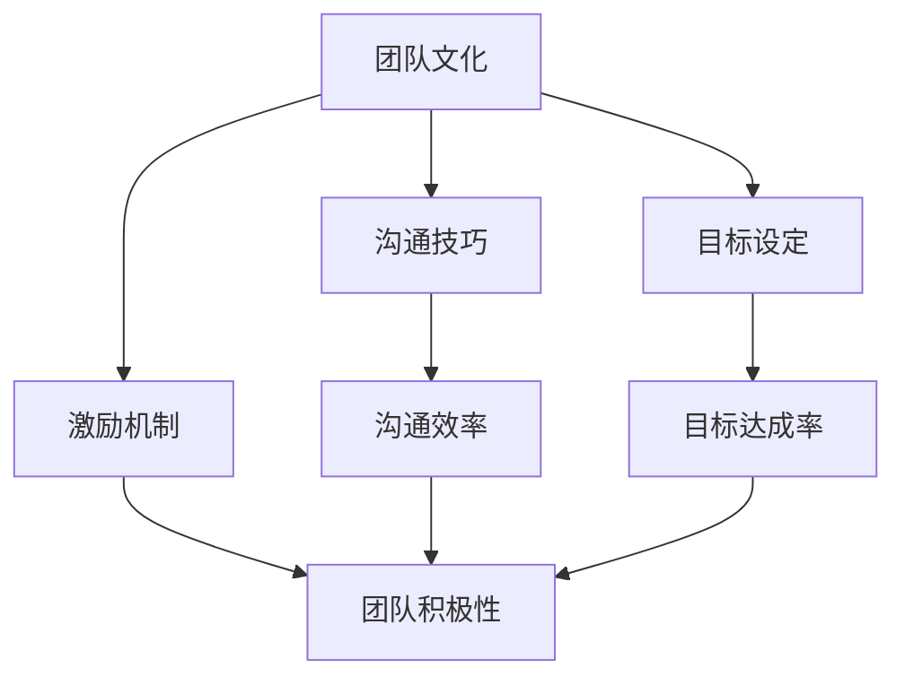

                 


为了撰写一篇符合要求的远程团队激励技术博客，我们需要按照以下步骤进行思考和分析：

### 第一步：文章标题和关键词

- **文章标题**：《远程团队激励：保持分散团队积极性的技巧》
- **关键词**：远程团队、激励、积极性、技巧、团队文化、沟通、目标设定、奖励机制、数据驱动、反馈机制

### 第二步：摘要

摘要部分需要简明扼要地概括文章的核心内容和主题思想：

> 本篇文章将深入探讨远程团队激励的关键技巧，包括团队文化、沟通、目标设定、奖励机制和反馈机制。通过实际案例和详细讲解，我们将提供实用的策略和方法，帮助团队领导者保持分散团队的积极性。

### 第三步：目录大纲设计

根据文章主题和关键词，设计合理的目录大纲。目录大纲应包含以下章节：

#### 第1章 引言：远程团队激励的重要性
- 1.1 远程工作现状分析
- 1.2 激励对远程团队的影响
- 1.3 本书结构概述

#### 第2章 核心概念与架构
- 2.1 远程团队文化建设
- 2.2 沟通技巧提升
- 2.3 目标设定与跟进

#### 第3章 激励机制设计
- 3.1 奖励与认可
- 3.2 贡献度评估

#### 第4章 个性化激励策略
- 4.1 成长激励
- 4.2 工作生活平衡

#### 第5章 数据驱动激励
- 5.1 数据分析工具与应用
- 5.2 基于数据的个性化激励

#### 第6章 持续改进与反馈
- 6.1 激励效果的评估
- 6.2 反馈机制建设

#### 第7章 未来展望
- 7.1 远程团队激励的新趋势
- 7.2 总结与反思

#### 附录
- 附录A：远程团队激励工具推荐
- 附录B：远程团队激励案例分析

### 第四步：核心概念与架构

在撰写每一章节时，我们需要明确核心概念和架构，并通过Mermaid流程图展示概念之间的关系。

例如，在第2章“核心概念与架构”中，我们可以设计以下流程图：



### 第五步：核心算法原理讲解

对于涉及算法的部分，我们需要使用伪代码详细阐述其原理。例如：

```plaintext
// 伪代码：目标设定算法
function setGoal(member, target, deadline) {
    if (member.hasPreviousAchievements) {
        if (target.isChallengingBut achievable) {
            member.setNewGoal(target);
            member.setDeadline(deadline);
            return "Goal set successfully!";
        } else {
            return "Target is unrealistic.";
        }
    } else {
        return "Member does not have previous achievements.";
    }
}
```

### 第六步：数学模型和公式

在适当章节引入数学模型和公式，并使用LaTeX格式进行详细讲解。例如：

```latex
$$
\text{Motivation Level} = f(\text{Reward}, \text{Challenge}, \text{Feedback})
$$

$$
f(\text{Reward}, \text{Challenge}, \text{Feedback}) = \frac{\text{Reward}}{\text{Challenge}} + \text{Feedback}
$$
```

### 第七步：项目实战与代码解读

设计实际项目案例，提供代码实现，并对关键代码进行解读与分析。例如：

```java
// Java代码：贡献度评估
public class ContributionAssessment {
    public int calculateContribution(Employee employee) {
        int contributions = 0;
        contributions += employee.getCompletedTasks();
        contributions += employee.getQualityAssessment();
        contributions += employee.getTeamFeedback();
        return contributions;
    }
}
```

### 第八步：总结与展望

在文章末尾，撰写总结与展望，回顾书籍主要内容，并展望未来发展方向。

### 第九步：确保字数限制

对整个目录大纲进行审查，确保总字数在8000～12000字之间。

### 第十步：格式化输出

使用Markdown格式输出文章内容，确保格式统一，便于阅读。

完成上述步骤后，我们可以开始撰写详细的博客文章，确保每个部分都包含丰富的内容，深入分析远程团队激励的各个方面，为读者提供实用的指导和策略。

