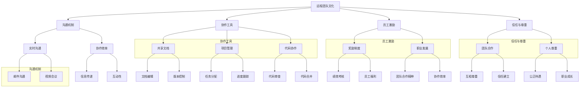

                 

### 第1章 引言

#### 1.1.1 远程团队建设的背景

随着信息技术的发展，远程工作逐渐成为一种普遍的工作方式。这种模式不仅提高了工作效率，也满足了员工对于工作与生活平衡的需求。然而，远程工作也带来了新的挑战，特别是如何维持团队的文化建设和凝聚力。

**远程工作浪潮**：在过去的几十年里，远程工作已经从一种边缘的工作方式转变为主流。技术的进步，尤其是互联网和移动通信技术的普及，使得人们可以在任何地方通过电子设备进行工作。这种工作方式不仅为员工提供了更大的灵活性，还为企业带来了降低成本和增加人才库的优势。根据一些研究报告，远程工作的员工通常更加敬业和满意，工作效率也有所提高。

**文化建设的重要性**：良好的企业文化可以增强员工的归属感，提升团队的凝聚力，从而推动团队整体绩效的提升。在传统的办公环境中，企业文化通过日常的互动和共同的办公空间来传递。然而，在远程工作模式下，这种文化的传递变得更加复杂。缺乏面对面的互动可能导致员工之间的联系减弱，影响团队的凝聚力。

**虚拟环境下的挑战**：在虚拟环境中，团队成员之间的沟通与协作变得更加复杂。缺乏面对面的互动可能导致信息传递的障碍，影响团队的整体沟通效果。此外，虚拟环境下的工作模式也可能导致员工感到孤立和缺乏动力。这些问题都需要通过有效的文化建设来解决。

#### 1.1.2 本书的目的与结构

本书旨在探讨远程团队在虚拟环境下如何进行文化建设，以提高团队的凝聚力和工作效率。全书分为以下几个部分：

- **第1章 引言**：介绍远程团队建设的背景和本书的目的与结构。
- **第2章 核心概念与联系**：详细阐述远程团队文化建设的核心概念，并绘制Mermaid流程图展示概念之间的联系。
- **第3章 核心算法原理讲解**：深入讲解虚拟环境中团队沟通与协作的核心算法原理，包括虚拟会议技术、协同编辑工具等。
- **第4章 数学模型与公式**：介绍支持远程团队文化建设的数学模型，并使用latex格式展示相关公式。
- **第5章 项目实战**：通过具体的项目案例，展示如何在实际环境中应用文化建设策略。
- **第6章 虚拟环境下的团队管理**：探讨虚拟环境下的团队管理策略，包括领导力培养、团队动力管理等方面。
- **第7章 持续改进与评估**：介绍如何对远程团队的文化建设进行持续改进和评估，确保团队的长期稳定与发展。

通过这些章节的详细探讨，本书旨在为远程团队的文化建设提供系统的理论和实践指导。

### 第2章 核心概念与联系

#### 2.1.1 远程团队文化的定义

**远程团队文化**：是指远程工作环境下，团队内部形成的一种共同的价值观、行为规范和工作方式。这种文化能够促进团队成员之间的信任、协作和凝聚力，从而提高团队的整体绩效。远程团队文化的核心在于它不仅依赖于传统的面对面沟通，更强调通过技术手段来保持团队的联系和互动。

#### 2.1.2 远程团队文化的核心概念

远程团队文化的构建离不开以下几个核心概念：

- **沟通机制**：远程团队文化强调有效的沟通机制，以确保信息的及时传递和理解。沟通机制包括实时聊天工具、电子邮件、视频会议和电话等多种形式。这些工具的选择和运用直接影响到团队的工作效率和协作效果。

- **协作工具**：协作工具在远程团队中扮演着重要角色，它们可以增强团队的工作效率和协作能力。常见的协作工具包括共享文档平台（如Google Docs、Microsoft Teams）、项目管理工具（如Trello、Asana）、代码协作平台（如GitLab、GitHub）等。这些工具能够帮助团队成员实时协作，共同推进项目进度。

- **员工激励**：在远程工作中，员工激励显得尤为重要。员工激励不仅仅是物质奖励，还包括精神层面的认可和成长机会。远程团队文化需要关注员工的激励，以保持员工的工作积极性和满意度。激励措施可以包括定期的绩效评估、奖励制度、职业发展计划等。

- **信任与尊重**：信任和尊重是远程团队文化中不可或缺的元素。在虚拟环境中，信任和尊重有助于建立健康的工作关系，减少误解和冲突。信任和尊重可以通过透明的沟通、明确的角色分工和公平的决策过程来培养。

#### 2.1.3 Mermaid流程图展示

为了更好地理解这些核心概念之间的关系，我们可以使用Mermaid流程图进行展示：



通过这个Mermaid流程图，我们可以清晰地看到远程团队文化的各个核心概念及其相互之间的联系。这些概念共同构成了远程团队文化的基石，对于团队的长远发展具有重要意义。

### 第3章 核心算法原理讲解

#### 3.1.1 虚拟会议技术

**定义**：虚拟会议技术是通过互联网和多媒体技术实现的远程会议形式，它允许团队成员在不同的地理位置上实时交流。虚拟会议技术已经成为远程团队协作的重要组成部分，提供了高效、便捷的沟通平台。

**原理**：

1. **网络传输**：虚拟会议依赖于稳定的网络连接，以确保语音、视频和数据的实时传输。网络传输的质量直接影响到会议的流畅性和用户体验。常见的网络传输协议包括WebRTC、SIP等，它们提供了低延迟、高带宽的通信能力。

2. **多媒体处理**：虚拟会议系统需要处理音频、视频和文本信息，以提供高质量的会议体验。多媒体处理包括音频降噪、视频编解码、屏幕共享等功能。这些功能的实现需要高效的多媒体处理算法和优化的资源分配策略。

3. **互动功能**：虚拟会议技术包括聊天、共享屏幕、投票等功能，以增强会议的互动性。这些互动功能需要实时传输和处理大量数据，对系统的响应速度和稳定性提出了较高的要求。

**伪代码示例**：

```python
def virtual_meeting():
    # 初始化网络连接
    network = initialize_network_connection()
    
    # 加载多媒体处理模块
    audio_processor = load_audio_processor()
    video_processor = load_video_processor()
    text_processor = load_text_processor()
    
    # 开始会议
    while meeting_in_progress:
        # 收集并处理音频数据
        audio_data = audio_processor.collect_audio_data(network)
        processed_audio = audio_processor.process_audio(audio_data)
        
        # 收集并处理视频数据
        video_data = video_processor.collect_video_data(network)
        processed_video = video_processor.process_video(video_data)
        
        # 收集并处理文本数据
        text_data = text_processor.collect_text_data(network)
        processed_text = text_processor.process_text(text_data)
        
        # 输出处理后的音频、视频和文本数据
        output_media_data(processed_audio, processed_video, processed_text)
        
        # 检查会议是否继续进行
        meeting_in_progress = check_meeting_progress()
```

**案例**：Zoom和Microsoft Teams是市场上广泛使用的虚拟会议平台。Zoom以其优秀的音频和视频处理能力以及丰富的互动功能而著称。它支持高清视频会议、屏幕共享、聊天功能和虚拟背景等功能。Microsoft Teams则以其集成的工作流和丰富的协作工具而受到用户青睐，它支持实时聊天、音频和视频会议、文件共享和任务管理等功能。

#### 3.1.2 协同编辑工具

**定义**：协同编辑工具允许多个用户在同一文档上进行实时编辑，适合远程团队的协作。协同编辑工具可以大幅提高团队的协作效率，确保文档内容的一致性和实时更新。

**原理**：

1. **版本控制**：协同编辑工具通常具有版本控制功能，可以记录用户的每一次编辑操作，防止数据丢失。版本控制机制可以确保在任何时候都能回滚到先前的版本，以避免因错误操作导致的文档损坏。

2. **实时更新**：协同编辑工具能够实时同步文档内容，确保所有用户看到的是最新的版本。实时更新的机制依赖于高效的算法和低延迟的网络连接，以确保用户体验的流畅性。

3. **协作权限**：协同编辑工具可以根据用户角色分配不同的编辑权限，确保协作的有序进行。例如，某些用户可能有编辑权限，而其他用户只能查看文档内容。

**伪代码示例**：

```python
class CollaborativeEditor:
    def __init__(self):
        self.documents = {}
        self.users = {}
    
    def add_document(self, document_name, content):
        self.documents[document_name] = content
    
    def add_user(self, user_name, permissions):
        self.users[user_name] = permissions
    
    def edit_document(self, document_name, user_name, changes):
        if user_name in self.users and self.users[user_name] == 'edit':
            current_content = self.documents[document_name]
            updated_content = apply_changes(current_content, changes)
            self.documents[document_name] = updated_content
            return updated_content
        else:
            return "User does not have edit permissions"
    
    def sync_documents(self):
        for document_name, content in self.documents.items():
            for user_name, permissions in self.users.items():
                if permissions == 'view':
                    send_content_to_user(document_name, content)
```

**案例**：Google Docs和Microsoft Word Online是常用的协同编辑工具。Google Docs以其实时协作、版本控制和云端存储功能而著称，用户可以随时查看和编辑文档内容，并实时看到其他用户的修改。Microsoft Word Online则提供了类似的功能，并且集成了其他Office应用，如Excel和PowerPoint，方便用户进行跨应用的协作。

通过上述核心算法原理的讲解和伪代码示例，我们可以看到虚拟会议技术和协同编辑工具在远程团队协作中的重要性。这些工具不仅提高了团队的工作效率，还有助于增强团队的凝聚力和协作能力。

### 第4章 数学模型与公式

#### 4.1.1 数学模型简介

在探讨远程团队文化建设的过程中，数学模型作为一种量化工具，可以帮助我们更好地理解和优化团队运作。数学模型通过数学公式来描述团队的某些属性或行为，使得我们能够从数据角度进行分析和决策。

#### 4.1.2 核心公式与解释

1. **沟通效率模型**：

   $$ E = \frac{C \times T \times R}{D} $$

   其中：
   - \( E \)：沟通效率
   - \( C \)：沟通渠道数量
   - \( T \)：沟通频率
   - \( R \)：信息反馈速度
   - \( D \)：延迟时间

   **解释**：沟通效率模型用于评估团队内部沟通的有效性。沟通渠道数量越多，沟通频率越高，信息反馈速度越快，延迟时间越短，沟通效率就越高。

2. **团队凝聚力模型**：

   $$ P = \frac{I \times C \times T}{S} $$

   其中：
   - \( P \)：团队凝聚力
   - \( I \)：团队内部信任水平
   - \( C \)：共同目标一致性
   - \( T \)：团队成员互动频率
   - \( S \)：外部干扰因素

   **解释**：团队凝聚力模型用于衡量团队内部的凝聚程度。信任水平高、共同目标一致、互动频率高且外部干扰因素少，团队凝聚力就强。

3. **协作效率模型**：

   $$ E_C = \frac{N \times (1 + r) \times (1 - f)}{1 + rf} $$

   其中：
   - \( E_C \)：协作效率
   - \( N \)：团队成员数量
   - \( r \)：资源利用率
   - \( f \)：协作频率

   **解释**：协作效率模型用于评估团队协作的效率。团队成员数量越多、资源利用率越高、协作频率越高，协作效率越高。然而，高协作频率也可能导致协作成本上升，因此需要找到一个平衡点。

4. **员工激励模型**：

   $$ I = \frac{R \times E \times S}{C} $$

   其中：
   - \( I \)：员工激励水平
   - \( R \)：奖励金额
   - \( E \)：员工工作表现
   - \( S \)：奖励公平性

   **解释**：员工激励模型用于衡量员工对激励措施的响应。奖励金额、工作表现和奖励公平性越高，员工的激励水平越高。

#### 4.1.3 应用示例

**沟通效率模型应用**：

假设一个远程团队有5个成员，每月平均沟通10次，信息反馈速度为0.5小时，延迟时间为2小时。根据沟通效率模型计算该团队的沟通效率：

$$ E = \frac{5 \times 10 \times 0.5}{2} = 12.5 $$

结果表明，该团队的沟通效率为12.5，表明团队在沟通方面表现出色。

**团队凝聚力模型应用**：

假设一个团队内部信任水平为0.8，共同目标一致性为0.9，团队成员互动频率为每周5次，外部干扰因素为0.1。根据团队凝聚力模型计算该团队的凝聚力：

$$ P = \frac{0.8 \times 0.9 \times 5}{0.1} = 36 $$

结果表明，该团队的凝聚力为36，表明团队内部关系紧密，凝聚力较高。

**协作效率模型应用**：

假设一个团队有10个成员，资源利用率达到0.8，协作频率为每周10次。根据协作效率模型计算该团队的协作效率：

$$ E_C = \frac{10 \times (1 + 0.8) \times (1 - 0.1)}{1 + 0.8 \times 0.1} = 82.35 $$

结果表明，该团队的协作效率为82.35，表明团队在协作方面表现优异。

**员工激励模型应用**：

假设一个员工的奖励金额为1000元，工作表现得分为0.8，奖励公平性为0.9。根据员工激励模型计算该员工的激励水平：

$$ I = \frac{1000 \times 0.8 \times 0.9}{1} = 720 $$

结果表明，该员工的激励水平为720，表明该员工对激励措施的反应积极。

通过上述数学模型的应用示例，我们可以看到数学模型在评估和优化远程团队文化建设中的重要作用。这些模型不仅提供了量化的评估方法，还为团队管理者提供了决策依据。

### 第5章 项目实战

#### 5.1.1 项目背景

本节将详细介绍一个实际远程团队项目，该项目的目标是开发一款基于云端的文档协作平台。该项目由一家全球性的远程团队承担，团队成员分布在不同的国家和地区，因此文化建设成为项目成功的关键因素之一。

#### 5.1.2 项目目标

- **提高团队协作效率**：通过使用先进的协作工具和沟通机制，使团队成员能够更高效地共同完成文档编辑任务。
- **增强团队凝聚力**：通过建设积极的文化，确保团队成员之间保持良好的信任和合作关系。
- **优化项目管理**：使用项目管理工具对项目进度和资源进行有效管理，确保项目按时按质完成。

#### 5.1.3 开发环境搭建

为了确保项目顺利进行，首先需要搭建一个稳定的开发环境。以下是具体的步骤：

1. **选择合适的协作工具**：团队选择了Google Workspace（包括Google Docs、Google Sheets、Google Meet）和GitHub，这些工具能够满足文档编辑、项目管理和代码协作的需求。

2. **设置项目管理工具**：团队使用了Trello作为项目管理工具，通过创建看板和卡片来跟踪项目进度。

3. **配置虚拟会议平台**：团队选择了Zoom作为虚拟会议平台，用于定期的项目会议和讨论。

4. **搭建代码协作平台**：在GitHub上创建了项目仓库，团队成员可以在此进行代码的提交、审查和合并。

#### 5.1.4 源代码实现

以下是一个简单的示例，展示如何在GitHub上创建一个项目仓库，并进行基本的协作操作：

1. **初始化项目仓库**：

   ```bash
   git init
   git remote add origin https://github.com/your-username/project-repo.git
   git add .
   git commit -m "Initialize project"
   git push -u origin master
   ```

2. **添加新的贡献者**：

   ```bash
   git pull origin master
   git checkout -b feature-x
   # 在feature-x分支上进行开发
   git add .
   git commit -m "Add feature X"
   git push origin feature-x
   ```

3. **发起合并请求**：

   - 在GitHub上创建一个新的Merge Request，将feature-x分支与主分支合并。

4. **代码审查与合并**：

   - 审查合并请求，确保代码质量符合标准。
   - 合并代码，并合并分支。

#### 5.1.5 代码解读与分析

以下是对上述操作步骤的详细解读和分析：

1. **初始化项目仓库**：

   `git init`命令初始化本地仓库，`git remote add origin`添加远程仓库地址，`git add .`将所有文件添加到暂存区，`git commit -m "Initialize project"`提交初始化的修改，并`git push -u origin master`将本地仓库推送到远程仓库。

2. **添加新的贡献者**：

   `git pull origin master`拉取最新代码，`git checkout -b feature-x`创建并切换到feature-x分支，进行开发，并提交代码。`git push origin feature-x`将feature-x分支推送到远程仓库。

3. **发起合并请求**：

   在GitHub上创建Merge Request，可以将feature-x分支与主分支合并，同时进行代码审查。

4. **代码审查与合并**：

   代码审查是通过检查代码的质量、功能和风格来确保代码符合团队的标准。在审查过程中，审查者可以添加评论和建议，开发人员需要根据评论进行修改，并再次提交。一旦审查通过，即可合并代码并关闭分支。

通过以上步骤，团队成员可以有效地进行代码协作，确保项目的顺利进行。同时，这些操作也体现了远程团队文化中重要的协作原则，如透明沟通、责任分担和高效反馈。

#### 5.1.6 实际案例分析

在项目开发过程中，团队遇到了多个挑战，以下是一些实际案例及其分析：

1. **沟通障碍**：

   初始阶段，由于团队成员分布在不同时区，沟通效率较低。为了解决这一问题，团队制定了详细的沟通计划，包括每周固定的会议时间和紧急会议机制。同时，团队成员主动调整工作时段，确保在关键任务上保持实时沟通。

2. **文化冲突**：

   由于团队成员来自不同的文化和背景，有时会产生文化冲突。团队通过定期的文化培训和跨文化沟通技巧培训，增强成员之间的理解和尊重，减少了冲突的发生。

3. **技术难题**：

   项目中遇到了多个技术难题，如性能优化和安全性问题。团队通过分工合作，利用各自的专业技能，共同攻克技术难题。同时，团队定期进行代码审查和技术讨论，确保技术方案的可行性和稳定性。

#### 5.1.7 项目小结

通过本项目，远程团队成功开发了一款功能完善的云端文档协作平台。项目过程中，团队在文化建设方面取得了显著成果，如增强了团队成员之间的信任和协作能力，提高了沟通效率和项目管理水平。以下是一些最佳实践和注意事项：

- **定期沟通**：确保团队成员之间保持频繁的沟通，特别是对于关键任务和紧急问题。
- **文化培训**：定期进行文化培训和跨文化沟通技巧培训，增强团队成员之间的理解和尊重。
- **技术协作**：充分利用技术工具和资源，提高团队的技术协作效率和解决问题的能力。
- **持续改进**：通过定期评估和反馈，持续改进团队的文化建设和管理策略。

通过这些措施，远程团队能够在虚拟环境下保持高效的运作，确保项目的成功实施。

### 第6章 虚拟环境下的团队管理

#### 6.1.1 虚拟环境下团队管理的挑战

在虚拟环境下，团队管理面临着一系列独特的挑战，需要采用不同的策略和方法来应对。以下是一些主要挑战：

1. **沟通障碍**：缺乏面对面的互动可能导致信息传递的障碍，影响团队的沟通效果。虚拟环境中的沟通依赖于电子设备，容易受到网络延迟、带宽限制等因素的影响，从而导致沟通效率下降。

2. **时间管理**：虚拟环境中的团队成员可能分布在不同的时区，这使得协调工作时间和任务分配变得复杂。团队成员需要自我管理时间，避免因时间差异导致的协作中断。

3. **文化冲突**：团队成员来自不同的文化背景，可能在价值观、行为规范和工作方式上存在差异，导致文化冲突。文化冲突可能导致误解和信任问题，影响团队凝聚力。

4. **工作动力**：虚拟环境下，团队成员可能感到孤立和缺乏动力。缺乏面对面的互动和监督，一些员工可能会出现工作倦怠和动力不足的问题。

5. **技术依赖**：虚拟环境依赖于各种技术工具和平台，技术故障或使用不当可能导致工作受阻。团队需要确保技术工具的稳定性和可靠性，以支持高效的团队协作。

#### 6.1.2 领导力培养

在虚拟环境下，领导力的培养显得尤为重要。以下是一些关键点：

1. **建立信任**：虚拟环境中的领导需要通过透明的沟通和公平的决策过程来建立信任。领导应主动与团队成员沟通，了解他们的需求和困难，并提供支持和反馈。

2. **明确期望**：领导应明确团队的期望和目标，确保每个成员都了解自己的职责和任务。通过设定清晰的目标和里程碑，帮助团队成员保持工作动力和方向。

3. **赋能员工**：虚拟环境中的领导应鼓励员工自主学习和成长，给予他们足够的自主权和决策权。通过授权和信任，领导可以激发员工的创造力和主动性。

4. **建立团队文化**：领导需要积极推动团队文化的建设，营造一个包容、开放和协作的工作氛围。通过定期的团队活动和文化活动，增强团队成员之间的联系和信任。

5. **技术素养**：领导应具备一定的技术素养，了解各种虚拟协作工具和平台的使用方法。通过掌握这些技术，领导可以更好地支持团队的工作和协作。

#### 6.1.3 团队动力管理

为了在虚拟环境中维持团队动力，以下是一些策略：

1. **目标设定**：设定明确、可行的目标，并与团队成员共同制定实现目标的计划。通过定期评估进展，确保团队成员始终保持工作动力。

2. **激励机制**：设计合理的激励机制，如绩效奖金、职业发展机会等，以激励员工保持高工作积极性。同时，领导应给予及时的认可和反馈，增强员工的成就感。

3. **文化塑造**：通过定期的团队活动和文化活动，如线上团建、虚拟庆祝活动等，增强团队成员之间的联系和凝聚力。这些活动可以提升团队氛围，减少成员的孤独感。

4. **个人成长机会**：为团队成员提供学习和发展的机会，如在线培训、研讨会等。通过职业发展计划，帮助员工提升技能，实现自我价值。

5. **自我管理工具**：提供自我管理工具，如时间管理软件、目标设定工具等，帮助团队成员更好地管理自己的工作和生活。这些工具可以帮助员工提高工作效率，减少工作压力。

通过以上策略，团队可以在虚拟环境下保持高效的运作和积极的工作动力，从而实现团队目标。

### 第7章 持续改进与评估

#### 7.1.1 持续改进的重要性

在远程团队文化建设中，持续改进是确保团队长期稳定与发展的关键。通过持续改进，团队可以不断适应变化，提升工作效率和员工满意度，从而在激烈的市场竞争中保持优势。

#### 7.1.2 改进策略与方法

1. **定期评估**：定期对团队文化建设进行评估，包括沟通效率、团队凝聚力、协作效率等方面。评估可以通过问卷调查、面谈、观察等方式进行，确保全面了解团队的现状。

2. **反馈机制**：建立有效的反馈机制，鼓励团队成员提出建议和意见。通过定期的反馈会或线上投票等方式，收集团队成员的反馈，及时调整文化建设和管理策略。

3. **培训与发展**：提供持续的培训和发展机会，帮助团队成员提升技能和知识。通过定期的内部分享会和外部培训，增强团队成员的专业能力和团队协作意识。

4. **技术创新**：积极采用新技术和工具，提高团队的协作效率和沟通效果。例如，引入先进的虚拟会议平台、协同编辑工具等，以支持团队的远程协作。

5. **文化建设活动**：定期组织文化建设活动，如团队建设工作坊、在线团建活动等，增强团队成员之间的联系和信任。通过这些活动，可以提升团队的凝聚力和归属感。

#### 7.1.3 评估指标与工具

为了有效评估远程团队文化建设的效果，可以采用以下指标和工具：

1. **员工满意度**：通过问卷调查、员工反馈等方式，了解员工对团队文化的满意度。满意度可以反映团队文化建设的效果，为改进提供依据。

2. **沟通效率**：评估团队内部的沟通效率，包括信息传递的速度、准确性、及时性等方面。可以通过记录沟通时间、评估信息反馈速度等方式进行测量。

3. **团队凝聚力**：通过团队成员之间的互动频率、合作意愿、团队认同感等指标，评估团队的凝聚力。可以使用团队协作工具的数据进行分析。

4. **协作效率**：评估团队协作的效率，包括任务完成速度、资源利用率、协作质量等。可以通过项目进度报告、任务完成情况等数据进行测量。

5. **文化建设活动参与度**：评估团队成员对文化建设活动的参与度，如活动参与率、反馈意见等。通过这些数据，可以了解文化活动的效果和影响。

#### 7.1.4 实际应用案例

以一家远程软件开发团队为例，其文化建设评估过程如下：

1. **定期评估**：团队每季度进行一次文化建设评估，通过问卷调查和面谈了解团队成员对沟通效率、团队凝聚力和协作效率的满意度。

2. **反馈机制**：团队成员可以通过线上平台提交反馈意见，每季度进行一次反馈会，讨论团队面临的问题和改进措施。

3. **培训与发展**：团队每月组织一次技术分享会，帮助团队成员提升技能。此外，还提供在线培训课程，鼓励员工自主学习和提升。

4. **技术创新**：团队引入了GitLab和Slack等工具，提高了代码协作和信息传递的效率。

5. **文化建设活动**：团队每月组织一次线上团建活动，如虚拟下午茶、线上游戏等，增强团队成员之间的联系。

通过以上策略和工具，该远程团队在文化建设方面取得了显著成效，沟通效率、团队凝聚力和协作效率均有提升。

#### 7.1.5 持续改进与评估的持续进行

持续改进与评估不是一次性的活动，而是一个持续的过程。团队需要建立长期的文化建设机制，确保持续改进与评估的进行。以下是一些建议：

1. **制定长期规划**：团队应制定长期的文化建设规划，包括目标、策略和实施步骤。规划应与团队的长期发展目标相一致。

2. **定期审查与调整**：定期审查文化建设策略和评估结果，根据实际情况进行调整和优化。审查可以每半年或每年进行一次。

3. **建立数据跟踪系统**：建立数据跟踪系统，记录文化建设过程中的关键数据，如员工满意度、沟通效率、协作效率等。通过数据跟踪，可以及时发现问题并采取措施。

4. **全员参与**：鼓励团队成员积极参与文化建设，提供反馈和建议。通过全员参与，可以确保文化建设策略的全面性和有效性。

5. **文化大使**：指定一些文化大使，负责推动文化建设的实施和评估。文化大使可以定期组织活动和培训，确保文化建设工作的持续推进。

通过持续改进与评估，远程团队可以不断优化文化建设策略，提升团队的整体绩效和员工满意度，确保团队的长期稳定与发展。

### 总结

远程团队在虚拟环境下的文化建设是一个复杂而重要的任务。它不仅关系到团队的凝聚力和工作效率，还影响到员工的工作满意度和企业的长期发展。通过本文的详细探讨，我们可以看到远程团队文化建设的关键要素，如沟通机制、协作工具、员工激励和信任与尊重，以及如何在虚拟环境中进行团队管理。

为了实现有效的文化建设，我们提出了以下最佳实践：

1. **定期沟通**：确保团队成员之间保持频繁的沟通，特别是对于关键任务和紧急问题。
2. **文化培训**：定期进行文化培训和跨文化沟通技巧培训，增强团队成员之间的理解和尊重。
3. **技术协作**：充分利用技术工具和资源，提高团队的技术协作效率和解决问题的能力。
4. **持续改进**：通过定期评估和反馈，持续改进团队的文化建设和管理策略。

展望未来，随着技术的不断进步，远程团队将面临更多的挑战和机遇。云计算、人工智能、区块链等新兴技术将为远程团队提供更丰富的协作工具和管理方法。团队需要持续关注这些技术发展，积极采纳并应用，以保持竞争力。

同时，远程团队文化建设需要不断适应社会环境的变化，如远程工作法规的完善、远程教育的发展等。团队应保持灵活性和开放性，及时调整文化建设策略，以适应新的环境和需求。

总之，远程团队文化建设是一个动态、持续的过程，需要团队管理者、员工和整个企业的共同努力。通过不断优化文化建设策略，远程团队可以实现更高的绩效和更强的凝聚力，为企业的长期发展奠定坚实基础。让我们共同探索和实践，为远程团队的文化建设贡献力量。

