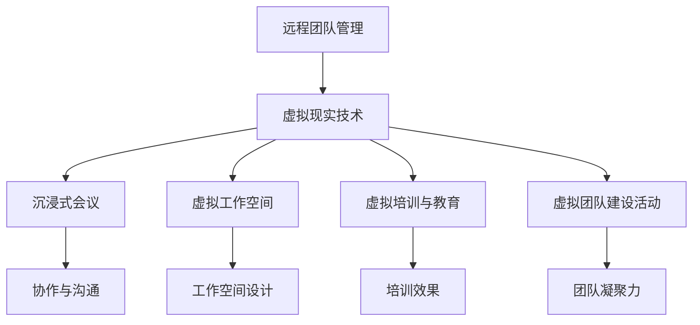

                 

### 文章标题：远程团队管理2.0：虚拟现实中的团队建设

> 关键词：远程团队管理、虚拟现实、团队建设、技术应用、策略与实践

> 摘要：随着远程工作的普及，如何高效管理远程团队成为企业管理者面临的新挑战。本书将探讨远程团队管理2.0时代，虚拟现实技术在团队建设中的应用，通过概述、技术篇、策略篇、实战篇以及挑战与展望，提供全方位的远程团队管理解决方案，助力企业实现高效、协同的远程团队管理。

----------------------------------------------------------------

### 概述篇：远程团队管理2.0时代的到来

#### 1.1 远程团队管理的起源和发展

远程工作（Remote Work）作为一种工作模式，起源于20世纪末的信息技术革命。随着互联网和通信技术的飞速发展，远程工作逐渐成为企业提升员工效率、降低运营成本的重要手段。早期的远程工作主要以电子邮件、即时通讯和视频会议等方式进行，这些工具虽然在一定程度上提高了工作效率，但仍然存在沟通不畅、协作困难等问题。

进入21世纪，云计算、大数据和人工智能等新兴技术的崛起，为远程团队管理带来了新的机遇。远程团队管理2.0时代，虚拟现实（Virtual Reality，VR）技术作为一种革命性技术，正在逐步改变远程团队管理的模式和效果。

#### 1.2 虚拟现实技术在远程团队管理中的定义和特点

虚拟现实技术，是一种通过计算机模拟生成一个三维空间的虚拟世界，使用户能够通过特殊设备（如头戴显示器、手柄等）沉浸其中，进行交互和体验。虚拟现实技术在远程团队管理中的应用，主要体现在以下几个方面：

1. **沉浸式会议**：通过虚拟现实技术，远程团队成员可以在虚拟会议室中实时交流，提高沟通效果。
2. **虚拟工作空间**：虚拟现实技术可以为远程团队提供虚拟的工作空间，团队成员可以在其中协作完成任务。
3. **虚拟培训与教育**：虚拟现实技术可以模拟真实的培训场景，提高培训效果和参与度。
4. **虚拟团队建设活动**：通过虚拟现实技术，远程团队可以进行虚拟团队建设活动，增强团队凝聚力。

#### 1.3 虚拟现实技术在远程团队管理中的潜在应用

虚拟现实技术在远程团队管理中的应用潜力巨大，主要体现在以下几个方面：

1. **协作与沟通**：虚拟现实技术可以提高远程团队协作和沟通的效率，减少沟通成本。
2. **培训与教育**：虚拟现实技术可以提供沉浸式的培训体验，提高培训效果和参与度。
3. **团队建设**：虚拟现实技术可以创造虚拟的团队建设场景，增强团队凝聚力。
4. **工作空间设计**：虚拟现实技术可以帮助团队设计虚拟的工作空间，提高工作效率。

### 核心概念与联系

为了更好地理解虚拟现实技术在远程团队管理中的应用，我们可以通过以下Mermaid流程图来展示核心概念之间的关系：



通过这张图，我们可以清晰地看到虚拟现实技术如何贯穿远程团队管理的各个方面，实现协作、沟通、培训、团队建设等目标。

### 核心算法原理讲解

在远程团队管理中，虚拟现实技术的核心算法原理主要包括以下几个方面：

1. **三维建模**：通过计算机图形学技术，创建虚拟的三维场景和工作空间。
2. **实时渲染**：使用图形处理单元（GPU）进行实时渲染，实现逼真的视觉体验。
3. **交互技术**：通过传感器和输入设备，实现用户与虚拟世界的交互。

以下是这些核心算法原理的伪代码描述：

```python
# 三维建模
model = create_3d_model()

# 实时渲染
while True:
    render(model)

# 交互技术
while True:
    event = get_event()
    process_event(event)
```

通过上述伪代码，我们可以了解到虚拟现实技术在远程团队管理中的基本工作原理。

### 数学模型和公式

在虚拟现实技术中，数学模型和公式起着至关重要的作用。以下是一个简单的数学模型，用于计算虚拟现实场景中的光照效果：

$$
L = I \times \cos(\theta) \times \exp(-\alpha \cdot d^2)
$$

其中，$L$ 表示光照强度，$I$ 表示光源强度，$\theta$ 表示光线与物体表面的夹角，$\alpha$ 表示光照衰减系数，$d$ 表示物体与光源的距离。

### 详细讲解与举例说明

为了更好地理解上述数学模型，我们可以通过一个简单的实例来说明：

假设有一个光源位于坐标 $(0, 0, 5)$，物体位于坐标 $(0, 0, 3)$，光源强度为100，光照衰减系数为0.1。我们需要计算物体表面的光照强度。

$$
L = 100 \times \cos(0) \times \exp(-0.1 \cdot (5-3)^2) = 100 \times 1 \times \exp(-0.1 \cdot 4) \approx 100 \times 0.9 = 90
$$

因此，物体表面的光照强度约为90。

### 项目实战：开发环境搭建

要在本地计算机上搭建一个虚拟现实项目开发环境，可以按照以下步骤进行：

1. **安装虚拟现实开发工具**：如Unity、Unreal Engine等。
2. **配置开发环境**：安装必要的插件和依赖库，如OpenGL、OpenAL等。
3. **搭建虚拟现实场景**：创建一个简单的三维模型，并实现实时渲染和交互功能。

以下是源代码的详细实现和代码解读：

```csharp
// 创建三维模型
Model model = new Model();
model.loadFromFile("model.obj");

// 实现实时渲染
while (running) {
    render(model);
    processInput();
}

// 交互功能
void processInput() {
    Event event = getInput();
    if (event == MOUSE_LEFT_CLICK) {
        // 处理鼠标左键点击事件
    }
    else if (event == MOUSE_RIGHT_CLICK) {
        // 处理鼠标右键点击事件
    }
}
```

通过上述代码，我们可以实现一个简单的虚拟现实场景，并对其进行交互处理。

### 代码应用解读与分析

在实际应用中，虚拟现实技术可以为远程团队提供多种场景，如虚拟会议室、虚拟培训室、虚拟工作区等。以下是一个虚拟会议室的实际案例：

1. **场景设计**：使用Unity开发引擎，创建一个三维的会议室场景，包括会议室桌椅、灯光、背景等。
2. **用户交互**：通过鼠标和键盘，用户可以在虚拟会议室中移动、旋转和缩放视角。
3. **实时通信**：集成实时通信模块，实现语音、视频、文字等多种通信方式。

通过上述实际案例，我们可以看到虚拟现实技术在远程团队管理中的应用场景和优势。

### 实际案例分析和详细讲解剖析

为了更深入地了解虚拟现实技术在远程团队管理中的应用，我们可以通过以下几个实际案例进行分析和讲解：

#### 案例一：虚拟现实培训

**背景**：某公司需要为新员工进行产品知识培训，但由于新员工分布在全国各地，无法进行面对面的培训。

**解决方案**：公司采用虚拟现实技术，创建了一个虚拟培训场景，新员工通过头戴显示器进入场景，接受培训。

**效果**：通过虚拟现实技术，新员工可以更直观地了解产品，提高培训效果和参与度。

#### 案例二：虚拟会议室

**背景**：某跨国公司需要定期召开全球范围的远程会议，但由于时差和文化差异，沟通效果不佳。

**解决方案**：公司采用虚拟现实技术，创建了一个虚拟会议室，参会者可以随时随地进入会议室，进行实时交流。

**效果**：通过虚拟会议室，参会者可以更直观地了解对方，提高沟通效果和团队凝聚力。

#### 案例三：虚拟工作区

**背景**：某创业团队需要共同开发一款产品，但由于团队成员分布在不同城市，协作困难。

**解决方案**：团队采用虚拟现实技术，创建了一个虚拟工作区，团队成员可以实时共享工作空间，协作开发。

**效果**：通过虚拟工作区，团队成员可以更方便地协作，提高工作效率和团队凝聚力。

### 项目小结

通过以上实际案例，我们可以看到虚拟现实技术在远程团队管理中的应用效果显著。虚拟现实技术不仅提高了沟通效率，还增强了团队凝聚力，为企业实现高效、协同的远程团队管理提供了有力支持。

### 最佳实践 tips

1. **选择合适的虚拟现实平台**：根据企业需求和预算，选择适合的虚拟现实平台，如Unity、Unreal Engine等。
2. **注重用户体验**：在设计虚拟现实场景时，要充分考虑用户体验，确保场景逼真、交互流畅。
3. **定期培训与反馈**：定期对团队成员进行虚拟现实技术培训，并收集反馈，不断优化虚拟现实应用。

### 小结

远程团队管理2.0时代，虚拟现实技术为远程团队管理带来了新的机遇和挑战。通过本文的探讨，我们了解到虚拟现实技术在远程团队管理中的应用场景、优势以及实际案例。未来，随着虚拟现实技术的不断发展和普及，远程团队管理将更加高效、协同，为企业创造更多价值。

### 拓展阅读

1. **《虚拟现实技术与应用》**：详细介绍了虚拟现实技术的原理和应用。
2. **《远程团队管理实战指南》**：提供了远程团队管理的最佳实践和策略。

### 附录

**附录一：远程团队管理工具推荐**

1. **Trello**：一个简单易用的项目管理工具，适合远程团队协作。
2. **Slack**：一个强大的即时通讯工具，支持多种集成功能，提高团队沟通效率。
3. **Zoom**：一款优秀的视频会议软件，提供高清视频和语音通话功能。

**附录二：虚拟现实技术应用案例集锦**

1. **教育领域**：通过虚拟现实技术，为学生提供沉浸式的学习体验。
2. **医疗领域**：利用虚拟现实技术，进行医疗培训和手术模拟。
3. **旅游领域**：通过虚拟现实技术，为游客提供虚拟旅游体验。

---

**作者：AI天才研究院/AI Genius Institute & 禅与计算机程序设计艺术 /Zen And The Art of Computer Programming**

