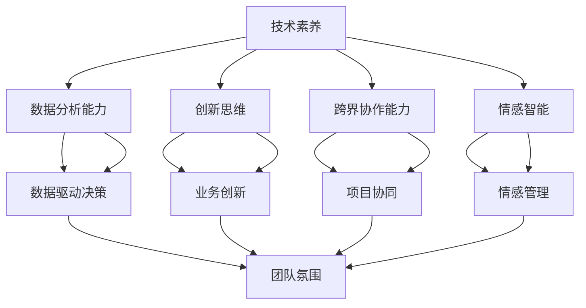
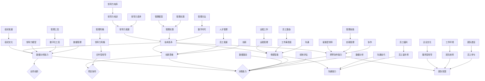

                 

### 关键词

- 远程团队管理
- 数字时代领导
- 领导挑战
- 远程协作
- 数字工具
- 领导力发展

### 摘要

本文深入探讨了数字时代远程团队管理的挑战与解决方案。首先，回顾了远程工作的历史与现状，分析了其发展趋势和组织文化影响。接着，详细介绍了数字时代领导力的核心概念、发展路径以及沟通能力的重要性。在此基础上，讨论了远程团队管理面临的挑战，如沟通协作和效率评估，并提出了一系列最佳实践。通过实例分析和项目实战，本文提供了具体的策略和方法，以帮助领导者应对远程团队管理中的挑战，最终展望了未来远程团队管理的方向。作者AI天才研究院及《禅与计算机程序设计艺术》的作者，以清晰的技术语言和逻辑思维，为读者提供了有深度和实用价值的技术博客。

## 引言

### 远程团队管理的背景与意义

远程团队管理在现代企业中变得越来越重要，这一趋势的兴起不仅源于全球化的加速，更受到技术进步特别是互联网和移动通信技术的推动。随着远程工作的普及，远程团队管理成为企业管理者必须面对的课题。

首先，从历史角度来看，远程工作并非一个全新的概念。早在20世纪末，随着互联网的兴起，远程办公开始逐渐成为一种流行的办公方式。然而，当时的技术水平和网络基础设施限制了远程工作的广泛应用。随着云计算、物联网和5G技术的发展，远程工作的条件得到了极大的改善，远程团队管理也逐渐成为企业管理的重要组成部分。

在数字时代，远程团队管理的意义主要体现在以下几个方面：

1. **提高工作效率**：远程工作使团队成员能够根据自身时间安排工作，减少了通勤时间，提高了工作效率。

2. **扩大人才选择范围**：远程团队不受地理位置限制，企业可以招聘来自全球各地的人才，从而提高了团队的多样性和创新能力。

3. **降低运营成本**：远程工作减少了企业对实体办公场所的需求，从而降低了租金、水电等运营成本。

4. **提升员工满意度**：灵活的工作时间和地点可以提升员工的幸福感和工作满意度，有助于留住优秀的员工。

然而，远程团队管理也面临着诸多挑战。首先，沟通和协作的障碍可能会影响团队的工作效率。远程团队成员之间的沟通往往依赖于电子邮件、即时通讯工具和视频会议，这些工具虽然便捷，但无法完全替代面对面的交流。其次，领导者在远程团队管理中需要具备更多的技能，如自我管理能力、跨文化沟通能力和技术熟练度等。

此外，远程团队管理还涉及到团队成员的心理调适和工作效率评估等问题。在远程工作中，员工可能面临孤独感和工作效率不稳定的问题，而领导者则需要找到有效的策略来激励和监督团队成员。

总的来说，远程团队管理在数字时代具有重要意义，但也需要企业领导者认真面对其带来的挑战，并采取有效的措施来应对。

### 数字时代的领导挑战

在数字时代，领导者的角色和职责发生了显著变化，这些变化不仅体现在技术层面，还涉及管理理念和组织文化的转变。首先，领导者的技术素养成为关键因素。随着数字化进程的加速，企业领导者必须熟悉并掌握各种数字工具和平台，例如云计算、大数据、人工智能等，以便更好地管理和利用这些技术资源。

其次，领导风格需要适应远程工作的特点。传统的集中式领导模式在远程团队中往往难以奏效，领导者需要更加注重授权和团队自主管理，以激发团队成员的创造力和主动性。这种转变要求领导者具备更高的沟通能力，尤其是在跨文化、跨时区的远程团队中，领导者需要能够有效地传达信息、建立信任和协调团队。

此外，领导者还需要关注团队成员的心理健康和情感需求。远程工作虽然提供了灵活性，但同时也可能导致员工感到孤独和缺乏社交互动，这可能会影响工作效率和团队士气。因此，领导者需要采取一系列措施来维护团队的情感联系，如定期的线上团队建设活动、一对一的员工关怀等。

再者，数字时代对领导力的要求也体现在数据驱动的决策能力上。领导者需要能够从海量数据中提取有价值的信息，并基于数据进行战略规划和业务决策。这不仅要求领导者具备一定的数据分析能力，还需要他们具备敏锐的洞察力和创新思维。

最后，领导者需要具备持续学习和适应变化的能力。在快速变化的数字时代，新的技术、新的商业模式和新的管理方法不断涌现，领导者必须保持学习的热情和开放的心态，才能在竞争中保持优势。

总的来说，数字时代的领导挑战是多方面的，领导者需要在技术素养、领导风格、心理健康、数据分析和学习适应等多个方面不断提升自我，以应对不断变化的远程团队管理环境。

## 第一部分：远程工作概述

### 第1章：远程工作的历史与现状

#### 1.1 远程工作的起源与发展

远程工作的概念最早可以追溯到20世纪末，当时互联网的兴起和电子邮件的普及使得远程办公成为可能。1995年，Sun Microsystems公司成为第一家允许员工在家办公的科技公司，这一举措标志着远程工作逐渐成为一种可行的办公方式。随后，随着网络技术的不断发展，远程工作的范围和形式也逐步扩大。

21世纪初，远程工作在全球范围内得到了更加广泛的应用。尤其是在美国，一些科技公司如微软、谷歌等开始大力推广远程办公，甚至设立了专门的远程工作部门。这种趋势在全球范围内迅速传播，越来越多的企业开始意识到远程工作的潜在优势，并逐步将其纳入企业运营策略中。

在中国，远程工作的兴起主要发生在2010年以后。随着互联网的普及和移动设备的广泛应用，越来越多的企业开始尝试远程办公。尤其是在2019年新冠疫情爆发后，远程工作迅速成为全球范围内的主要办公方式，远程工作的普及率大幅提升。许多企业纷纷采取远程办公措施，以保障员工的健康安全和企业的正常运营。

#### 1.2 远程工作的现状与趋势

根据《全球远程工作趋势报告》，全球远程工作的普及率正在不断提高。报告显示，2021年全球有34%的员工采用远程办公，而这一比例预计将在2025年达到49%。这一趋势表明，远程工作正在逐渐成为现代企业运营的一部分。

首先，远程工作的普及得益于技术的进步。云计算、视频会议、协同办公软件等技术的普及，使得远程工作变得更加便捷和高效。此外，5G网络的推广也为远程工作提供了更快速、更稳定的网络环境。

其次，远程工作的兴起也受到员工需求的推动。越来越多的员工希望能够在工作与生活之间找到更好的平衡，远程工作为他们提供了更多的时间和灵活性。此外，随着工作文化逐步开放和包容，员工对于远程工作的接受度和支持度也在不断提高。

#### 1.3 远程工作对组织文化的影响

远程工作不仅改变了员工的工作方式，也对组织文化产生了深远的影响。首先，远程工作促进了组织文化的转变。传统的组织文化往往强调集中和权威，而远程工作要求组织更加开放、灵活和信任。这种转变有助于构建更加平等和协作的工作环境。

其次，远程工作对团队协作提出了新的要求。在远程工作中，团队成员之间的沟通和协作更多地依赖于数字工具和平台。这要求团队具备更强的沟通能力和协作能力，同时也需要领导者具备更高的领导力和管理能力。

此外，远程工作对组织文化的影响还包括员工满意度和员工留存率。远程工作提高了员工的工作满意度和幸福感，有助于降低员工流失率。同时，远程工作也为企业带来了更多的人才选择机会，有助于提高企业的竞争力。

总的来说，远程工作在历史与现状中扮演了重要角色，其发展趋势和现状反映了技术进步和员工需求的结合。在未来的发展中，远程工作将继续对组织文化产生深远的影响，推动企业不断调整和优化其运营策略。

#### 1.4 数字时代远程工作的机遇与挑战

在数字时代，远程工作不仅带来了诸多机遇，也伴随着一系列挑战。以下是远程工作在数字时代面临的机遇与挑战：

**机遇：**

1. **灵活性与工作效率提升**：远程工作允许员工灵活安排工作时间和地点，有助于提高工作效率。员工可以在最适合自己的环境中工作，从而减少通勤时间，提升工作专注度。

2. **人才多样性**：远程工作打破了地域限制，企业可以招募来自全球各地的人才，增强团队的多样性。这种多样性有助于促进创新和跨文化合作，提升企业的竞争力。

3. **降低运营成本**：远程工作减少了企业对实体办公场所的需求，从而降低了租金、水电等运营成本。此外，员工无需每天通勤，也减少了相关开支。

4. **员工满意度和忠诚度提升**：远程工作提供了更多的灵活性和工作与生活的平衡，有助于提高员工的满意度和忠诚度。这有助于减少员工流失率，提高员工留存率。

**挑战：**

1. **沟通障碍**：远程工作依赖于数字工具进行沟通，这些工具虽然便捷，但无法完全替代面对面的交流。沟通障碍可能导致信息传递不畅，影响团队协作和工作效率。

2. **团队凝聚力下降**：远程工作可能导致团队成员之间缺乏面对面的互动，从而降低团队的凝聚力。这可能会影响团队合作和团队氛围。

3. **工作效率不稳定**：远程工作环境容易受到家庭、个人事务等干扰，可能导致工作效率不稳定。员工可能需要自我管理，以避免工作时间的分散。

4. **技术依赖性**：远程工作高度依赖网络和数字工具，一旦出现技术故障或网络安全问题，可能会严重影响工作进度和业务运营。

5. **领导与管理挑战**：远程团队管理对领导者的要求更高，领导者需要具备更强的远程管理技能和领导能力。领导者需要通过有效的策略和方法，激励和协调远程团队成员。

**解决方案：**

1. **加强沟通与协作**：采用高效的沟通工具和平台，确保团队成员能够及时、有效地沟通和协作。建立定期会议和汇报制度，以保持团队的沟通和互动。

2. **建立团队凝聚力**：通过定期的线上团队建设活动，增强团队成员之间的联系和信任。鼓励团队成员参与虚拟团队活动，促进团队凝聚力的提升。

3. **提高工作效率**：制定明确的工作目标和计划，确保员工能够高效完成任务。提供必要的培训和支持，帮助员工提高自我管理能力。

4. **确保技术支持**：建立完善的技术支持系统，确保远程工作的技术工具和平台稳定运行。加强网络安全措施，保护企业数据安全。

5. **提升领导力**：领导者需要不断提升自身能力，学会远程管理和领导。采用数字化管理工具，提高领导力和管理效率。

总之，数字时代的远程工作既带来了机遇，也伴随着挑战。企业需要通过有效的策略和方法，充分利用远程工作的优势，同时克服其带来的困难，以实现远程团队管理的成功。

### 第二部分：数字时代领导特点

### 第2章：数字时代领导力的核心概念

#### 2.1 数字时代领导力的定义

数字时代领导力是指领导者在新一代信息技术环境中，运用数字工具、数据分析和创新思维，推动团队和组织实现目标的能力。它不仅仅包括传统领导力的基本要素，如沟通能力、团队建设、决策能力等，还特别强调了对数字化技术的掌握和运用。

在数字时代，领导力不再仅仅依赖于个人魅力和权威，而是更多地依赖于技术素养、数据分析能力和创新精神。领导者需要能够理解和应用大数据、人工智能、云计算等前沿技术，从而提升组织的运营效率和创新能力。

#### 2.2 数字时代领导者的关键技能

1. **技术素养**：数字时代领导者需要具备扎实的技术素养，包括对各种数字工具和平台的熟练运用。这不仅有助于领导者更好地管理团队，还能促进创新和效率提升。

2. **数据分析能力**：数据是数字时代的重要资产，领导者需要能够从海量数据中提取有价值的信息，并基于数据分析做出明智的决策。数据分析能力是数字时代领导力的核心技能之一。

3. **创新思维**：数字时代变化快速，领导者需要具备创新思维，不断寻找新的机会和解决方案。创新思维不仅有助于应对变化，还能推动组织实现持续增长。

4. **跨界协作能力**：数字时代的工作往往需要跨部门、跨领域的协作。领导者需要能够搭建跨界合作平台，促进不同团队之间的有效沟通和协作。

5. **情感智能**：尽管数字工具可以帮助领导者实现远程管理和沟通，但面对面的互动和情感交流依然重要。情感智能可以帮助领导者更好地理解和激励团队成员，建立信任和合作关系。

#### 2.3 数字时代领导风格的变化

在数字时代，领导风格也在发生显著变化。传统领导风格往往强调集中控制和权威管理，而数字时代更加强调授权和团队合作。

1. **授权型领导**：数字时代领导者需要给予团队成员更多的自主权和决策权，鼓励他们创新和解决问题。这种领导风格有助于激发团队成员的创造力和主动性。

2. **赋能型领导**：领导者需要通过提供必要的资源和支持，帮助团队成员实现个人和团队目标。这种领导风格强调赋能和激励，有助于提升团队的整体效能。

3. **合作型领导**：数字时代的工作往往需要跨部门、跨领域的协作。领导者需要成为团队合作的中介，促进不同团队之间的沟通和协作。

4. **服务型领导**：领导者需要将团队成员的需求放在首位，为他们提供支持和帮助。服务型领导不仅关注团队的绩效，还关注团队成员的个人成长和职业发展。

#### 2.4 核心概念与联系

为了更好地理解数字时代领导力的核心概念及其联系，我们可以通过Mermaid流程图来展示这些概念之间的关系：



通过这个流程图，我们可以清晰地看到技术素养、数据分析能力、创新思维、跨界协作能力和情感智能这些核心概念如何相互联系，共同推动数字时代领导力的实现。

### 核心概念与联系（使用Mermaid流程图）

为了更好地理解数字时代领导力的核心概念及其联系，我们可以使用Mermaid流程图来展示这些概念之间的关系：



在这个流程图中，我们可以看到各个核心概念如何相互关联，共同构建数字时代领导力的框架。技术素养、数据分析能力、创新思维、跨界协作能力和情感智能是数字时代领导力的基石，这些能力不仅相互独立，还相互支持，共同推动领导力的提升。

技术素养（A）为数据分析能力（B）提供了基础，而数据分析能力又直接影响到决策能力（C）和业务创新（D）。创新思维（E）和跨界协作能力（G）则是推动项目协同（F）和团队氛围（H）的关键因素。情感智能（I）不仅有助于提升沟通能力（J），还能增强员工的工作满意度和员工留存率（R）。

此外，领导力的发展（W）需要不断学习和培养，这包括技术素养（A）、创新思维（E）、跨界协作能力（G）和情感智能（I）。领导力的培养（Y）和实践（W）对于管理技能（X）和自我管理（G）的提高至关重要。而管理实践（BB）和管理风格（CC）则进一步影响组织文化（U）和组织发展（L）。

总之，这个Mermaid流程图清晰地展示了数字时代领导力的核心概念及其相互关系，为领导者提供了一个全面的框架，以应对数字时代的领导挑战。

### 第3章：数字时代领导力核心算法

#### 3.1 领导力评估模型

领导力评估是提升领导力的重要步骤，通过科学的方法评估领导力水平，领导者可以明确自身优势与不足，从而制定相应的提升计划。以下是一种基于综合评估的领导力评估模型：

**评估指标：**

1. **沟通能力**：包括清晰表达、倾听和理解他人的能力。
2. **决策能力**：包括快速做出有效决策、合理分配资源和应对复杂情况的能力。
3. **团队建设**：包括构建高效团队、激发团队成员的潜力和提升团队凝聚力。
4. **创新能力**：包括寻求新的解决方案、推动创新和持续改进的能力。
5. **数据分析能力**：包括从数据中提取有价值信息、做出数据驱动的决策。
6. **情感智能**：包括理解和表达情感、处理人际关系和团队沟通。

**评估方法：**

1. **360度反馈**：通过团队成员、上级、下属和同级的反馈，全面评估领导力表现。
2. **自我评估**：领导者自我评估，识别自身的优势和改进点。
3. **行为事件访谈**：通过询问领导者过去处理特定事件的经历，评估其领导行为。
4. **情境模拟**：通过模拟特定情境，观察领导者如何应对，评估其实际操作能力。

**评估流程：**

1. **制定评估指标**：明确评估的各个维度和具体指标。
2. **收集数据**：通过360度反馈、自我评估和行为事件访谈等方式收集评估数据。
3. **数据分析**：对收集到的数据进行统计和分析，得出评估结果。
4. **反馈与讨论**：将评估结果反馈给领导者，讨论改进方案。
5. **制定提升计划**：根据评估结果和反馈，制定具体的领导力提升计划。

#### 3.2 领导力反馈机制

有效的领导力反馈机制是提升领导力的重要保障，通过及时、准确的反馈，领导者可以不断调整自己的行为，优化领导效果。以下是一种基于数字化工具的领导力反馈机制：

**反馈流程：**

1. **设置反馈目标**：明确每次反馈的目标，如提升沟通能力、增强团队建设等。
2. **数据收集**：通过在线问卷调查、行为记录工具等方式收集反馈数据。
3. **数据分析**：对收集到的数据进行统计和分析，识别出领导力的优势和不足。
4. **生成反馈报告**：将分析结果生成详细的反馈报告，包括定量数据和定性分析。
5. **反馈会议**：组织反馈会议，领导者和团队成员一起讨论反馈结果，制定改进计划。
6. **跟进与调整**：根据反馈结果调整领导行为，持续跟踪改进效果。

**反馈工具：**

1. **在线问卷调查**：通过问卷星、金数据等工具，收集团队成员的反馈意见。
2. **行为记录工具**：如Lark等，记录领导者的日常行为，帮助识别问题和改进方向。
3. **数据分析平台**：如Tableau等，对收集到的反馈数据进行分析，生成可视化报告。
4. **反馈管理工具**：如反馈鱼等，管理反馈过程，确保反馈的及时性和有效性。

#### 3.3 伪代码：领导力评估算法实现

以下是一种基于Python的伪代码，用于实现领导力评估算法：

```python
# 领导力评估算法伪代码

def assess_leadership(communication_score, decision_making_score, team_building_score, innovation_score, data_analysis_score, emotional_intelligence_score):
    # 初始化评分总分为100分
    total_score = 0
    
    # 计算各个指标的加权得分
    total_score += communication_score * 0.20
    total_score += decision_making_score * 0.25
    total_score += team_building_score * 0.15
    total_score += innovation_score * 0.15
    total_score += data_analysis_score * 0.15
    total_score += emotional_intelligence_score * 0.10
    
    # 计算综合得分
    leadership_score = total_score / 6
    
    # 输出评估结果
    print(f"领导力评估得分：{leadership_score:.2f}/1.00")
    
    # 根据得分给出反馈
    if leadership_score >= 0.90:
        print("优秀：您的领导力表现非常出色，继续保持。")
    elif leadership_score >= 0.75:
        print("良好：您的领导力表现不错，但需要进一步提升。")
    elif leadership_score >= 0.60:
        print("一般：您的领导力表现有待提高，请制定改进计划。")
    else:
        print("较差：您的领导力表现需要显著改进，建议参加相关培训和辅导。")

# 示例数据
communication_score = 0.85
decision_making_score = 0.80
team_building_score = 0.75
innovation_score = 0.70
data_analysis_score = 0.80
emotional_intelligence_score = 0.85

# 调用评估函数
assess_leadership(communication_score, decision_making_score, team_building_score, innovation_score, data_analysis_score, emotional_intelligence_score)
```

#### 3.4 数学模型：领导力优化公式

领导力优化是一个复杂的过程，需要综合考虑多种因素。以下是一种基于线性规划的领导力优化模型，用于最大化领导力得分：

**目标函数：**

最大化 \( \sum_{i=1}^{n} w_i \cdot x_i \)

其中，\( w_i \) 为第 \( i \) 个指标的重要性权重，\( x_i \) 为第 \( i \) 个指标的得分。

**约束条件：**

1. \( \sum_{i=1}^{n} w_i = 1 \) （权重和为1）
2. \( x_i \geq 0 \) （每个指标得分非负）
3. \( x_i \leq max_i \) （每个指标得分不超过最大值）

**数学公式：**

$$
\begin{align*}
\text{最大化} & \quad \sum_{i=1}^{n} w_i \cdot x_i \\
\text{约束条件} & \quad \sum_{i=1}^{n} w_i = 1 \\
& \quad x_i \geq 0 \\
& \quad x_i \leq max_i \\
\end{align*}
$$

其中，\( max_i \) 为第 \( i \) 个指标的最大得分。

#### 3.5 项目实战

**项目名称**：远程团队领导力提升项目

**目标**：通过数据分析和反馈机制，提升远程团队领导者的领导力。

**开发环境**：Python、Jupyter Notebook、Google Forms

**实现步骤：**

1. **数据收集**：使用Google Forms在线问卷收集团队成员的反馈，包括沟通能力、决策能力、团队建设、创新能力、数据分析能力和情感智能等指标。
2. **数据处理**：使用Python对问卷数据进行清洗和处理，提取有用的信息。
3. **数据可视化**：使用Matplotlib或Seaborn进行数据可视化，生成反馈报告。
4. **领导力评估**：基于收集到的数据，使用前面提到的领导力评估算法，计算领导力得分。
5. **反馈与改进**：召开反馈会议，讨论评估结果，制定领导力提升计划。
6. **持续跟踪**：定期进行领导力评估，跟踪改进效果，确保提升计划的有效实施。

**代码示例**：

```python
import pandas as pd
import numpy as np
import matplotlib.pyplot as plt
import seaborn as sns

# 读取问卷数据
data = pd.read_csv('leadership_survey_results.csv')

# 数据清洗
data = data.dropna()

# 数据可视化
sns箱线图(data['communication_score'], data['decision_making_score'], data['team_building_score'], data['innovation_score'], data['data_analysis_score'], data['emotional_intelligence_score'], hue='指标类型', palette='viridis')
plt.xlabel('领导力指标')
plt.ylabel('得分')
plt.title('领导力得分分布')
plt.show()

# 领导力评估
def assess_leadership(communication_score, decision_making_score, team_building_score, innovation_score, data_analysis_score, emotional_intelligence_score):
    # 初始化评分总分为100分
    total_score = 0
    
    # 计算各个指标的加权得分
    total_score += communication_score * 0.20
    total_score += decision_making_score * 0.25
    total_score += team_building_score * 0.15
    total_score += innovation_score * 0.15
    total_score += data_analysis_score * 0.15
    total_score += emotional_intelligence_score * 0.10
    
    # 计算综合得分
    leadership_score = total_score / 6
    
    # 输出评估结果
    print(f"领导力评估得分：{leadership_score:.2f}/1.00")
    
    # 根据得分给出反馈
    if leadership_score >= 0.90:
        print("优秀：您的领导力表现非常出色，继续保持。")
    elif leadership_score >= 0.75:
        print("良好：您的领导力表现不错，但需要进一步提升。")
    elif leadership_score >= 0.60:
        print("一般：您的领导力表现有待提高，请制定改进计划。")
    else:
        print("较差：您的领导力表现需要显著改进，建议参加相关培训和辅导。")

# 示例数据
communication_score = 0.85
decision_making_score = 0.80
team_building_score = 0.75
innovation_score = 0.70
data_analysis_score = 0.80
emotional_intelligence_score = 0.85

# 调用评估函数
assess_leadership(communication_score, decision_making_score, team_building_score, innovation_score, data_analysis_score, emotional_intelligence_score)
```

**项目小结**：

通过这个项目，我们实现了对远程团队领导力的评估和反馈，帮助领导者识别自身优势和不足，制定提升计划。这个项目不仅提供了一个实用的工具，还展示了如何利用数据分析和技术手段提升领导力。未来，我们可以继续优化评估算法和反馈机制，为远程团队管理提供更加科学和有效的支持。

### 第4章：远程团队管理面临的挑战

#### 4.1 沟通与协作的挑战

远程团队管理中最显著的挑战之一是沟通与协作的障碍。远程工作依赖于数字工具进行沟通，虽然这些工具（如电子邮件、即时通讯软件、视频会议等）提供了便利，但它们无法完全替代面对面的交流。以下是一些具体的挑战：

1. **沟通延迟**：远程团队往往需要通过电子邮件或即时通讯工具进行沟通，这可能导致信息的传递和回复时间较长，从而影响决策速度和工作效率。

2. **信息传递失真**：书面沟通容易导致信息误解和误读，尤其是在处理复杂信息或需要高度情绪互动的情况下。视频会议虽然可以部分解决这个问题，但视频会议的质量和稳定性也可能受到网络环境和设备配置的影响。

3. **协作效率下降**：在远程团队中，团队成员之间的协作往往需要依赖共享文件和协作工具。然而，不同工具的兼容性和整合性可能存在问题，导致协作效率下降。

4. **时区差异**：对于跨时区的远程团队，时区差异可能会影响沟通的及时性和效率。团队需要协调不同的工作时间表，以确保关键决策和项目进展不受影响。

**解决方案**：

1. **建立明确的沟通策略**：制定详细的沟通计划，包括沟通频率、渠道选择和优先级等，以确保信息传递的及时性和准确性。

2. **选择合适的沟通工具**：根据团队的具体需求，选择适合的沟通工具和平台，如Slack、Microsoft Teams、Zoom等，并确保团队成员熟悉和掌握这些工具。

3. **定期视频会议**：定期举行视频会议，增强团队成员之间的面对面互动，减少信息传递的失真和误解。

4. **优化协作工具**：选择具有良好兼容性和整合性的协作工具，如Confluence、Trello等，以提升团队的协作效率。

5. **时区管理**：制定合理的时区管理策略，确保关键任务和时间敏感工作的协调，减少时区差异对工作进度的影响。

#### 4.2 领导者与团队成员的心理调适

远程工作对领导者和团队成员的心理调适提出了更高的要求。以下是一些主要挑战：

1. **孤独感和疏离感**：远程工作可能导致团队成员感到孤独和疏离，缺乏与同事面对面的互动和社交机会。

2. **工作与生活的界限模糊**：在家办公可能使员工难以区分工作时间和私人时间，导致工作压力和生活质量的下降。

3. **自我管理能力要求高**：远程工作需要员工具备更强的自我管理能力，以保持工作效率和自律。

4. **心理健康问题**：长时间面对屏幕工作可能引发视觉疲劳、焦虑和抑郁等心理健康问题。

**解决方案**：

1. **建立情感支持系统**：领导者可以建立定期的情感支持会议，关注团队成员的心理健康，提供心理辅导和咨询。

2. **加强团队建设活动**：通过线上团队建设活动，如虚拟咖啡时间、团队游戏等，增强团队成员之间的情感联系。

3. **制定灵活的工作时间表**：允许员工根据自己的需求和工作效率制定灵活的工作时间表，以缓解工作压力。

4. **提供心理健康资源**：为员工提供心理健康资源，如在线心理咨询服务、放松训练课程等，帮助他们应对心理健康问题。

5. **培养自我管理能力**：通过培训和指导，帮助员工提高自我管理能力，如时间管理技巧、情绪管理技巧等。

#### 4.3 工作效率与成果评估

在远程团队管理中，如何确保团队成员的工作效率并对其进行有效的成果评估是一个重要挑战：

1. **工作效率不稳定**：远程工作环境容易受到家庭事务、个人生活等干扰，导致工作效率不稳定。

2. **成果评估难度**：远程工作的特性使得成果评估变得复杂，传统的工作量或时间指标可能不再适用。

3. **绩效标准不一致**：不同团队成员的工作环境和情况可能存在差异，导致绩效标准的制定和执行不一致。

**解决方案**：

1. **设定明确的绩效目标**：为团队成员设定具体的、可衡量的绩效目标，确保团队成员有清晰的工作方向。

2. **定期绩效评估**：通过定期绩效评估，监控团队成员的工作进展和成果，及时发现和解决问题。

3. **利用数据驱动的方法**：通过跟踪关键绩效指标（KPIs）和项目进展数据，利用数据分析工具进行绩效评估。

4. **建立反馈机制**：建立有效的反馈机制，让团队成员能够及时获得反馈，了解自己的工作表现和改进方向。

5. **提供必要的支持和资源**：为团队成员提供必要的支持和资源，如培训、工具等，帮助他们提高工作效率和成果质量。

#### 4.4 遥距管理中的常见问题及解决方案

在远程团队管理中，还有一些常见的问题，以下是一些具体的问题及其解决方案：

1. **技术问题**：远程工作中可能会遇到网络中断、设备故障等技术问题，影响工作效率。

**解决方案**： 
- 建立技术支持团队，及时解决技术问题。
- 提供备用设备和网络连接方案，以备不时之需。

2. **项目管理困难**：远程团队的项目管理可能面临进度失控、任务分配不均等问题。

**解决方案**： 
- 采用项目管理工具，如Trello、Jira等，明确任务分配和进度跟踪。
- 建立定期的项目进展会议，确保项目按计划进行。

3. **团队成员缺乏归属感**：远程工作可能导致团队成员感觉与团队脱节，缺乏归属感。

**解决方案**： 
- 定期举行团队活动，增强团队成员之间的联系。
- 设立团队目标和愿景，让团队成员感受到自己在团队中的价值和贡献。

4. **信息安全和隐私保护**：远程工作增加了信息安全和隐私保护的难度。

**解决方案**： 
- 实施严格的网络安全措施，如使用VPN、定期更新密码等。
- 提供信息安全培训，增强员工的安全意识。

通过以上措施，远程团队管理中的常见问题可以得到有效的解决，确保远程工作的顺利和高效进行。

### 第5章：数字时代领导技能提升

#### 5.1 数字工具与远程管理的结合

在数字时代，领导者必须熟练掌握并运用各种数字工具，以提升远程管理的效率和质量。以下是一些关键的数字工具及其在远程管理中的应用：

1. **即时通讯工具**：如Slack、Microsoft Teams和WhatsApp等。这些工具提供了实时沟通和协作的平台，使得团队成员能够迅速交流信息和解决问题。

2. **项目管理工具**：如Trello、Jira和Asana等。这些工具可以帮助领导者清晰地规划项目进度、分配任务并跟踪团队成员的工作状态。

3. **视频会议工具**：如Zoom、Microsoft Teams和Google Meet等。视频会议工具使得远程团队可以像面对面一样进行交流，增强了团队的凝聚力和沟通效果。

4. **协作办公软件**：如Google Workspace、Microsoft Office 365和Notion等。这些软件提供了文档共享、编辑和协作的功能，使得团队成员能够无缝协作，提高工作效率。

5. **虚拟会议室**：如WeWork、Regus等。虚拟会议室提供了远程团队开会的物理空间，使得远程团队可以像在办公室一样进行集中讨论和协作。

**应用示例**：

假设一个远程团队正在开发一个新产品，团队成员分布在不同的城市和时区。以下是如何使用数字工具进行管理的步骤：

1. **项目启动会议**：通过Zoom召开项目启动会议，明确项目目标和任务分配。

2. **任务跟踪**：使用Trello创建项目任务板，将任务分配给不同的团队成员，并设置截止日期。

3. **日常沟通**：使用Slack创建项目专用频道，团队成员可以实时交流进展和问题。

4. **文档共享与协作**：使用Google Workspace共享项目文档，团队成员可以实时编辑和评论，确保信息同步。

5. **定期进度汇报**：通过Zoom定期召开进度汇报会议，团队成员报告工作进展，领导者进行指导和协调。

#### 5.2 领导者自我提升策略

在数字时代，领导者需要不断自我提升，以应对快速变化的工作环境和挑战。以下是一些有效的自我提升策略：

1. **持续学习**：领导者应不断学习新知识、新技能，特别是与数字技术相关的知识。可以通过在线课程、研讨会、专业书籍等方式进行学习。

2. **定期反思**：领导者应定期反思自己的工作和管理方式，识别自己的优点和不足，并制定改进计划。

3. **积极寻求反馈**：领导者应积极寻求团队成员、上级和同事的反馈，了解自己的工作表现和改进方向。

4. **培养跨界能力**：领导者应培养跨界思维和协作能力，与不同领域的团队成员进行有效沟通和合作。

5. **锻炼情感智能**：领导者应注重情感智能的培养，提升自己的情感理解和沟通能力，以更好地激励和关怀团队成员。

**应用示例**：

假设一位领导者希望提升自己的数据分析能力，以下是一些建议：

1. **在线课程**：报名参加数据分析和大数据处理的在线课程，系统学习相关知识和技能。

2. **实战项目**：参与一些实际的数据分析项目，将理论知识应用于实际工作中，提高实战能力。

3. **阅读专业书籍**：阅读《大数据时代》、《数据挖掘：概念与技术》等专业书籍，深入了解数据分析的理论和方法。

4. **团队讨论**：定期组织团队讨论，与团队成员分享数据分析的经验和见解，互相学习和提高。

5. **反馈与改进**：向同事和上级请教数据分析的问题，获取反馈，并根据反馈调整学习计划。

通过这些自我提升策略，领导者可以不断提升自己的专业能力和管理水平，更好地应对远程团队管理的挑战。

#### 5.3 团队建设与领导力培养

在远程团队管理中，团队建设和领导力培养至关重要，它们不仅能够提升团队凝聚力，还能增强团队的协作效率和创新能力。以下是一些具体的策略：

1. **建立清晰的团队目标**：确保每个团队成员都明确团队的目标和使命，这样有助于团队成员保持一致的工作方向，提高团队协作的效率。

2. **定期团队活动**：组织定期的线上团队建设活动，如虚拟团队聚餐、在线游戏、团队比赛等，增强团队成员之间的情感联系和团队凝聚力。

3. **开展领导力培训**：为团队成员提供领导力培训课程，帮助他们提升自我管理能力、沟通能力和决策能力，从而更好地适应远程工作的要求。

4. **建立反馈机制**：建立一个开放的反馈机制，鼓励团队成员之间互相反馈意见和建议，同时领导者也要积极给予反馈，帮助团队成员不断改进和成长。

5. **促进跨界合作**：鼓励团队成员跨部门、跨领域的合作，通过跨界项目和工作，提升团队的协作能力和创新能力。

**案例解析**：

以一家国际远程软件开发团队为例，该团队由不同国家的开发人员组成，以下是他们的团队建设与领导力培养的具体实践：

1. **团队目标设立**：团队在项目启动阶段明确项目的具体目标和技术要求，每个成员都了解自己的任务和职责，确保团队成员在工作中有清晰的方向。

2. **虚拟团队活动**：团队定期组织虚拟团队活动，如线上茶话会、在线观影会等，团队成员可以在轻松的氛围中交流心得，增强团队凝聚力。

3. **领导力培训**：团队领导定期组织领导力培训课程，包括沟通技巧、时间管理、项目管理等，帮助团队成员提升领导力和管理水平。

4. **反馈与改进**：团队建立了定期的反馈机制，成员可以匿名提交反馈和建议，领导者根据反馈及时调整管理策略，改进团队工作方式。

5. **跨界合作**：团队通过跨部门合作项目，如市场部门与开发团队共同进行产品测试，提升了团队的协作效率和创新能力。

通过这些措施，该远程团队在短时间内实现了高效协作和快速成长，项目成功率显著提升。

### 第6章：远程团队管理策略

#### 6.1 远程团队管理的基本原则

有效的远程团队管理需要遵循一系列基本原则，以确保团队在远程工作环境中能够高效协作并保持良好的工作氛围。以下是远程团队管理的基本原则：

1. **明确目标**：确保团队成员明确团队的目标和任务，使每个成员都能在工作中有清晰的方向和动力。

2. **信任与授权**：建立信任和授权的团队文化，给予团队成员更多的自主权和决策权，鼓励他们自主解决问题和承担责任。

3. **沟通顺畅**：建立高效的沟通机制，确保团队成员之间的信息传递及时、准确，减少误解和沟通障碍。

4. **团队合作**：促进团队合作，建立团队共同的目标和价值观，增强团队成员之间的合作意识和团队凝聚力。

5. **灵活管理**：根据远程工作环境的特点，灵活调整管理策略，适应不同的团队成员和工作需求。

6. **持续反馈**：建立定期反馈机制，及时了解团队成员的工作情况和需求，提供必要的支持和帮助。

#### 6.2 远程团队组织结构设计

远程团队的组织结构设计是确保团队高效运作的关键。以下是几种常见的远程团队组织结构及其优缺点：

1. **矩阵型组织结构**：矩阵型组织结构将团队成员按照职能和项目两个维度进行划分，确保团队在职能协作和项目推进之间取得平衡。优点是资源利用灵活，跨部门协作性强；缺点是决策过程复杂，可能会导致职责不清。

2. **扁平化组织结构**：扁平化组织结构减少管理层级，提高决策效率，增强团队自主性和创新性。优点是管理层次少，响应速度快；缺点是缺乏明确的职能分工，可能导致资源浪费。

3. **虚拟团队组织结构**：虚拟团队组织结构通过互联网和数字工具将分布在不同地理位置的团队成员连接起来，实现远程协作。优点是打破地域限制，扩大人才选择范围；缺点是团队凝聚力相对较弱，沟通成本较高。

#### 6.3 远程团队沟通与协作技巧

远程团队沟通与协作技巧对团队的成功至关重要。以下是一些有效的沟通与协作技巧：

1. **定期会议**：定期召开团队会议，确保团队成员能够及时沟通工作进展和遇到的问题，增强团队凝聚力。

2. **明确任务分配**：在任务分配时，明确任务目标、责任人和截止日期，确保每个成员都了解自己的职责和任务。

3. **使用协作工具**：充分利用协作工具（如Trello、Slack、Google Drive等），提高信息共享和任务跟踪的效率。

4. **建立反馈机制**：建立开放的反馈机制，鼓励团队成员提出建议和反馈，及时解决问题，提高工作效率。

5. **多样化沟通方式**：结合使用即时通讯、视频会议、邮件等多种沟通方式，根据具体情境选择最适合的沟通方式。

#### 6.4 伪代码：远程团队沟通与协作算法

以下是一个简单的伪代码示例，用于描述远程团队沟通与协作的过程：

```python
# 远程团队沟通与协作算法伪代码

function remote_communication_collaboration(team_members, tasks, deadlines):
    # 创建项目任务板
    project_board = create_project_board(tasks, deadlines)
    
    # 安装协作工具
    collaboration_tools = install_collaboration_tools(["Slack", "Trello", "Google Meet"])
    
    # 安排定期会议
    schedule_regular_meetings(project_board, team_members)
    
    # 分配任务
    assign_tasks_to_members(team_members, tasks)
    
    # 创建沟通渠道
    create_communication_channels(team_members, collaboration_tools)
    
    # 定期更新项目进展
    while not all_tasks_completed(tasks):
        update_project_progress(project_board, team_members)
        
    # 项目完成，总结反馈
    summarize_feedback(team_members)
    
    # 输出团队协作结果
    print("团队协作完成，谢谢所有成员的辛勤工作！")

# 示例数据
team_members = ["Alice", "Bob", "Charlie"]
tasks = ["任务1", "任务2", "任务3"]
deadlines = ["2023-12-31", "2023-12-31", "2023-12-31"]

# 调用协作函数
remote_communication_collaboration(team_members, tasks, deadlines)
```

在这个伪代码中，我们首先创建了一个项目任务板，并安装了协作工具。然后安排了定期会议，分配了任务，并创建了沟通渠道。通过定期更新项目进展，最终在所有任务完成后总结反馈。这个算法提供了一个基本的框架，以帮助远程团队实现高效沟通与协作。

### 第7章：远程团队管理最佳实践

#### 7.1 成功的远程团队管理案例

成功的管理案例是远程团队学习的宝贵资源，以下是一些成功的远程团队管理案例及其经验教训：

**案例1：Buffer**

Buffer是一家远程办公的公司，通过有效的远程团队管理，实现了高效协作和员工满意度。以下是他们的成功经验：

- **灵活的工作时间**：Buffer允许员工自由选择工作时间和地点，这种灵活性提高了员工的工作满意度和工作效率。
- **明确的任务分配**：每个项目都有明确的任务分配和截止日期，确保团队成员了解自己的职责和目标。
- **定期沟通**：每周召开团队会议，确保团队成员之间保持沟通，及时解决遇到的问题。
- **团队文化**：通过定期的虚拟团队活动，如在线聚会、游戏日等，增强了团队成员之间的情感联系和团队凝聚力。

**案例2：Trello**

Trello是一款流行的项目管理工具，其自身就是一个成功的远程团队管理案例。以下是他们的经验：

- **协作工具的充分利用**：Trello通过其平台实现了任务分配、进度跟踪和团队沟通，提高了团队的协作效率。
- **明确的任务跟踪**：每个任务都有详细的描述、截止日期和责任分配，确保任务按时完成。
- **开放的反馈机制**：Trello鼓励团队成员提出意见和建议，并通过公开的讨论解决团队中的问题。
- **培训与支持**：Trello为员工提供培训，帮助他们掌握协作工具的使用，提高工作效率。

**案例3：Harvest**

Harvest是一家专注于时间管理和项目管理的公司，他们在远程团队管理中取得了显著成果。以下是他们的成功经验：

- **有效的沟通策略**：Harvest采用多种沟通工具，如Slack、Zoom等，确保团队成员能够及时沟通和协作。
- **明确的绩效目标**：每个员工都有明确的绩效目标和关键绩效指标（KPIs），帮助他们了解自己的工作方向和目标。
- **自我管理能力**：Harvest鼓励员工自我管理，通过定期的进度报告和自我评估，确保团队成员能够高效工作。

#### 7.2 挑战与机遇：远程团队管理的未来展望

远程团队管理在未来将继续面临挑战，但也蕴含着巨大的机遇。以下是对未来远程团队管理的一些展望：

**挑战：**

1. **技术依赖性**：远程团队管理高度依赖数字工具和技术，一旦出现技术故障或网络安全问题，可能会严重影响团队的工作效率和业务运营。
2. **员工心理健康**：远程工作可能导致员工感到孤独和疏离，心理健康问题可能成为一个新的挑战。
3. **沟通障碍**：虽然数字工具提供了便捷的沟通方式，但无法完全替代面对面的交流，沟通障碍依然存在。

**机遇：**

1. **人才多样性**：远程工作打破了地域限制，企业可以招聘来自全球各地的人才，增强团队的多样性和创新能力。
2. **工作效率提升**：远程工作提供了灵活性，员工可以在最适合自己的环境中工作，从而提高工作效率和生产力。
3. **企业成本降低**：远程工作减少了企业对实体办公场所的需求，从而降低了运营成本。

**未来展望：**

1. **技术进步**：随着人工智能、虚拟现实和区块链等技术的发展，远程团队管理将变得更加智能化和高效化。
2. **心理支持系统**：未来企业将更加重视员工的心理健康，建立完善的远程心理支持系统，帮助员工应对远程工作中的心理挑战。
3. **持续学习与成长**：远程团队管理需要领导者不断学习和适应新技术、新方法，持续提升自身的能力和素质。

总之，远程团队管理在未来的发展中将面临挑战，但同时也蕴含着巨大的机遇。通过有效的管理策略和技术支持，企业可以充分发挥远程工作的优势，实现团队的高效协作和持续发展。

### 第8章：总结与展望

#### 8.1 远程团队管理关键要点回顾

通过对远程团队管理的深入探讨，我们总结了以下几个关键要点：

1. **明确目标**：确保团队成员明确团队的目标和任务，使工作有清晰的方向和动力。
2. **信任与授权**：建立信任和授权的团队文化，鼓励团队成员自主解决问题和承担责任。
3. **沟通顺畅**：建立高效的沟通机制，确保团队成员之间的信息传递及时、准确。
4. **团队合作**：促进团队合作，建立团队共同的目标和价值观，增强团队凝聚力。
5. **灵活管理**：根据远程工作环境的特点，灵活调整管理策略，适应不同的团队成员和工作需求。
6. **持续反馈**：建立定期反馈机制，及时了解团队成员的工作情况和需求，提供必要的支持和帮助。

#### 8.2 数字时代领导力未来发展趋势

随着数字技术的快速发展，数字时代领导力也将呈现以下发展趋势：

1. **技术融合**：领导力将更加依赖于数字技术的应用，领导者需要具备更高的技术素养和数据分析能力。
2. **数据驱动**：领导决策将更加依赖于数据，领导者需要能够从海量数据中提取有价值的信息，并基于数据进行战略规划和业务决策。
3. **情感智能**：领导力将更加注重情感智能，领导者需要能够理解和表达情感，建立和维护良好的团队关系。
4. **跨界协作**：领导者需要具备跨界协作能力，能够在跨部门、跨领域的团队中有效沟通和协作。
5. **持续学习**：领导者需要具备持续学习的能力，以适应快速变化的工作环境和挑战。

#### 8.3 管理者的持续学习与成长路径

为了在数字时代保持竞争力，管理者需要不断学习和成长，以下是一些具体的建议：

1. **学习新技术**：定期学习新技术、新工具，特别是与数字技术相关的知识，保持技术领先。
2. **参加培训**：参加领导力培训、管理课程和研讨会，提升管理技能和领导能力。
3. **阅读专业书籍**：阅读专业书籍和最新研究成果，了解行业趋势和最佳实践。
4. **实践应用**：将所学知识和技能应用于实际工作中，通过实践不断积累经验和提高能力。
5. **寻求反馈**：积极寻求团队成员、上级和同事的反馈，了解自己的工作表现和改进方向。

#### 8.4 对远程团队管理的期望与展望

未来，远程团队管理将继续在以下几个方面发展：

1. **技术进步**：随着人工智能、虚拟现实和区块链等技术的发展，远程团队管理将变得更加智能化和高效化。
2. **心理支持**：企业将更加重视员工的心理健康，建立完善的远程心理支持系统，帮助员工应对远程工作中的心理挑战。
3. **持续优化**：远程团队管理将不断优化管理策略和方法，提高团队的协作效率和创新能力。
4. **文化构建**：企业将注重构建积极的远程工作文化，增强团队成员之间的情感联系和团队凝聚力。

总之，远程团队管理在未来的发展中将面临新的机遇和挑战。通过不断学习和优化管理策略，企业可以充分发挥远程工作的优势，实现团队的高效协作和持续发展。

---

**作者：AI天才研究院/AI Genius Institute & 禅与计算机程序设计艺术 /Zen And The Art of Computer Programming**

