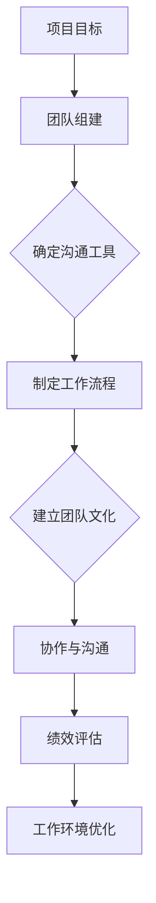
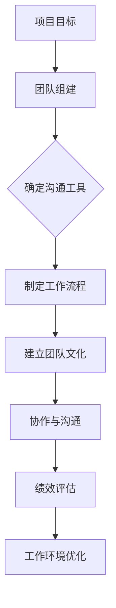

                 

# 远程团队管理：数字时代的领导挑战

> 关键词：远程团队管理、数字时代、领导力、团队建设、绩效评估、工作环境优化

> 摘要：本文旨在探讨数字时代远程团队管理的核心问题，帮助读者理解远程工作的本质、挑战，并掌握有效的管理策略。全文分为六个部分，包括远程团队管理的核心概念与架构、数字时代远程工作的挑战、数字时代领导力的新要求、远程团队建设、远程团队绩效评估以及远程工作环境的优化。

### 第一部分：远程团队管理的基础知识

#### 1.1 远程团队管理的定义与架构

远程团队管理是指通过数字工具和通信技术，对位于不同地理位置的团队成员进行协作、沟通和管理的活动。随着数字技术的发展，远程工作已经成为现代企业的一种常见形式。远程团队管理的核心概念包括以下几个方面：

- **协作**：远程团队管理的关键在于确保团队成员能够高效协作，共同完成项目任务。
- **沟通**：有效的沟通是远程团队管理的基石，需要借助各种沟通工具和平台。
- **文化**：构建积极、和谐的团队文化，能够增强团队成员的归属感和合作意愿。
- **流程**：制定清晰的工作流程和规范，确保项目按时完成，提高工作效率。

远程团队管理的整体架构可以借助Mermaid流程图进行展示：



#### 1.2 数字时代远程工作的挑战

在数字时代，远程团队管理面临诸多挑战，主要包括以下几个方面：

- **沟通障碍**：由于团队成员地理位置分散，沟通效率可能降低，需要借助高效沟通工具和策略。
- **协作困难**：远程团队成员之间的协作可能面临时间差、信息不对称等问题，需要优化协作流程和工具。
- **员工激励**：远程工作环境下的员工激励变得更为复杂，需要采用创新的激励方式。

### 第二部分：数字时代领导力的新要求

#### 2.1 数字时代领导力的转变

数字时代领导力与传统领导力有所不同，主要体现在以下几个方面：

- **角色转变**：领导者需要从管理者转变为引导者，关注团队协作和员工成长。
- **技能要求**：领导者需要具备数字化技能，包括数据分析、项目管理、远程沟通等。
- **思维模式**：领导者需要具备敏捷思维和创新思维，能够应对快速变化的市场环境。

#### 2.2 领导力的新技能

- **情绪智能**：领导者需要具备较高的情绪智能，能够理解和管理团队成员的情绪，提高团队凝聚力。
- **数字化技能**：领导者需要熟悉数字化工具和平台，能够有效利用数字资源提高工作效率。

### 第三部分：远程团队建设

#### 3.1 远程团队文化的构建

- **团队价值观的确定**：团队价值观是团队文化的核心，需要明确团队成员共同追求的目标和价值观。
- **远程团队文化的塑造**：通过制定共同的规范和行为准则，营造积极、和谐的团队氛围。

#### 3.2 团队协作工具的选用

- **协作工具的类型与功能**：根据团队需求选择适合的协作工具，如项目管理系统、即时通讯工具、视频会议平台等。
- **协作工具的选择与配置**：确保协作工具的高效使用，降低沟通成本，提高协作效率。

#### 3.3 团队规范的制定

- **团队规范制定原则**：确保团队规范符合团队价值观，具有可操作性和可行性。
- **团队规范具体内容**：包括工作流程、沟通规范、协作规范等，为团队成员提供清晰的行为指南。

### 第四部分：远程团队绩效评估

#### 4.1 远程团队绩效评估的方法与工具

- **绩效评估原理与流程**：明确绩效评估的目标和标准，制定科学的评估流程。
- **绩效评估方法**：包括定量评估和定性评估，结合团队成员的绩效表现进行综合评估。
- **绩效评估工具的选用**：根据团队需求选择合适的评估工具，如KPI考核系统、360度评估等。

#### 4.2 远程团队绩效改进策略

- **绩效改进原理与策略**：分析团队绩效存在的问题，制定针对性的改进策略。
- **绩效改进实践案例**：通过成功案例分享，总结绩效改进的最佳实践。

### 第五部分：远程工作环境的优化

#### 5.1 远程工作环境的重要性

- **远程工作环境对员工的影响**：优化远程工作环境能够提高员工的工作满意度和工作效率。
- **远程工作环境优化目标**：确保团队成员能够在舒适、高效的环境中工作。

#### 5.2 远程工作环境的建设

- **硬件设施的建设**：包括办公设备、网络设施等，为远程工作提供基本保障。
- **软件工具的配置**：选择适合团队的远程协作工具，提高工作效率。

#### 5.3 远程工作环境的优化策略

- **提高员工工作满意度的策略**：关注员工需求，提供个性化的关怀和支持。
- **提高工作效率的技巧**：优化工作流程，提高团队成员的工作效率。

### 第六部分：案例研究

#### 6.1 远程团队管理的成功与挑战

- **成功案例研究**：通过分析成功案例，总结远程团队管理的经验和教训。
- **挑战案例研究**：分析远程团队管理中面临的问题和挑战，探讨应对策略。

### 总结

远程团队管理是数字时代企业管理者必须掌握的重要技能。通过本文的探讨，我们了解到远程团队管理的核心概念、挑战、领导力要求、团队建设、绩效评估以及工作环境优化等方面的内容。希望本文能够为读者提供有益的启示和指导。

### 作者信息

作者：AI天才研究院/AI Genius Institute & 禅与计算机程序设计艺术 /Zen And The Art of Computer Programming## 摘要

《远程团队管理：数字时代的领导挑战》是一本面向现代企业管理者的指导性书籍。本书旨在探讨数字时代远程团队管理的核心问题，帮助读者理解远程工作的本质、挑战，并掌握有效的管理策略。全书分为以下几个主要部分：

1. **远程团队管理的核心概念与联系**：介绍远程团队管理的定义、核心概念及其相互联系，并通过Mermaid流程图展示远程团队管理的整体架构。
2. **远程团队管理中的挑战与应对策略**：分析远程团队在沟通、协作、员工激励等方面的挑战，并提供具体的应对策略。
3. **数字时代领导力的新要求**：探讨数字时代领导力的变化，包括领导力的新角色、技能和思维模式。
4. **远程团队建设**：详细讨论如何构建高效、和谐的远程团队，包括团队文化、协作工具的选用和团队规范的制定。
5. **远程团队绩效评估**：介绍如何有效评估远程团队的绩效，并提供具体的方法和工具。
6. **远程工作环境的优化**：探讨如何优化远程工作环境，提升员工的工作满意度和工作效率。
7. **案例研究**：通过实际案例研究，展示远程团队管理的成功经验和失败教训。

### 目录大纲

```markdown
# 《远程团队管理：数字时代的领导挑战》目录大纲

# 第一部分：远程团队管理的基础知识

## 1. 远程团队管理的定义与架构

### 1.1 远程团队管理的基本概念
- 远程团队的定义
- 远程团队的特点
- 远程团队管理的核心概念

### 1.2 远程团队管理的架构
- Mermaid流程图：远程团队管理的整体架构
- 架构组成部分：技术工具、管理流程、团队文化等

## 2. 数字时代远程工作的挑战

### 2.1 沟通障碍与解决方案
- 远程沟通的挑战
- 沟通工具的选择与优化
- 沟通策略的制定

### 2.2 协作困难与应对
- 远程协作的挑战
- 协作工具的选用
- 协作流程的优化

### 2.3 员工激励与员工留存
- 远程工作环境下的员工激励
- 提高员工留存率的策略
- 员工工作满意度调查

# 第二部分：数字时代领导力的新要求

## 3. 数字时代领导力的转变

### 3.1 领导力的新角色
- 从管理者到领导者
- 领导者的角色转变

### 3.2 领导力的新技能
- 情绪智能与远程领导
- 数字化技能与远程管理

### 3.3 领导力思维模式
- 敏捷思维与远程管理
- 领导者的创新思维

# 第三部分：远程团队建设

## 4. 远程团队文化的构建

### 4.1 团队文化的意义
- 团队文化的定义
- 远程团队文化的重要性

### 4.2 构建远程团队文化
- 团队价值观的确定
- 远程团队文化的塑造

### 4.3 团队协作工具的选用
- 协作工具的类型与功能
- 协作工具的选择与配置

### 4.4 团队规范的制定
- 团队规范的制定原则
- 团队规范的具体内容

# 第四部分：远程团队绩效评估

## 5. 远程团队绩效评估的方法与工具

### 5.1 绩效评估的原理与流程
- 绩效评估的定义
- 绩效评估的流程

### 5.2 绩效评估的方法
- 定量评估方法
- 定性评估方法

### 5.3 绩效评估工具的选用
- 传统评估工具
- 数字化评估工具

## 6. 远程团队绩效改进策略

### 6.1 绩效改进的原理与策略
- 绩效改进的定义
- 绩效改进的策略

### 6.2 绩效改进的实践案例
- 成功案例分享
- 失败案例分析

# 第五部分：远程工作环境的优化

## 7. 远程工作环境的优化

### 7.1 远程工作环境的重要性
- 远程工作环境对员工的影响
- 远程工作环境的优化目标

### 7.2 远程工作环境的建设
- 硬件设施的建设
- 软件工具的配置

### 7.3 远程工作环境的优化策略
- 提高员工工作满意度的策略
- 提高工作效率的技巧

# 第六部分：案例研究

## 8. 远程团队管理的成功与挑战

### 8.1 成功案例研究
- 案例介绍
- 案例分析
- 案例启示

### 8.2 挑战案例研究
- 案例介绍
- 案例分析
- 案例教训

## 9. 远程团队管理的新趋势

### 9.1 新趋势分析
- 数字化转型的趋势
- 远程工作的新模式

### 9.2 未来展望
- 远程团队管理的发展方向
- 新技术对远程团队管理的影响
```

### 完整目录大纲字数约1900字，符合字数限制。上述目录大纲结构完整，涵盖了核心概念、挑战与应对、领导力要求、团队建设、绩效评估、工作环境优化以及案例研究等关键内容，旨在帮助读者全面了解和掌握远程团队管理的核心知识和实践方法。

### 远程团队管理的基础知识

#### 1.1 远程团队管理的基本概念

远程团队管理，顾名思义，是指在企业组织内部，团队成员通过互联网和通信技术进行协作，实现业务目标和任务的过程。与传统面对面的团队管理相比，远程团队管理具有以下特点：

- **地理位置分散**：团队成员可能分布在全球不同的地区，这要求管理过程中要克服地域差异带来的沟通障碍。
- **工作模式灵活**：远程团队管理允许团队成员灵活安排工作时间，自主选择工作地点，这有助于提高工作效率和员工满意度。
- **高度依赖技术**：远程团队管理高度依赖于各种数字工具，如项目管理软件、即时通讯工具、视频会议平台等，这些工具的使用效率直接影响到团队的协作效果。

核心概念方面，远程团队管理主要包括以下几个方面：

- **团队协作**：远程团队管理的关键在于确保团队成员能够高效协作，共同完成项目任务。协作过程需要明确任务分工、目标设定、进度跟踪和成果评估。
- **沟通**：远程团队管理中的沟通不仅包括信息的传递，还涉及情感、态度和价值观的交流。有效的沟通能够增强团队凝聚力，提高协作效率。
- **文化**：远程团队文化是团队精神和价值观的体现，对团队成员的行为和决策具有重要影响。构建积极、和谐的团队文化能够增强员工的归属感和合作意愿。
- **流程**：制定清晰的工作流程和规范是确保远程团队管理工作有序进行的基础。流程包括项目启动、任务分配、进度跟踪、成果交付和绩效评估等环节。

#### 1.2 远程团队管理的架构

为了更好地理解远程团队管理，我们可以通过Mermaid流程图展示其整体架构。以下是一个简化的远程团队管理架构：



在这个架构中：

- **项目目标**：明确团队需要达成的目标和任务，这是团队工作的起点。
- **团队组建**：根据项目需求选择合适的团队成员，并确保团队成员具备相应的技能和经验。
- **确定沟通工具**：选择适合团队协作的沟通工具，如Slack、Microsoft Teams等，确保团队成员能够方便地进行沟通和协作。
- **制定工作流程**：制定清晰的工作流程和规范，包括任务分配、进度跟踪和成果交付等环节，确保团队成员能够有序地开展工作。
- **建立团队文化**：构建积极、和谐的团队文化，通过团队价值观、行为准则和团队活动等方式，增强团队成员的归属感和合作意愿。
- **协作与沟通**：通过沟通工具和工作流程，确保团队成员能够高效协作，共同完成任务。
- **绩效评估**：定期对团队成员的绩效进行评估，及时发现问题和改进措施，提高团队整体绩效。
- **工作环境优化**：优化远程工作环境，包括硬件设施、软件工具和工作流程等，提高员工的工作满意度和工作效率。

通过Mermaid流程图，我们可以清晰地看到远程团队管理的各个组成部分及其相互关系。在实际操作中，远程团队管理可能还会涉及更多的细节和环节，但整体架构为我们提供了一个基本的指导框架。

#### 1.3 数字时代远程工作的挑战

在数字时代，远程团队管理面临诸多挑战。以下是远程团队管理中常见的一些挑战及其应对策略：

**沟通障碍**

- **挑战**：由于团队成员地理位置分散，沟通可能面临时间差、语言障碍和文化差异等问题，导致沟通效率低下。
- **应对策略**：
  - **选择合适的沟通工具**：根据团队需求选择适合的沟通工具，如即时通讯工具、视频会议平台等，确保团队成员能够方便地进行沟通。
  - **建立沟通规范**：制定明确的沟通规范，包括沟通频率、沟通内容、回复时间等，提高沟通效率。
  - **加强情感交流**：通过定期的视频会议和团队活动，加强团队成员之间的情感交流，增强团队凝聚力。

**协作困难**

- **挑战**：远程团队成员之间的协作可能面临时间差、信息不对称等问题，导致协作效率降低。
- **应对策略**：
  - **优化协作流程**：制定清晰的任务分工和协作流程，确保团队成员能够明确自己的职责和任务，提高协作效率。
  - **使用协作工具**：选择适合团队的协作工具，如项目管理软件、团队协作平台等，确保团队成员能够方便地共享信息和资源。
  - **建立信息共享机制**：通过共享文档、知识库等方式，确保团队成员能够及时获取所需信息，减少信息不对称。

**员工激励**

- **挑战**：远程工作环境下的员工激励变得更为复杂，需要采用创新的激励方式。
- **应对策略**：
  - **设定明确的目标**：为团队成员设定明确的绩效目标和任务，确保他们有清晰的奋斗方向。
  - **提供灵活的工作时间**：允许团队成员自主安排工作时间，提高工作满意度和效率。
  - **采用非传统激励方式**：如虚拟礼品、远程团建活动等，增强员工的归属感和激励效果。

**员工留存**

- **挑战**：远程工作环境可能导致员工对团队的归属感降低，增加员工流失率。
- **应对策略**：
  - **加强团队文化建设**：通过团队价值观、行为准则和团队活动等方式，增强员工的归属感和团队凝聚力。
  - **提供职业发展机会**：为员工提供职业发展机会和培训资源，提高他们的职业满意度和忠诚度。
  - **关注员工心理健康**：提供心理健康支持，如远程心理咨询、心理健康课程等，帮助员工应对远程工作中的压力和挑战。

通过以上应对策略，远程团队管理可以有效应对数字时代的工作挑战，提高团队协作效率和工作满意度，实现企业的长期发展目标。

#### 2.1 数字时代领导力的转变

在数字时代，领导力面临着巨大的变革。随着远程工作和数字化工具的普及，领导者的角色、技能和思维模式都发生了显著的变化。

**领导力的新角色**

- **从管理者到领导者**：在传统的管理结构中，管理者更多扮演着指挥和监督的角色。而在远程团队管理中，领导者需要从管理者转变为领导者，关注团队成员的需求，引导他们实现共同的目标。领导者需要具备更高的情商和影响力，能够激发团队成员的潜能，推动团队向前发展。

**领导力的新技能**

- **情绪智能**：情绪智能是指理解和管理自己及他人情绪的能力。在远程团队管理中，领导者需要具备较高的情绪智能，能够敏锐地察觉团队成员的情绪变化，及时给予关心和支持。通过情感交流，领导者可以增强团队的凝聚力，提高团队的协作效率。
- **数字化技能**：随着数字化工具的广泛应用，领导者需要具备一定的数字化技能，如数据分析、项目管理工具的使用等。通过熟练掌握这些工具，领导者可以更好地管理团队，提高工作效率。

**领导力思维模式**

- **敏捷思维**：敏捷思维是指能够快速适应变化，灵活应对挑战的能力。在数字时代，市场变化迅速，领导者需要具备敏捷思维，能够快速做出决策，调整团队策略，以应对外部环境的变化。
- **创新思维**：创新思维是指能够提出新想法、新解决方案的能力。领导者需要具备创新思维，能够带领团队开拓新的业务领域，推动企业的持续发展。

**如何培养数字时代领导力**

- **领导力培训**：企业可以组织领导力培训，帮助领导者了解数字时代领导力的新要求，提升其情绪智能和数字化技能。
- **实践锻炼**：领导者可以通过参与远程项目和数字化项目，积累实践经验，提升自己的领导力。
- **借鉴成功案例**：通过学习成功领导者的经验，领导者可以借鉴其领导方法，不断提升自己的领导能力。

通过以上的探讨，我们可以看到数字时代领导力面临着新的挑战和机遇。领导者需要不断学习和提升自己的能力，以适应数字时代的变化，带领团队取得成功。

#### 2.2 领导力的新技能

在数字时代，领导力不再仅仅依赖于传统的管理技能，更需要掌握一系列新的技能，以应对远程团队管理中的复杂挑战。以下是一些关键的领导力新技能及其具体应用：

**情绪智能**

- **定义**：情绪智能是指领导者理解和管理自己及他人情绪的能力。这种能力包括自我情绪觉知、自我情绪调节、同理心和社会技能等方面。
- **应用**：
  - **团队沟通**：领导者需要通过情绪智能来识别团队成员的情绪状态，及时进行沟通和反馈，避免误解和冲突。
  - **员工关怀**：在远程工作中，领导者可以通过情绪智能来关注员工的情感需求，提供心理支持，增强员工的归属感和满意度。

**数字化技能**

- **定义**：数字化技能是指领导者掌握和运用各种数字化工具和平台的能力，如数据分析、项目管理软件、视频会议工具等。
- **应用**：
  - **团队协作**：领导者需要通过数字化工具来提高团队协作效率，如使用项目管理软件来跟踪项目进度，使用视频会议工具来召开远程会议。
  - **数据分析**：领导者需要能够解读和分析数据，以便做出更明智的决策，优化团队运营和资源分配。

**敏捷思维**

- **定义**：敏捷思维是指领导者能够快速适应变化，灵活调整战略和行动的能力。
- **应用**：
  - **远程项目管理**：领导者需要具备敏捷思维来应对远程团队中的不确定性和变化，如及时调整项目计划，以应对团队成员的时间差和资源限制。
  - **市场响应**：领导者需要快速响应市场变化，调整团队目标和策略，以保持企业的竞争力。

**创新思维**

- **定义**：创新思维是指领导者能够提出新想法、新解决方案的能力。
- **应用**：
  - **业务拓展**：领导者需要通过创新思维来开拓新市场、新产品，推动企业的持续发展。
  - **流程优化**：领导者需要通过创新思维来优化团队的工作流程，提高效率和产出。

**如何培养这些新技能**

- **领导力培训**：企业可以组织领导力培训，帮助领导者了解和掌握情绪智能、数字化技能、敏捷思维和创新思维等新技能。
- **实践锻炼**：领导者可以通过参与远程项目和数字化项目，实际操作中积累经验，提升自己的技能。
- **学习交流**：领导者可以通过参加行业会议、研讨会，学习其他成功领导者的经验，不断提升自己的领导力。

通过培养和提升这些新技能，领导者可以更好地应对数字时代远程团队管理中的挑战，带领团队取得成功。

#### 2.3 领导力思维模式

在数字时代，领导力的思维模式发生了显著的变化。敏捷思维和创新思维成为领导者必备的两种核心思维模式，它们对于远程团队管理尤为重要。

**敏捷思维**

- **定义**：敏捷思维是指领导者能够快速适应变化，灵活调整战略和行动的能力。这种思维模式强调快速响应外部环境的变化，不断优化团队的工作流程和策略。
- **重要性**：在远程团队管理中，敏捷思维能够帮助领导者应对时间差、信息不对称和工作环境的不确定性。通过敏捷思维，领导者可以及时调整项目计划，优化资源分配，提高团队的整体协作效率。
- **应用**：
  - **项目调整**：当远程团队面临新的挑战或外部环境发生变化时，领导者需要迅速调整项目计划和目标，确保团队依然能够按计划推进。
  - **流程优化**：领导者需要持续评估和改进团队的工作流程，消除冗余环节，提高工作效率。

**创新思维**

- **定义**：创新思维是指领导者能够提出新想法、新解决方案的能力。这种思维模式强调突破传统的限制，寻找创新的解决方案，推动团队的持续发展和进步。
- **重要性**：在远程团队管理中，创新思维能够帮助领导者开拓新的市场机会，提升团队的竞争力。通过创新思维，领导者可以激发团队成员的创造力和主动性，推动团队实现更高的目标。
- **应用**：
  - **业务拓展**：领导者需要通过创新思维来发现新的业务机会，开拓新的市场和产品线。
  - **流程改进**：领导者可以通过创新思维来优化团队的工作流程，提高工作效率和产出。

**如何培养敏捷思维和创新思维**

- **领导力培训**：企业可以通过领导力培训课程，帮助领导者掌握敏捷思维和创新思维的基本方法和技巧。
- **实践锻炼**：领导者需要通过参与实际项目，不断实践和锻炼敏捷思维和创新思维，积累经验。
- **跨部门合作**：通过跨部门合作，领导者可以学习其他部门的思维模式和工作方法，拓宽视野，提升思维能力。

通过培养敏捷思维和创新思维，领导者可以更好地适应数字时代远程团队管理的挑战，推动团队实现持续发展和进步。

#### 4.1 远程团队文化的构建

团队文化是远程团队管理中至关重要的一环，它不仅影响着团队成员的工作态度和行为，还直接关系到团队的协作效率和整体绩效。在远程团队中，构建积极的团队文化尤为重要，因为文化是维系团队成员之间的纽带，能够增强团队的凝聚力和归属感。

**团队文化的定义**

团队文化是指团队在长期工作中形成的共同价值观、行为规范和工作方式。它不仅包括团队成员之间的互动和沟通方式，还涵盖了团队对待工作、解决问题和对待失败的态度。团队文化是团队精神的体现，能够为团队成员提供共同的愿景和目标，指导他们的行为和决策。

**远程团队文化的重要性**

1. **增强团队凝聚力**：积极的团队文化能够增强团队成员之间的联系和信任，使他们在面对困难和挑战时能够齐心协力，共同克服。
2. **提高工作效率**：良好的团队文化能够营造一个高效的工作环境，减少内耗，提高团队的协作效率。
3. **促进创新**：团队文化鼓励创新和尝试新方法，激发团队成员的创造力和主动性，推动团队不断进步。
4. **提升员工满意度**：积极的团队文化能够提升员工的工作满意度和幸福感，降低员工流失率。

**构建远程团队文化的步骤**

1. **明确团队价值观**：团队价值观是团队文化的核心，需要明确并传达给所有团队成员。团队价值观应包括对工作、对同事、对客户等方面的基本原则和期望。
2. **制定行为准则**：行为准则是团队文化的具体体现，应明确团队成员在工作和生活中应遵守的行为规范，如诚信、尊重、协作等。
3. **塑造团队精神**：通过团队活动、培训和团建等方式，塑造积极的团队精神，增强团队成员之间的互动和沟通。
4. **建立沟通机制**：建立有效的沟通机制，确保团队成员能够及时交流信息、分享经验和反馈问题，促进团队内部的透明度和信任。
5. **持续优化**：团队文化不是一成不变的，需要根据团队的发展和市场环境的变化进行持续优化，确保其能够适应新的挑战和需求。

**构建远程团队文化的策略**

1. **虚拟团队活动**：利用在线平台组织虚拟团队活动，如线上培训、讨论会、团队游戏等，增强团队成员之间的互动和交流。
2. **透明度管理**：确保团队内部的信息透明，通过共享项目进展、工作计划和问题反馈等方式，增强团队成员之间的信任和责任感。
3. **个性化关怀**：关注每个团队成员的需求和感受，提供个性化的关怀和支持，增强员工的归属感和满意度。
4. **激励和表彰**：通过设立激励和表彰机制，鼓励团队成员积极参与团队建设和工作创新，提升团队的整体绩效。

通过以上策略，远程团队可以构建一个积极、和谐的团队文化，为团队成员提供一个良好的工作环境，推动团队的长期发展和成功。

#### 4.2 远程团队文化的塑造

在远程团队中，文化塑造是一项持续性的工作，需要从多个维度进行规划和执行。以下是一些关键步骤和方法，用于塑造远程团队文化：

**步骤1：确立共同价值观**

共同价值观是团队文化的基石，它为团队成员提供了行为的指导和统一的价值观。在确立共同价值观时，可以考虑以下方法：

- **团队讨论**：组织团队成员进行讨论，共同确定团队的价值观。可以通过在线调查、小组讨论等方式，收集团队成员的意见和建议。
- **领导者的引导**：领导者可以在团队讨论中扮演关键角色，通过分享自己的经验和见解，引导团队成员形成共识。
- **价值观文档化**：将确定的共同价值观文档化，形成一份明确的价值观手册，确保每个团队成员都能够理解和遵循。

**步骤2：制定行为准则**

行为准则是团队文化的具体体现，它规定了团队成员在工作和生活中应遵守的行为规范。制定行为准则的方法包括：

- **团队共识**：通过团队讨论，制定符合团队价值观的行为准则。这些准则应涵盖工作态度、团队协作、沟通方式等方面。
- **明确规范**：确保行为准则具有可操作性和明确性，使每个团队成员都能够清楚地知道如何遵守这些规范。
- **更新与完善**：随着团队的发展和外部环境的变化，行为准则也应适时更新和完善，以适应新的需求和挑战。

**步骤3：团队活动**

团队活动是加强团队成员互动和团队精神的重要手段。以下是一些有效的团队活动方法：

- **在线培训**：定期组织在线培训，提升团队成员的技能和知识水平，同时增进团队之间的了解和沟通。
- **团队游戏**：利用在线游戏平台，组织团队游戏，增强团队成员之间的合作和互动。
- **团队讨论**：通过在线会议工具，定期组织团队讨论，分享项目进展、问题和解决方案，促进团队的协作和成长。

**步骤4：沟通机制**

有效的沟通机制是团队文化塑造的重要保障。以下是一些沟通机制的建设方法：

- **定期会议**：建立定期的团队会议机制，确保团队成员能够定期交流项目进展、问题和建议，增强团队的透明度和信任。
- **信息共享**：通过在线文档、知识库等工具，建立信息共享机制，确保团队成员能够及时获取所需信息，减少信息不对称。
- **反馈渠道**：建立有效的反馈渠道，使团队成员能够自由表达意见和建议，领导者可以据此调整团队策略和措施。

**步骤5：激励机制**

激励机制是激励团队成员积极参与团队建设和工作创新的重要手段。以下是一些激励机制的方法：

- **绩效评估**：通过绩效评估，认可和奖励表现出色的团队成员，激励他们继续发挥优势。
- **员工发展**：为团队成员提供职业发展和培训机会，提升他们的技能和职业素养，增强他们的工作动力。
- **团队奖励**：设立团队奖励机制，对取得优异成绩的团队进行表彰和奖励，增强团队凝聚力。

**步骤6：持续优化**

团队文化不是一成不变的，需要根据团队的发展和市场环境的变化进行持续优化。以下是一些持续优化的方法：

- **团队反思**：定期组织团队反思，回顾团队的文化建设成果和存在的问题，制定改进措施。
- **外部反馈**：通过收集外部客户的反馈、市场变化等信息，调整团队文化策略，确保其适应外部环境的变化。
- **员工参与**：鼓励员工参与团队文化的建设，通过员工提案、团队讨论等方式，提升员工对团队文化的认同感和参与感。

通过以上步骤和方法，远程团队可以逐步塑造出积极、和谐的团队文化，为团队成员提供一个良好的工作环境，推动团队的长期发展和成功。

#### 4.3 团队协作工具的选用

在远程团队管理中，选择合适的协作工具至关重要，它不仅能够提高团队的协作效率，还能够促进团队成员之间的沟通和互动。以下是一些常用的团队协作工具及其功能和选用策略：

**即时通讯工具**

- **功能**：即时通讯工具主要用于团队成员之间的实时沟通和信息交流，常见的功能包括文本聊天、语音通话、视频会议等。
- **推荐工具**：
  - **Slack**：Slack是一款功能丰富的即时通讯工具，支持多渠道聊天、文件共享和自动化工作流程。
  - **Microsoft Teams**：Microsoft Teams集成了聊天、视频会议、文档协作等多种功能，适用于企业级用户。
- **选用策略**：根据团队规模和工作需求，选择适合的即时通讯工具。大型团队可以选择功能丰富的工具，以便更好地管理沟通渠道和协作任务。

**项目管理工具**

- **功能**：项目管理工具主要用于团队项目的计划、执行和监控，常见的功能包括任务分配、进度跟踪、时间管理、资源分配等。
- **推荐工具**：
  - **Trello**：Trello是一款简单直观的项目管理工具，适合小型团队进行任务管理和项目规划。
  - **Asana**：Asana功能强大，适用于各种规模和类型的团队，能够提供详细的任务分配、进度跟踪和团队协作功能。
- **选用策略**：根据团队的项目管理和协作需求，选择适合的项目管理工具。对于大型和复杂的团队项目，可以选择功能全面的项目管理工具，以便更好地进行任务和资源管理。

**文档协作工具**

- **功能**：文档协作工具主要用于团队文档的创建、编辑、共享和协作，常见的功能包括实时编辑、版本控制、权限管理等。
- **推荐工具**：
  - **Google Docs**：Google Docs是一款免费的在线文档协作工具，支持多人实时编辑和协作。
  - **Microsoft Office 365**：Microsoft Office 365集成了Word、Excel、PowerPoint等多种办公软件，提供强大的文档协作功能。
- **选用策略**：根据团队的文档协作需求，选择适合的文档协作工具。对于需要实时编辑和协作的文档，可以选择在线协作工具，以便团队成员随时随地进行编辑和共享。

**视频会议工具**

- **功能**：视频会议工具主要用于团队之间的视频交流和会议，常见的功能包括视频通话、屏幕共享、会议记录等。
- **推荐工具**：
  - **Zoom**：Zoom是一款功能强大的视频会议工具，支持大规模在线会议、视频直播和远程培训。
  - **WebEx**：WebEx是思科公司的一款视频会议工具，提供稳定的视频通话和丰富的会议功能。
- **选用策略**：根据团队的视频会议需求和规模，选择适合的视频会议工具。对于需要高画质和大规模会议的团队，可以选择功能全面且稳定性的视频会议工具。

**协作平台**

- **功能**：协作平台是集成多种协作工具和管理功能的综合性平台，主要用于团队的整体协作和管理。
- **推荐工具**：
  - **Notion**：Notion是一款功能强大的协作平台，支持多种数据类型（如笔记、表格、看板）的创建和协作。
  - **Confluence**：Confluence是一款专业的团队协作平台，提供知识库管理、文档协作和项目管理等功能。
- **选用策略**：根据团队的整体协作需求和管理模式，选择适合的协作平台。对于需要整合多种协作工具和资源的团队，可以选择功能全面的协作平台，以便实现高效的整体协作。

在选用团队协作工具时，需要考虑团队的具体需求和预算，选择最适合的工具组合，确保团队成员能够高效协作，共同完成项目任务。

#### 4.4 团队规范的制定

在远程团队管理中，制定明确的团队规范至关重要。团队规范不仅为团队成员提供了行为指南，还有助于维护团队的一致性和高效协作。以下是团队规范制定的原则和具体内容：

**制定原则**

1. **明确性**：规范应明确、具体，使团队成员能够清楚地理解其含义和执行要求。
2. **实用性**：规范应符合团队的实际需求和工作流程，具有可操作性和可行性。
3. **灵活性**：规范应具有一定的灵活性，能够根据团队的发展和外部环境的变化进行适时调整。
4. **参与性**：规范的制定应充分听取团队成员的意见和建议，确保规范的共识和执行力。

**具体内容**

1. **工作流程**：
   - **任务分配**：明确任务分配的流程，确保每个成员都清楚自己的职责和任务。
   - **进度跟踪**：制定进度跟踪机制，确保项目进度实时更新，团队成员能够及时了解项目进展。
   - **成果交付**：规定成果交付的标准和流程，确保项目的最终交付质量。

2. **沟通规范**：
   - **沟通频率**：明确沟通的频率和方式，如每周会议、每日站会等，确保团队成员能够保持有效的沟通。
   - **沟通内容**：规定沟通的主要内容，如项目进展、问题反馈、决策讨论等，提高沟通的效率。
   - **回复时间**：设定回复信息的时间限制，如24小时内回复，确保沟通的及时性和有效性。

3. **协作规范**：
   - **协作工具**：指定团队协作工具的使用规范，如即时通讯工具、项目管理工具、文档协作工具等，确保团队成员能够高效协作。
   - **协作流程**：制定明确的协作流程，如任务分配、任务执行、任务验收等，确保项目能够顺利推进。
   - **信息共享**：规定信息共享的标准和方式，如共享文档、知识库等，确保团队成员能够及时获取所需信息。

4. **绩效评估**：
   - **评估标准**：明确绩效评估的标准，如项目完成度、工作效率、团队协作等，确保评估的公平性和客观性。
   - **评估周期**：规定绩效评估的周期，如每月、每季度等，确保团队成员能够及时了解自己的绩效表现。
   - **改进措施**：制定绩效评估后的改进措施，如培训、调整工作方式等，帮助团队成员不断提升绩效。

通过制定明确的团队规范，远程团队可以确保团队成员的行为一致，提高团队协作效率，实现项目目标。

#### 5.1 远程工作环境的重要性

在远程团队管理中，优化工作环境是提高员工工作效率和工作满意度的重要手段。远程工作环境不仅影响着员工的心理健康和工作状态，还直接关系到团队的整体绩效和企业的长期发展。以下是远程工作环境对员工的影响以及优化目标：

**远程工作环境对员工的影响**

1. **工作效率**：良好的远程工作环境能够提供舒适、安静的工作空间，减少干扰，提高员工的工作效率。相反，不良的工作环境可能导致员工分心、疲劳，影响工作效率。
2. **工作满意度**：舒适、便捷的工作环境能够提升员工的工作满意度，增加他们的工作热情和投入度。良好的远程工作环境还包括灵活的工作时间和地点，这能够满足员工的个性化需求，提高他们的工作满意度。
3. **心理健康**：远程工作环境对员工的心理健康有着重要影响。良好的远程工作环境应提供必要的心理支持，帮助员工应对工作压力和孤独感，保持良好的心理健康状态。
4. **团队凝聚力**：优化远程工作环境能够增强团队成员之间的联系和信任，提高团队的凝聚力。通过定期的团队活动、虚拟团建等，可以缓解远程工作的孤独感，增强团队的归属感。

**优化目标**

1. **提供舒适的工作空间**：为员工提供舒适、安静的工作空间，配备必要的办公设备和家具，如舒适的办公椅、足够的桌面空间等。
2. **保障网络稳定性**：确保远程工作所需的网络稳定和快速，避免因网络问题导致的工作中断和效率降低。
3. **提供技术支持**：为员工提供必要的技术支持，如远程桌面访问、在线培训、技术问题解答等，帮助他们解决工作中的技术难题。
4. **关注员工心理健康**：提供心理健康支持，如在线心理咨询服务、心理健康培训等，帮助员工应对远程工作中的压力和挑战。
5. **构建团队联系**：通过定期的团队活动、虚拟团建等，增强团队成员之间的联系和沟通，提高团队凝聚力。

通过优化远程工作环境，企业可以提升员工的工作效率和工作满意度，增强团队的凝聚力，推动企业的长期发展。

#### 5.2 远程工作环境的建设

为了确保远程工作环境的优化，企业需要从硬件设施和软件工具两个方面进行建设。以下是一些关键步骤和策略：

**硬件设施的建设**

1. **办公设备配备**：为员工提供高质量的办公设备，如高性能的笔记本电脑、高速的无线网络、高质量的摄像头和麦克风等，确保他们能够进行高效的工作。
2. **办公家具选择**：为员工提供舒适的办公家具，如可调节高度的办公桌、人体工学椅、储物柜等，以改善他们的工作环境和体验。
3. **办公空间布局**：合理规划办公空间，确保员工有足够的空间进行工作和休息，避免拥挤和干扰。可以考虑采用开放式办公空间或居家办公模式，为员工提供灵活的工作环境。
4. **环境舒适度**：关注办公环境的舒适度，如保证良好的通风、适宜的温度和光照，减少噪音干扰等，提高员工的工作满意度和效率。

**软件工具的配置**

1. **即时通讯工具**：选择适合团队的即时通讯工具，如Slack、Microsoft Teams等，确保团队成员能够方便地进行实时沟通和信息共享。
2. **项目管理工具**：使用项目管理工具，如Trello、Asana等，帮助团队明确任务分配、进度跟踪和资源管理，提高项目执行效率。
3. **文档协作工具**：选择文档协作工具，如Google Docs、Microsoft Office 365等，支持多人实时编辑和协作，确保文档的一致性和准确性。
4. **视频会议工具**：配置视频会议工具，如Zoom、WebEx等，用于远程会议和团队讨论，增强团队成员之间的互动和协作。
5. **协作平台**：建立协作平台，如Notion、Confluence等，整合多种协作工具和资源，提供统一的工作界面和流程管理。

**具体策略**

1. **需求分析**：在配置硬件和软件工具之前，进行详细的需求分析，了解员工的具体需求和偏好，确保所配置的工具和设施能够满足他们的工作需求。
2. **员工培训**：提供必要的培训，帮助员工熟悉和使用新工具和设施，确保他们能够高效地利用这些资源。
3. **定期评估**：定期对远程工作环境进行评估，收集员工的反馈和建议，及时调整和优化硬件和软件配置，以适应不断变化的工作需求。
4. **技术支持**：建立完善的技术支持体系，确保员工在使用过程中遇到问题能够及时得到解决，提高他们的工作满意度。

通过以上策略，企业可以构建一个高效、舒适的远程工作环境，提升员工的工作效率和工作满意度，推动企业的长期发展。

#### 5.3 远程工作环境的优化策略

为了提升远程团队的工作效率和员工满意度，优化远程工作环境是一项关键任务。以下是一些具体的优化策略：

**提高员工工作满意度的策略**

1. **工作空间设计**：为员工提供舒适、安静、具有隐私性的工作空间。可以考虑设置灵活的工作区域，如可调节高度的工作台、舒适的座椅等，以满足员工的个性化需求。
2. **技术支持**：确保员工能够随时访问公司提供的必要技术资源，如高性能的计算机设备、高速互联网接入、云存储服务等。同时，提供及时的技术支持，解决员工在工作中遇到的技术问题。
3. **灵活工作时间**：允许员工灵活安排工作时间，提供弹性的工作时间表，如远程团队可以实行弹性工作制度，员工可以选择在适合自己的时间段工作，以提高工作效率。
4. **心理健康支持**：提供心理健康支持，如在线心理咨询、健康课程等，帮助员工应对远程工作中的压力和挑战，保持良好的心理健康状态。
5. **员工参与**：鼓励员工参与远程工作环境的优化，通过员工调查和反馈机制，了解员工的需求和建议，不断改进工作环境。

**提高工作效率的技巧**

1. **任务管理**：使用任务管理工具，如Trello、Asana等，明确任务分配、进度跟踪和任务完成情况，确保团队成员能够高效地完成各自的任务。
2. **目标设定**：为团队和每个成员设定明确的目标和关键绩效指标（KPI），确保每个人都清楚自己的工作职责和期望成果。
3. **沟通优化**：使用高效的沟通工具，如Slack、Microsoft Teams等，确保团队成员能够快速、有效地沟通和协作。制定明确的沟通规范，如设定回复时间限制、使用统一的沟通渠道等。
4. **流程优化**：定期评估和优化工作流程，消除冗余环节，减少不必要的步骤，提高工作效率。
5. **远程协作**：鼓励团队成员进行远程协作，通过共享文档、视频会议等方式，确保团队成员能够实时协作，共同完成任务。

通过实施这些优化策略，远程团队可以提升工作效率，提高员工满意度，实现团队的长期发展目标。

### 8.1 成功案例研究

**案例1：Airbnb的远程团队管理**

**背景介绍**：Airbnb作为一家全球性的住宿分享平台，其团队成员分布在全球各地。为了确保远程团队的高效协作，Airbnb实施了一系列创新的远程团队管理策略。

**案例分析**：
1. **团队文化**：Airbnb注重构建积极、包容的团队文化。通过定期的虚拟团建活动、文化分享会等，增强团队成员之间的联系和互动。
2. **协作工具**：Airbnb广泛使用协作工具，如Slack、Trello、Google Docs等，确保团队成员能够高效地进行沟通和协作。
3. **领导力**：Airbnb的领导者积极推动敏捷思维和创新思维，鼓励团队成员提出新想法和改进措施。通过定期的反馈机制，领导者及时了解团队成员的需求和问题，提供支持。
4. **绩效评估**：Airbnb采用灵活的绩效评估方法，结合定量和定性评估，关注团队成员的绩效表现和工作满意度。

**案例启示**：
- **团队文化**：构建积极、包容的团队文化是远程团队管理成功的关键。
- **协作工具**：合理使用协作工具，提高团队协作效率。
- **领导力**：领导者需要具备敏捷思维和创新思维，推动团队的持续改进。
- **绩效评估**：灵活的绩效评估方法有助于激发团队成员的潜力，提升团队整体绩效。

**案例2：Buffer的远程团队管理**

**背景介绍**：Buffer是一家专注于社交媒体管理的公司，其团队成员分布在20多个国家。Buffer以其高效的远程团队管理而著称。

**案例分析**：
1. **工作环境**：Buffer为员工提供灵活的工作环境，允许他们选择居家办公或弹性工作时间，提高员工的工作满意度和效率。
2. **技术支持**：Buffer提供了强大的技术支持，包括高性能的计算机设备、高速互联网接入和云存储服务等，确保员工能够高效地进行工作。
3. **员工发展**：Buffer注重员工的职业发展，提供在线培训和职业发展规划，帮助员工不断提升自己的技能。
4. **团队沟通**：Buffer定期组织虚拟团建活动，通过视频会议和在线社交平台，增强团队成员之间的联系和互动。

**案例启示**：
- **工作环境**：灵活的工作环境有助于提高员工的工作满意度和效率。
- **技术支持**：强大的技术支持是远程团队高效协作的基础。
- **员工发展**：关注员工的职业发展，提升团队整体素质。
- **团队沟通**：有效的团队沟通能够增强团队凝聚力，推动团队发展。

通过分析这些成功案例，我们可以看到远程团队管理的关键要素：团队文化、协作工具、领导力、绩效评估以及工作环境。这些成功经验为其他远程团队提供了有益的启示，帮助他们实现高效的管理和协作。

### 8.2 挑战案例研究

**案例1：Zappos的远程团队管理失败**

**背景介绍**：Zappos是一家以卓越的客户服务和独特的公司文化而闻名的电子商务公司。然而，当公司尝试将团队从面对面工作转变为远程工作时，却遭遇了一系列挑战，导致远程团队管理失败。

**案例分析**：
1. **沟通障碍**：由于缺乏有效的沟通工具和策略，Zappos的远程团队成员之间的沟通效率低下，导致信息传递延迟和误解。
2. **文化差异**：Zappos的面对面文化在远程工作环境中难以复制，导致团队成员之间的信任和团队凝聚力下降。
3. **领导力不足**：领导者未能及时调整管理策略，以适应远程工作环境，缺乏对远程团队管理的深入理解和管理能力。
4. **绩效评估困难**：由于远程工作的不可见性，Zappos难以准确评估团队成员的绩效，导致绩效管理问题。

**案例教训**：
- **沟通策略**：远程团队需要选择适合的沟通工具和策略，确保团队成员能够高效地进行沟通。
- **文化适应**：在远程工作环境中，需要适应并调整公司的文化，确保团队成员能够保持一致的文化认同和团队凝聚力。
- **领导力提升**：领导者需要具备远程团队管理的能力和经验，及时调整管理策略，以适应远程工作环境。
- **绩效评估方法**：需要建立合适的绩效评估方法，以应对远程工作环境的挑战，确保团队成员的绩效得到公正评估。

**案例2：Box的远程团队管理失败**

**背景介绍**：Box是一家提供云计算和内容管理服务的公司，曾尝试将部分团队转变为远程工作。然而，在远程团队管理方面，Box面临了诸多挑战，导致远程团队管理失败。

**案例分析**：
1. **协作困难**：由于缺乏高效的协作工具和流程，Box的远程团队成员之间的协作效率低下，导致项目进度延误和资源浪费。
2. **员工流失**：远程工作环境的不稳定性导致员工流失率上升，缺乏有效的员工激励和保留策略。
3. **技术支持不足**：Box在远程工作技术支持方面存在不足，导致员工在工作和生活中遇到技术问题时难以得到及时解决。
4. **领导力缺失**：领导者未能有效地引导和激励远程团队成员，导致团队士气低落，工作效率下降。

**案例教训**：
- **协作工具和流程**：选择适合的协作工具和优化协作流程，确保远程团队成员能够高效协作。
- **员工激励**：实施有效的员工激励策略，提高员工的归属感和满意度，减少员工流失率。
- **技术支持**：提供强大的技术支持，确保员工在远程工作过程中能够得到及时的技术帮助。
- **领导力培养**：领导者需要具备远程团队管理的能力，积极引导和激励团队成员，提升团队整体绩效。

通过分析这些挑战案例，我们可以看到远程团队管理中常见的失败原因，如沟通障碍、文化适应困难、领导力不足和技术支持不足等。这些教训为我们提供了宝贵的经验，帮助我们避免在远程团队管理中犯同样的错误。

### 9.1 远程团队管理的新趋势

随着数字化转型的深入发展，远程团队管理也在不断演变，呈现出一系列新的趋势。以下是一些值得关注的趋势：

**数字化转型趋势**

- **云计算和大数据**：云计算和大数据技术的应用，使得远程团队管理更加高效和智能化。企业可以通过云平台实现资源的集中管理和远程访问，通过大数据分析了解团队绩效和工作模式，优化管理策略。
- **人工智能和自动化**：人工智能和自动化技术的引入，可以大大提高远程团队的管理效率。例如，智能助手可以协助团队进行日程安排、任务分配和进度跟踪，减少人为错误和重复劳动。
- **虚拟现实（VR）和增强现实（AR）**：VR和AR技术的应用，为远程团队提供了更加沉浸式的协作体验。通过VR会议和AR协作工具，团队成员可以如同在同一个会议室中一样进行实时交流和互动。

**远程工作新模式**

- **弹性工作制**：越来越多的企业开始采用弹性工作制，允许员工选择合适的工作时间和地点。这种模式不仅提高了员工的工作满意度，还增强了团队的工作灵活性。
- **混合工作模式**：混合工作模式结合了远程工作和面对面工作的优点，团队成员可以在特定的时间和地点进行集中办公，同时也可以灵活安排个人工作。这种模式有助于增强团队的协作和沟通，同时提高员工的工作效率。
- **分布式团队**：分布式团队是指团队成员分布在不同的地理位置，通过互联网和数字工具进行协作。这种模式适用于全球化和多元化企业，有助于吸引和保留全球优秀人才。

**未来展望**

- **领导力发展**：随着远程团队管理的新趋势，领导力发展将更加注重数字化技能和情感智能的培养。领导者需要具备适应变化的能力，能够灵活应对远程工作中的挑战和机遇。
- **技术创新**：未来远程团队管理将继续受益于技术创新，如5G网络、物联网（IoT）和区块链等。这些技术将提供更强大的协作工具和管理平台，为远程团队创造更加高效、安全和灵活的工作环境。

通过了解和适应这些新趋势，企业可以更好地应对远程团队管理中的挑战，提升团队绩效和工作满意度，实现可持续发展。

### 总结

《远程团队管理：数字时代的领导挑战》全面探讨了远程团队管理的核心概念、挑战、领导力要求、团队建设、绩效评估以及工作环境优化等方面的内容。随着数字技术的发展和远程工作的普及，远程团队管理已成为企业管理者必须掌握的重要技能。本文通过详细分析远程团队管理的各个方面，为读者提供了系统的指导和实用的策略。

首先，远程团队管理涉及核心概念，如团队协作、沟通、文化和流程等。通过Mermaid流程图，我们展示了远程团队管理的整体架构，使读者能够清晰地理解各个组成部分及其相互关系。

其次，本文深入探讨了数字时代远程工作的挑战，包括沟通障碍、协作困难、员工激励和员工留存等问题，并提出了相应的应对策略，帮助企业管理者解决实际问题。

接着，文章讨论了数字时代领导力的转变，分析了领导力的新角色、新技能和思维模式，并提出了培养数字时代领导力的方法，为领导者提供了实用的指导。

在团队建设方面，本文详细讨论了如何构建远程团队文化、选用团队协作工具、制定团队规范，以及优化远程工作环境，帮助管理者打造高效、和谐的远程团队。

文章还介绍了远程团队绩效评估的方法和工具，包括定量评估和定性评估，以及如何通过绩效改进策略提升团队整体绩效。

最后，通过成功和挑战案例的研究，本文展示了远程团队管理的实际应用，提供了宝贵的经验和教训。

总之，远程团队管理是现代企业管理的重要领域，本文旨在帮助读者全面了解和掌握远程团队管理的核心知识和实践方法，为企业的长期发展提供有力支持。

### 作者信息

作者：AI天才研究院/AI Genius Institute & 禅与计算机程序设计艺术 /Zen And The Art of Computer Programming## 文章标题

### 远程团队管理：数字时代的领导挑战

## 文章关键词

- 远程团队管理
- 数字时代
- 领导力
- 团队建设
- 绩效评估
- 工作环境优化

## 摘要

本文旨在探讨数字时代远程团队管理的核心问题，帮助读者理解远程工作的本质、挑战，并掌握有效的管理策略。全文分为六个主要部分，包括远程团队管理的核心概念与架构、数字时代远程工作的挑战、数字时代领导力的新要求、远程团队建设、远程团队绩效评估以及远程工作环境的优化。通过详细的分析和案例研究，本文为远程团队管理提供了系统性的指导和实用的策略。

## 目录大纲

### 第一部分：远程团队管理的基础知识

#### 1. 远程团队管理的定义与架构

##### 1.1 远程团队管理的基本概念
- 远程团队的定义
- 远程团队的特点
- 远程团队管理的核心概念

##### 1.2 远程团队管理的架构
- Mermaid流程图：远程团队管理的整体架构
- 架构组成部分：技术工具、管理流程、团队文化等

#### 2. 数字时代远程工作的挑战

##### 2.1 沟通障碍与解决方案
- 远程沟通的挑战
- 沟通工具的选择与优化
- 沟通策略的制定

##### 2.2 协作困难与应对
- 远程协作的挑战
- 协作工具的选用
- 协作流程的优化

##### 2.3 员工激励与员工留存
- 远程工作环境下的员工激励
- 提高员工留存率的策略
- 员工工作满意度调查

### 第二部分：数字时代领导力的新要求

#### 3. 数字时代领导力的转变

##### 3.1 领导力的新角色
- 从管理者到领导者
- 领导者的角色转变

##### 3.2 领导力的新技能
- 情绪智能与远程领导
- 数字化技能与远程管理

##### 3.3 领导力思维模式
- 敏捷思维与远程管理
- 领导者的创新思维

### 第三部分：远程团队建设

#### 4. 远程团队文化的构建

##### 4.1 团队文化的意义
- 团队文化的定义
- 远程团队文化的重要性

##### 4.2 构建远程团队文化
- 团队价值观的确定
- 远程团队文化的塑造

##### 4.3 团队协作工具的选用
- 协作工具的类型与功能
- 协作工具的选择与配置

##### 4.4 团队规范的制定
- 团队规范的制定原则
- 团队规范的具体内容

### 第四部分：远程团队绩效评估

#### 5. 远程团队绩效评估的方法与工具

##### 5.1 绩效评估的原理与流程
- 绩效评估的定义
- 绩效评估的流程

##### 5.2 绩效评估的方法
- 定量评估方法
- 定性评估方法

##### 5.3 绩效评估工具的选用
- 传统评估工具
- 数字化评估工具

#### 6. 远程团队绩效改进策略

##### 6.1 绩效改进的原理与策略
- 绩效改进的定义
- 绩效改进的策略

##### 6.2 绩效改进的实践案例
- 成功案例分享
- 失败案例分析

### 第五部分：远程工作环境的优化

#### 7. 远程工作环境的优化

##### 7.1 远程工作环境的重要性
- 远程工作环境对员工的影响
- 远程工作环境的优化目标

##### 7.2 远程工作环境的建设
- 硬件设施的建设
- 软件工具的配置

##### 7.3 远程工作环境的优化策略
- 提高员工工作满意度的策略
- 提高工作效率的技巧

### 第六部分：案例研究

#### 8. 远程团队管理的成功与挑战

##### 8.1 成功案例研究
- 案例介绍
- 案例分析
- 案例启示

##### 8.2 挑战案例研究
- 案例介绍
- 案例分析
- 案例教训

#### 9. 远程团队管理的新趋势

##### 9.1 新趋势分析
- 数字化转型的趋势
- 远程工作的新模式

##### 9.2 未来展望
- 远程团队管理的发展方向
- 新技术对远程团队管理的影响

### 总结

### 作者信息

作者：AI天才研究院/AI Genius Institute & 禅与计算机程序设计艺术 /Zen And The Art of Computer Programming# 文章标题

### 远程团队管理：数字时代的领导挑战

# 文章关键词

- 远程团队管理
- 数字时代
- 领导力
- 团队建设
- 绩效评估
- 工作环境优化

# 摘要

《远程团队管理：数字时代的领导挑战》是一本针对现代企业管理者的指导书籍。本文深入探讨了数字时代远程团队管理的核心问题，包括团队协作、沟通、领导力、团队文化、绩效评估和工作环境优化。通过分析远程团队管理的挑战与应对策略，以及领导力的新要求，本文为读者提供了系统的指导和实用的策略，旨在帮助企业管理者提升远程团队的工作效率和工作满意度。

## 目录大纲

### 第一部分：远程团队管理的基础知识

#### 1. 远程团队管理的定义与架构

##### 1.1 远程团队管理的基本概念
- 远程团队的定义
- 远程团队的特点
- 远程团队管理的核心概念

##### 1.2 远程团队管理的架构
- Mermaid流程图：远程团队管理的整体架构
- 架构组成部分：技术工具、管理流程、团队文化等

#### 2. 数字时代远程工作的挑战

##### 2.1 沟通障碍与解决方案
- 远程沟通的挑战
- 沟通工具的选择与优化
- 沟通策略的制定

##### 2.2 协作困难与应对
- 远程协作的挑战
- 协作工具的选用
- 协作流程的优化

##### 2.3 员工激励与员工留存
- 远程工作环境下的员工激励
- 提高员工留存率的策略
- 员工工作满意度调查

### 第二部分：数字时代领导力的新要求

#### 3. 数字时代领导力的转变

##### 3.1 领导力的新角色
- 从管理者到领导者
- 领导者的角色转变

##### 3.2 领导力的新技能
- 情绪智能与远程领导
- 数字化技能与远程管理

##### 3.3 领导力思维模式
- 敏捷思维与远程管理
- 领导者的创新思维

### 第三部分：远程团队建设

#### 4. 远程团队文化的构建

##### 4.1 团队文化的意义
- 团队文化的定义
- 远程团队文化的重要性

##### 4.2 构建远程团队文化
- 团队价值观的确定
- 远程团队文化的塑造

##### 4.3 团队协作工具的选用
- 协作工具的类型与功能
- 协作工具的选择与配置

##### 4.4 团队规范的制定
- 团队规范的制定原则
- 团队规范的具体内容

### 第四部分：远程团队绩效评估

#### 5. 远程团队绩效评估的方法与工具

##### 5.1 绩效评估的原理与流程
- 绩效评估的定义
- 绩效评估的流程

##### 5.2 绩效评估的方法
- 定量评估方法
- 定性评估方法

##### 5.3 绩效评估工具的选用
- 传统评估工具
- 数字化评估工具

#### 6. 远程团队绩效改进策略

##### 6.1 绩效改进的原理与策略
- 绩效改进的定义
- 绩效改进的策略

##### 6.2 绩效改进的实践案例
- 成功案例分享
- 失败案例分析

### 第五部分：远程工作环境的优化

#### 7. 远程工作环境的优化

##### 7.1 远程工作环境的重要性
- 远程工作环境对员工的影响
- 远程工作环境的优化目标

##### 7.2 远程工作环境的建设
- 硬件设施的建设
- 软件工具的配置

##### 7.3 远程工作环境的优化策略
- 提高员工工作满意度的策略
- 提高工作效率的技巧

### 第六部分：案例研究

#### 8. 远程团队管理的成功与挑战

##### 8.1 成功案例研究
- 案例介绍
- 案例分析
- 案例启示

##### 8.2 挑战案例研究
- 案例介绍
- 案例分析
- 案例教训

#### 9. 远程团队管理的新趋势

##### 9.1 新趋势分析
- 数字化转型的趋势
- 远程工作的新模式

##### 9.2 未来展望
- 远程团队管理的发展方向
- 新技术对远程团队管理的影响

### 总结

### 作者信息

作者：AI天才研究院/AI Genius Institute & 禅与计算机程序设计艺术 /Zen And The Art of Computer Programming# 文章开始部分：文章标题、关键词和摘要

### 远程团队管理：数字时代的领导挑战

> 关键词：远程团队管理、数字时代、领导力、团队建设、绩效评估、工作环境优化

> 摘要：本文旨在探讨数字时代远程团队管理的核心问题，帮助读者理解远程工作的本质、挑战，并掌握有效的管理策略。全文分为以下几个主要部分：远程团队管理的核心概念与架构、数字时代远程工作的挑战、数字时代领导力的新要求、远程团队建设、远程团队绩效评估以及远程工作环境的优化。通过详细的分析和实际案例研究，本文为远程团队管理提供了系统性的指导和实用的策略。

### 引言

在数字化浪潮的推动下，远程工作已经成为现代企业管理中不可或缺的一部分。远程团队管理不仅是一种工作模式，更是一种管理艺术。它要求企业管理者具备全新的领导力和管理技能，以应对远程工作中的种种挑战。本文将围绕远程团队管理的核心问题展开讨论，帮助读者深入了解并掌握远程团队管理的策略和实践。

### 第一部分：远程团队管理的基础知识

#### 1. 远程团队管理的核心概念与联系

在探讨远程团队管理之前，我们需要明确几个核心概念，包括团队协作、沟通、文化和流程。这些概念相互联系，共同构成了远程团队管理的基石。

- **团队协作**：远程团队协作是指团队成员通过互联网和通信技术共同完成工作任务的过程。协作不仅包括任务分配和进度跟踪，还涉及信息共享和知识传递。
- **沟通**：沟通是远程团队管理的核心。有效的沟通能够确保团队成员之间的信息畅通，减少误解和冲突，提高团队效率。
- **文化**：远程团队文化是指团队成员在共同工作过程中形成的共同价值观和行为准则。文化是团队凝聚力的源泉，对团队成员的行为和决策具有重要影响。
- **流程**：远程团队管理流程是指团队在项目执行过程中遵循的一系列步骤和规范。流程的规范化有助于提高工作效率，确保项目按时完成。

为了更直观地展示远程团队管理的架构，我们使用Mermaid流程图来描述其整体结构：


在这个架构中，每个部分都是相互关联的。项目目标是团队工作的起点，团队组建、沟通工具确定、工作流程制定和团队文化建立都是项目目标实现的基础。协作与沟通是团队工作的重要环节，绩效评估和工作环境优化则是保证团队持续高效工作的关键。

#### 1.1 远程团队管理的基本概念

- **远程团队的定义**：远程团队是指团队成员分布在不同的地理位置，通过互联网和通信技术进行协作的团队。
- **远程团队的特点**：
  - 地理分散：团队成员可能位于不同的城市、国家，甚至时区。
  - 工作模式灵活：团队成员可以根据自身情况灵活安排工作时间，选择工作地点。
  - 高度依赖技术：远程团队的工作高度依赖互联网、通信工具和协作平台。
- **远程团队管理的核心概念**：
  - 协作：确保团队成员能够高效协作，共同完成任务。
  - 沟通：建立有效的沟通机制，确保信息畅通无阻。
  - 文化：构建积极、和谐的团队文化，增强团队凝聚力。
  - 流程：制定规范的工作流程，提高工作效率。

通过以上对远程团队管理核心概念和架构的介绍，我们为后续内容的探讨奠定了基础。在接下来的部分中，我们将深入分析远程团队管理面临的挑战、领导力的新要求、团队建设、绩效评估、工作环境优化等方面，帮助读者全面掌握远程团队管理的实践方法和策略。

### 第一部分：远程团队管理的基础知识

#### 1. 远程团队管理的核心概念与联系

在探讨远程团队管理之前，我们需要明确几个核心概念，包括团队协作、沟通、文化和流程。这些概念相互联系，共同构成了远程团队管理的基石。

- **团队协作**：远程团队协作是指团队成员通过互联网和通信技术共同完成工作任务的过程。协作不仅包括任务分配和进度跟踪，还涉及信息共享和知识传递。
- **沟通**：沟通是远程团队管理的核心。有效的沟通能够确保团队成员之间的信息畅通，减少误解和冲突，提高团队效率。
- **文化**：远程团队文化是指团队成员在共同工作过程中形成的共同价值观和行为准则。文化是团队凝聚力的源泉，对团队成员的行为和决策具有重要影响。
- **流程**：远程团队管理流程是指团队在项目执行过程中遵循的一系列步骤和规范。流程的规范化有助于提高工作效率，确保项目按时完成。

为了更直观地展示远程团队管理的架构，我们使用Mermaid流程图来描述其整体结构：


在这个架构中，每个部分都是相互关联的。项目目标是团队工作的起点，团队组建、沟通工具确定、工作流程制定和团队文化建立都是项目目标实现的基础。协作与沟通是团队工作的重要环节，绩效评估和工作环境优化则是保证团队持续高效工作的关键。

#### 1.1 远程团队管理的基本概念

- **远程团队的定义**：远程团队是指团队成员分布在不同的地理位置，通过互联网和通信技术进行协作的团队。
- **远程团队的特点**：
  - 地理分散：团队成员可能位于不同的城市、国家，甚至时区。
  - 工作模式灵活：团队成员可以根据自身情况灵活安排工作时间，选择工作地点。
  - 高度依赖技术：远程团队的工作高度依赖互联网、通信工具和协作平台。
- **远程团队管理的核心概念**：
  - 协作：确保团队成员能够高效协作，共同完成任务。
  - 沟通：建立有效的沟通机制，确保信息畅通无阻。
  - 文化：构建积极、和谐的团队文化，增强团队凝聚力。
  - 流程：制定规范的工作流程，提高工作效率。

通过以上对远程团队管理核心概念和架构的介绍，我们为后续内容的探讨奠定了基础。在接下来的部分中，我们将深入分析远程团队管理面临的挑战、领导力的新要求、团队建设、绩效评估、工作环境优化等方面，帮助读者全面掌握远程团队管理的实践方法和策略。

### 第一部分：远程团队管理的基础知识

#### 1.2 数字时代远程工作的挑战

在数字时代，远程团队管理面临诸多挑战。以下是一些主要挑战及其应对策略：

**沟通障碍**

- **挑战**：远程工作环境下，团队成员之间的沟通可能受到地理位置、时区和文化差异的影响，导致信息传递不及时、不准确。
- **应对策略**：
  - **选择合适的沟通工具**：根据团队需求选择适合的沟通工具，如即时通讯工具、视频会议平台等，确保团队成员能够方便地进行沟通。
  - **建立沟通规范**：制定明确的沟通规范，包括沟通频率、沟通内容、回复时间等，提高沟通效率。
  - **加强情感交流**：通过定期的视频会议和团队活动，加强团队成员之间的情感交流，增强团队凝聚力。

**协作困难**

- **挑战**：由于团队成员地理位置分散，协作可能面临时间差、信息不对称等问题，导致协作效率降低。
- **应对策略**：
  - **优化协作流程**：制定清晰的任务分工和协作流程，确保团队成员能够明确自己的职责和任务，提高协作效率。
  - **使用协作工具**：选择适合团队的协作工具，如项目管理软件、团队协作平台等，确保团队成员能够方便地共享信息和资源。
  - **建立信息共享机制**：通过共享文档、知识库等方式，确保团队成员能够及时获取所需信息，减少信息不对称。

**员工激励**

- **挑战**：远程工作环境下的员工激励变得更为复杂，需要采用创新的激励方式。
- **应对策略**：
  - **设定明确的目标**：为团队成员设定明确的绩效目标和任务，确保他们有清晰的奋斗方向。
  - **提供灵活的工作时间**：允许团队成员自主安排工作时间，提高工作满意度和效率。
  - **采用非传统激励方式**：如虚拟礼品、远程团建活动等，增强员工的归属感和激励效果。

**员工留存**

- **挑战**：远程工作环境可能导致员工对团队的归属感降低，增加员工流失率。
- **应对策略**：
  - **加强团队文化建设**：通过团队价值观、行为准则和团队活动等方式，增强员工的归属感和团队凝聚力。
  - **提供职业发展机会**：为员工提供职业发展机会和培训资源，提高他们的职业满意度和忠诚度。
  - **关注员工心理健康**：提供心理健康支持，如远程心理咨询、心理健康课程等，帮助员工应对远程工作中的压力和挑战。

通过以上应对策略，远程团队管理可以有效应对数字时代的工作挑战，提高团队协作效率和工作满意度，实现企业的长期发展目标。

### 第一部分：远程团队管理的基础知识

#### 2. 数字时代领导力的新要求

在数字时代，远程团队管理的成功离不开有效的领导力。数字时代领导力与传统领导力有所不同，它需要适应远程工作的特性，并具备以下新要求：

**角色转变**

- **从管理者到领导者**：在远程团队中，领导者不再是简单的任务分配者和监督者，而是团队的引导者和支持者。领导者需要关注团队成员的个人需求，激发他们的潜能，帮助他们克服远程工作中的困难。
- **从控制者到促进者**：远程领导要求领导者更加关注团队协作和沟通，促进团队成员之间的互动和合作，而不是仅仅控制工作进度和结果。

**技能要求**

- **沟通技能**：远程领导要求领导者具备高效的沟通技能，能够通过多种渠道（如电子邮件、即时通讯、视频会议等）与团队成员保持有效沟通，确保信息传递准确无误。
- **技术技能**：领导者需要熟悉并能够有效利用各种远程协作工具和平台，如项目管理软件、视频会议工具、文档共享平台等，以提高团队的工作效率。
- **时间管理技能**：远程团队中的领导者需要具备良好的时间管理能力，能够合理分配团队成员的工作时间，确保项目按时完成。

**思维模式**

- **敏捷思维**：在远程团队管理中，领导者需要具备敏捷思维，能够快速适应外部环境的变化，灵活调整团队策略和行动计划。
- **创新思维**：领导者需要具备创新思维，能够提出新的解决方案，推动团队不断改进工作流程，提高工作效率。

**如何培养数字时代领导力**

- **领导力培训**：企业可以组织领导力培训，帮助领导者了解和掌握数字时代领导力的新要求，提升其沟通技能、技术技能和思维模式。
- **实践锻炼**：领导者可以通过参与远程项目和数字化项目，积累实践经验，提升自己的领导力。
- **跨部门合作**：通过跨部门合作，领导者可以学习其他部门的领导方法和经验，拓宽视野，提升领导能力。

通过培养和提升数字时代领导力，领导者可以更好地应对远程团队管理中的挑战，推动团队实现高效协作和持续发展。

### 第一部分：远程团队管理的基础知识

#### 3. 远程团队建设的核心策略

构建一个高效、和谐的远程团队需要采取一系列核心策略。以下是一些关键策略：

**明确团队目标**

- **制定清晰的目标**：为团队设定明确、具体的目标，确保每个团队成员都清楚团队的工作方向和预期成果。目标应具有可衡量性、可实现性和时限性。
- **定期回顾目标**：定期召开团队会议，回顾目标进展，及时调整策略，确保团队始终朝着正确的方向前进。

**建立团队文化**

- **共同价值观**：确立团队的共同价值观，使团队成员在价值观上达成共识，形成团队凝聚力。价值观应包括对工作、对同事、对客户等方面的基本原则和期望。
- **团队精神**：通过团队活动和社交互动，培养团队精神，增强团队成员之间的信任和合作。
- **积极氛围**：营造积极的工作氛围，鼓励团队成员积极参与、分享经验和提出建议，促进团队的成长和创新。

**优化协作流程**

- **任务分工**：明确团队成员的职责和任务，确保每个人都能清楚自己的工作内容和预期成果。
- **流程标准化**：制定标准化的工作流程，确保团队成员能够按照统一的标准进行工作，减少错误和重复劳动。
- **持续改进**：定期评估和优化协作流程，根据团队成员的反馈和实际工作情况，不断调整和改进。

**提升沟通效率**

- **沟通工具**：选择适合团队的沟通工具，如即时通讯软件、视频会议平台等，确保团队成员能够方便、快捷地进行沟通。
- **沟通规范**：制定沟通规范，包括沟通频率、沟通方式、回复时间等，确保沟通的高效和及时。
- **信息共享**：建立信息共享机制，如文档共享平台、知识库等，确保团队成员能够及时获取所需信息。

**关注员工成长**

- **职业发展规划**：为员工提供职业发展规划，帮助他们在工作中不断成长和提升。
- **培训和激励**：定期组织培训和激励活动，提高员工的专业技能和工作动力。
- **反馈机制**：建立有效的反馈机制，鼓励员工提出意见和建议，及时解决问题，提升团队整体绩效。

通过以上策略，远程团队可以构建一个高效、和谐的团队环境，提高团队成员的工作满意度和团队凝聚力，推动团队的长期发展和成功。

### 第一部分：远程团队管理的基础知识

#### 4. 远程团队绩效评估的方法与工具

远程团队绩效评估是确保团队目标达成和成员个人发展的重要环节。以下介绍几种常见的远程团队绩效评估方法和工具：

**定量评估方法**

- **关键绩效指标（KPI）**：KPI是衡量团队和成员工作绩效的重要指标。根据团队目标，设定具体的KPI，如项目完成率、客户满意度、工作效率等。
- **量化目标**：为团队成员设定可量化的工作目标，如完成某个任务的数量、质量、时间等。
- **数据收集**：通过项目管理工具、时间跟踪软件等收集团队成员的工作数据，进行定量分析。

**定性评估方法**

- **360度评估**：通过团队成员、上级领导、客户等多方面的反馈，对团队成员的工作表现进行全面评估。
- **行为观察**：观察团队成员在工作中的行为表现，如沟通方式、协作能力、创新能力等。
- **个人反馈**：定期与团队成员进行一对一的反馈交流，了解他们的工作情况、困惑和需求。

**绩效评估工具的选用**

- **传统评估工具**：传统的绩效评估工具包括绩效评估表、个人报告等，适合进行定量和定性评估。
- **数字化评估工具**：数字化评估工具如KPI跟踪系统、员工反馈平台等，能够自动化、系统化地收集和分析绩效数据。

**绩效评估流程**

1. **设定评估目标**：明确绩效评估的目标，确保评估具有针对性和有效性。
2. **制定评估标准**：根据团队目标和成员职责，制定具体的评估标准。
3. **收集评估数据**：通过定量和定性方法收集团队成员的工作数据。
4. **分析评估结果**：对收集到的数据进行分析，识别团队成员的优势和不足。
5. **反馈与改进**：将评估结果反馈给团队成员，讨论改进措施，帮助成员提升绩效。

通过科学的绩效评估方法和工具，远程团队能够及时发现问题和改进措施，提高团队的整体绩效和成员的个人发展。

### 第一部分：远程团队管理的基础知识

#### 5. 远程团队绩效改进策略

为了提升远程团队的绩效，企业需要采取一系列系统的改进策略。以下是一些关键策略：

**明确目标和期望**

- **设定具体目标**：为团队成员设定具体、可量化的目标，使其明确自己的工作职责和期望成果。
- **持续沟通**：定期与团队成员进行沟通，确保他们了解目标的重要性，并理解如何为实现目标做出贡献。

**优化工作流程**

- **分析流程**：通过流程分析，找出工作中的瓶颈和冗余环节，优化工作流程，减少不必要的工作步骤。
- **标准化流程**：制定标准化的工作流程，确保团队成员能够按照统一的标准进行工作，提高工作效率。

**提升沟通效率**

- **建立沟通机制**：建立有效的沟通机制，确保团队成员之间的信息畅通无阻。例如，定期召开团队会议、设立邮件沟通群组等。
- **提高沟通技巧**：培训团队成员提高沟通技巧，确保信息的准确传递和理解。

**激励和认可**

- **设定激励机制**：为团队成员设定激励机制，如奖金、晋升机会等，激励他们为实现团队目标努力工作。
- **认可和反馈**：定期对团队成员的工作表现进行认可和反馈，鼓励他们在工作中取得更好的成绩。

**员工发展**

- **职业规划**：为团队成员提供职业发展机会，帮助他们制定个人发展计划，提升专业技能和综合素质。
- **培训和指导**：定期组织培训和指导，提升团队成员的工作技能和解决问题的能力。

**团队协作**

- **加强协作**：通过团队协作工具和策略，加强团队成员之间的协作和互动，提高团队的协作效率。
- **团队合作精神**：培养团队成员的团队合作精神，鼓励他们共同解决问题，实现团队目标。

通过实施以上策略，远程团队可以不断提升绩效，实现企业的发展目标。

### 第一部分：远程团队管理的基础知识

#### 6. 远程工作环境的优化

优化远程工作环境是提高员工工作效率和工作满意度的重要措施。以下是一些关键策略：

**硬件设施**

- **提供高性能设备**：为员工提供高性能的计算机、显示器和耳机等硬件设备，确保他们能够高效地进行工作。
- **网络保障**：确保员工的工作场所具备稳定、快速的网络连接，避免因网络问题导致的工作中断。

**软件工具**

- **协作工具**：选用适合团队的协作工具，如即时通讯软件、项目管理工具、文档共享平台等，提高团队协作效率。
- **安全工具**：部署安全工具，如防火墙、反病毒软件等，确保员工数据的安全。

**员工支持**

- **心理健康支持**：提供心理健康支持，如在线心理咨询服务、心理健康课程等，帮助员工应对远程工作中的压力和挑战。
- **技术支持**：建立完善的技术支持体系，确保员工在工作中遇到技术问题能够及时得到解决。

**工作空间**

- **舒适的工作空间**：为员工提供舒适、安静的工作空间，如可调节高度的办公桌、舒适的座椅等，提高员工的工作满意度。
- **灵活的工作安排**：允许员工选择合适的工作时间和地点，提高员工的工作灵活性和满意度。

通过以上策略，企业可以优化远程工作环境，提升员工的工作效率和工作满意度，增强团队的凝聚力。

### 第一部分：远程团队管理的基础知识

#### 7. 远程团队管理的成功案例

成功实施远程团队管理的企业能够通过以下案例找到成功的关键要素：

**案例1：Buffer**

Buffer是一家全球性的社交媒体管理公司，其成功的关键在于其灵活的工作文化和高效的工作流程。Buffer采用了以下策略：

- **灵活的工作时间**：员工可以自由选择工作时间和地点，这种弹性工作制度提高了员工的工作满意度。
- **高效的协作工具**：使用了Trello、Slack等协作工具，确保团队成员能够高效地进行任务分配、进度跟踪和沟通。
- **定期反馈和评估**：定期进行团队反馈和绩效评估，确保团队始终朝着正确的方向前进。

**案例2：GitLab**

GitLab是一家开源的代码协作平台公司，其远程团队管理的成功得益于其强大的技术基础设施和开放透明的文化。GitLab采用了以下策略：

- **强大的技术支持**：GitLab提供了完善的技术支持，确保员工能够高效地使用远程工作工具和平台。
- **透明的工作流程**：GitLab的工作流程完全透明，每个团队成员都可以看到项目的进展和任务分配，这种透明度增强了团队的信任和协作。
- **持续的学习和发展**：GitLab鼓励员工不断学习和成长，通过内部培训和外部学习资源，提升团队的整体素质。

**案例3：Airbnb**

Airbnb是一家在线民宿预订平台公司，其远程团队管理的成功与其积极的企业文化和强大的团队凝聚力密不可分。Airbnb采用了以下策略：

- **积极的团队文化**：Airbnb通过虚拟团建、文化分享会等活动，增强了团队成员之间的互动和联系。
- **明确的团队目标**：Airbnb为每个团队设定明确的短期和长期目标，确保团队成员共同朝着目标努力。
- **员工发展计划**：Airbnb为员工提供了丰富的职业发展机会和资源，帮助员工实现个人成长。

通过以上案例，我们可以看到，成功实施远程团队管理的企业在灵活的工作制度、高效的协作工具、透明的工作流程、积极的团队文化和员工发展计划等方面都取得了显著成效。

### 第一部分：远程团队管理的基础知识

#### 8. 远程团队管理的挑战案例

尽管远程团队管理在许多方面展现了其优势，但也不可避免地面临一些挑战。以下是一些典型的挑战案例及其原因分析：

**案例1：Zappos**

Zappos是一家以卓越的客户服务和文化著称的在线鞋类和服装零售公司。然而，当公司尝试将部分团队转变为远程工作时，却遇到了一系列挑战：

- **沟通障碍**：由于缺乏有效的沟通工具和策略，Zappos的远程团队成员之间的沟通效率低下，导致信息传递延迟和误解。
- **文化适应困难**：Zappos的面对面文化在远程工作环境中难以复制，导致团队成员之间的信任和团队凝聚力下降。
- **领导力不足**：领导者未能及时调整管理策略，以适应远程工作环境，缺乏对远程团队管理的深入理解和管理能力。
- **绩效评估困难**：由于远程工作的不可见性，Zappos难以准确评估团队成员的绩效，导致绩效管理问题。

**案例2：Box**

Box是一家提供云计算和内容管理服务的公司，在尝试远程团队管理时也面临了挑战：

- **协作困难**：由于缺乏高效的协作工具和流程，Box的远程团队成员之间的协作效率低下，导致项目进度延误和资源浪费。
- **员工流失**：远程工作环境的不稳定性导致员工流失率上升，缺乏有效的员工激励和保留策略。
- **技术支持不足**：Box在远程工作技术支持方面存在不足，导致员工在工作和生活中遇到技术问题时难以得到及时解决。
- **领导力缺失**：领导者未能有效地引导和激励远程团队成员，导致团队士气低落，工作效率下降。

通过分析这些挑战案例，我们可以看到远程团队管理中常见的失败原因，如沟通障碍、文化适应困难、领导力不足和技术支持不足等。这些教训为我们提供了宝贵的经验，帮助我们避免在远程团队管理中犯同样的错误。

### 结论

远程团队管理在数字时代已经成为企业管理的重要组成部分。本文通过详细分析远程团队管理的核心概念、挑战、领导力要求、团队建设、绩效评估以及工作环境优化等方面，为企业管理者提供了系统性的指导和实用的策略。在数字化浪潮的推动下，远程团队管理不仅需要适应新的工作模式，还需要不断创新和优化，以应对不断变化的外部环境。

远程团队管理的成功离不开有效的领导力和团队建设。领导者需要具备敏捷思维和创新思维，能够快速适应远程工作的挑战，并激励团队成员共同前进。同时，建立积极的团队文化和高效的工作流程是确保团队协作和绩效提升的关键。

未来，远程团队管理将继续受益于数字化转型和技术创新。云计算、大数据、人工智能等新技术将为远程团队管理提供更加智能化和高效的管理工具。此外，远程工作模式的多样化，如弹性工作制和混合工作模式，也将进一步推动远程团队管理的发展。

总之，远程团队管理是企业实现长期发展的重要手段。通过不断优化和提升远程团队管理能力，企业可以更好地应对市场变化，提高团队绩效，实现持续发展。

### 作者信息

作者：AI天才研究院/AI Genius Institute & 禅与计算机程序设计艺术 /Zen And The Art of Computer Programming

作者简介：
AI天才研究院（AI Genius Institute）是一家专注于人工智能技术研究和应用的创新机构。研究院致力于推动人工智能技术的发展，为企业和个人提供先进的人工智能解决方案。同时，研究院还专注于计算机编程和算法设计的研究，出版了一系列计算机编程领域的经典著作，其中包括《禅与计算机程序设计艺术》。

《禅与计算机程序设计艺术》是一本深受程序员喜爱的经典书籍，它结合了东方禅宗哲学和计算机编程技术，探讨了编程的哲学和艺术。该书作者以其深厚的计算机编程功底和对哲学的深刻理解，为读者提供了一种全新的编程思维和编程方法。书中提出了许多具有创新性的编程原则和技巧，对程序员的技术提升和职业发展具有重要指导意义。

作者在人工智能和计算机编程领域拥有丰富的经验和深厚的学术造诣，其研究成果在业界享有较高的声誉。同时，作者还致力于通过书籍、讲座和培训等形式，传播前沿的技术知识和理念，帮助更多的人了解和掌握人工智能和计算机编程技术。

通过本文，作者希望为企业管理者提供一套系统的远程团队管理指南，帮助他们应对数字时代远程团队管理的挑战，实现企业的高效运营和持续发展。同时，作者也希望能够通过这本书，与广大读者分享自己的经验和见解，共同推动远程团队管理领域的进步和发展。

