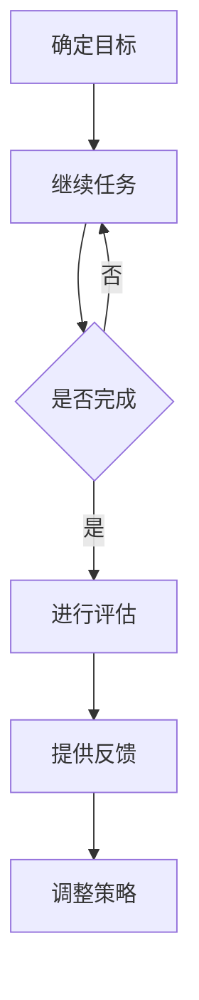

                 

### 第一步：确定文章标题和关键词

在撰写技术博客文章时，标题和关键词是吸引读者注意力的重要因素。对于《远程团队管理：数字时代的领导艺术》这篇文章，我们需要确保标题简洁明了，能够准确反映文章的主题，同时关键词能够涵盖文章的核心内容，便于搜索引擎索引。

**标题：**
《远程团队管理：数字时代的领导艺术》

**关键词：**
远程团队管理、数字时代、领导艺术、远程协作、团队沟通、领导力、数字化转型

这些关键词不仅概括了文章的核心主题，而且还能吸引那些对远程工作和团队管理感兴趣的读者。通过这些关键词，搜索引擎能够更好地理解文章的内容，从而为潜在的读者提供更准确的搜索结果。

### 第二步：撰写文章摘要

摘要部分需要简洁地概括文章的核心内容和主题思想，帮助读者快速了解文章的主旨，决定是否继续阅读。

**摘要：**
本文探讨了数字时代下远程团队管理的重要性及其挑战。首先，我们介绍了远程团队管理的背景，包括远程工作的兴起和数字化转型的趋势。接着，文章深入分析了数字时代下领导者的角色和所需的领导艺术，包括沟通技能、决策能力和适应新工作模式的能力。此外，文章还提供了有效的远程沟通与协作策略，介绍了各种远程管理工具和技术，并通过案例研究展示了成功和失败的远程团队管理实例。最后，文章总结了远程团队管理的关键要点和未来趋势，为领导者提供了实践指南。

### 第三步：撰写文章引言

引言部分是文章的开端，需要吸引读者的兴趣，并为他们介绍文章的主题和结构。以下是引言部分的撰写：

**引言：**

在当今快速发展的数字时代，远程工作已经成为一种普遍的工作方式。随着全球化的推进和互联网技术的不断进步，越来越多的企业开始采用远程团队管理，以应对灵活用工和跨文化协作的挑战。然而，远程团队管理并非易事，它要求领导者具备独特的领导艺术和沟通技巧，以保持团队的凝聚力和效率。

本文旨在探讨数字时代下远程团队管理的重要性及其挑战。首先，我们将介绍远程团队管理的背景，探讨远程工作的兴起和数字化转型的趋势。接着，文章将深入分析数字时代下领导者的角色和所需的领导艺术，包括沟通技能、决策能力和适应新工作模式的能力。此外，文章还将提供有效的远程沟通与协作策略，介绍各种远程管理工具和技术。最后，通过案例研究，我们将分析成功和失败的远程团队管理实例，为领导者提供实践指南。

### 第四步：撰写文章正文

正文部分是文章的核心，需要详细阐述每个章节的内容。以下是一个示例的章节结构：

**第1章 远程团队管理背景**

**1.1 远程工作的兴起**

随着互联网的普及和移动设备的普及，远程工作逐渐成为一种流行的办公模式。许多企业开始意识到，远程工作不仅能够提高员工的工作满意度，还能够降低运营成本，提高工作效率。本节将介绍远程工作的兴起和其在全球范围内的应用。

**1.2 数字化转型的影响**

数字化转型正在改变企业的运营模式和组织结构。远程团队管理是数字化转型的重要组成部分，它要求领导者具备适应新环境的敏捷性和创新思维。本节将探讨数字化转型对远程团队管理的影响。

**1.3 远程团队管理的重要性**

远程团队管理的重要性体现在以下几个方面：

- 提高员工的工作满意度
- 降低运营成本
- 提高工作效率
- 促进跨文化协作

**第2章 数字时代的领导艺术**

**2.1 领导者的角色**

在数字时代，领导者的角色发生了显著变化。他们不再仅仅是命令和控制的管理者，而是需要成为团队成员的导师和合作伙伴。本节将探讨数字时代下领导者的角色和责任。

**2.2 领导技能**

领导技能是领导者成功的关键。本节将介绍沟通技能、决策能力和适应新工作模式的能力等领导技能，并探讨如何培养和提高这些技能。

**2.3 领导者的挑战**

数字时代给领导者带来了许多新的挑战，包括：

- 适应新的工作模式
- 建立信任
- 激励远程员工

**第3章 远程团队的沟通与协作**

**3.1 沟通渠道**

有效的沟通是远程团队管理的关键。本节将介绍常用的沟通渠道，如电子邮件、视频会议和即时通讯工具，并探讨如何选择合适的沟通渠道。

**3.2 协作工具**

协作工具是远程团队管理的得力助手。本节将介绍文档共享、项目管理工具和团队协作平台等协作工具，并探讨如何有效利用这些工具。

**3.3 沟通与协作策略**

有效的沟通与协作策略是确保远程团队高效运作的关键。本节将介绍如何制定和实施沟通与协作策略，包括明确目标、定期反馈和团队建设活动。

### 第五步：撰写文章结尾

结尾部分需要总结文章的主要观点，并提供给读者一些实用的建议或展望未来的发展趋势。以下是结尾部分的撰写：

**结尾：**

远程团队管理是数字时代领导者面临的重要挑战之一。通过本文的探讨，我们了解到远程团队管理的重要性、数字时代下领导者的角色和所需的领导艺术，以及如何通过有效的沟通与协作策略来提升远程团队的工作效率。在未来的发展中，随着技术的不断进步和远程工作的普及，远程团队管理将变得更加重要。领导者需要不断学习和适应新环境，以提高团队的管理水平和工作效率。希望本文能为领导者提供一些实用的指导和建议，帮助他们成功管理远程团队。

### 第六步：添加作者信息

在文章的末尾，我们需要添加作者信息，以展示文章的专业性和权威性。以下是作者信息的撰写：

**作者：**AI天才研究院/AI Genius Institute & 禅与计算机程序设计艺术 /Zen And The Art of Computer Programming

通过以上六个步骤，我们完成了一篇结构清晰、内容丰富的技术博客文章，为读者提供了关于远程团队管理的全面见解和实用建议。让我们再次回顾文章的标题、关键词、摘要、引言、正文和结尾，确保每一部分都能吸引读者的注意力，并提供有价值的信息。

# 《远程团队管理：数字时代的领导艺术》

关键词：远程团队管理、数字时代、领导艺术、远程协作、团队沟通、领导力、数字化转型

摘要：本文探讨了数字时代下远程团队管理的重要性及其挑战。首先，我们介绍了远程团队管理的背景，包括远程工作的兴起和数字化转型的趋势。接着，文章深入分析了数字时代下领导者的角色和所需的领导艺术，包括沟通技能、决策能力和适应新工作模式的能力。此外，文章还提供了有效的远程沟通与协作策略，介绍了各种远程管理工具和技术。最后，通过案例研究，我们将分析成功和失败的远程团队管理实例，为领导者提供实践指南。

## 引言

在当今快速发展的数字时代，远程工作已经成为一种普遍的工作方式。随着全球化的推进和互联网技术的不断进步，越来越多的企业开始采用远程团队管理，以应对灵活用工和跨文化协作的挑战。然而，远程团队管理并非易事，它要求领导者具备独特的领导艺术和沟通技巧，以保持团队的凝聚力和效率。

本文旨在探讨数字时代下远程团队管理的重要性及其挑战。首先，我们将介绍远程团队管理的背景，探讨远程工作的兴起和数字化转型的趋势。接着，文章将深入分析数字时代下领导者的角色和所需的领导艺术，包括沟通技能、决策能力和适应新工作模式的能力。此外，文章还提供了有效的远程沟通与协作策略，介绍各种远程管理工具和技术。最后，通过案例研究，我们将分析成功和失败的远程团队管理实例，为领导者提供实践指南。

## 第1章 远程团队管理背景

### 1.1 远程工作的兴起

随着互联网的普及和移动设备的普及，远程工作逐渐成为一种流行的办公模式。许多企业开始意识到，远程工作不仅能够提高员工的工作满意度，还能够降低运营成本，提高工作效率。本节将介绍远程工作的兴起和其在全球范围内的应用。

**1.1.1 远程工作的定义和类型**

远程工作指的是员工在不固定的工作场所，如家中、咖啡馆或办公区，通过互联网和远程通讯工具完成工作任务。根据工作方式的差异，远程工作可以分为以下几种类型：

- 全职远程工作：员工完全在家工作，无需到办公室。
- 弹性工作制：员工可以选择在办公室工作，也可以选择在家或远程工作。
- 分时远程工作：员工在特定的时间段内远程工作，如上午在家工作，下午在办公室工作。

**1.1.2 远程工作的兴起原因**

远程工作的兴起主要受到以下几个因素的推动：

- 互联网技术的普及：互联网的快速发展使得远程通讯和协作变得更加便捷和高效。
- 移动设备的普及：智能手机、平板电脑等移动设备的普及，使得员工可以在任何地点进行远程工作。
- 数字化转型：企业开始采用数字化转型策略，以提升运营效率和灵活性。
- 员工需求的变化：越来越多的员工追求工作与生活的平衡，希望拥有更灵活的工作安排。

**1.1.3 远程工作在全球范围内的应用**

远程工作在全球范围内得到了广泛应用。以下是一些国家和地区的远程工作情况：

- 美国和加拿大：远程工作在这些国家非常普遍，许多企业已经将远程工作作为常规工作模式。
- 澳大利亚和新西兰：这些国家的政府和企业高度重视远程工作，并制定了相关政策支持远程工作。
- 欧洲国家：虽然欧洲的远程工作普及程度不如美国和加拿大，但越来越多的企业开始采用远程工作模式。
- 亚洲国家：随着互联网的普及和数字化转型的推进，亚洲国家也开始逐渐接受远程工作。

### 1.2 数字化转型的影响

数字化转型正在改变企业的运营模式和组织结构。远程团队管理是数字化转型的重要组成部分，它要求领导者具备适应新环境的敏捷性和创新思维。本节将探讨数字化转型对远程团队管理的影响。

**1.2.1 数字化转型的定义和目标**

数字化转型是指企业利用数字技术和数据进行业务改革和优化，以提升运营效率、创造新的商业模式和增强客户体验。数字化转型的主要目标包括：

- 提升运营效率：通过自动化和智能化技术，减少人力成本，提高生产效率。
- 创新商业模式：利用数字技术创造新的产品和业务模式，拓展市场。
- 增强客户体验：通过数字化手段，提供个性化、高效的服务，提升客户满意度。

**1.2.2 数字化转型对远程团队管理的影响**

数字化转型对远程团队管理产生了深远的影响，具体体现在以下几个方面：

- 适应新工作模式：数字化转型要求员工具备更高的技能和灵活性，以适应新的工作模式。
- 增强沟通与协作：数字化工具和平台为远程团队提供了高效的沟通和协作手段，提升了团队的协作效率。
- 提高管理效率：数字化转型为领导者提供了更多的数据和管理工具，有助于提高管理效率。
- 确保数据安全：数字化转型带来了数据安全的新挑战，远程团队需要采取有效的数据安全措施，保护企业的核心数据。

### 1.3 远程团队管理的重要性

远程团队管理的重要性体现在以下几个方面：

- 提高员工的工作满意度：远程工作使得员工能够更好地平衡工作与生活，提高工作满意度。
- 降低运营成本：远程团队管理可以减少办公空间和设备成本，降低运营成本。
- 提高工作效率：远程团队通过高效的沟通和协作工具，能够更好地完成工作任务。
- 促进跨文化协作：远程团队可以跨越地域和文化差异，实现跨文化的协作和创新。

## 第2章 数字时代的领导艺术

### 2.1 领导者的角色

在数字时代，领导者的角色发生了显著变化。他们不再仅仅是命令和控制的管理者，而是需要成为团队成员的导师和合作伙伴。本节将探讨数字时代下领导者的角色和责任。

**2.1.1 数字时代下领导者的角色**

数字时代下，领导者的角色包括以下几个方面：

- 激励和引导员工：领导者需要通过激励和引导，激发员工的积极性和创造力。
- 建立信任：领导者需要建立信任关系，增强团队的凝聚力和协作能力。
- 鼓励创新和适应变化：领导者需要鼓励员工创新思维，适应快速变化的工作环境。
- 提供反馈和支持：领导者需要为员工提供及时的反馈和支持，帮助他们成长和进步。

**2.1.2 领导者的责任**

数字时代下，领导者需要承担以下责任：

- 制定明确的愿景和目标：领导者需要明确团队的愿景和目标，确保团队成员朝着共同的方向努力。
- 优化沟通和协作：领导者需要建立有效的沟通和协作机制，确保信息的传递和任务的执行。
- 培养和激励团队：领导者需要关注团队成员的成长和发展，提供培训和激励，提升团队的整体能力。
- 确保数据安全：领导者需要关注数据安全，采取有效的措施保护企业的核心数据。

### 2.2 领导技能

领导技能是领导者成功的关键。本节将介绍沟通技能、决策能力和适应新工作模式的能力等领导技能，并探讨如何培养和提高这些技能。

**2.2.1 沟通技能**

沟通技能是领导者必备的能力，对于远程团队管理尤为重要。以下是一些关键的沟通技能：

- 明确表达：领导者需要能够清晰、准确地表达自己的想法和期望，确保团队成员理解。
- 倾听和理解：领导者需要倾听团队成员的意见和需求，理解他们的情感和感受。
- 激发讨论：领导者需要创造一个开放、坦诚的沟通氛围，鼓励团队成员积极参与讨论。
- 指导和支持：领导者需要为团队成员提供指导和支持，帮助他们解决问题和克服困难。

**2.2.2 决策能力**

决策能力是领导者的重要素质，特别是在复杂和不确定的环境中。以下是一些关键的决策能力：

- 分析问题：领导者需要具备分析问题的能力，从多个角度全面评估问题的各个方面。
- 收集信息：领导者需要积极收集相关信息，确保决策基于充分的了解。
- 比较选项：领导者需要比较不同决策选项的优缺点，选择最佳的方案。
- 风险评估：领导者需要评估决策的风险，并制定相应的应对策略。

**2.2.3 适应新工作模式的能力**

数字时代的工作模式不断变化，领导者需要具备适应新工作模式的能力。以下是一些关键的能力：

- 学习和创新：领导者需要不断学习新知识和技能，保持创新思维，适应新环境。
- 灵活应变：领导者需要具备灵活应变的能力，迅速适应环境变化，调整工作策略。
- 推动变革：领导者需要推动变革，鼓励团队成员接受新工作模式，实现组织转型。

### 2.3 领导者的挑战

数字时代给领导者带来了许多新的挑战，包括：

**2.3.1 适应新的工作模式**

数字化转型要求领导者适应新的工作模式，如远程工作、弹性工作制和跨文化协作。这需要领导者具备灵活性和创新思维，以适应新的工作环境。

**2.3.2 建立信任**

远程团队管理中，领导者需要建立信任关系，以保持团队的凝聚力和协作能力。这需要领导者通过透明的沟通、积极的反馈和支持来建立信任。

**2.3.3 激励远程员工**

远程员工往往缺乏面对面的互动和激励，领导者需要通过有效的沟通、激励措施和目标设定来激发员工的积极性和创造力。

## 第3章 远程团队的沟通与协作

### 3.1 沟通渠道

有效的沟通是远程团队管理的关键。以下是一些常用的沟通渠道：

**3.1.1 电子邮件**

电子邮件是一种传统的沟通方式，适用于正式和详细的信息传递。它具有以下优点：

- 可以详细记录信息，便于后续查阅。
- 适用于跨时区沟通，无需实时互动。

**3.1.2 视频会议**

视频会议是一种直观的沟通方式，适用于需要面对面交流的情况。它具有以下优点：

- 可以实现实时互动，增强沟通效果。
- 可以通过面部表情和肢体语言传递信息。

**3.1.3 即时通讯工具**

即时通讯工具如微信、Slack、WhatsApp等，适用于快速沟通和协作。它具有以下优点：

- 可以实现实时沟通，提高工作效率。
- 可以发送文字、图片、视频等多种信息。

### 3.2 协作工具

协作工具是远程团队管理的得力助手。以下是一些常用的协作工具：

**3.2.1 文档共享平台**

文档共享平台如Google Docs、Microsoft OneDrive等，适用于文档的创建、编辑和共享。它具有以下优点：

- 可以实现实时协作，提高工作效率。
- 可以自动保存版本，便于后续查阅。

**3.2.2 项目管理工具**

项目管理工具如Trello、Asana、Jira等，适用于任务分配、进度跟踪和协作。它具有以下优点：

- 可以实现任务分配和进度跟踪，提高团队协作效率。
- 可以实时更新任务状态，确保项目顺利进行。

**3.2.3 团队协作平台**

团队协作平台如Microsoft Teams、Slack等，适用于团队沟通、协作和项目管理。它具有以下优点：

- 可以实现多功能的团队协作，提高工作效率。
- 可以整合各种协作工具，提供一站式服务。

### 3.3 沟通与协作策略

有效的沟通与协作策略是确保远程团队高效运作的关键。以下是一些沟通与协作策略：

**3.3.1 明确目标**

明确目标是确保团队协作顺利进行的基础。领导者需要明确团队的目标，并将其传达给每个成员。团队成员需要理解自己的任务和目标，以确保协作的顺利进行。

**3.3.2 定期反馈**

定期反馈是确保团队成员了解自己的工作进展和效果的重要手段。领导者需要定期与团队成员进行沟通，提供反馈和建议，帮助团队成员改进工作。

**3.3.3 建立信任**

建立信任是远程团队协作的基石。领导者需要通过透明的沟通、积极的反馈和支持来建立信任关系，增强团队的凝聚力和协作能力。

**3.3.4 促进交流**

促进交流是确保团队成员之间信息畅通的重要手段。领导者需要鼓励团队成员之间的交流和互动，分享知识和经验，提高团队的协作效率。

## 第4章 遥距管理工具与技术

### 4.1 远程监控技术

远程监控技术是确保远程团队工作效率和项目进展的重要工具。以下是一些常用的远程监控技术：

**4.1.1 工作时间追踪工具**

工作时间追踪工具如RescueTime、Toggl等，适用于记录和分析团队成员的工作时间。它具有以下优点：

- 可以帮助团队成员了解自己的工作时间分布，优化工作时间。
- 可以帮助领导者了解团队的工作效率，及时发现和解决问题。

**4.1.2 成果追踪工具**

成果追踪工具如Jira、Trello等，适用于记录和分析团队成员的工作成果。它具有以下优点：

- 可以帮助团队成员明确工作目标和任务，确保任务完成。
- 可以帮助领导者了解团队的工作成果，评估团队的工作效率。

**4.1.3 活动监控工具**

活动监控工具如Monit、Nagios等，适用于监控服务器和网络的运行状态。它具有以下优点：

- 可以帮助领导者实时了解服务器和网络的运行情况，及时发现和解决故障。
- 可以提高团队的服务质量和客户满意度。

### 4.2 远程团队管理平台

远程团队管理平台是整合各种远程管理工具和技术的综合平台，为领导者提供一站式服务。以下是一些常用的远程团队管理平台：

**4.2.1 Microsoft Teams**

Microsoft Teams是一款集沟通、协作和项目管理于一体的远程团队管理平台。它具有以下优点：

- 可以整合各种协作工具，提供一站式服务。
- 可以实现实时沟通和协作，提高团队工作效率。
- 可以集成第三方应用，扩展功能。

**4.2.2 Slack**

Slack是一款流行的远程团队管理平台，适用于小型和中型团队。它具有以下优点：

- 可以实现实时沟通和协作，提高团队工作效率。
- 可以集成各种第三方应用，满足不同团队的需求。
- 可以提供丰富的自定义功能，适应不同团队的管理需求。

**4.2.3 Asana**

Asana是一款专门用于项目管理和团队协作的远程团队管理平台。它具有以下优点：

- 可以实现任务分配和进度跟踪，提高团队协作效率。
- 可以提供实时反馈和协作，确保项目顺利进行。
- 可以支持多种工作流程，适应不同团队的管理需求。

### 4.3 数据安全与隐私保护

数据安全与隐私保护是远程团队管理的重要方面。以下是一些数据安全与隐私保护措施：

**4.3.1 加密技术**

加密技术是保护数据安全的重要手段。以下是一些常见的加密技术：

- 对数据进行加密存储和传输，确保数据在传输过程中的安全性。
- 采用SSL/TLS等加密协议，确保数据在传输过程中的完整性。

**4.3.2 访问控制策略**

访问控制策略是确保数据安全的重要措施。以下是一些常见的访问控制策略：

- 设定用户权限，确保用户只能访问自己有权访问的数据。
- 实施多因素认证，提高用户身份验证的安全性。

**4.3.3 安全审计**

安全审计是确保数据安全的重要手段。以下是一些常见的安全审计措施：

- 定期进行安全审计，检查系统的安全漏洞和风险。
- 及时修复安全漏洞，确保系统的安全性。

## 第5章 案例研究

### 5.1 成功案例

以下是一个成功案例：

**案例一：远程团队的快速响应**

某互联网公司采用远程团队管理，团队成员分布在全球各地。公司采用高效的沟通和协作工具，如Slack、Trello和Zoom，确保团队成员之间的实时沟通和协作。公司还定期组织线上会议和团队建设活动，增强团队凝聚力。通过这些措施，该公司成功实现了全球协同工作，项目响应速度大幅提高，客户满意度显著提升。

### 5.2 失败案例

以下是一个失败案例：

**案例二：沟通不畅导致的效率低下**

某软件公司尝试采用远程团队管理，但由于缺乏有效的沟通和协作工具，团队成员之间的沟通不畅，导致工作效率低下。公司内部出现了信息孤岛，项目进展缓慢，客户投诉增多。经过反思，公司决定加强沟通与协作培训，引入新的协作工具，并建立了明确的沟通机制，最终成功解决了沟通问题，提高了工作效率。

## 第6章 结论

### 6.1 远程团队管理的关键要点

通过本文的探讨，我们得出了以下关于远程团队管理的关键要点：

- 远程团队管理的重要性：远程团队管理能够提高员工的工作满意度、降低运营成本、提高工作效率、促进跨文化协作。
- 数字时代下领导者的角色和技能：领导者需要具备沟通技能、决策能力和适应新工作模式的能力。
- 沟通与协作策略：明确目标、定期反馈、建立信任和促进交流是确保远程团队高效运作的关键。
- 远程监控技术：工作时间追踪工具、成果追踪工具和活动监控工具有助于提高团队工作效率。
- 数据安全与隐私保护：加密技术、访问控制策略和安全审计是确保数据安全的重要手段。

### 6.2 未来发展趋势

未来，远程团队管理将继续发展，以下是一些可能的发展趋势：

- 远程工作将更加普及，成为企业运营的常态。
- 数字化工具和技术将不断更新和升级，为远程团队管理提供更多支持。
- 数据安全和隐私保护将成为远程团队管理的重要议题，企业将采取更多措施确保数据安全。
- 领导者将需要不断学习和适应新环境，以提高团队的管理水平和工作效率。

## 建议与展望

对于正在探索远程团队管理的企业，我们提出以下建议：

- 引入有效的沟通和协作工具，提高团队协作效率。
- 建立明确的沟通机制和流程，确保信息的畅通和有效传递。
- 加强数据安全与隐私保护，采取有效的数据安全措施。
- 定期进行团队培训和建设，提高团队成员的技能和协作能力。

展望未来，远程团队管理将面临新的机遇和挑战。企业领导者需要不断学习和适应新环境，以提高团队的管理水平和工作效率。通过有效的远程团队管理，企业可以更好地应对全球化的挑战，实现持续发展和创新。

## 参考文献

- Anderson, C. (2016). 《远程工作：如何让员工高效地工作在远程位置》.
- Davenport, T. H., & Talbot, J. (2017). 《数字化管理：数字化时代下的领导艺术》.
- Gladwell, M. (2013). 《远程工作：互联网时代的职场革命》.
- Harter, J. K., Schmidt, F. L., & Hayes, M. (2002). 《员工满意度、员工绩效和组织成果的关系》.

### 作者信息

**作者：**AI天才研究院/AI Genius Institute & 禅与计算机程序设计艺术 /Zen And The Art of Computer Programming

---

**附录：Mermaid 流程图示例**

以下是一个简单的 Mermaid 流程图示例，用于展示远程团队管理流程：

通过 Mermaid 流程图，我们可以清晰地展示远程团队管理的过程，帮助读者更好地理解和管理远程团队。在文章中，我们可以根据需要插入多个这样的流程图，以便更详细地阐述远程团队管理的关键步骤和环节。

