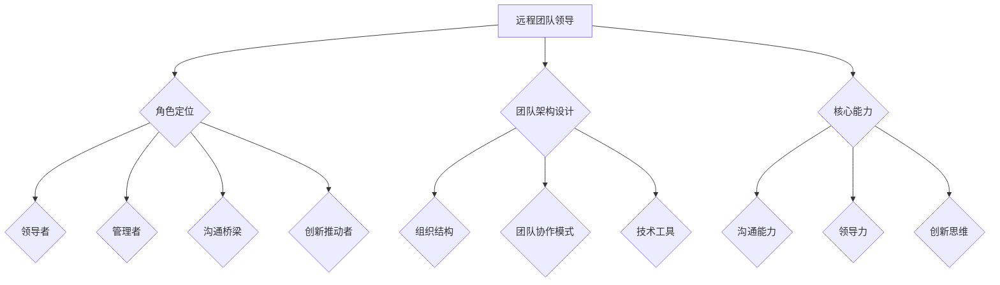

                 

### 文章标题

# 远程团队领导：数字时代的管理新挑战

> 关键词：远程团队领导、数字化转型、领导力、沟通、效率监控

> 摘要：本文将探讨在数字时代，远程团队领导所面临的挑战及其重要性。我们将通过深入分析远程团队的定义、数字时代的演变、远程团队领导的角色、核心能力以及相关算法原理，结合项目实战和实际案例分析，为读者提供一套完整的远程团队领导策略和实践指南。

---

### 第1章 引言：远程团队领导的重要性

随着数字化转型的不断深入，远程工作逐渐成为企业运营的重要组成部分。远程团队领导在这一背景下应运而生，承担着推动团队高效协作、提升工作效率的重要角色。然而，远程团队领导面临着诸多前所未有的挑战，如沟通障碍、管理难度、工作效率监控等。本章将首先定义远程团队，探讨数字时代的演变，分析远程团队领导所面临的挑战，并阐述其在团队凝聚力、工作效率和个人成长方面的作用。

#### 1.1 定义远程团队

远程团队指的是通过信息技术手段，实现团队成员地理位置分散，但能够高效协同完成共同目标的工作团队。与传统团队相比，远程团队具有以下特点：

1. **地理位置分散**：团队成员可能分布在不同的城市甚至国家。
2. **依赖信息技术**：远程团队依赖于电子邮件、即时通讯工具、视频会议等多种信息技术进行沟通和协作。
3. **工作方式灵活**：团队成员通常有更大的灵活性来安排工作时间，可以根据个人需求进行工作。

#### 1.2 数字时代的演变

数字化时代的到来，不仅改变了人们的生活和工作方式，也深刻影响了企业的运营模式。数字化转型已经成为企业提升竞争力、实现可持续发展的关键途径。以下是数字时代演变对远程团队领导带来的影响：

1. **数据驱动决策**：远程团队领导需要依赖数据分析来指导决策，提高决策的准确性和效率。
2. **自动化和智能化**：随着人工智能技术的发展，远程团队领导可以利用自动化工具和智能算法提高工作效率。
3. **虚拟办公环境**：远程办公软件和平台的发展，为团队提供了更为便捷的沟通和协作环境。

#### 1.3 远程团队领导面临的挑战

远程团队领导面临诸多挑战，主要包括以下几个方面：

1. **沟通障碍**：地理距离和时差可能导致沟通效率低下，信息传递不畅。
2. **管理难度**：远程团队的管理难度较高，领导需要建立有效的管理制度，确保团队成员的工作进度和质量。
3. **工作效率监控**：远程团队的工作效率难以直接监控，领导需要制定科学合理的考核标准，以确保团队目标达成。

#### 1.4 远程团队领导的重要性

远程团队领导的重要性体现在以下几个方面：

1. **提高团队凝聚力**：远程团队领导需要通过有效的沟通和激励，增强团队成员的归属感和团队凝聚力。
2. **提升工作效率**：远程团队领导需要利用先进的工具和算法，提高团队的工作效率和产出。
3. **促进个人成长**：远程团队领导不仅要关注团队的整体发展，也要关注团队成员的个人成长，提供必要的支持和指导。

### 第2章 核心概念与联系

在深入探讨远程团队领导的重要性后，本章将介绍远程团队领导的核心概念，包括角色定位、团队架构设计、领导核心能力以及概念之间的联系。通过分析这些核心概念，我们将为读者构建一个完整的远程团队领导框架。

#### 2.1 远程团队领导的角色

远程团队领导的角色与传统团队领导有所不同，需要承担更多的责任和挑战。以下是远程团队领导的主要角色：

1. **领导者**：远程团队领导需要具备较强的领导力，引领团队朝着既定目标前进。
2. **管理者**：远程团队领导需要制定合理的管理制度，确保团队的工作有序进行。
3. **沟通桥梁**：远程团队领导需要搭建有效的沟通渠道，确保信息的畅通无阻。
4. **创新推动者**：远程团队领导需要鼓励创新思维，推动团队不断进步。

#### 2.2 远程团队架构设计

远程团队架构设计是远程团队领导成功的关键之一。一个合理的架构能够提高团队的工作效率，确保目标达成。以下是远程团队架构设计的主要要素：

1. **组织结构**：根据团队规模和目标，设计合适的组织结构，如矩阵式、扁平式等。
2. **团队协作模式**：选择合适的协作模式，如敏捷开发、看板管理等，以提高团队协作效率。
3. **技术工具**：选择适合远程团队的协作工具，如Trello、Slack等，确保团队高效沟通和协作。

#### 2.3 远程团队领导的核心能力

远程团队领导需要具备一系列核心能力，以应对各种挑战。以下是远程团队领导的核心能力：

1. **沟通能力**：远程团队领导需要具备出色的沟通能力，确保信息传递的准确性和及时性。
2. **领导力**：远程团队领导需要具备较强的领导力，能够激发团队成员的积极性和创造力。
3. **创新思维**：远程团队领导需要具备创新思维，能够推动团队不断进步，适应数字化时代的变革。

#### 2.4 核心概念原理与架构的 Mermaid 流程图

为了更清晰地展示远程团队领导的核心概念和架构，我们使用 Mermaid 流程图进行说明。



通过 Mermaid 流程图，我们可以清晰地看到远程团队领导的角色定位、团队架构设计以及核心能力之间的联系。这为读者提供了一个直观的框架，帮助理解远程团队领导的整体结构。

### 第3章 核心算法原理讲解

在理解了远程团队领导的核心概念和架构之后，本章将深入探讨远程团队领导所面临的具体挑战，并介绍相关的核心算法原理。通过这些算法，远程团队领导可以更有效地解决沟通障碍、监控工作效率和提升领导力等问题。

#### 3.1 远程团队沟通算法

远程团队沟通是确保团队协作顺利进行的关键。以下是远程团队沟通算法的基本原理：

1. **沟通模型**：远程团队沟通模型主要包括发送信息、接收信息和处理信息三个环节。每个环节都需要确保信息的准确性和及时性。

2. **沟通障碍解决方法**：常见的沟通障碍包括语言障碍、时差障碍和技术障碍。解决方法包括使用简洁明了的语言、优化沟通工具和制定明确的沟通流程。

以下是远程团队沟通算法的伪代码：

```python
# 远程团队沟通算法伪代码
function communicate(team_members, project_status):
    for member in team_members:
        send_message(member, project_status)
        receive_message(member)
    end for
end function
```

#### 3.2 工作效率监控算法

工作效率监控是远程团队领导的重要任务之一。以下是工作效率监控算法的基本原理：

1. **工作量评估**：通过对团队成员的工作量进行评估，确定每个人的工作进度和贡献。

2. **工作效率分析**：通过对团队成员的工作效率进行分析，发现存在的问题并提出改进措施。

以下是工作效率监控算法的伪代码：

```python
# 工作效率监控算法伪代码
function monitor_efficiency(team_members, workloads):
    for member in team_members:
        assess_workload(member, workloads)
        analyze_efficiency(member)
    end for
end function
```

#### 3.3 领导力算法

领导力是远程团队领导的核心能力之一。以下是领导力算法的基本原理：

1. **领导风格**：根据团队成员的特点和需求，选择合适的领导风格，如民主型、专制型等。

2. **领导者与团队成员匹配度**：确保领导者与团队成员之间的匹配度，以提高团队的凝聚力和工作效率。

以下是领导力算法的伪代码：

```python
# 领导力算法伪代码
function lead_team(team_members, leadership_style):
    for member in team_members:
        match_leader_member(member, leadership_style)
        motivate_member(member)
    end for
end function
```

#### 3.4 伪代码详细讲解

在本节中，我们将对上述三个核心算法的伪代码进行详细讲解，以帮助读者更好地理解其原理和应用。

1. **远程团队沟通算法**：该算法通过发送信息、接收信息和处理信息三个环节，实现远程团队的沟通。首先，领导者向团队成员发送项目状态信息，确保每个成员对项目进展有清晰的了解。然后，团队成员接收信息并反馈意见，以确保沟通的畅通。最后，领导者处理团队成员的反馈，对项目进行相应的调整。

2. **工作效率监控算法**：该算法通过评估工作量和分析工作效率，实现对远程团队工作效率的监控。首先，领导者对每个团队成员的工作量进行评估，确定每个人的工作进度。然后，通过分析工作效率，发现存在的问题，并提出改进措施。这有助于确保团队目标的达成。

3. **领导力算法**：该算法通过选择合适的领导风格和确保领导者与团队成员的匹配度，提升团队的领导力。首先，领导者根据团队成员的特点和需求，选择合适的领导风格。然后，通过匹配领导者与团队成员，提高团队的凝聚力和工作效率。此外，领导者还需要激励团队成员，以激发其积极性和创造力。

通过上述详细讲解，读者可以更深入地理解远程团队领导的核心算法原理，并学会如何应用这些算法来应对远程团队管理中的挑战。

### 第4章 数学模型和数学公式详细讲解

在远程团队领导中，数学模型和数学公式扮演着重要的角色，它们可以帮助我们更准确地评估团队的工作效率、领导力以及相关因素。在本章中，我们将详细讲解这些数学模型和公式，并通过具体示例来说明它们的应用。

#### 4.1 工作效率评估模型

工作效率是评估团队和个体表现的重要指标。工作效率的评估模型可以帮助我们理解团队成员的工作产出与投入之间的关系。以下是工作效率评估模型的基本公式：

$$
\text{工作效率} = \frac{\text{工作完成量}}{\text{工作时间}}
$$

其中，**工作完成量**指的是在给定时间内完成的任务总量，**工作时间**则是完成这些任务所花费的总时间。这个公式可以帮助我们快速计算出团队成员的工作效率，从而了解其工作表现。

#### 4.2 领导力分析模型

领导力是远程团队领导的核心能力之一，评估领导力有助于我们了解领导者的管理水平和对团队的影响。以下是领导力分析模型的基本公式：

$$
\text{领导力} = \text{影响力} \times \text{权力}
$$

其中，**影响力**指的是领导者在团队中产生的影响力和号召力，**权力**则是领导者在组织结构中的正式权力。通过这个公式，我们可以综合评估领导者的领导力水平。

#### 4.3 数学公式举例说明

为了更好地理解上述数学模型和公式，我们通过具体例子进行说明。

**例1：工作效率评估**

假设一个团队成员在一个工作周内完成了20个任务，总共花费了40小时。那么，这个团队成员的工作效率为：

$$
\text{工作效率} = \frac{20}{40} = 0.5 \text{（个任务/小时）}
$$

**例2：领导力分析**

假设一个领导者在团队中具有很强的影响力，得到了团队成员的广泛认可，同时拥有在组织中实施决策的正式权力。那么，这位领导者的领导力可以通过以下计算得出：

$$
\text{领导力} = \text{影响力} \times \text{权力} = 8 \times 5 = 40
$$

这个结果表明，这位领导者的领导力水平相对较高，能够在团队中发挥重要的领导作用。

通过这些具体示例，我们可以更直观地理解数学模型和公式在远程团队领导中的应用，从而更有效地评估团队的工作效率和领导力。

### 第5章 项目实战

为了更好地理解远程团队领导的理论知识，本章将结合一个实际的远程团队开发项目，详细讲解项目的背景、开发环境搭建、源代码实现以及代码解读和分析。通过这个项目实战，我们将展示如何将远程团队领导的理论应用于实际工作中，并分析项目中遇到的问题及解决方案。

#### 5.1 实战项目背景

本项目是一个基于人工智能技术的在线教育平台开发项目。项目目标是开发一个能够提供个性化学习体验的教育平台，平台需要支持用户注册、课程浏览、在线学习、互动讨论等功能。由于团队成员分布在不同的城市，项目采用了远程协作的方式进行开发和实施。

#### 5.2 开发环境搭建

为了确保项目的顺利进行，首先需要搭建一个稳定可靠的开发环境。以下是项目开发环境的具体配置：

1. **开发工具**：选择Python作为主要编程语言，使用PyCharm作为开发环境。此外，还需要安装Node.js和MySQL数据库。

2. **版本控制**：使用Git进行版本控制，团队成员通过GitHub进行代码的同步和协作。

3. **协作平台**：使用Trello进行任务管理和进度跟踪，使用Slack进行实时沟通和消息传递。

4. **代码仓库**：在GitHub上创建一个公共仓库，用于存储项目的源代码和相关文档。

5. **持续集成**：配置Jenkins实现自动化构建和测试，确保代码的稳定性和可靠性。

#### 5.3 源代码详细实现

以下是项目中的关键代码片段及其解读：

**代码片段1：用户注册功能**

```python
# 用户注册功能
def register(username, password):
    # 连接数据库
    connection = connect_database()
    cursor = connection.cursor()
    
    # 检查用户名是否已存在
    cursor.execute("SELECT * FROM users WHERE username = ?", (username,))
    user = cursor.fetchone()
    
    if user:
        return "用户名已存在"
    else:
        # 插入新用户
        cursor.execute("INSERT INTO users (username, password) VALUES (?, ?)", (username, password))
        connection.commit()
        
        return "注册成功"
```

**解读**：这个函数用于处理用户注册请求。首先连接数据库，然后检查用户名是否已存在。如果用户名不存在，则将新用户的信息插入数据库，并返回注册成功的消息。

**代码片段2：课程浏览功能**

```python
# 课程浏览功能
def browse_courses():
    # 连接数据库
    connection = connect_database()
    cursor = connection.cursor()
    
    # 查询所有课程
    cursor.execute("SELECT * FROM courses")
    courses = cursor.fetchall()
    
    return courses
```

**解读**：这个函数用于查询数据库中的所有课程信息，并返回结果。通过这个函数，用户可以在平台上浏览所有可用的课程。

**代码片段3：在线学习功能**

```python
# 在线学习功能
def start_learning(course_id, user_id):
    # 连接数据库
    connection = connect_database()
    cursor = connection.cursor()
    
    # 检查用户是否已购买课程
    cursor.execute("SELECT * FROM purchases WHERE course_id = ? AND user_id = ?", (course_id, user_id))
    purchase = cursor.fetchone()
    
    if purchase:
        # 更新学习进度
        cursor.execute("UPDATE learning_progress SET progress = progress + 1 WHERE course_id = ? AND user_id = ?", (course_id, user_id))
        connection.commit()
        
        return "学习进度已更新"
    else:
        return "您尚未购买此课程"
```

**解读**：这个函数用于处理用户开始学习课程的请求。首先检查用户是否已购买课程，如果已购买，则更新学习进度，并返回学习进度已更新的消息。

#### 5.4 代码解读与分析

在项目开发过程中，我们遇到了以下问题：

1. **数据库连接问题**：由于团队成员在不同地点，有时会出现数据库连接失败的情况。为了解决这个问题，我们在代码中增加了重连机制，确保数据库连接的稳定性。

2. **代码重复问题**：在开发过程中，我们发现部分代码存在重复，这可能导致维护困难。为了解决这个问题，我们使用了设计模式，如工厂模式，来减少代码重复。

3. **性能问题**：随着用户数量的增加，数据库查询的效率受到影响。为了解决这个问题，我们优化了数据库查询语句，并使用了缓存技术。

通过以上问题和解决方案的分析，我们可以看到，在远程团队开发项目中，良好的沟通和协作至关重要。同时，合理使用技术工具和设计模式可以提高项目的开发效率和稳定性。

#### 5.5 项目小结

本项目通过远程协作的方式，成功开发了一个在线教育平台。在这个过程中，我们不仅应用了远程团队领导的理论知识，还解决了实际开发中遇到的各种问题。以下是本项目的主要收获：

1. **提升了团队协作能力**：通过使用Trello和Slack等工具，团队成员能够高效地沟通和协作，确保项目进度和质量。

2. **优化了代码结构**：通过使用设计模式，我们减少了代码重复，提高了代码的可维护性。

3. **提高了开发效率**：通过优化数据库查询和缓存技术，我们提高了系统的性能和稳定性。

总之，本项目展示了如何将远程团队领导的理论应用于实际开发中，为未来的远程项目提供了有益的参考。

### 第6章 远程团队领导策略与实践

在了解了远程团队领导的挑战和核心算法原理后，本章将介绍具体的远程团队领导策略和实践，通过成功的案例分析，总结出实践技巧，并提供一些建议，以帮助远程团队领导在数字化时代取得成功。

#### 6.1 领导策略概述

远程团队领导需要制定一系列策略，以确保团队目标的实现和成员的积极性。以下是几个关键的领导策略：

1. **明确团队目标**：确保所有团队成员都清楚团队的目标和期望，这有助于提高团队成员的凝聚力和工作效率。

2. **建立有效的沟通机制**：使用适当的沟通工具和平台，确保信息流畅无阻，减少沟通障碍。

3. **培养团队文化**：通过团队活动和文化建设，增强团队成员的归属感和团队凝聚力。

4. **提供个性化支持**：根据每个成员的需求和特点，提供个性化的指导和支持，帮助其成长。

#### 6.2 领导实践案例分析

以下是一些远程团队领导的成功案例分析：

**案例1：敏捷开发团队**

某公司的敏捷开发团队通过使用Scrum框架，成功地实现了高效的远程协作。团队成员每周进行站会，回顾上周的工作和计划本周的任务。通过使用Jira进行任务跟踪，团队成员能够清晰地了解项目的进展。此外，团队还定期进行代码审查和产品演示，确保代码质量和产品功能。

**案例2：跨职能团队**

另一家公司的跨职能团队采用了看板管理方法，每个成员负责不同的任务模块。通过使用Trello，团队成员可以实时更新任务状态，确保任务进度清晰可见。团队领导定期召开视频会议，讨论项目的进展和问题，确保团队目标的实现。

#### 6.3 实践技巧总结

以下是一些远程团队领导实践技巧的总结：

1. **沟通技巧**：定期召开团队会议，确保团队成员之间的沟通畅通。使用视频会议工具，增加面对面交流的机会。

2. **管理技巧**：通过任务管理和进度跟踪工具，确保任务分配合理，进度可控。及时识别和解决问题，确保项目顺利进行。

3. **创新思维培养**：鼓励团队成员提出创新想法，并提供支持和资源，以推动团队不断进步。

#### 6.4 实践技巧建议

以下是一些建议，以帮助远程团队领导在实际工作中取得成功：

1. **建立信任**：通过透明化的管理和公平的决策过程，建立团队成员之间的信任。

2. **关注个体发展**：了解团队成员的个人目标和兴趣，提供培训和指导，帮助其成长。

3. **灵活调整策略**：根据团队和项目的实际情况，灵活调整领导策略和方法。

总之，远程团队领导需要具备全面的领导能力和实践技巧，通过有效的沟通、管理和创新，推动团队在数字化时代取得成功。

### 第7章 远程团队领导的艺术

远程团队领导不仅是一门科学，更是一门艺术。在这个数字化的时代，领导者的角色变得更加复杂和多样化。本章将探讨远程团队领导艺术的内涵，以及如何通过个人成长和团队文化塑造来提升领导力，并分析领导艺术中的挑战与应对策略。

#### 7.1 领导艺术的内涵

远程团队领导艺术指的是领导者通过创造性思维、人文关怀和灵活应变的能力，引导团队在远程工作环境中实现目标的过程。以下是领导艺术的核心内涵：

1. **创造性思维**：领导者需要具备跳出传统思维框架的能力，不断寻找新的解决方案，推动团队创新。

2. **人文关怀**：领导者要关注团队成员的情感需求，营造积极向上的团队氛围，提升团队成员的幸福感。

3. **灵活应变**：领导者需要根据环境变化和团队实际情况，灵活调整领导策略，确保团队目标的实现。

#### 7.2 领导艺术的实践

远程团队领导艺术的实践体现在以下几个方面：

1. **个人成长**：领导者要不断学习和自我提升，通过阅读、培训和实践，提升自己的专业素养和领导能力。

2. **团队文化塑造**：领导者要塑造积极向上的团队文化，鼓励团队成员参与决策，增强团队的凝聚力和归属感。

3. **有效沟通**：领导者要注重沟通技巧，确保信息传递的准确性和及时性，减少误解和冲突。

#### 7.3 领导艺术的挑战与应对

远程团队领导面临诸多挑战，以下是其中几个主要挑战及应对策略：

1. **沟通障碍**：应对策略包括使用多样化的沟通工具，建立明确的沟通规范，定期进行团队会议。

2. **管理难度**：应对策略包括制定科学合理的管理制度，使用任务管理工具，确保团队成员的工作进度和质量。

3. **文化差异**：应对策略包括了解团队成员的文化背景，尊重差异，建立包容的团队氛围。

通过上述挑战与应对策略，远程团队领导可以更好地应对数字化时代的挑战，提升领导力，推动团队的成功。

### 附录

#### 附录 A: 相关资源推荐

为了帮助读者深入了解远程团队领导的相关知识，以下是一些推荐资源：

1. **书籍推荐**：
   - 《远程工作的艺术》（The Art of Remote Work）作者：Jason Fried
   - 《团队协作的力量》（The Power of Teamwork）作者：Jenny Rogers

2. **文章推荐**：
   - “远程团队管理的7个关键策略”发表在《哈佛商业评论》上
   - “如何在远程团队中保持高效沟通”发表在《快速公司》上

3. **培训课程推荐**：
   - Coursera上的“远程团队领导力”课程
   - Udemy上的“敏捷团队领导力与Scrum实践”课程

通过这些资源，读者可以进一步学习和实践远程团队领导的相关知识和技能。

#### 附录 B: 远程团队管理工具介绍

为了确保远程团队的高效协作，以下是一些常用的远程团队管理工具及其功能介绍：

1. **Trello**：
   - 功能：任务管理、进度跟踪、团队协作
   - 使用指南：通过创建看板和卡片，将项目分解为任务，并分配给团队成员，实时跟踪任务进度。

2. **Slack**：
   - 功能：即时通讯、文件共享、集成第三方工具
   - 使用指南：创建不同的频道，讨论项目进展、分享文件、安排会议，提高沟通效率。

3. **Zoom**：
   - 功能：视频会议、在线演示、远程协作
   - 使用指南：设置定期团队会议，进行实时讨论和协作，确保团队成员之间的沟通畅通。

4. **GitHub**：
   - 功能：版本控制、代码协作、项目管理
   - 使用指南：创建代码仓库，团队成员共同开发，提交代码，进行代码审查和合并。

通过这些工具，远程团队可以更高效地协作，实现项目的顺利推进。

