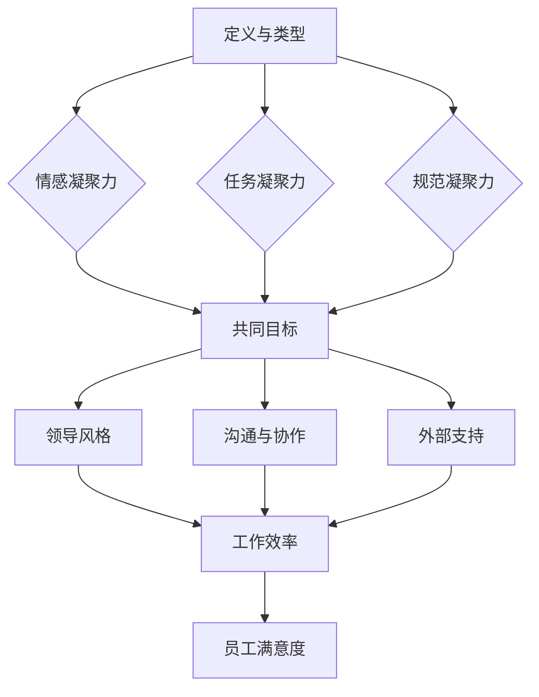

                 

### 《远程工作团队的凝聚力建设》

> 关键词：远程工作，团队凝聚力，沟通，领导力，信任建设，文化建设，工作环境优化

> 摘要：本文探讨了远程工作团队凝聚力建设的核心要素，包括沟通与协作、领导力、信任建设、文化建设和工作环境优化。通过理论分析和实践案例，提出了一系列提升远程团队凝聚力的策略和实践方法，旨在帮助团队在远程工作环境中保持高效和和谐。

---

# 第一部分：远程工作与团队凝聚力概述

## 第1章：远程工作的发展与趋势

### 1.1 远程工作的定义与历史演变

远程工作，也被称为远程办公或远程就业，指的是员工通过互联网和通信技术，在不同地理位置进行工作的一种工作模式。这种模式的历史可以追溯到20世纪80年代，当时计算机技术和互联网的兴起为远程工作提供了技术基础。最初，远程工作主要限于某些特殊职业，如程序员和自由职业者。

随着时间的推移，远程工作逐渐普及，特别是在21世纪初，随着移动互联网、云计算和协作工具的发展，远程工作变得更加可行和普及。全球范围内的许多公司开始采用远程工作制度，这不仅降低了办公成本，还提高了员工的灵活性和满意度。

### 1.2 远程工作在全球范围内的普及

远程工作的普及程度在不同国家和地区之间存在差异。在一些发达国家，如美国、英国和澳大利亚，远程工作已经成为一种普遍现象。根据Global Workforce Analytics的数据，2016年，全球约有4.7亿人从事远程工作，预计到2028年，这一数字将增加到5.3亿人。

在中国，远程工作也在迅速增长。根据腾讯研究院的报告，2020年，中国远程工作的参与率达到了31.3%，比2019年增长了4.5个百分点。这表明，远程工作在中国正逐渐成为一种主流的工作方式。

### 1.3 远程工作对团队凝聚力的影响

远程工作的普及对团队凝聚力产生了深远的影响。一方面，远程工作提供了更大的灵活性，使员工能够在更舒适的环境中工作，提高了工作满意度和生产力。另一方面，由于团队成员之间缺乏面对面的交流，可能导致沟通不畅、信任度降低和团队凝聚力下降。

在远程工作中，沟通和协作成为团队凝聚力的关键因素。有效的沟通可以加强团队成员之间的联系，提高工作协同效率。然而，远程沟通也面临着一些挑战，如时区差异、技术问题和沟通障碍。

总的来说，远程工作对团队凝聚力的影响是复杂的。通过有效的沟通、领导力和团队文化建设，远程工作团队可以克服这些挑战，保持高效和和谐的团队关系。

---

## 第2章：团队凝聚力的概念与构成

### 2.1 团队凝聚力的定义与类型

团队凝聚力是指团队成员之间在情感、行为和价值观上的相互吸引力。根据研究，团队凝聚力可以分为三类：情感凝聚力、任务凝聚力和规范凝聚力。

- **情感凝聚力**是指团队成员之间在情感上的亲密和友谊。
- **任务凝聚力**是指团队成员共同完成特定任务或项目的动机和目标。
- **规范凝聚力**是指团队成员遵守团队规则和价值观的意愿。

### 2.2 团队凝聚力的影响因素

团队凝聚力的形成受到多种因素的影响，包括：

- **共同目标**：团队成员拥有共同的目标和价值观，有助于增强团队凝聚力。
- **领导风格**：领导者的风格对团队凝聚力有重要影响。民主型领导风格通常更能促进团队凝聚力。
- **沟通与协作**：有效的沟通和协作是团队凝聚力的重要基础。
- **外部支持**：组织对团队的支持，如提供资源、培训和激励措施，可以增强团队凝聚力。

### 2.3 团队凝聚力的重要性

团队凝聚力对组织的绩效和员工满意度具有显著影响。高凝聚力的团队通常具有以下优势：

- **更高的工作效率**：团队成员之间沟通顺畅，协作高效，能够快速解决问题。
- **更好的创新氛围**：团队成员相互信任，愿意分享想法和观点，有利于创新和团队成长。
- **更高的员工满意度**：团队成员感受到归属感和被重视，工作满意度提高，离职率降低。

总的来说，团队凝聚力是远程工作团队成功的关键因素之一。通过理解和应用团队凝聚力的概念和影响因素，团队可以更好地应对远程工作的挑战，实现高效和和谐的工作环境。

---

# Mermaid 流程图

为了更好地展示团队凝聚力概念与构成之间的联系，我们可以使用Mermaid流程图来表示。以下是流程图的示例：

在下一部分中，我们将探讨如何通过具体的策略和措施来提升远程团队的凝聚力。

---

# 第二部分：远程工作团队凝聚力建设策略

## 第3章：远程工作团队的沟通与协作

### 3.1 远程沟通工具的选择与应用

远程工作的一个关键挑战是沟通的效率和质量。选择合适的沟通工具对于提升团队凝聚力至关重要。以下是一些常用的远程沟通工具：

- **即时通讯工具**：如Slack、Microsoft Teams、WhatsApp等，用于实时沟通和协作。
- **视频会议工具**：如Zoom、Google Meet、Skype等，用于团队会议和面对面交流。
- **项目管理工具**：如Trello、Jira、Asana等，用于任务分配、进度跟踪和团队协作。
- **文档共享与协作工具**：如Google Docs、Microsoft Office 365等，用于文件共享和实时编辑。

### 3.2 提升远程沟通效率的方法

提升远程沟通效率的方法包括：

- **明确的沟通目标**：每次沟通前，明确沟通的目标和议程，确保沟通具有针对性。
- **有效的沟通技巧**：如积极倾听、清晰表达、及时反馈等，有助于减少误解和沟通障碍。
- **定期会议**：通过定期会议，保持团队成员之间的联系和沟通，确保团队目标的统一。

### 3.3 促进远程团队协作的技巧

促进远程团队协作的技巧包括：

- **分工明确**：明确每个团队成员的职责和任务，确保工作有序进行。
- **任务跟踪**：使用项目管理工具跟踪任务进度，确保团队成员了解各自的工作状态。
- **协作精神**：鼓励团队成员相互支持和合作，共同应对挑战。

---

## 第4章：远程团队领导力与影响力

### 4.1 远程团队领导的角色与责任

远程团队领导扮演着至关重要的角色。他们的主要责任包括：

- **设定目标**：明确团队的目标和愿景，确保团队成员了解并致力于实现这些目标。
- **提供指导**：为团队成员提供工作指导和支持，帮助他们克服困难和挑战。
- **维护沟通**：确保团队成员之间的沟通畅通，及时解决沟通中的问题。
- **激励团队**：通过激励措施，提高团队成员的工作动力和满意度。

### 4.2 远程团队领导者的挑战与应对

远程团队领导者面临的挑战包括：

- **沟通障碍**：远程工作环境中，沟通障碍可能导致信息传递不畅，影响团队协作。
- **监控与管理**：远程工作使领导者难以直接监控和管理团队成员的工作。
- **信任问题**：远程工作可能引发信任问题，影响团队凝聚力。

应对这些挑战的方法包括：

- **建立信任**：通过透明沟通和及时反馈，建立和维护团队成员之间的信任。
- **灵活管理**：采用灵活的管理方法，如目标管理、任务分解和时间跟踪，提高团队的工作效率和自律性。
- **利用技术**：使用项目管理工具和通信平台，提高团队的沟通效率和协作能力。

### 4.3 提升远程领导力的策略

提升远程领导力的策略包括：

- **培训与学习**：定期参与培训和研讨会，提升领导力和管理能力。
- **鼓励反馈**：鼓励团队成员提供反馈，倾听他们的意见和建议，不断改进工作方式。
- **关注个人发展**：关注团队成员的个人发展，提供成长机会和支持。

通过有效的领导力和管理，远程团队可以克服远程工作的挑战，保持高效和和谐的团队关系。

---

## 第5章：远程团队的信任建设

### 5.1 远程团队信任的重要性

信任是团队凝聚力的基石，对于远程工作团队尤为重要。信任能够促进团队成员之间的合作，提高工作效率和满意度。以下是远程团队信任的重要性：

- **促进沟通**：信任有助于团队成员之间的信息共享和透明沟通，减少误解和冲突。
- **提高协作效率**：信任使团队成员更愿意相互支持和合作，共同完成任务。
- **增强团队凝聚力**：信任有助于建立团队成员之间的情感联系，提高团队的凝聚力。

### 5.2 建立远程团队信任的策略

建立远程团队信任的策略包括：

- **透明沟通**：定期更新项目进展和决策过程，确保团队成员了解团队的工作情况。
- **共享目标与价值观**：明确团队的目标和价值观，确保团队成员共同追求并认同这些目标。
- **及时反馈**：及时给予团队成员反馈，包括工作成果和改进建议。
- **尊重与支持**：尊重团队成员的意见和贡献，提供必要的支持和资源。

### 5.3 维护与恢复信任的方法

维护与恢复信任的方法包括：

- **预防措施**：通过培训和教育，提高团队成员的沟通技能和团队意识。
- **沟通与协商**：在信任受到威胁时，及时沟通并协商解决方案，避免误解和冲突的加剧。
- **修复与恢复**：在信任受到损害时，采取修复措施，如公开道歉、提供补偿和改进方案。
- **持续监督**：通过定期的团队会议和反馈机制，持续监督团队的信任状况，及时采取措施。

通过这些策略，远程工作团队可以建立和维护信任，提高团队的凝聚力和工作效率。

---

## 第6章：远程团队的文化建设

### 6.1 远程团队文化的定义与作用

远程团队文化是指团队中成员共同遵循的价值观、行为规范和工作方式。远程团队文化的定义和作用包括：

- **价值观传递**：团队文化传递了团队的价值观，如诚信、协作、创新等，影响团队成员的行为和决策。
- **团队凝聚力**：团队文化有助于建立团队成员之间的情感联系，提高团队的凝聚力。
- **行为规范**：团队文化为团队成员提供了行为规范，指导他们在工作中的行为和态度。
- **工作氛围**：团队文化塑造了团队的工作氛围，如积极、开放、支持等，影响团队成员的工作满意度和效率。

### 6.2 塑造远程团队文化的步骤

塑造远程团队文化的步骤包括：

- **明确团队价值观**：首先，团队需要明确共同的价值观，如诚信、协作、创新等，作为团队文化的基础。
- **制定文化准则**：根据团队价值观，制定具体的文化准则，如沟通规范、工作态度、团队行为等。
- **宣传与推广**：通过内部沟通渠道，如邮件、会议、社交媒体等，宣传和推广团队文化，确保团队成员了解和认同。
- **实践与执行**：团队成员需要通过实际行动践行团队文化，如遵守文化准则、参与团队活动等。

### 6.3 维护远程团队文化的策略

维护远程团队文化的策略包括：

- **定期评估**：定期评估团队文化的执行情况和效果，了解团队成员的反馈和需求。
- **持续沟通**：通过定期的团队会议和沟通活动，确保团队成员对团队文化的理解和认同。
- **激励机制**：建立激励机制，鼓励团队成员践行团队文化，如奖励优秀员工、表彰文化践行者等。
- **文化更新**：根据团队的发展和外部环境的变化，及时调整和更新团队文化，确保其与团队需求保持一致。

通过塑造和维护远程团队文化，团队可以建立积极、和谐的工作氛围，提高团队成员的工作满意度和团队凝聚力。

---

## 第7章：远程工作环境的优化

### 7.1 远程工作环境的构建

远程工作环境的构建是确保团队成员能够高效工作的重要基础。构建远程工作环境的关键步骤包括：

- **技术基础设施**：提供稳定的网络连接、高效的工作设备和安全的数据存储设施，确保团队成员能够顺畅地进行工作。
- **工作空间设计**：为团队成员提供舒适的工作空间，如独立办公室、开放的工作区域等，以满足他们的工作需求。
- **协作工具集成**：整合各种协作工具，如即时通讯、视频会议、项目管理等，确保团队成员能够方便地进行沟通和协作。

### 7.2 提升远程工作效率的空间设计

提升远程工作效率的空间设计包括以下几个方面：

- **光线充足**：确保工作区域有充足的自然光线，有助于提高团队成员的舒适度和工作效率。
- **噪音控制**：通过隔音材料和设施，减少外部噪音的干扰，为团队成员提供一个安静的工作环境。
- **舒适座椅和桌子**：提供符合人体工程学的座椅和桌子，减少团队成员的疲劳感，提高工作效率。
- **灵活的工作布局**：设计灵活的工作布局，如可调节的高度桌面、移动工作站等，以满足团队成员不同的工作需求。

### 7.3 远程工作设备的配置与维护

远程工作设备的配置与维护是确保团队成员能够高效工作的重要保障。以下是一些关键步骤：

- **设备配置**：根据团队成员的工作需求，提供适当的设备，如笔记本电脑、显示器、摄像头、耳机等。
- **定期升级**：定期检查和升级设备，确保其性能稳定和安全。
- **故障处理**：建立快速响应的故障处理机制，及时解决设备故障，减少工作中断。
- **数据安全**：采取有效的数据安全措施，如加密存储、定期备份等，保护团队成员的工作数据。

通过优化远程工作环境，团队可以提供更好的工作条件，提高团队成员的工作效率和满意度。

---

## 第8章：远程团队凝聚力评估与提升

### 8.1 远程团队凝聚力评估的方法

远程团队凝聚力的评估是了解团队凝聚状态的重要手段。以下是几种常用的评估方法：

- **问卷调查**：通过设计问卷，收集团队成员对团队凝聚力各方面的看法，如沟通质量、协作效率、信任程度等。
- **面对面访谈**：与团队成员进行一对一或小组访谈，深入了解他们对团队凝聚力的感受和意见。
- **工作绩效评估**：通过分析团队成员的工作绩效和项目完成情况，评估团队的整体表现和凝聚力。
- **团队活动参与度**：观察团队成员参与团队活动和社交活动的程度，评估他们的团队归属感和参与度。

### 8.2 提升远程团队凝聚力的具体措施

根据评估结果，可以采取以下具体措施来提升远程团队的凝聚力：

- **加强沟通**：通过定期会议、即时通讯和团队活动，加强团队成员之间的沟通和互动，提高沟通质量。
- **建立信任**：通过透明的沟通、及时的反馈和共同的目标，建立和维护团队成员之间的信任。
- **文化塑造**：通过团队文化建设活动，如团队建设培训、团队文化活动等，塑造积极向上的团队文化。
- **工作支持**：为团队成员提供必要的工作支持和资源，如技术培训、心理健康支持等，提高他们的工作满意度和团队凝聚力。

### 8.3 持续优化远程团队凝聚力的实践

持续优化远程团队凝聚力的实践包括：

- **定期评估**：定期对团队凝聚力进行评估，了解团队凝聚力的变化和问题，及时采取改进措施。
- **反馈机制**：建立反馈机制，鼓励团队成员提供意见和建议，持续改进团队凝聚力的建设。
- **团队文化建设**：持续关注团队文化建设，通过团队文化活动、团队价值观的传播等，巩固团队凝聚力。
- **个性化支持**：根据团队成员的不同需求和特点，提供个性化的支持，提高他们的工作满意度和团队归属感。

通过持续优化远程团队凝聚力，团队可以保持高效和和谐的工作环境，提高整体绩效和员工满意度。

---

## 第三部分：远程团队凝聚力建设实践案例分析

### 第9章：远程团队凝聚力建设的实践案例

在本章节中，我们将通过分析几个实际的远程团队凝聚力建设案例，探讨如何在不同背景下提升团队的凝聚力。以下是几个案例的概述：

#### 9.1 案例一：某跨国远程团队凝聚力建设实践

某跨国公司在全球范围内设立了多个远程工作团队，由于团队成员分布在不同的国家和地区，时区差异和文化差异带来了沟通和协作的挑战。为了提升团队的凝聚力，公司采取了以下措施：

- **建立统一的沟通平台**：使用Slack作为主要的沟通工具，确保所有团队成员都能及时获取信息，减少沟通障碍。
- **定期视频会议**：每周组织一次视频会议，让团队成员能够面对面交流，增强团队联系。
- **文化庆典活动**：定期举办虚拟的文化庆典活动，如线上庆祝节日、团队比赛等，增强团队归属感。
- **个性化关怀**：领导层定期与团队成员进行一对一沟通，了解他们的需求和困扰，提供个性化支持。

通过这些措施，该跨国公司的远程团队凝聚力显著提升，团队成员之间的沟通更加顺畅，工作效率和满意度也得到提高。

#### 9.2 案例二：某初创公司远程团队凝聚力建设实践

某初创公司由于预算限制，无法提供传统办公环境，因此团队完全采用远程工作模式。为了在资源有限的情况下提升团队的凝聚力，公司采取了以下策略：

- **灵活的工作时间**：允许团队成员根据自己的情况灵活安排工作时间，提高工作满意度。
- **协作工具优化**：采用Trello和Zoom等工具，确保团队成员能够高效地进行任务分配和协作。
- **定期反馈和庆祝**：每周进行团队反馈会议，鼓励团队成员分享工作进展和经验，同时设立里程碑庆祝活动，激励团队士气。
- **团队文化建设**：通过线上分享会和团队游戏，营造积极向上的团队文化。

这些策略帮助初创公司的远程团队建立了紧密的联系，保持了高效的工作状态。

#### 9.3 案例三：某远程教育团队凝聚力建设实践

某远程教育团队由于团队成员分布在不同的城市和国家，面临沟通和文化差异的挑战。为了提升团队的凝聚力，团队采取了以下措施：

- **虚拟团队建设活动**：定期举办虚拟团队建设活动，如在线研讨会、团队游戏和社交活动，增强团队成员之间的互动。
- **文化多样性培训**：组织文化多样性培训，帮助团队成员更好地理解和尊重不同的文化背景。
- **透明沟通**：通过邮件和内部通讯平台，保持团队内部沟通的透明度，确保信息畅通无阻。
- **心理健康支持**：提供心理健康支持，帮助团队成员应对远程工作中的压力和挑战。

通过这些措施，远程教育团队的凝聚力显著提升，团队成员之间的协作更加高效，团队整体的工作质量和满意度也得到提高。

这些实践案例表明，无论团队规模和资源如何，通过有效的策略和措施，远程工作团队都可以建立强大的凝聚力，实现高效和和谐的工作环境。

---

## 第10章：远程团队凝聚力建设的挑战与未来展望

### 10.1 远程团队凝聚力建设的挑战

远程团队凝聚力建设面临多种挑战，包括：

- **沟通障碍**：远程工作环境中，沟通受限，可能导致信息传递不畅和误解。
- **文化差异**：团队成员来自不同的文化背景，可能存在沟通和文化上的冲突。
- **工作监控**：远程工作使领导者难以直接监控和管理团队成员的工作，影响团队绩效。
- **信任问题**：缺乏面对面的交流，可能导致团队成员之间的信任度降低。

### 10.2 未来远程团队凝聚力建设的发展趋势

未来远程团队凝聚力建设将呈现以下发展趋势：

- **技术整合**：随着技术的发展，更先进和高效的沟通和协作工具将得到广泛应用，提高团队的工作效率。
- **文化融合**：团队文化将更加注重多样性，鼓励团队成员相互理解和尊重不同的文化背景。
- **个性化和灵活管理**：管理方法将更加个性化，注重满足团队成员的个性化需求，提高工作满意度和团队凝聚力。
- **心理健康关注**：团队将更加关注团队成员的心理健康，提供更多的心理健康支持，提高团队的整体幸福感。

### 10.3 对远程团队凝聚力建设的思考与建议

为了应对远程团队凝聚力建设的挑战和把握发展趋势，以下是一些建议：

- **加强沟通**：建立多样化的沟通渠道，如即时通讯、视频会议和项目管理工具，确保团队成员之间的沟通顺畅。
- **培养文化意识**：组织文化多样性培训，提高团队成员的文化理解和沟通能力。
- **建立信任机制**：通过透明的沟通和及时的反馈，建立和维护团队成员之间的信任。
- **提供支持**：为团队成员提供心理健康支持，帮助他们应对远程工作中的压力和挑战。
- **持续优化**：定期评估团队凝聚力，并根据反馈进行调整和优化，确保团队凝聚力持续提升。

通过这些思考和建议，远程团队可以克服挑战，把握发展趋势，实现高效的团队凝聚力和工作绩效。

---

# 作者信息

作者：AI天才研究院/AI Genius Institute & 禅与计算机程序设计艺术 /Zen And The Art of Computer Programming

---

本文基于远程工作团队的凝聚力建设，从多个角度探讨了提升团队凝聚力的策略和实践方法。通过理论分析和实际案例分析，本文提出了一系列有效的策略，如加强沟通、培养文化意识、建立信任机制和提供心理健康支持等。未来，远程团队凝聚力建设将继续面临挑战，但通过不断优化和创新，团队可以克服这些挑战，实现高效和和谐的工作环境。希望本文能够为远程团队的管理者和成员提供有益的启示和指导。

