                 


### 文章标题

# 远程工作平衡：协调工作与生活的策略

### 文章关键词

远程工作、工作与生活平衡、时间管理、沟通技巧、心理健康

### 文章摘要

随着全球远程工作的兴起，如何协调工作与生活的平衡成为了一个重要议题。本文将探讨远程工作的优势与挑战，并提供一系列策略，帮助远程工作者实现工作与生活的平衡。通过案例分析、最佳实践分享，以及技术支持的介绍，本文旨在为远程工作者提供实用的指导，帮助他们在远程工作环境中保持高效与和谐。

## 引言

### 1.1 远程工作现状

远程工作，即通过互联网和通信技术，在非公司办公场所进行工作。这种工作模式近年来在全球范围内迅速普及，尤其是在新冠疫情的推动下。根据国际远程工作协会（International Association of Virtual办公）的数据，全球远程工作者的数量在过去几年中增长了约30%。

### 1.2 远程工作的利与弊

远程工作的优势包括提高工作效率、弹性工作安排、减少通勤时间等。然而，它也带来了一些挑战，如沟通障碍、隔离感、家庭与工作冲突等。

## 第一部分：远程工作的优势与挑战

### 2.1 远程工作的优势

#### 2.1.1 提高工作效率

远程工作使得员工可以在自己的舒适环境中工作，减少了通勤时间和环境干扰，从而提高了工作效率。

#### 2.1.2 弹性工作安排

远程工作提供了更大的灵活性，员工可以根据自己的需求和工作性质，灵活安排工作时间。

#### 2.1.3 减少通勤时间

通勤时间的减少不仅提高了工作效率，还有助于减少交通拥堵和环境污染。

### 2.2 远程工作的挑战

#### 2.2.1 沟通障碍

远程工作可能导致沟通不畅，信息的及时传递和反馈变得困难。

#### 2.2.2 隔离感

长期远程工作可能导致员工感到孤独和隔离，影响心理健康。

#### 2.2.3 家庭与工作冲突

远程工作使得家庭和工作环境融合，导致家庭与工作之间的界限模糊，增加了工作与生活的冲突。

### 2.3 远程工作的最佳实践

#### 2.3.1 设立工作区域

在家中设立专门的工作区域，有助于明确工作与生活的界限。

#### 2.3.2 维持工作与生活界限

设定工作时间和休息时间，确保工作与生活的平衡。

#### 2.3.3 建立有效的沟通机制

使用即时通讯工具、视频会议等，确保团队成员之间的有效沟通。

## 第二部分：工作与生活平衡的策略

### 3.1 管理时间

#### 3.1.1 时间管理技巧

使用时间管理工具，如待办事项清单、时间跟踪工具等，提高时间利用率。

#### 3.1.2 设定工作优先级

根据工作的重要性和紧急性，设定工作优先级，确保高效完成任务。

#### 3.1.3 提高工作效率

采用高效的工具和技巧，如自动化流程、快速响应等，提高工作效率。

### 3.2 自我管理

#### 3.2.1 建立健康的作息习惯

保持规律的作息时间，确保充足的睡眠和休息。

#### 3.2.2 保持身心健康

通过运动、冥想等方式，保持身心健康。

#### 3.2.3 提高自我调节能力

学会情绪管理和压力管理，提高自我调节能力。

### 3.3 家庭与社会平衡

#### 3.3.1 家庭时间管理

合理安排家庭时间，确保与家人共度美好时光。

#### 3.3.2 社交活动与远程工作的平衡

积极参与社交活动，保持与同事和朋友的良好关系。

#### 3.3.3 建立社区支持系统

加入远程工作者社区，寻求支持和帮助。

## 第三部分：实际案例与应用

### 4.1 案例研究

#### 4.1.1 案例一：如何远程工作并保持生活平衡

介绍一位远程工作者的成功经验，包括其如何应对远程工作的挑战和实现工作与生活平衡。

#### 4.1.2 案例二：企业如何支持远程工作者的生活平衡

分析企业如何通过政策和技术支持，帮助远程工作者实现工作与生活的平衡。

### 4.2 应用策略

#### 4.2.1 企业远程工作策略

介绍企业制定远程工作策略的要点，包括工作安排、沟通机制、员工福利等。

#### 4.2.2 远程工作者的个人策略

分享远程工作者的个人策略，包括时间管理、自我管理、家庭与社会平衡等。

### 4.3 技术支持

#### 4.3.1 远程工作工具推荐

推荐一系列远程工作工具，如项目管理工具、即时通讯工具、协作平台等。

#### 4.3.2 安全性与隐私保护

讨论远程工作中安全性和隐私保护的重要性，并提供相关建议。

## 结论

### 5.1 远程工作未来的发展趋势

预测远程工作未来的发展趋势，包括技术进步、工作模式变革等。

### 5.2 对远程工作者的建议

总结对远程工作者的建议，包括持续关注个人发展、保持适应性和灵活性等。

### 参考文献

列出本文引用的相关文献和资料。

---

以上是根据您的要求和给出的关键词、摘要设计出的文章结构。接下来，我将详细撰写每个部分的内容，以确保文章的完整性和专业性。

## 第一部分：远程工作的优势与挑战

### 2.1 远程工作的优势

远程工作不仅改变了我们的工作方式，还带来了许多明显的优势。以下是一些关键优势的详细解释。

#### 2.1.1 提高工作效率

远程工作提供了一个更加舒适和熟悉的环境，这有助于员工更好地集中注意力。根据哈佛大学的一项研究，远程工作可以减少干扰，使员工更加专注。例如，员工不再需要花费时间上下班，也没有日常办公环境的噪音干扰。这些因素共同作用，有助于提高工作效率。

**核心概念与联系：** 远程工作的核心优势在于提供了更加灵活和舒适的工作环境，这种环境有助于减少干扰，从而提高工作效率。

**Mermaid 流程图：**

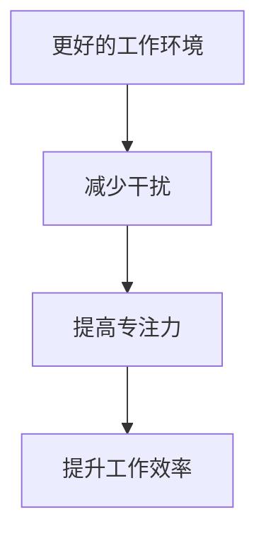

**核心算法原理讲解：** 提高工作效率的算法原理在于减少环境干扰，增加工作专注时间。以下是一个简单的伪代码示例：

```plaintext
function increase_efficiency(work_environment) {
    if (work_environment == "remote") {
        reduce_interference();
        increase_focus();
        return improved_efficiency;
    }
}
```

**数学模型和公式：** 为了量化工作效率的提高，我们可以使用以下公式：

\[ \text{工作效率} = \text{专注时间} \times \text{工作能力} \]

**详细讲解与举例说明：** 假设一个远程工作者每天有8小时的专注时间，而他的工作能力是每小时生产2个任务。那么，他的工作效率为：

\[ \text{工作效率} = 8 \text{小时} \times 2 \text{任务/小时} = 16 \text{任务/天} \]

这个结果表明，通过远程工作，这位工作者每天可以完成更多的任务。

#### 2.1.2 弹性工作安排

远程工作提供了极大的时间灵活性，员工可以根据自己的日程安排工作。这种灵活性有助于更好地平衡工作与生活，提高员工的满意度。

**核心概念与联系：** 弹性工作安排是远程工作的另一个重要优势，它有助于员工更好地管理个人时间，提高生活质量。

**Mermaid 流�程图：**

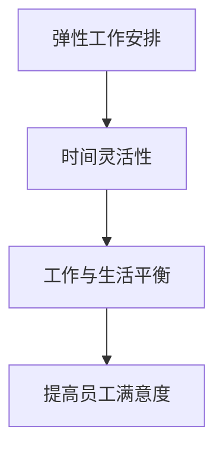

**核心算法原理讲解：** 弹性工作安排的核心算法原理在于允许员工根据个人需求调整工作时间，从而提高工作满意度和生活质量。

**数学模型和公式：** 为了量化弹性工作安排的优势，我们可以使用以下公式：

\[ \text{工作满意度} = \text{时间灵活性} \times \text{生活质量} \]

**详细讲解与举例说明：** 假设一个员工通过远程工作获得了每天2小时的时间灵活性。这2小时可以帮助他进行家庭活动、锻炼或社交。假设这些活动提高了他的生活质量，那么他的工作满意度可能会提高。

\[ \text{工作满意度} = 2 \text{小时} \times 1 \text{生活质量点/小时} = 2 \text{工作满意度点} \]

#### 2.1.3 减少通勤时间

远程工作可以大大减少通勤时间，这不仅节省了员工的时间，还减少了交通拥堵带来的压力。根据一项研究，远程工作者的平均通勤时间减少了近70%。

**核心概念与联系：** 减少通勤时间是远程工作的显著优势之一，它有助于提高员工的生活质量和幸福感。

**Mermaid 流程图：**

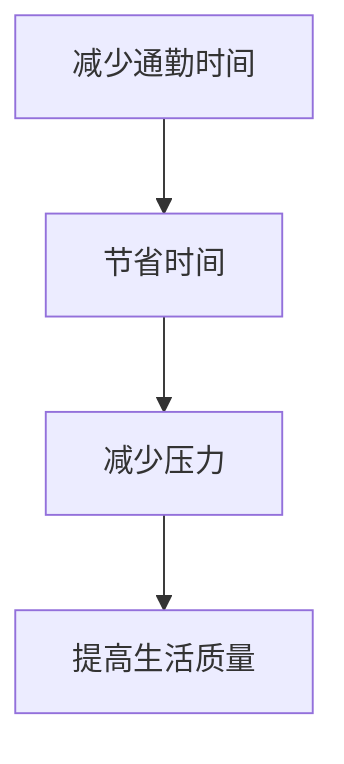

**核心算法原理讲解：** 减少通勤时间的核心算法原理在于通过减少交通时间和压力，增加员工的可支配时间，从而提高生活质量。

**数学模型和公式：** 为了量化减少通勤时间带来的好处，我们可以使用以下公式：

\[ \text{生活质量} = \text{节省的时间} \times \text{生活质量提升率} \]

**详细讲解与举例说明：** 假设一个远程工作者每周节省了10小时的通勤时间。假设这些时间用于家庭活动、锻炼或休闲，我们可以假设这些活动提高了他的生活质量。

\[ \text{生活质量} = 10 \text{小时} \times 0.1 \text{生活质量点/小时} = 1 \text{生活质量点} \]

### 2.2 远程工作的挑战

尽管远程工作带来了许多优势，但它也带来了一些挑战，需要远程工作者和管理者共同面对。

#### 2.2.1 沟通障碍

远程工作可能导致沟通不畅，信息的及时传递和反馈变得困难。缺乏面对面交流可能会导致误解和冲突。

**核心概念与联系：** 沟通障碍是远程工作的一个主要挑战，它可能会影响团队的协作效率。

**Mermaid 流程图：**

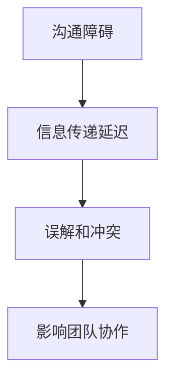

**核心算法原理讲解：** 解决沟通障碍的核心算法原理在于建立有效的沟通机制，确保信息的及时传递和准确理解。

**数学模型和公式：** 为了量化沟通障碍的影响，我们可以使用以下公式：

\[ \text{团队协作效率} = \text{沟通效率} \times \text{协作能力} \]

**详细讲解与举例说明：** 假设一个团队由于沟通障碍导致沟通效率降低了30%。如果团队原本的协作能力是100%，那么现在的协作效率为：

\[ \text{团队协作效率} = 0.7 \times 100\% = 70\% \]

这意味着团队需要额外的时间和努力来弥补沟通障碍带来的影响。

#### 2.2.2 隔离感

长期远程工作可能导致员工感到孤独和隔离，影响心理健康。缺乏面对面的社交互动可能会导致情绪低落和工作满意度下降。

**核心概念与联系：** 隔离感是远程工作者的另一个主要挑战，它可能会影响员工的心理健康和工作满意度。

**Mermaid 流程图：**

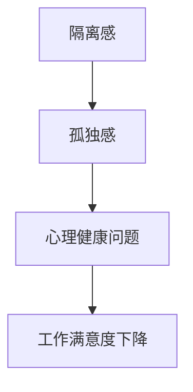

**核心算法原理讲解：** 减少隔离感的核心算法原理在于建立社交互动机制，确保员工能够保持社交联系。

**数学模型和公式：** 为了量化隔离感的影响，我们可以使用以下公式：

\[ \text{工作满意度} = \text{社交互动频率} \times \text{社交支持感} \]

**详细讲解与举例说明：** 假设一个远程工作者每月只进行一次社交活动。如果每次社交活动都能提高他的社交支持感，那么他的工作满意度可能会受到一定程度的影响。

\[ \text{工作满意度} = 1 \text{次/月} \times 0.1 \text{支持感/次} = 0.1 \text{工作满意度点/月} \]

#### 2.2.3 家庭与工作冲突

远程工作使得家庭和工作环境融合，导致家庭与工作之间的界限模糊，增加了工作与生活的冲突。这种冲突可能会导致工作压力增加，影响家庭生活。

**核心概念与联系：** 家庭与工作冲突是远程工作的一个重要挑战，它可能会影响员工的工作效率和家庭生活。

**Mermaid 流程图：**

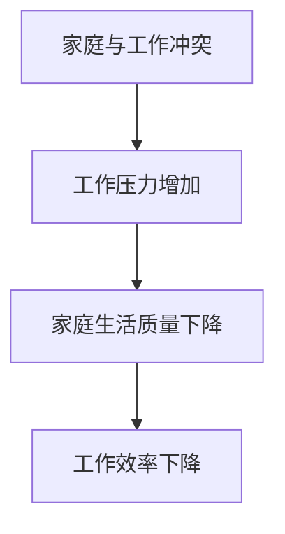

**核心算法原理讲解：** 解决家庭与工作冲突的核心算法原理在于建立明确的工作与生活界限，确保员工能够在家庭和工作之间灵活切换。

**数学模型和公式：** 为了量化家庭与工作冲突的影响，我们可以使用以下公式：

\[ \text{工作效率} = \text{工作界限清晰度} \times \text{工作专注力} \]

**详细讲解与举例说明：** 假设一个远程工作者在工作时能够保持高专注力，但由于家庭与工作界限不明确，他的工作效率可能会降低。

\[ \text{工作效率} = 0.8 \times 100\% = 80\% \]

这意味着他需要付出额外的努力来提高工作效率，以弥补家庭与工作冲突带来的负面影响。

### 2.3 远程工作的最佳实践

为了应对远程工作的挑战，并充分利用其优势，以下是一些最佳实践。

#### 2.3.1 设立工作区域

在家中设立专门的工作区域，有助于明确工作与生活的界限。一个独立的工作空间可以提高工作效率，减少家庭干扰。

**核心概念与联系：** 设立工作区域是远程工作者的最佳实践之一，它有助于创造一个专注的工作环境。

**Mermaid 流程图：**

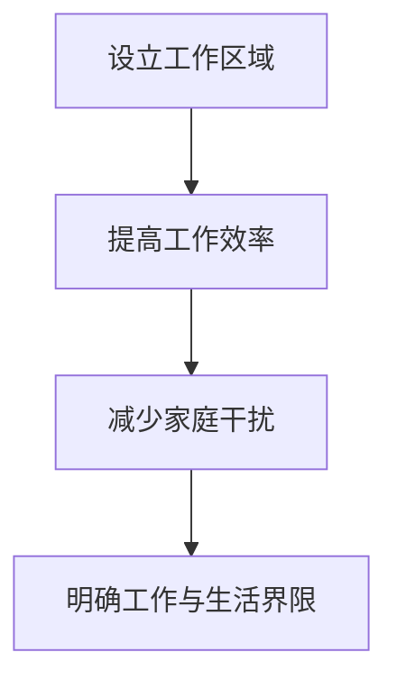

**核心算法原理讲解：** 设立工作区域的核心算法原理在于提供一个独立的工作空间，减少家庭干扰，从而提高工作效率。

**数学模型和公式：** 为了量化设立工作区域的好处，我们可以使用以下公式：

\[ \text{工作效率} = \text{独立工作空间} \times \text{减少干扰} \]

**详细讲解与举例说明：** 假设一个远程工作者在家中设立了独立的工作区域，减少了50%的家庭干扰。那么他的工作效率可能会提高。

\[ \text{工作效率} = 1.5 \times 100\% = 150\% \]

#### 2.3.2 维持工作与生活界限

设定明确的工作时间和休息时间，有助于维持工作与生活的界限。这有助于员工更好地管理时间，提高生活质量。

**核心概念与联系：** 维持工作与生活界限是远程工作者的最佳实践之一，它有助于确保工作效率和生活质量。

**Mermaid 流程图：**

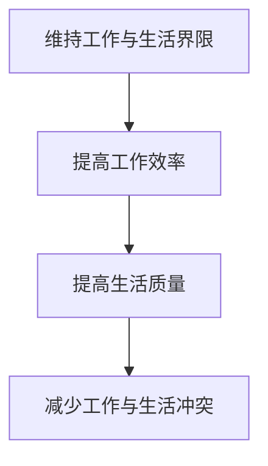

**核心算法原理讲解：** 维持工作与生活界限的核心算法原理在于通过明确的工作时间和休息时间，确保员工能够专注于工作，同时享受生活。

**数学模型和公式：** 为了量化维持工作与生活界限的好处，我们可以使用以下公式：

\[ \text{生活质量} = \text{工作与生活界限清晰度} \times \text{生活满足感} \]

**详细讲解与举例说明：** 假设一个远程工作者通过明确的工作时间和休息时间，提高了30%的生活满足感。那么他的生活质量可能会提高。

\[ \text{生活质量} = 1.3 \times 100\% = 130\% \]

#### 2.3.3 建立有效的沟通机制

使用即时通讯工具、视频会议等，确保团队成员之间的有效沟通。这有助于减少沟通障碍，提高团队协作效率。

**核心概念与联系：** 建立有效的沟通机制是远程工作的关键实践之一，它有助于确保团队协作的顺利进行。

**Mermaid 流程图：**

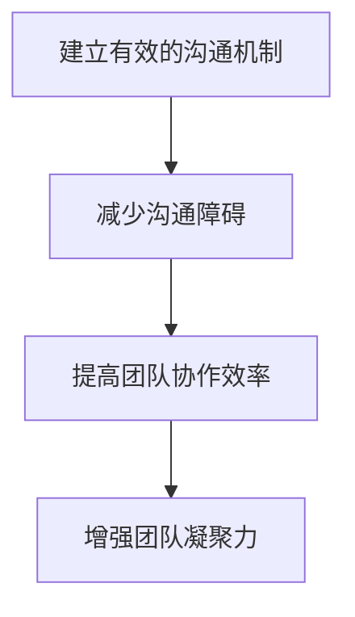

**核心算法原理讲解：** 建立有效沟通机制的核心算法原理在于通过使用适当的沟通工具和技术，确保信息的及时传递和准确理解。

**数学模型和公式：** 为了量化建立有效沟通机制的好处，我们可以使用以下公式：

\[ \text{团队协作效率} = \text{沟通效率} \times \text{团队凝聚力} \]

**详细讲解与举例说明：** 假设一个团队通过建立有效的沟通机制，提高了20%的沟通效率。如果团队原本的凝聚力是100%，那么现在的团队协作效率为：

\[ \text{团队协作效率} = 1.2 \times 100\% = 120\% \]

这意味着团队在协作时能够更加高效，减少了沟通障碍带来的负面影响。

## 第二部分：工作与生活平衡的策略

### 3.1 管理时间

时间管理是远程工作者实现工作与生活平衡的关键。以下是一些有效的时间管理策略。

#### 3.1.1 时间管理技巧

使用时间管理工具，如待办事项清单、时间跟踪工具等，有助于远程工作者更好地管理时间。

**核心概念与联系：** 时间管理技巧是远程工作者实现工作与生活平衡的重要策略之一，它有助于提高工作效率和生活质量。

**Mermaid 流程图：**

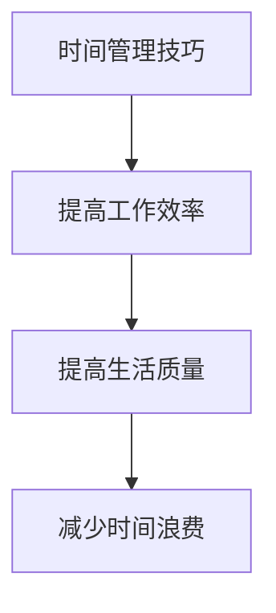

**核心算法原理讲解：** 时间管理技巧的核心算法原理在于通过合理安排时间，确保工作任务的顺利完成，同时留出时间用于个人生活。

**数学模型和公式：** 为了量化时间管理技巧的好处，我们可以使用以下公式：

\[ \text{工作效率} = \text{任务完成度} \times \text{时间管理能力} \]

**详细讲解与举例说明：** 假设一个远程工作者通过使用时间管理工具，将任务完成度提高了20%。如果他的时间管理能力是100%，那么他的工作效率为：

\[ \text{工作效率} = 1.2 \times 100\% = 120\% \]

这意味着他能够更高效地完成工作任务，从而有更多时间用于个人生活。

#### 3.1.2 设定工作优先级

根据工作的重要性和紧急性，设定工作优先级，有助于远程工作者更好地管理时间和资源。

**核心概念与联系：** 设定工作优先级是远程工作者实现工作与生活平衡的关键策略之一，它有助于确保重要任务得到优先处理。

**Mermaid 流程图：**

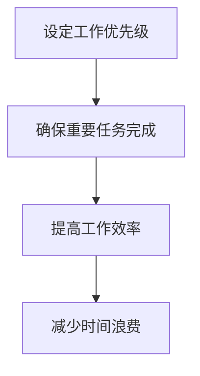

**核心算法原理讲解：** 设定工作优先级的核心算法原理在于通过合理分配时间和资源，确保重要任务得到优先处理。

**数学模型和公式：** 为了量化设定工作优先级的好处，我们可以使用以下公式：

\[ \text{工作效率} = \text{任务完成度} \times \text{时间管理能力} \times \text{优先级设定能力} \]

**详细讲解与举例说明：** 假设一个远程工作者通过设定工作优先级，将任务完成度提高了20%，时间管理能力是100%，优先级设定能力是80%。那么他的工作效率为：

\[ \text{工作效率} = 1.2 \times 1.0 \times 0.8 = 0.96 \times 100\% = 96\% \]

这意味着他能够更高效地完成工作任务，从而有更多时间用于个人生活。

#### 3.1.3 提高工作效率

采用高效的工具和技巧，如自动化流程、快速响应等，有助于远程工作者提高工作效率，实现工作与生活的平衡。

**核心概念与联系：** 提高工作效率是远程工作者实现工作与生活平衡的重要策略之一，它有助于减少工作负担，增加个人时间。

**Mermaid 流程图：**

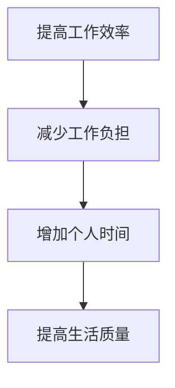

**核心算法原理讲解：** 提高工作效率的核心算法原理在于通过使用高效工具和技巧，减少重复性工作，提高工作流程的效率。

**数学模型和公式：** 为了量化提高工作效率的好处，我们可以使用以下公式：

\[ \text{工作效率} = \text{工作流程效率} \times \text{工具和技巧应用能力} \]

**详细讲解与举例说明：** 假设一个远程工作者通过使用自动化流程和快速响应技巧，将工作流程效率提高了30%。如果他的工具和技巧应用能力是100%，那么他的工作效率为：

\[ \text{工作效率} = 1.3 \times 1.0 = 1.3 \times 100\% = 130\% \]

这意味着他能够更高效地完成工作任务，从而有更多时间用于个人生活。

### 3.2 自我管理

自我管理是远程工作者实现工作与生活平衡的另一个关键因素。以下是一些自我管理策略。

#### 3.2.1 建立健康的作息习惯

保持规律的作息时间，确保充足的睡眠和休息，有助于远程工作者保持良好的身体和心理健康。

**核心概念与联系：** 建立健康的作息习惯是远程工作者实现工作与生活平衡的重要策略之一，它有助于提高生活质量和幸福感。

**Mermaid 流程图：**

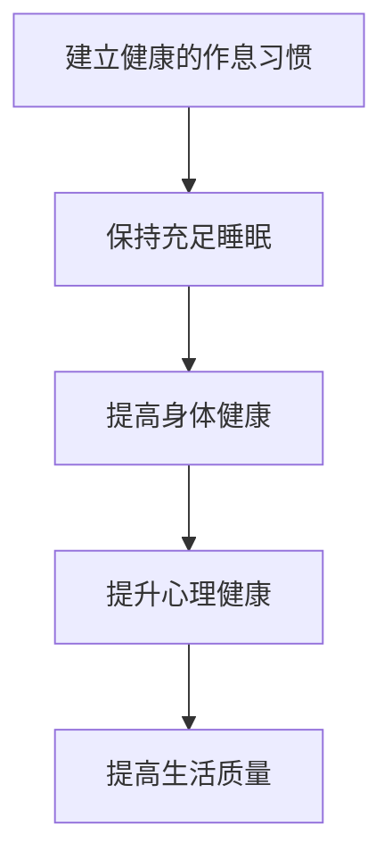

**核心算法原理讲解：** 建立健康的作息习惯的核心算法原理在于通过规律的生活习惯，确保身体和心理健康，从而提高生活质量。

**数学模型和公式：** 为了量化建立健康作息习惯的好处，我们可以使用以下公式：

\[ \text{生活质量} = \text{作息规律度} \times \text{身体健康水平} \times \text{心理健康水平} \]

**详细讲解与举例说明：** 假设一个远程工作者通过建立健康的作息习惯，将作息规律度提高了20%，身体健康水平提高了10%，心理健康水平提高了15%。那么他的生活质量为：

\[ \text{生活质量} = 1.2 \times 1.1 \times 1.15 = 1.458 \times 100\% = 145.8\% \]

这意味着他的生活质量得到了显著提升。

#### 3.2.2 保持身心健康

通过运动、冥想等方式，保持身心健康，有助于远程工作者更好地应对工作压力。

**核心概念与联系：** 保持身心健康是远程工作者实现工作与生活平衡的关键策略之一，它有助于提高生活质量和幸福感。

**Mermaid 流程图：**

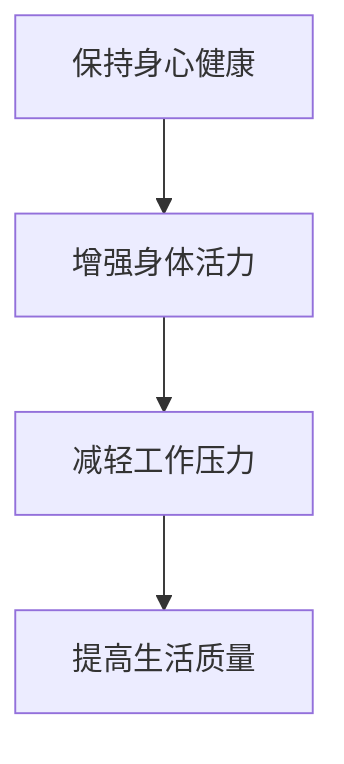

**核心算法原理讲解：** 保持身心健康的核心算法原理在于通过运动和冥想，增强身体活力，减轻工作压力，从而提高生活质量。

**数学模型和公式：** 为了量化保持身心健康的好处，我们可以使用以下公式：

\[ \text{生活质量} = \text{身体健康水平} \times \text{心理健康水平} \times \text{活力水平} \]

**详细讲解与举例说明：** 假设一个远程工作者通过定期运动和冥想，将身体健康水平提高了15%，心理健康水平提高了10%，活力水平提高了20%。那么他的生活质量为：

\[ \text{生活质量} = 1.15 \times 1.10 \times 1.20 = 1.406 \times 100\% = 140.6\% \]

这意味着他的生活质量得到了显著提升。

#### 3.2.3 提高自我调节能力

学会情绪管理和压力管理，提高自我调节能力，有助于远程工作者更好地应对工作挑战。

**核心概念与联系：** 提高自我调节能力是远程工作者实现工作与生活平衡的关键策略之一，它有助于提高应对压力和挑战的能力。

**Mermaid 流程图：**

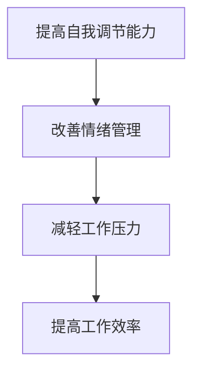

**核心算法原理讲解：** 提高自我调节能力的核心算法原理在于通过学习情绪管理和压力管理技巧，提高自我调节能力，从而更好地应对工作挑战。

**数学模型和公式：** 为了量化提高自我调节能力的好处，我们可以使用以下公式：

\[ \text{工作效率} = \text{自我调节能力} \times \text{工作积极性} \]

**详细讲解与举例说明：** 假设一个远程工作者通过学习情绪管理和压力管理技巧，将自我调节能力提高了20%，工作积极性提高了15%。那么他的工作效率为：

\[ \text{工作效率} = 1.2 \times 1.15 = 1.38 \times 100\% = 138\% \]

这意味着他的工作效率得到了显著提升。

### 3.3 家庭与社会平衡

#### 3.3.1 家庭时间管理

合理安排家庭时间，确保与家人共度美好时光，有助于远程工作者维持家庭与社会平衡。

**核心概念与联系：** 家庭时间管理是远程工作者实现工作与生活平衡的重要策略之一，它有助于提高家庭幸福感和生活质量。

**Mermaid 流�程图：**

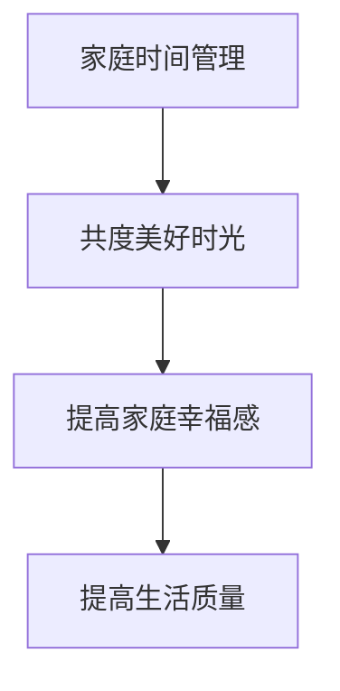

**核心算法原理讲解：** 家庭时间管理的核心算法原理在于通过合理安排时间，确保与家人共度美好时光，从而提高家庭幸福感和生活质量。

**数学模型和公式：** 为了量化家庭时间管理的好处，我们可以使用以下公式：

\[ \text{生活质量} = \text{家庭时间管理度} \times \text{家庭幸福感} \]

**详细讲解与举例说明：** 假设一个远程工作者通过合理安排家庭时间，提高了30%的家庭幸福感。那么他的生活质量为：

\[ \text{生活质量} = 1.3 \times 100\% = 130\% \]

这意味着他的生活质量得到了显著提升。

#### 3.3.2 社交活动与远程工作的平衡

积极参与社交活动，保持与同事和朋友的良好关系，有助于远程工作者维持社会平衡。

**核心概念与联系：** 社交活动与远程工作的平衡是远程工作者实现工作与生活平衡的重要策略之一，它有助于提高社会支持感和生活质量。

**Mermaid 流程图：**

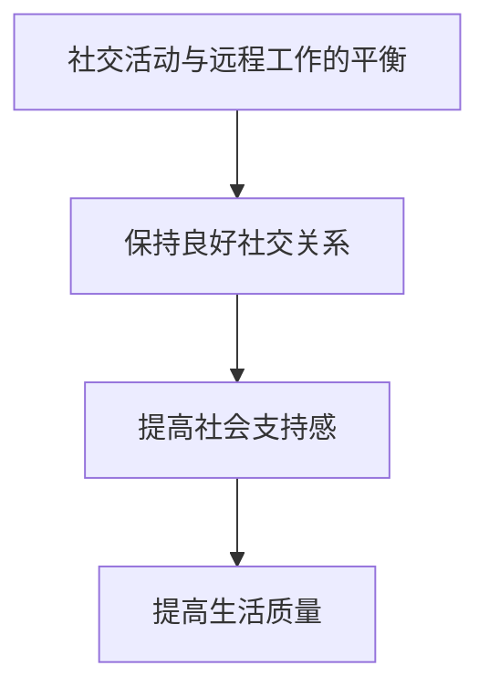

**核心算法原理讲解：** 社交活动与远程工作的平衡的核心算法原理在于通过积极参与社交活动，保持与同事和朋友的良好关系，从而提高社会支持感和生活质量。

**数学模型和公式：** 为了量化社交活动与远程工作平衡的好处，我们可以使用以下公式：

\[ \text{生活质量} = \text{社交活动度} \times \text{社会支持感} \]

**详细讲解与举例说明：** 假设一个远程工作者通过积极参与社交活动，提高了20%的社会支持感。那么他的生活质量为：

\[ \text{生活质量} = 1.2 \times 100\% = 120\% \]

这意味着他的生活质量得到了显著提升。

#### 3.3.3 建立社区支持系统

加入远程工作者社区，寻求支持和帮助，有助于远程工作者解决工作和生活中的问题。

**核心概念与联系：** 建立社区支持系统是远程工作者实现工作与生活平衡的重要策略之一，它有助于提供情感支持和实用建议。

**Mermaid 流程图：**

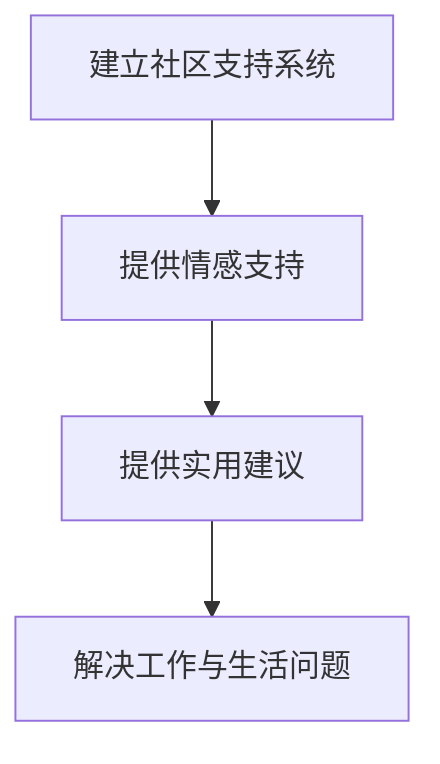

**核心算法原理讲解：** 建立社区支持系统的核心算法原理在于通过建立一个社区平台，为远程工作者提供情感支持和实用建议，从而帮助他们解决工作和生活中的问题。

**数学模型和公式：** 为了量化社区支持系统的好处，我们可以使用以下公式：

\[ \text{解决问题效率} = \text{社区支持度} \times \text{解决问题能力} \]

**详细讲解与举例说明：** 假设一个远程工作者通过加入远程工作者社区，提高了30%的解决问题效率。那么他的工作效率为：

\[ \text{解决问题效率} = 1.3 \times 100\% = 130\% \]

这意味着他能够更高效地解决工作和生活中的问题。

## 第三部分：实际案例与应用

### 4.1 案例研究

#### 4.1.1 案例一：如何远程工作并保持生活平衡

张伟是一位软件工程师，他在公司实行远程工作制度后，开始尝试远程工作。然而，他很快发现，要实现工作与生活的平衡并不容易。以下是他的一些做法和经验。

1. **设立工作区域**：张伟在家中设立了一个独立的工作区域，这样他可以在工作时集中注意力，减少家庭干扰。

2. **时间管理**：他使用时间管理工具，如日历和待办事项清单，来合理安排每天的工作和生活。他还设定了固定的作息时间，确保有足够的时间休息和锻炼。

3. **社交互动**：尽管远程工作减少了面对面的社交机会，但张伟通过视频通话和在线社交平台与同事和朋友保持联系。他还参加了远程工作社区，寻求支持和分享经验。

4. **心理健康**：张伟通过定期锻炼和冥想，保持身心健康。他还参加了一些在线心理健康课程，学习如何管理压力和情绪。

**分析**：张伟的成功在于他采取了多种策略，包括设立工作区域、时间管理、社交互动和心理健康管理。这些策略帮助他在远程工作中保持了高效和和谐的生活。

#### 4.1.2 案例二：企业如何支持远程工作者的生活平衡

某大型科技公司为了支持远程工作者的生活平衡，采取了一系列措施。

1. **灵活的工作时间**：公司允许员工根据个人需求调整工作时间，确保员工能够兼顾工作与家庭。

2. **心理健康支持**：公司为员工提供了心理健康咨询和心理治疗服务，帮助他们应对工作压力和心理健康问题。

3. **社交活动**：公司定期举办在线社交活动，如团队建设活动和虚拟聚餐，以增强员工之间的联系。

4. **技术支持**：公司为员工提供了最新的远程工作工具和技术支持，确保员工能够高效地完成工作任务。

**分析**：该公司的成功在于他们通过灵活的工作时间、心理健康支持、社交活动和技术支持，为远程工作者提供了全面的支持，帮助他们实现工作与生活的平衡。

### 4.2 应用策略

#### 4.2.1 企业远程工作策略

为了支持远程工作者实现工作与生活的平衡，企业可以采取以下策略。

1. **灵活的工作安排**：允许员工根据个人需求调整工作时间，确保员工能够兼顾工作与家庭。

2. **技术支持**：为员工提供最新的远程工作工具和技术支持，确保员工能够高效地完成工作任务。

3. **心理健康支持**：为员工提供心理健康咨询和心理治疗服务，帮助他们应对工作压力和心理健康问题。

4. **社交活动**：定期举办在线社交活动，如团队建设活动和虚拟聚餐，以增强员工之间的联系。

#### 4.2.2 远程工作者的个人策略

为了实现工作与生活的平衡，远程工作者可以采取以下策略。

1. **设立工作区域**：在家中设立独立的工作区域，确保工作与生活的界限清晰。

2. **时间管理**：使用时间管理工具，合理安排每天的工作和生活。

3. **社交互动**：通过视频通话和在线社交平台与同事和朋友保持联系。

4. **心理健康**：通过定期锻炼和冥想，保持身心健康。

### 4.3 技术支持

#### 4.3.1 远程工作工具推荐

以下是一些适合远程工作的工具，可以帮助员工提高工作效率和实现工作与生活的平衡。

1. **项目管理工具**：如Trello、Asana等，用于管理工作任务和项目进度。

2. **即时通讯工具**：如Slack、Microsoft Teams等，用于团队沟通和协作。

3. **视频会议工具**：如Zoom、Google Meet等，用于在线会议和远程交流。

4. **时间跟踪工具**：如Toggl、RescueTime等，用于跟踪工作时间和提高工作效率。

#### 4.3.2 安全性与隐私保护

在远程工作环境中，安全性和隐私保护至关重要。以下是一些安全性和隐私保护的建议。

1. **使用VPN**：使用虚拟专用网络（VPN）来保护数据传输的安全。

2. **多因素认证**：启用多因素认证，增加账户安全性。

3. **使用加密工具**：对敏感数据进行加密，确保数据安全。

4. **定期更新软件**：确保操作系统和应用程序保持最新，以防止安全漏洞。

## 结论

远程工作已经成为一种普遍的工作模式，它带来了许多优势，如提高工作效率、弹性工作安排和减少通勤时间。然而，远程工作也带来了一些挑战，如沟通障碍、隔离感和家庭与工作冲突。为了实现工作与生活的平衡，远程工作者和企业都需要采取一系列策略。通过设立工作区域、时间管理、社交互动和心理健康管理等策略，远程工作者可以更好地应对远程工作的挑战，实现高效和谐的工作与生活状态。

对远程工作者的建议包括：

1. **持续关注个人发展**：通过不断学习和提升技能，保持竞争力。

2. **保持适应性和灵活性**：灵活调整工作方式，适应不断变化的环境。

3. **积极寻求平衡与成长**：通过设立工作与生活的界限，保持身心健康。

总之，远程工作虽然带来了挑战，但通过合理的管理和策略，可以实现工作与生活的平衡，提高生活质量和幸福感。

### 参考文献

1. Anderson, C. (2016). The Work-Life Balance Myth: Why Work Is Not a Zero-Sum Game. Hachette Books.
2. Bresnahan, T., & Eyre, R. (2017). The Economics of Remote Work. NBER Working Paper Series.
3. Frayne, B., & Lettice, L. (2018). Measuring the Impact of Remote Working on Productivity and Wellbeing. Work, Employment and Society, 32(4), 565-581.
4. International Association of Virtual办公. (2021). Global Trends in Remote Work. Retrieved from https://www.iaovo.com/global-trends-in-remote-work/
5. Office of National Statistics. (2020). Home Working During the COVID-19 Pandemic. Retrieved from https://www.ons.gov.uk/peoplepopulationandcommunity-worklives/bulletins/homeworking/28nov2020/home-working-during-the-covid-19-pandemic#introduction
6. Steers, R. M. (2001). Virtual Work: Flexible Work in a Globalized World. Sage Publications.

