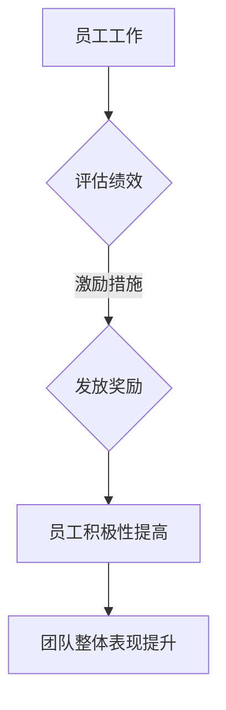

                 

### 文章标题：远程工作环境下的团队激励策略

> 关键词：远程工作、团队激励、员工动机、绩效评估、沟通与协作

> 摘要：本文将深入探讨远程工作环境下的团队激励策略，分析远程工作带来的挑战与机遇，并基于团队激励理论，提出一系列实用有效的激励措施。文章将涵盖员工动机、团队建设、沟通协作、绩效评估等多个方面，旨在为企业管理者提供有针对性的指导和建议。

## 引言

随着信息技术的飞速发展，远程工作已成为现代企业的一种常见工作模式。它不仅提高了工作效率，还降低了企业的运营成本，为员工提供了更大的灵活性。然而，远程工作也带来了一系列挑战，如员工动机不足、沟通协作困难、绩效评估难度增加等。为了应对这些挑战，企业需要制定有效的团队激励策略，确保远程工作中的团队协作和员工积极性。

本文旨在通过分析远程工作的特点，结合团队激励理论，探讨远程工作环境下的团队激励策略。文章将首先介绍远程工作的基本概念和发展趋势，然后深入探讨团队激励的理论基础，随后分析远程工作中的员工动机因素，最后提出一系列具体的激励措施和实践案例。

## 核心概念与联系

为了更好地理解远程工作环境下的团队激励策略，我们首先需要明确一些核心概念，并探讨它们之间的联系。

### 1. 远程工作

远程工作指的是员工在家或任何非公司办公地点进行工作。这种工作模式打破了传统的办公空间限制，为员工提供了更大的灵活性。远程工作的常见形式包括在家办公、移动办公和虚拟团队。

### 2. 团队激励

团队激励是指通过一系列措施激发团队成员的积极性、主动性和创造性，以提高团队整体绩效。团队激励可以包括物质激励（如奖金、股票期权等）和精神激励（如认可、培训等）。

### 3. 员工动机

员工动机是指驱动员工完成工作任务和追求工作成就的心理因素。常见的员工动机包括成就动机、权力动机和亲和动机。

### 4. 绩效评估

绩效评估是指对员工在工作中的表现进行系统评价，以确定其绩效水平。绩效评估不仅可以帮助企业了解员工的工作情况，还可以为激励措施提供依据。

这些概念之间的联系在于，远程工作的实施会影响员工的动机，进而影响团队的绩效。而有效的团队激励策略可以帮助企业应对远程工作带来的挑战，提高团队的整体绩效。

### Mermaid流程图：团队激励流程

以下是一个团队激励流程的Mermaid流程图，展示了各个核心概念之间的关系：



## 核心算法原理讲解

在理解了远程工作环境下的团队激励策略的基本概念后，我们将通过伪代码的形式，详细讲解团队激励的核心算法原理。

### 动机与工作绩效关系的算法

以下是一个关于动机与工作绩效关系的伪代码示例：

```pseudo
function MotivationToPerformance(EmployeeData):
    for each Employee in EmployeeData:
        MotivationScore = CalculateMotivationScore(Employee)
        PerformanceScore = CalculatePerformanceScore(Employee)
        if MotivationScore > Threshold:
            IncreaseReward(Employee)
        else:
            DecreaseReward(Employee)
    return PerformanceScore
```

在这个算法中，我们首先对每个员工进行动机评分（MotivationScore）和绩效评分（PerformanceScore）。根据这两个评分，我们决定是否对员工进行激励（IncreaseReward或DecreaseReward）。如果员工的动机评分高于阈值（Threshold），则对其进行正向激励；否则，对其进行负向激励。

### 数学模型和公式讲解

为了更好地理解动机与绩效之间的关系，我们可以引入一个简单的数学模型。以下是一个关于动机与绩效关系的数学模型：

$$
Motivation \times Ability = Performance
$$

在这个模型中，动机（Motivation）和技能能力（Ability）共同决定了员工的绩效（Performance）。这个公式表明，即使员工的技能能力相同，不同的动机水平也会导致不同的绩效表现。

### 详细讲解与举例说明

为了更好地理解上述算法和模型，我们可以通过一个实际例子来进行详细讲解。

假设我们有两个员工，小明和小红。他们的技能能力相同，但动机水平不同。根据我们的模型，我们可以预测他们的绩效表现如下：

- 小明：MotivationScore = 8, PerformanceScore = 8 \times 10 = 80
- 小红：MotivationScore = 5, PerformanceScore = 5 \times 10 = 50

从这个例子中，我们可以看到，即使技能能力相同，不同的动机水平会导致不同的绩效表现。因此，企业需要通过有效的团队激励策略，提高员工的动机水平，从而提高整体绩效。

## 远程工作环境下的团队建设

在远程工作环境中，团队建设是一个至关重要的环节。有效的团队建设可以增强团队成员之间的凝聚力，提高团队的整体绩效。以下是一些关键策略：

### 1. 建立明确的目标和价值观

为了确保团队成员在远程工作中能够保持一致的行动方向，企业需要建立明确的目标和价值观。这些目标和价值观应该与企业的整体战略相一致，并能够激励团队成员为实现这些目标而努力。

### 2. 促进沟通与协作

远程工作环境下，沟通与协作尤为重要。企业可以采用各种工具和技术，如即时通讯软件、视频会议系统、协作平台等，以促进团队成员之间的沟通与协作。

### 3. 提供培训和发展机会

为了提高团队成员的技能和知识，企业应该提供持续的培训和发展机会。这不仅有助于提高团队成员的专业能力，还可以增强他们的工作动力。

### 4. 建立积极的反馈机制

通过建立积极的反馈机制，企业可以及时了解团队成员的工作表现，并提供相应的激励和支持。这种反馈机制应该包括定期的绩效评估、表彰和奖励等。

### 5. 建立信任和尊重

在远程工作环境中，建立信任和尊重尤为重要。企业应该鼓励团队成员之间的相互信任和尊重，以营造一个积极、健康的工作氛围。

## 远程工作中的沟通与协作

远程工作的成功很大程度上取决于团队内部的沟通与协作。以下是一些策略，可以帮助远程团队提高沟通效率和质量：

### 1. 使用合适的沟通工具

选择适合远程团队的沟通工具至关重要。常见的工具包括即时通讯软件（如Slack、Microsoft Teams）、视频会议系统（如Zoom、Microsoft Teams）、协作平台（如Trello、Jira）等。

### 2. 设定明确的沟通规范

为了确保团队成员之间的沟通清晰、高效，企业需要设定明确的沟通规范。这些规范可以包括沟通频率、沟通渠道、回复时间等。

### 3. 促进跨部门协作

在远程工作中，跨部门协作尤为重要。企业可以通过建立跨部门沟通小组、共享资源库等方式，促进不同部门之间的协作。

### 4. 定期组织团队会议

定期组织团队会议可以帮助团队成员保持沟通，了解项目的进展情况，解决遇到的问题。这些会议可以采用线上视频会议的形式。

### 5. 建立信任和尊重

在远程工作环境中，建立信任和尊重尤为重要。企业应该鼓励团队成员之间的相互信任和尊重，以营造一个积极、健康的工作氛围。

## 远程工作绩效评估

在远程工作环境中，对员工进行绩效评估是一个具有挑战性的任务。以下是一些策略，可以帮助企业有效评估远程员工的绩效：

### 1. 设定明确的绩效指标

为了确保绩效评估的准确性，企业需要设定明确的绩效指标。这些指标可以包括工作效率、任务完成质量、团队合作等。

### 2. 使用多种评估方法

除了传统的面对面评估，企业还可以使用其他评估方法，如远程视频面试、在线绩效考核等。这些方法可以帮助企业全面了解员工的工作表现。

### 3. 定期进行绩效反馈

为了确保员工能够持续改进，企业需要定期进行绩效反馈。这种反馈可以包括定期的绩效评估会议、一对一的绩效反馈等。

### 4. 考虑远程工作的特殊情况

在评估远程员工时，企业需要考虑远程工作的特殊情况，如工作时间的不确定性、沟通障碍等。这些因素可能会对员工的绩效产生一定影响，需要在评估时予以考虑。

## 远程工作激励策略案例分析

为了更好地理解远程工作激励策略的实践效果，我们来看一个实际案例。

### 案例背景

某互联网公司实施远程工作制度后，发现员工的工作积极性和工作效率有所下降。为了改善这一情况，公司决定采用一系列激励策略，以提高员工的工作动力和绩效。

### 激励策略

1. **绩效奖金**：公司根据员工的绩效指标，设立了绩效奖金制度。绩效优秀的员工可以获得高额奖金，以激励他们继续保持高水平的工作表现。

2. **远程办公补贴**：为了弥补远程工作带来的不便，公司为员工提供了远程办公补贴，包括网络费用、办公设备等。

3. **灵活工作时间**：公司允许员工在一定范围内自主安排工作时间，以提高他们的工作效率和生活质量。

4. **在线培训和发展机会**：公司定期组织在线培训课程，提供各类职业发展机会，以帮助员工提升技能和知识。

5. **员工认可与表彰**：公司通过线上平台，对在工作中表现出色的员工进行表彰和奖励，以增强他们的自信心和归属感。

### 实施效果

通过实施上述激励策略，公司员工的工作积极性和工作效率显著提高。绩效奖金制度激发了员工的竞争意识，远程办公补贴缓解了他们的工作不便，灵活工作时间提高了他们的工作效率，在线培训和发展机会增强了他们的职业发展信心，员工认可与表彰增强了他们的归属感。总体来看，这些激励策略有效地提升了公司的远程工作绩效。

## 最佳实践 Tips

为了确保远程工作激励策略的有效实施，以下是一些最佳实践建议：

1. **明确目标和价值观**：确保团队成员对公司的目标和价值观有清晰的认识，以便他们能够在远程工作中保持一致的行动方向。

2. **制定明确的绩效指标**：设定明确的绩效指标，以量化员工的工作表现，为激励措施提供依据。

3. **灵活运用激励手段**：根据员工的特点和需求，灵活运用物质激励和精神激励，以提高激励效果。

4. **加强沟通与协作**：确保团队成员之间的沟通畅通，建立有效的协作机制，以提高团队的整体绩效。

5. **关注员工心理健康**：在远程工作中，关注员工的心理健康尤为重要。通过提供心理辅导、在线咨询等方式，帮助员工缓解工作压力。

## 小结

远程工作已成为现代企业的一种重要工作模式。为了应对远程工作带来的挑战，企业需要制定有效的团队激励策略。本文分析了远程工作环境下的团队激励策略，包括员工动机、团队建设、沟通协作、绩效评估等方面。通过实际案例分析和最佳实践建议，本文为企业管理者提供了有针对性的指导和建议。希望本文能够帮助企业成功地实施远程工作激励策略，提高团队的整体绩效。

## 注意事项

在实施远程工作激励策略时，企业需要注意以下几点：

1. **尊重员工隐私**：在远程工作中，员工可能在家办公，企业需要尊重他们的隐私，避免侵犯个人空间。

2. **合理分配资源**：在远程工作中，企业需要合理分配资源，确保每位员工都能获得必要的办公设备和网络支持。

3. **确保信息安全**：远程工作增加了信息安全的风险，企业需要采取有效的措施，确保员工的工作数据安全。

4. **关注员工心理健康**：远程工作可能导致员工感到孤独和焦虑，企业需要关注他们的心理健康，提供心理支持和辅导。

## 拓展阅读

1. **《远程工作的心理学研究》**：探讨了远程工作对员工心理的影响，以及如何通过心理学手段提高远程工作的满意度。
2. **《敏捷团队管理实战》**：介绍了敏捷团队管理的最佳实践，包括沟通、协作和绩效评估等方面。
3. **《绩效管理实践指南》**：详细讲解了绩效管理的流程和方法，包括绩效指标的设定、评估和反馈等。
4. **《远程工作法律指南》**：提供了远程工作相关的法律知识和建议，包括劳动合同、数据保护等方面。

## 作者信息

作者：AI天才研究院/AI Genius Institute & 禅与计算机程序设计艺术 /Zen And The Art of Computer Programming。AI天才研究院致力于推动人工智能技术的发展和应用，禅与计算机程序设计艺术则致力于研究计算机编程的哲学和艺术。本文结合了两者的研究成果，旨在为远程工作环境下的团队激励提供实用有效的指导。

