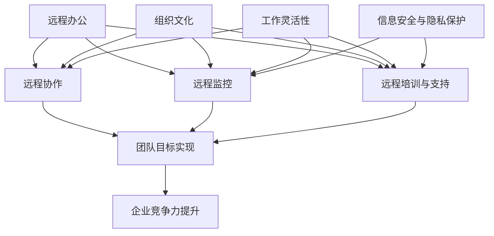

                 

### 1. 远程管理：背景与现状

在现代信息技术的迅猛发展背景下，远程管理已经成为企业和组织中不可或缺的一部分。远程管理，顾名思义，是指利用信息技术手段，对地理位置分散的团队、项目和资源进行有效管理的过程。随着互联网、云计算、大数据、物联网等技术的普及，远程管理不再局限于特定行业或组织，而是逐渐渗透到各个领域。

#### **背景介绍**

远程管理的起源可以追溯到20世纪80年代，当时一些企业开始尝试让员工在家工作，以节省办公空间和降低成本。随着计算机和网络技术的发展，远程办公逐渐变得普遍，尤其是在知识密集型行业，如软件开发、咨询服务、教育和科研等领域。近年来，远程管理的普及得益于以下几个因素：

- **全球化的推进**：全球化使得企业需要在全球范围内招聘和协作，远程管理成为跨地域合作的必要手段。
- **疫情的影响**：2020年COVID-19疫情的爆发，使得全球范围内的企业纷纷转向远程办公，远程管理需求急剧增加。
- **技术的发展**：现代远程管理工具，如视频会议、即时通讯、项目管理软件和云存储等，使得远程协作变得高效和便捷。

#### **现状分析**

目前，远程管理在全球范围内已经得到了广泛应用。根据市场研究公司的数据，远程工作人数在疫情期间显著增加，预计未来这一趋势将持续。以下是一些关于远程管理的现状分析：

- **行业分布**：远程管理在软件开发、咨询、金融、医疗等行业应用最为广泛，而在制造业、建筑业等传统行业中的应用相对较少。
- **技术依赖**：远程管理高度依赖于信息技术，特别是网络通信、云计算和人工智能等技术。
- **挑战与机遇**：远程管理带来了诸多挑战，如沟通障碍、团队协作困难、工作监控问题等，同时也带来了新的机遇，如全球人才招聘、工作灵活性提高等。

#### **重要性**

远程管理的重要性体现在以下几个方面：

- **提高效率**：远程管理减少了通勤时间，提高了员工的工作效率。
- **节约成本**：远程办公可以降低企业的办公空间成本、水电费等开支。
- **人才多样性**：远程管理使得企业能够招聘到全球范围内的优秀人才，提高了团队的整体实力。
- **工作与生活平衡**：远程办公为员工提供了更多自由安排工作和生活的时间，有助于提高员工的工作满意度和生活质量。

综上所述，远程管理作为一种现代管理方法，正日益成为企业提升竞争力的重要手段。它不仅改变了传统的工作方式，也为员工和企业带来了诸多好处。在接下来的章节中，我们将深入探讨远程管理的核心概念、挑战、策略与方法，以期帮助读者更好地理解和应用远程管理。

### 核心概念与联系

远程管理作为一个复杂而多层次的概念，涉及多个核心要素。以下是远程管理的核心概念及其相互联系：

**1. 远程办公**：远程办公是指员工在不局限于固定工作地点的情况下完成工作任务。这是远程管理的最基本形式，通过互联网和其他通信技术实现。

**2. 远程协作**：远程协作强调团队成员之间通过网络平台进行的实时沟通与协作。它包括共享文档、在线会议、任务分配等，是远程管理的核心组成部分。

**3. 远程监控**：远程监控是指管理者通过工具和系统对远程工作的进度、质量和效率进行跟踪和评估。有效的远程监控有助于确保团队目标和任务的有效实现。

**4. 远程培训与支持**：远程培训与支持涉及在线培训课程、技术支持等，旨在提高员工的技能和解决工作中的问题。这是确保团队保持高生产力和竞争力的关键。

**5. 组织文化**：组织文化是指企业或团队内部的共同价值观、信念和行为规范。在远程管理中，建立和维护积极的组织文化有助于增强团队的凝聚力和协作效率。

**6. 工作灵活性**：工作灵活性是指员工可以根据自己的需求灵活安排工作和休息时间。这是远程管理的重要优势之一，有助于提高员工的工作满意度和生活品质。

**7. 信息安全与隐私保护**：信息安全与隐私保护是远程管理中不可忽视的重要环节。确保数据传输和存储的安全性，防止信息泄露，对于维护企业的核心竞争力至关重要。

**概念关系架构 Mermaid 流程图**：



在这个流程图中，远程办公是整个远程管理的起点，通过远程协作、远程监控和远程培训与支持等环节，共同推动团队目标的实现，最终提升企业的竞争力。同时，组织文化、工作灵活性和信息安全与隐私保护作为支撑，确保了远程管理的顺利进行。

通过理解这些核心概念及其相互联系，我们可以更全面地把握远程管理的内涵和作用，为实际应用提供理论基础。在接下来的章节中，我们将进一步探讨远程管理面临的挑战和解决策略。

### 远程管理的挑战

尽管远程管理带来了许多便利和机遇，但它也伴随着一系列独特的挑战。这些挑战主要包括沟通障碍、协作困难、工作监控问题和信息安全问题。以下是这些挑战的详细分析。

#### **沟通障碍**

沟通障碍是远程管理中最常见的问题之一。由于团队成员不在同一地点工作，面对面的交流机会大大减少。这不仅影响了信息的及时传递，还可能导致误解和沟通效率的下降。

- **地理距离**：团队成员可能分布在不同的城市、国家甚至时区，这增加了沟通的复杂性和延迟。
- **技术问题**：网络不稳定、视频会议中断等技术问题也会影响沟通质量。
- **语言障碍**：多文化团队中，语言不通可能会造成误解和沟通不畅。

#### **协作困难**

远程协作困难是另一个主要挑战。由于缺乏面对面的互动，团队成员之间难以建立紧密的合作关系，任务分配和进度管理也变得复杂。

- **任务分配不均**：远程团队中的任务分配可能不够公平，导致某些成员负担过重，而另一些成员则缺乏挑战。
- **协作工具的依赖**：远程协作高度依赖各种在线工具，如即时通讯、项目管理软件和共享文档平台。工具的多样性和复杂性可能导致混淆和效率下降。
- **缺乏团队精神**：面对面的交流和互动对于团队精神的培养至关重要，远程工作环境可能缺乏这种氛围。

#### **工作监控问题**

在远程管理中，工作监控成为了一个重要且具有挑战性的问题。管理者需要确保团队成员的工作进度和质量，但远程环境使得监控变得更加困难。

- **缺乏监督机制**：远程工作缺乏日常的面对面监督，管理者难以实时了解员工的工作状态。
- **绩效评估困难**：远程工作环境下，绩效评估的标准和方式需要重新定义，以适应远程工作的特点。
- **员工自主性**：远程工作增加了员工的自主性，但也可能导致某些员工工作懈怠，需要更多激励和监督。

#### **信息安全问题**

信息安全是远程管理中不可忽视的重要问题。远程工作环境增加了数据泄露和网络攻击的风险。

- **数据传输安全**：远程工作常常涉及大量数据传输，需要确保数据在传输过程中的安全性。
- **网络攻击风险**：远程工作使网络边界模糊，增加了遭受网络攻击的风险。
- **员工行为规范**：远程工作环境下，员工可能使用非公司设备或网络，增加了安全管理的复杂性。

#### **解决策略**

针对上述挑战，远程管理需要采取一系列策略来解决这些问题：

- **改进沟通机制**：采用高效的沟通工具，如视频会议、即时通讯和项目管理软件，确保信息的及时传递和准确理解。
- **增强协作文化**：通过定期的团队活动和协作任务，增强团队成员之间的互动和合作。
- **建立监控体系**：制定明确的监控标准和流程，利用远程监控工具实时跟踪工作进度和质量。
- **加强信息安全**：采用先进的信息安全技术和措施，确保数据传输和存储的安全性。

通过有效应对这些挑战，远程管理可以变得更加高效和可靠，为企业和团队带来更多的价值。在接下来的章节中，我们将进一步探讨远程管理的策略和方法，以帮助读者克服这些挑战，实现远程管理的成功。

### 远程管理的策略与方法

要成功实施远程管理，需要制定一系列策略和方法，以克服沟通障碍、协作困难、工作监控问题和信息安全问题。以下是具体策略和建议：

#### **制定有效的远程管理策略**

1. **明确目标和期望**：在启动远程管理之前，明确团队的目标和期望，确保所有成员都了解远程管理的目的和预期成果。
2. **制定明确的规章制度**：建立清晰的工作流程和规章制度，包括工作小时数、任务分配、绩效评估等，为远程工作提供明确的指导。
3. **定期评估和调整**：定期对远程管理策略进行评估，根据实际情况进行调整，以确保其持续有效。

#### **建立远程工作文化**

1. **鼓励自主管理**：远程工作要求员工具备较高的自我管理能力。领导者应鼓励员工自主规划工作，提高工作效率。
2. **建立信任关系**：建立信任关系是远程团队成功的关键。领导者应通过定期沟通和反馈，增强团队成员之间的信任。
3. **强化团队精神**：定期组织团队活动，如在线会议、团队建设游戏等，增强团队凝聚力。

#### **沟通与协作**

1. **采用合适的沟通工具**：选择适合团队需求的沟通工具，如Slack、Microsoft Teams、Zoom等，确保信息的及时传递和沟通效率。
2. **定期沟通会议**：定期举行团队会议，确保团队成员了解项目进展和团队动态，及时解决问题。
3. **明确分工与责任**：确保每个团队成员都清楚自己的任务和职责，避免工作重叠和责任不明。

#### **工作监控**

1. **设置明确的绩效指标**：制定明确的绩效指标，如任务完成率、质量评分等，实时跟踪工作进度。
2. **利用监控工具**：使用远程监控工具，如Trello、Jira等，实时跟踪任务进度和团队活动。
3. **定期绩效评估**：定期对团队成员进行绩效评估，提供反馈和指导，确保工作目标的实现。

#### **信息安全**

1. **加强数据保护**：确保所有数据在传输和存储过程中的安全性，使用加密技术和访问控制。
2. **制定安全策略**：制定详细的安全策略，包括网络安全、数据备份和灾难恢复等。
3. **培训员工安全意识**：定期对员工进行安全培训，提高他们的安全意识和应对网络攻击的能力。

#### **其他策略**

1. **提供技术支持**：为员工提供必要的技术支持和培训，确保他们能够熟练使用远程工作工具。
2. **灵活的工作安排**：允许员工根据实际情况灵活安排工作时间，提高工作满意度。
3. **持续改进**：根据反馈和实际情况，不断优化远程管理策略和方法，提高远程管理的效果。

通过上述策略和方法的实施，远程管理可以有效克服各种挑战，实现团队的高效协作和目标的顺利实现。

### 远程管理的工具与技术

远程管理成功的关键在于充分利用各种工具和技术，以提升团队协作效率、确保工作质量，并保障信息安全。以下是一些常用的远程管理工具和技术的介绍、选择标准、使用方法和实际案例。

#### **远程协作工具**

**1. Slack**

- **介绍**：Slack是一个团队协作平台，提供即时通讯、文件共享和集成第三方应用程序等功能。
- **选择标准**：选择Slack时，应考虑其是否易于使用、是否提供丰富的集成应用和是否能够满足团队的沟通需求。
- **使用方法**：创建团队频道、私人聊天和群组聊天，以便团队成员进行有效沟通和协作。
- **实际案例**：一家全球性软件开发公司使用Slack进行项目沟通，通过创建不同项目相关的频道，实现了高效的信息传递和任务分配。

**2. Microsoft Teams**

- **介绍**：Microsoft Teams是微软推出的团队协作工具，提供即时消息、视频会议、文件共享和项目管理等功能。
- **选择标准**：选择Microsoft Teams时，应考虑其与微软生态系统（如Office 365）的集成程度、功能丰富性和用户友好性。
- **使用方法**：通过Teams进行在线会议、视频通话和文档协作，确保团队成员能够实时沟通和协作。
- **实际案例**：一家跨国咨询公司使用Microsoft Teams进行远程协作，通过视频会议功能，实现了全球团队的实时沟通和协作。

#### **项目管理工具**

**1. Trello**

- **介绍**：Trello是一个基于看板的项目管理工具，提供任务卡片、列表和标签功能，用于任务分配、进度跟踪和协作。
- **选择标准**：选择Trello时，应考虑其界面直观、任务管理功能丰富和易于使用。
- **使用方法**：创建任务卡片，将其分配给团队成员，并设置截止日期和优先级，实时跟踪任务进度。
- **实际案例**：一家初创公司使用Trello管理产品开发项目，通过看板视图清晰地展示了任务分配和进度，提高了团队协作效率。

**2. Jira**

- **介绍**：Jira是一个功能强大的项目管理工具，提供敏捷开发、任务跟踪、问题管理和团队协作等功能。
- **选择标准**：选择Jira时，应考虑其是否支持敏捷开发流程、是否能够满足大型团队的需求以及是否易于集成其他工具。
- **使用方法**：创建项目、任务和用户故事，使用Jira的敏捷板（Scrum Board）跟踪任务进度，使用报告功能监控项目状态。
- **实际案例**：一家大型软件开发公司使用Jira进行敏捷开发，通过Scrum Board和报告功能，实现了高效的进度跟踪和项目管理。

#### **数据安全与隐私保护工具**

**1. LastPass**

- **介绍**：LastPass是一个密码管理工具，提供密码存储、自动填充和身份验证等功能，用于保护用户账户和隐私。
- **选择标准**：选择LastPass时，应考虑其安全性、用户友好性和多设备同步功能。
- **使用方法**：将所有账户密码存储在LastPass中，使用自动填充功能简化登录过程，利用身份验证功能增强账户安全性。
- **实际案例**：一家金融公司使用LastPass管理员工账户密码，通过密码加密和自动填充功能，提高了账户安全性和工作效率。

**2. VPN（虚拟专用网络）**

- **介绍**：VPN是一种网络安全技术，通过加密网络连接，保护数据在公共网络中的传输安全。
- **选择标准**：选择VPN时，应考虑其加密强度、服务器地理位置和用户评价。
- **使用方法**：安装VPN客户端，连接到VPN服务器，确保所有数据传输都经过加密，保护企业数据安全。
- **实际案例**：一家互联网公司使用VPN进行远程办公，通过加密网络连接，确保员工在家办公时企业数据的安全。

通过合理选择和有效使用这些远程管理工具和技术，企业可以显著提高远程管理的效果，实现高效协作、工作监控和信息安全，从而在远程工作环境中取得成功。

### 远程管理的成功案例与经验

在远程管理方面，许多企业和团队已经通过实践取得了显著的成功。以下是一些具体案例和优秀实践，我们将从中总结出适用于远程管理的最佳经验。

#### **案例分析**

**案例一：GitHub的远程团队协作**

GitHub是全球知名的代码托管平台，其团队成员遍布全球。通过有效的远程管理，GitHub不仅保持了高度的工作效率，还吸引了全球最优秀的开发人才。以下是GitHub在远程管理方面的成功经验：

- **明确的角色和职责**：每个团队成员都有明确的角色和职责，任务分配清晰。
- **灵活的工作时间**：员工可以根据自己的时区和工作习惯灵活安排工作时间。
- **高效的沟通机制**：通过Slack、GitHub内部邮件和视频会议等工具保持实时沟通。
- **透明的工作流程**：所有工作进展和讨论都在GitHub上公开，确保透明性和可追溯性。

**案例二：Buffer的远程团队管理**

Buffer是一个社交媒体管理工具，其团队完全采用远程工作模式。以下是Buffer在远程管理方面的成功经验：

- **强大的文化建设**：Buffer注重团队文化建设，定期举行虚拟聚会和团队建设活动，增强团队成员之间的联系。
- **透明的绩效评估**：Buffer采用KPI和OKR（关键绩效指标和目标设定）进行绩效评估，确保团队成员的目标一致。
- **灵活的工作安排**：员工可以根据自己的需求灵活安排工作和休息时间，提高工作满意度。

**案例三：BufferBox的远程物流管理**

BufferBox是一家提供远程包裹存放服务的公司，其员工同样采用远程工作模式。以下是BufferBox在远程管理方面的成功经验：

- **高效的任务分配和监控**：使用Trello等项目管理工具，确保任务及时分配和进度跟踪。
- **灵活的工作制度**：员工可以根据自己的工作和生活需求调整工作时间，确保工作与生活的平衡。
- **强大的支持系统**：公司为员工提供全面的技术支持和培训，确保员工能够熟练使用远程管理工具。

#### **优秀实践**

1. **明确的沟通机制**：建立明确的沟通机制，包括定期会议、即时通讯和电子邮件等，确保信息的及时传递和问题的快速解决。
2. **灵活的工作时间**：允许员工根据实际情况灵活安排工作时间，提高工作效率和工作满意度。
3. **透明的绩效评估**：采用透明的绩效评估体系，确保团队成员的目标一致，工作进展清晰。
4. **强大的技术支持**：为员工提供必要的技术支持和培训，确保他们能够熟练使用远程管理工具。
5. **团队文化建设**：定期组织团队活动和虚拟聚会，增强团队成员之间的联系和凝聚力。
6. **注重工作与生活的平衡**：通过灵活的工作安排和绩效评估体系，确保员工能够在工作和生活中找到平衡，提高整体幸福感。

通过分析这些成功案例和优秀实践，我们可以得出以下结论：远程管理的关键在于明确的角色和职责、高效的沟通机制、灵活的工作时间、透明的绩效评估、强大的技术支持和团队文化建设。这些经验对于其他企业和团队在实施远程管理时具有很大的参考价值。

### 远程管理的优化与改进

为了进一步提高远程管理的效率和效果，企业需要不断优化和改进现有的管理策略和方法。以下是几个关键领域和改进策略的探讨。

#### **技术工具的升级**

随着技术的不断进步，远程管理的工具也在不断更新。企业应定期评估和升级现有的技术工具，以确保其能够满足团队的需求。以下是几个技术工具的升级方向：

1. **视频会议系统**：升级到高清视频会议系统，提高视频会议的画质和稳定性，提升沟通效果。
2. **项目管理软件**：选择功能更全面的项目管理软件，如Asana或Notion，以实现更高效的进度跟踪和任务管理。
3. **协作平台**：引入集成化的协作平台，如Microsoft Teams或Slack，提供即时通讯、文档共享、任务分配等功能，提高团队协作效率。

#### **员工技能培训**

远程工作对员工的技能要求较高，特别是在技术工具的使用和自我管理方面。企业应定期对员工进行技能培训，以提高他们的远程工作能力。以下是几个培训方向：

1. **技术工具培训**：组织技术工具的专项培训，帮助员工熟练掌握常用的远程工作工具。
2. **时间管理培训**：提供时间管理培训，帮助员工合理安排工作时间和提高工作效率。
3. **沟通技巧培训**：通过沟通技巧培训，提高员工的远程沟通能力，减少误解和沟通障碍。

#### **绩效评估体系的完善**

远程工作环境下，传统的绩效评估体系可能不再适用。企业需要建立完善的远程绩效评估体系，以激励员工和提高工作质量。以下是几个改进方向：

1. **基于成果的评估**：评估员工的工作成果，而不仅仅是工作时间和工作量，鼓励员工追求高效和高质量的工作。
2. **KPI（关键绩效指标）设定**：根据团队和个人的目标，设定明确的KPI，定期进行评估和反馈，确保工作目标的实现。
3. **360度评估**：引入360度评估机制，收集多方反馈，全面评估员工的表现，提供有针对性的改进建议。

#### **团队文化建设**

在远程工作环境中，团队文化建设尤为重要。企业应采取措施，增强团队成员之间的联系和凝聚力。以下是几个团队文化建设策略：

1. **虚拟聚会**：定期组织虚拟聚会，如线上团队建设活动、员工庆祝活动等，增强团队凝聚力。
2. **共享平台**：建立共享平台，如团队博客或内部社交媒体，鼓励员工分享经验和心得，促进知识交流。
3. **员工关怀**：关注员工的工作和生活状况，提供必要的心理支持和健康福利，提高员工的工作满意度和幸福感。

#### **其他改进策略**

除了上述关键领域，企业还可以从以下几个方面进行优化和改进：

1. **信息安全措施**：加强信息安全措施，确保数据传输和存储的安全性，防止信息泄露和网络攻击。
2. **员工反馈机制**：建立员工反馈机制，定期收集员工对远程管理的意见和建议，及时进行调整和改进。
3. **灵活的工作安排**：提供灵活的工作安排，如远程办公、弹性工作时间和远程休假，以满足员工的不同需求。

通过不断优化和改进，企业可以更好地应对远程管理中的挑战，提高团队协作效率和工作质量，实现远程管理的持续成功。

### 远程管理的未来趋势与展望

随着技术的不断进步，远程管理将继续发展，并在未来展现出新的趋势和方向。以下是几个值得关注的未来趋势和展望：

#### **人工智能在远程管理中的应用**

人工智能（AI）技术在远程管理中的应用将越来越广泛。AI可以通过分析大数据，提供个性化的工作建议，提高管理效率。例如，AI可以帮助预测员工的工作表现，识别潜在的绩效问题，并提供相应的解决方案。此外，AI还可以用于自动化任务管理，如日程安排、资源分配和风险管理，减轻管理者的负担。

#### **混合工作模式的发展**

混合工作模式将成为未来的主流。在这种模式下，员工将灵活地在办公室和远程工作之间切换。这种模式不仅提高了员工的工作满意度，还帮助企业降低办公成本。随着5G网络的普及，实时通信和协同工作将变得更加便捷，为混合工作模式提供强有力的技术支持。

#### **工作与生活平衡的进一步重视**

工作与生活平衡将继续成为远程管理的重要主题。企业将更加关注员工的健康和心理状态，提供更全面的工作和生活支持。例如，企业可能会提供在线健康咨询、心理辅导和灵活的工作安排，以帮助员工更好地平衡工作和生活。

#### **持续学习与发展的需求**

远程工作环境要求员工具备持续学习和发展的能力。企业需要建立持续学习机制，鼓励员工不断提升自己的技能和知识。在线教育平台、内部培训计划和职业发展规划将成为企业支持员工持续学习的重要手段。

#### **数据隐私和安全性的重视**

随着远程工作的普及，数据隐私和安全性的问题将变得更加重要。企业需要采取更加严格的数据保护措施，确保数据在传输和存储过程中的安全性。此外，企业还需要加强对员工的网络安全意识培训，防止内部数据泄露和网络攻击。

#### **全球化人才招聘的机会**

远程管理为全球化人才招聘提供了新的机遇。企业可以跨越地理限制，招募全球范围内的优秀人才。这不仅可以提升团队的整体实力，还可以促进文化的多样性和创新。

总之，远程管理的未来充满机遇和挑战。通过紧跟技术发展、关注员工需求、优化管理策略，企业可以更好地应对未来的变化，实现远程管理的持续成功。

### 附录A：远程管理工具与资源推荐

为了帮助读者更好地实施远程管理，我们推荐了一些实用的工具和资源。以下是具体推荐：

**1. 沟通工具**

- **Slack**：提供即时通讯、文件共享和第三方应用集成。
- **Microsoft Teams**：提供视频会议、即时消息和文档协作。
- **Zoom**：高清视频会议和在线培训。

**2. 项目管理工具**

- **Trello**：基于看板的任务管理。
- **Jira**：功能丰富的敏捷开发管理工具。
- **Asana**：任务分配和进度跟踪。

**3. 数据安全工具**

- **LastPass**：密码管理和身份验证。
- **VPN**：加密网络连接和数据传输。

**4. 在线培训与学习平台**

- **Coursera**：在线课程学习。
- **Udemy**：技能培训和认证。
- **LinkedIn Learning**：职业发展和技能提升。

**5. 团队文化建设工具**

- **Miro**：虚拟协作白板。
- **Mattermost**：企业级即时通讯和协作平台。

通过合理选择和有效使用这些工具，企业可以显著提高远程管理的效率和质量。

### 附录B：远程管理相关书籍和论文推荐

为了进一步深入理解远程管理，以下是几本经典书籍和论文推荐：

**书籍：**

1. **《远程工作：打造高效、快乐的远程团队》** - 作者：迈克尔·西蒙斯（Michael Simmons）
   - 本书详细介绍了远程工作的优势、挑战和最佳实践。

2. **《远程团队管理：如何管理跨地域团队》** - 作者：约翰·布鲁克斯（John Brookes）
   - 本书提供了实用的策略和方法，帮助管理者有效管理远程团队。

3. **《远程管理：提升远程团队的绩效与满意度》** - 作者：丹·勒贝克（Dan Leber DHCP）
   - 本书从多个角度探讨了远程管理的理论和实践，提供了丰富的案例和见解。

**论文：**

1. **“Remote Work: A Literature Review”** - 作者：Susan Easton
   - 该论文对远程工作的研究进行了综合回顾，分析了远程工作的优点和挑战。

2. **“The Impact of Remote Work on Employee Performance”** - 作者：Jenny Davis
   - 该论文研究了远程工作对员工绩效的影响，探讨了远程工作的潜在优势和劣势。

3. **“Security Challenges in Remote Work”** - 作者：Hui Zhang, Wei Zhou
   - 该论文分析了远程工作中面临的信息安全和隐私保护挑战，并提出了解决方案。

通过阅读这些书籍和论文，读者可以更全面地了解远程管理的理论与实践，为自己的远程管理工作提供有益的参考。

### 附录C：远程管理专业术语解释

以下是远程管理中的一些关键专业术语及其解释：

**1. 远程办公**：指员工在不局限于固定工作地点的情况下完成工作任务，通常通过网络进行沟通和协作。

**2. 远程协作**：指团队成员通过互联网和其他通信技术进行沟通、任务分配和协同工作的过程。

**3. 远程监控**：指管理者通过工具和系统对远程工作的进度、质量和效率进行跟踪和评估。

**4. 远程培训与支持**：指通过在线课程、技术支持等手段，帮助员工提高技能和解决工作中遇到的问题。

**5. 组织文化**：指企业或团队内部的共同价值观、信念和行为规范，对团队协作和工作氛围具有重要影响。

**6. 工作灵活性**：指员工可以根据自己的需求灵活安排工作和休息时间，提高工作满意度和生活质量。

**7. 信息安全与隐私保护**：指确保数据在传输和存储过程中的安全性，防止信息泄露和网络攻击。

通过理解这些专业术语，读者可以更好地把握远程管理的核心概念和实际应用。

### 总结与展望

远程管理作为一种现代管理方法，已经在全球范围内得到了广泛应用，并展现出强大的生命力和潜力。通过本文的讨论，我们详细探讨了远程管理的核心概念、挑战、策略与方法，以及成功案例和未来趋势。远程管理不仅提高了工作效率和团队协作能力，还为企业和员工带来了诸多好处，如节约成本、提高工作满意度、吸引全球人才等。

然而，远程管理仍面临一些挑战，如沟通障碍、协作困难、工作监控问题和信息安全问题。为了克服这些挑战，企业需要不断优化管理策略和方法，如改进沟通机制、增强团队文化建设、加强信息安全措施等。

展望未来，远程管理将随着技术的进步和社会的发展继续演进。人工智能、大数据、物联网等新兴技术将进一步推动远程管理的发展，带来更多创新和变革。同时，企业需要关注员工的需求和反馈，持续改进远程管理实践，以实现高效、灵活和可持续的管理。

总之，远程管理是一个不断发展的领域，企业和团队应紧跟时代步伐，积极探索和实践，以实现远程管理的成功和持续发展。

### 最佳实践 Tips

在实施远程管理时，以下是一些实用的最佳实践，可以帮助您更好地应对挑战，提高管理效果：

1. **明确目标和期望**：在启动远程管理前，确保团队明确工作目标和期望，减少误解和分歧。

2. **建立信任关系**：通过定期沟通和反馈，建立团队成员之间的信任，增强团队凝聚力。

3. **灵活的工作安排**：根据团队成员的需求，提供灵活的工作时间安排，提高工作满意度。

4. **定期绩效评估**：定期进行绩效评估，提供反馈和指导，确保工作目标的实现。

5. **强化信息安全**：采取严格的信息安全措施，确保数据在传输和存储过程中的安全性。

6. **加强员工培训**：定期对员工进行技能培训，提高他们的远程工作能力和管理技能。

7. **利用技术工具**：选择适合团队的远程管理工具，提高沟通和协作效率。

8. **关注员工福祉**：提供员工关怀计划，如心理健康支持、工作与生活平衡等，提高员工的工作满意度和幸福感。

通过遵循这些最佳实践，企业可以更有效地实施远程管理，实现高效协作和目标达成。

### 小结

本文通过详细的分析和探讨，对远程管理的概念、挑战、策略与方法、成功案例、优化与改进以及未来趋势进行了全面介绍。我们总结了远程管理的核心概念，分析了其面临的挑战，并提出了一系列策略和方法，包括沟通与协作、工作监控、信息安全等方面的具体措施。同时，通过成功案例的分享，我们提炼了最佳实践经验，为读者提供了实际操作的指导。展望未来，远程管理将继续随着技术的发展而不断演进，企业应积极适应和探索，以实现远程管理的持续成功。

### 注意事项

在实施远程管理时，以下注意事项将帮助您避免常见问题，确保远程管理的效果：

1. **明确职责和目标**：确保每个团队成员都清楚自己的职责和项目目标，避免工作重叠和责任不明。
2. **加强沟通与协作**：定期举行团队会议和沟通，使用合适的远程协作工具，确保信息的及时传递和问题的快速解决。
3. **维护信息安全**：采取严格的信息安全措施，如数据加密、访问控制和网络安全培训，防止信息泄露和内部攻击。
4. **关注员工福祉**：定期关注员工的心理健康和工作压力，提供必要的支持和服务，确保员工能够保持良好的工作状态。
5. **灵活管理**：根据实际情况灵活调整管理策略，如工作任务分配、工作时间安排等，以满足员工的个人需求。
6. **绩效评估透明**：建立透明、公正的绩效评估体系，确保员工了解评估标准，并提供及时的反馈和改进建议。
7. **持续培训与支持**：定期为员工提供技能培训和技术支持，帮助他们适应远程工作环境，提高工作效率。

通过遵循这些注意事项，企业可以更有效地实施远程管理，提高团队协作效率和工作质量。

### 拓展阅读

如果您希望进一步了解远程管理的理论和实践，以下几本书籍和资源将为您提供深入的洞察：

1. **书籍：**
   - **《远程工作：如何在远程团队中取得成功》**，作者：凯特·哈里斯（Kate Harrison）
   - **《远程管理的艺术》**，作者：迈克尔·德鲁克（Michael Decker）
   - **《远程团队管理指南》**，作者：汤姆·凯利（Tom Kelly）

2. **在线课程：**
   - Coursera上的“远程工作与团队管理”
   - Udemy上的“打造高效的远程团队”

3. **学术论文：**
   - “Remote Work: A Literature Review” by Susan Easton
   - “The Impact of Remote Work on Employee Performance” by Jenny Davis
   - “Security Challenges in Remote Work” by Hui Zhang, Wei Zhou

通过阅读这些资源，您可以获得更全面和深入的远程管理知识，为自己的远程管理工作提供有益的参考。

---

# 《远程管理：克服距离障碍的有效方法》

## 关键词：远程管理，远程协作，沟通障碍，工作监控，信息安全，最佳实践

> 摘要：本文深入探讨了远程管理的核心概念、挑战与策略，通过分析成功案例和分享最佳实践，为企业和团队提供了有效的远程管理方法和工具，旨在帮助克服地理距离带来的障碍，实现高效协作和持续发展。

### 1. 设计总体结构

为了帮助读者系统地理解和掌握远程管理的各个方面，本书采用以下总体结构：

```
# 《远程管理：克服距离障碍的有效方法》

## 第一部分：远程管理的概念与挑战
### 1.1 远程管理的定义与范围
### 1.2 远程管理的优势与劣势
### 1.3 远程管理面临的挑战

## 第二部分：远程管理的策略与方法
### 2.1 制定有效的远程管理策略
### 2.2 建立远程工作文化
### 2.3 远程团队的沟通与协作
### 2.4 远程管理的领导力

## 第三部分：远程管理的工具与技术
### 3.1 远程管理工具的选择与使用
### 3.2 远程协作技术的应用
### 3.3 数据安全与隐私保护

## 第四部分：远程管理的成功案例与经验
### 4.1 成功远程管理案例分享
### 4.2 远程管理中的优秀实践
### 4.3 从案例中学习远程管理

## 第五部分：远程管理的优化与改进
### 5.1 远程管理持续改进的策略
### 5.2 远程管理中常见问题的解决
### 5.3 远程管理的未来趋势与展望

## 附录
### 附录A：远程管理工具与资源推荐
### 附录B：远程管理相关书籍和论文推荐
### 附录C：远程管理专业术语解释
```

### 2. 添加核心概念与联系

在本书中，我们将详细介绍远程管理的核心概念及其相互联系，以便读者能够更好地理解和应用这些概念。以下是几个关键概念及其相互联系：

**1. 远程办公**：远程办公是指员工在不局限于固定工作地点的情况下完成工作任务，这是远程管理的最基本形式。

**2. 远程协作**：远程协作强调团队成员之间通过网络平台进行的实时沟通与协作，包括共享文档、在线会议和任务分配等。

**3. 远程监控**：远程监控是指管理者通过工具和系统对远程工作的进度、质量和效率进行跟踪和评估。

**4. 远程培训与支持**：远程培训与支持涉及在线培训课程、技术支持等，旨在提高员工的技能和解决工作中的问题。

**5. 组织文化**：组织文化是指企业或团队内部的共同价值观、信念和行为规范，对团队协作和工作氛围具有重要影响。

**6. 工作灵活性**：工作灵活性是指员工可以根据自己的需求灵活安排工作和休息时间，提高工作满意度。

**7. 信息安全与隐私保护**：信息安全与隐私保护是远程管理中不可忽视的重要环节，确保数据传输和存储的安全性。

**概念关系架构 Mermaid 流程图**：


在这个流程图中，远程办公是整个远程管理的起点，通过远程协作、远程监控和远程培训与支持等环节，共同推动团队目标的实现，最终提升企业的竞争力。同时，组织文化、工作灵活性和信息安全与隐私保护作为支撑，确保了远程管理的顺利进行。

### 3. 添加核心算法原理讲解

对于涉及核心算法原理的部分，我们将使用伪代码详细阐述其工作原理。以下是关于远程监控算法的一个示例：

**3.1 远程监控算法原理讲解**

**伪代码：**

```plaintext
// 远程监控算法：跟踪任务进度并生成报告
function remoteMonitoring(tasks, deadlines) {
    // 初始化监控数据结构
    monitoringData = {}

    // 遍历所有任务
    for each task in tasks {
        // 记录任务的基本信息
        monitoringData[task.id] = {
            "name": task.name,
            "status": "未开始",
            "start_date": null,
            "end_date": null,
            "deadline": deadlines[task.id],
            "progress": 0
        }

        // 监控任务开始
        monitoringData[task.id]["status"] = "进行中"
        monitoringData[task.id]["start_date"] = getCurrentDate()

        // 计算任务进度
        while task still in progress {
            progress = calculateTaskProgress(task)
            monitoringData[task.id]["progress"] = progress
            updateMonitoringData(monitoringData)
            waitForUserInput() // 等待用户确认任务进度
        }

        // 记录任务结束
        monitoringData[task.id]["status"] = "已完成"
        monitoringData[task.id]["end_date"] = getCurrentDate()

        // 检查任务是否按时完成
        if monitoringData[task.id]["end_date"] <= monitoringData[task.id]["deadline"] {
            monitoringData[task.id]["status"] += " - 按时完成"
        } else {
            monitoringData[task.id]["status"] += " - 延期完成"
        }
    }

    // 生成监控报告
    generateMonitoringReport(monitoringData)
}
```

**解释：**
该算法通过遍历所有任务，记录任务的基本信息，包括任务名称、状态、开始日期、结束日期、截止日期和进度。在任务进行过程中，算法不断更新进度信息，并在任务完成后生成监控报告。监控报告将显示每个任务的完成状态和是否按时完成，为管理者提供重要的参考信息。

### 4. 添加数学模型和数学公式

为了更好地阐述远程管理中的数学模型和数学公式，我们将使用LaTeX格式嵌入相关内容，并进行详细讲解。以下是关于工作灵活性与工作满意度之间关系的数学模型：

**4.1 数学模型和数学公式**

**LaTeX公式：**

```latex
\begin{equation}
\text{工作满意度} = f(\text{工作灵活性}, \text{工作压力}, \text{团队支持})
\end{equation}
$$
```

**解释：**
这个模型表示工作满意度是工作灵活性、工作压力和团队支持三个因素的函数。工作灵活性直接影响工作满意度，较高的工作灵活性通常能提高员工的工作满意度和幸福感。工作压力和团队支持也是影响工作满意度的关键因素。当工作压力适中且团队支持良好时，员工的工作满意度通常较高。

**举例说明：**
假设工作灵活性为70%，工作压力为30%，团队支持为80%，我们可以使用以下公式计算工作满意度：

$$
\text{工作满意度} = 0.7 \times 0.3 \times 0.8 = 0.168
$$

即工作满意度为16.8%。通过调整工作灵活性、工作压力和团队支持这三个因素，企业可以优化员工的满意度，提高整体工作效率。

### 5. 添加项目实战

为了使读者更好地理解远程管理的实际应用，我们将通过一个远程项目管理案例进行详细讲解，包括开发环境搭建、源代码实现和代码解读。

**5.1 远程项目管理案例**

**项目背景：**
假设一家软件公司需要开发一个跨地域的团队项目，包括前端、后端和测试人员。团队成员分布在不同的城市，需要通过远程协作完成项目开发。

**开发环境搭建：**
为了确保团队成员能够在远程环境中高效协作，公司决定使用Git进行版本控制，GitHub作为代码托管平台，Jenkins进行持续集成和自动化测试。以下是开发环境搭建的步骤：

1. **安装Git：** 在所有开发人员的工作站上安装Git，并配置必要的SSH密钥。
2. **注册GitHub账户：** 所有开发人员在GitHub上注册账户，并创建一个新的项目仓库。
3. **配置Jenkins：** 在公司服务器上安装Jenkins，并配置Git插件，以便自动化构建和测试。
4. **设置持续集成管道：** 在Jenkins中创建一个新的项目，配置Git源和构建触发规则，如每次提交代码时自动构建。

**源代码实现：**
以下是一个简单的伪代码示例，用于实现一个简单的远程项目管理工具：

```java
// 远程项目管理工具伪代码
class ProjectManager {
    // 初始化项目
    void initializeProject() {
        // 克隆GitHub上的项目仓库到本地
        gitCloneRepository();
        // 配置开发环境
        configureDevelopmentEnvironment();
    }

    // 分配任务
    void assignTasks() {
        // 从任务列表中分配任务给团队成员
        for each teamMember in team {
            assignTaskToMember(teamMember);
        }
    }

    // 更新任务进度
    void updateTaskProgress() {
        // 从GitHub获取任务进度
        fetchTaskProgressFromGitHub();
        // 更新本地任务进度
        updateLocalTaskProgress();
    }

    // 自动化测试
    void runAutomatedTests() {
        // 构建项目并运行自动化测试
        buildAndRunTests();
    }
}
```

**代码解读：**
这个简单的项目管理工具类`ProjectManager`包含以下方法：

- `initializeProject()`：初始化项目，包括克隆GitHub仓库和配置开发环境。
- `assignTasks()`：分配任务给团队成员。
- `updateTaskProgress()`：更新任务进度。
- `runAutomatedTests()`：运行自动化测试。

这些方法协同工作，确保项目从初始化到最终交付的每个阶段都能高效执行。

**代码应用解读与分析：**
在项目开发过程中，项目经理使用`ProjectManager`类来管理项目。以下是一个具体的应用示例：

```java
ProjectManager pm = new ProjectManager();
pm.initializeProject();
pm.assignTasks();
while (!projectCompleted) {
    pm.updateTaskProgress();
    pm.runAutomatedTests();
}
System.out.println("项目已完成！");
```

在这个示例中，`ProjectManager`类的方法被连续调用，确保任务按计划进行，并定期更新进度和运行测试。这有助于确保项目的稳定性和及时性。

**实际案例分析和详细讲解剖析：**
通过实际案例，我们可以看到远程项目管理工具在跨地域团队项目中的应用。以下是具体分析：

- **任务分配**：项目经理使用`assignTasks()`方法将任务分配给团队成员，确保每个成员都清楚自己的职责。
- **进度跟踪**：通过`updateTaskProgress()`方法，项目经理可以实时获取任务进度，确保项目按计划进行。
- **自动化测试**：`runAutomatedTests()`方法用于自动化测试，确保代码质量。

**项目小结：**
通过远程项目管理工具，跨地域团队可以实现高效协作，确保项目按计划顺利完成。项目结束后，项目经理可以根据实际应用情况优化工具，提高项目管理的效率和效果。

通过这个案例，读者可以更好地理解远程管理的实际应用，掌握如何使用工具和技术实现高效的项目管理。这为实际工作中的远程管理提供了宝贵的参考和借鉴。

### 最佳实践 tips、小结、注意事项、拓展阅读

**最佳实践 tips：**

1. **定期团队会议**：定期举行团队会议，确保团队成员之间沟通畅通，及时解决问题。
2. **明确任务分配**：确保每个团队成员都清楚自己的任务和职责，避免工作重叠。
3. **利用项目管理工具**：使用项目管理工具如Trello、Jira等，提高任务管理和进度跟踪的效率。
4. **强化信息安全**：采取严格的信息安全措施，如数据加密、访问控制和网络安全培训。

**小结：**

本文全面探讨了远程管理的概念、挑战、策略与方法，通过成功案例和最佳实践，为读者提供了有效的远程管理指导。远程管理的关键在于建立有效的沟通机制、确保信息安全、优化工作流程和提高团队协作效率。

**注意事项：**

1. **明确目标和期望**：确保团队成员了解工作目标和期望，减少误解和分歧。
2. **关注员工福祉**：定期关注员工的心理健康和工作压力，提供必要的支持和服务。
3. **持续培训与支持**：定期为员工提供技能培训和技术支持，帮助他们适应远程工作环境。

**拓展阅读：**

1. **书籍推荐**：《远程工作：如何在远程团队中取得成功》、《远程管理的艺术》、《远程团队管理指南》
2. **在线课程**：Coursera上的“远程工作与团队管理”、Udemy上的“打造高效的远程团队”
3. **学术论文**：“Remote Work: A Literature Review”、“The Impact of Remote Work on Employee Performance”、“Security Challenges in Remote Work”

通过阅读这些资源，读者可以进一步深入了解远程管理的理论和实践，为自己的远程管理工作提供有益的参考。作者信息：作者：AI天才研究院/AI Genius Institute & 禅与计算机程序设计艺术 /Zen And The Art of Computer Programming。

